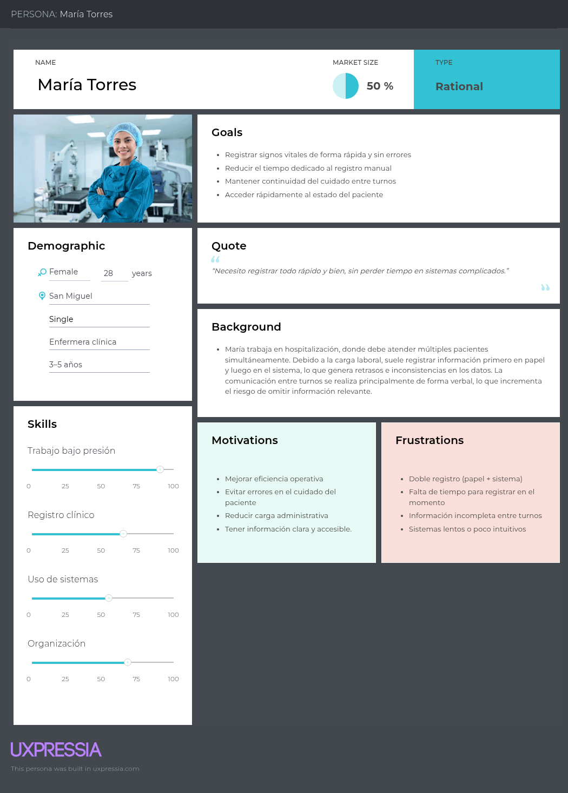
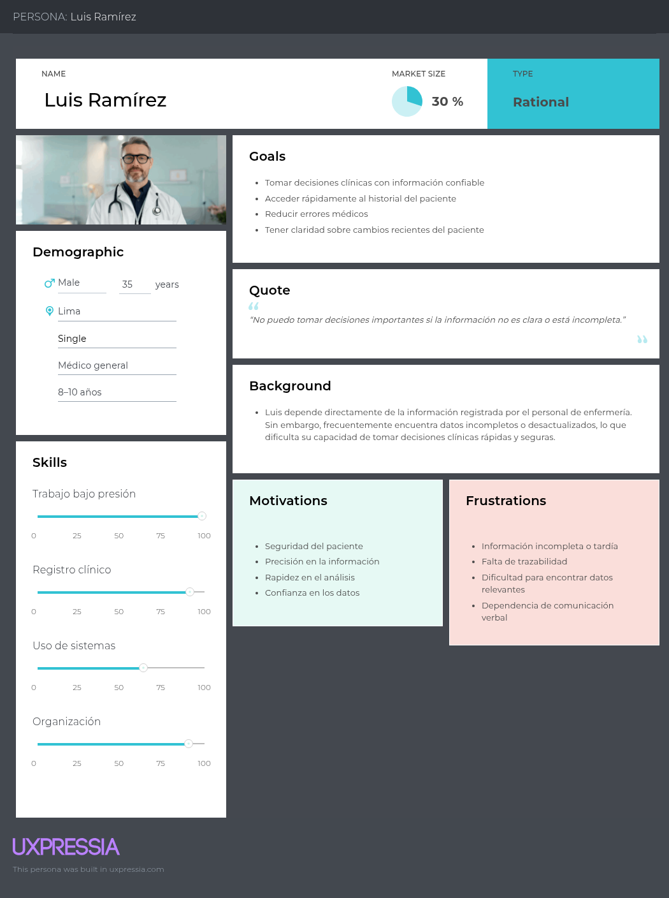
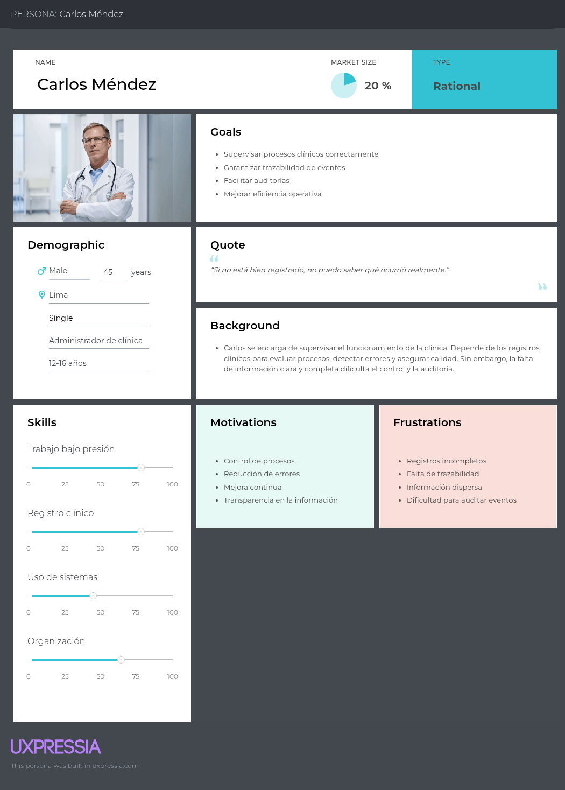
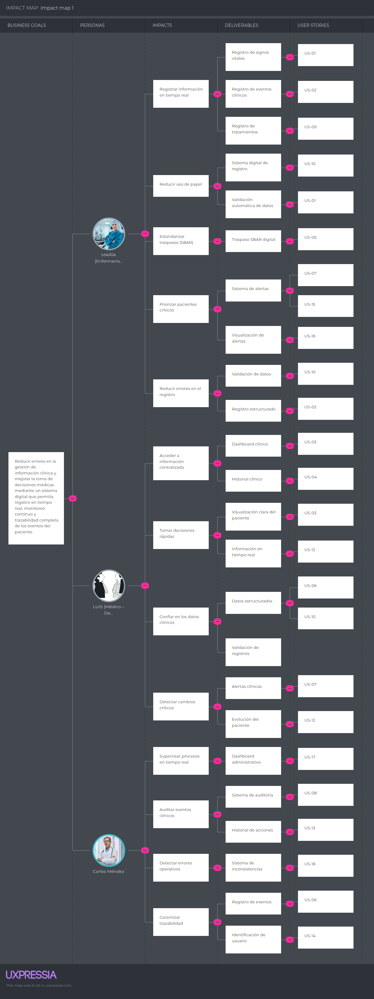
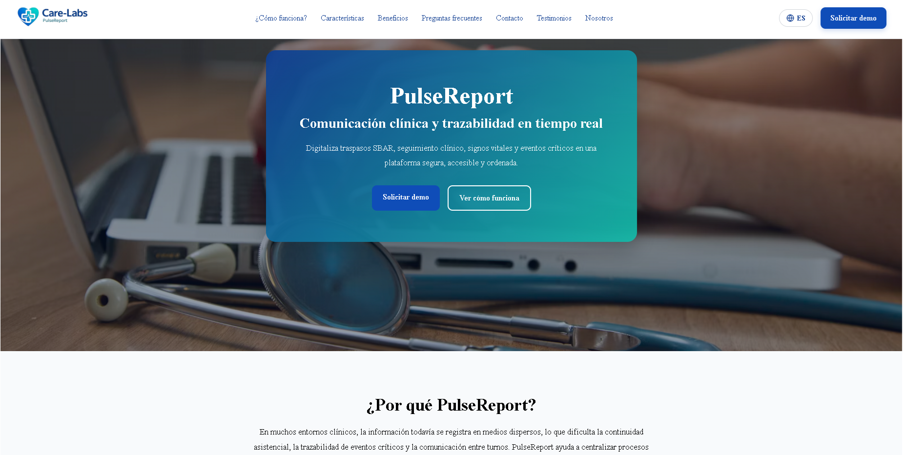

<div align = "center">
  
  <h1>Universidad Peruana de Ciencias Aplicadas</h1>
<h1>Facultad de Ingeniería</h1>
  <h2>Carrera de Ingeniería de Software</h2>
  <h2>Periodo 202610</h2>
  <h2>1ASI0729 - Desarrollo de Aplicaciones Open Source </h2>
  <h2>NRC- 2610</h2>
  <br>
  <h2>Profesor - Angel Augusto Velasquez Nuñez </h2>
  <h2>Informe de Trabajo </h2>
  <br>
  <h2 >Startup - Care-Labs </h2>
  <h2 >Producto - PulseReport </h2>
  <br>
  <h2 >Integrantes</h2>
  <ul style="list-style: none; padding: 0;">
      <li><h3>U202417693 - Alexander Auden Aliaga Ocampo</h3></li>
      <li><h3>U202217893 - Adrian Matias Rios Cespedes </h3></li>
      <li><h3>U20221c803 - Anhelo Rodrigo Rocca Leon </h3></li>
      <li><h3>U202417448 - Johan Giovani Huamán Cuba </h3></li>
  </ul>
  <br>
  <h4>Abril del 2026</h4>
  <br>
  </div>


## Contenido

- [Student Outcome](#student-outcome)

- [Capítulo I: Introducción](#capítulo-1-introducción)
    - [1.1. Startup Profile](#11-startup-profile)
        - [1.1.1. Descripción de la Startup](#111-descripción-de-la-startup)
        - [1.1.2. Perfiles de integrantes del equipo](#112-perfiles-de-integrantes-del-equipo)
    - [1.2. Solution Profile](#12-solution-profile)
        - [1.2.1 Antecedentes y problemática](#121-antecedentes-y-problemática)
        - [1.2.2 Lean UX Process](#122-lean-ux-process)
            - [1.2.2.1. Lean UX Problem Statements](#1221-lean-ux-problem-statements)
            - [1.2.2.2. Lean UX Assumptions](#1222-lean-ux-assumptions)
            - [1.2.2.3. Lean UX Hypothesis Statements](#1223-lean-ux-hypothesis-statements)
            - [1.2.2.4. Lean UX Canvas](#1224-lean-ux-canvas)
    - [1.3. Segmentos objetivo](#13-segmentos-objetivo)

- [Capítulo II: Requirements Elicitation & Analysis](#capítulo-ii-requirements-elicitation--analysis)
    - [2.1. Competidores](#21-competidores)
        - [2.1.1. Análisis competitivo](#211-análisis-competitivo)
        - [2.1.2. Estrategias y tácticas frente a competidores](#212-estrategias-y-tácticas-frente-a-competidores)
    - [2.2. Entrevistas](#22-entrevistas)
        - [2.2.1. Diseño de entrevistas](#221-diseño-de-entrevistas)
        - [2.2.2. Registro de entrevistas](#222-registro-de-entrevistas)
        - [2.2.3. Análisis de entrevistas](#223-análisis-de-entrevistas)
    - [2.3. Needfinding](#23-needfinding)
        - [2.3.1. User Personas](#231-user-personas)
        - [2.3.2. User Task Matrix](#232-user-task-matrix)
        - [2.3.3. User Journey Mapping](#233-user-journey-mapping)
        - [2.3.4. Empathy Mapping](#234-empathy-mapping)
    - [2.4. Big Picture EventStorming](#24-big-picture-eventstorming)
    - [2.5. Ubiquitous Language](#25-ubiquitous-language)


- [Capítulo III: Requirements Specification](#capítulo-iii-requirements-specification)
    - [3.1. User Stories](#31-user-stories)
    - [3.2. Impact Mapping](#32-impact-mapping)
    - [3.3. Product Backlog](#33-product-backlog)


- [Capítulo IV: Product Design](#capítulo-iv-product-design)
    - [4.1. Style Guidelines](#41-style-guidelines)
        - [4.1.1. General Style Guidelines](#411-general-style-guidelines)
        - [4.1.2. Web Style Guidelines](#412-web-style-guidelines)
    - [4.2. Information Architecture](#42-information-architecture)
        - [4.2.1. Organization Systems](#421-organization-systems)
        - [4.2.2. Labeling Systems](#422-labeling-systems)
        - [4.2.3. SEO Tags and Meta Tags](#423-seo-tags-and-meta-tags)
        - [4.2.4. Searching Systems](#424-searching-systems)
        - [4.2.5. Navigation Systems](#425-navigation-systems)
    - [4.3. Landing Page UI Design](#43-landing-page-ui-design)
        - [4.3.1. Landing Page Wireframe](#431-landing-page-wireframe)
        - [4.3.2. Landing Page Mock-up](#432-landing-page-mock-up)
    - [4.4. Web Applications UX/UI Design](#44-web-applications-uxui-design)
        - [4.4.1. Web Applications Wireframes](#441-web-applications-wireframes)
        - [4.4.2. Web Applications Wireflow Diagrams](#442-web-applications-wireflow-diagrams)
        - [4.4.3. Web Applications Mock-ups](#443-web-applications-mock-ups)
        - [4.4.4. Web Applications User Flow Diagrams](#444-web-applications-user-flow-diagrams)
    - [4.5. Web Applications Prototyping](#45-web-applications-prototyping)
    - [4.6. Domain-Driven Software Architecture](#46-domain-driven-software-architecture)
        - [4.6.1. Design-Level EventStorming](#461-design-level-eventstorming)
        - [4.6.2. Software Architecture Context Diagram](#462-software-architecture-context-diagram)
        - [4.6.3. Software Architecture Container Diagrams](#463-software-architecture-container-diagrams)
        - [4.6.4. Software Architecture Components Diagrams](#464-software-architecture-components-diagrams)
    - [4.7. Software Object-Oriented Design](#47-software-object-oriented-design)
        - [4.7.1. Class Diagrams](#471-class-diagrams)
    - [4.8. Database Design](#48-database-design)
        - [4.8.1. Database Diagram](#481-database-diagram)


- [Capítulo V: Product Implementation, Validation & Deployment](#capítulo-v-product-implementation-validation--deployment)
    - [5.1. Software Configuration Management](#51-software-configuration-management)
        - [5.1.1. Software Development Environment Configuration](#511-software-development-environment-configuration)
        - [5.1.2. Source Code Management](#512-source-code-management)
        - [5.1.3. Source Code Style Guide & Conventions](#513-source-code-style-guide--conventions)
        - [5.1.4. Software Deployment Configuration](#514-software-deployment-configuration)
    - [5.2. Landing Page, Services & Applications Implementation](#52-landing-page-services--applications-implementation)
        - [5.2.1. Sprint 1](#521-sprint-1)
            - [5.2.1.1. Sprint Planning 1](#5211-sprint-planning-1)
            - [5.2.1.2. Aspect Leaders and Collaborators](#5212-aspect-leaders-and-collaborators)
            - [5.2.1.3. Sprint Backlog 1](#5213-sprint-backlog-1)
            - [5.2.1.4. Development Evidence for Sprint Review](#5214-development-evidence-for-sprint-review)
            - [5.2.1.5. Execution Evidence for Sprint Review](#5215-execution-evidence-for-sprint-review)
            - [5.2.1.6. Services Documentation Evidence for Sprint Review](#5216-services-documentation-evidence-for-sprint-review)
            - [5.2.1.7. Software Deployment Evidence for Sprint Review](#5217-software-deployment-evidence-for-sprint-review)
            - [5.2.1.8. Team Collaboration Insights during Sprint](#5218-team-collaboration-insights-during-sprint)
         
- [Conclusiones](#conclusiones)
- [Bibliografía](#bibliografía)
- [Anexos](#anexos)

## Student Outcome

El curso contribuye al cumplimiento del Student Outcome ABET:

**ABET – EAC - Student Outcome 5**

**Criterio:** : La capacidad de funcionar efectivamente en un equipo cuyos miembros
juntos proporcionan liderazgo, crean un entorno de colaboración e inclusivo,
establecen objetivos, planifican tareas y cumplen objetivos.

<table>
  <tr>
    <th style="width: 20%;">Criterio específico</th>
    <th style="width: 45%;">Acciones realizadas</th>
    <th style="width: 35%;">Conclusiones</th>
  </tr>
  <tr>
    <td>Proporciona liderazgo y crea un entorno colaborativo e inclusivo.</td>
    <td><b>Johan Giovani Huamán Cuba</b><br><b>AV1:</b> Lideró las sesiones de diseño de la arquitectura de la plataforma Care-Labs e instruyó al equipo en la definición lógica de los diagramas de contexto, contenedores y componentes. Fomentó la participación de todos al establecer estándares claros de documentación técnica.<br><br><b>Alexander Auden Aliaga Ocampo</b><br><b>AV1:</b> Facilitó la comunicación para definir los requerimientos de los arquetipos de usuario y las entrevistas. Promovió un ambiente de confianza donde el equipo debatió libremente sobre las necesidades reales del personal de enfermería.<br><br><b>Adrian Matias Rios Cespedes</b><br><b>AV1:</b> Asumió el rol de guía en la estructuración de la base de datos y la lógica del backend. Apoyó a sus compañeros para entender las relaciones complejas entre entidades clínicas y módulos de auditoría.<br><br><b>Anhelo Rodrigo Rocca Leon</b><br><b>AV1:</b> Condujo los debates sobre la experiencia del usuario y la interfaz de la aplicación web. Motivó al grupo para aportar ideas enfocadas en el flujo del sistema y la creación de un entorno accesible para el personal médico.</td>
    <td><b>Johan:</b> Demostró una clara capacidad para alinear las perspectivas técnicas y de usuario. Consolidó un ambiente de trabajo inclusivo donde cada miembro aportó al diseño general.<br><br><b>Alexander:</b> Logró integrar la visión del usuario final al equipo. Su intervención fomentó la empatía grupal y garantizó que las decisiones técnicas tuvieran sentido clínico.<br><br><b>Adrian:</b> Impulsó el aprendizaje cruzado dentro del equipo. Demostró paciencia y claridad al explicar conceptos relacionales aplicados al sector salud.<br><br><b>Anhelo:</b> Creó un clima de colaboración creativa. Su iniciativa permitió transformar requerimientos médicos complejos en soluciones visuales amigables.</td>
  </tr>
  <tr>
    <td>Establece objetivos, planifica tareas y cumple metas.</td>
    <td><b>Johan Giovani Huamán Cuba</b><br><b>AV1:</b> Planificó y estructuró las entregas del diseño de software mediante hitos de trabajo bien definidos. Estableció metas claras para la cobertura técnica de los Bounded Contexts según la rúbrica del curso.<br><br><b>Alexander Auden Aliaga Ocampo</b><br><b>AV1:</b> Organizó el cronograma para la fase de entrevistas y la validación del problema. Definió plazos específicos para la investigación inicial del proyecto y la consolidación de respuestas.<br><br><b>Adrian Matias Rios Cespedes</b><br><b>AV1:</b> Dividió el diseño del modelo físico de base de datos en tareas pequeñas y asignó revisiones cruzadas. Trazó metas para culminar los diagramas de clases a tiempo.<br><br><b>Anhelo Rodrigo Rocca Leon</b><br><b>AV1:</b> Diseñó un plan de trabajo para mapear los procesos de enfermería, como el modelo de traspasos SBAR. Estableció fechas límite para la revisión de los componentes del frontend.</td>
    <td><b>Johan:</b> Logró cumplir cabalmente con los objetivos del proyecto a través de una planificación estructurada. Su división de la complejidad garantizó entregas de alta calidad.<br><br><b>Alexander:</b> Su organización metódica garantizó la culminación a tiempo de la base teórica del proyecto. Este trabajo sirvió como guía oportuna para iniciar la fase técnica.<br><br><b>Adrian:</b> Alcanzó los objetivos propuestos gracias a su enfoque pragmático. Su buena gestión de tareas redujo los cuellos de botella durante el modelado del sistema.<br><br><b>Anhelo:</b> Su capacidad para visualizar el proyecto por etapas aseguró el cumplimiento del diseño de la interfaz y procesos de manera ordenada y puntual.</td>
  </tr>
</table>


  ## Capítulo 1: Introducción
### 1.1. Startup Profile
#### 1.1.1. Descripción de la Startup
Somos Care-Labs, una startup creada por estudiantes con el propósito de desarrollar una solución tecnológica para el sector salud. Nuestro proyecto surge a partir de la necesidad de mejorar la gestión de procesos críticos en el área de enfermería cardiovascular, donde es muy importante contar con información clara, segura y disponible en tiempo real para brindar una atención más ordenada y eficiente.

A través de nuestra propuesta, buscamos desarrollar un sistema web que permita apoyar distintos procesos clínicos, como la gestión de citas médicas, la administración básica de pacientes, la digitalización del historial clínico, el registro de traspasos mediante el modelo SBAR, el seguimiento de tratamientos y el monitoreo de signos vitales, como la presión arterial y la frecuencia cardíaca. Además, el sistema también permitirá registrar eventos críticos, generar alertas y mantener un log de auditoría inalterable que ayude a conservar la trazabilidad de la información. De esta manera, se busca mejorar la comunicación entre turnos, la organización del personal de salud y la continuidad del cuidado del paciente.

Misión:
Nuestra misión es desarrollar una solución tecnológica que ayude a mejorar la gestión de procesos críticos en enfermería cardiovascular, facilitando el acceso a información clínica de manera rápida, segura y ordenada. Buscamos contribuir a que los centros de salud puedan brindar una atención más eficiente y confiable mediante el uso de herramientas digitales.

Visión:
Nuestra visión es convertir a Care-Labs en una startup reconocida por ofrecer una solución tecnológica útil e innovadora para el sector salud, aportando a la modernización de hospitales, clínicas y centros especializados. Aspiramos a que nuestra propuesta pueda crecer, adaptarse a las necesidades del mercado y generar un impacto positivo en la atención médica.


#### 1.1.2. Perfiles de integrantes del equipo
<table>
  <tr>
    <th colspan="2"> Alexander Auden Aliaga Ocampo </th>
  </tr>
  <tr>
    <td>  </td>
    <td> Soy estudiante de ingeniería de software en la UPC, con conocimientos básicos en los lenguajes de programación como c++, python , css, html, javascript también conocimientos básicos en base de datos viendo Mongo DB y creando diagramas relaciones como no relacionales. Además poseo habilidades de empatía y buena comunicación con el equipo esto me permite ser productivo en el ámbito de grupos y en general. </td>
  </tr>
  <tr>
    <th colspan="2"> Adrian Matias Rios Cespedes </th>
  </tr>
  <tr>
    <td>  </td>
    <td> Soy estudiante de Ingeniería de Software en la Universidad Peruana de Ciencias Aplicadas (UPC), con conocimientos en lenguajes de programación como C++, Python y JavaScript. Cuento con formación en bases de datos y fundamentos relacionados a su gestión.

Además, poseo habilidades blandas orientadas al trabajo en equipo, comunicación efectiva y liderazgo, lo que me permite organizar y dirigir proyectos de manera eficiente, manteniendo un enfoque estructurado y orientado a resultados. </td>
  </tr>

<tr>
    <th colspan="2"> Anhelo Rodrigo Rocca Leon </th>
  </tr>
  <tr>
    <td>  </td>
    <td> Soy estudiante de Ingeniería de Software. Cuento con conocimientos en los lenguajes de programación como C++, Python y SQL. Me comprometo a trabajar con mi equipo en el desarrollo de nuestro proyecto, al igual que ayudar siempre que mis capacidades lo permitan. </td>
  </tr>
  <tr>
    <th colspan="2"> Johan Giovani Huamán Cuba </th>
  </tr>
  <tr>
    <td>  </td>
    <td> Ahora, soy estudiante, luego, seré ingeniero. Cuento con conocimientos suficientes para crear cualquier sistema con ayuda de la inteligente artificial.
    Me dediqué mucho más a desarrollar mis habilidades en bases de datos, arquitectura de software y manejo de equipo IT. En este equipo no demuestro lo 
    último pues considero que cuento con un buen líder. </td>
  </tr>
</table>


### 1.2. Solution Profile
#### 1.2.1. Antecedentes y problemática

A. **Who**

Los principales actores involucrados son los profesionales de salud del área de enfermería cardiovascular, médicos especialistas, personal asistencial, clínicas privadas, hospitales y centros especializados en cardiología. Todos ellos enfrentan dificultades en la gestión de procesos críticos debido al uso de registros manuales, información dispersa y poca trazabilidad clínica.

B. **What**

Actualmente, muchos procesos dentro del área de enfermería cardiovascular se realizan de manera manual o mediante sistemas poco integrados, lo que genera problemas en la comunicación entre turnos, retrasos en el acceso a la información, errores en el registro de signos vitales, dificultades en el seguimiento de tratamientos y poca trazabilidad de eventos críticos. Además, la falta de un sistema centralizado limita la organización de los historiales clínicos y el control adecuado de la atención brindada al paciente.

C. **When**

Estos problemas se presentan de manera continua durante la atención diaria de los pacientes, especialmente en momentos como el cambio de turno del personal, el monitoreo de signos vitales, el registro de incidencias, la actualización de historiales clínicos y el seguimiento de tratamientos. Los riesgos aumentan en situaciones críticas donde se necesita actuar rápidamente y contar con información precisa en tiempo real.

D. **Where**

La problemática ocurre en hospitales, clínicas privadas, centros de salud especializados en cardiología y otras áreas asistenciales donde se atienden pacientes con condiciones cardiovasculares. En estos entornos, la falta de digitalización y trazabilidad afecta tanto al personal de salud como a la calidad de atención brindada.

E. **Why**

Porque la ausencia de una plataforma digital centralizada genera:

- Dificultades en la comunicación entre turnos y áreas asistenciales.
- Pérdida de trazabilidad en eventos clínicos importantes.
- Mayor probabilidad de errores en el registro de signos vitales y tratamientos.
- Demora en el acceso a información relevante del paciente.
- Menor eficiencia en la organización y seguimiento de los procesos clínicos.

Esto impacta directamente en la continuidad del cuidado, la seguridad del paciente y la eficiencia del personal de salud.

F. **How**

Actualmente, muchos centros de salud utilizan historias en papel, hojas de cálculo o sistemas básicos que no están completamente integrados. Aunque algunas instituciones cuentan con herramientas digitales, estas no siempre permiten registrar traspasos SBAR, monitorear signos vitales en tiempo real, generar alertas de eventos críticos o mantener un log de auditoría inalterable. Como resultado, varios problemas siguen presentes en la gestión clínica diaria.

G. **How much**

El impacto de esta problemática se refleja en:

- Pérdida de tiempo del personal de salud en tareas manuales y repetitivas.
- Riesgo de errores en registros clínicos y en la comunicación entre turnos.
- Dificultades para dar seguimiento oportuno a tratamientos y eventos críticos.
- Menor capacidad de respuesta ante situaciones que requieren atención inmediata.
- Reducción en la eficiencia operativa y en la calidad del servicio brindado al paciente.

#### 1.2.2. Lean UX Process
##### 1.2.2.1. Lean UX Problem Statements

### Segmento — Personal de Enfermería Cardiovascular

**Contexto:** El personal de enfermería cardiovascular se encarga del monitoreo constante de pacientes, del registro de signos vitales, del seguimiento de tratamientos y de la comunicación entre turnos para asegurar la continuidad del cuidado.

**Observación:** Actualmente, muchos de estos procesos se realizan de manera manual o mediante registros dispersos, lo que puede generar errores en la documentación, pérdida de información relevante, retrasos en la atención y dificultades en la comunicación entre áreas asistenciales.

**Problema:** No existe una herramienta centralizada y fácil de usar que permita al personal de enfermería cardiovascular registrar información clínica importante, dar seguimiento a tratamientos, documentar traspasos SBAR y mantener trazabilidad de eventos críticos en tiempo real.

**Pregunta clave:** ¿Cómo diseñar una solución digital que permita al personal de enfermería cardiovascular registrar y consultar información clínica de manera rápida, segura y ordenada, mejorando la comunicación entre turnos, la trazabilidad de eventos críticos y la continuidad del cuidado del paciente?


### Segmento — Clínicas, Hospitales y Centros Especializados en Cardiología

**Contexto:** Las instituciones de salud y centros especializados necesitan optimizar sus procesos clínicos, reducir errores operativos y asegurar una atención de calidad, especialmente en áreas críticas donde se requiere acceso inmediato a información confiable.

**Observación:** La falta de integración entre registros clínicos, seguimiento de pacientes, control de signos vitales y documentación de incidencias dificulta la supervisión de procesos y limita la capacidad de respuesta ante eventos críticos.

**Problema:** No se cuenta con una plataforma web que centralice los procesos esenciales de enfermería cardiovascular, facilite la supervisión de pacientes y permita una gestión más eficiente de la información clínica dentro de hospitales, clínicas y centros especializados.

**Pregunta clave:** ¿Cómo implementar una plataforma digital que permita a las instituciones de salud centralizar información clínica, supervisar procesos críticos, mejorar la trazabilidad y fortalecer la calidad de atención en el área de enfermería cardiovascular?


##### 1.2.2.2. Lean UX Assumptions

###### Supuestos sobre los usuarios de la aplicación:

- El personal de enfermería cardiovascular necesita registrar y consultar información clínica de manera rápida, clara y segura durante su jornada diaria.
- Los profesionales de salud requieren una herramienta que facilite la comunicación entre turnos y reduzca la pérdida de información importante en los traspasos.
- Las clínicas, hospitales y centros especializados necesitan mejorar la organización y supervisión de procesos críticos relacionados con el cuidado del paciente.
- Los usuarios prefieren interfaces simples e intuitivas que les permitan acceder fácilmente a signos vitales, tratamientos, historial clínico y eventos críticos.

###### Supuestos sobre necesidades

- El registro manual de información clínica y signos vitales es un proceso repetitivo y propenso a errores.
- La falta de trazabilidad en eventos críticos y en los traspasos entre turnos puede afectar la continuidad del cuidado del paciente.
- Los profesionales de salud necesitan contar con información actualizada en tiempo real para tomar decisiones oportunas.
- Es importante disponer de un sistema que centralice la información clínica básica y permita un seguimiento más ordenado de pacientes y tratamientos.

###### Supuestos sobre la solución

- Una plataforma web permitirá centralizar la información clínica y facilitar su acceso desde distintos puntos dentro de la institución de salud.
- El registro digital de traspasos SBAR mejorará la comunicación entre turnos y áreas asistenciales.
- El monitoreo y almacenamiento de signos vitales dentro del sistema ayudará a mantener un mejor control del estado del paciente.
- Un log de auditoría inalterable permitirá mantener la trazabilidad de eventos críticos y reforzar la confiabilidad de la información registrada.

###### Supuestos sobre el impacto

- La solución reducirá el tiempo invertido en tareas manuales de registro y seguimiento clínico.
- Disminuirá la probabilidad de errores en la documentación de signos vitales, tratamientos y eventos críticos.
- Mejorará la continuidad del cuidado del paciente al fortalecer la comunicación entre turnos.
- Permitirá a las instituciones de salud tener una gestión más ordenada, trazable y eficiente de sus procesos clínicos en el área de enfermería cardiovascular.

##### 1.2.2.3. Lean UX Hypothesis Statements

**Hipótesis de Valor**  
Creemos que el *personal de enfermería cardiovascular* y las *instituciones de salud* necesitan una plataforma digital que les permita registrar, consultar y dar seguimiento a información clínica crítica de manera rápida, segura y ordenada.  
Tendrán éxito utilizando PulseReport porque les permitirá mejorar la comunicación entre turnos, fortalecer la trazabilidad clínica y optimizar la continuidad del cuidado del paciente.

**Hipótesis de Funcionalidad**  
Creemos que proporcionar funciones como el registro de traspasos SBAR, monitoreo de signos vitales, gestión básica de pacientes, seguimiento de tratamientos, alertas de eventos críticos y un log de auditoría inalterable permitirá que los usuarios gestionen procesos clínicos de forma más eficiente.  
Sabremos que esta funcionalidad es útil cuando observemos un uso constante de la plataforma, una reducción de errores en los registros y una mejora en la documentación de eventos clínicos importantes.

**Hipótesis de Usabilidad**  
Creemos que los usuarios podrán navegar la interfaz de PulseReport de manera intuitiva, ya que estará diseñada con flujos simples, información clara y acceso rápido a las funciones más importantes del sistema.  
Validaremos esta hipótesis mediante pruebas de usabilidad en las que los usuarios puedan completar tareas como registrar signos vitales, consultar pacientes y documentar traspasos sin ayuda adicional.

**Hipótesis de Crecimiento**  
Creemos que si la plataforma demuestra mejoras en la organización de la información clínica, la trazabilidad y la comunicación entre áreas asistenciales, hospitales, clínicas y centros especializados estarán dispuestos a adoptar la solución de manera progresiva.  
Sabremos que esto es cierto cuando las instituciones muestren interés en ampliar el uso del sistema, incorporar nuevos módulos o mantener el servicio bajo el modelo de suscripción.


##### 1.2.2.4. Lean UX Canvas

| **Sección** | **Descripción** |
|------------|-----------------|
| **1. Problema / Oportunidad** | En el área de enfermería cardiovascular, muchos procesos clínicos aún se realizan de manera manual o con herramientas poco integradas, lo que genera errores en los registros, dificultades en la comunicación entre turnos, poca trazabilidad de eventos críticos y retrasos en la atención. PulseReport busca digitalizar y optimizar estos procesos mediante una plataforma web que centralice la información clínica relevante y mejore la continuidad del cuidado del paciente. |
| **2. Usuarios y Clientes** | **Usuarios:** Personal de enfermería cardiovascular, médicos especialistas, personal asistencial. <br> **Clientes:** Hospitales, clínicas privadas, centros especializados en cardiología y profesionales de salud independientes. |
| **3. Supuestos** | Los usuarios necesitan acceder a información clínica de manera rápida y segura; las instituciones requieren mayor trazabilidad en los procesos asistenciales; la plataforma será adoptada si cuenta con una interfaz simple e intuitiva; la gestión digital de registros clínicos mejorará la comunicación y reducirá errores operativos. |
| **4. Necesidades del Usuario** | Registrar signos vitales, documentar traspasos SBAR, consultar historial clínico, dar seguimiento a tratamientos, registrar eventos críticos, recibir alertas y acceder a la información desde una plataforma segura y ordenada. |
| **5. Solución Propuesta** | Plataforma web orientada a la gestión de procesos críticos en enfermería cardiovascular, desarrollada para centralizar citas médicas, pacientes, historial clínico, tratamientos, signos vitales, eventos críticos y un log de auditoría inalterable, complementada con un dashboard básico para seguimiento clínico. |
| **6. Resultados (Outcomes)** | **Resultados esperados:** Mejor comunicación entre turnos, mayor trazabilidad clínica, menos errores en registros y mejor organización del cuidado del paciente. <br> **KPIs:** Reducción de errores en documentación, tiempo de registro de información clínica, cantidad de eventos críticos correctamente trazados, frecuencia de uso de la plataforma y número de usuarios activos. |
| **7. Experimentos** | Pruebas de usabilidad con usuarios simulados, validación del flujo de registro de signos vitales, simulación de traspasos SBAR, pruebas del registro de eventos críticos y evaluación del dashboard básico para comprobar que el MVP cubre las necesidades esenciales del personal de salud. |
| **8. MVP (Producto Mínimo Viable)** | Registro básico de pacientes, registro de signos vitales, documentación de traspasos SBAR, seguimiento simple de tratamientos, registro de eventos críticos, log de auditoría básico y dashboard inicial con visualización resumida de la información. |

### 1.3 Segmentos Objetivo

### Segmento objetivo #1: Personal de enfermería cardiovascular  
Este grupo está conformado por profesionales de salud que participan directamente en la atención y monitoreo de pacientes con enfermedades cardiovasculares dentro de hospitales, clínicas y centros especializados. Su labor incluye el registro de signos vitales, la documentación de tratamientos, la comunicación entre turnos y el seguimiento constante del estado del paciente para asegurar una atención continua y segura.

**Características clave de este segmento:**  
- Buscan optimizar el registro y consulta de información clínica para reducir errores y ahorrar tiempo.  
- Valoran sistemas que faciliten la comunicación entre turnos y mejoren la continuidad del cuidado del paciente.  
- Requieren herramientas que permitan registrar signos vitales, tratamientos y eventos críticos de forma rápida y ordenada.  
- Se interesan por plataformas intuitivas que les ayuden a trabajar de manera más eficiente en entornos de alta demanda.  

---

### Segmento objetivo #2: Hospitales, clínicas privadas y centros especializados en cardiología  
Este grupo está conformado por instituciones de salud que necesitan optimizar sus procesos clínicos y administrativos relacionados con la atención de pacientes en áreas cardiovasculares. Su interés principal es mejorar la organización, la trazabilidad de la información clínica y la calidad de atención, al mismo tiempo que reducen errores operativos y fortalecen la supervisión de procesos críticos.

**Características clave de este segmento:**  
- Buscan soluciones tecnológicas que centralicen la información clínica y faciliten su acceso en tiempo real.  
- Valoran plataformas que mejoren la trazabilidad de eventos críticos y la supervisión de procesos asistenciales.  
- Necesitan sistemas que contribuyan a una mejor organización del personal y de la atención brindada a los pacientes.  
- Se interesan por herramientas escalables bajo modelo SaaS que puedan adaptarse a las necesidades de su institución.

### 2.1. Competidores
#### 2.1.1. Análisis competitivo

En el sector de soluciones tecnológicas para la gestión clínica, especialmente en entornos hospitalarios, existen diversas plataformas que abordan problemáticas similares a las planteadas por PulseReport. Estas soluciones pueden clasificarse en tres categorías principales: sistemas hospitalarios integrales (HIS/EHR), sistemas de monitoreo clínico y herramientas tradicionales de gestión.

**Competidor 1: Sistemas EHR/HIS (Ej: Epic, Cerner)**

**Descripción:**
Son plataformas integrales utilizadas en hospitales y clínicas para la gestión de historiales clínicos electrónicos, citas médicas, tratamientos, facturación y otros procesos hospitalarios.

**Fortalezas:**

- Alta integración de procesos clínicos y administrativos.
- Escalabilidad a nivel institucional.
- Cumplimiento de estándares de seguridad y normativas.
- Alta confiabilidad y respaldo empresarial.

**Debilidades:**

- Interfaces complejas y poco intuitivas para el personal de enfermería.
- Alto costo de implementación y mantenimiento.
- Baja flexibilidad para adaptaciones rápidas.
- Procesos de registro poco eficientes en entornos críticos.

**Competidor 2: Sistemas de monitoreo clínico (Ej: Philips IntelliVue, GE Healthcare)**

**Descripción:**
Soluciones enfocadas en el monitoreo de signos vitales en tiempo real mediante dispositivos médicos conectados.

**Fortalezas:**

- Alta precisión en la captura de datos biomédicos.
- Monitoreo continuo en tiempo real.
- Integración con hardware especializado.

**Debilidades:**

- No gestionan procesos clínicos completos.
- No incluyen trazabilidad de eventos clínicos.
- Limitada funcionalidad en gestión de pacientes y tratamientos.
- Dependencia de infraestructura médica especializada.

**Competidor 3: Métodos tradicionales (Excel y registros en papel)**

**Descripción:**
Métodos aún utilizados en diversos centros de salud, especialmente donde la digitalización es limitada.

**Fortalezas:**

- Bajo costo.
- Fácil implementación.
- No requiere capacitación técnica avanzada.

**Debilidades:**

- Alta probabilidad de errores humanos.
- Falta de trazabilidad.
- Información dispersa y difícil de consultar.
- No permite acceso en tiempo real.
- Nula automatización.

| Criterio                 | EHR/HIS  | Monitoreo clínico | Métodos tradicionales | PulseReport |
| ------------------------ | -------- | ----------------- | --------------------- | ----------- |
| Facilidad de uso         | Baja     | Media             | Alta                  | Alta        |
| Integración de procesos  | Alta     | Baja              | Nula                  | Media       |
| Monitoreo en tiempo real | Sí       | Sí                | No                    | Parcial     |
| Trazabilidad clínica     | Alta     | Baja              | Nula                  | Alta        |
| Costo                    | Muy alto | Alto              | Bajo                  | Medio       |
| Enfoque en enfermería    | Bajo     | Bajo              | Medio                 | Alto        |

**Posicionamiento de PulseReport**

PulseReport se posiciona como una solución intermedia entre los sistemas hospitalarios complejos y las herramientas tradicionales, enfocándose específicamente en las necesidades del personal de enfermería cardiovascular.

Su propuesta se centra en:

- Simplificar el registro de información clínica.
- Centralizar datos relevantes del paciente.
- Mejorar la comunicación entre turnos mediante el modelo SBAR.
- Garantizar trazabilidad en eventos clínicos.

#### 2.1.2. Estrategias y tácticas frente a competidores

Para competir en este mercado, PulseReport adopta un conjunto de estrategias orientadas a la diferenciación, la especialización y la implementación progresiva.

**Estrategia 1: Enfoque en un nicho específico**

**Descripción:**
PulseReport se enfoca en el área de enfermería cardiovascular en lugar de intentar abarcar todo el sistema hospitalario.

**Tácticas:**

- Diseñar funcionalidades específicas para enfermería.
- Priorizar procesos críticos como registro de signos vitales y traspasos SBAR.
- Adaptar la solución a flujos reales del personal de salud.

**Estrategia 2: Simplicidad y usabilidad**

**Descripción:**
Se prioriza una interfaz intuitiva que permita realizar tareas en el menor tiempo posible.

**Tácticas:**

- Formularios simplificados para registro rápido.
- Reducción de pasos en procesos críticos.
- Diseño centrado en el usuario.

**Estrategia 3: Desarrollo basado en MVP**

**Descripción:**
El desarrollo del sistema se realiza de manera incremental, comenzando con un producto mínimo viable.

**Tácticas:**

- Implementar inicialmente:
  - Registro de signos vitales.
  - Traspasos SBAR.
- Validar funcionalidades con usuarios reales.
- Iterar en base a feedback.

**Estrategia 4: Integración como sistema complementario**

**Descripción:**
PulseReport no busca reemplazar sistemas existentes, sino integrarse como una herramienta complementaria.

**Tácticas:**

- Exportación de datos en formatos estándar.
- Diseño modular para futuras integraciones.
- Compatibilidad con flujos de trabajo existentes.

**Estrategia 5: Modelo SaaS accesible**

**Descripción:**
La solución se ofrece bajo un modelo de suscripción accesible para facilitar su adopción.

**Tácticas:**

- Planes escalables según número de usuarios.
- Bajo costo inicial.
- Implementación rápida sin infraestructura compleja.

**Estrategia 6: Trazabilidad y control de información**

**Descripción:**
Se prioriza la capacidad de auditar y rastrear eventos clínicos.

**Tácticas:**

- Registro de eventos con historial de cambios.
- Control de accesos por roles.
- Almacenamiento estructurado de información clínica.
  
**Ventaja competitiva**

La principal ventaja competitiva de PulseReport radica en su capacidad de ofrecer una solución enfocada, simple y eficiente para la gestión de procesos críticos de enfermería, evitando la complejidad de los sistemas hospitalarios tradicionales.

**Consideración estratégica**

PulseReport no busca competir directamente con sistemas EHR/HIS de gran escala, sino posicionarse como una herramienta especializada que mejora la eficiencia operativa en un área específica del proceso clínico, facilitando su adopción e implementación progresiva.

### 2.2. Entrevistas

Se realizaron entrevistas semiestructuradas con el objetivo de validar los supuestos del proyecto y comprender cómo se gestionan actualmente los procesos clínicos relacionados con el registro de información, comunicación entre turnos y seguimiento de pacientes.

Las entrevistas se enfocaron en identificar problemas reales, necesidades operativas y percepción sobre el uso de herramientas digitales en entornos clínicos.

#### 2.2.1. Diseño de entrevistas

**Objetivo**

**Recopilar información sobre:**

- Registro de información clínica
- Comunicación entre turnos
- Seguimiento de pacientes
- Problemas operativos actuales
- Necesidades frente a una solución digital

**Perfil de entrevistados**
- Personal de enfermería
- Profesionales del sector salud
- Personal vinculado a procesos clínicos o administrativos

**Guía de preguntas**
1. ¿Cuál es tu rol en el entorno de salud?
2. ¿Cómo registran actualmente la información de los pacientes?
3. ¿Qué problemas tienes al registrar signos vitales o datos clínicos?
4. ¿Cómo se comunican entre turnos?
5. ¿Qué errores o dificultades ocurren en esa comunicación?
6. ¿Pierdes tiempo buscando información del paciente?
7. ¿Qué tan importante es la trazabilidad de eventos clínicos?
8. ¿Qué limitaciones tienen las herramientas actuales?
9. ¿Usarías una plataforma que centralice esta información?
10. ¿Qué funcionalidades consideras más importantes?
11. ¿Qué haría que una herramienta sea fácil de usar?
12. ¿Qué preocupaciones tendrías al usar un sistema digital?

**Supuestos a validar**
- El registro actual es ineficiente y propenso a errores
- La comunicación entre turnos es un punto crítico
- Existe necesidad de centralizar la información
- La trazabilidad es importante
- Los usuarios prefieren soluciones simples e intuitivas

#### 2.2.2. Registro de entrevistas

**Entrevista 1 – Enfermera clínica**
<table border=1>
  <tr>
    <td>
      <b>Nombres y apellidos:</b> Maria Torres <br>
      <b>Edad: </b> 28 años <br>
      <b>Distrito:</b> San Miguel <br>
      <b>Ocupacion:</b> Enfermera clínica <br>
      <b>Timing:</b> 0:00 <br>
      <b>Duración:</b> 0:00
    </td>
    <td align=center>
      
    </td>
  </tr>
  <tr>
    <td colspan=2>
      <b>Enlace:</b> <a href="XXXXXXXXXXXXXXXXXXXXX"> Link </a>
      <br>
      <b>Resumen:</b> La entrevistada indicó que su trabajo implica el monitoreo constante de pacientes y el registro de signos vitales. Señaló que, en la práctica, la información se registra primero en papel y luego se transfiere al sistema digital, lo que genera retrasos y posibles omisiones. La comunicación entre turnos se realiza principalmente de forma verbal, lo que ocasiona pérdida de información relevante. Además, mencionó que suele perder tiempo buscando datos debido a que la información está dispersa. Considera fundamental la trazabilidad de eventos clínicos y estaría dispuesta a usar una herramienta digital siempre que sea rápida, simple y reduzca la carga operativa.
    </td>
  </tr>
</table>


**Entrevista 2 – Médico general**

<table border=1>
  <tr>
    <td>
      <b>Nombres y apellidos:</b> Luis Ramirez <br>
      <b>Edad: </b> 35 años <br>
      <b>Distrito:</b> Lima <br>
      <b>Ocupacion:</b> Médico General <br>
      <b>Timing:</b> 0:00 <br>
      <b>Duración:</b> 0:00
    </td>
    <td align=center>
      
    </td>
  </tr>
  <tr>
    <td colspan=2>
      <b>Enlace:</b> <a href="XXXXXXXXXXXXXXXXXXXXX"> Link </a>
      <br>
      <b>Resumen:</b> El entrevistado indicó que depende de la información registrada para la toma de decisiones clínicas. Sin embargo, señaló que dicha información suele estar incompleta o desactualizada, lo que representa un riesgo en la atención del paciente. La comunicación entre turnos no siempre es estructurada, lo que dificulta comprender el estado real del paciente. También mencionó que acceder a la información puede tomar tiempo. Considera crítica la trazabilidad de eventos clínicos y valora la existencia de una herramienta que permita acceder a información clara, confiable y actualizada.
    </td>
  </tr>
</table>

<table border=1>
  <tr>
    <td>
      <b>Nombres y apellidos:</b> Mark Alex Esquivel Cabrera <br>
      <b>Edad: </b> 27 años <br>
      <b>Distrito:</b> Ate <br>
      <b>Ocupacion:</b> Médico cirujano <br>
      <b>Timing:</b> 1:06 minutos <br>
      <b>Duración:</b> 14:07 minutos
    </td>
    <td align=center>
      
    </td>
  </tr>
  <tr>
    <td colspan=2>
      <b>Enlace:</b> <a href="https://upcedupe-my.sharepoint.com/:v:/g/personal/u202417448_upc_edu_pe/IQDEg1dERgrVRq-XGS40DedPAaxPeYnZt8jHwLrCX1XHmEw?e=8ncHUd"> Link </a>
      <br>
      <b>Resumen:</b> Mark labora en un centro de salud rural con un sistema de registro doble. El personal primero anota los datos generales, los síntomas y los códigos de las enfermedades en una hoja de papel. Luego, alguien traslada esa información a un Excel muy básico para mantener un archivo de los pacientes.

Este método actual genera un problema grave: la pérdida de trazabilidad. La letra de los doctores muchas veces resulta ilegible. Además, el personal suele olvidar detalles y deja espacios en blanco en las hojas. Estas fallas complican el seguimiento médico del paciente.

Mark muestra mucha disposición para probar un sistema tecnológico nuevo. Él considera que la plataforma debe ser segura y sobre todo fácil de usar. Su mayor preocupación involucra a los doctores de la tercera edad. Si el sistema resulta complejo, estos médicos rechazarán la herramienta y el centro de salud volverá a usar los archivos de Excel por costumbre.
    </td>
  </tr>
</table>

**Entrevista 3 – Administrador de clínica**

<table border=1>
  <tr>
    <td>
      <b>Nombres y apellidos:</b> Carlos Mendez <br>
      <b>Edad: </b> 45 años <br>
      <b>Distrito:</b> Santiago de Surco <br>
      <b>Ocupacion:</b> Administrador de Clínica <br>
      <b>Timing:</b> 0:00 <br>
      <b>Duración:</b> 0:00
    </td>
    <td align=center>
      
    </td>
  </tr>
  <tr>
    <td colspan=2>
      <b>Enlace:</b> <a href="XXXXXXXXXXXXXXXXXXXXX"> Link </a>
      <br>
      <b>Resumen:</b> El entrevistado explicó que su función está relacionada con la supervisión de procesos y control de calidad. Señaló que actualmente existe dificultad para auditar lo que ocurre en cada turno debido a registros incompletos o poco claros. La comunicación entre turnos no siempre está documentada adecuadamente, lo que limita la trazabilidad. También indicó que consolidar información para análisis operativo toma tiempo. Considera fundamental contar con una herramienta que permita registrar eventos de forma clara, auditable y estructurada.
    </td>
  </tr>
</table>

### 2.2.3. Análisis de entrevistas

A partir de las cinco entrevistas realizadas, se identificaron patrones consistentes en relación con la gestión de información clínica, la comunicación entre turnos y el uso de herramientas digitales en entornos de salud. El análisis permitió validar los principales supuestos del proyecto y delimitar con mayor precisión las necesidades del usuario.

**Hallazgos principales**
**1. Ineficiencia en el registro de información clínica**

Se evidenció que el proceso de registro actual es ineficiente debido al uso combinado de medios físicos y digitales. Los entrevistados indicaron que:

- Se realiza un doble registro (papel y sistema)
- El registro en el sistema suele hacerse de forma tardía
- Existe alta probabilidad de omisión o error

Este problema afecta directamente la calidad y confiabilidad de la información.

**2. Dependencia de la comunicación verbal entre turnos**

La transferencia de información entre turnos se basa principalmente en comunicación verbal, lo que genera:

- Pérdida de información relevante
- Falta de estandarización
- Dependencia de la memoria del personal

Esto impacta negativamente en la continuidad del cuidado del paciente.

**3. Información dispersa y difícil de acceder**

Se identificó que la información clínica se encuentra distribuida en múltiples fuentes, lo que provoca:

- Tiempo elevado en la búsqueda de datos
- Dificultad para obtener una visión completa del paciente
- Retrasos en la toma de decisiones

Este problema afecta tanto al personal operativo como al médico.

**4. Falta de trazabilidad de eventos clínicos**

Todos los perfiles coinciden en la importancia de contar con trazabilidad, pero actualmente existen limitaciones como:

- Registros incompletos
- Falta de claridad sobre quién realizó una acción
- Dificultad para auditar eventos pasados

Esto afecta la supervisión, el control de calidad y la toma de decisiones clínicas.

**5. Limitaciones de las herramientas actuales**

Las herramientas existentes presentan problemas comunes:

- Son complejas y poco intuitivas
- Requieren múltiples pasos para tareas simples
- No están diseñadas para entornos de alta demanda

Esto genera que, en la práctica, se evite su uso o se utilicen de forma incompleta.

**Patrones identificados**

A partir de los hallazgos, se identificaron los siguientes patrones recurrentes:

- Uso frecuente de registros manuales o mixtos
- Registro tardío o incompleto de información clínica
- Comunicación no estructurada entre turnos
- Dificultad para acceder rápidamente a información relevante
- Necesidad de herramientas más simples y rápidas

Estos patrones se repiten en todos los perfiles entrevistados, lo que refuerza la validez del problema identificado.

**Insights clave**

Del análisis se derivan los siguientes insights:

- La rapidez en el registro y acceso a la información es un factor crítico en entornos clínicos.
- La comunicación entre turnos requiere estructura y soporte digital, no solo interacción verbal.
- Los sistemas actuales fallan no por falta de funcionalidad, sino por exceso de complejidad.
- La trazabilidad no solo es importante para el control, sino también para la seguridad del paciente.
- Una solución solo será adoptada si reduce fricción operativa, no si agrega procesos adicionales.
- 
**Validación de supuestos**

Con base en las entrevistas, se validan los siguientes supuestos planteados previamente:

- Existe un problema real en el registro y gestión de información clínica.
- La comunicación entre turnos es un punto crítico del proceso asistencial.
- Los usuarios perciben valor en una herramienta que centralice la información.
- La trazabilidad de eventos clínicos es una necesidad clave.
- La usabilidad y rapidez son factores determinantes para la adopción de una solución.
**Conclusión**

El análisis de entrevistas confirma la existencia de una brecha significativa entre los procesos actuales y las necesidades reales del personal de salud. Los problemas identificados se centran en la ineficiencia del registro, la falta de trazabilidad y las limitaciones de las herramientas existentes. En este contexto, existe una oportunidad clara para el desarrollo de una solución como PulseReport, enfocada en simplificar el registro de información, mejorar la comunicación entre turnos y garantizar la trazabilidad de eventos clínicos mediante una interfaz rápida, intuitiva y adaptada al entorno operativo.

### 2.3. Needfinding
#### 2.3.1. User Personas






#### 2.3.2. User Task Matrix

La matriz de tareas del usuario se construye a partir de los User Personas definidos, permitiendo identificar las actividades clave que realiza cada tipo de usuario, su frecuencia, criticidad y las oportunidades de mejora que el sistema debe abordar.

**User Task Matrix de María (Enfermera)**

| Persona           | Tarea                          | Descripción                                                        | Frecuencia | Criticidad | Problemas actuales                     | Oportunidad de mejora               |
| ----------------- | ------------------------------ | ------------------------------------------------------------------ | ---------- | ---------- | -------------------------------------- | ----------------------------------- |
| María (Enfermera) | Registrar signos vitales       | Ingreso de presión, frecuencia cardíaca y otros datos del paciente | Alta       | Alta       | Registro tardío, uso de papel, errores | Registro rápido en tiempo real      |
| María (Enfermera) | Actualizar estado del paciente | Registrar cambios o incidencias del paciente                       | Alta       | Alta       | Omisión de información                 | Registro estructurado y obligatorio |
| María (Enfermera) | Comunicar turno                | Transferir información al siguiente turno                          | Alta       | Alta       | Comunicación verbal, pérdida de datos  | Estandarización digital (SBAR)      |
| María (Enfermera) | Consultar paciente             | Revisar estado actual y evolución                                  | Alta       | Alta       | Información dispersa                   | Vista unificada del paciente        |
| María (Enfermera) | Buscar información             | Acceder a datos previos del paciente                               | Media      | Media      | Tiempo perdido buscando                | Acceso rápido y centralizado        |

**User Task Matrix de Luis (Médico)**

| Persona       | Tarea                       | Descripción                            | Frecuencia | Criticidad | Problemas actuales                 | Oportunidad de mejora         |
| ------------- | --------------------------- | -------------------------------------- | ---------- | ---------- | ---------------------------------- | ----------------------------- |
| Luis (Médico) | Revisar historial clínico   | Analizar evolución del paciente        | Media      | Alta       | Información incompleta             | Historial claro y actualizado |
| Luis (Médico) | Evaluar estado del paciente | Revisar signos vitales recientes       | Alta       | Alta       | Datos dispersos                    | Dashboard clínico             |
| Luis (Médico) | Tomar decisiones clínicas   | Definir tratamiento basado en datos    | Media      | Alta       | Falta de confiabilidad             | Datos precisos y trazables    |
| Luis (Médico) | Ver cambios recientes       | Identificar variaciones en el paciente | Alta       | Alta       | Información no visible rápidamente | Alertas y cambios destacados  |

**User Task Matrix de Carlos (Administrador)**

| Persona                | Tarea                | Descripción                        | Frecuencia | Criticidad | Problemas actuales    | Oportunidad de mejora        |
| ---------------------- | -------------------- | ---------------------------------- | ---------- | ---------- | --------------------- | ---------------------------- |
| Carlos (Administrador) | Supervisar procesos  | Revisar cumplimiento de protocolos | Baja       | Alta       | Falta de visibilidad  | Panel de control             |
| Carlos (Administrador) | Auditar eventos      | Ver qué ocurrió en cada caso       | Baja       | Alta       | Registros incompletos | Log de auditoría             |
| Carlos (Administrador) | Analizar información | Evaluar desempeño operativo        | Media      | Media      | Información dispersa  | Datos estructurados          |
| Carlos (Administrador) | Ver trazabilidad     | Revisar historial de acciones      | Media      | Alta       | Falta de control      | Registro completo de eventos |

**Análisis de la matriz**

A partir de la matriz, se identifican los siguientes puntos clave:

**1. Tareas críticas operativas**

Las tareas más frecuentes y críticas pertenecen al perfil de enfermería:

- Registro de signos vitales
- Actualización del estado del paciente
- Comunicación entre turnos

Esto indica que el sistema debe priorizar velocidad y simplicidad.

**2. Tareas críticas de decisión**

El perfil médico depende de:

- Información confiable
- Acceso rápido a datos
- Visibilidad clara del paciente

Esto implica que el sistema debe priorizar claridad y precisión.

**3. Tareas de control y supervisión**

El perfil administrador requiere:

- Trazabilidad
- Auditoría
- Control de procesos

Esto implica que el sistema debe incluir mecanismos de registro y seguimiento.

**4. Problema transversal**

Todos los perfiles comparten problemas comunes:

- Información dispersa
- Registro incompleto
- Pérdida de tiempo
- Falta de trazabilidad

Esto valida que el problema es sistémico, no aislado.

**Conclusión**

La User Task Matrix evidencia que el sistema debe centrarse en optimizar tres aspectos clave:

- Registro rápido y eficiente de información
- Acceso claro y centralizado a datos del paciente
- Trazabilidad completa de eventos clínicos

Esto permite alinear el desarrollo de PulseReport con las necesidades reales de los distintos tipos de usuario, asegurando que la solución impacte tanto en la operación diaria como en la toma de decisiones y el control institucional.


#### 2.3.3. User Journey Mapping.

**María Torres (Enfermera – Operativo)**


**Luis Ramírez (Médico – Decisión)**


**Carlos Méndez (Administrador – Control)**


#### 2.3.4. Empathy Mapping.

**María Torres (Enfermera – Operativo)**


**Luis Ramírez (Médico – Decisión)**


**Carlos Méndez (Administrador – Control)**


### 2.4. Big Picture Storming.

El Big Picture EventStorming modela los eventos clave del sistema PulseReport, considerando el flujo principal definido en la landing: Registrar → Monitorear → Trazar, así como las funcionalidades de SBAR digital, gestión de pacientes, seguimiento clínico y auditoría.

**Eventos del dominio**

Eventos importantes que ocurren dentro del sistema:

- Paciente registrado
- Signos vitales registrados
- Tratamiento registrado
- Evento clínico registrado
- Estado del paciente actualizado
- Información clínica consultada
- Traspaso de turno realizado (SBAR digital)
- Alerta clínica generada
- Evento auditado
- Historial clínico actualizado

**Comandos (acciones del usuario)**

- Registrar paciente
- Registrar signos vitales
- Registrar tratamiento
- Registrar evento clínico
- Actualizar estado del paciente
- Consultar información clínica
- Realizar traspaso de turno (SBAR)
- Generar alerta
- Auditar eventos
### 2.5. Ubiquitous Language.

El Ubiquitous Language define los términos comunes utilizados en PulseReport, alineados con los conceptos visibles en la landing y las funcionalidades del sistema.

| Término             | Definición                                             |
| ------------------- | ------------------------------------------------------ |
| Paciente            | Persona que recibe atención clínica dentro del sistema |
| Signos vitales      | Datos fisiológicos registrados en tiempo real          |
| Estado del paciente | Condición actual basada en datos clínicos              |
| Evento clínico      | Cambio relevante en la condición del paciente          |
| Tratamiento         | Acción médica registrada en el sistema                 |
| SBAR digital        | Formato estructurado para traspaso de turno            |
| Traspaso de turno   | Transferencia de información entre personal            |
| Historial clínico   | Registro completo de eventos del paciente              |
| Alerta clínica      | Notificación automática ante condición crítica         |
| Trazabilidad        | Seguimiento completo de eventos y acciones             |
| Auditoría           | Registro inalterable de acciones en el sistema         |


## Capítulo III: Requirements Specification
### 3.1. User Stories
**EPICS**

| Epic ID | Título                         | Descripción                                                                                                                                                     |
| ------- | ------------------------------ | --------------------------------------------------------------------------------------------------------------------------------------------------------------- |
| EP01    | Clinical Data Registration     | Como enfermera, quiero registrar signos vitales, eventos clínicos y tratamientos en tiempo real para asegurar información precisa y evitar errores u omisiones. |
| EP02    | Patient Monitoring             | Como usuario, quiero consultar información clínica actualizada y centralizada para dar seguimiento oportuno al estado del paciente.                             |
| EP03    | Clinical Traceability & SBAR   | Como usuario, quiero gestionar traspasos de turno y trazabilidad de eventos mediante SBAR digital para garantizar continuidad del cuidado.                      |
| EP04    | Alerts & Patient Safety        | Como usuario, quiero recibir alertas automáticas ante condiciones críticas para actuar de forma inmediata.                                                      |
| EP05    | Administrative Control & Audit | Como administrador, quiero supervisar registros y auditar eventos para garantizar control y calidad del proceso clínico.                                        |

**USER STORIES**

**EP01 — Clinical Data Registration**

| User Story ID | Título                      | Descripción                                                                                | Criterios de aceptación                                                          | Épica |
| ------------- | --------------------------- | ------------------------------------------------------------------------------------------ | -------------------------------------------------------------------------------- | ----- |
| US-01         | Registrar signos vitales    | Como enfermera, quiero registrar signos vitales en tiempo real para evitar errores.        | Given estoy en paciente, when registro datos, then se guardan correctamente.     | EP01  |
| US-02         | Registrar evento clínico    | Como enfermera, quiero registrar eventos clínicos para mantener trazabilidad.              | Given registro evento, when guardo, then queda en historial con fecha y usuario. | EP01  |
| US-09         | Registrar tratamiento       | Como enfermera, quiero registrar tratamientos para tener control del cuidado del paciente. | Given ingreso tratamiento, when guardo, then se almacena correctamente.          | EP01  |
| US-10         | Validar campos obligatorios | Como sistema, quiero validar datos obligatorios para evitar errores.                       | Given campos vacíos, when guardo, then muestra error.                            | EP01  |

**EP02 — Patient Monitoring**

| User Story ID | Título                         | Descripción                                                                 | Criterios de aceptación                                   | Épica |
| ------------- | ------------------------------ | --------------------------------------------------------------------------- | --------------------------------------------------------- | ----- |
| US-03         | Visualizar estado del paciente | Como usuario, quiero ver el estado del paciente en una sola vista.          | Given accedo al paciente, then veo resumen claro.         | EP02  |
| US-04         | Consultar historial clínico    | Como médico, quiero ver historial completo para tomar decisiones.           | Given historial existe, then se muestra ordenado.         | EP02  |
| US-11         | Filtrar información clínica    | Como usuario, quiero filtrar información por fecha para analizar evolución. | Given aplico filtro, then se muestran datos correctos.    | EP02  |
| US-12         | Ver evolución del paciente     | Como médico, quiero ver cambios en el tiempo para evaluar estado.           | Given datos históricos, then se visualizan comparaciones. | EP02  |

**EP03 — Clinical Traceability & SBAR**

| User Story ID | Título                        | Descripción                                                          | Criterios de aceptación                              | Épica |
| ------------- | ----------------------------- | -------------------------------------------------------------------- | ---------------------------------------------------- | ----- |
| US-05         | Traspaso SBAR                 | Como enfermera, quiero usar SBAR para evitar pérdida de información. | Given completo SBAR, then se guarda correctamente.   | EP03  |
| US-06         | Trazabilidad de eventos       | Como usuario, quiero que todo quede registrado para auditoría.       | Given acción realizada, then queda registrada.       | EP03  |
| US-13         | Ver historial de acciones     | Como administrador, quiero ver historial completo para auditoría.    | Given accedo historial, then veo todas las acciones. | EP03  |
| US-14         | Identificar usuario de acción | Como administrador, quiero saber quién hizo cada acción.             | Given evento registrado, then incluye usuario.       | EP03  |

**EP04 — Alerts & Patient Safety**

| User Story ID | Título                       | Descripción                                                           | Criterios de aceptación                                   | Épica |
| ------------- | ---------------------------- | --------------------------------------------------------------------- | --------------------------------------------------------- | ----- |
| US-07         | Generar alertas              | Como usuario, quiero alertas cuando valores estén fuera de rango.     | Given valor crítico, then alerta generada.                | EP04  |
| US-15         | Visualizar alertas           | Como usuario, quiero ver alertas claramente para priorizar pacientes. | Given alerta existe, then se muestra destacada.           | EP04  |
| US-16         | Priorizar pacientes críticos | Como enfermera, quiero identificar pacientes críticos rápidamente.    | Given múltiples pacientes, then sistema resalta críticos. | EP04  |

**EP05 — Administrative Control & Audit**

| User Story ID | Título                   | Descripción                                                   | Criterios de aceptación                               | Épica |
| ------------- | ------------------------ | ------------------------------------------------------------- | ----------------------------------------------------- | ----- |
| US-08         | Auditoría de eventos     | Como administrador, quiero auditar el sistema.                | Given accedo auditoría, then veo registros.           | EP05  |
| US-17         | Dashboard administrativo | Como administrador, quiero ver el estado general del sistema. | Given accedo dashboard, then veo resumen global.      | EP05  |
| US-18         | Detectar inconsistencias | Como administrador, quiero identificar errores en registros.  | Given datos inconsistentes, then sistema los muestra. | EP05  |

### 3.2. Impact Mapping



### 3.3. Product Backlog

**ALTA PRIORIDAD (MVP)**

| ID    | User Story                     | Prioridad | Story Points | Justificación                    |
| ----- | ------------------------------ | --------- | ------------ | -------------------------------- |
| US-01 | Registrar signos vitales       | Alta      | 5            | Funcionalidad core del sistema   |
| US-02 | Registrar evento clínico       | Alta      | 5            | Base de trazabilidad             |
| US-03 | Visualizar estado del paciente | Alta      | 5            | Necesario para uso diario        |
| US-04 | Consultar historial clínico    | Alta      | 5            | Soporte a decisiones médicas     |
| US-05 | Traspaso SBAR                  | Alta      | 8            | Diferenciador clave del producto |
| US-06 | Trazabilidad de eventos        | Alta      | 5            | Necesario para auditoría         |
| US-07 | Generar alertas                | Alta      | 5            | Seguridad del paciente           |
| US-15 | Visualizar alertas             | Alta      | 3            | Complemento directo de alertas   |
| US-10 | Validar campos obligatorios    | Alta      | 2            | Evita errores críticos           |

**PRIORIDAD MEDIA**

| ID    | User Story                   | Prioridad | Story Points | Justificación                      |
| ----- | ---------------------------- | --------- | ------------ | ---------------------------------- |
| US-09 | Registrar tratamiento        | Media     | 3            | Importante pero no crítico inicial |
| US-11 | Filtrar información clínica  | Media     | 3            | Mejora análisis                    |
| US-12 | Ver evolución del paciente   | Media     | 5            | Apoya decisiones médicas           |
| US-16 | Priorizar pacientes críticos | Media     | 5            | Mejora eficiencia operativa        |
| US-08 | Auditoría de eventos         | Media     | 5            | Necesario pero no inmediato MVP    |
| US-13 | Ver historial de acciones    | Media     | 3            | Complemento de auditoría           |

**PRIORIDAD BAJA**

| ID    | User Story                    | Prioridad | Story Points | Justificación                  |
| ----- | ----------------------------- | --------- | ------------ | ------------------------------ |
| US-14 | Identificar usuario de acción | Baja      | 2            | Parte avanzada de trazabilidad |
| US-17 | Dashboard administrativo      | Baja      | 5            | No crítico para inicio         |
| US-18 | Detectar inconsistencias      | Baja      | 5            | Funcionalidad avanzada         |

## Capítulo IV: Product Design
### 4.1. Style Guidelines
#### 4.1.1. General Style Guidelines
El diseño de estilo general de **Care-Labs / PulseReport** responde a la necesidad de transmitir profesionalismo, seguridad, claridad y confianza, valores fundamentales en una solución digital orientada al sector salud. La propuesta visual de la landing page busca reflejar una identidad moderna y ordenada, alineada con el propósito del producto: mejorar la comunicación clínica, la trazabilidad de la información y el seguimiento en tiempo real dentro de entornos asistenciales.

- **Colores**: la paleta seleccionada combina azul (#0F3D91), azul intenso (#0F4DB8), turquesa (#14B8A6), blanco (#FFFFFF) y tonos grises suaves (#E5E7EB y #1F2937). El azul transmite confianza, estabilidad y profesionalismo, cualidades importantes en plataformas relacionadas con procesos clínicos. El turquesa refuerza la idea de innovación, accesibilidad y tecnología en salud. Los tonos neutros equilibran la interfaz, mejoran el contraste y favorecen la lectura del contenido.

<p align="center">
  
</p>

- **Tipografía**: se utiliza una tipografía sans serif como base visual por su claridad, legibilidad y apariencia profesional en entornos web. La elección de fuentes como Arial y Helvetica responde a la necesidad de mantener una lectura fluida en títulos, botones, menús y descripciones, además de proyectar una imagen moderna, limpia y confiable para el usuario.

<p align="center">
  
</p>

- **Distribución y espaciado**: se adopta una estructura visual ordenada, con bloques bien definidos, espaciado consistente y una jerarquía clara entre secciones. La landing page organiza su contenido de manera progresiva, permitiendo que el usuario identifique fácilmente el propósito del producto, sus características, beneficios y medios de contacto. Esta distribución mejora la navegación y facilita una experiencia visual limpia y comprensible.

<p align="center">

</p>

- **Lenguaje y tono**: la comunicación es directa, clara y profesional, evitando tecnicismos innecesarios. Los textos de la interfaz emplean un tono formal y accesible para transmitir confianza y facilitar la comprensión de la propuesta de valor tanto a instituciones de salud como a usuarios interesados en la solución. Expresiones como “Solicitar demo”, “Ver cómo funciona” y “Contáctanos” refuerzan un lenguaje orientado a la acción y a la claridad informativa.

<p align="center">

</p>

- **Iconografía**: se emplean símbolos visuales vinculados al entorno médico y a la comunicación asistencial, como íconos relacionados con salud, registro clínico, monitoreo y comunicación entre usuarios. Esto permite reforzar visualmente el enfoque del producto, reducir la complejidad de interpretación y mejorar la usabilidad general de la landing page.

<p align="center">

</p>

#### 4.1.2. Web Style Guidelines

El diseño web de **Care-Labs / PulseReport** se implementará como una solución digital orientada al sector salud, buscando que tanto la Landing Page como la Web Application mantengan una experiencia uniforme, clara, responsiva y accesible. El objetivo es asegurar una interfaz confiable y profesional que facilite la interacción del usuario con el sistema y refuerce la identidad visual del producto.

- **Diseño adaptable**: la interfaz se ajusta a distintos dispositivos (desktop, tablet y móvil), manteniendo consistencia visual entre la Landing Page y la Web Application. Esto permite que los usuarios puedan acceder al sistema desde diferentes contextos, facilitando la consulta de información y el uso de la plataforma en distintos entornos de trabajo.

<p align="center">

</p>

- **Componentes de interfaz**: los botones principales se presentan con colores más intensos para resaltar acciones relevantes como solicitar una demo, registrar información o confirmar procesos, mientras que los elementos secundarios mantienen un estilo más neutral. Esto establece jerarquía visual y permite que el usuario identifique con rapidez las acciones prioritarias dentro de la interfaz.

<p align="center">

</p>

- **Notificaciones y estados**: los mensajes del sistema utilizan convenciones visuales claras para comunicar el estado de una acción o proceso. Los estados positivos se muestran en verde para indicar confirmación o guardado exitoso, las advertencias en amarillo para señalar elementos pendientes o en revisión, y los errores en rojo para representar fallos o problemas de sincronización. Esta diferenciación mejora la comprensión y reduce la posibilidad de confusión por parte del usuario.

<p align="center">

</p>

- **Tablas y dashboards**: se prioriza una presentación clara y ordenada de la información dentro de tablas y paneles de control, facilitando la consulta y el análisis de datos relevantes. La organización visual de registros, métricas y estados permite que el usuario interprete rápidamente la información y pueda dar seguimiento a los procesos del sistema de manera más eficiente.

<p align="center">

</p>

- **Accesibilidad**: se consideran contrastes adecuados, una disposición clara del contenido y elementos visuales comprensibles para favorecer la interacción de distintos tipos de usuarios. Además, se busca mantener una navegación sencilla y una lectura legible en toda la interfaz, fortaleciendo la usabilidad general de la plataforma.

<p align="center">

</p>

### 4.2. Information Architecture
#### 4.2.1. Organization Systems

1. Organization Scheme (Esquema de organización)
- Temático/Funcional: la información se organiza según las funciones principales del sistema:
  - Gestión de usuarios (registro, login, perfil, documentos).
  - Gestión clínica (pacientes, tratamientos, signos vitales, historial clínico).
  - Traspasos y comunicación asistencial (SBAR, seguimiento entre turnos y áreas).
  - Landing Page (información y promoción del producto).
  - Reportes y analítica.

2. Organization Structure (Estructura de organización)

- Jerárquica (Árbol): desde la Landing Page como entrada, se navega a los módulos principales del sistema.
- Lineal: en procesos como registro de cuenta, ingreso de pacientes o traspaso SBAR, los pasos siguen una secuencia.
- Matriz: en búsquedas y filtrados, por ejemplo en pacientes o reportes, donde la información puede organizarse por fecha, estado clínico, área asistencial o tipo de registro.

3. Organization System (Sistema de organización aplicado)
- Global navigation (menú principal en el header): acceso a
  - Home (Landing Page)
  - Pacientes
  - Traspasos SBAR
  - Tratamientos
  - Reportes
  - Contacto

- Local navigation (submenús dentro de cada sección):
  - Pacientes → Registrar, Historial, Signos vitales.
  - Traspasos SBAR → Pendientes, En revisión, Aprobados.
  - Tratamientos → Activos, Seguimiento, Finalizados.
  - Reportes → Pacientes, Tratamientos, Eventos críticos.

- Contextual navigation (botones de acción dentro de un flujo):
  - “Registrar paciente”
  - “Guardar SBAR”
  - “Actualizar signos vitales”
  - “Generar reporte”

<p align="center">

</p>

#### 4.2.2. Labeling Systems

**Objetivos**

- Facilitar la identificación rápida de módulos, secciones y funciones dentro de la Landing Page y la Web Application.
- Mantener consistencia en los nombres utilizados en navegación, formularios, tablas y reportes.
- Mejorar la comprensión del sistema por parte de los usuarios, empleando etiquetas claras, breves y fáciles de reconocer.
- Favorecer una navegación intuitiva y una mejor organización del contenido, tanto en la parte informativa como en la operativa.

**Estructura recomendada**

- Estructura: **Módulo principal → Submódulo → Acción o estado**.
  - Ejemplo: **Inventario > Registrar ítem > Guardar**
  - Ejemplo: **Inspecciones > Pendientes > Revisar**
  - Ejemplo: **Perfil > Documentos > Cargar archivo**

- Tipos de etiquetas:
  - **Módulos**: nombres principales de navegación, como `Inicio`, `Inventario`, `Inspecciones`, `Perfil`, `Reportes`, `Contacto`.
  - **Submódulos**: categorías internas dentro de cada sección, como `Stock actual`, `Historial`, `Pendientes`, `Aprobados`, `Documentos`.
  - **Acciones**: etiquetas orientadas a tareas, como `Registrar`, `Editar`, `Guardar`, `Enviar`, `Generar reporte`.
  - **Estados**: etiquetas para representar la situación de un elemento, como `Pendiente`, `En revisión`, `Aprobado`, `Rechazado`, `Activo`.

**Convenciones (formato)**

- Uso de palabras claras y comprensibles para el usuario final.
- Etiquetas breves, directas y consistentes en toda la interfaz.
- En navegación y botones se priorizan etiquetas de **1 a 3 palabras**.
- Para URLs y slugs se utiliza formato en minúsculas y con guiones.
  - Ejemplo: `inventario/stock-actual`
  - Ejemplo: `inspecciones/en-revision`
- En la interfaz visible se emplean nombres legibles y amigables.
  - Ejemplo: `Stock actual`
  - Ejemplo: `Generar reporte`

**Modelo de datos (ejemplo JSON)**

```json
{
  "id": "lbl_001",
  "type": "module",
  "slug": "inventario",
  "name": "Inventario",
  "parent_id": null,
  "created_at": "2026-04-21T10:00:00Z"
}

```

#### Interfaz de gestión
- Gestión centralizada de etiquetas para mantener uniformidad entre la Landing Page y la Web Application.
- Posibilidad de reutilizar etiquetas en menús, tablas, formularios y botones.
- Edición sencilla de nombres visibles sin afectar la lógica interna del sistema.
- Vista previa del uso de cada etiqueta dentro de menús, breadcrumbs o secciones.

#### Reglas y validaciones
- No se permiten etiquetas duplicadas dentro de un mismo contexto.
- Cada etiqueta debe tener un nombre visible y un identificador interno único.
- Se valida que las etiquetas sean consistentes con la jerarquía del sistema.
- Se recomienda reutilizar etiquetas existentes antes de crear nuevas.
- Los nombres deben evitar tecnicismos innecesarios o abreviaturas confusas.

#### Ejemplos de uso en URLs
- `/inventario/stock-actual`
- `/inventario/historial`
- `/inspecciones/aprobados`

#### 4.2.3. SEO Tags and Meta Tags

**Objetivos**

- Mejorar la visibilidad de la **Landing Page** de **Care-Labs / PulseReport** en motores de búsqueda.
- Aumentar el CTR en resultados de búsqueda mediante títulos y descripciones claras y atractivas.
- Optimizar la vista previa al compartir enlaces en redes sociales usando **Open Graph** y **Twitter Cards**.
- Controlar qué páginas deben indexarse y cuáles no, diferenciando entre la **Landing Page pública** y la **Web Application privada**.
- Incorporar datos estructurados para describir el producto digital y la organización.

**Meta tags clave (plantilla)**

```html
<title>{{page_title}} | Care-Labs</title>
<meta name="description" content="{{page_description}}" />
<link rel="canonical" href="{{canonical_url}}" />
<meta name="robots" content="{{robots_value}}" />

<!-- Open Graph -->
<meta property="og:title" content="{{page_title}} | Care-Labs" />
<meta property="og:description" content="{{page_description}}" />
<meta property="og:image" content="{{og_image}}" />
<meta property="og:url" content="{{canonical_url}}" />
<meta property="og:type" content="website" />
<meta property="og:site_name" content="Care-Labs" />

<!-- Twitter Card -->
<meta name="twitter:card" content="summary_large_image" />
<meta name="twitter:title" content="{{page_title}} | Care-Labs" />
<meta name="twitter:description" content="{{page_description}}" />
<meta name="twitter:image" content="{{twitter_image}}" />
```
**Reglas prácticas**

- **Título**: entre 50 y 60 caracteres, incluyendo el nombre del producto o de la empresa.
- **Meta description**: entre 120 y 160 caracteres, explicando de forma clara la propuesta de valor.
- **Canonical**: obligatorio en páginas públicas para evitar contenido duplicado.
- **Meta robots**:
  - `index, follow` para la **Landing Page** y secciones públicas.
  - `noindex, nofollow` para páginas privadas del sistema como dashboard, perfil o reportes internos.
- Las palabras clave deben enfocarse en términos como:
  - comunicación clínica,
  - trazabilidad en tiempo real,
  - continuidad asistencial,
  - software de gestión clínica,
  - plataforma de salud digital.

**JSON-LD (ejemplo para el producto digital)**

```html
<script type="application/ld+json">
{
  "@context": "https://schema.org",
  "@type": "SoftwareApplication",
  "name": "PulseReport",
  "applicationCategory": "HealthApplication",
  "operatingSystem": "Web",
  "description": "Plataforma web de Care-Labs orientada a mejorar la comunicación clínica, la trazabilidad y el seguimiento en tiempo real.",
  "publisher": {
    "@type": "Organization",
    "name": "Care-Labs"
  },
  "url": "https://care-labs.com/pulsereport"
}
</script>
```
**Renderizado (server vs client)**

- Para la **Landing Page**, es recomendable utilizar **prerendering** o **SSR**, de modo que los meta tags estén disponibles desde la carga inicial y sean interpretados correctamente por los motores de búsqueda.
- En el caso de Angular, esto puede implementarse mediante opciones de **Angular SSR** o **prerender** para mejorar el posicionamiento SEO.
- Para la **Web Application interna**, el SEO no es prioritario, ya que su contenido es funcional y de acceso restringido.

**Sitemaps y robots.txt**

- `sitemap.xml`: incluir únicamente las rutas públicas relevantes, como:
  - Inicio
  - Características
  - Beneficios
  - Preguntas frecuentes
  - Contacto
- `robots.txt`: permitir el rastreo de la Landing Page y bloquear secciones privadas o internas del sistema.
- Ejemplo:
  - permitir indexación de `/`
  - bloquear rutas como `/dashboard`, `/perfil`, `/reportes-internos` o cualquier módulo autenticado.

#### 4.2.4. Searching Systems.

**Requerimientos funcionales**

- Búsqueda por texto en módulos clave como pacientes, tratamientos, traspasos SBAR y reportes.
- Autocomplete / sugerencias para acelerar la localización de pacientes, registros o áreas asistenciales.
- Filtros por estado, fecha, área, tipo de registro o nivel de prioridad.
- Búsqueda por historial clínico o eventos asociados al paciente.
- Ordenamiento de resultados por fecha, estado, prioridad o coincidencia.
- Visualización clara de resultados para facilitar la identificación rápida de la información.
- Posibilidad de combinar búsqueda + filtros en tablas y paneles del sistema.

**Opciones de tecnología (comparativa rápida)**

- **PostgreSQL Full-Text Search**
  - Pros: integrado, práctico y suficiente para búsquedas básicas dentro del sistema.
  - Contras: menor flexibilidad para búsquedas avanzadas o ranking complejo.

- **Elasticsearch / OpenSearch**
  - Pros: alto rendimiento, búsquedas avanzadas, filtros potentes y mejor relevancia.
  - Contras: requiere infraestructura adicional y mayor mantenimiento.

- **Algolia (SaaS)**
  - Pros: búsqueda muy rápida, autocomplete eficiente y buena experiencia de usuario.
  - Contras: dependencia de un servicio externo y costo adicional.

**Esquema de índice (ejemplo para Elastic)**

```json
{
  "mappings": {
    "properties": {
      "id": { "type": "keyword" },
      "patient_name": { "type": "text", "analyzer": "standard" },
      "clinical_area": { "type": "keyword" },
      "sbar_status": { "type": "keyword" },
      "treatment_status": { "type": "keyword" },
      "record_type": { "type": "keyword" },
      "created_at": { "type": "date" },
      "priority": { "type": "keyword" }
    }
  }
}
```

#### 4.2.5. Navigation Systems.

A continuación, presentamos el sistema de navegación con el que contará **Care-Labs / PulseReport**, el cual permitirá al usuario desplazarse tanto en la **Landing Page** como en la **Web Application** de manera clara y ordenada.

Se implementará un sistema de navegación que facilite el acceso rápido a las principales secciones del producto, manteniendo consistencia visual y funcional en toda la experiencia web. Esto permitirá que los usuarios identifiquen fácilmente dónde se encuentran y hacia dónde pueden dirigirse dentro de la plataforma.

**Estructura del Sistema de Navegación**

- **Navegación global**: ubicada en el header principal, permite acceder a las secciones principales de la Landing Page y a los módulos centrales del sistema, como inicio, pacientes, traspasos SBAR, tratamientos, reportes y contacto.

- **Navegación local**: presente dentro de cada módulo de la Web Application, facilita el acceso a subsecciones específicas. Por ejemplo:
  - Pacientes → Registrar, Historial clínico, Signos vitales.
  - Traspasos SBAR → Pendientes, En revisión, Aprobados.
  - Tratamientos → Activos, Seguimiento, Finalizados.

- **Navegación contextual**: integrada mediante botones y acciones dentro de cada flujo, permitiendo ejecutar tareas específicas como:
  - “Registrar paciente”
  - “Guardar SBAR”
  - “Actualizar signos vitales”
  - “Generar reporte”

- **Consistencia de navegación**: los menús, accesos y botones mantienen una ubicación y estilo uniforme, ayudando a que el usuario navegue de manera intuitiva y sin confusión entre las distintas secciones.

<p align="center">
  
</p>

#### 4.3 Landing Page UI Design.
#### 4.3.1 Landing Page Wireframes.

El wireframe de la landing page de **Care-Labs / PulseReport** presenta una estructura clara y ordenada, diseñada para comunicar la propuesta de valor del producto de forma directa. La página incluye secciones estratégicas como hero section, funcionamiento, características, beneficios, preguntas frecuentes, contacto y llamados a la acción que orientan al usuario durante la navegación.

- **Inicio**: en la parte superior se ubica el logo principal de **Care-Labs / PulseReport** junto con la barra de navegación, que permite acceder a las principales secciones de la landing page. Además, se incluye un botón de **“Solicitar demo”** como llamado a la acción destacado, con el objetivo de captar rápidamente el interés del usuario.

<p align="center">
  
</p>

- **¿Cómo funciona?**: en esta sección se explica de forma breve y visual cómo funciona la solución, mostrando el flujo general del producto en pasos simples. Esto permite que el usuario comprenda rápidamente la lógica de uso de **PulseReport** dentro del entorno clínico.

<p align="center">
  
</p>

- **Características**: se presentan las funcionalidades principales de la plataforma, como traspasos SBAR, gestión de pacientes, seguimiento de tratamientos, monitoreo de signos vitales, historial clínico digital y log de auditoría. Estas características se muestran en bloques simples con descripciones breves para facilitar la comprensión del producto.

<p align="center">
  
</p>

- **Beneficios y FAQs**: esta sección destaca el valor agregado de la solución, resaltando beneficios como una mejor comunicación entre turnos, mayor trazabilidad clínica, organización de la información y atención más confiable. Además, se incluye una sección de preguntas frecuentes para resolver dudas comunes y reforzar la claridad de la propuesta.

<p align="center">
  
</p>

<p align="center">
  
</p>


- **Contacto y Footer**: en la parte final se encuentra el formulario de contacto, que permite a los usuarios interesados enviar consultas o solicitar información adicional sobre la plataforma. Finalmente, el footer incluye información general de la marca y accesos complementarios a secciones relevantes de la landing page.

<p align="center">
  
</p>

<p align="center">
  
</p>


#### 4.3.2 Landing Page Mock-up.
<p align="center">  </p>

<p align="center">  </p>

<p align="center">  </p>

<p align="center">  </p>

<p align="center">  </p>

<p align="center">  </p>

<p align="center">  </p>

#### 4.4 Web Applications UX/UI Design.
#### 4.4.1 Web Application Wireframes.


#### 4.4.2 Web Application Wireflow Diagrams.
#### 4.4.2 Web Application Mock-ups.
#### 4.4.3 Web Applications User Flow Diagrams.
#### 4.5 Web Application Prototyping.
#### 4.6 Domain-Driven Software Architecture.
#### 4.6.1 Design-Level Event Storming.
#### 4.6.2 Software Architecture Context Diagram.

Este diagrama presenta una vista general de la plataforma Care-Labs. En la imagen se identifican sus actores principales y los sistemas externos con los que se comunica directamente:

<p align="center">
  
</p>

#### 4.6.3 Software Architecture Container Diagram.

Este diagrama de nivel C2 aplica un zoom al sistema para identificar sus contenedores internos. En esta estructura, la aplicación API funciona bajo una arquitectura de monolito.

<p align="center">
  
</p>

#### 4.6.4 Software Architecture Components Diagram.

El nivel C3 permite explorar a detalle cada uno de los contenedores del sistema. En esta sección, el análisis incluye la estructura de los bounded contexts para representar la arquitectura de forma clara y precisa.

Frontend:
La siguiente vista detalla los componentes internos de la aplicación web, donde se organiza la lógica de los servicios, los modelos de dominio y las interfaces de usuario.

<p align="center">

</p>

#### 4.7 Software Object-Oriented Design.
#### 4.7.1 Class Diagrams.

### 4.7.1. Class Diagrams

En esta sección, el equipo presenta el Diagrama de Clases UML enfocado en el diseño orientado a objetos de la plataforma Care-Labs. Este diseño se estructura en base a los *Bounded Contexts* (Contextos Delimitados) identificados en la arquitectura, asegurando una alta cohesión y un bajo acoplamiento entre los módulos del sistema.

El diagrama expone un alto nivel de detalle técnico para cada contexto, incluyendo:
* **Clases, Interfaces y Enumeraciones:** Clasificadas mediante estereotipos (`<<Service>>`, `<<Assembler>>`, `<<Entity>>`, `<<Resource>>`) para identificar claramente su rol en la arquitectura.
* **Miembros de Clase:** Se detallan los atributos y métodos con sus respectivos tipos de datos y parámetros.
* **Alcance (Scope):** Se definen los niveles de visibilidad utilizando la notación estándar UML (`+` público, `-` privado, `#` protegido).
* **Relaciones:** Se especifican las dependencias, asociaciones y composiciones, indicando la dirección de la lectura, el nombre de la relación y su multiplicidad exacta (ej. `1` a `0..*`).

**Contextos Delimitados Principales:**
1.  **Clinical Bounded Context:** Constituye el núcleo del sistema. Gestiona las entidades críticas de enfermería cardiovascular, como el registro de signos vitales (`VitalSign`) y los traspasos de pacientes (`SbarTransfer`).
2.  **Patient Bounded Context:** Administra la información demográfica de los pacientes, sus historiales médicos y la programación de citas.
3.  **Security & Audit Bounded Context:** Controla el acceso del personal médico y mantiene un registro inalterable (`AuditLog`) de las acciones críticas para asegurar la trazabilidad.
4.  **Notification Bounded Context:** Procesa y emite alertas en tiempo real frente a anomalías en los signos vitales de los pacientes.

A continuación, se presenta el diagrama general modelado con la herramienta PlantUML:

<p align="center">
  
</p>

#### 4.8 Database Design.
#### 4.8.1 Database Diagrams.

<p align="center">
  
</p>

### Capitulo V: Product Implementation, Validation & Deployment
#### 5.1. Software Configuration Management.

#### 5.1.1. Software Development Environment Configuration.

En esta sección describiremos el entorno de desarrollo utilizado por el equipo para la construcción de Care-Labs
considerando las herramientas necesarias para documentación, control de versiones, diseño e implementación del proyecto.
Nuestro equipo trabajó de forma colaborativa mediante una organización de GitHub, con un repositorio para el informe y otro para la Landing Page,
lo que nos permite mantener trazabilidad, orden y evidencia del avance del trabajo.

**Herramientas que usamos:**

- **GitHub Organization**: Centralización de repositorios del proyecto.
- **Repositorio del informe**: Elaboración colaborativa del documento Project.md.
- **Repositorio de Landing Page**: Implementación del sitio web estático.
- **Editor de código (IDE)**: Jetbrains WebStorm 2026 Para el desarrollo y edición de archivos fuente.
- **Herramienta de diseño / diagramación**: Para wireframes, mockups y diagramas del informe usamos Figma, Structurizr, Plantuml, UXPressia y Canva
- **Navegador web**: Para pruebas de la Landing Page y validación visual.

El uso de estos entornos nos permitio mantener una estructura de trabajo clara, con seguimiento de cambios y separación
entre documentación e implementación. Asimismo, se facilita la revisión de avances por parte de los integrantes y se asegura
coherencia entre la propuesta del informe y el producto ha desarrollar.

#### 5.1.2. Source Code Management.
En esta sección se describirá la estrategia de control de versiones aplicada al proyecto. Para el desarrollo se utiliza
GitHub como plataforma principal de control de código fuente, organizando el trabajo por repositorios separados para el informe
y la Landing Page.

**Manejo de repositorios dentro de la organización de GitHub:**

- Repositorio 1: informe del proyecto.
- Repositorio 2: Landing Page.

**Distribución de ramas para Avance 1:**

- main: versión estable y lista para entrega.


**Convención de commits:**
Se aplicó mensajes con estilo Conventional Commits (pluggin), por ejemplo:

- feat: add landing page hero section
- docs: update sprint planning
- fix: correct navigation link
- chore: update project structure

**Link del repositorio de la Landing Page:**
https://github.com/BrainSpark-upc/Landing-Page
**Link de la Landing Page desplegada correctamente:**
https://brainspark-upc.github.io/Landing-Page/

En general, esta estrategia nos enseña como primer avance a seguir mejorando la organización y buena documentación. También,
nosfacilita el trabajo colaborativo, permite rastrear el aporte de cada integrante y ayuda a mantener la evolución del proyecto ordenada y verificable.

#### 5.1.3. Source Code Style Guide & Conventions.
Para mantener consistencia en el proyecto, el equipo adopta convenciones de nomenclatura y estilo que faciliten la escalabilidad y lectura del código,
la organización de archivos y la comprensión de la propuesta de solución.

**Convenciones generales**

- Nombres de archivos en kebab-case cuando corresponda.
- Identificadores en inglés.
- Mensajes de commit claros y descriptivos.
- Estructura de carpetas consistente y predecible.
- Separación entre componentes, estilos, recursos y documentación.

**Convenciones para el informe**

- Redacción formal y clara.
- Títulos jerárquicos bien definidos.
- Uso de tablas para evidencias, backlog y planificación.
- Inclusión de capturas de pantalla para ilustrar avances y resultados.

**Convenciones para la Landing Page**

- Componentes con nombres descriptivos.
- Secciones ordenadas según el flujo del usuario.
- Textos breves, claros y orientados al sector salud.
- Diseño responsive acorde a las pautas establecidas en el capítulo de diseño.
- Orientado al objetivo de invitar a clientes a suscribirse, es decir, mostrarse confiable y profesional.

#### 5.1.4. Software Deployment Configuration.
En esta sección se describirá el esquema inicial de despliegue de la Landing Page y de los artefactos asociados al proyecto. Para esta primera etapa, el objetivo es asegurar que la Landing Page pueda ser visualizada y validada correctamente, mientras el repositorio del informe mantiene la documentación actualizada.

**Configuración inicial**

- Despliegue del informe en formato Markdown dentro del repositorio.
- Despliegue de la Landing Page en un entorno accesible para revisión.
- Verificación del funcionamiento de navegación, secciones y responsividad.
- Registro del enlace público o de prueba para la sustentación del avance.

**Criterios de despliegue**

- La página debe poder abrirse sin errores.
- Los enlaces de navegación deben dirigir a las secciones correctas.
- La experiencia debe conservar la identidad visual definida para Care-Labs.
- El despliegue debe servir como evidencia del desarrikki del Sprint 1.
#### 5.2. Landing Page, Services & Applications Implementation.
#### 5.2.1. Sprint 1
Para el Sprint 1, el equipo prioriza la construcción de la base visible del producto, enfocándose en la Landing Page y en las primeras decisiones de implementación del sistema. 
Dado que nuestro grupo ya definió los pilares de Care-Labs, el Sprint 1 se concentro en las funcionalidades de mayor valor inicial: 
presentación del producto, navegación básica y primeros elementos del flujo clínico.
#### 5.2.1.1. Sprint Planning 1.
**Objetivo del Sprint 1**
Construir la primera versión funcional de la Landing Page y empezar a delimitar el alcance del proyecto para el avance de implementación.

**Alcance del Sprint 1**

- Landing Page inicial.
- Secciones principales de presentación.
- Botón de acción o contacto.
- Base de estructura para el producto.
- Inicio de documentación del repositorio.
- Organización inicial de Sprint backlog y responsables.


Dado que Care-Labs está enfocado en procesos críticos de enfermería cardiovascular, la primera entrega debe mostrar la propuesta 
de valor del producto y dejar clara la dirección del sistema. Esto coincide con el MVP ya definido: registro básico de pacientes, 
signos vitales, SBAR, eventos críticos, auditoría básica y dashboard inicial.
#### 5.2.1.2. Aspect Leaders and Collaborators.
<div align="center">
  <table style="width:100%; border-collapse: collapse; font-family: Arial, sans-serif; font-size: 13px; text-align: center;">
    <thead>
      <tr style="background-color: #f2f2f2;">
        <th style="border: 1px solid #dddddd; padding: 10px;">Team Member (Last Name, First Name)</th>
        <th style="border: 1px solid #dddddd; padding: 10px;">GitHub Username</th>
        <th style="border: 1px solid #dddddd; padding: 10px;">Aspect: Asignar Titulo (L/C)</th>
        <th style="border: 1px solid #dddddd; padding: 10px;">Aspect: Asignar Titulo (L/C)</th>
        <th style="border: 1px solid #dddddd; padding: 10px;">Aspect: Asignar Titulo (L/C)</th>
        <th style="border: 1px solid #dddddd; padding: 10px;">Aspect: Asignar Titulo (L/C)</th>
      </tr>
    </thead>
    <tbody>
      <tr>
        <td style="border: 1px solid #dddddd; padding: 8px;">Aliaga Ocampo, Alexander Auden</td>
        <td style="border: 1px solid #dddddd; padding: 8px;">AlexanderAliaga19</td>
        <td style="border: 1px solid #dddddd; padding: 8px; font-weight: bold;">L</td>
        <td style="border: 1px solid #dddddd; padding: 8px;">C</td>
        <td style="border: 1px solid #dddddd; padding: 8px; font-weight: bold;">L</td>
        <td style="border: 1px solid #dddddd; padding: 8px;">C</td>
      </tr>
      <tr>
        <td style="border: 1px solid #dddddd; padding: 8px;">Rios Cespedes, Adrian Matias</td>
        <td style="border: 1px solid #dddddd; padding: 8px;">AdrianR16-C</td>
        <td style="border: 1px solid #dddddd; padding: 8px;">C</td>
        <td style="border: 1px solid #dddddd; padding: 8px;">C</td>
        <td style="border: 1px solid #dddddd; padding: 8px;">C</td>
        <td style="border: 1px solid #dddddd; padding: 8px; font-weight: bold;">L</td>
      </tr>
      <tr>
        <td style="border: 1px solid #dddddd; padding: 8px;">Huamán Cuba, Johan Giovani</td>
        <td style="border: 1px solid #dddddd; padding: 8px;">johancuba</td>
        <td style="border: 1px solid #dddddd; padding: 8px;">C</td>
        <td style="border: 1px solid #dddddd; padding: 8px; font-weight: bold;">L</td>
        <td style="border: 1px solid #dddddd; padding: 8px;">C</td>
        <td style="border: 1px solid #dddddd; padding: 8px;">C</td>
      </tr>
      <tr>
        <td style="border: 1px solid #dddddd; padding: 8px;">Rocca Leon, Anhelo Rodrigo</td>
        <td style="border: 1px solid #dddddd; padding: 8px;">RoccaA4</td>
        <td style="border: 1px solid #dddddd; padding: 8px;">C</td>
        <td style="border: 1px solid #dddddd; padding: 8px;">C</td>
        <td style="border: 1px solid #dddddd; padding: 8px; font-weight: bold;">L</td>
        <td style="border: 1px solid #dddddd; padding: 8px;">C</td>
    </tbody>
  </table>
</div>

#### 5.2.1.3. Sprint Backlog 1.
<div align="center">
  <table style="width:100%; border-collapse: collapse; font-family: Arial, sans-serif; font-size: 12px; text-align: left;">
    <thead>
      <tr style="background-color: #f2f2f2;">
        <th colspan="2" style="border: 1px solid #dddddd; padding: 8px; text-align: center;">User Story</th>
        <th colspan="6" style="border: 1px solid #dddddd; padding: 8px; text-align: center;">Work-Item / Task</th>
      </tr>
      <tr style="background-color: #f9f9f9;">
        <th style="border: 1px solid #dddddd; padding: 8px; width: 5%;">Id</th>
        <th style="border: 1px solid #dddddd; padding: 8px; width: 15%;">Title</th>
        <th style="border: 1px solid #dddddd; padding: 8px; width: 5%;">Id</th>
        <th style="border: 1px solid #dddddd; padding: 8px; width: 15%;">Title</th>
        <th style="border: 1px solid #dddddd; padding: 8px; width: 25%;">Description</th>
        <th style="border: 1px solid #dddddd; padding: 8px; width: 8%;">Estimation (Hours)</th>
        <th style="border: 1px solid #dddddd; padding: 8px; width: 12%;">Assigned To</th>
        <th style="border: 1px solid #dddddd; padding: 8px; width: 15%;">Status</th>
      </tr>
    </thead>
    <tbody>
      <tr>
        <td rowspan="2" style="border: 1px solid #dddddd; padding: 8px; font-weight: bold; text-align: center;">US-26</td>
        <td rowspan="2" style="border: 1px solid #dddddd; padding: 8px;">Visualizar landing page</td>
        <td style="border: 1px solid #dddddd; padding: 8px; text-align: center;">T01</td>
        <td style="border: 1px solid #dddddd; padding: 8px;">Maquetación HTML/CSS</td>
        <td style="border: 1px solid #dddddd; padding: 8px;">Crear la estructura base y estilos de la landing page.</td>
        <td style="border: 1px solid #dddddd; padding: 8px; text-align: center;">4</td>
        <td style="border: 1px solid #dddddd; padding: 8px;">Nombre Apellido</td>
        <td style="border: 1px solid #dddddd; padding: 8px; color: green; font-weight: bold;">Done</td>
      </tr>
      <tr>
        <td style="border: 1px solid #dddddd; padding: 8px; text-align: center;">T04</td>
        <td style="border: 1px solid #dddddd; padding: 8px;">Endpoint POST</td>
        <td style="border: 1px solid #dddddd; padding: 8px;">Desarrollar API para la persistencia de productos.</td>
        <td style="border: 1px solid #dddddd; padding: 8px; text-align: center;">6</td>
        <td style="border: 1px solid #dddddd; padding: 8px;">Nombre Apellido</td>
        <td style="border: 1px solid #dddddd; padding: 8px; color: orange; font-weight: bold;">To-Review</td>
      </tr>
      <tr>
        <td style="border: 1px solid #dddddd; padding: 8px; text-align: center;">T05</td>
        <td style="border: 1px solid #dddddd; padding: 8px;">Interfaz de registro</td>
        <td style="border: 1px solid #dddddd; padding: 8px;">Crear formulario frontend para ingreso.</td>
        <td style="border: 1px solid #dddddd; padding: 8px; text-align: center;">5</td>
        <td style="border: 1px solid #dddddd; padding: 8px;">Nombre Apellido</td>
        <td style="border: 1px solid #dddddd; padding: 8px; font-weight: bold;">To-do</td>
      </tr>
    </tbody>
  </table>
</div>

#### 5.2.1.4. Development Evidence for Sprint Review.
#### 5.2.1.5. Execution Evidence for Sprint Review.

En esta sección se presentan evidencias de ejecución del producto desarrollado durante el Sprint 1.

La Landing Page fue ejecutada correctamente en un navegador web, permitiendo visualizar todas sus secciones principales y validar la navegación interna.


#### 5.2.1.6. Services Documentation Evidence for Sprint Review.
#### 5.2.1.7. Software Deployment Evidence for Sprint Review.

En esta sección se presenta la evidencia del despliegue de la Landing Page correspondiente al Sprint 1.

La aplicación fue desplegada utilizando GitHub Pages, permitiendo su acceso público para validación.

URL de despliegue:
https://brainspark-upc.github.io/Landing-Page/

<p align="center">
  
</p>

#### 5.2.1.8. Team Collaboration Insights during Sprint.

#### Conclusiones
#### Bibliografía

Pressman, R. S., & Maxim, B. R. (2020). Software Engineering: A Practitioner’s Approach (9th ed.). McGraw-Hill Education.
Angular. (2026). Angular.dev. Retrieved from https://angular.dev/overview

#### Anexos

