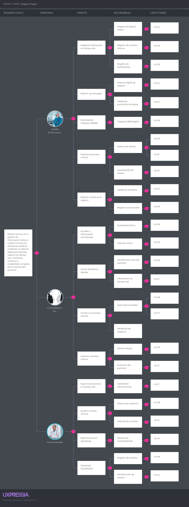
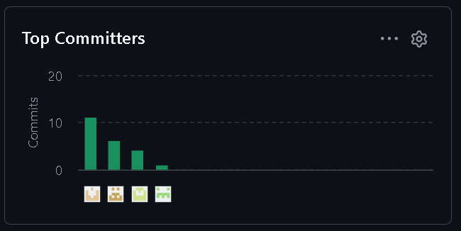
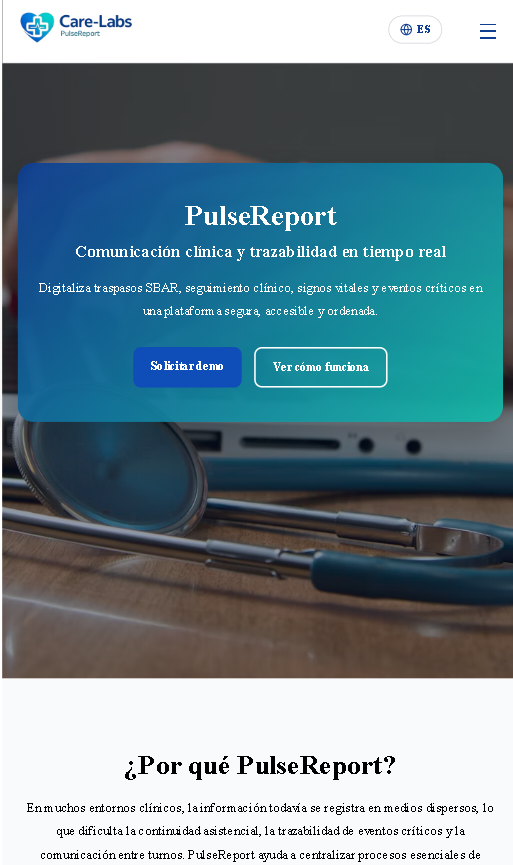
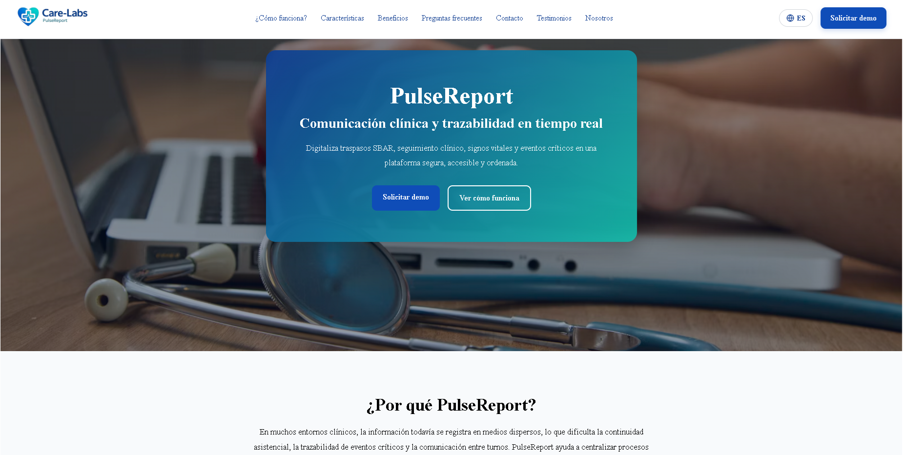

<p align="center">
  
</p>
<div align = "center">
  <h1>Universidad Peruana de Ciencias Aplicadas</h1>
<h1>Facultad de Ingeniería</h1>
  <h2>Carrera de Ingeniería de Software</h2>
  <h2>Periodo 202610</h2>
  <h2>1ASI0729 - Desarrollo de Aplicaciones Open Source </h2>
  <h2>NRC- 2610</h2>
  <br>
  <h2>Profesor - Angel Augusto Velasquez Nuñez </h2>
  <h2>Informe de Trabajo </h2>
  <br>
  <h2 >Startup - Care-Labs </h2>
  <h2 >Producto - PulseReport </h2>
  <br>
  <h2 >Integrantes</h2>
  <ul style="list-style: none; padding: 0;">
      <li><h3>U202417693 - Alexander Auden Aliaga Ocampo</h3></li>
      <li><h3>U202217893 - Adrian Matias Rios Cespedes </h3></li>
      <li><h3>U20221c803 - Anhelo Rodrigo Rocca Leon </h3></li>
      <li><h3>U202417448 - Johan Giovani Huamán Cuba </h3></li>
  </ul>
  <br>
  <h4>Abril del 2026</h4>
  <br>
  </div>


## Contenido

- [Student Outcome](#student-outcome)

- [Capítulo I: Introducción](#capítulo-1-introducción)
    - [1.1. Startup Profile](#11-startup-profile)
        - [1.1.1. Descripción de la Startup](#111-descripción-de-la-startup)
        - [1.1.2. Perfiles de integrantes del equipo](#112-perfiles-de-integrantes-del-equipo)
    - [1.2. Solution Profile](#12-solution-profile)
        - [1.2.1 Antecedentes y problemática](#121-antecedentes-y-problemática)
        - [1.2.2 Lean UX Process](#122-lean-ux-process)
            - [1.2.2.1. Lean UX Problem Statements](#1221-lean-ux-problem-statements)
            - [1.2.2.2. Lean UX Assumptions](#1222-lean-ux-assumptions)
            - [1.2.2.3. Lean UX Hypothesis Statements](#1223-lean-ux-hypothesis-statements)
            - [1.2.2.4. Lean UX Canvas](#1224-lean-ux-canvas)
    - [1.3. Segmentos objetivo](#13-segmentos-objetivo)

- [Capítulo II: Requirements Elicitation & Analysis](#capítulo-ii-requirements-elicitation--analysis)
    - [2.1. Competidores](#21-competidores)
        - [2.1.1. Análisis competitivo](#211-análisis-competitivo)
        - [2.1.2. Estrategias y tácticas frente a competidores](#212-estrategias-y-tácticas-frente-a-competidores)
    - [2.2. Entrevistas](#22-entrevistas)
        - [2.2.1. Diseño de entrevistas](#221-diseño-de-entrevistas)
        - [2.2.2. Registro de entrevistas](#222-registro-de-entrevistas)
        - [2.2.3. Análisis de entrevistas](#223-análisis-de-entrevistas)
    - [2.3. Needfinding](#23-needfinding)
        - [2.3.1. User Personas](#231-user-personas)
        - [2.3.2. User Task Matrix](#232-user-task-matrix)
        - [2.3.3. User Journey Mapping](#233-user-journey-mapping)
        - [2.3.4. Empathy Mapping](#234-empathy-mapping)
    - [2.4. Big Picture EventStorming](#24-big-picture-eventstorming)
    - [2.5. Ubiquitous Language](#25-ubiquitous-language)


- [Capítulo III: Requirements Specification](#capítulo-iii-requirements-specification)
    - [3.1. User Stories](#31-user-stories)
    - [3.2. Impact Mapping](#32-impact-mapping)
    - [3.3. Product Backlog](#33-product-backlog)


- [Capítulo IV: Product Design](#capítulo-iv-product-design)
    - [4.1. Style Guidelines](#41-style-guidelines)
        - [4.1.1. General Style Guidelines](#411-general-style-guidelines)
        - [4.1.2. Web Style Guidelines](#412-web-style-guidelines)
    - [4.2. Information Architecture](#42-information-architecture)
        - [4.2.1. Organization Systems](#421-organization-systems)
        - [4.2.2. Labeling Systems](#422-labeling-systems)
        - [4.2.3. SEO Tags and Meta Tags](#423-seo-tags-and-meta-tags)
        - [4.2.4. Searching Systems](#424-searching-systems)
        - [4.2.5. Navigation Systems](#425-navigation-systems)
    - [4.3. Landing Page UI Design](#43-landing-page-ui-design)
        - [4.3.1. Landing Page Wireframe](#431-landing-page-wireframe)
        - [4.3.2. Landing Page Mock-up](#432-landing-page-mock-up)
    - [4.4. Web Applications UX/UI Design](#44-web-applications-uxui-design)
        - [4.4.1. Web Applications Wireframes](#441-web-applications-wireframes)
        - [4.4.2. Web Applications Wireflow Diagrams](#442-web-applications-wireflow-diagrams)
        - [4.4.3. Web Applications Mock-ups](#443-web-applications-mock-ups)
        - [4.4.4. Web Applications User Flow Diagrams](#444-web-applications-user-flow-diagrams)
    - [4.5. Web Applications Prototyping](#45-web-applications-prototyping)
    - [4.6. Domain-Driven Software Architecture](#46-domain-driven-software-architecture)
        - [4.6.1. Design-Level EventStorming](#461-design-level-eventstorming)
        - [4.6.2. Software Architecture Context Diagram](#462-software-architecture-context-diagram)
        - [4.6.3. Software Architecture Container Diagrams](#463-software-architecture-container-diagrams)
        - [4.6.4. Software Architecture Components Diagrams](#464-software-architecture-components-diagrams)
    - [4.7. Software Object-Oriented Design](#47-software-object-oriented-design)
        - [4.7.1. Class Diagrams](#471-class-diagrams)
    - [4.8. Database Design](#48-database-design)
        - [4.8.1. Database Diagram](#481-database-diagram)


- [Capítulo V: Product Implementation, Validation & Deployment](#capítulo-v-product-implementation-validation--deployment)
    - [5.1. Software Configuration Management](#51-software-configuration-management)
        - [5.1.1. Software Development Environment Configuration](#511-software-development-environment-configuration)
        - [5.1.2. Source Code Management](#512-source-code-management)
        - [5.1.3. Source Code Style Guide & Conventions](#513-source-code-style-guide--conventions)
        - [5.1.4. Software Deployment Configuration](#514-software-deployment-configuration)
    - [5.2. Landing Page, Services & Applications Implementation](#52-landing-page-services--applications-implementation)
        - [5.2.1. Sprint 1](#521-sprint-1)
            - [5.2.1.1. Sprint Planning 1](#5211-sprint-planning-1)
            - [5.2.1.2. Aspect Leaders and Collaborators](#5212-aspect-leaders-and-collaborators)
            - [5.2.1.3. Sprint Backlog 1](#5213-sprint-backlog-1)
            - [5.2.1.4. Development Evidence for Sprint Review](#5214-development-evidence-for-sprint-review)
            - [5.2.1.5. Execution Evidence for Sprint Review](#5215-execution-evidence-for-sprint-review)
            - [5.2.1.6. Services Documentation Evidence for Sprint Review](#5216-services-documentation-evidence-for-sprint-review)
            - [5.2.1.7. Software Deployment Evidence for Sprint Review](#5217-software-deployment-evidence-for-sprint-review)
            - [5.2.1.8. Team Collaboration Insights during Sprint](#5218-team-collaboration-insights-during-sprint)
         
- [Conclusiones](#conclusiones)
- [Bibliografía](#bibliografía)
- [Anexos](#anexos)

## Registro de Version de Informe


## Student Outcome

El curso contribuye al cumplimiento del Student Outcome ABET:

**ABET – EAC - Student Outcome 5**

**Criterio:** : La capacidad de funcionar efectivamente en un equipo cuyos miembros
juntos proporcionan liderazgo, crean un entorno de colaboración e inclusivo,
establecen objetivos, planifican tareas y cumplen objetivos.

<table>
  <tr>
    <th style="width: 20%;">Criterio específico</th>
    <th style="width: 45%;">Acciones realizadas</th>
    <th style="width: 35%;">Conclusiones</th>
  </tr>
  <tr>
    <td>Proporciona liderazgo y crea un entorno colaborativo e inclusivo.</td>
    <td><b>Johan Giovani Huamán Cuba</b><br><b>AV1:</b> Lideró las sesiones de diseño de la arquitectura de la plataforma Care-Labs e instruyó al equipo en la definición lógica de los diagramas de contexto, contenedores y componentes. Fomentó la participación de todos al establecer estándares claros de documentación técnica.<br><br><b>Alexander Auden Aliaga Ocampo</b><br><b>AV1:</b> Facilitó la comunicación para definir los requerimientos de los arquetipos de usuario y las entrevistas. Promovió un ambiente de confianza donde el equipo debatió libremente sobre las necesidades reales del personal de enfermería.<br><br><b>Adrian Matias Rios Cespedes</b><br><b>AV1:</b> Asumió el rol de guía en la estructuración de la base de datos y la lógica del backend. Apoyó a sus compañeros para entender las relaciones complejas entre entidades clínicas y módulos de auditoría.<br><br><b>Anhelo Rodrigo Rocca Leon</b><br><b>AV1:</b> Condujo los debates sobre la experiencia del usuario y la interfaz de la aplicación web. Motivó al grupo para aportar ideas enfocadas en el flujo del sistema y la creación de un entorno accesible para el personal médico.</td>
    <td><b>Johan:</b> Demostró una clara capacidad para alinear las perspectivas técnicas y de usuario. Consolidó un ambiente de trabajo inclusivo donde cada miembro aportó al diseño general.<br><br><b>Alexander:</b> Logró integrar la visión del usuario final al equipo. Su intervención fomentó la empatía grupal y garantizó que las decisiones técnicas tuvieran sentido clínico.<br><br><b>Adrian:</b> Impulsó el aprendizaje cruzado dentro del equipo. Demostró paciencia y claridad al explicar conceptos relacionales aplicados al sector salud.<br><br><b>Anhelo:</b> Creó un clima de colaboración creativa. Su iniciativa permitió transformar requerimientos médicos complejos en soluciones visuales amigables.</td>
  </tr>
  <tr>
    <td>Establece objetivos, planifica tareas y cumple metas.</td>
    <td><b>Johan Giovani Huamán Cuba</b><br><b>AV1:</b> Planificó y estructuró las entregas del diseño de software mediante hitos de trabajo bien definidos. Estableció metas claras para la cobertura técnica de los Bounded Contexts según la rúbrica del curso.<br><br><b>Alexander Auden Aliaga Ocampo</b><br><b>AV1:</b> Organizó el cronograma para la fase de entrevistas y la validación del problema. Definió plazos específicos para la investigación inicial del proyecto y la consolidación de respuestas.<br><br><b>Adrian Matias Rios Cespedes</b><br><b>AV1:</b> Dividió el diseño del modelo físico de base de datos en tareas pequeñas y asignó revisiones cruzadas. Trazó metas para culminar los diagramas de clases a tiempo.<br><br><b>Anhelo Rodrigo Rocca Leon</b><br><b>AV1:</b> Diseñó un plan de trabajo para mapear los procesos de enfermería, como el modelo de traspasos SBAR. Estableció fechas límite para la revisión de los componentes del frontend.</td>
    <td><b>Johan:</b> Logró cumplir cabalmente con los objetivos del proyecto a través de una planificación estructurada. Su división de la complejidad garantizó entregas de alta calidad.<br><br><b>Alexander:</b> Su organización metódica garantizó la culminación a tiempo de la base teórica del proyecto. Este trabajo sirvió como guía oportuna para iniciar la fase técnica.<br><br><b>Adrian:</b> Alcanzó los objetivos propuestos gracias a su enfoque pragmático. Su buena gestión de tareas redujo los cuellos de botella durante el modelado del sistema.<br><br><b>Anhelo:</b> Su capacidad para visualizar el proyecto por etapas aseguró el cumplimiento del diseño de la interfaz y procesos de manera ordenada y puntual.</td>
  </tr>
</table>


  ## Capítulo 1: Introducción
### 1.1. Startup Profile
#### 1.1.1. Descripción de la Startup
Somos Care-Labs, una startup creada por estudiantes con el propósito de desarrollar una solución tecnológica para el sector salud. Nuestro proyecto surge a partir de la necesidad de mejorar la gestión de procesos críticos en el área de enfermería cardiovascular, donde es muy importante contar con información clara, segura y disponible en tiempo real para brindar una atención más ordenada y eficiente.

A través de nuestra propuesta, buscamos desarrollar un sistema web que permita apoyar distintos procesos clínicos, como la gestión de citas médicas, la administración básica de pacientes, la digitalización del historial clínico, el registro de traspasos mediante el modelo SBAR, el seguimiento de tratamientos y el monitoreo de signos vitales, como la presión arterial y la frecuencia cardíaca. Además, el sistema también permitirá registrar eventos críticos, generar alertas y mantener un log de auditoría inalterable que ayude a conservar la trazabilidad de la información. De esta manera, se busca mejorar la comunicación entre turnos, la organización del personal de salud y la continuidad del cuidado del paciente.

Misión:
Nuestra misión es desarrollar una solución tecnológica que ayude a mejorar la gestión de procesos críticos en enfermería cardiovascular, facilitando el acceso a información clínica de manera rápida, segura y ordenada. Buscamos contribuir a que los centros de salud puedan brindar una atención más eficiente y confiable mediante el uso de herramientas digitales.

Visión:
Nuestra visión es convertir a Care-Labs en una startup reconocida por ofrecer una solución tecnológica útil e innovadora para el sector salud, aportando a la modernización de hospitales, clínicas y centros especializados. Aspiramos a que nuestra propuesta pueda crecer, adaptarse a las necesidades del mercado y generar un impacto positivo en la atención médica.


#### 1.1.2. Perfiles de integrantes del equipo
<table>
  <tr>
    <th colspan="2"> Alexander Auden Aliaga Ocampo </th>
  </tr>
  <tr>
    <td>  </td>
    <td> Soy estudiante de ingeniería de software en la UPC, con conocimientos básicos en los lenguajes de programación como c++, python , css, html, javascript también conocimientos básicos en base de datos viendo Mongo DB y creando diagramas relaciones como no relacionales. Además poseo habilidades de empatía y buena comunicación con el equipo esto me permite ser productivo en el ámbito de grupos y en general. </td>
  </tr>
  <tr>
    <th colspan="2"> Adrian Matias Rios Cespedes </th>
  </tr>
  <tr>
    <td>  </td>
    <td> Soy estudiante de Ingeniería de Software en la Universidad Peruana de Ciencias Aplicadas (UPC), con conocimientos en lenguajes de programación como C++, Python y JavaScript. Cuento con formación en bases de datos y fundamentos relacionados a su gestión.

Además, poseo habilidades blandas orientadas al trabajo en equipo, comunicación efectiva y liderazgo, lo que me permite organizar y dirigir proyectos de manera eficiente, manteniendo un enfoque estructurado y orientado a resultados. </td>
  </tr>

<tr>
    <th colspan="2"> Anhelo Rodrigo Rocca Leon </th>
  </tr>
  <tr>
    <td>  </td>
    <td> Soy estudiante de Ingeniería de Software. Cuento con conocimientos en los lenguajes de programación como C++, Python y SQL. Me comprometo a trabajar con mi equipo en el desarrollo de nuestro proyecto, al igual que ayudar siempre que mis capacidades lo permitan. </td>
  </tr>
  <tr>
    <th colspan="2"> Johan Giovani Huamán Cuba </th>
  </tr>
  <tr>
    <td>  </td>
    <td> Ahora, soy estudiante, luego, seré ingeniero. Cuento con conocimientos suficientes para crear cualquier sistema con ayuda de la inteligente artificial.
    Me dediqué mucho más a desarrollar mis habilidades en bases de datos, arquitectura de software y manejo de equipo IT. En este equipo no demuestro lo 
    último pues considero que cuento con un buen líder. </td>
  </tr>
</table>


### 1.2. Solution Profile
#### 1.2.1. Antecedentes y problemática

A. **Who**

Los principales actores involucrados son los profesionales de salud del área de enfermería cardiovascular, médicos especialistas, personal asistencial, clínicas privadas, hospitales y centros especializados en cardiología. Todos ellos enfrentan dificultades en la gestión de procesos críticos debido al uso de registros manuales, información dispersa y poca trazabilidad clínica.

B. **What**

Actualmente, muchos procesos dentro del área de enfermería cardiovascular se realizan de manera manual o mediante sistemas poco integrados, lo que genera problemas en la comunicación entre turnos, retrasos en el acceso a la información, errores en el registro de signos vitales, dificultades en el seguimiento de tratamientos y poca trazabilidad de eventos críticos. Además, la falta de un sistema centralizado limita la organización de los historiales clínicos y el control adecuado de la atención brindada al paciente.

C. **When**

Estos problemas se presentan de manera continua durante la atención diaria de los pacientes, especialmente en momentos como el cambio de turno del personal, el monitoreo de signos vitales, el registro de incidencias, la actualización de historiales clínicos y el seguimiento de tratamientos. Los riesgos aumentan en situaciones críticas donde se necesita actuar rápidamente y contar con información precisa en tiempo real.

D. **Where**

La problemática ocurre en hospitales, clínicas privadas, centros de salud especializados en cardiología y otras áreas asistenciales donde se atienden pacientes con condiciones cardiovasculares. En estos entornos, la falta de digitalización y trazabilidad afecta tanto al personal de salud como a la calidad de atención brindada.

E. **Why**

Porque la ausencia de una plataforma digital centralizada genera:

- Dificultades en la comunicación entre turnos y áreas asistenciales.
- Pérdida de trazabilidad en eventos clínicos importantes.
- Mayor probabilidad de errores en el registro de signos vitales y tratamientos.
- Demora en el acceso a información relevante del paciente.
- Menor eficiencia en la organización y seguimiento de los procesos clínicos.

Esto impacta directamente en la continuidad del cuidado, la seguridad del paciente y la eficiencia del personal de salud.

F. **How**

Actualmente, muchos centros de salud utilizan historias en papel, hojas de cálculo o sistemas básicos que no están completamente integrados. Aunque algunas instituciones cuentan con herramientas digitales, estas no siempre permiten registrar traspasos SBAR, monitorear signos vitales en tiempo real, generar alertas de eventos críticos o mantener un log de auditoría inalterable. Como resultado, varios problemas siguen presentes en la gestión clínica diaria.

G. **How much**

El impacto de esta problemática se refleja en:

- Pérdida de tiempo del personal de salud en tareas manuales y repetitivas.
- Riesgo de errores en registros clínicos y en la comunicación entre turnos.
- Dificultades para dar seguimiento oportuno a tratamientos y eventos críticos.
- Menor capacidad de respuesta ante situaciones que requieren atención inmediata.
- Reducción en la eficiencia operativa y en la calidad del servicio brindado al paciente.

#### 1.2.2. Lean UX Process
##### 1.2.2.1. Lean UX Problem Statements

### Segmento — Personal de Enfermería Cardiovascular

**Contexto:** El personal de enfermería cardiovascular se encarga del monitoreo constante de pacientes, del registro de signos vitales, del seguimiento de tratamientos y de la comunicación entre turnos para asegurar la continuidad del cuidado.

**Observación:** Actualmente, muchos de estos procesos se realizan de manera manual o mediante registros dispersos, lo que puede generar errores en la documentación, pérdida de información relevante, retrasos en la atención y dificultades en la comunicación entre áreas asistenciales.

**Problema:** No existe una herramienta centralizada y fácil de usar que permita al personal de enfermería cardiovascular registrar información clínica importante, dar seguimiento a tratamientos, documentar traspasos SBAR y mantener trazabilidad de eventos críticos en tiempo real.

**Pregunta clave:** ¿Cómo diseñar una solución digital que permita al personal de enfermería cardiovascular registrar y consultar información clínica de manera rápida, segura y ordenada, mejorando la comunicación entre turnos, la trazabilidad de eventos críticos y la continuidad del cuidado del paciente?


### Segmento — Clínicas, Hospitales y Centros Especializados en Cardiología

**Contexto:** Las instituciones de salud y centros especializados necesitan optimizar sus procesos clínicos, reducir errores operativos y asegurar una atención de calidad, especialmente en áreas críticas donde se requiere acceso inmediato a información confiable.

**Observación:** La falta de integración entre registros clínicos, seguimiento de pacientes, control de signos vitales y documentación de incidencias dificulta la supervisión de procesos y limita la capacidad de respuesta ante eventos críticos.

**Problema:** No se cuenta con una plataforma web que centralice los procesos esenciales de enfermería cardiovascular, facilite la supervisión de pacientes y permita una gestión más eficiente de la información clínica dentro de hospitales, clínicas y centros especializados.

**Pregunta clave:** ¿Cómo implementar una plataforma digital que permita a las instituciones de salud centralizar información clínica, supervisar procesos críticos, mejorar la trazabilidad y fortalecer la calidad de atención en el área de enfermería cardiovascular?


##### 1.2.2.2. Lean UX Assumptions

###### Supuestos sobre los usuarios de la aplicación:

- El personal de enfermería cardiovascular necesita registrar y consultar información clínica de manera rápida, clara y segura durante su jornada diaria.
- Los profesionales de salud requieren una herramienta que facilite la comunicación entre turnos y reduzca la pérdida de información importante en los traspasos.
- Las clínicas, hospitales y centros especializados necesitan mejorar la organización y supervisión de procesos críticos relacionados con el cuidado del paciente.
- Los usuarios prefieren interfaces simples e intuitivas que les permitan acceder fácilmente a signos vitales, tratamientos, historial clínico y eventos críticos.

###### Supuestos sobre necesidades

- El registro manual de información clínica y signos vitales es un proceso repetitivo y propenso a errores.
- La falta de trazabilidad en eventos críticos y en los traspasos entre turnos puede afectar la continuidad del cuidado del paciente.
- Los profesionales de salud necesitan contar con información actualizada en tiempo real para tomar decisiones oportunas.
- Es importante disponer de un sistema que centralice la información clínica básica y permita un seguimiento más ordenado de pacientes y tratamientos.

###### Supuestos sobre la solución

- Una plataforma web permitirá centralizar la información clínica y facilitar su acceso desde distintos puntos dentro de la institución de salud.
- El registro digital de traspasos SBAR mejorará la comunicación entre turnos y áreas asistenciales.
- El monitoreo y almacenamiento de signos vitales dentro del sistema ayudará a mantener un mejor control del estado del paciente.
- Un log de auditoría inalterable permitirá mantener la trazabilidad de eventos críticos y reforzar la confiabilidad de la información registrada.

###### Supuestos sobre el impacto

- La solución reducirá el tiempo invertido en tareas manuales de registro y seguimiento clínico.
- Disminuirá la probabilidad de errores en la documentación de signos vitales, tratamientos y eventos críticos.
- Mejorará la continuidad del cuidado del paciente al fortalecer la comunicación entre turnos.
- Permitirá a las instituciones de salud tener una gestión más ordenada, trazable y eficiente de sus procesos clínicos en el área de enfermería cardiovascular.

##### 1.2.2.3. Lean UX Hypothesis Statements

**Hipótesis de Valor**  
Creemos que el *personal de enfermería cardiovascular* y las *instituciones de salud* necesitan una plataforma digital que les permita registrar, consultar y dar seguimiento a información clínica crítica de manera rápida, segura y ordenada.  
Tendrán éxito utilizando PulseReport porque les permitirá mejorar la comunicación entre turnos, fortalecer la trazabilidad clínica y optimizar la continuidad del cuidado del paciente.

**Hipótesis de Funcionalidad**  
Creemos que proporcionar funciones como el registro de traspasos SBAR, monitoreo de signos vitales, gestión básica de pacientes, seguimiento de tratamientos, alertas de eventos críticos y un log de auditoría inalterable permitirá que los usuarios gestionen procesos clínicos de forma más eficiente.  
Sabremos que esta funcionalidad es útil cuando observemos un uso constante de la plataforma, una reducción de errores en los registros y una mejora en la documentación de eventos clínicos importantes.

**Hipótesis de Usabilidad**  
Creemos que los usuarios podrán navegar la interfaz de PulseReport de manera intuitiva, ya que estará diseñada con flujos simples, información clara y acceso rápido a las funciones más importantes del sistema.  
Validaremos esta hipótesis mediante pruebas de usabilidad en las que los usuarios puedan completar tareas como registrar signos vitales, consultar pacientes y documentar traspasos sin ayuda adicional.

**Hipótesis de Crecimiento**  
Creemos que si la plataforma demuestra mejoras en la organización de la información clínica, la trazabilidad y la comunicación entre áreas asistenciales, hospitales, clínicas y centros especializados estarán dispuestos a adoptar la solución de manera progresiva.  
Sabremos que esto es cierto cuando las instituciones muestren interés en ampliar el uso del sistema, incorporar nuevos módulos o mantener el servicio bajo el modelo de suscripción.


##### 1.2.2.4. Lean UX Canvas

| **Sección** | **Descripción** |
|------------|-----------------|
| **1. Problema / Oportunidad** | En el área de enfermería cardiovascular, muchos procesos clínicos aún se realizan de manera manual o con herramientas poco integradas, lo que genera errores en los registros, dificultades en la comunicación entre turnos, poca trazabilidad de eventos críticos y retrasos en la atención. PulseReport busca digitalizar y optimizar estos procesos mediante una plataforma web que centralice la información clínica relevante y mejore la continuidad del cuidado del paciente. |
| **2. Usuarios y Clientes** | **Usuarios:** Personal de enfermería cardiovascular, médicos especialistas, personal asistencial. <br> **Clientes:** Hospitales, clínicas privadas, centros especializados en cardiología y profesionales de salud independientes. |
| **3. Supuestos** | Los usuarios necesitan acceder a información clínica de manera rápida y segura; las instituciones requieren mayor trazabilidad en los procesos asistenciales; la plataforma será adoptada si cuenta con una interfaz simple e intuitiva; la gestión digital de registros clínicos mejorará la comunicación y reducirá errores operativos. |
| **4. Necesidades del Usuario** | Registrar signos vitales, documentar traspasos SBAR, consultar historial clínico, dar seguimiento a tratamientos, registrar eventos críticos, recibir alertas y acceder a la información desde una plataforma segura y ordenada. |
| **5. Solución Propuesta** | Plataforma web orientada a la gestión de procesos críticos en enfermería cardiovascular, desarrollada para centralizar citas médicas, pacientes, historial clínico, tratamientos, signos vitales, eventos críticos y un log de auditoría inalterable, complementada con un dashboard básico para seguimiento clínico. |
| **6. Resultados (Outcomes)** | **Resultados esperados:** Mejor comunicación entre turnos, mayor trazabilidad clínica, menos errores en registros y mejor organización del cuidado del paciente. <br> **KPIs:** Reducción de errores en documentación, tiempo de registro de información clínica, cantidad de eventos críticos correctamente trazados, frecuencia de uso de la plataforma y número de usuarios activos. |
| **7. Experimentos** | Pruebas de usabilidad con usuarios simulados, validación del flujo de registro de signos vitales, simulación de traspasos SBAR, pruebas del registro de eventos críticos y evaluación del dashboard básico para comprobar que el MVP cubre las necesidades esenciales del personal de salud. |
| **8. MVP (Producto Mínimo Viable)** | Registro básico de pacientes, registro de signos vitales, documentación de traspasos SBAR, seguimiento simple de tratamientos, registro de eventos críticos, log de auditoría básico y dashboard inicial con visualización resumida de la información. |

### 1.3 Segmentos Objetivo

### Segmento objetivo #1: Personal de enfermería cardiovascular  
Este grupo está conformado por profesionales de salud que participan directamente en la atención y monitoreo de pacientes con enfermedades cardiovasculares dentro de hospitales, clínicas y centros especializados. Su labor incluye el registro de signos vitales, la documentación de tratamientos, la comunicación entre turnos y el seguimiento constante del estado del paciente para asegurar una atención continua y segura.

**Características clave de este segmento:**  
- Buscan optimizar el registro y consulta de información clínica para reducir errores y ahorrar tiempo.  
- Valoran sistemas que faciliten la comunicación entre turnos y mejoren la continuidad del cuidado del paciente.  
- Requieren herramientas que permitan registrar signos vitales, tratamientos y eventos críticos de forma rápida y ordenada.  
- Se interesan por plataformas intuitivas que les ayuden a trabajar de manera más eficiente en entornos de alta demanda.  

---

### Segmento objetivo #2: Hospitales, clínicas privadas y centros especializados en cardiología  
Este grupo está conformado por instituciones de salud que necesitan optimizar sus procesos clínicos y administrativos relacionados con la atención de pacientes en áreas cardiovasculares. Su interés principal es mejorar la organización, la trazabilidad de la información clínica y la calidad de atención, al mismo tiempo que reducen errores operativos y fortalecen la supervisión de procesos críticos.

**Características clave de este segmento:**  
- Buscan soluciones tecnológicas que centralicen la información clínica y faciliten su acceso en tiempo real.  
- Valoran plataformas que mejoren la trazabilidad de eventos críticos y la supervisión de procesos asistenciales.  
- Necesitan sistemas que contribuyan a una mejor organización del personal y de la atención brindada a los pacientes.  
- Se interesan por herramientas escalables bajo modelo SaaS que puedan adaptarse a las necesidades de su institución.

### 2.1. Competidores

En el sector de soluciones tecnológicas aplicadas al entorno hospitalario y la gestión clínica, existen diversas plataformas y herramientas que buscan optimizar el monitoreo de pacientes, la administración de información médica y la comunicación entre profesionales de la salud. Estas soluciones representan competencia directa e indirecta para PulseReport debido a que abordar parcialmente las necesidades del personal médico y de enfermería.

Los principales competidores identificados se clasifican en tres categorías: sistemas hospitalarios integrales (EHR/HIS), sistemas de monitoreo clínico y métodos tradicionales de gestión clínica.

**Competidor 1: Sistemas EHR/HIS (Electronic Health Record / Hospital Information System)**

Ejemplos:
-Epic Systems
-Cerner
-Allscripts

Descripción
Los sistemas EHR/HIS son plataformas integrales utilizadas por hospitales y clínicas para gestionar historiales médicos electrónicos, citas, tratamientos, diagnósticos, facturación y otros procesos administrativos y clínicos.

Estas soluciones centralizan gran parte de la información hospitalaria y permiten la interoperabilidad entre distintas áreas médicas dentro de una institución de salud.

**Competidor 2: Sistemas de monitoreo clínico**

Ejemplos:
-Philips IntelliVue
-GE Healthcare Patient Monitoring
-Mindray Monitoring Systems

Descripción
Son soluciones enfocadas principalmente en el monitoreo continuo de signos vitales y variables biomédicas mediante dispositivos médicos especializados conectados en tiempo real. 

Estas plataformas son utilizadas principalmente en áreas críticas como UCI, emergencias y unidades cardiovasculares, permitiendo supervisar constantemente el estado fisiológico del paciente.

**Competidor 3: Métodos tradicionales de gestión clínica**

Ejemplos:
-Registros físicos en papel
-Hojas de control manual
-Archivos Excel
-Reportes escritos entre turnos

Descripción
A pesar del avance tecnológico en el sector salud, muchos centros médicos continúan utilizando métodos tradicionales para registrar información clínica y coordinar actividades del personal de salud.

Estos métodos suelen depender de documentación manual, registros físicos y archivos digitales no especializados, especialmente en instituciones con limitada digitalización o recursos tecnológicos reducidos.

**Competidor 4: Aplicaciones de gestión clínica especializada**

Ejemplos:
-Medscape
-NurseGrid
-CareCloud

Descripción
Son aplicaciones enfocadas en optimizar determinadas actividades del entorno clínico, como la coordinación de personal médico, comunicación entre equipos de salud, seguimiento de pacientes o gestión parcial de información clínica. 

Aunque no funcionan como sistemas hospitalarios completos, estas plataformas buscan mejorar la eficiencia operativa del personal sanitario mediante herramientas digitales especializadas.

#### 2.1.1. Análisis competitivo


#### 2.1.2. Estrategias y tácticas frente a competidores

Con base en el análisis competitivo realizado, PulseReport plantea estrategias orientadas a aprovechar las debilidades identificadas en las soluciones actuales y diferenciarse mediante una propuesta especializada, accesible y centrada en el personal de enfermería cardiovascular.


**Estrategia 1: Especialización en enfermería cardiovascular**

Descripción

A diferencia de los sistemas EHR/HIS tradicionales, que están orientados a procesos hospitalarios generales, PulseReport busca especializarse en las necesidades operativas del personal de enfermería cardiovascular.

Tácticas

Diseñar funcionalidades enfocadas en procesos críticos de enfermería.
Priorizar registros clínicos rápidos y comunicación SBAR.
Adaptar el sistema al flujo operativo real del personal médico.


**Estrategia 2: Diferenciación mediante simplicidad y usabilidad**

Descripción

Frente a la complejidad operativa de los sistemas hospitalarios tradicionales, PulseReport busca diferenciarse mediante una interfaz intuitiva y procesos simplificados.

Tácticas

Reducir pasos en tareas críticas.
Implementar formularios rápidos e intuitivos.
Aplicar principios de diseño centrado en el usuario.


**Estrategia 3: Implementación progresiva mediante MVP**

Descripción

Con el objetivo de reducir barreras de adopción y validar rápidamente la solución, PulseReport utilizará una estrategia de desarrollo incremental basada en un Producto Mínimo Viable (MVP).

Tácticas

Implementar inicialmente funcionalidades esenciales.
Validar el sistema con usuarios reales.
Iterar continuamente mediante feedback clínico.


**Estrategia 4: Integración complementaria con sistemas existentes**

Descripción

En lugar de competir directamente con plataformas EHR/HIS consolidadas, PulseReport busca posicionarse como una herramienta complementaria especializada.

Tácticas

Permitir exportación de información clínica.
Diseñar arquitectura modular escalable.
Mantener compatibilidad con flujos hospitalarios existentes.


**Estrategia 5: Accesibilidad y reducción de costos operativos**

Descripción

PulseReport busca aprovechar la oportunidad existente en instituciones que no pueden implementar sistemas hospitalarios complejos debido a sus altos costos.

Tácticas

Ofrecer un modelo SaaS accesible.
Reducir costos de implementación.
Minimizar dependencia de infraestructura especializada.


**Estrategia 6: Fortalecimiento de trazabilidad clínica y comunicación**

Descripción

PulseReport busca resolver las limitaciones identificadas en métodos tradicionales y plataformas de monitoreo clínico respecto a trazabilidad y transferencia de información.

Tácticas

Registrar historial de eventos clínicos.
Implementar control de accesos por roles.
Centralizar información relevante del paciente.


Ventaja competitiva

La principal ventaja competitiva de PulseReport radica en ofrecer una solución especializada, accesible y enfocada específicamente en optimizar la comunicación y trazabilidad clínica del personal de enfermería cardiovascular, evitando la complejidad presente en los sistemas hospitalarios tradicionales.


Posicionamiento estratégico

PulseReport no busca reemplazar plataformas hospitalarias integrales, sino complementar los procesos clínicos existentes mediante una herramienta especializada orientada a mejorar la eficiencia operativa y la continuidad de atención del paciente.


### 2.2. Entrevistas

La presente sección desarrolla el diseño de entrevistas aplicado a los segmentos objetivos identificados durante la etapa de análisis del problema y análisis competitivo.

El objetivo principal de las entrevistas es comprender las necesidades, frustraciones, comportamientos y dificultades presentes dentro de los procesos clínicos relacionados con el registro de información médica, monitoreo de pacientes y comunicación entre turnos en el área cardiovascular.

Asimismo, la información recopilada permitirá construir User Personas realistas, identificar pain points y definir requerimientos funcionales centrados en las necesidades reales de los usuarios.

Para el diseño de entrevistas se aplicaron buenas prácticas de investigación UX, utilizando preguntas abiertas, lenguaje claro y preguntas orientadas a experiencias reales dentro del entorno hospitalario.

#### 2.2.1. Diseño de entrevistas

# Segmento objetivo 1: Personal de enfermería cardiovascular

## Descripción del segmento

Este segmento está conformado por enfermeros y enfermeras que trabajan en áreas cardiovasculares dentro de hospitales y clínicas.

Son responsables del monitoreo constante de pacientes, administración de medicamentos, registro clínico y comunicación entre turnos médicos.

Debido a la naturaleza crítica de sus actividades, requieren herramientas rápidas, intuitivas y accesibles que reduzcan la carga operativa y minimicen errores clínicos.

---

## Información principal a recolectar

* Métodos actuales de registro clínico.
* Problemas frecuentes durante los turnos.
* Dificultades en comunicación entre turnos.
* Tiempo invertido en documentación.
* Uso actual de herramientas digitales.
* Necesidades operativas no cubiertas.
* Nivel de satisfacción con sistemas hospitalarios actuales.
* Problemas relacionados con trazabilidad clínica.

---

## Información complementaria para arquetipos

| Característica               | Información a recolectar                      |
| ---------------------------- | --------------------------------------------- |
| Edad                         | Rango de edad                                 |
| Género                       | Masculino / Femenino                          |
| Experiencia laboral          | Años de experiencia                           |
| Área de trabajo              | UCI, hospitalización, emergencia              |
| Nivel tecnológico            | Básico, intermedio o avanzado                 |
| Dispositivos utilizados      | PC, tablet o smartphone                       |
| Objetivos                    | Optimizar tiempos y reducir errores           |
| Frustraciones                | Sistemas complejos y procesos lentos          |
| Canales digitales utilizados | Sistemas hospitalarios y aplicaciones móviles |

---

## Preguntas principales

1. ¿Cómo realiza actualmente el registro de información clínica durante su turno?

2. ¿Qué herramientas utiliza para registrar o consultar información médica?

3. ¿Qué problemas enfrenta con los sistemas utilizados actualmente?

4. ¿Cómo se realiza la comunicación entre turnos?

5. ¿Ha ocurrido pérdida de información o errores durante cambios de turno?

6. ¿Cuánto tiempo considera que dedica al registro clínico?

7. ¿Qué tan intuitivos considera los sistemas hospitalarios actuales?

8. ¿Qué funcionalidades considera importantes en una herramienta digital para enfermería?

9. ¿Considera útil una solución que centralice información clínica y facilite comunicación entre turnos?

10. ¿Qué mejoraría de los sistemas actuales utilizados en su centro de salud?

---

## Preguntas complementarias

1. ¿Qué situaciones generan mayor estrés durante el turno?

2. ¿Con qué frecuencia utiliza dispositivos móviles durante su trabajo?

3. ¿Qué tan cómodo se siente utilizando nuevas tecnologías?

4. ¿Prefiere registrar información desde computadora o desde un dispositivo móvil?

5. ¿Qué tipo de información considera más importante durante el cambio de turno?

6. ¿Considera que la digitalización mejora la calidad de atención al paciente?

---

# Segmento objetivo 2: Médicos especialistas cardiovasculares

## Descripción del segmento

Este segmento está conformado por médicos especialistas cardiovasculares encargados del monitoreo y toma de decisiones clínicas en pacientes críticos.

Requieren acceso rápido y preciso a información clínica relevante para optimizar diagnósticos, seguimiento de pacientes y coordinación con el personal de enfermería.

---

## Información principal a recolectar

* Acceso actual a información clínica.
* Problemas relacionados con trazabilidad.
* Dificultades en comunicación clínica.
* Limitaciones de sistemas hospitalarios.
* Necesidades relacionadas con monitoreo y seguimiento.
* Percepción sobre digitalización hospitalaria.

---

## Información complementaria para arquetipos

| Característica          | Información a recolectar                                 |
| ----------------------- | -------------------------------------------------------- |
| Edad                    | Rango de edad                                            |
| Especialidad            | Cardiología, cirugía cardiovascular o medicina intensiva |
| Experiencia laboral     | Años de experiencia                                      |
| Área de trabajo         | UCI, hospitalización o emergencia                        |
| Nivel tecnológico       | Básico, intermedio o avanzado                            |
| Objetivos               | Acceso rápido a información clínica                      |
| Frustraciones           | Información fragmentada y sistemas lentos                |
| Dispositivos utilizados | Laptop, tablet o smartphone                              |

---

## Preguntas principales

1. ¿Cómo accede actualmente a la información clínica de los pacientes?

2. ¿Qué problemas identifica en la comunicación entre médicos y enfermería?

3. ¿Ha experimentado retrasos o errores debido a información incompleta?

4. ¿Qué tan eficientes considera los sistemas hospitalarios actuales?

5. ¿Qué información considera crítica durante la atención de un paciente cardiovascular?

6. ¿Qué funcionalidades considera importantes en una plataforma clínica digital?

7. ¿Considera importante mejorar la trazabilidad clínica dentro del hospital?

8. ¿Qué limitaciones identifica en los sistemas hospitalarios actuales?

---

## Preguntas complementarias

1. ¿Qué tan frecuentemente utiliza plataformas digitales en su trabajo?

2. ¿Qué tipo de reportes clínicos consulta con mayor frecuencia?

3. ¿Considera importante el acceso móvil a información clínica?

4. ¿Qué tan importante es la rapidez de acceso a datos clínicos?

5. ¿Qué situaciones generan mayores riesgos por falta de información?

---

# Buenas prácticas aplicadas en el diseño de entrevistas

* Uso de preguntas abiertas para obtener respuestas más detalladas.
* Uso de lenguaje claro y comprensible.
* Evitar preguntas que induzcan respuestas.
* Enfoque en experiencias reales de los usuarios.
* Combinación de preguntas principales y complementarias.
* Recolección de información funcional y emocional.
* Identificación de necesidades, motivaciones y frustraciones.
* Obtención de información útil para construcción de User Personas.

---

# Resultados esperados

Las entrevistas permitirán:

* Identificar pain points dentro del entorno clínico.
* Detectar limitaciones de los sistemas hospitalarios actuales.
* Comprender necesidades reales del personal médico.
* Construir User Personas realistas.
* Definir requerimientos funcionales y no funcionales.
* Validar la propuesta de valor de PulseReport.
* Identificar oportunidades de mejora en procesos clínicos y comunicación hospitalaria.


#### 2.2.2. Registro de entrevistas

**Entrevista 1 – Enfermera clínica**
<table border=1>
  <tr>
    <td>
      <b>Nombres y apellidos:</b> Maria Torres <br>
      <b>Edad: </b> 28 años <br>
      <b>Distrito:</b> San Miguel <br>
      <b>Ocupacion:</b> Enfermera clínica <br>
      <b>Timing:</b> 0:00 <br>
      <b>Duración:</b> 0:00
    </td>
    <td align=center>
      
    </td>
  </tr>
  <tr>
    <td colspan=2>
      <b>Enlace:</b> <a href="XXXXXXXXXXXXXXXXXXXXX"> Link </a>
      <br>
      <b>Resumen:</b> La entrevistada indicó que su trabajo implica el monitoreo constante de pacientes y el registro de signos vitales. Señaló que, en la práctica, la información se registra primero en papel y luego se transfiere al sistema digital, lo que genera retrasos y posibles omisiones. La comunicación entre turnos se realiza principalmente de forma verbal, lo que ocasiona pérdida de información relevante. Además, mencionó que suele perder tiempo buscando datos debido a que la información está dispersa. Considera fundamental la trazabilidad de eventos clínicos y estaría dispuesta a usar una herramienta digital siempre que sea rápida, simple y reduzca la carga operativa.
    </td>
  </tr>
</table>


**Entrevista 2 – Médico general**

<table border=1>
  <tr>
    <td>
      <b>Nombres y apellidos:</b> Luis Ramirez <br>
      <b>Edad: </b> 35 años <br>
      <b>Distrito:</b> Lima <br>
      <b>Ocupacion:</b> Médico General <br>
      <b>Timing:</b> 0:00 <br>
      <b>Duración:</b> 0:00
    </td>
    <td align=center>
      
    </td>
  </tr>
  <tr>
    <td colspan=2>
      <b>Enlace:</b> <a href="XXXXXXXXXXXXXXXXXXXXX"> Link </a>
      <br>
      <b>Resumen:</b> El entrevistado indicó que depende de la información registrada para la toma de decisiones clínicas. Sin embargo, señaló que dicha información suele estar incompleta o desactualizada, lo que representa un riesgo en la atención del paciente. La comunicación entre turnos no siempre es estructurada, lo que dificulta comprender el estado real del paciente. También mencionó que acceder a la información puede tomar tiempo. Considera crítica la trazabilidad de eventos clínicos y valora la existencia de una herramienta que permita acceder a información clara, confiable y actualizada.
    </td>
  </tr>
</table>

<table border=1>
  <tr>
    <td>
      <b>Nombres y apellidos:</b> Mark Alex Esquivel Cabrera <br>
      <b>Edad: </b> 27 años <br>
      <b>Distrito:</b> Ate <br>
      <b>Ocupacion:</b> Médico cirujano <br>
      <b>Timing:</b> 1:06 minutos <br>
      <b>Duración:</b> 14:07 minutos
    </td>
    <td align=center>
      
    </td>
  </tr>
  <tr>
    <td colspan=2>
      <b>Enlace:</b> <a href="https://upcedupe-my.sharepoint.com/:v:/g/personal/u202417448_upc_edu_pe/IQDEg1dERgrVRq-XGS40DedPAaxPeYnZt8jHwLrCX1XHmEw?e=8ncHUd"> Link </a>
      <br>
      <b>Resumen:</b> Mark labora en un centro de salud rural con un sistema de registro doble. El personal primero anota los datos generales, los síntomas y los códigos de las enfermedades en una hoja de papel. Luego, alguien traslada esa información a un Excel muy básico para mantener un archivo de los pacientes.

Este método actual genera un problema grave: la pérdida de trazabilidad. La letra de los doctores muchas veces resulta ilegible. Además, el personal suele olvidar detalles y deja espacios en blanco en las hojas. Estas fallas complican el seguimiento médico del paciente.

Mark muestra mucha disposición para probar un sistema tecnológico nuevo. Él considera que la plataforma debe ser segura y sobre todo fácil de usar. Su mayor preocupación involucra a los doctores de la tercera edad. Si el sistema resulta complejo, estos médicos rechazarán la herramienta y el centro de salud volverá a usar los archivos de Excel por costumbre.
    </td>
  </tr>
</table>

**Entrevista 3 – Administrador de clínica**

<table border=1>
  <tr>
    <td>
      <b>Nombres y apellidos:</b> Carlos Mendez <br>
      <b>Edad: </b> 45 años <br>
      <b>Distrito:</b> Santiago de Surco <br>
      <b>Ocupacion:</b> Administrador de Clínica <br>
      <b>Timing:</b> 0:00 <br>
      <b>Duración:</b> 0:00
    </td>
    <td align=center>
      
    </td>
  </tr>
  <tr>
    <td colspan=2>
      <b>Enlace:</b> <a href="XXXXXXXXXXXXXXXXXXXXX"> Link </a>
      <br>
      <b>Resumen:</b> El entrevistado explicó que su función está relacionada con la supervisión de procesos y control de calidad. Señaló que actualmente existe dificultad para auditar lo que ocurre en cada turno debido a registros incompletos o poco claros. La comunicación entre turnos no siempre está documentada adecuadamente, lo que limita la trazabilidad. También indicó que consolidar información para análisis operativo toma tiempo. Considera fundamental contar con una herramienta que permita registrar eventos de forma clara, auditable y estructurada.
    </td>
  </tr>
</table>

### 2.2.3. Análisis de entrevistas

# 2.2.3 Análisis de entrevistas

## Introducción

La presente sección desarrolla el análisis de las entrevistas realizadas a los segmentos objetivo identificados durante la etapa de Requirements Elicitation & Analysis.

El objetivo del análisis es identificar patrones recurrentes, necesidades operativas, comportamientos, frustraciones y oportunidades de mejora dentro del entorno cardiovascular hospitalario, utilizando como fuente de información las entrevistas y resúmenes previamente desarrollados.

Asimismo, el análisis busca identificar características objetivas y subjetivas necesarias para la construcción de los User Personas y para la definición de requerimientos funcionales y no funcionales del sistema PulseReport.

Los resultados obtenidos permiten validar problemáticas reales dentro del flujo clínico actual y evidenciar oportunidades para el desarrollo de una solución especializada orientada a mejorar la trazabilidad clínica, comunicación estructurada y eficiencia operativa.

---

# Segmento objetivo 1: Personal de enfermería cardiovascular

## Entrevistas analizadas

* Andrea Salazar
* Carla Villanueva
* María Fernanda León

Total de entrevistas analizadas: 3

---

# Análisis de características objetivas

| Característica objetiva                                           | Evidencia identificada        | Porcentaje |
| ----------------------------------------------------------------- | ----------------------------- | ---------- |
| Uso diario de sistemas hospitalarios                              | Evidente en las 3 entrevistas | 100%       |
| Uso complementario de registros físicos                           | Evidente en las 3 entrevistas | 100%       |
| Dependencia de computadoras fijas                                 | Evidente en las 3 entrevistas | 100%       |
| Uso frecuente de smartphones y herramientas digitales             | Evidente en las 3 entrevistas | 100%       |
| Experiencia laboral mayor a 5 años                                | Presente en 2 entrevistas     | 67%        |
| Nivel tecnológico intermedio o alto                               | Evidente en las 3 entrevistas | 100%       |
| Participación constante en procesos críticos de monitoreo clínico | Evidente en las 3 entrevistas | 100%       |

---

# Análisis de características subjetivas

| Característica subjetiva                            | Evidencia identificada        | Porcentaje |
| --------------------------------------------------- | ----------------------------- | ---------- |
| Estrés operativo elevado durante turnos críticos    | Presente en las 3 entrevistas | 100%       |
| Frustración por lentitud y complejidad de sistemas  | Presente en las 3 entrevistas | 100%       |
| Necesidad de rapidez operativa en registro clínico  | Presente en las 3 entrevistas | 100%       |
| Temor a omisiones o pérdida de información          | Presente en 2 entrevistas     | 67%        |
| Necesidad de comunicación estructurada entre turnos | Presente en las 3 entrevistas | 100%       |
| Preferencia por interfaces simples e intuitivas     | Presente en las 3 entrevistas | 100%       |
| Interés por soluciones móviles y accesibles         | Presente en 2 entrevistas     | 67%        |

---

# Análisis e interpretación del segmento

El análisis realizado permitió identificar un patrón recurrente relacionado con la sobrecarga operativa generada por los sistemas hospitalarios actuales dentro del entorno de enfermería cardiovascular.

El 100% de las entrevistadas manifestó utilizar sistemas digitales diariamente; sin embargo, también se evidenció que dichos sistemas no responden adecuadamente a las necesidades de rapidez y simplicidad requeridas dentro de áreas clínicas críticas. Como consecuencia, las entrevistadas indicaron recurrir frecuentemente a registros físicos temporales para mantener continuidad operativa durante momentos de alta presión asistencial.

Este hallazgo evidencia una brecha importante entre el diseño actual de las herramientas hospitalarias y el flujo real de trabajo del personal de enfermería, especialmente en situaciones donde el tiempo de respuesta tiene impacto directo sobre la atención clínica.

Asimismo, se identificó que la complejidad de interfaces y la excesiva cantidad de pasos requeridos para registrar información generan frustración operativa, acumulación de tareas y mayor carga cognitiva durante los turnos.

Otro patrón crítico identificado corresponde a los cambios de turno. El 100% de las entrevistadas señaló dificultades relacionadas con comunicación desestructurada, omisión parcial de información y necesidad de validación manual de datos clínicos. Este hallazgo evidencia la necesidad de implementar mecanismos estandarizados de comunicación clínica, como el modelo SBAR, dentro del flujo operativo del sistema.

Desde la perspectiva tecnológica, las entrevistadas demostraron una alta adaptación al uso de herramientas digitales y dispositivos móviles, evidenciando oportunidad para implementar funcionalidades móviles que reduzcan dependencia de estaciones fijas y mejoren accesibilidad a información clínica relevante.

A partir de los hallazgos identificados, se evidencia la necesidad de que PulseReport priorice:

* reducción de pasos operativos,
* rapidez en registro clínico,
* comunicación estructurada,
* trazabilidad de información,
* y visualización resumida del estado del paciente.

---

# Segmento objetivo 2: Médicos especialistas cardiovasculares

## Entrevistas analizadas

* Luis Mendoza
* Jorge Ramírez
* Renato Paredes

Total de entrevistas analizadas: 3

---

# Análisis de características objetivas

| Característica objetiva                                       | Evidencia identificada        | Porcentaje |
| ------------------------------------------------------------- | ----------------------------- | ---------- |
| Uso diario de sistemas hospitalarios                          | Evidente en las 3 entrevistas | 100%       |
| Uso frecuente de herramientas digitales clínicas              | Evidente en las 3 entrevistas | 100%       |
| Experiencia laboral mayor a 10 años                           | Evidente en las 3 entrevistas | 100%       |
| Uso de dispositivos móviles en entorno clínico                | Presente en 2 entrevistas     | 67%        |
| Nivel tecnológico intermedio o alto                           | Evidente en las 3 entrevistas | 100%       |
| Participación directa en procesos críticos de decisión médica | Evidente en las 3 entrevistas | 100%       |

---

# Análisis de características subjetivas

| Característica subjetiva                             | Evidencia identificada        | Porcentaje |
| ---------------------------------------------------- | ----------------------------- | ---------- |
| Frustración por fragmentación de información clínica | Presente en las 3 entrevistas | 100%       |
| Necesidad de acceso rápido a información crítica     | Presente en las 3 entrevistas | 100%       |
| Importancia de trazabilidad médica                   | Presente en las 3 entrevistas | 100%       |
| Necesidad de comunicación estructurada entre equipos | Presente en 2 entrevistas     | 67%        |
| Preferencia por dashboards clínicos resumidos        | Presente en 2 entrevistas     | 67%        |
| Interés por integración tecnológica                  | Presente en las 3 entrevistas | 100%       |
| Rechazo a herramientas excesivamente complejas       | Presente en 2 entrevistas     | 67%        |

---

# Análisis e interpretación del segmento

El análisis realizado permitió identificar que uno de los principales problemas dentro del entorno médico cardiovascular es la fragmentación de información clínica entre múltiples sistemas, registros físicos y mecanismos de comunicación verbal.

El 100% de los entrevistados manifestó dificultades para acceder rápidamente a información relevante durante procesos de toma de decisiones clínicas, especialmente dentro de áreas críticas como UCI cardiovascular y cirugía cardiovascular. Este hallazgo evidencia limitaciones importantes en los sistemas hospitalarios actuales respecto a visualización rápida y centralización de información médica.

Asimismo, se identificó que los sistemas existentes poseen una orientación predominantemente administrativa, obligando al personal médico a navegar entre múltiples módulos y registros para reconstruir el estado clínico del paciente. Esta situación incrementa tiempos operativos y genera carga innecesaria durante contextos de alta presión clínica.

Otro hallazgo relevante corresponde a la necesidad de trazabilidad médica. Los entrevistados resaltaron la importancia de identificar claramente quién registró determinada información, cuándo fue actualizada y qué cambios ocurrieron durante la evolución clínica del paciente. Este aspecto no solo representa una necesidad operativa, sino también clínica y legal.

Adicionalmente, se identificó interés recurrente por soluciones que permitan integración automática de información proveniente de distintos sistemas y equipos biomédicos, reduciendo trabajo manual y duplicidad de registros clínicos.

Desde la perspectiva tecnológica, los entrevistados demostraron apertura hacia herramientas digitales rápidas, intuitivas y accesibles desde dispositivos móviles, siempre que estas no incrementen complejidad operativa ni carga administrativa adicional.

A partir de los hallazgos identificados, se evidencia la necesidad de que PulseReport priorice:

* centralización de información clínica,
* dashboards resumidos,
* integración tecnológica,
* trazabilidad médica,
* acceso rápido a datos críticos,
* y comunicación estructurada entre profesionales de salud.

---

# Conclusiones generales del análisis

El análisis realizado permitió identificar patrones recurrentes compartidos entre ambos segmentos objetivo relacionados con:

* complejidad de sistemas hospitalarios,
* exceso de carga administrativa,
* fragmentación de información clínica,
* necesidad de rapidez operativa,
* problemas de comunicación durante cambios de turno,
* necesidad de trazabilidad,
* y preferencia por herramientas intuitivas y de acceso rápido.

Asimismo, se evidenció que los sistemas hospitalarios actuales no se encuentran completamente alineados con el flujo operativo real del entorno cardiovascular clínico, generando procesos manuales adicionales, duplicidad de registros y pérdida de eficiencia operativa.

Los hallazgos obtenidos validan la necesidad de una solución especializada como PulseReport, enfocada en:

* simplificar procesos clínicos,
* reducir carga operativa,
* mejorar comunicación estructurada mediante SBAR,
* optimizar trazabilidad médica,
* y facilitar acceso rápido a información crítica dentro del entorno cardiovascular hospitalario.

### 2.3. Needfinding
#### 2.3.1. User Personas

La presente sección desarrolla los User Personas del proyecto PulseReport, elaborados a partir de los hallazgos obtenidos en el análisis de entrevistas y el análisis competitivo. Estos artefactos permiten representar de forma estructurada a los principales usuarios del sistema, considerando sus necesidades, objetivos, frustraciones, comportamientos, nivel tecnológico y contexto de uso dentro del entorno cardiovascular hospitalario.

La construcción de los User Personas se relaciona directamente con los artefactos desarrollados previamente. Las entrevistas permitieron identificar problemas recurrentes como la complejidad de los sistemas hospitalarios, la duplicidad de registros, la falta de trazabilidad, la fragmentación de información clínica y las dificultades de comunicación durante cambios de turno. Por otro lado, el análisis competitivo permitió reconocer oportunidades de diferenciación frente a soluciones existentes, especialmente mediante una propuesta más especializada, intuitiva y adaptada al flujo operativo real del personal clínico cardiovascular.

Para la elaboración de estos arquetipos se tomaron en cuenta características objetivas, como edad, ocupación, experiencia laboral, área de trabajo, dispositivos utilizados y canales digitales; y características subjetivas, como motivaciones, frustraciones, personalidad, objetivos, comportamiento operativo y necesidades UX. Estos elementos permiten que cada User Persona represente un segmento objetivo específico y sirva como base para la definición de requerimientos funcionales, requerimientos no funcionales y decisiones de diseño centradas en el usuario.

En este proyecto se elaboran dos User Personas, uno por cada segmento objetivo identificado: personal de enfermería cardiovascular y médicos especialistas cardiovasculares. Ambos perfiles permiten comprender cómo PulseReport puede responder a necesidades reales del entorno clínico, priorizando rapidez operativa, comunicación estructurada, trazabilidad médica y acceso eficiente a información crítica.

(SUBIR IMAGEN DE USERPERSONA 1)
(SUBIR IMAGEN DE USERPERSONA 2)
#### 2.3.2. User Task Matrix

La presente sección desarrolla el **User Task Matrix** del proyecto PulseReport. Este artefacto permite organizar y comparar las principales tareas que realizan los User Personas dentro del entorno cardiovascular hospitalario para cumplir sus objetivos profesionales.

El análisis se basa en los hallazgos obtenidos en las entrevistas, el análisis de entrevistas y los User Personas definidos previamente. Su finalidad es identificar cuáles son las tareas más frecuentes e importantes para cada segmento objetivo, con el propósito de orientar posteriormente la priorización de requerimientos del sistema.

Es importante precisar que las tareas incluidas en esta matriz **no representan funcionalidades, botones, módulos ni características de PulseReport**. Las tareas corresponden a actividades reales que los usuarios ya realizan actualmente dentro de su flujo laboral, independientemente de la existencia de una solución tecnológica. Por ello, se formulan como acciones propias del usuario y no como opciones del software.

Los User Personas considerados son:

| User Persona         | Segmento objetivo                     |
| -------------------- | ------------------------------------- |
| Daniela Ríos         | Personal de enfermería cardiovascular |
| Dr. Alejandro Torres | Médico especialista cardiovascular    |

Para cada tarea se evalúan dos criterios:

| Criterio    | Descripción                                                                                                                   |
| ----------- | ----------------------------------------------------------------------------------------------------------------------------- |
| Frecuencia  | Qué tan seguido realiza el User Persona dicha tarea dentro de su jornada laboral.                                             |
| Importancia | Nivel de impacto que tiene la tarea en la continuidad clínica, seguridad del paciente y cumplimiento del trabajo profesional. |

---

# User Task Matrix

| Tarea identificada                                           | Daniela Ríos — Frecuencia | Daniela Ríos — Importancia | Dr. Alejandro Torres — Frecuencia | Dr. Alejandro Torres — Importancia |
| ------------------------------------------------------------ | ------------------------: | -------------------------: | --------------------------------: | ---------------------------------: |
| Registrar signos vitales del paciente                        |                  Muy alta |                    Crítica |                             Media |                               Alta |
| Registrar administración de medicamentos                     |                  Muy alta |                    Crítica |                              Baja |                               Alta |
| Consultar evolución clínica reciente del paciente            |                      Alta |                    Crítica |                          Muy alta |                            Crítica |
| Comunicar información relevante durante cambio de turno      |                  Muy alta |                    Crítica |                              Alta |                            Crítica |
| Revisar indicaciones médicas actualizadas                    |                      Alta |                    Crítica |                          Muy alta |                            Crítica |
| Reportar eventos clínicos relevantes del paciente            |                      Alta |                    Crítica |                              Alta |                            Crítica |
| Confirmar evolución y registros previos del paciente         |                     Media |                       Alta |                              Alta |                            Crítica |
| Coordinar acciones clínicas con otros profesionales de salud |                      Alta |                       Alta |                              Alta |                            Crítica |
| Priorizar pacientes según su estado clínico                  |                      Alta |                    Crítica |                              Alta |                            Crítica |
| Reunir información clínica desde diferentes fuentes          |                      Alta |                       Alta |                          Muy alta |                            Crítica |
| Validar información registrada por otros miembros del equipo |                     Media |                       Alta |                              Alta |                               Alta |
| Identificar cambios críticos en el estado del paciente       |                      Alta |                    Crítica |                          Muy alta |                            Crítica |
| Preparar información para rondas o evaluación médica         |                     Media |                       Alta |                              Alta |                               Alta |
| Actualizar información clínica luego de una intervención     |                      Alta |                    Crítica |                             Media |                               Alta |
| Consultar reportes físicos o registros complementarios       |                      Alta |                      Media |                             Media |                              Media |
| Completar información pendiente después de una emergencia    |                      Alta |                       Alta |                              Baja |                              Media |
| Revisar balance general del paciente                         |                     Media |                       Alta |                              Alta |                            Crítica |
| Confirmar cumplimiento de indicaciones clínicas              |                      Alta |                    Crítica |                              Alta |                            Crítica |

---

# Análisis de tareas con mayor frecuencia e importancia

A partir del User Task Matrix se identifican tareas que presentan alta frecuencia e importancia crítica para ambos segmentos objetivo. Estas tareas representan actividades esenciales dentro del flujo clínico cardiovascular, debido a que tienen impacto directo en la seguridad del paciente, la continuidad de atención y la coordinación entre profesionales de salud.

Las tareas más relevantes para ambos User Personas son:

| Tarea crítica                                           | Justificación                                                                              |
| ------------------------------------------------------- | ------------------------------------------------------------------------------------------ |
| Consultar evolución clínica reciente del paciente       | Permite comprender rápidamente el estado actual del paciente y tomar decisiones adecuadas. |
| Comunicar información relevante durante cambio de turno | Reduce el riesgo de pérdida de información entre equipos clínicos.                         |
| Revisar indicaciones médicas actualizadas               | Permite ejecutar tratamientos correctamente y evitar acciones desactualizadas.             |
| Reportar eventos clínicos relevantes del paciente       | Facilita el seguimiento de situaciones críticas y mejora la trazabilidad del caso.         |
| Identificar cambios críticos en el estado del paciente  | Permite responder oportunamente ante deterioros clínicos.                                  |
| Confirmar cumplimiento de indicaciones clínicas         | Reduce riesgos asociados a omisiones, duplicidad de acciones o errores de coordinación.    |

Estas tareas deben ser consideradas prioritarias porque evidencian necesidades comunes entre ambos perfiles: acceso rápido a información, comunicación estructurada, trazabilidad clínica y reducción de errores operativos.

---

# Tareas más relevantes para Daniela Ríos

Daniela Ríos representa al personal de enfermería cardiovascular. Sus tareas se concentran principalmente en el registro, monitoreo, ejecución de indicaciones y comunicación operativa durante el turno.

| Tarea                                                     | Frecuencia | Importancia |
| --------------------------------------------------------- | ---------: | ----------: |
| Registrar signos vitales del paciente                     |   Muy alta |     Crítica |
| Registrar administración de medicamentos                  |   Muy alta |     Crítica |
| Comunicar información relevante durante cambio de turno   |   Muy alta |     Crítica |
| Actualizar información clínica luego de una intervención  |       Alta |     Crítica |
| Confirmar cumplimiento de indicaciones clínicas           |       Alta |     Crítica |
| Completar información pendiente después de una emergencia |       Alta |        Alta |
| Consultar reportes físicos o registros complementarios    |       Alta |       Media |

## Interpretación

El perfil de Daniela evidencia que el personal de enfermería cardiovascular realiza tareas operativas de alta frecuencia y alta precisión. El registro de signos vitales, administración de medicamentos y actualización de información clínica son actividades recurrentes que deben ejecutarse con rapidez para mantener continuidad en la atención del paciente.

También se identifica que la comunicación durante cambios de turno es una tarea crítica, ya que representa un punto vulnerable donde puede perderse información relevante. Esta situación confirma la necesidad de estructurar mejor la transferencia de información clínica entre equipos.

Además, la tarea de completar información pendiente después de una emergencia evidencia una brecha operativa importante: los sistemas actuales no siempre acompañan la velocidad del entorno clínico, lo que obliga al personal a regularizar datos posteriormente. Esto puede generar carga adicional, estrés operativo y riesgo de omisiones.

Desde la perspectiva de requerimientos, este análisis sugiere que PulseReport debe priorizar flujos que permitan registrar información de forma rápida, estructurada y con mínima carga cognitiva para el personal de enfermería.

---

# Tareas más relevantes para Dr. Alejandro Torres

El Dr. Alejandro Torres representa a los médicos especialistas cardiovasculares. Sus tareas se enfocan principalmente en consultar, interpretar, validar y utilizar información clínica para la toma de decisiones médicas.

| Tarea                                                        | Frecuencia | Importancia |
| ------------------------------------------------------------ | ---------: | ----------: |
| Consultar evolución clínica reciente del paciente            |   Muy alta |     Crítica |
| Revisar indicaciones médicas actualizadas                    |   Muy alta |     Crítica |
| Reunir información clínica desde diferentes fuentes          |   Muy alta |     Crítica |
| Identificar cambios críticos en el estado del paciente       |   Muy alta |     Crítica |
| Confirmar evolución y registros previos del paciente         |       Alta |     Crítica |
| Revisar balance general del paciente                         |       Alta |     Crítica |
| Coordinar acciones clínicas con otros profesionales de salud |       Alta |     Crítica |

## Interpretación

El perfil del Dr. Alejandro evidencia que los médicos especialistas cardiovasculares requieren información centralizada, precisa y disponible de forma inmediata. A diferencia del personal de enfermería, sus tareas no se concentran principalmente en registrar información, sino en revisarla, interpretarla y tomar decisiones clínicas a partir de ella.

La tarea de reunir información clínica desde diferentes fuentes aparece como una de las más frecuentes e importantes. Esto evidencia un problema relevante identificado en las entrevistas: la información del paciente suele encontrarse dispersa entre sistemas hospitalarios, reportes físicos, comunicación verbal y registros complementarios.

Asimismo, la identificación de cambios críticos y la revisión de evolución clínica son tareas indispensables para el trabajo médico cardiovascular, debido a que afectan directamente la toma de decisiones en contextos de alta presión.

Desde la perspectiva de requerimientos, este análisis sugiere que PulseReport debe priorizar vistas clínicas resumidas, acceso rápido a información relevante y mecanismos de trazabilidad que permitan validar la evolución del paciente de manera eficiente.

---

# Coincidencias entre ambos User Personas

| Coincidencia identificada                                 | Explicación                                                                                    | Implicancia para PulseReport                                               |
| --------------------------------------------------------- | ---------------------------------------------------------------------------------------------- | -------------------------------------------------------------------------- |
| Ambos necesitan acceder rápidamente a información clínica | Tanto enfermería como médicos dependen de información actualizada para cumplir sus tareas.     | El sistema debe priorizar navegación simple y visualización resumida.      |
| Ambos participan en continuidad de atención               | Ambos perfiles intervienen en procesos de cambio de turno, seguimiento y coordinación clínica. | Debe incorporarse comunicación estructurada mediante SBAR.                 |
| Ambos requieren trazabilidad de información               | Necesitan conocer qué ocurrió, cuándo ocurrió y quién registró determinada información.        | El sistema debe registrar responsables, horarios y cambios relevantes.     |
| Ambos enfrentan información dispersa                      | Las entrevistas evidencian uso de sistemas, registros físicos y comunicación verbal.           | PulseReport debe centralizar datos relevantes del paciente.                |
| Ambos rechazan procesos complejos                         | Los usuarios priorizan rapidez y simplicidad en contextos clínicos.                            | La interfaz debe reducir pasos operativos y carga cognitiva.               |
| Ambos trabajan bajo presión clínica                       | Las tareas se realizan en contextos donde el tiempo tiene impacto directo en la atención.      | El sistema debe estar optimizado para rapidez, claridad y mínima fricción. |

---

# Diferencias entre ambos User Personas

| Diferencia                      | Daniela Ríos                                   | Dr. Alejandro Torres                      | Implicancia para PulseReport                                                |
| ------------------------------- | ---------------------------------------------- | ----------------------------------------- | --------------------------------------------------------------------------- |
| Tipo de tarea principal         | Registro, ejecución y comunicación operativa   | Consulta, análisis y decisión clínica     | Se requieren flujos diferenciados según rol.                                |
| Frecuencia de registro          | Muy alta                                       | Media o baja                              | El flujo de enfermería debe minimizar pasos para ingresar datos.            |
| Uso principal de la información | Registrar y comunicar información clínica      | Interpretar y validar información clínica | El sistema debe incluir tanto registro rápido como visualización analítica. |
| Riesgo principal                | Omisión o retraso en registro clínico          | Decisión con información incompleta       | Se requieren alertas, trazabilidad y centralización de información.         |
| Momento crítico                 | Cambio de turno y atención directa al paciente | Evaluación clínica y toma de decisiones   | El sistema debe soportar escenarios de continuidad y análisis clínico.      |
| Necesidad dominante             | Agilidad operativa                             | Acceso rápido a información consolidada   | Deben existir vistas y prioridades adaptadas a cada perfil.                 |

---

# Priorización preliminar de tareas

A partir de la frecuencia e importancia observadas, se identifican tareas que deben ser consideradas de mayor prioridad para el diseño de PulseReport.

| Prioridad | Tarea                                                   | Justificación                                                                 |
| --------- | ------------------------------------------------------- | ----------------------------------------------------------------------------- |
| Crítica   | Comunicar información relevante durante cambio de turno | Impacta directamente en continuidad de atención y reducción de omisiones.     |
| Crítica   | Consultar evolución clínica reciente del paciente       | Es esencial para la toma de decisiones médicas y seguimiento clínico.         |
| Crítica   | Registrar signos vitales del paciente                   | Es una tarea de alta frecuencia para enfermería y base del monitoreo clínico. |
| Crítica   | Revisar indicaciones médicas actualizadas               | Reduce riesgos asociados a tratamientos desactualizados o incompletos.        |
| Crítica   | Identificar cambios críticos en el estado del paciente  | Permite actuar oportunamente ante deterioro clínico.                          |
| Alta      | Confirmar evolución y registros previos del paciente    | Refuerza trazabilidad y validación de información clínica.                    |
| Alta      | Reunir información clínica desde diferentes fuentes     | Evidencia necesidad de centralización y reducción de búsqueda manual.         |

---

# Conclusión del User Task Matrix

El User Task Matrix evidencia que las tareas más importantes dentro del entorno cardiovascular hospitalario están relacionadas con el registro clínico, consulta rápida de información, comunicación entre turnos, trazabilidad médica y seguimiento de eventos críticos.

Para el personal de enfermería cardiovascular, las tareas prioritarias se concentran en registrar, actualizar y comunicar información clínica de forma rápida y precisa. Para los médicos especialistas cardiovasculares, las tareas prioritarias se enfocan en acceder, interpretar y validar información crítica para la toma de decisiones.

Las principales coincidencias entre ambos perfiles muestran la necesidad de una solución que mejore la continuidad clínica, reduzca la dispersión de información y facilite la trazabilidad. Las principales diferencias indican que PulseReport debe considerar flujos diferenciados: uno orientado al registro rápido para enfermería y otro orientado a visualización clínica resumida para médicos.

A partir de este análisis, PulseReport debe priorizar funcionalidades orientadas a:

* registro clínico rápido,
* comunicación estructurada mediante SBAR,
* visualización resumida de evolución clínica,
* centralización de información del paciente,
* trazabilidad de eventos clínicos,
* reducción de pasos operativos,
* y soporte a la toma de decisiones clínicas.

Estas prioridades se derivan directamente de tareas reales identificadas en los User Personas, por lo que permiten orientar el desarrollo del sistema hacia necesidades concretas del entorno cardiovascular hospitalario.

#### 2.3.3. User Journey Mapping.

La presente sección desarrolla los User Journey Maps As-Is del proyecto PulseReport. Estos artefactos representan el recorrido actual que realizan los User Personas dentro del entorno cardiovascular hospitalario, antes de la implementación de la solución propuesta.

Los Journey Maps se elaboran a partir de los hallazgos obtenidos en las entrevistas, el análisis de entrevistas, los User Personas y el User Task Matrix. Su propósito es comprender cómo los usuarios realizan actualmente sus actividades, qué puntos de contacto utilizan, qué emociones experimentan, qué dificultades enfrentan y qué oportunidades de mejora pueden ser consideradas posteriormente en el diseño del sistema.

Cada mapa representa un recorrido end-to-end, es decir, desde el inicio hasta el cierre de una actividad clínica relevante. En este caso, se desarrollan dos User Journey Maps As-Is:

| User Persona         | Segmento objetivo                     | Journey Map As-Is                                                                                  |
| -------------------- | ------------------------------------- | -------------------------------------------------------------------------------------------------- |
| Daniela Ríos         | Personal de enfermería cardiovascular | Desde la recepción del turno hasta la entrega de información al siguiente equipo                   |
| Dr. Alejandro Torres | Médico especialista cardiovascular    | Desde la identificación de un paciente crítico hasta la toma y seguimiento de una decisión clínica |

Estos mapas no describen el funcionamiento de PulseReport, sino el proceso actual del usuario sin la solución, permitiendo identificar pain points, emociones y oportunidades de mejora del contexto real.

User Journey Map 1 — Daniela Ríos

| Campo             | Información                                                                      |
| ----------------- | -------------------------------------------------------------------------------- |
| User Persona      | Daniela Ríos                                                                     |
| Segmento objetivo | Personal de enfermería cardiovascular                                            |
| Rol               | Enfermera cardiovascular                                                         |
| Área              | UCI cardiovascular                                                               |
| Journey As-Is     | Desde la recepción del turno hasta la entrega de información al siguiente equipo |


Escenario As-Is

Daniela inicia su turno en UCI cardiovascular. Debe recibir información del equipo anterior, revisar el estado de sus pacientes, monitorear signos vitales, administrar medicamentos, registrar eventos clínicos y finalmente entregar información clara y completa al siguiente turno.

Actualmente, estas actividades se realizan mediante sistemas hospitalarios complejos, computadoras fijas, registros físicos complementarios y comunicación verbal. El proceso presenta dificultades relacionadas con dispersión de información, duplicidad de registros, exceso de pasos operativos y falta de comunicación estructurada.

Objetivo del Journey

Identificar las dificultades actuales que enfrenta el personal de enfermería cardiovascular durante el monitoreo, registro clínico y transferencia de información entre turnos, con la finalidad de detectar oportunidades de mejora relacionadas con rapidez operativa, comunicación estructurada y trazabilidad.

(INSERTAR IMAGEN DE USER JOURNEY MAP AS IS DE DANIELA)

Resumen del Journey — Daniela Ríos

El recorrido de Daniela evidencia que el personal de enfermería cardiovascular enfrenta una alta carga operativa al combinar atención directa al paciente con monitoreo y documentación clínica. Los principales puntos de fricción aparecen durante el registro de información, la atención de eventos críticos, la regularización posterior de datos y la entrega de turno.

Asimismo, se observa que los registros físicos complementarios surgen como una solución informal frente a la lentitud del sistema, pero generan duplicidad, riesgo de error y mayor carga cognitiva. El cambio de turno también representa un momento vulnerable por la falta de una estructura uniforme en la comunicación.

User Journey Map 2 — Dr. Alejandro Torres

| Campo             | Información                                                                                        |
| ----------------- | -------------------------------------------------------------------------------------------------- |
| User Persona      | Dr. Alejandro Torres                                                                               |
| Segmento objetivo | Médico especialista cardiovascular                                                                 |
| Rol               | Cardiólogo intensivista                                                                            |
| Área              | UCI cardiovascular                                                                                 |
| Journey As-Is     | Desde la identificación de un paciente crítico hasta la toma y seguimiento de una decisión clínica |

Escenario As-Is

El Dr. Alejandro Torres debe identificar pacientes críticos, consultar su evolución reciente, revisar signos vitales, validar medicamentos administrados, confirmar indicaciones, coordinar con enfermería y tomar decisiones clínicas oportunas.

Actualmente, la información del paciente se encuentra distribuida entre sistemas hospitalarios, reportes físicos, monitores biomédicos y comunicación verbal, lo que dificulta el acceso rápido a información crítica y retrasa la toma de decisiones.

Objetivo del Journey

Identificar las dificultades actuales que enfrenta el médico especialista cardiovascular al consultar, validar e interpretar información clínica para tomar decisiones médicas oportunas y seguras.

(INSERTAR IMAGEN DE USER JOURNEY MAP AS IS DE ALEJANDRO)

Resumen del Journey — Dr. Alejandro Torres

El recorrido del Dr. Alejandro evidencia que los médicos especialistas cardiovasculares enfrentan principalmente dificultades relacionadas con la fragmentación de información, la lentitud para consultar datos clínicos y la falta de visualización rápida de la evolución del paciente.

A diferencia del personal de enfermería, su recorrido se concentra menos en registrar información y más en consultarla, interpretarla y validarla para tomar decisiones clínicas. Sin embargo, la dispersión de datos entre sistemas, reportes físicos, monitores y comunicación verbal incrementa el tiempo de análisis y el riesgo de decidir con información incompleta.

| Aspecto                         | Daniela Ríos                                 | Dr. Alejandro Torres                                 | Implicancia para PulseReport                                       |
| ------------------------------- | -------------------------------------------- | ---------------------------------------------------- | ------------------------------------------------------------------ |
| Enfoque principal del recorrido | Registro, monitoreo y comunicación operativa | Consulta, validación y toma de decisiones            | Se requieren flujos diferenciados según rol.                       |
| Momento más crítico             | Evento clínico y cambio de turno             | Identificación de cambios críticos y decisión médica | El sistema debe priorizar rapidez y claridad en momentos críticos. |
| Principal fuente de frustración | Exceso de pasos y duplicidad de registros    | Información dispersa y difícil de consolidar         | PulseReport debe reducir fricción operativa y centralizar datos.   |
| Riesgo principal                | Omisión o registro tardío                    | Decisión con información incompleta                  | Se requiere trazabilidad y visualización resumida.                 |
| Necesidad dominante             | Registro rápido y comunicación estructurada  | Acceso rápido a información consolidada              | Deben existir vistas adaptadas a cada perfil.                      |

Conclusión del User Journey Mapping

Los User Journey Maps As-Is evidencian que los principales problemas del flujo actual dentro del entorno cardiovascular hospitalario se relacionan con dispersión de información, documentación compleja, comunicación no estructurada y dificultad para reconstruir trazabilidad clínica.

En el caso de Daniela Ríos, las mayores fricciones aparecen durante el registro clínico, la atención de eventos críticos y la entrega de turno. En el caso del Dr. Alejandro Torres, los principales problemas se concentran en la búsqueda, validación e interpretación de información clínica para la toma de decisiones.

Estos hallazgos refuerzan la necesidad de que PulseReport priorice funcionalidades orientadas a:

registro clínico rápido,
comunicación estructurada mediante SBAR,
centralización de información clínica,
visualización resumida de evolución del paciente,
y trazabilidad de eventos, responsables y horarios.

### 2.3.4. Empathy Mapping

La presente sección desarrolla los Empathy Maps correspondientes a los User Personas definidos para el proyecto PulseReport. Este artefacto permite comprender de manera más profunda el contexto, necesidades, emociones, frustraciones, comportamientos y expectativas de los usuarios dentro del entorno cardiovascular hospitalario.

El proceso de elaboración consistió en colocar a cada User Persona en el centro del análisis y organizar la información obtenida en las entrevistas, el análisis de entrevistas, el User Task Matrix y los User Journey Maps As-Is. A partir de estos insumos, se identificó qué piensa y siente cada usuario, qué observa en su entorno, qué escucha de otros actores, qué dice y hace durante su trabajo, cuáles son sus principales pains y qué gains podrían ayudarlo a resolver sus problemas.

Los Empathy Maps desarrollados corresponden a los dos User Personas del proyecto:

| User Persona         | Segmento objetivo                     | Propósito del Empathy Map                                                                                                      |
| -------------------- | ------------------------------------- | ------------------------------------------------------------------------------------------------------------------------------ |
| Daniela Ríos         | Personal de enfermería cardiovascular | Comprender sus necesidades durante el registro clínico, monitoreo de pacientes y cambio de turno.                              |
| Dr. Alejandro Torres | Médico especialista cardiovascular    | Comprender sus necesidades durante la consulta, validación e interpretación de información clínica para la toma de decisiones. |

Empathy Map 1 — Daniela Ríos
¿Con quién estamos empatizando?
| Campo              | Información                                                                               |
| ------------------ | ----------------------------------------------------------------------------------------- |
| User Persona       | Daniela Ríos                                                                              |
| Segmento objetivo  | Personal de enfermería cardiovascular                                                     |
| Rol                | Enfermera cardiovascular                                                                  |
| Área               | UCI cardiovascular                                                                        |
| Nivel tecnológico  | Intermedio – Alto                                                                         |
| Contexto principal | Registro clínico, monitoreo de pacientes críticos y comunicación durante cambios de turno |

Daniela representa al personal de enfermería cardiovascular que trabaja bajo presión operativa constante. Debe monitorear pacientes críticos, administrar medicamentos, registrar información clínica y transferir datos relevantes al siguiente turno sin omitir información importante.

¿Qué necesito hacer?
-Necesito registrar información clínica de manera rápida y precisa.
-Necesito monitorear constantemente a pacientes cardiovasculares críticos.
-Necesito administrar medicamentos y dejar constancia clara de horarios e indicaciones.
-Necesito comunicar información importante al siguiente turno sin omitir detalles.
-Necesito reducir la duplicidad entre registros físicos y digitales.
-Necesito mantener trazabilidad sobre signos vitales, medicamentos y eventos clínicos.
-Necesito cumplir mis responsabilidades clínicas sin aumentar mi carga administrativa.

(INSERTAR IMAGEN DE EMPATHY MAP DE DANIELA)

¿Qué puede convencerme de que PulseReport es la alternativa correcta?
Que me permita registrar información clínica más rápido.
Que reduzca la duplicidad entre papel y sistema digital.
Que facilite el cambio de turno mediante una estructura clara como SBAR.
Que no me agregue más carga operativa.
Que sea simple de usar durante situaciones críticas.
Que me ayude a evitar omisiones de información importante.
Que me permita acceder a información relevante sin depender siempre de una computadora fija.

Empathy Map 2 — Dr. Alejandro Torres
¿Con quién estamos empatizando?

| Campo              | Información                                                                          |
| ------------------ | ------------------------------------------------------------------------------------ |
| User Persona       | Dr. Alejandro Torres                                                                 |
| Segmento objetivo  | Médico especialista cardiovascular                                                   |
| Rol                | Cardiólogo intensivista                                                              |
| Área               | UCI cardiovascular                                                                   |
| Nivel tecnológico  | Alto                                                                                 |
| Contexto principal | Consulta, validación e interpretación de información clínica para toma de decisiones |

¿Qué necesito hacer?
Necesito acceder rápidamente a información clínica crítica.
Necesito revisar la evolución reciente del paciente.
Necesito validar signos vitales, medicamentos e indicaciones.
Necesito confirmar información relevante con enfermería.
Necesito identificar cambios críticos en el estado del paciente.
Necesito tomar decisiones clínicas con información completa y confiable.
Necesito revisar trazabilidad de eventos, responsables y horarios.
Necesito coordinar indicaciones con el equipo clínico.

(INSERTAR IMAGEN EMPATHY MAP ALEJANDRO)

¿Qué puede convencerme de que PulseReport es la alternativa correcta?
Que centralice la información clínica relevante.
Que reduzca el tiempo de búsqueda entre sistemas y reportes.
Que muestre rápidamente la evolución reciente del paciente.
Que permita validar trazabilidad de eventos, responsables y horarios.
Que facilite comunicación estructurada con enfermería.
Que no incremente la carga administrativa.
Que reduzca el riesgo de tomar decisiones con información incompleta.
Que sea rápido, seguro e intuitivo.

Conclusión del Empathy Mapping

Los Empathy Maps evidencian que ambos User Personas enfrentan problemas relacionados con información dispersa, sistemas complejos, comunicación poco estructurada y necesidad de trazabilidad clínica.

Daniela Ríos necesita reducir carga operativa, registrar información con rapidez y comunicar datos de forma clara durante cambios de turno. En cambio, el Dr. Alejandro Torres necesita acceder a información consolidada, validar datos críticos y tomar decisiones clínicas con menor incertidumbre.

Estos hallazgos refuerzan que PulseReport debe enfocarse en simplicidad operativa, centralización de información, comunicación estructurada mediante SBAR, trazabilidad y visualización rápida de datos clínicos relevantes.

### 2.4. Big Picture Storming.

El Big Picture EventStorming modela los eventos clave del sistema PulseReport, considerando el flujo principal definido en la landing: Registrar → Monitorear → Trazar, así como las funcionalidades de SBAR digital, gestión de pacientes, seguimiento clínico y auditoría.

**Eventos del dominio**

Eventos importantes que ocurren dentro del sistema:

- Paciente registrado
- Signos vitales registrados
- Tratamiento registrado
- Evento clínico registrado
- Estado del paciente actualizado
- Información clínica consultada
- Traspaso de turno realizado (SBAR digital)
- Alerta clínica generada
- Evento auditado
- Historial clínico actualizado

**Comandos (acciones del usuario)**

- Registrar paciente
- Registrar signos vitales
- Registrar tratamiento
- Registrar evento clínico
- Actualizar estado del paciente
- Consultar información clínica
- Realizar traspaso de turno (SBAR)
- Generar alerta
- Auditar eventos

### 2.5. Ubiquitous Language.

El Ubiquitous Language define los términos comunes utilizados en PulseReport, alineados con los conceptos visibles en la landing y las funcionalidades del sistema.

| Término             | Definición                                             |
| ------------------- | ------------------------------------------------------ |
| Paciente            | Persona que recibe atención clínica dentro del sistema |
| Signos vitales      | Datos fisiológicos registrados en tiempo real          |
| Estado del paciente | Condición actual basada en datos clínicos              |
| Evento clínico      | Cambio relevante en la condición del paciente          |
| Tratamiento         | Acción médica registrada en el sistema                 |
| SBAR digital        | Formato estructurado para traspaso de turno            |
| Traspaso de turno   | Transferencia de información entre personal            |
| Historial clínico   | Registro completo de eventos del paciente              |
| Alerta clínica      | Notificación automática ante condición crítica         |
| Trazabilidad        | Seguimiento completo de eventos y acciones             |
| Auditoría           | Registro inalterable de acciones en el sistema         |


## Capítulo III: Requirements Specification
### 3.1. User Stories
**EPICS**

| Epic ID | Título                         | Descripción                                                                                                                                                     |
| ------- | ------------------------------ | --------------------------------------------------------------------------------------------------------------------------------------------------------------- |
| EP01    | Clinical Data Registration     | Como enfermera, quiero registrar signos vitales, eventos clínicos y tratamientos en tiempo real para asegurar información precisa y evitar errores u omisiones. |
| EP02    | Patient Monitoring             | Como usuario, quiero consultar información clínica actualizada y centralizada para dar seguimiento oportuno al estado del paciente.                             |
| EP03    | Clinical Traceability & SBAR   | Como usuario, quiero gestionar traspasos de turno y trazabilidad de eventos mediante SBAR digital para garantizar continuidad del cuidado.                      |
| EP04    | Alerts & Patient Safety        | Como usuario, quiero recibir alertas automáticas ante condiciones críticas para actuar de forma inmediata.                                                      |
| EP05    | Administrative Control & Audit | Como administrador, quiero supervisar registros y auditar eventos para garantizar control y calidad del proceso clínico.                                        |

**USER STORIES**

**EP01 — Clinical Data Registration**

| User Story ID | Título                      | Descripción                                                                                | Criterios de aceptación                                                          | Épica |
| ------------- | --------------------------- | ------------------------------------------------------------------------------------------ | -------------------------------------------------------------------------------- | ----- |
| US-01         | Registrar signos vitales    | Como enfermera, quiero registrar signos vitales en tiempo real para evitar errores.        | Given estoy en paciente, when registro datos, then se guardan correctamente.     | EP01  |
| US-02         | Registrar evento clínico    | Como enfermera, quiero registrar eventos clínicos para mantener trazabilidad.              | Given registro evento, when guardo, then queda en historial con fecha y usuario. | EP01  |
| US-09         | Registrar tratamiento       | Como enfermera, quiero registrar tratamientos para tener control del cuidado del paciente. | Given ingreso tratamiento, when guardo, then se almacena correctamente.          | EP01  |
| US-10         | Validar campos obligatorios | Como sistema, quiero validar datos obligatorios para evitar errores.                       | Given campos vacíos, when guardo, then muestra error.                            | EP01  |

**EP02 — Patient Monitoring**

| User Story ID | Título                         | Descripción                                                                 | Criterios de aceptación                                   | Épica |
| ------------- | ------------------------------ | --------------------------------------------------------------------------- | --------------------------------------------------------- | ----- |
| US-03         | Visualizar estado del paciente | Como usuario, quiero ver el estado del paciente en una sola vista.          | Given accedo al paciente, then veo resumen claro.         | EP02  |
| US-04         | Consultar historial clínico    | Como médico, quiero ver historial completo para tomar decisiones.           | Given historial existe, then se muestra ordenado.         | EP02  |
| US-11         | Filtrar información clínica    | Como usuario, quiero filtrar información por fecha para analizar evolución. | Given aplico filtro, then se muestran datos correctos.    | EP02  |
| US-12         | Ver evolución del paciente     | Como médico, quiero ver cambios en el tiempo para evaluar estado.           | Given datos históricos, then se visualizan comparaciones. | EP02  |

**EP03 — Clinical Traceability & SBAR**

| User Story ID | Título                        | Descripción                                                          | Criterios de aceptación                              | Épica |
| ------------- | ----------------------------- | -------------------------------------------------------------------- | ---------------------------------------------------- | ----- |
| US-05         | Traspaso SBAR                 | Como enfermera, quiero usar SBAR para evitar pérdida de información. | Given completo SBAR, then se guarda correctamente.   | EP03  |
| US-06         | Trazabilidad de eventos       | Como usuario, quiero que todo quede registrado para auditoría.       | Given acción realizada, then queda registrada.       | EP03  |
| US-13         | Ver historial de acciones     | Como administrador, quiero ver historial completo para auditoría.    | Given accedo historial, then veo todas las acciones. | EP03  |
| US-14         | Identificar usuario de acción | Como administrador, quiero saber quién hizo cada acción.             | Given evento registrado, then incluye usuario.       | EP03  |

**EP04 — Alerts & Patient Safety**

| User Story ID | Título                       | Descripción                                                           | Criterios de aceptación                                   | Épica |
| ------------- | ---------------------------- | --------------------------------------------------------------------- | --------------------------------------------------------- | ----- |
| US-07         | Generar alertas              | Como usuario, quiero alertas cuando valores estén fuera de rango.     | Given valor crítico, then alerta generada.                | EP04  |
| US-15         | Visualizar alertas           | Como usuario, quiero ver alertas claramente para priorizar pacientes. | Given alerta existe, then se muestra destacada.           | EP04  |
| US-16         | Priorizar pacientes críticos | Como enfermera, quiero identificar pacientes críticos rápidamente.    | Given múltiples pacientes, then sistema resalta críticos. | EP04  |

**EP05 — Administrative Control & Audit**

| User Story ID | Título                   | Descripción                                                   | Criterios de aceptación                               | Épica |
| ------------- | ------------------------ | ------------------------------------------------------------- | ----------------------------------------------------- | ----- |
| US-08         | Auditoría de eventos     | Como administrador, quiero auditar el sistema.                | Given accedo auditoría, then veo registros.           | EP05  |
| US-17         | Dashboard administrativo | Como administrador, quiero ver el estado general del sistema. | Given accedo dashboard, then veo resumen global.      | EP05  |
| US-18         | Detectar inconsistencias | Como administrador, quiero identificar errores en registros.  | Given datos inconsistentes, then sistema los muestra. | EP05  |

### 3.2. Impact Mapping



### 3.3. Product Backlog

**ALTA PRIORIDAD (MVP)**

| ID    | User Story                     | Prioridad | Story Points | Justificación                    |
| ----- | ------------------------------ | --------- | ------------ | -------------------------------- |
| US-01 | Registrar signos vitales       | Alta      | 5            | Funcionalidad core del sistema   |
| US-02 | Registrar evento clínico       | Alta      | 5            | Base de trazabilidad             |
| US-03 | Visualizar estado del paciente | Alta      | 5            | Necesario para uso diario        |
| US-04 | Consultar historial clínico    | Alta      | 5            | Soporte a decisiones médicas     |
| US-05 | Traspaso SBAR                  | Alta      | 8            | Diferenciador clave del producto |
| US-06 | Trazabilidad de eventos        | Alta      | 5            | Necesario para auditoría         |
| US-07 | Generar alertas                | Alta      | 5            | Seguridad del paciente           |
| US-15 | Visualizar alertas             | Alta      | 3            | Complemento directo de alertas   |
| US-10 | Validar campos obligatorios    | Alta      | 2            | Evita errores críticos           |

**PRIORIDAD MEDIA**

| ID    | User Story                   | Prioridad | Story Points | Justificación                      |
| ----- | ---------------------------- | --------- | ------------ | ---------------------------------- |
| US-09 | Registrar tratamiento        | Media     | 3            | Importante pero no crítico inicial |
| US-11 | Filtrar información clínica  | Media     | 3            | Mejora análisis                    |
| US-12 | Ver evolución del paciente   | Media     | 5            | Apoya decisiones médicas           |
| US-16 | Priorizar pacientes críticos | Media     | 5            | Mejora eficiencia operativa        |
| US-08 | Auditoría de eventos         | Media     | 5            | Necesario pero no inmediato MVP    |
| US-13 | Ver historial de acciones    | Media     | 3            | Complemento de auditoría           |

**PRIORIDAD BAJA**

| ID    | User Story                    | Prioridad | Story Points | Justificación                  |
| ----- | ----------------------------- | --------- | ------------ | ------------------------------ |
| US-14 | Identificar usuario de acción | Baja      | 2            | Parte avanzada de trazabilidad |
| US-17 | Dashboard administrativo      | Baja      | 5            | No crítico para inicio         |
| US-18 | Detectar inconsistencias      | Baja      | 5            | Funcionalidad avanzada         |

## Capítulo IV: Product Design
### 4.1. Style Guidelines
#### 4.1.1. General Style Guidelines
El diseño de estilo general de **Care-Labs / PulseReport** responde a la necesidad de transmitir profesionalismo, seguridad, claridad y confianza, valores fundamentales en una solución digital orientada al sector salud. La propuesta visual de la landing page busca reflejar una identidad moderna y ordenada, alineada con el propósito del producto: mejorar la comunicación clínica, la trazabilidad de la información y el seguimiento en tiempo real dentro de entornos asistenciales.

- **Colores**: la paleta seleccionada combina azul (#0F3D91), azul intenso (#0F4DB8), turquesa (#14B8A6), blanco (#FFFFFF) y tonos grises suaves (#E5E7EB y #1F2937). El azul transmite confianza, estabilidad y profesionalismo, cualidades importantes en plataformas relacionadas con procesos clínicos. El turquesa refuerza la idea de innovación, accesibilidad y tecnología en salud. Los tonos neutros equilibran la interfaz, mejoran el contraste y favorecen la lectura del contenido.

<p align="center">
  
</p>

- **Tipografía**: se utiliza una tipografía sans serif como base visual por su claridad, legibilidad y apariencia profesional en entornos web. La elección de fuentes como Arial y Helvetica responde a la necesidad de mantener una lectura fluida en títulos, botones, menús y descripciones, además de proyectar una imagen moderna, limpia y confiable para el usuario.

<p align="center">
  
</p>

- **Distribución y espaciado**: se adopta una estructura visual ordenada, con bloques bien definidos, espaciado consistente y una jerarquía clara entre secciones. La landing page organiza su contenido de manera progresiva, permitiendo que el usuario identifique fácilmente el propósito del producto, sus características, beneficios y medios de contacto. Esta distribución mejora la navegación y facilita una experiencia visual limpia y comprensible.

<p align="center">

</p>

- **Lenguaje y tono**: la comunicación es directa, clara y profesional, evitando tecnicismos innecesarios. Los textos de la interfaz emplean un tono formal y accesible para transmitir confianza y facilitar la comprensión de la propuesta de valor tanto a instituciones de salud como a usuarios interesados en la solución. Expresiones como “Solicitar demo”, “Ver cómo funciona” y “Contáctanos” refuerzan un lenguaje orientado a la acción y a la claridad informativa.

<p align="center">

</p>

- **Iconografía**: se emplean símbolos visuales vinculados al entorno médico y a la comunicación asistencial, como íconos relacionados con salud, registro clínico, monitoreo y comunicación entre usuarios. Esto permite reforzar visualmente el enfoque del producto, reducir la complejidad de interpretación y mejorar la usabilidad general de la landing page.

<p align="center">

</p>

#### 4.1.2. Web Style Guidelines

El diseño web de **Care-Labs / PulseReport** se implementará como una solución digital orientada al sector salud, buscando que tanto la Landing Page como la Web Application mantengan una experiencia uniforme, clara, responsiva y accesible. El objetivo es asegurar una interfaz confiable y profesional que facilite la interacción del usuario con el sistema y refuerce la identidad visual del producto.

- **Diseño adaptable**: la interfaz se ajusta a distintos dispositivos (desktop, tablet y móvil), manteniendo consistencia visual entre la Landing Page y la Web Application. Esto permite que los usuarios puedan acceder al sistema desde diferentes contextos, facilitando la consulta de información y el uso de la plataforma en distintos entornos de trabajo.

<p align="center">

</p>

- **Componentes de interfaz**: los botones principales se presentan con colores más intensos para resaltar acciones relevantes como solicitar una demo, registrar información o confirmar procesos, mientras que los elementos secundarios mantienen un estilo más neutral. Esto establece jerarquía visual y permite que el usuario identifique con rapidez las acciones prioritarias dentro de la interfaz.

<p align="center">

</p>

- **Notificaciones y estados**: los mensajes del sistema utilizan convenciones visuales claras para comunicar el estado de una acción o proceso. Los estados positivos se muestran en verde para indicar confirmación o guardado exitoso, las advertencias en amarillo para señalar elementos pendientes o en revisión, y los errores en rojo para representar fallos o problemas de sincronización. Esta diferenciación mejora la comprensión y reduce la posibilidad de confusión por parte del usuario.

<p align="center">

</p>

- **Tablas y dashboards**: se prioriza una presentación clara y ordenada de la información dentro de tablas y paneles de control, facilitando la consulta y el análisis de datos relevantes. La organización visual de registros, métricas y estados permite que el usuario interprete rápidamente la información y pueda dar seguimiento a los procesos del sistema de manera más eficiente.

<p align="center">

</p>

- **Accesibilidad**: se consideran contrastes adecuados, una disposición clara del contenido y elementos visuales comprensibles para favorecer la interacción de distintos tipos de usuarios. Además, se busca mantener una navegación sencilla y una lectura legible en toda la interfaz, fortaleciendo la usabilidad general de la plataforma.

<p align="center">

</p>

### 4.2. Information Architecture
#### 4.2.1. Organization Systems

1. Organization Scheme (Esquema de organización)
- Temático/Funcional: la información se organiza según las funciones principales del sistema:
  - Gestión de usuarios (registro, login, perfil, documentos).
  - Gestión clínica (pacientes, tratamientos, signos vitales, historial clínico).
  - Traspasos y comunicación asistencial (SBAR, seguimiento entre turnos y áreas).
  - Landing Page (información y promoción del producto).
  - Reportes y analítica.

2. Organization Structure (Estructura de organización)

- Jerárquica (Árbol): desde la Landing Page como entrada, se navega a los módulos principales del sistema.
- Lineal: en procesos como registro de cuenta, ingreso de pacientes o traspaso SBAR, los pasos siguen una secuencia.
- Matriz: en búsquedas y filtrados, por ejemplo en pacientes o reportes, donde la información puede organizarse por fecha, estado clínico, área asistencial o tipo de registro.

3. Organization System (Sistema de organización aplicado)
- Global navigation (menú principal en el header): acceso a
  - Home (Landing Page)
  - Pacientes
  - Traspasos SBAR
  - Tratamientos
  - Reportes
  - Contacto

- Local navigation (submenús dentro de cada sección):
  - Pacientes → Registrar, Historial, Signos vitales.
  - Traspasos SBAR → Pendientes, En revisión, Aprobados.
  - Tratamientos → Activos, Seguimiento, Finalizados.
  - Reportes → Pacientes, Tratamientos, Eventos críticos.

- Contextual navigation (botones de acción dentro de un flujo):
  - “Registrar paciente”
  - “Guardar SBAR”
  - “Actualizar signos vitales”
  - “Generar reporte”

<p align="center">

</p>

#### 4.2.2. Labeling Systems

**Objetivos**

- Facilitar la identificación rápida de módulos, secciones y funciones dentro de la Landing Page y la Web Application.
- Mantener consistencia en los nombres utilizados en navegación, formularios, tablas y reportes.
- Mejorar la comprensión del sistema por parte de los usuarios, empleando etiquetas claras, breves y fáciles de reconocer.
- Favorecer una navegación intuitiva y una mejor organización del contenido, tanto en la parte informativa como en la operativa.

**Estructura recomendada**

- Estructura: **Módulo principal → Submódulo → Acción o estado**.
  - Ejemplo: **Inventario > Registrar ítem > Guardar**
  - Ejemplo: **Inspecciones > Pendientes > Revisar**
  - Ejemplo: **Perfil > Documentos > Cargar archivo**

- Tipos de etiquetas:
  - **Módulos**: nombres principales de navegación, como `Inicio`, `Inventario`, `Inspecciones`, `Perfil`, `Reportes`, `Contacto`.
  - **Submódulos**: categorías internas dentro de cada sección, como `Stock actual`, `Historial`, `Pendientes`, `Aprobados`, `Documentos`.
  - **Acciones**: etiquetas orientadas a tareas, como `Registrar`, `Editar`, `Guardar`, `Enviar`, `Generar reporte`.
  - **Estados**: etiquetas para representar la situación de un elemento, como `Pendiente`, `En revisión`, `Aprobado`, `Rechazado`, `Activo`.

**Convenciones (formato)**

- Uso de palabras claras y comprensibles para el usuario final.
- Etiquetas breves, directas y consistentes en toda la interfaz.
- En navegación y botones se priorizan etiquetas de **1 a 3 palabras**.
- Para URLs y slugs se utiliza formato en minúsculas y con guiones.
  - Ejemplo: `inventario/stock-actual`
  - Ejemplo: `inspecciones/en-revision`
- En la interfaz visible se emplean nombres legibles y amigables.
  - Ejemplo: `Stock actual`
  - Ejemplo: `Generar reporte`

**Modelo de datos (ejemplo JSON)**

```json
{
  "id": "lbl_001",
  "type": "module",
  "slug": "inventario",
  "name": "Inventario",
  "parent_id": null,
  "created_at": "2026-04-21T10:00:00Z"
}

```

#### Interfaz de gestión
- Gestión centralizada de etiquetas para mantener uniformidad entre la Landing Page y la Web Application.
- Posibilidad de reutilizar etiquetas en menús, tablas, formularios y botones.
- Edición sencilla de nombres visibles sin afectar la lógica interna del sistema.
- Vista previa del uso de cada etiqueta dentro de menús, breadcrumbs o secciones.

#### Reglas y validaciones
- No se permiten etiquetas duplicadas dentro de un mismo contexto.
- Cada etiqueta debe tener un nombre visible y un identificador interno único.
- Se valida que las etiquetas sean consistentes con la jerarquía del sistema.
- Se recomienda reutilizar etiquetas existentes antes de crear nuevas.
- Los nombres deben evitar tecnicismos innecesarios o abreviaturas confusas.

#### Ejemplos de uso en URLs
- `/inventario/stock-actual`
- `/inventario/historial`
- `/inspecciones/aprobados`

#### 4.2.3. SEO Tags and Meta Tags

**Objetivos**

- Mejorar la visibilidad de la **Landing Page** de **Care-Labs / PulseReport** en motores de búsqueda.
- Aumentar el CTR en resultados de búsqueda mediante títulos y descripciones claras y atractivas.
- Optimizar la vista previa al compartir enlaces en redes sociales usando **Open Graph** y **Twitter Cards**.
- Controlar qué páginas deben indexarse y cuáles no, diferenciando entre la **Landing Page pública** y la **Web Application privada**.
- Incorporar datos estructurados para describir el producto digital y la organización.

**Meta tags clave (plantilla)**

```html
<title>{{page_title}} | Care-Labs</title>
<meta name="description" content="{{page_description}}" />
<link rel="canonical" href="{{canonical_url}}" />
<meta name="robots" content="{{robots_value}}" />

<!-- Open Graph -->
<meta property="og:title" content="{{page_title}} | Care-Labs" />
<meta property="og:description" content="{{page_description}}" />
<meta property="og:image" content="{{og_image}}" />
<meta property="og:url" content="{{canonical_url}}" />
<meta property="og:type" content="website" />
<meta property="og:site_name" content="Care-Labs" />

<!-- Twitter Card -->
<meta name="twitter:card" content="summary_large_image" />
<meta name="twitter:title" content="{{page_title}} | Care-Labs" />
<meta name="twitter:description" content="{{page_description}}" />
<meta name="twitter:image" content="{{twitter_image}}" />
```
**Reglas prácticas**

- **Título**: entre 50 y 60 caracteres, incluyendo el nombre del producto o de la empresa.
- **Meta description**: entre 120 y 160 caracteres, explicando de forma clara la propuesta de valor.
- **Canonical**: obligatorio en páginas públicas para evitar contenido duplicado.
- **Meta robots**:
  - `index, follow` para la **Landing Page** y secciones públicas.
  - `noindex, nofollow` para páginas privadas del sistema como dashboard, perfil o reportes internos.
- Las palabras clave deben enfocarse en términos como:
  - comunicación clínica,
  - trazabilidad en tiempo real,
  - continuidad asistencial,
  - software de gestión clínica,
  - plataforma de salud digital.

**JSON-LD (ejemplo para el producto digital)**

```html
<script type="application/ld+json">
{
  "@context": "https://schema.org",
  "@type": "SoftwareApplication",
  "name": "PulseReport",
  "applicationCategory": "HealthApplication",
  "operatingSystem": "Web",
  "description": "Plataforma web de Care-Labs orientada a mejorar la comunicación clínica, la trazabilidad y el seguimiento en tiempo real.",
  "publisher": {
    "@type": "Organization",
    "name": "Care-Labs"
  },
  "url": "https://care-labs.com/pulsereport"
}
</script>
```
**Renderizado (server vs client)**

- Para la **Landing Page**, es recomendable utilizar **prerendering** o **SSR**, de modo que los meta tags estén disponibles desde la carga inicial y sean interpretados correctamente por los motores de búsqueda.
- En el caso de Angular, esto puede implementarse mediante opciones de **Angular SSR** o **prerender** para mejorar el posicionamiento SEO.
- Para la **Web Application interna**, el SEO no es prioritario, ya que su contenido es funcional y de acceso restringido.

**Sitemaps y robots.txt**

- `sitemap.xml`: incluir únicamente las rutas públicas relevantes, como:
  - Inicio
  - Características
  - Beneficios
  - Preguntas frecuentes
  - Contacto
- `robots.txt`: permitir el rastreo de la Landing Page y bloquear secciones privadas o internas del sistema.
- Ejemplo:
  - permitir indexación de `/`
  - bloquear rutas como `/dashboard`, `/perfil`, `/reportes-internos` o cualquier módulo autenticado.

#### 4.2.4. Searching Systems.

**Requerimientos funcionales**

- Búsqueda por texto en módulos clave como pacientes, tratamientos, traspasos SBAR y reportes.
- Autocomplete / sugerencias para acelerar la localización de pacientes, registros o áreas asistenciales.
- Filtros por estado, fecha, área, tipo de registro o nivel de prioridad.
- Búsqueda por historial clínico o eventos asociados al paciente.
- Ordenamiento de resultados por fecha, estado, prioridad o coincidencia.
- Visualización clara de resultados para facilitar la identificación rápida de la información.
- Posibilidad de combinar búsqueda + filtros en tablas y paneles del sistema.

**Opciones de tecnología (comparativa rápida)**

- **PostgreSQL Full-Text Search**
  - Pros: integrado, práctico y suficiente para búsquedas básicas dentro del sistema.
  - Contras: menor flexibilidad para búsquedas avanzadas o ranking complejo.

- **Elasticsearch / OpenSearch**
  - Pros: alto rendimiento, búsquedas avanzadas, filtros potentes y mejor relevancia.
  - Contras: requiere infraestructura adicional y mayor mantenimiento.

- **Algolia (SaaS)**
  - Pros: búsqueda muy rápida, autocomplete eficiente y buena experiencia de usuario.
  - Contras: dependencia de un servicio externo y costo adicional.

**Esquema de índice (ejemplo para Elastic)**

```json
{
  "mappings": {
    "properties": {
      "id": { "type": "keyword" },
      "patient_name": { "type": "text", "analyzer": "standard" },
      "clinical_area": { "type": "keyword" },
      "sbar_status": { "type": "keyword" },
      "treatment_status": { "type": "keyword" },
      "record_type": { "type": "keyword" },
      "created_at": { "type": "date" },
      "priority": { "type": "keyword" }
    }
  }
}
```

#### 4.2.5. Navigation Systems.

A continuación, presentamos el sistema de navegación con el que contará **Care-Labs / PulseReport**, el cual permitirá al usuario desplazarse tanto en la **Landing Page** como en la **Web Application** de manera clara y ordenada.

Se implementará un sistema de navegación que facilite el acceso rápido a las principales secciones del producto, manteniendo consistencia visual y funcional en toda la experiencia web. Esto permitirá que los usuarios identifiquen fácilmente dónde se encuentran y hacia dónde pueden dirigirse dentro de la plataforma.

**Estructura del Sistema de Navegación**

- **Navegación global**: ubicada en el header principal, permite acceder a las secciones principales de la Landing Page y a los módulos centrales del sistema, como inicio, pacientes, traspasos SBAR, tratamientos, reportes y contacto.

- **Navegación local**: presente dentro de cada módulo de la Web Application, facilita el acceso a subsecciones específicas. Por ejemplo:
  - Pacientes → Registrar, Historial clínico, Signos vitales.
  - Traspasos SBAR → Pendientes, En revisión, Aprobados.
  - Tratamientos → Activos, Seguimiento, Finalizados.

- **Navegación contextual**: integrada mediante botones y acciones dentro de cada flujo, permitiendo ejecutar tareas específicas como:
  - “Registrar paciente”
  - “Guardar SBAR”
  - “Actualizar signos vitales”
  - “Generar reporte”

- **Consistencia de navegación**: los menús, accesos y botones mantienen una ubicación y estilo uniforme, ayudando a que el usuario navegue de manera intuitiva y sin confusión entre las distintas secciones.

<p align="center">
  
</p>

#### 4.3 Landing Page UI Design.
#### 4.3.1 Landing Page Wireframes.

El wireframe de la landing page de **Care-Labs / PulseReport** presenta una estructura clara y ordenada, diseñada para comunicar la propuesta de valor del producto de forma directa. La página incluye secciones estratégicas como hero section, funcionamiento, características, beneficios, preguntas frecuentes, contacto y llamados a la acción que orientan al usuario durante la navegación.

- **Inicio**: en la parte superior se ubica el logo principal de **Care-Labs / PulseReport** junto con la barra de navegación, que permite acceder a las principales secciones de la landing page. Además, se incluye un botón de **“Solicitar demo”** como llamado a la acción destacado, con el objetivo de captar rápidamente el interés del usuario.

<p align="center">
  
</p>

- **¿Cómo funciona?**: en esta sección se explica de forma breve y visual cómo funciona la solución, mostrando el flujo general del producto en pasos simples. Esto permite que el usuario comprenda rápidamente la lógica de uso de **PulseReport** dentro del entorno clínico.

<p align="center">
  
</p>

- **Características**: se presentan las funcionalidades principales de la plataforma, como traspasos SBAR, gestión de pacientes, seguimiento de tratamientos, monitoreo de signos vitales, historial clínico digital y log de auditoría. Estas características se muestran en bloques simples con descripciones breves para facilitar la comprensión del producto.

<p align="center">
  
</p>

- **Beneficios y FAQs**: esta sección destaca el valor agregado de la solución, resaltando beneficios como una mejor comunicación entre turnos, mayor trazabilidad clínica, organización de la información y atención más confiable. Además, se incluye una sección de preguntas frecuentes para resolver dudas comunes y reforzar la claridad de la propuesta.

<p align="center">
  
</p>

<p align="center">
  
</p>


- **Contacto y Footer**: en la parte final se encuentra el formulario de contacto, que permite a los usuarios interesados enviar consultas o solicitar información adicional sobre la plataforma. Finalmente, el footer incluye información general de la marca y accesos complementarios a secciones relevantes de la landing page.

<p align="center">
  
</p>

<p align="center">
  
</p>


#### 4.3.2 Landing Page Mock-up.
<p align="center">  </p>

<p align="center">  </p>

<p align="center">  </p>

<p align="center">  </p>

<p align="center">  </p>

<p align="center">  </p>

<p align="center">  </p>

#### 4.4 Web Applications UX/UI Design.
#### 4.4.1 Web Application Wireframes.


#### 4.4.2 Web Application Wireflow Diagrams.
#### 4.4.2 Web Application Mock-ups.
#### Perfil
<p align="center">
  
</p>

#### Detalle Clínico
<p align="center">
  
</p>

#### Alertas
<p align="center">
  
</p>

#### Eventos Clínicos
<p align="center">
  
</p>

#### Signos Vitales
<p align="center">
  
</p>

#### Paciente
<p align="center">
  
</p>

#### Dashboard
<p align="center">
  
</p>
#### 4.4.3 Web Applications User Flow Diagrams.
#### 4.5 Web Application Prototyping.
#### 4.6 Domain-Driven Software Architecture.
#### 4.6.1 Design-Level Event Storming.
#### 4.6.2 Software Architecture Context Diagram.

Este diagrama presenta una vista general de la plataforma Care-Labs. En la imagen se identifican sus actores principales y los sistemas externos con los que se comunica directamente:

<p align="center">
  
</p>

#### 4.6.3 Software Architecture Container Diagram.

Este diagrama de nivel C2 aplica un zoom al sistema para identificar sus contenedores internos. En esta estructura, la aplicación API funciona bajo una arquitectura de monolito.

<p align="center">
  
</p>

#### 4.6.4 Software Architecture Components Diagram.

El nivel C3 permite explorar a detalle cada uno de los contenedores del sistema. En esta sección, el análisis incluye la estructura de los bounded contexts para representar la arquitectura de forma clara y precisa.

Frontend:
La siguiente vista detalla los componentes internos de la aplicación web, donde se organiza la lógica de los servicios, los modelos de dominio y las interfaces de usuario.

<p align="center">

</p>

#### 4.7 Software Object-Oriented Design.
#### 4.7.1 Class Diagrams.

### 4.7.1. Class Diagrams

En esta sección, el equipo presenta el Diagrama de Clases UML enfocado en el diseño orientado a objetos de la plataforma Care-Labs. Este diseño se estructura en base a los *Bounded Contexts* (Contextos Delimitados) identificados en la arquitectura, asegurando una alta cohesión y un bajo acoplamiento entre los módulos del sistema.

El diagrama expone un alto nivel de detalle técnico para cada contexto, incluyendo:
* **Clases, Interfaces y Enumeraciones:** Clasificadas mediante estereotipos (`<<Service>>`, `<<Assembler>>`, `<<Entity>>`, `<<Resource>>`) para identificar claramente su rol en la arquitectura.
* **Miembros de Clase:** Se detallan los atributos y métodos con sus respectivos tipos de datos y parámetros.
* **Alcance (Scope):** Se definen los niveles de visibilidad utilizando la notación estándar UML (`+` público, `-` privado, `#` protegido).
* **Relaciones:** Se especifican las dependencias, asociaciones y composiciones, indicando la dirección de la lectura, el nombre de la relación y su multiplicidad exacta (ej. `1` a `0..*`).

**Contextos Delimitados Principales:**
1.  **Clinical Bounded Context:** Constituye el núcleo del sistema. Gestiona las entidades críticas de enfermería cardiovascular, como el registro de signos vitales (`VitalSign`) y los traspasos de pacientes (`SbarTransfer`).
2.  **Patient Bounded Context:** Administra la información demográfica de los pacientes, sus historiales médicos y la programación de citas.
3.  **Security & Audit Bounded Context:** Controla el acceso del personal médico y mantiene un registro inalterable (`AuditLog`) de las acciones críticas para asegurar la trazabilidad.
4.  **Notification Bounded Context:** Procesa y emite alertas en tiempo real frente a anomalías en los signos vitales de los pacientes.

A continuación, se presenta el diagrama general modelado con la herramienta PlantUML:

<p align="center">
  
</p>

#### 4.8 Database Design.
#### 4.8.1 Database Diagrams.

<p align="center">
  
</p>

### Capítulo V: Product Implementation, Validation & Deployment

#### 5.1. Software Configuration Management.

En esta sección se describe la gestión de la configuración del software utilizado en el proyecto de PulseReport, la cual tiene como objetivo garantizar la trazabilidad y digitalización de procesos vitales durante la estadía de un paciente en un hospital cardiovascular.
Desde registro de pacientes hasta generación de alertas y traspasos SBAR. Esta gestión permite mantener la integridad, trazabilidad y consistencia del código fuente, así como coordinar de manera eficiente el trabajo colaborativo del equipo.

El Software Configuration Management en PulseReport se basa en el uso de herramientas de control de versiones y buenas prácticas profesionales de desarrollo que permiten administrar
las distintas versiones del sistema a lo largo del tiempo. Esto incluye la organización de los repositorios del proyecto, la definición de estrategias de ramificación, la gestión
de cambios mediante commits bien documentados y la integración del trabajo realizado por los diferentes miembros del equipo.

#### 5.1.1. Software Development Environment Configuration.

En esta sección se describen las herramientas utilizadas por el equipo encargado de desarrollar PulseReport para colaborar de manera efectiva durante todo el ciclo de vida del producto digital. Estas herramientas han sido seleccionadas estratégicamente con el objetivo de optimizar la comunicación, organización, diseño, desarrollo, despliegue y documentación del sistema, permitiendo un trabajo colaborativo eficiente y escalable.

Las herramientas se organizan según las principales actividades del ciclo de vida del software: gestión del proyecto y requisitos, diseño UX/UI, desarrollo de software, despliegue y documentación técnica.

### Project Management y Requirements Management

- [**Jira**](https://www.atlassian.com/es/software/jira): Es la herramienta principal utilizada para la gestión del proyecto bajo un enfoque ágil. Permite organizar tareas en tableros, listas y tarjetas, facilitando el seguimiento del avance del Sprint, la asignación de actividades y el control del backlog del producto PulseReport. Gracias a su interfaz visual, el equipo puede mantener una visión clara del progreso del proyecto.

- [**Google Docs**](https://docs.google.com/document/u/0/): Google Drive y Google Docs se utilizan como plataforma de almacenamiento y colaboración en la nube. Estas herramientas permiten al equipo crear, editar y compartir documentos en tiempo real, facilitando la elaboración de historias de usuario, informes, entregables y documentación general del proyecto.

### Product UX/UI Design

- [**Figma**](https://www.figma.com/files/team/1542201510350230976/recents-and-sharing?fuid=1227966816494785121): Es la herramienta principal utilizada para el diseño de la interfaz de usuario de PulseReport. Se emplea para crear wireframes, prototipos y diseños finales de la Landing Page. Su funcionalidad colaborativa permite que todo el equipo partícipe en el proceso de diseño de forma simultánea, asegurando coherencia visual y funcional.

- [**UXPressia**](https://uxpressia.com/): Se utiliza para la etapa de Needfinding y análisis centrado en el usuario. Permitió desarrollar los User Personas, así como elaborar el User Journey Mapping, Empathy Mapping e Impact Mapping, facilitando la identificación de necesidades, comportamientos, puntos de dolor y objetivos de los usuarios para estructurar de manera más precisa el diseño y enfoque del sistema.

- [**dbdiagram**](https://dbdiagram.io/): Se utiliza como herramienta de apoyo para la creación de diagramas de base de datos. Permite visualizar y diseñar la estructura de la base de datos de forma colaborativa.


### Software Development

- [**Webstorm**](https://code.visualstudio.com/) Es el editor de código utilizado para el desarrollo de la Landing Page de PulseReport. Permite trabajar de manera eficiente con tecnologías como HTML, CSS y JavaScript, ofreciendo soporte para extensiones, terminal integrada y herramientas de depuración.

- [**Git**](https://git-scm.com/): Es el sistema de control de versiones utilizado para gestionar el código fuente del proyecto. Permite llevar un registro de los cambios realizados, trabajar de forma colaborativa y mantener un historial organizado del desarrollo del sistema.

- [**GitHub**](https://github.com/): Es la plataforma utilizada para alojar el repositorio del proyecto PulseReport. Facilita la colaboración entre los miembros del equipo, la revisión de código y la integración continua del desarrollo.


### Software Deployment

- [**GitHub Pages**](https://pages.github.com/):  Es el servicio utilizado para desplegar la Landing Page de PulseReport. Permite publicar el sitio web directamente desde el repositorio de GitHub, haciendo que esté disponible de forma pública y accesible desde internet.

- [**Firebase**](https://firebase.google.com/):  Es una plataforma en la nube utilizada para el despliegue de aplicaciones web. En futuras etapas del proyecto, se utilizará para publicar tanto el frontend como el backend del sistema, permitiendo su acceso desde cualquier dispositivo conectado a internet.

El uso de estos entornos nos permitió mantener una estructura de trabajo clara, con seguimiento de cambios y separación
entre documentación e implementación. Asimismo, se facilita la revisión de avances por parte de los integrantes y se asegura
coherencia entre la propuesta del informe y el producto a desarrollar.

### 5.1.2. Source Code Management

En esta sección se describe la gestión del código fuente del proyecto PulseReport, el cual se ha implementado utilizando GitHub como plataforma principal de control de versiones. 
Este sistema permite al equipo trabajar de forma colaborativa, mantener un historial completo de cambios y asegurar la correcta integración de las funcionalidades desarrolladas durante el proyecto.

El repositorio principal del proyecto es el siguiente:

- **PulseReport Website**:  [https://github.com/BrainSpark-upc/Landing-Page](https://github.com/BrainSpark-upc/Landing-Page)

- **PulseReport-webapp**: [https://github.com/BrainSpark-upc/FrontPulseReport](https://github.com/BrainSpark-upc/FrontPulseReport)


### GitFlow Workflow implementado

El equipo ha adoptado la metodología GitFlow como modelo de control de versiones, lo cual permite separar el desarrollo de nuevas funcionalidades, la integración de cambios y la preparación de versiones estables.

Las ramas principales utilizadas son:

- **main**: rama principal que contiene la versión estable del proyecto.
- **develop**: rama de integración donde se consolidan todas las funcionalidades completadas antes de ser llevadas a producción.
- **feature/**: ramas utilizadas para el desarrollo de funcionalidades específicas del sistema.

### Feature Branches utilizados en el proyecto

El desarrollo de la Landing Page de PulseReport se ha organizado mediante ramas feature específicas por componente funcional:

- feature/hero → sección principal de presentación
- feature/benefits → sección de beneficios del sistema
- feature/call-to-action → botones y acciones de conversión
- feature/characteristic → características del producto
- feature/footer → pie de página del sistema
- feature/how-it-works → explicación del funcionamiento de PulseReport
- feature/pricing → sección de planes o precios
- feature/team → sección de equipo desarrollador

Esta organización permite un desarrollo modular, donde cada funcionalidad se implementa de forma independiente antes de integrarse a la rama develop.


### Convención de ramas

El proyecto sigue la siguiente convención de nomenclatura:

- feature/nombre-descriptivo → nuevas funcionalidades
- develop → integración de funcionalidades
- main → versión estable del sistema

### Semantic Versioning

Aunque en esta primera etapa se ha trabajado principalmente en la Landing Page, el proyecto adopta el estándar de versionado semántico:

MAJOR.MINOR.PATCH

- MAJOR: cambios estructurales grandes
- MINOR: nuevas funcionalidades
- PATCH: corrección de errores

Versión actual del proyecto: v1.0.0 (Landing Page inicial)

### Conventional Commits

Para mantener un historial claro de cambios, el equipo utiliza Conventional Commits en todos los commits del repositorio.

##### Tipos de commits utilizados:

- `feat`: Nueva funcionalidad
- `fix`: Corrección de errores
- `docs`: Cambios en documentación
- `style`: Cambios en formato/estilo sin afectar la lógica
- `refactor`: Reestructuración del código sin cambio funcional
- `test`: Cambios en tests
- `build`: Cambios que afectan al sistema de compilación o dependencias
- `ci`: Configuraciones de integración continua
- `chore`: Tareas menores de mantenimiento
- `perf`: Mejoras de rendimiento
- `revert`: Reversión de un commit anterior

### 5.1.3. Source Code Style Guide & Conventions

Con el objetivo de mantener un código legible, limpio, coherente y fácilmente mantenible, el proyecto **PulseReport** adopta un conjunto de guías de estilo y convenciones estándar para todos los lenguajes utilizados en la solución. 
Estas buenas prácticas permiten asegurar consistencia entre los miembros del equipo, mejorar la calidad del código y facilitar su escalabilidad en futuras iteraciones.

Todas las variables, funciones, clases, componentes y archivos se nombran en inglés, siguiendo estándares internacionales de la industria del software.


### HTML / CSS

**Guía adoptada:** Google HTML/CSS Style Guide y W3C Standards

### HTML
- Se utiliza una estructura semántica clara usando etiquetas como `header`, `main`, `section`, `article` y `footer`.
- El código HTML se escribe con indentación de 2 espacios.
- Todas las etiquetas deben cerrarse correctamente.
- Se utilizan comillas dobles para atributos HTML.
- Se evita el uso de estilos inline para mantener separación entre estructura y diseño.

### CSS
- Se utiliza la metodología BEM (Block Element Modifier) para la nomenclatura de clases:
    - Ejemplo: `btn--primary`
- Se prioriza el uso de clases reutilizables.
- Se evita la duplicación de estilos.
- Se aplican variables CSS para colores, espaciados y medidas globales.
- Se organiza el CSS de forma modular por componentes o secciones.


### AngularJS (Frontend)

**Guías adoptadas:** Angular Coding Style Guide

### Nomenclatura
- `camelCase` para variables, funciones, métodos y propiedades.
- `PascalCase` para clases, interfaces, componentes y enums.
- `UPPER_SNAKE_CASE` para constantes globales.
- `kebab-case` para nombres de archivos y carpetas.
- Prefijo _ para propiedades privadas y signals privados.

### Buenas prácticas
- Clean Architecture junto con Domain-Driven Design: Separación en capas application, domain, infrastructure y presentation.
- Inyección de dependencias: Uso de @Injectable() y inject() para gestión de dependencias.
- Patrón Assembler: Conversión de DTOs a entidades de dominio.
- Uso de Signals para estado reactivo
- Uso de `computed` signals para lógica derivada.
- Guards de rutas para protección de acceso.


### Estilo de código
- Uso de `const` y `let` (no `var`).
- Código modular y reutilizable.
- Manejo de errores estructurado: `try/catch` o catchError con mensajes descriptivos.
- Ternario y optional chaining para lógica simple.
- Typescript Strict Mode: Máxima seguridad en compilación.


### Convenciones generales del proyecto PulseReport

- Todo el código está escrito en inglés.
- Se aplica el principio SOLID.
- Se sigue el principio DRY.
- Se prioriza la legibilidad sobre la complejidad.

### Gherkin (Especificaciones)

Para la definición de criterios de aceptación en historias de usuario se utiliza Gherkin:

- Given / When / Then
- Lenguaje claro y entendible por el negocio

### Ejemplos:

```gherkin
Given a patient is registered in the system
When vital signs are recorded outside the normal range
Then the system generates an automatic alert

Given I am on the patient view
When I record vital signs data
Then it is saved correctly in the medical record

Given I complete the SBAR form
When I save the shift handover
Then it is stored with the date, time, and responsible user

Given a critical clinical event occurs
When the system records it
Then it is logged in the audit log with full details
````


### 5.1.4. Software Deployment Configuration


En esta sección el equipo especifica la configuración del despliegue de la solución **PulseReport**, incluyendo los procedimientos necesarios para que,
a partir de los repositorios de código fuente, se pueda realizar la publicación exitosa de los productos digitales que componen el sistema: Landing Page, Frontend Web Application y Web Services (Backend).

La solución se encuentra estructurada bajo una arquitectura desacoplada, donde cada componente es desplegado de manera 
independiente utilizando plataformas especializadas en la nube, lo que permite mejorar la escalabilidad, disponibilidad y mantenimiento del sistema.


### Componentes de Despliegue

- **Landing Page**: desplegada en GitHub Pages
- **Frontend Web Application (AngularJS)**: desplegada en Firebase Hosting

### 1. Control de Versiones

El proyecto utiliza **Git** como sistema de control de versiones y **GitHub** como plataforma para la gestión de repositorios.

### Estrategia de ramas

- `main`: contiene la versión estable lista para producción
- `development`: integra las funcionalidades en desarrollo
- `feature/*`: ramas destinadas al desarrollo de nuevas funcionalidades


### 2. Despliegue de Landing Page (GitHub Pages)

La Landing Page es una aplicación estática desarrollada con HTML, CSS y JavaScript.

### Pasos de despliegue

#### 1. Inicializar y preparar el repositorio

- git init
- git add .
- git commit -m "deploy landing page"


#### 2. Conectar el repositorio con GitHub

- git branch -M main
- git remote add origin <repo-url>
- git push -u origin main


#### 3. Configurar GitHub Pages

- Ir a **Settings** del repositorio
- Acceder a la sección **Pages**
- Seleccionar:
    - **Source**: Deploy from branch
    - **Branch**: main
    - **Folder**: / (root)

#### Resultado (ejemplo): https://username.github.io/repository-name/


### 3. Despliegue del Frontend Web Application (AngularJS en Firebase Hosting)

El frontend está desarrollado con AngularJS y se despliega utilizando Firebase Hosting.

### Pasos de despliegue

#### 1. Subir el proyecto al repositorio

- git add .
- git commit -m "deploy frontend"
- git push origin main


#### 2. Configurar en Firebase

- Acceder a: https://firebase.google.com/
- Iniciar Sesión y dirigirse a 'Ir a Consola'
- Seleccionar **Crear un proyecto de Firebase nuevo → Escribir el nombre del proyecto → Crear Proyecto**
- Instalar Firebase CLI: npm install -g firebase-tools
- Iniciar sesión en Firebase CLI: firebase login
- Inicializar el proyecto: firebase init
    - Seleccionar **Hosting**
    - Seleccionar el proyecto creado en Firebase
    - Configurar el directorio público: dist/browser
    - Configurar como SPA: Sí
    - Por el momento decimos que no se configure GitHub Action para despliegue automático

#### 3. Configurar el build

- **Build command**:

- ng build

- **Publish directory**:

- dist/browser

#### 4. Configurar variables de entorno

- apiBaseUrl: https://<backend-url>

#### 5. Despliegue

- Ejecutamos el comando: firebase deploy
- Firebase genera una URL pública accesible

### 6. Integración de Componentes

El sistema funciona de la siguiente manera:

- La **Landing Page** actúa como punto de entrada y redirige al usuario al frontend.
- El **Frontend** consume los servicios del backend.

### 7. Consideraciones de Despliegue

- Uso obligatorio de variables de entorno para configuración sensible.
- Separación de entornos (desarrollo y producción).
- Evitar credenciales dentro del código fuente.
- Verificación de URLs públicas después del despliegue.
- Mantener compatibilidad entre versiones de frontend y backend.


#### 5.2. Landing Page, Services & Applications Implementation.

### 5.2.1 Sprint 1

El Sprint 1 se enfocó en el desarrollo e implementación de la Landing Page de PulseReport, la cual representa el primer punto de contacto entre la solución y los usuarios potenciales.
Este sprint tuvo como objetivo establecer una presencia digital sólida que comunique de manera clara la propuesta de valor del producto.

Durante este sprint, se desarrollaron e integraron las secciones principales de la Landing Page, incluyendo presentación del producto, funcionalidades clave, llamadas a la acción, equipo desarrollador, sectores beneficiados, 
preguntas frecuentes, sección de contacto y testimonios, siguiendo los lineamientos de diseño y los wireframes definidos previamente en el Capítulo IV. Asimismo, se priorizó la usabilidad, accesibilidad y coherencia visual, con el fin de ofrecer una experiencia atractiva y profesional.

#### 5.2.1.1. Sprint Planning 1

<table><tr> <th colspan="5">Sprint #</th> <th colspan="9">Sprint 1</th> </tr> <tr> <td colspan="13">Sprint Planning Background</td> </tr> <tr> <td colspan="5">Date</td> <td colspan="8">15-04-2026</td> </tr> <tr> <td colspan="5">Time</td> <td colspan="8">9:30 AM</td> </tr> <tr> <td colspan="5">Location</td> <td colspan="8">Reunion presencial en el campus de la universidad</td> </tr> <tr> <td colspan="5">Prepared By</td> <td colspan="8">Adrian Rios Cespedes</td> </tr> <tr> <td colspan="5">Attendees (to planning meeting)</td> <td colspan="8">Anhelo Rodrigo	Rocca
, Johan Huaman Cuba, Alex Aliaga Ocampo</td> </tr> <tr> <td colspan="5">Sprint n-1 Review Summary</td> <td colspan="8">No aplica - Este es el primer Sprint del proyecto</td> </tr> <tr> <td colspan="5">Sprint n-1 Retrospective Summary</td> <td colspan="8">No aplica - Este es el primer Sprint del proyecto</td> </tr> <tr> <td colspan="13">Sprint Goal & User Stories</td> </tr> <tr> <td colspan="5">Sprint 1 Goal</td> <td colspan="8"> <strong>"Our focus is on delivering a fully functional and user-friendly Landing Page for PulseReport, 
accompanied by complete and well-structured documentation. We believe this will provide an engaging first impression and clearly 
communicate the value proposition of our solution for enhancing clinical processes in cardiovascular nursing. This will 
be validated when the Landing Page is successfully deployed and accessible online, with all core sections (hero, how it works, 
features, benefits, FAQs, and contact) working correctly, and all corresponding documentation completed."</strong> </td> </tr> <tr> <td colspan="5">Sprint 1 Velocity</td> <td colspan="8">6</td> </tr> <tr> <td colspan="5">Sum of Story Points</td> <td colspan="8">8 story points</td> </tr> </table>


#### 5.2.1.2. Aspect Leaders and Collaborators
<div align="center">
  <table style="width:100%; border-collapse: collapse; font-family: Arial, sans-serif; font-size: 13px; text-align: center;">
    <thead>
      <tr style="background-color: #f2f2f2;">
        <th style="border: 1px solid #dddddd; padding: 10px;">Team Member (Last Name, First Name)</th>
        <th style="border: 1px solid #dddddd; padding: 10px;">GitHub Username</th>
        <th style="border: 1px solid #dddddd; padding: 10px;">Diseño del Layout Principal (L/C)</th>
        <th style="border: 1px solid #dddddd; padding: 10px;">Navegacion (L/C)</th>
        <th style="border: 1px solid #dddddd; padding: 10px;">Llamada a la Accion ( CTA ) (L/C)</th>
        <th style="border: 1px solid #dddddd; padding: 10px;">Despliegue de la Landing (L/C)</th>
      </tr>
    </thead>
    <tbody>
      <tr>
        <td style="border: 1px solid #dddddd; padding: 8px;">Aliaga Ocampo, Alexander Auden</td>
        <td style="border: 1px solid #dddddd; padding: 8px;">AlexanderAliaga19</td>
        <td style="border: 1px solid #dddddd; padding: 8px; font-weight: bold;">L</td>
        <td style="border: 1px solid #dddddd; padding: 8px;">L</td>
        <td style="border: 1px solid #dddddd; padding: 8px; font-weight: bold;">L</td>
        <td style="border: 1px solid #dddddd; padding: 8px;">L</td>
      </tr>
      <tr>
        <td style="border: 1px solid #dddddd; padding: 8px;">Rios Cespedes, Adrian Matias</td>
        <td style="border: 1px solid #dddddd; padding: 8px;">AdrianR16-C</td>
        <td style="border: 1px solid #dddddd; padding: 8px;">C</td>
        <td style="border: 1px solid #dddddd; padding: 8px;">C</td>
        <td style="border: 1px solid #dddddd; padding: 8px;">C</td>
        <td style="border: 1px solid #dddddd; padding: 8px; font-weight: bold;">C</td>
      </tr>
      <tr>
        <td style="border: 1px solid #dddddd; padding: 8px;">Huamán Cuba, Johan Giovani</td>
        <td style="border: 1px solid #dddddd; padding: 8px;">Johancuba</td>
        <td style="border: 1px solid #dddddd; padding: 8px;">C</td>
        <td style="border: 1px solid #dddddd; padding: 8px; font-weight: bold;">C</td>
        <td style="border: 1px solid #dddddd; padding: 8px;">C</td>
        <td style="border: 1px solid #dddddd; padding: 8px;">C</td>
      </tr>
        <tr>
        <td style="border: 1px solid #dddddd; padding: 8px;">Rodrigo Rocca, Anhelo</td>
        <td style="border: 1px solid #dddddd; padding: 8px;">RoccaA4</td>
        <td style="border: 1px solid #dddddd; padding: 8px;">C</td>
        <td style="border: 1px solid #dddddd; padding: 8px;">C</td>
        <td style="border: 1px solid #dddddd; padding: 8px; font-weight: bold;">C</td>
        <td style="border: 1px solid #dddddd; padding: 8px;">C</td>
      </tr>
    </tbody>
  </table>
</div>


#### 5.2.1.3. Sprint Backlog 1.
<div align="center">
  <table style="width:100%; border-collapse: collapse; font-family: Arial, sans-serif; font-size: 12px; text-align: left;">
    <thead>
      <tr style="background-color: #f2f2f2;">
        <th colspan="2" style="border: 1px solid #dddddd; padding: 8px; text-align: center;">User Story</th>
        <th colspan="6" style="border: 1px solid #dddddd; padding: 8px; text-align: center;">Work-Item / Task</th>
      </tr>
      <tr style="background-color: #f9f9f9;">
        <th style="border: 1px solid #dddddd; padding: 8px; width: 5%;">Id</th>
        <th style="border: 1px solid #dddddd; padding: 8px; width: 15%;">Title</th>
        <th style="border: 1px solid #dddddd; padding: 8px; width: 5%;">Id</th>
        <th style="border: 1px solid #dddddd; padding: 8px; width: 15%;">Title</th>
        <th style="border: 1px solid #dddddd; padding: 8px; width: 25%;">Description</th>
        <th style="border: 1px solid #dddddd; padding: 8px; width: 8%;">Estimation (Hours)</th>
        <th style="border: 1px solid #dddddd; padding: 8px; width: 12%;">Assigned To</th>
        <th style="border: 1px solid #dddddd; padding: 8px; width: 15%;">Status</th>
      </tr>
    </thead>
    <tbody>
      <tr>
        <td rowspan="2" style="border: 1px solid #dddddd; padding: 8px; font-weight: bold; text-align: center;">US-26</td>
        <td rowspan="2" style="border: 1px solid #dddddd; padding: 8px;">Visualizar landing page</td>
        <td style="border: 1px solid #dddddd; padding: 8px; text-align: center;">T01</td>
        <td style="border: 1px solid #dddddd; padding: 8px;">Maquetación HTML/CSS</td>
        <td style="border: 1px solid #dddddd; padding: 8px;">Crear la estructura base y estilos de la landing page.</td>
        <td style="border: 1px solid #dddddd; padding: 8px; text-align: center;">4</td>
        <td style="border: 1px solid #dddddd; padding: 8px;">Nombre Apellido</td>
        <td style="border: 1px solid #dddddd; padding: 8px; color: green; font-weight: bold;">Done</td>
      </tr>
      <tr>
        <td style="border: 1px solid #dddddd; padding: 8px; text-align: center;">T04</td>
        <td style="border: 1px solid #dddddd; padding: 8px;">Endpoint POST</td>
        <td style="border: 1px solid #dddddd; padding: 8px;">Desarrollar API para la persistencia de productos.</td>
        <td style="border: 1px solid #dddddd; padding: 8px; text-align: center;">6</td>
        <td style="border: 1px solid #dddddd; padding: 8px;">Nombre Apellido</td>
        <td style="border: 1px solid #dddddd; padding: 8px; color: orange; font-weight: bold;">To-Review</td>
      </tr>
      <tr>
        <td style="border: 1px solid #dddddd; padding: 8px; text-align: center;">T05</td>
        <td style="border: 1px solid #dddddd; padding: 8px;">Interfaz de registro</td>
        <td style="border: 1px solid #dddddd; padding: 8px;">Crear formulario frontend para ingreso.</td>
        <td style="border: 1px solid #dddddd; padding: 8px; text-align: center;">5</td>
        <td style="border: 1px solid #dddddd; padding: 8px;">Nombre Apellido</td>
        <td style="border: 1px solid #dddddd; padding: 8px; font-weight: bold;">To-do</td>
      </tr>
    </tbody>
  </table>
</div>

#### 5.2.1.4. Development Evidence for Sprint Review.
#### 5.2.1.5. Execution Evidence for Sprint Review.

En esta sección se presentan evidencias de ejecución del producto desarrollado durante el Sprint 1.

La Landing Page fue ejecutada correctamente en un navegador web, permitiendo visualizar todas sus secciones principales y validar la navegación interna.

<p align="center">
  
</p>

<p align="center">
  
</p>

#### 5.2.1.6. Services Documentation Evidence for Sprint Review.
#### 5.2.1.7. Software Deployment Evidence for Sprint Review.

En esta sección se presenta la evidencia del despliegue de la Landing Page correspondiente al Sprint 1.

La aplicación fue desplegada utilizando GitHub Pages, permitiendo su acceso público para validación.

URL de despliegue:
https://brainspark-upc.github.io/Landing-Page/

<p align="center">
  
</p>

#### 5.2.1.8. Team Collaboration Insights during Sprint.

#### Conclusiones
#### Bibliografía

Pressman, R. S., & Maxim, B. R. (2020). Software Engineering: A Practitioner’s Approach (9th ed.). McGraw-Hill Education.
Angular. (2026). Angular.dev. Retrieved from https://angular.dev/overview

#### Anexos
- Link de la organización de GitHub: https://github.com/BrainSpark-upc
- Link del repositorio del reporte: https://github.com/BrainSpark-upc/Report
- Link de la landing page desplegada: https://brainspark-upc.github.io/Landing-Page/#funciona
