<p align="center">
  
</p>

<div align="center">

  <h2>Universidad Peruana de Ciencias Aplicadas</h2>

  <h2>Carrera de Ingeniería de Software</h2>

  <br>

  <h1>1ASI0729</h1>

  <h1>Desarrollo de Aplicaciones Open Source</h1>

  <h2>NRC</h2>

  <h1>2610</h1>

  <h1>Informe del Trabajo Final</h1>

  <h2>Docente</h2>

  <h1>Velásquez Núñez, Ángel Augusto</h1>

  <h2>Equipo</h2>

  <h1>BrainSpark</h1>

  <br>

  <h2>Proyecto</h2>

  <h1>PulseReport</h1>

  <br>

  <h2>Integrantes</h2>

</div>

<table align="center">
  <tr>
    <th>Código</th>
    <th>Apellidos y Nombres</th>
  </tr>
  <tr>
    <td>u202417693</td>
    <td>Aliaga Ocampo, Alexander Auden</td>
  </tr>
  <tr>
    <td>u202217893</td>
    <td>Rios Cespedes, Adrian Matias</td>
  </tr>
  <tr>
    <td>u20221c803</td>
    <td>Rocca Leon, Anhelo Rodrigo</td>
  </tr>
  <tr>
    <td>u202417448</td>
    <td>Huamán Cuba, Johan Giovani</td>
  </tr>
  <tr>
    <td>u202414510</td>
    <td>Mansilla Rivero, Carlos Marcelo</td>
  </tr>
</table>

<div align="center">

  <h2>Período 202610</h2>

  <h2>Junio 2026</h2>

</div>

<div style="page-break-after: always;"></div>

## Contenido

- [Student Outcome](#student-outcome)

- [Capítulo I: Introducción](#capítulo-1-introducción)
    - [1.1. Startup Profile](#11-startup-profile)
        - [1.1.1. Descripción de la Startup](#111-descripción-de-la-startup)
        - [1.1.2. Perfiles de integrantes del equipo](#112-perfiles-de-integrantes-del-equipo)
    - [1.2. Solution Profile](#12-solution-profile)
        - [1.2.1. Antecedentes y problemática](#121-antecedentes-y-problemática)
        - [1.2.2. Lean UX Process](#122-lean-ux-process)
            - [1.2.2.1. Lean UX Problem Statements](#1221-lean-ux-problem-statements)
            - [1.2.2.2. Lean UX Assumptions](#1222-lean-ux-assumptions)
            - [1.2.2.3. Lean UX Hypothesis Statements](#1223-lean-ux-hypothesis-statements)
            - [1.2.2.4. Lean UX Canvas](#1224-lean-ux-canvas)
    - [1.3. Segmentos objetivo](#13-segmentos-objetivo)

- [Capítulo II: Requirements Elicitation & Analysis](#capítulo-ii-requirements-elicitation--analysis)
    - [2.1. Competidores](#21-competidores)
        - [2.1.1. Análisis competitivo](#211-análisis-competitivo)
        - [2.1.2. Estrategias y tácticas frente a competidores](#212-estrategias-y-tácticas-frente-a-competidores)
    - [2.2. Entrevistas](#22-entrevistas)
        - [2.2.1. Diseño de entrevistas](#221-diseño-de-entrevistas)
        - [2.2.2. Registro de entrevistas](#222-registro-de-entrevistas)
        - [2.2.3. Análisis de entrevistas](#223-análisis-de-entrevistas)
    - [2.3. Needfinding](#23-needfinding)
        - [2.3.1. User Personas](#231-user-personas)
        - [2.3.2. User Task Matrix](#232-user-task-matrix)
        - [2.3.3. User Journey Mapping](#233-user-journey-mapping)
        - [2.3.4. Empathy Mapping](#234-empathy-mapping)
    - [2.4. Big Picture EventStorming](#24-big-picture-eventstorming)
    - [2.5. Ubiquitous Language](#25-ubiquitous-language)

- [Capítulo III: Requirements Specification](#capítulo-iii-requirements-specification)
    - [3.1. User Stories](#31-user-stories)
    - [3.2. Impact Mapping](#32-impact-mapping)
    - [3.3. Product Backlog](#33-product-backlog)

- [Capítulo IV: Product Design](#capítulo-iv-product-design)
    - [4.1. Style Guidelines](#41-style-guidelines)
        - [4.1.1. General Style Guidelines](#411-general-style-guidelines)
        - [4.1.2. Web Style Guidelines](#412-web-style-guidelines)
    - [4.2. Information Architecture](#42-information-architecture)
        - [4.2.1. Organization Systems](#421-organization-systems)
        - [4.2.2. Labeling Systems](#422-labeling-systems)
        - [4.2.3. SEO Tags and Meta Tags](#423-seo-tags-and-meta-tags)
        - [4.2.4. Searching Systems](#424-searching-systems)
        - [4.2.5. Navigation Systems](#425-navigation-systems)
    - [4.3. Landing Page UI Design](#43-landing-page-ui-design)
        - [4.3.1. Landing Page Wireframe](#431-landing-page-wireframe)
        - [4.3.2. Landing Page Mock-up](#432-landing-page-mock-up)
    - [4.4. Web Applications UX/UI Design](#44-web-applications-uxui-design)
        - [4.4.1. Web Applications Wireframes](#441-web-applications-wireframes)
        - [4.4.2. Web Applications Wireflow Diagrams](#442-web-applications-wireflow-diagrams)
        - [4.4.3. Web Applications Mock-ups](#443-web-applications-mock-ups)
        - [4.4.4. Web Applications User Flow Diagrams](#444-web-applications-user-flow-diagrams)
    - [4.5. Web Applications Prototyping](#45-web-applications-prototyping)
    - [4.6. Domain-Driven Software Architecture](#46-domain-driven-software-architecture)
        - [4.6.1. Design-Level EventStorming](#461-design-level-eventstorming)
        - [4.6.2. Software Architecture Context Diagram](#462-software-architecture-context-diagram)
        - [4.6.3. Software Architecture Container Diagrams](#463-software-architecture-container-diagrams)
        - [4.6.4. Software Architecture Components Diagrams](#464-software-architecture-components-diagrams)
    - [4.7. Software Object-Oriented Design](#47-software-object-oriented-design)
        - [4.7.1. Class Diagrams](#471-class-diagrams)
    - [4.8. Database Design](#48-database-design)
        - [4.8.1. Database Diagram](#481-database-diagram)

- [Capítulo V: Product Implementation, Validation & Deployment](#capítulo-v-product-implementation-validation--deployment)
    - [5.1. Software Configuration Management](#51-software-configuration-management)
        - [5.1.1. Software Development Environment Configuration](#511-software-development-environment-configuration)
        - [5.1.2. Source Code Management](#512-source-code-management)
        - [5.1.3. Source Code Style Guide & Conventions](#513-source-code-style-guide--conventions)
        - [5.1.4. Software Deployment Configuration](#514-software-deployment-configuration)
    - [5.2. Landing Page, Services & Applications Implementation](#52-landing-page-services--applications-implementation)
        - [5.2.1. Sprint 1](#521-sprint-1)
            - [5.2.1.1. Sprint Planning 1](#5211-sprint-planning-1)
            - [5.2.1.2. Aspect Leaders and Collaborators](#5212-aspect-leaders-and-collaborators)
            - [5.2.1.3. Sprint Backlog 1](#5213-sprint-backlog-1)
            - [5.2.1.4. Development Evidence for Sprint Review](#5214-development-evidence-for-sprint-review)
            - [5.2.1.5. Execution Evidence for Sprint Review](#5215-execution-evidence-for-sprint-review)
            - [5.2.1.6. Services Documentation Evidence for Sprint Review](#5216-services-documentation-evidence-for-sprint-review)
            - [5.2.1.7. Software Deployment Evidence for Sprint Review](#5217-software-deployment-evidence-for-sprint-review)
            - [5.2.1.8. Team Collaboration Insights during Sprint](#5218-team-collaboration-insights-during-sprint)
        - [5.2.2. Sprint 2](#522-sprint-2)
            - [5.2.2.1. Sprint Planning 2](#5221-sprint-planning-2)
            - [5.2.2.2. Aspect Leaders and Collaborators](#5222-aspect-leaders-and-collaborators)
            - [5.2.2.3. Sprint Backlog 2](#5223-sprint-backlog-2)
            - [5.2.2.4. Development Evidence for Sprint Review](#5224-development-evidence-for-sprint-review)
            - [5.2.2.5. Execution Evidence for Sprint Review](#5225-execution-evidence-for-sprint-review)
            - [5.2.2.6. Services Documentation Evidence for Sprint Review](#5226-services-documentation-evidence-for-sprint-review)
            - [5.2.2.7. Software Deployment Evidence for Sprint Review](#5227-software-deployment-evidence-for-sprint-review)
            - [5.2.2.8. Team Collaboration Insights during Sprint](#5228-team-collaboration-insights-during-sprint)
        - [5.2.3. Sprint 3](#523-sprint-3)
            - [5.2.3.1. Sprint Planning 3](#5231-sprint-planning-3)
            - [5.2.3.2. Aspect Leaders and Collaborators](#5232-aspect-leaders-and-collaborators)
            - [5.2.3.3. Sprint Backlog 3](#5233-sprint-backlog-3)
            - [5.2.3.4. Development Evidence for Sprint Review](#5234-development-evidence-for-sprint-review)
            - [5.2.3.5. Execution Evidence for Sprint Review](#5235-execution-evidence-for-sprint-review)
            - [5.2.3.6. Services Documentation Evidence for Sprint Review](#5236-services-documentation-evidence-for-sprint-review)
            - [5.2.3.7. Software Deployment Evidence for Sprint Review](#5237-software-deployment-evidence-for-sprint-review)
            - [5.2.3.8. Team Collaboration Insights during Sprint](#5238-team-collaboration-insights-during-sprint)
    - [5.3. Validation Interviews](#53-validation-interviews)
        - [5.3.1. Diseño de Entrevistas](#531-diseño-de-entrevistas)
        - [5.3.2. Registro de Entrevistas](#532-registro-de-entrevistas)
        - [5.3.3. Evaluaciones según heurísticas](#533-evaluaciones-según-heuristicas)
    - [5.4. Video About-the-Product](#54-video-about-the-product)
        - [5.4.1. Evidencia del video](#541-evidencia-del-video)
        - [5.4.2. Descripción de escenas, participantes y testimonios](#542-descripción-de-escenas-participantes-y-testimonios)
        - [5.4.3. Relación del video con la propuesta de valor del producto](#543-relación-del-video-con-la-propuesta-de-valor-del-producto)
    - [5.5. Video About-the-Team](#55-video-about-the-team)
        - [5.5.1. Evidencia del video](#551-evidencia-del-video)
        - [5.5.2. Descripción de sesiones de trabajo registradas](#552-descripción-de-sesiones-de-trabajo-registradas)
        - [5.5.3. Participación y testimonio de cada integrante](#553-participación-y-testimonio-de-cada-integrante)
        - [5.5.4. Retrospectiva del proceso de desarrollo](#554-retrospectiva-del-proceso-de-desarrollo)
    - [5.6. Continuous Improvement](#56-continuous-improvement)
        - [5.6.1. Feedback recibido en AV2](#561-feedback-recibido-en-av2)
        - [5.6.2. Acciones correctivas aplicadas](#562-acciones-correctivas-aplicadas)
        - [5.6.3. Evidencia de mejora sobre artefactos anteriores](#563-evidencia-de-mejora-sobre-artefactos-anteriores)

- [Conclusiones](#conclusiones)
- [Bibliografía](#bibliografía)
- [Anexos](#anexos)

## Registro de Version de Informe

| Versión | Fecha      | Autor                                                     | Descripción de modificación |
| ------- | ---------- | --------------------------------------------------------- | --------------------------- |
| **1.0** | 07/04/2026 | AlexanderAliaga19                                         | Se creó la primera versión del informe en README.md, incluyendo estructura inicial, información del curso, NRC, datos del equipo y contenido base del proyecto. |
| **1.1** | 07/04/2026 | AlexanderAliaga19                                         | Se agregó la tabla de contenidos, detalles de integrantes del equipo, misión de la startup, introducción del proyecto y se corrigió el formato general del README.md. |
| **1.2** | 07/04/2026 | AlexanderAliaga19                                         | Se incorporó la sección de Solution Profile y se mejoró la presentación de perfiles de integrantes, imágenes, detalles personales y formato visual del documento. |
| **1.3** | 16/04/2026 | AlexanderAliaga19                                         | Se agregaron secciones de Lean UX, incluyendo Problem Statements, Assumptions, Hypothesis Statements, Lean UX Canvas y definición de segmentos objetivo. |
| **1.4** | 17/04/2026 | AdrianR16-C                                               | Se incorporó la sección de Requirements Elicitation & Analysis, incluyendo el análisis inicial de competidores y la sección de entrevistas para validación del proyecto. |
| **1.5** | 18/04/2026 | AdrianR16-C                                               | Se agregó el registro de entrevistas al informe, incorporando evidencias y contenido relacionado con la validación de usuarios. |
| **1.6** | 19/04/2026 | AdrianR16-C                                               | Se documentaron hallazgos e insights obtenidos de entrevistas sobre procesos clínicos, y se ampliaron las secciones relacionadas con entrevistas, User Personas y User Task Matrix. |
| **1.7** | 19/04/2026 | AlexanderAliaga19 / AdrianR16-C                           | Se agregaron lineamientos visuales, correcciones de rutas de imágenes, assets del capítulo 2, perfiles de usuarios, User Personas, Task Matrix y análisis asociado. |
| **1.8** | 20/04/2026 | AlexanderAliaga19 / AdrianR16-C / RoccaA4                 | Se agregaron detalles de Event Storming, lineamientos SEO, metatags, sistema de etiquetado, navegación del documento y secciones adicionales solicitadas por el enunciado del proyecto final. |
| **1.9** | 21/04/2026 | AlexanderAliaga19 / Johancuba / RoccaA4                   | Se incorporaron secciones del capítulo 4, incluyendo arquitectura de información, sistemas de organización, diagramas de base de datos, diagramas de clase, configuración de entorno de desarrollo, gestión de código fuente y convenciones de estilos. |
| **2.0** | 22/04/2026 | AlexanderAliaga19 / Johancuba / RoccaA4                   | Se actualizó la documentación del Sprint 1, incluyendo objetivos, alcance, estructura del equipo, wireframes, mock-ups, evidencias, configuración inicial de despliegue, URL de despliegue y referencias bibliográficas. |
| **2.1** | 23/04/2026 | Johancuba / RoccaA4                                       | Se agregaron y corrigieron diagramas de contexto, arquitectura de software, diseño de base de datos, gestión de configuración de software, estrategia de control de versiones y estructura de documentación técnica. |
| **2.2** | 10/05/2026 | AdrianR16-C / RoccaA4                                     | Se actualizó el análisis competitivo, estrategias frente a competidores, secciones de configuración de software, GitFlow y claridad estructural del informe a partir de revisión del contenido existente. |
| **2.3** | 11/05/2026 | AdrianR16-C / Johancuba / RoccaA4                         | Se revisaron y ampliaron las secciones de entrevistas, User Journey Mapping, Empathy Mapping, Big Picture Event Storming, Ubiquitous Language, User Stories, Impact Mapping y Product Backlog. |
| **2.4** | 11/05/2026 | AdrianR16-C                                               | Se corrigieron y mejoraron las entrevistas de profesionales médicos, entrevistas de enfermería cardiovascular, Empathy Maps, User Journey Maps, User Personas y se eliminaron contenidos desactualizados. |
| **2.5** | 11/05/2026 | AdrianR16-C / RoccaA4                                     | Se mejoró el Product Backlog con nuevas User Stories, prioridades y relación con Sprint 2. También se actualizaron las secciones de Impact Mapping, User Stories, Epics y documentación de Sprint 2. |
| **2.6** | 11/05/2026 | AdrianR16-C / RoccaA4 / Johancuba                         | Se añadieron diagramas y evidencias finales, se corrigieron nombres de archivos, rutas de imágenes, textos de mock-ups, prototipos, user flows y secciones complementarias para mejorar la consistencia del informe. |
| **2.7** | 18/06/2026 | AlexanderAliaga19 / AdrianR16-C / RoccaA4 / Johancuba / CarlosMansilla | Se incorporó la documentación del Sprint 3, incluyendo planificación, backlog, evidencias de desarrollo, ejecución, documentación de servicios RESTful API y despliegue. |
| **2.8** | 18/06/2026 | AlexanderAliaga19 / AdrianR16-C / RoccaA4 / Johancuba / CarlosMansilla | Se agregaron evidencias de validación de la aplicación y landing page mediante entrevistas, tareas asignadas a usuarios y evaluación heurística de hallazgos. |
| **2.9** | 18/06/2026 | AlexanderAliaga19 / AdrianR16-C / RoccaA4 / Johancuba / CarlosMansilla | Se incorporaron evidencias audiovisuales del video About-the-Product y del video About-the-Team, incluyendo descripción de escenas, participantes, testimonios y retrospectiva del proceso de trabajo. |
| **3.0** | 01/07/2026 | AlexanderAliaga19 / AdrianR16-C / RoccaA4 / Johancuba / CarlosMansilla | Se aplicaron mejoras posteriores a la retroalimentación de AV2, corrigiendo estructura del informe, consistencia de nombres, trazabilidad entre artefactos, evidencias de colaboración, documentación de endpoints y redacción general. |

## Student Outcome

El curso contribuye al cumplimiento del Student Outcome ABET:

**ABET – EAC - Student Outcome 5**

**Criterio:** La capacidad de funcionar efectivamente en un equipo cuyos miembros juntos proporcionan liderazgo, crean un entorno de colaboración e inclusivo, establecen objetivos, planifican tareas y cumplen objetivos.

Para esta sección se conserva la evidencia correspondiente a **AV1**, ya que representa el trabajo inicial realizado por el equipo en investigación, diseño, arquitectura y planificación del producto **PulseReport**. Además, se incorpora la participación correspondiente a **AV2**, donde se evidencia la evolución del equipo durante la implementación, documentación, validación, despliegue y mejora continua del producto.

Es importante precisar que **Carlos Marcelo Mansilla Rivero** se integró al equipo a partir de **AV2**; por ello, su participación se registra únicamente en las actividades correspondientes al segundo avance del proyecto.

<table>
  <tr>
    <th style="width: 20%;">Criterio específico</th>
    <th style="width: 45%;">Acciones realizadas</th>
    <th style="width: 35%;">Conclusiones</th>
  </tr>

  <tr>
    <td>Proporciona liderazgo y crea un entorno colaborativo e inclusivo.</td>
    <td>
      <b>Johan Giovani Huamán Cuba</b><br>
      <b>AV1:</b> Lideró las sesiones de diseño de la arquitectura de la plataforma PulseReport e instruyó al equipo en la definición lógica de los diagramas de contexto, contenedores y componentes. Fomentó la participación de todos al establecer estándares claros de documentación técnica.<br><br>
      <b>AV2:</b> Participó en la revisión de la estructura técnica del sistema, apoyando en la consistencia entre arquitectura, diseño de base de datos y documentación de implementación. También colaboró en la revisión de evidencias relacionadas con el desarrollo del producto.<br><br>
      <b>Alexander Auden Aliaga Ocampo</b><br>
      <b>AV1:</b> Facilitó la comunicación para definir los requerimientos de los arquetipos de usuario y las entrevistas. Promovió un ambiente de confianza donde el equipo debatió libremente sobre las necesidades reales del personal de enfermería.<br><br>
      <b>AV2:</b> Colaboró en la consolidación de evidencias del avance del producto, especialmente en la documentación relacionada con la Landing Page, su despliegue y la presentación general de la propuesta de valor de PulseReport.<br><br>
      <b>Adrian Matias Rios Cespedes</b><br>
      <b>AV1:</b> Asumió el rol de guía en la estructuración de la base de datos y la lógica del backend. Apoyó a sus compañeros para entender las relaciones complejas entre entidades clínicas y módulos de auditoría.<br><br>
      <b>AV2:</b> Apoyó en la organización del análisis de requerimientos, la documentación de entrevistas y la revisión de artefactos técnicos vinculados a la implementación de servicios y validación del producto.<br><br>
      <b>Anhelo Rodrigo Rocca Leon</b><br>
      <b>AV1:</b> Condujo los debates sobre la experiencia del usuario y la interfaz de la aplicación web. Motivó al grupo para aportar ideas enfocadas en el flujo del sistema y la creación de un entorno accesible para el personal médico.<br><br>
      <b>AV2:</b> Participó en la mejora de los flujos visuales, mock-ups y evidencias de interfaz, contribuyendo a que la experiencia del usuario mantenga coherencia con los User Personas, User Stories y funcionalidades desarrolladas.<br><br>
      <b>Carlos Marcelo Mansilla Rivero</b><br>
      <b>AV2:</b> Se integró al equipo durante el segundo avance del proyecto, colaborando en la revisión de consistencia del informe, la organización de evidencias de implementación y validación, y la mejora de secciones observadas en la retroalimentación. Su participación permitió reforzar la documentación del producto y alinear mejor los entregables con los criterios solicitados por la rúbrica.
    </td>
    <td>
      <b>Johan:</b> Demostró capacidad para alinear las perspectivas técnicas y de usuario. Su participación ayudó a mantener coherencia entre la arquitectura propuesta y el desarrollo documentado.<br><br>
      <b>Alexander:</b> Contribuyó a integrar la visión del usuario final con la presentación del producto, reforzando la comunicación de la propuesta de valor.<br><br>
      <b>Adrian:</b> Impulsó el aprendizaje cruzado dentro del equipo y aportó claridad en la organización de elementos técnicos y de análisis.<br><br>
      <b>Anhelo:</b> Favoreció la colaboración creativa del equipo, aportando en la representación visual de los flujos y funcionalidades principales.<br><br>
      <b>Carlos:</b> Su incorporación en AV2 aportó una revisión adicional al informe y a las evidencias del producto. Esto ayudó a identificar inconsistencias, mejorar la presentación de los artefactos y fortalecer la trazabilidad entre implementación, validación y documentación.<br><br>
      En conjunto, el equipo fortaleció su dinámica colaborativa al distribuir responsabilidades según las fortalezas de cada integrante y al incorporar retroalimentación para mejorar los entregables del segundo avance.
    </td>
  </tr>

  <tr>
    <td>Establece objetivos, planifica tareas y cumple metas.</td>
    <td>
      <b>Johan Giovani Huamán Cuba</b><br>
      <b>AV1:</b> Planificó y estructuró las entregas del diseño de software mediante hitos de trabajo bien definidos. Estableció metas claras para la cobertura técnica de los Bounded Contexts según la rúbrica del curso.<br><br>
      <b>AV2:</b> Contribuyó en la revisión de la documentación técnica y en la organización de los artefactos relacionados con arquitectura, base de datos y componentes principales del sistema.<br><br>
      <b>Alexander Auden Aliaga Ocampo</b><br>
      <b>AV1:</b> Organizó el cronograma para la fase de entrevistas y la validación del problema. Definió plazos específicos para la investigación inicial del proyecto y la consolidación de respuestas.<br><br>
      <b>AV2:</b> Participó en la consolidación de entregables relacionados con la Landing Page, evidencias de despliegue y documentación de avances del producto.<br><br>
      <b>Adrian Matias Rios Cespedes</b><br>
      <b>AV1:</b> Dividió el diseño del modelo físico de base de datos en tareas pequeñas y asignó revisiones cruzadas. Trazó metas para culminar los diagramas de clases a tiempo.<br><br>
      <b>AV2:</b> Apoyó en la revisión y mejora de secciones relacionadas con entrevistas, análisis de usuarios, requerimientos y documentación del proceso de implementación.<br><br>
      <b>Anhelo Rodrigo Rocca Leon</b><br>
      <b>AV1:</b> Diseñó un plan de trabajo para mapear los procesos de enfermería, como el modelo de traspasos SBAR. Estableció fechas límite para la revisión de los componentes del frontend.<br><br>
      <b>AV2:</b> Colaboró en la mejora de evidencias visuales, wireflows, mock-ups y elementos de interfaz, manteniendo relación con los objetivos de usabilidad definidos para el producto.<br><br>
      <b>Carlos Marcelo Mansilla Rivero</b><br>
      <b>AV2:</b> Participó en la etapa de mejora y consolidación del segundo avance, apoyando en la revisión de tareas pendientes, verificación de evidencias, organización de entregables y corrección de secciones incompletas del informe. Asimismo, colaboró en la identificación de observaciones relacionadas con Sprint Backlog, documentación de servicios, validaciones y comunicación escrita.
    </td>
    <td>
      <b>Johan:</b> Logró aportar orden técnico al proyecto mediante la estructuración de arquitectura y elementos de diseño de software.<br><br>
      <b>Alexander:</b> Su organización permitió mantener una línea clara entre la investigación inicial, la propuesta de valor y la evidencia del producto desplegado.<br><br>
      <b>Adrian:</b> Su participación ayudó a sostener la consistencia entre requerimientos, análisis de usuarios y artefactos técnicos.<br><br>
      <b>Anhelo:</b> Su enfoque visual permitió representar los flujos de interacción de forma más clara y alineada con las necesidades del usuario.<br><br>
      <b>Carlos:</b> Su participación permitió reforzar la etapa de revisión final de AV2, aportando en la detección de errores de consistencia y en la organización de mejoras necesarias para cumplir con mayor precisión los criterios de evaluación.<br><br>
      A partir de la retroalimentación recibida, el equipo identificó la necesidad de mejorar la planificación de Engineering Tasks, asegurar estimaciones entre 4 y 8 horas, evidenciar la evolución de tareas entre estados del tablero ágil y conectar con mayor claridad cada tarea con las User Stories del Sprint.
    </td>
  </tr>

  <tr>
    <td>Gestiona el trabajo colaborativo mediante evidencias de desarrollo, documentación y despliegue.</td>
    <td>
      Durante AV2, el equipo trabajó en la consolidación de evidencias relacionadas con la implementación de la Landing Page, la aplicación frontend, los servicios RESTful API y la documentación del proceso de desarrollo. Se utilizaron repositorios de GitHub, ramas de trabajo, commits, capturas de ejecución, evidencias de despliegue y herramientas de soporte ágil para registrar el avance del producto.<br><br>
      El equipo también identificó que algunas evidencias debían fortalecerse para cumplir mejor con la rúbrica, especialmente en relación con los Sprint Backlogs, la documentación de endpoints, la validación de usuarios y la presentación de videos del producto y del equipo.
    </td>
    <td>
      La colaboración del equipo no solo se evidenció en la división de tareas, sino también en la revisión y corrección de artefactos generados durante el proceso. Para mejorar la calidad de la entrega, se decidió reforzar la trazabilidad entre User Stories, Engineering Tasks, evidencias de implementación, endpoints documentados, capturas de despliegue y resultados de validación.
    </td>
  </tr>

  <tr>
    <td>Aplica mejora continua a partir de la retroalimentación recibida.</td>
    <td>
      Luego de la revisión de AV2, el equipo analizó las observaciones recibidas en la rúbrica e identificó oportunidades de mejora en los siguientes artefactos: Sprint Backlog, Landing Page desplegada, Frontend Web Application, RESTful API Documentation, evidencias de colaboración, entrevistas de validación, video About-the-Product, video About-the-Team y comunicación escrita del informe.<br><br>
      Como parte de la mejora continua, se planificó corregir estimaciones de tareas, agregar evidencias de estados del tablero ágil, completar capturas faltantes, mejorar la documentación de endpoints con ejemplos de request y response, reforzar las entrevistas de validación con tareas basadas en User Goals, y añadir la sección correspondiente al video About-the-Team.
    </td>
    <td>
      La retroalimentación permitió reconocer que el avance técnico del producto debía estar mejor respaldado por evidencias claras, verificables y alineadas con la rúbrica. Por ello, el equipo orientó sus esfuerzos a mejorar la documentación, corregir inconsistencias y presentar de manera más ordenada el proceso de desarrollo del producto PulseReport.
    </td>
  </tr>

  <tr>
    <td>Comunica resultados de forma oral y escrita en el marco de un proyecto de software.</td>
    <td>
      El equipo documentó la propuesta de valor, los segmentos objetivo, las entrevistas, los User Personas, los requerimientos, la arquitectura, el diseño UX/UI, la implementación, el despliegue y la validación del producto. Asimismo, se consideró la elaboración de videos para explicar tanto el funcionamiento de PulseReport como el proceso de trabajo del equipo.<br><br>
      Para fortalecer la comunicación escrita, se revisaron secciones con errores de formato, inconsistencias de nombres, placeholders, imágenes faltantes y textos no alineados con el dominio clínico del producto.
    </td>
    <td>
      La comunicación del proyecto mejora cuando cada sección del informe mantiene relación directa con los artefactos anteriores y posteriores. Por ello, el equipo busca presentar una narrativa más coherente: problema identificado, solución propuesta, diseño del producto, implementación, validación, despliegue y mejora continua. Esto permite que PulseReport se entienda como una solución más sólida, verificable y alineada con las necesidades del entorno clínico cardiovascular.
    </td>
  </tr>
</table>

### Evidencia de mejora del Student Outcome para AV2

| Aspecto observado | Mejora aplicada o planificada | Evidencia esperada en el informe |
| ----------------- | ----------------------------- | -------------------------------- |
| Participación de integrantes | Se conserva la participación de AV1 y se agrega la integración de Carlos Marcelo Mansilla Rivero en AV2. | Tabla de Student Outcome actualizada con acciones por integrante y avance. |
| Planificación de tareas | Se identificó la necesidad de corregir Engineering Tasks para que tengan estimaciones entre 4 y 8 horas. | Sprint Backlog corregido y tablero ágil con estados To Do, In Process, To Review y Done. |
| Colaboración del equipo | Se refuerza la documentación de repositorios, ramas, commits, Pull Requests y evidencias de trabajo colaborativo. | Capturas de GitHub, GitHub Insights, Jira board y Team Collaboration Insights. |
| Validación del producto | Se plantea mejorar entrevistas de validación con tareas basadas en User Goals y hallazgos heurísticos más completos. | Registro de entrevistas, tareas asignadas, hallazgos, heurísticas, severidad y alternativa de solución. |
| Comunicación escrita | Se corrigen inconsistencias, placeholders, imágenes faltantes y errores de redacción. | README actualizado, capturas correctas, enlaces funcionales y secciones completas. |

### Conclusión del Student Outcome

El desarrollo de PulseReport permitió al equipo BrainSpark aplicar habilidades de colaboración, liderazgo, planificación, comunicación y mejora continua dentro de un proyecto de software. Durante AV1, el equipo concentró sus esfuerzos en la investigación del problema, definición de usuarios, arquitectura inicial y diseño del producto. Durante AV2, el trabajo se orientó hacia la implementación, validación, despliegue, documentación y corrección de artefactos observados.

La incorporación de Carlos Marcelo Mansilla Rivero en AV2 permitió reforzar la revisión del informe y la organización de mejoras necesarias para alinear mejor los entregables con la rúbrica. En conjunto, el equipo reconoce que la calidad del proyecto no depende únicamente del desarrollo del producto, sino también de la capacidad de evidenciar correctamente el proceso seguido, justificar las decisiones tomadas y aplicar mejora continua sobre los artefactos entregados.

## Capítulo 1: Introducción
### 1.1. Startup Profile
#### 1.1.1. Descripción de la Startup
Care-Labs es una startup tecnológica enfocada en la innovación en el sector salud, creada por estudiantes con el objetivo de ofrecer una solución digital integral para mejorar la gestión de procesos clínicos críticos, particularmente en el área de enfermería cardiovascular. La idea surgió de la necesidad de contar con información clara, segura y disponible en tiempo real para mejorar la eficiencia, organización y trazabilidad de los datos médicos, contribuyendo directamente a una atención más ordenada, eficiente y confiable.

Nuestro sistema, PulseReport, está diseñado para resolver problemas claves que enfrentan los profesionales de la salud en su día a día, como el manejo disperso de los registros de los pacientes, la falta de continuidad entre turnos, y la necesidad urgente de información crítica en tiempo real. Con esta propuesta, buscamos transformar cómo se gestionan los signos vitales, el seguimiento de tratamientos, la digitalización de historiales clínicos, y los traspasos de pacientes mediante el modelo SBAR (Situation, Background, Assessment, Recommendation), integrando alertas para eventos críticos y manteniendo un log de auditoría inalterable.

La misión de Care-Labs es ofrecer una plataforma web escalable que pueda ser utilizada por hospitales, clínicas y centros especializados, con el fin de mejorar la continuidad del cuidado del paciente y optimizar las comunicaciones entre los profesionales de la salud, eliminando así errores comunes derivados de la información dispersa o mal gestionada.

Visión: Convertirnos en una startup líder en soluciones digitales para la gestión de procesos críticos en el sector salud, transformando la atención clínica y mejorando la calidad del cuidado del paciente a través de la innovación y el uso de tecnología avanzada.

#### 1.1.2. Perfiles de integrantes del equipo
<table>
  <tr>
    <th colspan="2"> Alexander Auden Aliaga Ocampo </th>
  </tr>
  <tr>
    <td>  </td>
    <td> Soy estudiante de ingeniería de software en la UPC, con conocimientos básicos en los lenguajes de programación como c++, python , css, html, javascript también conocimientos básicos en base de datos viendo Mongo DB y creando diagramas relaciones como no relacionales. Además poseo habilidades de empatía y buena comunicación con el equipo esto me permite ser productivo en el ámbito de grupos y en general. </td>
  </tr>
  <tr>
    <th colspan="2"> Adrian Matias Rios Cespedes </th>
  </tr>
  <tr>
    <td>  </td>
    <td> Soy estudiante de Ingeniería de Software en la Universidad Peruana de Ciencias Aplicadas (UPC), con conocimientos en lenguajes de programación como C++, Python y JavaScript. Cuento con formación en bases de datos y fundamentos relacionados a su gestión.

Además, poseo habilidades blandas orientadas al trabajo en equipo, comunicación efectiva y liderazgo, lo que me permite organizar y dirigir proyectos de manera eficiente, manteniendo un enfoque estructurado y orientado a resultados. </td>
  </tr>

<tr>
    <th colspan="2"> Anhelo Rodrigo Rocca Leon </th>
  </tr>
  <tr>
    <td>  </td>
    <td> Soy estudiante de Ingeniería de Software. Cuento con conocimientos en los lenguajes de programación como C++, Python y SQL. Me comprometo a trabajar con mi equipo en el desarrollo de nuestro proyecto, al igual que ayudar siempre que mis capacidades lo permitan. </td>
  </tr>
  <tr>
    <th colspan="2"> Johan Giovani Huamán Cuba </th>
  </tr>
  <tr>
    <td>  </td>
    <td> Ahora, soy estudiante, luego, seré ingeniero. Cuento con conocimientos suficientes para crear cualquier sistema con ayuda de la inteligente artificial.
    Me dediqué mucho más a desarrollar mis habilidades en bases de datos, arquitectura de software y manejo de equipo IT. En este equipo no demuestro lo 
    último pues considero que cuento con un buen líder. </td>
  </tr>
  <tr>
    <td>  </td>
    <td> Estudiante de la carrera de Ingeniería de Software con conocimientos previos en programación utilizando lenguajes como C + +, HTML,CSS, JavaScript y Python. 
      Me apasiona el desarrollo de software, no solo en la parte de codificación, sino también en el análisis y diseño de soluciones. </td>
  </tr>
</table>


### 1.2. Solution Profile
#### 1.2.1. Antecedentes y problemática

## A. **Quiénes están involucrados (Who)**

Los actores clave en este proceso son los **profesionales de la salud** que trabajan en el área de **enfermería cardiovascular**, incluidos médicos especialistas, enfermeras, personal asistencial, y administrativos de **clínicas privadas**, **hospitales** y **centros especializados** en cardiología. Todos ellos enfrentan **dificultades en la gestión de la información clínica**, debido a la **falta de digitalización**, la **información dispersa** y la **limitada trazabilidad clínica**.

## B. **Qué problema resuelve la solución (What)**

Actualmente, muchos de los procesos dentro del área de **enfermería cardiovascular** se realizan de manera **manual** o a través de **sistemas poco integrados**. Esto genera una serie de problemas en áreas críticas, como:
- **Comunicación deficiente** entre turnos, lo que afecta la continuidad del cuidado.
- **Retrasos** en el acceso a información clave del paciente, como **signos vitales** y **tratamientos previos**.
- **Errores en el registro de datos clínicos**, como los **signos vitales** y **trazabilidad de eventos críticos**.
- Dificultades para dar un **seguimiento adecuado a los tratamientos** y **falta de trazabilidad** en los eventos médicos.

La falta de un sistema **digital centralizado** y accesible en **tiempo real** limita la eficiencia del personal y afecta la calidad de la atención.

## C. **Cuándo ocurre el problema (When)**

Este tipo de problemas se presentan constantemente, pero son particularmente críticos en momentos clave, como:
- **Cambio de turnos**, cuando la información debe ser transmitida rápidamente y sin pérdida.
- **Monitoreo de signos vitales** en tiempo real.
- **Registro de incidencias**, como eventos críticos o cambios en el tratamiento.
- **Actualización de historiales clínicos** y seguimiento de los tratamientos. En situaciones de urgencia, la rapidez en el acceso a la información es crucial.

## D. **Dónde ocurre el problema (Where)**

La problemática se presenta en **hospitales**, **clínicas privadas**, **centros especializados** en cardiología y en otras **áreas asistenciales** donde se brindan cuidados a pacientes con condiciones cardiovasculares. En estos entornos, la **falta de digitalización** de los procesos de cuidado y la **ausencia de un sistema centralizado** para gestionar la información crítica afecta tanto a los **profesionales de la salud** como a la **calidad de la atención al paciente**.

## E. **Por qué es relevante este problema (Why)**

La ausencia de una **plataforma digital centralizada** genera los siguientes problemas:
- **Dificultades en la comunicación** entre turnos y áreas asistenciales, lo que compromete la continuidad del cuidado.
- **Pérdida de trazabilidad** en eventos clínicos clave, lo que puede poner en riesgo la seguridad del paciente.
- **Mayor probabilidad de errores** en el registro de signos vitales y en la administración de tratamientos, afectando la atención médica.
- **Demora en el acceso** a información relevante del paciente, lo que incrementa el riesgo de toma de decisiones incorrectas.
- **Menor eficiencia** en la organización y seguimiento de los procesos clínicos, lo que repercute en la efectividad del personal de salud.

Estos problemas impactan directamente en la **seguridad del paciente**, la **calidad de la atención** y la **eficiencia operativa** en el entorno hospitalario.

## F. **Cómo se gestiona el problema actualmente (How)**

En la actualidad, muchos centros de salud continúan utilizando **historias clínicas en papel**, hojas de cálculo o sistemas **fragmentados** que no permiten una integración adecuada de la información. Aunque algunas instituciones cuentan con herramientas digitales, **estas no permiten registrar traspasos usando el modelo SBAR**, ni **monitorear signos vitales en tiempo real** o **generar alertas de eventos críticos**. La falta de un sistema centralizado y de trazabilidad limita el **seguimiento efectivo** de los pacientes y no asegura la continuidad del cuidado, lo que sigue generando **ineficiencias** en la atención médica.

## G. **Cuánto impacta el problema (How much)**

El impacto de estos problemas se refleja en:
- **Pérdida de tiempo** del personal de salud en **tareas manuales** y repetitivas, lo que reduce la eficiencia operativa.
- **Riesgo elevado de errores** en los registros clínicos y en la comunicación entre turnos, lo que puede comprometer la seguridad del paciente.
- **Dificultades para dar seguimiento oportuno** a tratamientos y eventos críticos, especialmente en situaciones de emergencia.
- **Menor capacidad de respuesta** ante situaciones que requieren **atención inmediata** y precisa.
- **Reducción en la eficiencia operativa** y en la **calidad del servicio** brindado al paciente, lo que impacta directamente en la experiencia del usuario.
#### 1.2.2. Lean UX Process
##### 1.2.2.1. Lean UX Problem Statements

### Segmento — Personal de Enfermería Cardiovascular

**Contexto:** El personal de enfermería cardiovascular se encarga del monitoreo constante de pacientes, del registro de signos vitales, del seguimiento de tratamientos y de la comunicación entre turnos para asegurar la continuidad del cuidado.

**Observación:** Actualmente, muchos de estos procesos se realizan de manera manual o mediante registros dispersos, lo que puede generar errores en la documentación, pérdida de información relevante, retrasos en la atención y dificultades en la comunicación entre áreas asistenciales.

**Problema:** No existe una herramienta centralizada y fácil de usar que permita al personal de enfermería cardiovascular registrar información clínica importante, dar seguimiento a tratamientos, documentar traspasos SBAR y mantener trazabilidad de eventos críticos en tiempo real.

**Pregunta clave:** ¿Cómo diseñar una solución digital que permita al personal de enfermería cardiovascular registrar y consultar información clínica de manera rápida, segura y ordenada, mejorando la comunicación entre turnos, la trazabilidad de eventos críticos y la continuidad del cuidado del paciente?


### Segmento — Clínicas, Hospitales y Centros Especializados en Cardiología

**Contexto:** Las instituciones de salud y centros especializados necesitan optimizar sus procesos clínicos, reducir errores operativos y asegurar una atención de calidad, especialmente en áreas críticas donde se requiere acceso inmediato a información confiable.

**Observación:** La falta de integración entre registros clínicos, seguimiento de pacientes, control de signos vitales y documentación de incidencias dificulta la supervisión de procesos y limita la capacidad de respuesta ante eventos críticos.

**Problema:** No se cuenta con una plataforma web que centralice los procesos esenciales de enfermería cardiovascular, facilite la supervisión de pacientes y permita una gestión más eficiente de la información clínica dentro de hospitales, clínicas y centros especializados.

**Pregunta clave:** ¿Cómo implementar una plataforma digital que permita a las instituciones de salud centralizar información clínica, supervisar procesos críticos, mejorar la trazabilidad y fortalecer la calidad de atención en el área de enfermería cardiovascular?


##### 1.2.2.2. Lean UX Assumptions

###### Supuestos sobre los usuarios de la aplicación:

- El personal de enfermería cardiovascular necesita registrar y consultar información clínica de manera rápida, clara y segura durante su jornada diaria.
- Los profesionales de salud requieren una herramienta que facilite la comunicación entre turnos y reduzca la pérdida de información importante en los traspasos.
- Las clínicas, hospitales y centros especializados necesitan mejorar la organización y supervisión de procesos críticos relacionados con el cuidado del paciente.
- Los usuarios prefieren interfaces simples e intuitivas que les permitan acceder fácilmente a signos vitales, tratamientos, historial clínico y eventos críticos.

###### Supuestos sobre necesidades

- El registro manual de información clínica y signos vitales es un proceso repetitivo y propenso a errores.
- La falta de trazabilidad en eventos críticos y en los traspasos entre turnos puede afectar la continuidad del cuidado del paciente.
- Los profesionales de salud necesitan contar con información actualizada en tiempo real para tomar decisiones oportunas.
- Es importante disponer de un sistema que centralice la información clínica básica y permita un seguimiento más ordenado de pacientes y tratamientos.

###### Supuestos sobre la solución

- Una plataforma web permitirá centralizar la información clínica y facilitar su acceso desde distintos puntos dentro de la institución de salud.
- El registro digital de traspasos SBAR mejorará la comunicación entre turnos y áreas asistenciales.
- El monitoreo y almacenamiento de signos vitales dentro del sistema ayudará a mantener un mejor control del estado del paciente.
- Un log de auditoría inalterable permitirá mantener la trazabilidad de eventos críticos y reforzar la confiabilidad de la información registrada.

###### Supuestos sobre el impacto

- La solución reducirá el tiempo invertido en tareas manuales de registro y seguimiento clínico.
- Disminuirá la probabilidad de errores en la documentación de signos vitales, tratamientos y eventos críticos.
- Mejorará la continuidad del cuidado del paciente al fortalecer la comunicación entre turnos.
- Permitirá a las instituciones de salud tener una gestión más ordenada, trazable y eficiente de sus procesos clínicos en el área de enfermería cardiovascular.

##### 1.2.2.3. Lean UX Hypothesis Statements

**Hipótesis de Valor**  
Creemos que el *personal de enfermería cardiovascular* y las *instituciones de salud* necesitan una plataforma digital que les permita registrar, consultar y dar seguimiento a información clínica crítica de manera rápida, segura y ordenada.  
Tendrán éxito utilizando PulseReport porque les permitirá mejorar la comunicación entre turnos, fortalecer la trazabilidad clínica y optimizar la continuidad del cuidado del paciente.

**Hipótesis de Funcionalidad**  
Creemos que proporcionar funciones como el registro de traspasos SBAR, monitoreo de signos vitales, gestión básica de pacientes, seguimiento de tratamientos, alertas de eventos críticos y un log de auditoría inalterable permitirá que los usuarios gestionen procesos clínicos de forma más eficiente.  
Sabremos que esta funcionalidad es útil cuando observemos un uso constante de la plataforma, una reducción de errores en los registros y una mejora en la documentación de eventos clínicos importantes.

**Hipótesis de Usabilidad**  
Creemos que los usuarios podrán navegar la interfaz de PulseReport de manera intuitiva, ya que estará diseñada con flujos simples, información clara y acceso rápido a las funciones más importantes del sistema.  
Validaremos esta hipótesis mediante pruebas de usabilidad en las que los usuarios puedan completar tareas como registrar signos vitales, consultar pacientes y documentar traspasos sin ayuda adicional.

**Hipótesis de Crecimiento**  
Creemos que si la plataforma demuestra mejoras en la organización de la información clínica, la trazabilidad y la comunicación entre áreas asistenciales, hospitales, clínicas y centros especializados estarán dispuestos a adoptar la solución de manera progresiva.  
Sabremos que esto es cierto cuando las instituciones muestren interés en ampliar el uso del sistema, incorporar nuevos módulos o mantener el servicio bajo el modelo de suscripción.


##### 1.2.2.4. Lean UX Canvas

| **Sección** | **Descripción** |
|------------|-----------------|
| **1. Problema / Oportunidad** | En el área de enfermería cardiovascular, muchos procesos clínicos aún se realizan de manera manual o con herramientas poco integradas, lo que genera errores en los registros, dificultades en la comunicación entre turnos, poca trazabilidad de eventos críticos y retrasos en la atención. PulseReport busca digitalizar y optimizar estos procesos mediante una plataforma web que centralice la información clínica relevante y mejore la continuidad del cuidado del paciente. |
| **2. Usuarios y Clientes** | **Usuarios:** Personal de enfermería cardiovascular, médicos especialistas, personal asistencial. <br> **Clientes:** Hospitales, clínicas privadas, centros especializados en cardiología y profesionales de salud independientes. |
| **3. Supuestos** | Los usuarios necesitan acceder a información clínica de manera rápida y segura; las instituciones requieren mayor trazabilidad en los procesos asistenciales; la plataforma será adoptada si cuenta con una interfaz simple e intuitiva; la gestión digital de registros clínicos mejorará la comunicación y reducirá errores operativos. |
| **4. Necesidades del Usuario** | Registrar signos vitales, documentar traspasos SBAR, consultar historial clínico, dar seguimiento a tratamientos, registrar eventos críticos, recibir alertas y acceder a la información desde una plataforma segura y ordenada. |
| **5. Solución Propuesta** | Plataforma web orientada a la gestión de procesos críticos en enfermería cardiovascular, desarrollada para centralizar citas médicas, pacientes, historial clínico, tratamientos, signos vitales, eventos críticos y un log de auditoría inalterable, complementada con un dashboard básico para seguimiento clínico. |
| **6. Resultados (Outcomes)** | **Resultados esperados:** Mejor comunicación entre turnos, mayor trazabilidad clínica, menos errores en registros y mejor organización del cuidado del paciente. <br> **KPIs:** Reducción de errores en documentación, tiempo de registro de información clínica, cantidad de eventos críticos correctamente trazados, frecuencia de uso de la plataforma y número de usuarios activos. |
| **7. Experimentos** | Pruebas de usabilidad con usuarios simulados, validación del flujo de registro de signos vitales, simulación de traspasos SBAR, pruebas del registro de eventos críticos y evaluación del dashboard básico para comprobar que el MVP cubre las necesidades esenciales del personal de salud. |
| **8. MVP (Producto Mínimo Viable)** | Registro básico de pacientes, registro de signos vitales, documentación de traspasos SBAR, seguimiento simple de tratamientos, registro de eventos críticos, log de auditoría básico y dashboard inicial con visualización resumida de la información. |

### 1.3 Segmentos Objetivo

### Segmento objetivo #1: Personal de enfermería cardiovascular  
Este grupo está conformado por profesionales de salud que participan directamente en la atención y monitoreo de pacientes con enfermedades cardiovasculares dentro de hospitales, clínicas y centros especializados. Su labor incluye el registro de signos vitales, la documentación de tratamientos, la comunicación entre turnos y el seguimiento constante del estado del paciente para asegurar una atención continua y segura.

**Características clave de este segmento:**  
- Buscan optimizar el registro y consulta de información clínica para reducir errores y ahorrar tiempo.  
- Valoran sistemas que faciliten la comunicación entre turnos y mejoren la continuidad del cuidado del paciente.  
- Requieren herramientas que permitan registrar signos vitales, tratamientos y eventos críticos de forma rápida y ordenada.  
- Se interesan por plataformas intuitivas que les ayuden a trabajar de manera más eficiente en entornos de alta demanda.  

---

### Segmento objetivo #2: Hospitales, clínicas privadas y centros especializados en cardiología  
Este grupo está conformado por instituciones de salud que necesitan optimizar sus procesos clínicos y administrativos relacionados con la atención de pacientes en áreas cardiovasculares. Su interés principal es mejorar la organización, la trazabilidad de la información clínica y la calidad de atención, al mismo tiempo que reducen errores operativos y fortalecen la supervisión de procesos críticos.

**Características clave de este segmento:**  
- Buscan soluciones tecnológicas que centralicen la información clínica y faciliten su acceso en tiempo real.  
- Valoran plataformas que mejoren la trazabilidad de eventos críticos y la supervisión de procesos asistenciales.  
- Necesitan sistemas que contribuyan a una mejor organización del personal y de la atención brindada a los pacientes.  
- Se interesan por herramientas escalables bajo modelo SaaS que puedan adaptarse a las necesidades de su institución.

### 2.1. Competidores

En el sector de soluciones tecnológicas aplicadas al entorno hospitalario y la gestión clínica, existen diversas plataformas y herramientas que buscan optimizar el monitoreo de pacientes, la administración de información médica y la comunicación entre profesionales de la salud. Estas soluciones representan competencia directa e indirecta para PulseReport debido a que abordar parcialmente las necesidades del personal médico y de enfermería.

Los principales competidores identificados se clasifican en tres categorías: sistemas hospitalarios integrales (EHR/HIS), sistemas de monitoreo clínico y métodos tradicionales de gestión clínica.

**Competidor 1: Sistemas EHR/HIS (Electronic Health Record / Hospital Information System)**

Ejemplos:
-Epic Systems
-Cerner
-Allscripts

Descripción
Los sistemas EHR/HIS son plataformas integrales utilizadas por hospitales y clínicas para gestionar historiales médicos electrónicos, citas, tratamientos, diagnósticos, facturación y otros procesos administrativos y clínicos.

Estas soluciones centralizan gran parte de la información hospitalaria y permiten la interoperabilidad entre distintas áreas médicas dentro de una institución de salud.

**Competidor 2: Sistemas de monitoreo clínico**

Ejemplos:
-Philips IntelliVue
-GE Healthcare Patient Monitoring
-Mindray Monitoring Systems

Descripción
Son soluciones enfocadas principalmente en el monitoreo continuo de signos vitales y variables biomédicas mediante dispositivos médicos especializados conectados en tiempo real. 

Estas plataformas son utilizadas principalmente en áreas críticas como UCI, emergencias y unidades cardiovasculares, permitiendo supervisar constantemente el estado fisiológico del paciente.

**Competidor 3: Métodos tradicionales de gestión clínica**

Ejemplos:
-Registros físicos en papel
-Hojas de control manual
-Archivos Excel
-Reportes escritos entre turnos

Descripción
A pesar del avance tecnológico en el sector salud, muchos centros médicos continúan utilizando métodos tradicionales para registrar información clínica y coordinar actividades del personal de salud.

Estos métodos suelen depender de documentación manual, registros físicos y archivos digitales no especializados, especialmente en instituciones con limitada digitalización o recursos tecnológicos reducidos.

**Competidor 4: Aplicaciones de gestión clínica especializada**

Ejemplos:
-Medscape
-NurseGrid
-CareCloud

Descripción
Son aplicaciones enfocadas en optimizar determinadas actividades del entorno clínico, como la coordinación de personal médico, comunicación entre equipos de salud, seguimiento de pacientes o gestión parcial de información clínica. 

Aunque no funcionan como sistemas hospitalarios completos, estas plataformas buscan mejorar la eficiencia operativa del personal sanitario mediante herramientas digitales especializadas.

#### 2.1.1. Análisis competitivo


#### 2.1.2. Estrategias y tácticas frente a competidores

Con base en el análisis competitivo realizado, PulseReport plantea estrategias orientadas a aprovechar las debilidades identificadas en las soluciones actuales y diferenciarse mediante una propuesta especializada, accesible y centrada en el personal de enfermería cardiovascular.


**Estrategia 1: Especialización en enfermería cardiovascular**

Descripción

A diferencia de los sistemas EHR/HIS tradicionales, que están orientados a procesos hospitalarios generales, PulseReport busca especializarse en las necesidades operativas del personal de enfermería cardiovascular.

Tácticas

Diseñar funcionalidades enfocadas en procesos críticos de enfermería.
Priorizar registros clínicos rápidos y comunicación SBAR.
Adaptar el sistema al flujo operativo real del personal médico.


**Estrategia 2: Diferenciación mediante simplicidad y usabilidad**

Descripción

Frente a la complejidad operativa de los sistemas hospitalarios tradicionales, PulseReport busca diferenciarse mediante una interfaz intuitiva y procesos simplificados.

Tácticas

Reducir pasos en tareas críticas.
Implementar formularios rápidos e intuitivos.
Aplicar principios de diseño centrado en el usuario.


**Estrategia 3: Implementación progresiva mediante MVP**

Descripción

Con el objetivo de reducir barreras de adopción y validar rápidamente la solución, PulseReport utilizará una estrategia de desarrollo incremental basada en un Producto Mínimo Viable (MVP).

Tácticas

Implementar inicialmente funcionalidades esenciales.
Validar el sistema con usuarios reales.
Iterar continuamente mediante feedback clínico.


**Estrategia 4: Integración complementaria con sistemas existentes**

Descripción

En lugar de competir directamente con plataformas EHR/HIS consolidadas, PulseReport busca posicionarse como una herramienta complementaria especializada.

Tácticas

Permitir exportación de información clínica.
Diseñar arquitectura modular escalable.
Mantener compatibilidad con flujos hospitalarios existentes.


**Estrategia 5: Accesibilidad y reducción de costos operativos**

Descripción

PulseReport busca aprovechar la oportunidad existente en instituciones que no pueden implementar sistemas hospitalarios complejos debido a sus altos costos.

Tácticas

Ofrecer un modelo SaaS accesible.
Reducir costos de implementación.
Minimizar dependencia de infraestructura especializada.


**Estrategia 6: Fortalecimiento de trazabilidad clínica y comunicación**

Descripción

PulseReport busca resolver las limitaciones identificadas en métodos tradicionales y plataformas de monitoreo clínico respecto a trazabilidad y transferencia de información.

Tácticas

Registrar historial de eventos clínicos.
Implementar control de accesos por roles.
Centralizar información relevante del paciente.


Ventaja competitiva

La principal ventaja competitiva de PulseReport radica en ofrecer una solución especializada, accesible y enfocada específicamente en optimizar la comunicación y trazabilidad clínica del personal de enfermería cardiovascular, evitando la complejidad presente en los sistemas hospitalarios tradicionales.


Posicionamiento estratégico

PulseReport no busca reemplazar plataformas hospitalarias integrales, sino complementar los procesos clínicos existentes mediante una herramienta especializada orientada a mejorar la eficiencia operativa y la continuidad de atención del paciente.


### 2.2. Entrevistas

La presente sección desarrolla el diseño de entrevistas aplicado a los segmentos objetivos identificados durante la etapa de análisis del problema y análisis competitivo.

El objetivo principal de las entrevistas es comprender las necesidades, frustraciones, comportamientos y dificultades presentes dentro de los procesos clínicos relacionados con el registro de información médica, monitoreo de pacientes y comunicación entre turnos en el área cardiovascular.

Asimismo, la información recopilada permitirá construir User Personas realistas, identificar pain points y definir requerimientos funcionales centrados en las necesidades reales de los usuarios.

Para el diseño de entrevistas se aplicaron buenas prácticas de investigación UX, utilizando preguntas abiertas, lenguaje claro y preguntas orientadas a experiencias reales dentro del entorno hospitalario.

#### 2.2.1. Diseño de entrevistas

# Segmento objetivo 1: Personal de enfermería cardiovascular

## Descripción del segmento

Este segmento está conformado por enfermeros y enfermeras que trabajan en áreas cardiovasculares dentro de hospitales y clínicas.

Son responsables del monitoreo constante de pacientes, administración de medicamentos, registro clínico y comunicación entre turnos médicos.

Debido a la naturaleza crítica de sus actividades, requieren herramientas rápidas, intuitivas y accesibles que reduzcan la carga operativa y minimicen errores clínicos.

---

## Información principal a recolectar

* Métodos actuales de registro clínico.
* Problemas frecuentes durante los turnos.
* Dificultades en comunicación entre turnos.
* Tiempo invertido en documentación.
* Uso actual de herramientas digitales.
* Necesidades operativas no cubiertas.
* Nivel de satisfacción con sistemas hospitalarios actuales.
* Problemas relacionados con trazabilidad clínica.

---

## Información complementaria para arquetipos

| Característica               | Información a recolectar                      |
| ---------------------------- | --------------------------------------------- |
| Edad                         | Rango de edad                                 |
| Género                       | Masculino / Femenino                          |
| Experiencia laboral          | Años de experiencia                           |
| Área de trabajo              | UCI, hospitalización, emergencia              |
| Nivel tecnológico            | Básico, intermedio o avanzado                 |
| Dispositivos utilizados      | PC, tablet o smartphone                       |
| Objetivos                    | Optimizar tiempos y reducir errores           |
| Frustraciones                | Sistemas complejos y procesos lentos          |
| Canales digitales utilizados | Sistemas hospitalarios y aplicaciones móviles |

---

## Preguntas principales

1. ¿Cómo realiza actualmente el registro de información clínica durante su turno?

2. ¿Qué herramientas utiliza para registrar o consultar información médica?

3. ¿Qué problemas enfrenta con los sistemas utilizados actualmente?

4. ¿Cómo se realiza la comunicación entre turnos?

5. ¿Ha ocurrido pérdida de información o errores durante cambios de turno?

6. ¿Cuánto tiempo considera que dedica al registro clínico?

7. ¿Qué tan intuitivos considera los sistemas hospitalarios actuales?

8. ¿Qué funcionalidades considera importantes en una herramienta digital para enfermería?

9. ¿Considera útil una solución que centralice información clínica y facilite comunicación entre turnos?

10. ¿Qué mejoraría de los sistemas actuales utilizados en su centro de salud?

---

## Preguntas complementarias

1. ¿Qué situaciones generan mayor estrés durante el turno?

2. ¿Con qué frecuencia utiliza dispositivos móviles durante su trabajo?

3. ¿Qué tan cómodo se siente utilizando nuevas tecnologías?

4. ¿Prefiere registrar información desde computadora o desde un dispositivo móvil?

5. ¿Qué tipo de información considera más importante durante el cambio de turno?

6. ¿Considera que la digitalización mejora la calidad de atención al paciente?

---

# Segmento objetivo 2: Médicos especialistas cardiovasculares

## Descripción del segmento

Este segmento está conformado por médicos especialistas cardiovasculares encargados del monitoreo y toma de decisiones clínicas en pacientes críticos.

Requieren acceso rápido y preciso a información clínica relevante para optimizar diagnósticos, seguimiento de pacientes y coordinación con el personal de enfermería.

---

## Información principal a recolectar

* Acceso actual a información clínica.
* Problemas relacionados con trazabilidad.
* Dificultades en comunicación clínica.
* Limitaciones de sistemas hospitalarios.
* Necesidades relacionadas con monitoreo y seguimiento.
* Percepción sobre digitalización hospitalaria.

---

## Información complementaria para arquetipos

| Característica          | Información a recolectar                                 |
| ----------------------- | -------------------------------------------------------- |
| Edad                    | Rango de edad                                            |
| Especialidad            | Cardiología, cirugía cardiovascular o medicina intensiva |
| Experiencia laboral     | Años de experiencia                                      |
| Área de trabajo         | UCI, hospitalización o emergencia                        |
| Nivel tecnológico       | Básico, intermedio o avanzado                            |
| Objetivos               | Acceso rápido a información clínica                      |
| Frustraciones           | Información fragmentada y sistemas lentos                |
| Dispositivos utilizados | Laptop, tablet o smartphone                              |

---

## Preguntas principales

1. ¿Cómo accede actualmente a la información clínica de los pacientes?

2. ¿Qué problemas identifica en la comunicación entre médicos y enfermería?

3. ¿Ha experimentado retrasos o errores debido a información incompleta?

4. ¿Qué tan eficientes considera los sistemas hospitalarios actuales?

5. ¿Qué información considera crítica durante la atención de un paciente cardiovascular?

6. ¿Qué funcionalidades considera importantes en una plataforma clínica digital?

7. ¿Considera importante mejorar la trazabilidad clínica dentro del hospital?

8. ¿Qué limitaciones identifica en los sistemas hospitalarios actuales?

---

## Preguntas complementarias

1. ¿Qué tan frecuentemente utiliza plataformas digitales en su trabajo?

2. ¿Qué tipo de reportes clínicos consulta con mayor frecuencia?

3. ¿Considera importante el acceso móvil a información clínica?

4. ¿Qué tan importante es la rapidez de acceso a datos clínicos?

5. ¿Qué situaciones generan mayores riesgos por falta de información?

---

# Buenas prácticas aplicadas en el diseño de entrevistas

* Uso de preguntas abiertas para obtener respuestas más detalladas.
* Uso de lenguaje claro y comprensible.
* Evitar preguntas que induzcan respuestas.
* Enfoque en experiencias reales de los usuarios.
* Combinación de preguntas principales y complementarias.
* Recolección de información funcional y emocional.
* Identificación de necesidades, motivaciones y frustraciones.
* Obtención de información útil para construcción de User Personas.

---

# Resultados esperados

Las entrevistas permitirán:

* Identificar pain points dentro del entorno clínico.
* Detectar limitaciones de los sistemas hospitalarios actuales.
* Comprender necesidades reales del personal médico.
* Construir User Personas realistas.
* Definir requerimientos funcionales y no funcionales.
* Validar la propuesta de valor de PulseReport.
* Identificar oportunidades de mejora en procesos clínicos y comunicación hospitalaria.


#### 2.2.2. Registro de entrevistas

**Entrevista 1 – Enfermera cardiovascular**
<table border=1>
  <tr>
    <td>
      <b>Nombres y apellidos:</b> Andrea Salazar <br>
      <b>Edad: </b> 30 años <br>
      <b>Distrito:</b> San Miguel <br>
      <b>Ocupacion:</b> Enfermera cardiovascular <br>
      <b>Timing:</b> 0:00 - 17:35 <br>
      <b>Duración:</b> 17:35
    </td>
    <td align=center>
      
    </td>
  </tr>
  <tr>
    <td colspan=2>
      <b>Enlace:</b> <a href="https://upcedupe-my.sharepoint.com/:v:/g/personal/u202217893_upc_edu_pe/IQDR_SdJ70vjR7DzCrIjJTj3AcYw3zJJ9isFESxUbn2yjmk?e=kAZghE&nav=eyJyZWZlcnJhbEluZm8iOnsicmVmZXJyYWxBcHAiOiJTdHJlYW1XZWJBcHAiLCJyZWZlcnJhbFZpZXciOiJTaGFyZURpYWxvZy1MaW5rIiwicmVmZXJyYWxBcHBQbGF0Zm9ybSI6IldlYiIsInJlZmVycmFsTW9kZSI6InZpZXcifX0%3D"> Link </a>
      <br>
      <b>Resumen:</b> Andrea Salazar, enfermera cardiovascular con 8 años de experiencia en UCI cardiovascular, comentó que uno de los principales problemas dentro de su entorno laboral es el exceso de tiempo invertido en documentación clínica y la complejidad de los sistemas hospitalarios actuales. Indicó que, durante situaciones críticas, el personal frecuentemente recurre a anotaciones físicas rápidas debido a que el sistema digital requiere demasiados pasos para registrar información.
Asimismo, señaló que los cambios de turno representan uno de los momentos más vulnerables del proceso clínico, ya que la información puede transmitirse de forma desordenada o incompleta. También destacó la necesidad de herramientas más rápidas, intuitivas y adaptadas al flujo real de enfermería cardiovascular.
Finalmente, mencionó que una solución móvil con registro rápido, visualización resumida del paciente y comunicación estructurada mediante SBAR podría ayudar a reducir errores, optimizar tiempos y mejorar la continuidad de atención.

    </td>
  </tr>
</table>


**Entrevista 2 – Cardiólogo intensivista**
<table border=1>
  <tr>
    <td>
      <b>Nombres y apellidos:</b> Luis Mendoza <br>
      <b>Edad: </b> 31 años <br>
      <b>Distrito:</b> San Anita <br>
      <b>Ocupacion:</b> Cardiólogo intensivista <br>
      <b>Timing:</b> 17:35 - 25:35 <br>
      <b>Duración:</b> 8:00
    </td>
    <td align=center>
      
    </td>
  </tr>
  <tr>
    <td colspan=2>
      <b>Enlace:</b> <a href="https://upcedupe-my.sharepoint.com/:v:/g/personal/u202217893_upc_edu_pe/IQDR_SdJ70vjR7DzCrIjJTj3AcYw3zJJ9isFESxUbn2yjmk?e=kAZghE&nav=eyJyZWZlcnJhbEluZm8iOnsicmVmZXJyYWxBcHAiOiJTdHJlYW1XZWJBcHAiLCJyZWZlcnJhbFZpZXciOiJTaGFyZURpYWxvZy1MaW5rIiwicmVmZXJyYWxBcHBQbGF0Zm9ybSI6IldlYiIsInJlZmVycmFsTW9kZSI6InZpZXcifX0%3D"> Link </a>
      <br>
      <b>Resumen:</b> Luis Mendoza, cardiólogo intensivista con 6 años de experiencia en UCI cardiovascular, indicó que uno de los principales problemas dentro del entorno hospitalario es la fragmentación de la información clínica entre distintos sistemas, registros físicos y comunicación verbal. Señaló que esta situación dificulta el acceso rápido a información crítica y puede generar retrasos durante la toma de decisiones médicas.
Asimismo, comentó que los sistemas hospitalarios actuales poseen demasiados módulos y pasos operativos, lo que afecta la rapidez del trabajo clínico. También resaltó que los cambios de turno representan un punto vulnerable debido a la falta de estandarización en la comunicación entre profesionales de salud. En ese sentido, considera que herramientas basadas en modelos estructurados como SBAR podrían mejorar significativamente la continuidad de atención.
Finalmente, destacó la importancia de contar con soluciones rápidas, intuitivas y con trazabilidad clínica clara. Desde su perspectiva, una herramienta especializada como PulseReport tendría valor si logra integrarse al flujo hospitalario real, reducir tiempos operativos y facilitar el acceso rápido a información relevante del paciente.


    </td>
  </tr>
</table>

**Entrevista 3 – Cirujano cardiovascular**
<table border=1>
  <tr>
    <td>
      <b>Nombres y apellidos:</b> Jorge Ramírez <br>
      <b>Edad: </b> 33 años <br>
      <b>Distrito:</b> Santiago de Surco <br>
      <b>Ocupacion:</b> Cirujano cardiovascular <br>
      <b>Timing:</b> 25:35 - 34:05 <br>
      <b>Duración:</b> 8:30
    </td>
    <td align=center>
      
    </td>
  </tr>
  <tr>
    <td colspan=2>
      <b>Enlace:</b> <a href="https://upcedupe-my.sharepoint.com/:v:/g/personal/u202217893_upc_edu_pe/IQDR_SdJ70vjR7DzCrIjJTj3AcYw3zJJ9isFESxUbn2yjmk?e=kAZghE&nav=eyJyZWZlcnJhbEluZm8iOnsicmVmZXJyYWxBcHAiOiJTdHJlYW1XZWJBcHAiLCJyZWZlcnJhbFZpZXciOiJTaGFyZURpYWxvZy1MaW5rIiwicmVmZXJyYWxBcHBQbGF0Zm9ybSI6IldlYiIsInJlZmVycmFsTW9kZSI6InZpZXcifX0%3D"> Link </a>
      <br>
      <b>Resumen:</b> Jorge Ramírez, cirujano cardiovascular con 7 años de experiencia, comentó que uno de los principales problemas dentro del entorno hospitalario es la dificultad para acceder rápidamente a información clínica relevante debido a que esta se encuentra distribuida entre múltiples sistemas y registros.
Asimismo, señaló que los sistemas actuales poseen demasiada orientación administrativa y no están optimizados para la rapidez operativa requerida en cirugía cardiovascular. También destacó la importancia de mejorar la comunicación entre equipos médicos y garantizar trazabilidad clara de la información clínica.
Finalmente, indicó que una solución con dashboards resumidos, alertas visuales y acceso rápido a datos críticos podría mejorar significativamente la eficiencia operativa dentro del área cardiovascular.


    </td>
  </tr>
</table>

**Entrevista 4 – Médico intensivista**
<table border=1>
  <tr>
    <td>
      <b>Nombres y apellidos:</b> Renato Paredes <br>
      <b>Edad: </b> 33 años <br>
      <b>Distrito:</b> San Miguel <br>
      <b>Ocupacion:</b> Médico intensivista <br>
      <b>Timing:</b> 34:05 - 44:05 <br>
      <b>Duración:</b> 11:00
    </td>
    <td align=center>
      
    </td>
  </tr>
  <tr>
    <td colspan=2>
      <b>Enlace:</b> <a href="https://upcedupe-my.sharepoint.com/:v:/g/personal/u202217893_upc_edu_pe/IQDR_SdJ70vjR7DzCrIjJTj3AcYw3zJJ9isFESxUbn2yjmk?e=kAZghE&nav=eyJyZWZlcnJhbEluZm8iOnsicmVmZXJyYWxBcHAiOiJTdHJlYW1XZWJBcHAiLCJyZWZlcnJhbFZpZXciOiJTaGFyZURpYWxvZy1MaW5rIiwicmVmZXJyYWxBcHBQbGF0Zm9ybSI6IldlYiIsInJlZmVycmFsTW9kZSI6InZpZXcifX0%3D"> Link </a>
      <br>
      <b>Resumen:</b> Renato Paredes, médico intensivista con 14 años de experiencia en UCI cardiovascular, comentó que uno de los principales problemas dentro del entorno hospitalario es la falta de integración entre sistemas clínicos y equipos biomédicos, lo que obliga al personal a realizar múltiples registros manuales y genera mayor carga operativa.
Asimismo, señaló que los sistemas actuales presentan lentitud, interfaces poco intuitivas y dificultades para visualizar rápidamente información crítica. También destacó la importancia de la trazabilidad clínica, la comunicación estructurada durante cambios de turno y el acceso móvil dentro de UCI cardiovascular.
Finalmente, indicó que una solución rápida, intuitiva y enfocada en integración automática de información podría mejorar significativamente la eficiencia operativa y reducir errores dentro del entorno clínico.

    </td>
  </tr>
</table>


**Entrevista 5 – Médico cirujano**

<table border=1>
  <tr>
    <td>
      <b>Nombres y apellidos:</b> Mark Alex Esquivel Cabrera <br>
      <b>Edad: </b> 27 años <br>
      <b>Distrito:</b> Ate <br>
      <b>Ocupacion:</b> Médico cirujano <br>
      <b>Timing:</b> 1:06 minutos <br>
      <b>Duración:</b> 14:07 minutos
    </td>
    <td align=center>
      
    </td>
  </tr>
  <tr>
    <td colspan=2>
      <b>Enlace:</b> <a href="https://upcedupe-my.sharepoint.com/:v:/g/personal/u202417448_upc_edu_pe/IQDEg1dERgrVRq-XGS40DedPAaxPeYnZt8jHwLrCX1XHmEw?e=8ncHUd"> Link </a>
      <br>
      <b>Resumen:</b> Mark labora en un centro de salud rural con un sistema de registro doble. El personal primero anota los datos generales, los síntomas y los códigos de las enfermedades en una hoja de papel. Luego, alguien traslada esa información a un Excel muy básico para mantener un archivo de los pacientes.

Este método actual genera un problema grave: la pérdida de trazabilidad. La letra de los doctores muchas veces resulta ilegible. Además, el personal suele olvidar detalles y deja espacios en blanco en las hojas. Estas fallas complican el seguimiento médico del paciente.

Mark muestra mucha disposición para probar un sistema tecnológico nuevo. Él considera que la plataforma debe ser segura y sobre todo fácil de usar. Su mayor preocupación involucra a los doctores de la tercera edad. Si el sistema resulta complejo, estos médicos rechazarán la herramienta y el centro de salud volverá a usar los archivos de Excel por costumbre.
    </td>
  </tr>
</table>

### 2.2.3. Análisis de entrevistas

# 2.2.3 Análisis de entrevistas

## Introducción

La presente sección desarrolla el análisis de las entrevistas realizadas a los segmentos objetivo identificados durante la etapa de Requirements Elicitation & Analysis.

El objetivo del análisis es identificar patrones recurrentes, necesidades operativas, comportamientos, frustraciones y oportunidades de mejora dentro del entorno cardiovascular hospitalario, utilizando como fuente de información las entrevistas y resúmenes previamente desarrollados.

Asimismo, el análisis busca identificar características objetivas y subjetivas necesarias para la construcción de los User Personas y para la definición de requerimientos funcionales y no funcionales del sistema PulseReport.

Los resultados obtenidos permiten validar problemáticas reales dentro del flujo clínico actual y evidenciar oportunidades para el desarrollo de una solución especializada orientada a mejorar la trazabilidad clínica, comunicación estructurada y eficiencia operativa.

---

# Segmento objetivo 1: Personal de enfermería cardiovascular

## Entrevistas analizadas

* Andrea Salazar
* Carla Villanueva
* María Fernanda León

Total de entrevistas analizadas: 3

---

# Análisis de características objetivas

| Característica objetiva                                           | Evidencia identificada        | Porcentaje |
| ----------------------------------------------------------------- | ----------------------------- | ---------- |
| Uso diario de sistemas hospitalarios                              | Evidente en las 3 entrevistas | 100%       |
| Uso complementario de registros físicos                           | Evidente en las 3 entrevistas | 100%       |
| Dependencia de computadoras fijas                                 | Evidente en las 3 entrevistas | 100%       |
| Uso frecuente de smartphones y herramientas digitales             | Evidente en las 3 entrevistas | 100%       |
| Experiencia laboral mayor a 5 años                                | Presente en 2 entrevistas     | 67%        |
| Nivel tecnológico intermedio o alto                               | Evidente en las 3 entrevistas | 100%       |
| Participación constante en procesos críticos de monitoreo clínico | Evidente en las 3 entrevistas | 100%       |

---

# Análisis de características subjetivas

| Característica subjetiva                            | Evidencia identificada        | Porcentaje |
| --------------------------------------------------- | ----------------------------- | ---------- |
| Estrés operativo elevado durante turnos críticos    | Presente en las 3 entrevistas | 100%       |
| Frustración por lentitud y complejidad de sistemas  | Presente en las 3 entrevistas | 100%       |
| Necesidad de rapidez operativa en registro clínico  | Presente en las 3 entrevistas | 100%       |
| Temor a omisiones o pérdida de información          | Presente en 2 entrevistas     | 67%        |
| Necesidad de comunicación estructurada entre turnos | Presente en las 3 entrevistas | 100%       |
| Preferencia por interfaces simples e intuitivas     | Presente en las 3 entrevistas | 100%       |
| Interés por soluciones móviles y accesibles         | Presente en 2 entrevistas     | 67%        |

---

# Análisis e interpretación del segmento

El análisis realizado permitió identificar un patrón recurrente relacionado con la sobrecarga operativa generada por los sistemas hospitalarios actuales dentro del entorno de enfermería cardiovascular.

El 100% de las entrevistadas manifestó utilizar sistemas digitales diariamente; sin embargo, también se evidenció que dichos sistemas no responden adecuadamente a las necesidades de rapidez y simplicidad requeridas dentro de áreas clínicas críticas. Como consecuencia, las entrevistadas indicaron recurrir frecuentemente a registros físicos temporales para mantener continuidad operativa durante momentos de alta presión asistencial.

Este hallazgo evidencia una brecha importante entre el diseño actual de las herramientas hospitalarias y el flujo real de trabajo del personal de enfermería, especialmente en situaciones donde el tiempo de respuesta tiene impacto directo sobre la atención clínica.

Asimismo, se identificó que la complejidad de interfaces y la excesiva cantidad de pasos requeridos para registrar información generan frustración operativa, acumulación de tareas y mayor carga cognitiva durante los turnos.

Otro patrón crítico identificado corresponde a los cambios de turno. El 100% de las entrevistadas señaló dificultades relacionadas con comunicación desestructurada, omisión parcial de información y necesidad de validación manual de datos clínicos. Este hallazgo evidencia la necesidad de implementar mecanismos estandarizados de comunicación clínica, como el modelo SBAR, dentro del flujo operativo del sistema.

Desde la perspectiva tecnológica, las entrevistadas demostraron una alta adaptación al uso de herramientas digitales y dispositivos móviles, evidenciando oportunidad para implementar funcionalidades móviles que reduzcan dependencia de estaciones fijas y mejoren accesibilidad a información clínica relevante.

A partir de los hallazgos identificados, se evidencia la necesidad de que PulseReport priorice:

* reducción de pasos operativos,
* rapidez en registro clínico,
* comunicación estructurada,
* trazabilidad de información,
* y visualización resumida del estado del paciente.

---

# Segmento objetivo 2: Médicos especialistas cardiovasculares

## Entrevistas analizadas

* Luis Mendoza
* Jorge Ramírez
* Renato Paredes

Total de entrevistas analizadas: 3

---

# Análisis de características objetivas

| Característica objetiva                                       | Evidencia identificada        | Porcentaje |
| ------------------------------------------------------------- | ----------------------------- | ---------- |
| Uso diario de sistemas hospitalarios                          | Evidente en las 3 entrevistas | 100%       |
| Uso frecuente de herramientas digitales clínicas              | Evidente en las 3 entrevistas | 100%       |
| Experiencia laboral mayor a 10 años                           | Evidente en las 3 entrevistas | 100%       |
| Uso de dispositivos móviles en entorno clínico                | Presente en 2 entrevistas     | 67%        |
| Nivel tecnológico intermedio o alto                           | Evidente en las 3 entrevistas | 100%       |
| Participación directa en procesos críticos de decisión médica | Evidente en las 3 entrevistas | 100%       |

---

# Análisis de características subjetivas

| Característica subjetiva                             | Evidencia identificada        | Porcentaje |
| ---------------------------------------------------- | ----------------------------- | ---------- |
| Frustración por fragmentación de información clínica | Presente en las 3 entrevistas | 100%       |
| Necesidad de acceso rápido a información crítica     | Presente en las 3 entrevistas | 100%       |
| Importancia de trazabilidad médica                   | Presente en las 3 entrevistas | 100%       |
| Necesidad de comunicación estructurada entre equipos | Presente en 2 entrevistas     | 67%        |
| Preferencia por dashboards clínicos resumidos        | Presente en 2 entrevistas     | 67%        |
| Interés por integración tecnológica                  | Presente en las 3 entrevistas | 100%       |
| Rechazo a herramientas excesivamente complejas       | Presente en 2 entrevistas     | 67%        |

---

# Análisis e interpretación del segmento

El análisis realizado permitió identificar que uno de los principales problemas dentro del entorno médico cardiovascular es la fragmentación de información clínica entre múltiples sistemas, registros físicos y mecanismos de comunicación verbal.

El 100% de los entrevistados manifestó dificultades para acceder rápidamente a información relevante durante procesos de toma de decisiones clínicas, especialmente dentro de áreas críticas como UCI cardiovascular y cirugía cardiovascular. Este hallazgo evidencia limitaciones importantes en los sistemas hospitalarios actuales respecto a visualización rápida y centralización de información médica.

Asimismo, se identificó que los sistemas existentes poseen una orientación predominantemente administrativa, obligando al personal médico a navegar entre múltiples módulos y registros para reconstruir el estado clínico del paciente. Esta situación incrementa tiempos operativos y genera carga innecesaria durante contextos de alta presión clínica.

Otro hallazgo relevante corresponde a la necesidad de trazabilidad médica. Los entrevistados resaltaron la importancia de identificar claramente quién registró determinada información, cuándo fue actualizada y qué cambios ocurrieron durante la evolución clínica del paciente. Este aspecto no solo representa una necesidad operativa, sino también clínica y legal.

Adicionalmente, se identificó interés recurrente por soluciones que permitan integración automática de información proveniente de distintos sistemas y equipos biomédicos, reduciendo trabajo manual y duplicidad de registros clínicos.

Desde la perspectiva tecnológica, los entrevistados demostraron apertura hacia herramientas digitales rápidas, intuitivas y accesibles desde dispositivos móviles, siempre que estas no incrementen complejidad operativa ni carga administrativa adicional.

A partir de los hallazgos identificados, se evidencia la necesidad de que PulseReport priorice:

* centralización de información clínica,
* dashboards resumidos,
* integración tecnológica,
* trazabilidad médica,
* acceso rápido a datos críticos,
* y comunicación estructurada entre profesionales de salud.

---

# Conclusiones generales del análisis

El análisis realizado permitió identificar patrones recurrentes compartidos entre ambos segmentos objetivo relacionados con:

* complejidad de sistemas hospitalarios,
* exceso de carga administrativa,
* fragmentación de información clínica,
* necesidad de rapidez operativa,
* problemas de comunicación durante cambios de turno,
* necesidad de trazabilidad,
* y preferencia por herramientas intuitivas y de acceso rápido.

Asimismo, se evidenció que los sistemas hospitalarios actuales no se encuentran completamente alineados con el flujo operativo real del entorno cardiovascular clínico, generando procesos manuales adicionales, duplicidad de registros y pérdida de eficiencia operativa.

Los hallazgos obtenidos validan la necesidad de una solución especializada como PulseReport, enfocada en:

* simplificar procesos clínicos,
* reducir carga operativa,
* mejorar comunicación estructurada mediante SBAR,
* optimizar trazabilidad médica,
* y facilitar acceso rápido a información crítica dentro del entorno cardiovascular hospitalario.

### 2.3. Needfinding
#### 2.3.1. User Personas

La presente sección desarrolla los User Personas del proyecto PulseReport, elaborados a partir de los hallazgos obtenidos en el análisis de entrevistas y el análisis competitivo. Estos artefactos permiten representar de forma estructurada a los principales usuarios del sistema, considerando sus necesidades, objetivos, frustraciones, comportamientos, nivel tecnológico y contexto de uso dentro del entorno cardiovascular hospitalario.

La construcción de los User Personas se relaciona directamente con los artefactos desarrollados previamente. Las entrevistas permitieron identificar problemas recurrentes como la complejidad de los sistemas hospitalarios, la duplicidad de registros, la falta de trazabilidad, la fragmentación de información clínica y las dificultades de comunicación durante cambios de turno. Por otro lado, el análisis competitivo permitió reconocer oportunidades de diferenciación frente a soluciones existentes, especialmente mediante una propuesta más especializada, intuitiva y adaptada al flujo operativo real del personal clínico cardiovascular.

Para la elaboración de estos arquetipos se tomaron en cuenta características objetivas, como edad, ocupación, experiencia laboral, área de trabajo, dispositivos utilizados y canales digitales; y características subjetivas, como motivaciones, frustraciones, personalidad, objetivos, comportamiento operativo y necesidades UX. Estos elementos permiten que cada User Persona represente un segmento objetivo específico y sirva como base para la definición de requerimientos funcionales, requerimientos no funcionales y decisiones de diseño centradas en el usuario.

En este proyecto se elaboran dos User Personas, uno por cada segmento objetivo identificado: personal de enfermería cardiovascular y médicos especialistas cardiovasculares. Ambos perfiles permiten comprender cómo PulseReport puede responder a necesidades reales del entorno clínico, priorizando rapidez operativa, comunicación estructurada, trazabilidad médica y acceso eficiente a información crítica.

<p align="center">
  
</p>
<p align="center">
  
</p>
#### 2.3.2. User Task Matrix

La presente sección desarrolla el **User Task Matrix** del proyecto PulseReport. Este artefacto permite organizar y comparar las principales tareas que realizan los User Personas dentro del entorno cardiovascular hospitalario para cumplir sus objetivos profesionales.

El análisis se basa en los hallazgos obtenidos en las entrevistas, el análisis de entrevistas y los User Personas definidos previamente. Su finalidad es identificar cuáles son las tareas más frecuentes e importantes para cada segmento objetivo, con el propósito de orientar posteriormente la priorización de requerimientos del sistema.

Es importante precisar que las tareas incluidas en esta matriz **no representan funcionalidades, botones, módulos ni características de PulseReport**. Las tareas corresponden a actividades reales que los usuarios ya realizan actualmente dentro de su flujo laboral, independientemente de la existencia de una solución tecnológica. Por ello, se formulan como acciones propias del usuario y no como opciones del software.

Los User Personas considerados son:

| User Persona         | Segmento objetivo                     |
| -------------------- | ------------------------------------- |
| Daniela Ríos         | Personal de enfermería cardiovascular |
| Dr. Alejandro Torres | Médico especialista cardiovascular    |

Para cada tarea se evalúan dos criterios:

| Criterio    | Descripción                                                                                                                   |
| ----------- | ----------------------------------------------------------------------------------------------------------------------------- |
| Frecuencia  | Qué tan seguido realiza el User Persona dicha tarea dentro de su jornada laboral.                                             |
| Importancia | Nivel de impacto que tiene la tarea en la continuidad clínica, seguridad del paciente y cumplimiento del trabajo profesional. |

---

# User Task Matrix

| Tarea identificada                                           | Daniela Ríos — Frecuencia | Daniela Ríos — Importancia | Dr. Alejandro Torres — Frecuencia | Dr. Alejandro Torres — Importancia |
| ------------------------------------------------------------ | ------------------------: | -------------------------: | --------------------------------: | ---------------------------------: |
| Registrar signos vitales del paciente                        |                  Muy alta |                    Crítica |                             Media |                               Alta |
| Registrar administración de medicamentos                     |                  Muy alta |                    Crítica |                              Baja |                               Alta |
| Consultar evolución clínica reciente del paciente            |                      Alta |                    Crítica |                          Muy alta |                            Crítica |
| Comunicar información relevante durante cambio de turno      |                  Muy alta |                    Crítica |                              Alta |                            Crítica |
| Revisar indicaciones médicas actualizadas                    |                      Alta |                    Crítica |                          Muy alta |                            Crítica |
| Reportar eventos clínicos relevantes del paciente            |                      Alta |                    Crítica |                              Alta |                            Crítica |
| Confirmar evolución y registros previos del paciente         |                     Media |                       Alta |                              Alta |                            Crítica |
| Coordinar acciones clínicas con otros profesionales de salud |                      Alta |                       Alta |                              Alta |                            Crítica |
| Priorizar pacientes según su estado clínico                  |                      Alta |                    Crítica |                              Alta |                            Crítica |
| Reunir información clínica desde diferentes fuentes          |                      Alta |                       Alta |                          Muy alta |                            Crítica |
| Validar información registrada por otros miembros del equipo |                     Media |                       Alta |                              Alta |                               Alta |
| Identificar cambios críticos en el estado del paciente       |                      Alta |                    Crítica |                          Muy alta |                            Crítica |
| Preparar información para rondas o evaluación médica         |                     Media |                       Alta |                              Alta |                               Alta |
| Actualizar información clínica luego de una intervención     |                      Alta |                    Crítica |                             Media |                               Alta |
| Consultar reportes físicos o registros complementarios       |                      Alta |                      Media |                             Media |                              Media |
| Completar información pendiente después de una emergencia    |                      Alta |                       Alta |                              Baja |                              Media |
| Revisar balance general del paciente                         |                     Media |                       Alta |                              Alta |                            Crítica |
| Confirmar cumplimiento de indicaciones clínicas              |                      Alta |                    Crítica |                              Alta |                            Crítica |

---

# Análisis de tareas con mayor frecuencia e importancia

A partir del User Task Matrix se identifican tareas que presentan alta frecuencia e importancia crítica para ambos segmentos objetivo. Estas tareas representan actividades esenciales dentro del flujo clínico cardiovascular, debido a que tienen impacto directo en la seguridad del paciente, la continuidad de atención y la coordinación entre profesionales de salud.

Las tareas más relevantes para ambos User Personas son:

| Tarea crítica                                           | Justificación                                                                              |
| ------------------------------------------------------- | ------------------------------------------------------------------------------------------ |
| Consultar evolución clínica reciente del paciente       | Permite comprender rápidamente el estado actual del paciente y tomar decisiones adecuadas. |
| Comunicar información relevante durante cambio de turno | Reduce el riesgo de pérdida de información entre equipos clínicos.                         |
| Revisar indicaciones médicas actualizadas               | Permite ejecutar tratamientos correctamente y evitar acciones desactualizadas.             |
| Reportar eventos clínicos relevantes del paciente       | Facilita el seguimiento de situaciones críticas y mejora la trazabilidad del caso.         |
| Identificar cambios críticos en el estado del paciente  | Permite responder oportunamente ante deterioros clínicos.                                  |
| Confirmar cumplimiento de indicaciones clínicas         | Reduce riesgos asociados a omisiones, duplicidad de acciones o errores de coordinación.    |

Estas tareas deben ser consideradas prioritarias porque evidencian necesidades comunes entre ambos perfiles: acceso rápido a información, comunicación estructurada, trazabilidad clínica y reducción de errores operativos.

---

# Tareas más relevantes para Daniela Ríos

Daniela Ríos representa al personal de enfermería cardiovascular. Sus tareas se concentran principalmente en el registro, monitoreo, ejecución de indicaciones y comunicación operativa durante el turno.

| Tarea                                                     | Frecuencia | Importancia |
| --------------------------------------------------------- | ---------: | ----------: |
| Registrar signos vitales del paciente                     |   Muy alta |     Crítica |
| Registrar administración de medicamentos                  |   Muy alta |     Crítica |
| Comunicar información relevante durante cambio de turno   |   Muy alta |     Crítica |
| Actualizar información clínica luego de una intervención  |       Alta |     Crítica |
| Confirmar cumplimiento de indicaciones clínicas           |       Alta |     Crítica |
| Completar información pendiente después de una emergencia |       Alta |        Alta |
| Consultar reportes físicos o registros complementarios    |       Alta |       Media |

## Interpretación

El perfil de Daniela evidencia que el personal de enfermería cardiovascular realiza tareas operativas de alta frecuencia y alta precisión. El registro de signos vitales, administración de medicamentos y actualización de información clínica son actividades recurrentes que deben ejecutarse con rapidez para mantener continuidad en la atención del paciente.

También se identifica que la comunicación durante cambios de turno es una tarea crítica, ya que representa un punto vulnerable donde puede perderse información relevante. Esta situación confirma la necesidad de estructurar mejor la transferencia de información clínica entre equipos.

Además, la tarea de completar información pendiente después de una emergencia evidencia una brecha operativa importante: los sistemas actuales no siempre acompañan la velocidad del entorno clínico, lo que obliga al personal a regularizar datos posteriormente. Esto puede generar carga adicional, estrés operativo y riesgo de omisiones.

Desde la perspectiva de requerimientos, este análisis sugiere que PulseReport debe priorizar flujos que permitan registrar información de forma rápida, estructurada y con mínima carga cognitiva para el personal de enfermería.

---

# Tareas más relevantes para Dr. Alejandro Torres

El Dr. Alejandro Torres representa a los médicos especialistas cardiovasculares. Sus tareas se enfocan principalmente en consultar, interpretar, validar y utilizar información clínica para la toma de decisiones médicas.

| Tarea                                                        | Frecuencia | Importancia |
| ------------------------------------------------------------ | ---------: | ----------: |
| Consultar evolución clínica reciente del paciente            |   Muy alta |     Crítica |
| Revisar indicaciones médicas actualizadas                    |   Muy alta |     Crítica |
| Reunir información clínica desde diferentes fuentes          |   Muy alta |     Crítica |
| Identificar cambios críticos en el estado del paciente       |   Muy alta |     Crítica |
| Confirmar evolución y registros previos del paciente         |       Alta |     Crítica |
| Revisar balance general del paciente                         |       Alta |     Crítica |
| Coordinar acciones clínicas con otros profesionales de salud |       Alta |     Crítica |

## Interpretación

El perfil del Dr. Alejandro evidencia que los médicos especialistas cardiovasculares requieren información centralizada, precisa y disponible de forma inmediata. A diferencia del personal de enfermería, sus tareas no se concentran principalmente en registrar información, sino en revisarla, interpretarla y tomar decisiones clínicas a partir de ella.

La tarea de reunir información clínica desde diferentes fuentes aparece como una de las más frecuentes e importantes. Esto evidencia un problema relevante identificado en las entrevistas: la información del paciente suele encontrarse dispersa entre sistemas hospitalarios, reportes físicos, comunicación verbal y registros complementarios.

Asimismo, la identificación de cambios críticos y la revisión de evolución clínica son tareas indispensables para el trabajo médico cardiovascular, debido a que afectan directamente la toma de decisiones en contextos de alta presión.

Desde la perspectiva de requerimientos, este análisis sugiere que PulseReport debe priorizar vistas clínicas resumidas, acceso rápido a información relevante y mecanismos de trazabilidad que permitan validar la evolución del paciente de manera eficiente.

---

# Coincidencias entre ambos User Personas

| Coincidencia identificada                                 | Explicación                                                                                    | Implicancia para PulseReport                                               |
| --------------------------------------------------------- | ---------------------------------------------------------------------------------------------- | -------------------------------------------------------------------------- |
| Ambos necesitan acceder rápidamente a información clínica | Tanto enfermería como médicos dependen de información actualizada para cumplir sus tareas.     | El sistema debe priorizar navegación simple y visualización resumida.      |
| Ambos participan en continuidad de atención               | Ambos perfiles intervienen en procesos de cambio de turno, seguimiento y coordinación clínica. | Debe incorporarse comunicación estructurada mediante SBAR.                 |
| Ambos requieren trazabilidad de información               | Necesitan conocer qué ocurrió, cuándo ocurrió y quién registró determinada información.        | El sistema debe registrar responsables, horarios y cambios relevantes.     |
| Ambos enfrentan información dispersa                      | Las entrevistas evidencian uso de sistemas, registros físicos y comunicación verbal.           | PulseReport debe centralizar datos relevantes del paciente.                |
| Ambos rechazan procesos complejos                         | Los usuarios priorizan rapidez y simplicidad en contextos clínicos.                            | La interfaz debe reducir pasos operativos y carga cognitiva.               |
| Ambos trabajan bajo presión clínica                       | Las tareas se realizan en contextos donde el tiempo tiene impacto directo en la atención.      | El sistema debe estar optimizado para rapidez, claridad y mínima fricción. |

---

# Diferencias entre ambos User Personas

| Diferencia                      | Daniela Ríos                                   | Dr. Alejandro Torres                      | Implicancia para PulseReport                                                |
| ------------------------------- | ---------------------------------------------- | ----------------------------------------- | --------------------------------------------------------------------------- |
| Tipo de tarea principal         | Registro, ejecución y comunicación operativa   | Consulta, análisis y decisión clínica     | Se requieren flujos diferenciados según rol.                                |
| Frecuencia de registro          | Muy alta                                       | Media o baja                              | El flujo de enfermería debe minimizar pasos para ingresar datos.            |
| Uso principal de la información | Registrar y comunicar información clínica      | Interpretar y validar información clínica | El sistema debe incluir tanto registro rápido como visualización analítica. |
| Riesgo principal                | Omisión o retraso en registro clínico          | Decisión con información incompleta       | Se requieren alertas, trazabilidad y centralización de información.         |
| Momento crítico                 | Cambio de turno y atención directa al paciente | Evaluación clínica y toma de decisiones   | El sistema debe soportar escenarios de continuidad y análisis clínico.      |
| Necesidad dominante             | Agilidad operativa                             | Acceso rápido a información consolidada   | Deben existir vistas y prioridades adaptadas a cada perfil.                 |

---

# Priorización preliminar de tareas

A partir de la frecuencia e importancia observadas, se identifican tareas que deben ser consideradas de mayor prioridad para el diseño de PulseReport.

| Prioridad | Tarea                                                   | Justificación                                                                 |
| --------- | ------------------------------------------------------- | ----------------------------------------------------------------------------- |
| Crítica   | Comunicar información relevante durante cambio de turno | Impacta directamente en continuidad de atención y reducción de omisiones.     |
| Crítica   | Consultar evolución clínica reciente del paciente       | Es esencial para la toma de decisiones médicas y seguimiento clínico.         |
| Crítica   | Registrar signos vitales del paciente                   | Es una tarea de alta frecuencia para enfermería y base del monitoreo clínico. |
| Crítica   | Revisar indicaciones médicas actualizadas               | Reduce riesgos asociados a tratamientos desactualizados o incompletos.        |
| Crítica   | Identificar cambios críticos en el estado del paciente  | Permite actuar oportunamente ante deterioro clínico.                          |
| Alta      | Confirmar evolución y registros previos del paciente    | Refuerza trazabilidad y validación de información clínica.                    |
| Alta      | Reunir información clínica desde diferentes fuentes     | Evidencia necesidad de centralización y reducción de búsqueda manual.         |

---

# Conclusión del User Task Matrix

El User Task Matrix evidencia que las tareas más importantes dentro del entorno cardiovascular hospitalario están relacionadas con el registro clínico, consulta rápida de información, comunicación entre turnos, trazabilidad médica y seguimiento de eventos críticos.

Para el personal de enfermería cardiovascular, las tareas prioritarias se concentran en registrar, actualizar y comunicar información clínica de forma rápida y precisa. Para los médicos especialistas cardiovasculares, las tareas prioritarias se enfocan en acceder, interpretar y validar información crítica para la toma de decisiones.

Las principales coincidencias entre ambos perfiles muestran la necesidad de una solución que mejore la continuidad clínica, reduzca la dispersión de información y facilite la trazabilidad. Las principales diferencias indican que PulseReport debe considerar flujos diferenciados: uno orientado al registro rápido para enfermería y otro orientado a visualización clínica resumida para médicos.

A partir de este análisis, PulseReport debe priorizar funcionalidades orientadas a:

* registro clínico rápido,
* comunicación estructurada mediante SBAR,
* visualización resumida de evolución clínica,
* centralización de información del paciente,
* trazabilidad de eventos clínicos,
* reducción de pasos operativos,
* y soporte a la toma de decisiones clínicas.

Estas prioridades se derivan directamente de tareas reales identificadas en los User Personas, por lo que permiten orientar el desarrollo del sistema hacia necesidades concretas del entorno cardiovascular hospitalario.

#### 2.3.3. User Journey Mapping.

La presente sección desarrolla los User Journey Maps As-Is del proyecto PulseReport. Estos artefactos representan el recorrido actual que realizan los User Personas dentro del entorno cardiovascular hospitalario, antes de la implementación de la solución propuesta.

Los Journey Maps se elaboran a partir de los hallazgos obtenidos en las entrevistas, el análisis de entrevistas, los User Personas y el User Task Matrix. Su propósito es comprender cómo los usuarios realizan actualmente sus actividades, qué puntos de contacto utilizan, qué emociones experimentan, qué dificultades enfrentan y qué oportunidades de mejora pueden ser consideradas posteriormente en el diseño del sistema.

Cada mapa representa un recorrido end-to-end, es decir, desde el inicio hasta el cierre de una actividad clínica relevante. En este caso, se desarrollan dos User Journey Maps As-Is:

| User Persona         | Segmento objetivo                     | Journey Map As-Is                                                                                  |
| -------------------- | ------------------------------------- | -------------------------------------------------------------------------------------------------- |
| Daniela Ríos         | Personal de enfermería cardiovascular | Desde la recepción del turno hasta la entrega de información al siguiente equipo                   |
| Dr. Alejandro Torres | Médico especialista cardiovascular    | Desde la identificación de un paciente crítico hasta la toma y seguimiento de una decisión clínica |

Estos mapas no describen el funcionamiento de PulseReport, sino el proceso actual del usuario sin la solución, permitiendo identificar pain points, emociones y oportunidades de mejora del contexto real.

User Journey Map 1 — Daniela Ríos

| Campo             | Información                                                                      |
| ----------------- | -------------------------------------------------------------------------------- |
| User Persona      | Daniela Ríos                                                                     |
| Segmento objetivo | Personal de enfermería cardiovascular                                            |
| Rol               | Enfermera cardiovascular                                                         |
| Área              | UCI cardiovascular                                                               |
| Journey As-Is     | Desde la recepción del turno hasta la entrega de información al siguiente equipo |


Escenario As-Is

Daniela inicia su turno en UCI cardiovascular. Debe recibir información del equipo anterior, revisar el estado de sus pacientes, monitorear signos vitales, administrar medicamentos, registrar eventos clínicos y finalmente entregar información clara y completa al siguiente turno.

Actualmente, estas actividades se realizan mediante sistemas hospitalarios complejos, computadoras fijas, registros físicos complementarios y comunicación verbal. El proceso presenta dificultades relacionadas con dispersión de información, duplicidad de registros, exceso de pasos operativos y falta de comunicación estructurada.

Objetivo del Journey

Identificar las dificultades actuales que enfrenta el personal de enfermería cardiovascular durante el monitoreo, registro clínico y transferencia de información entre turnos, con la finalidad de detectar oportunidades de mejora relacionadas con rapidez operativa, comunicación estructurada y trazabilidad.

<p align="center">
  
</p>

Resumen del Journey — Daniela Ríos

El recorrido de Daniela evidencia que el personal de enfermería cardiovascular enfrenta una alta carga operativa al combinar atención directa al paciente con monitoreo y documentación clínica. Los principales puntos de fricción aparecen durante el registro de información, la atención de eventos críticos, la regularización posterior de datos y la entrega de turno.

Asimismo, se observa que los registros físicos complementarios surgen como una solución informal frente a la lentitud del sistema, pero generan duplicidad, riesgo de error y mayor carga cognitiva. El cambio de turno también representa un momento vulnerable por la falta de una estructura uniforme en la comunicación.

User Journey Map 2 — Dr. Alejandro Torres

| Campo             | Información                                                                                        |
| ----------------- | -------------------------------------------------------------------------------------------------- |
| User Persona      | Dr. Alejandro Torres                                                                               |
| Segmento objetivo | Médico especialista cardiovascular                                                                 |
| Rol               | Cardiólogo intensivista                                                                            |
| Área              | UCI cardiovascular                                                                                 |
| Journey As-Is     | Desde la identificación de un paciente crítico hasta la toma y seguimiento de una decisión clínica |

Escenario As-Is

El Dr. Alejandro Torres debe identificar pacientes críticos, consultar su evolución reciente, revisar signos vitales, validar medicamentos administrados, confirmar indicaciones, coordinar con enfermería y tomar decisiones clínicas oportunas.

Actualmente, la información del paciente se encuentra distribuida entre sistemas hospitalarios, reportes físicos, monitores biomédicos y comunicación verbal, lo que dificulta el acceso rápido a información crítica y retrasa la toma de decisiones.

Objetivo del Journey

Identificar las dificultades actuales que enfrenta el médico especialista cardiovascular al consultar, validar e interpretar información clínica para tomar decisiones médicas oportunas y seguras.

<p align="center">
  
</p>

Resumen del Journey — Dr. Alejandro Torres

El recorrido del Dr. Alejandro evidencia que los médicos especialistas cardiovasculares enfrentan principalmente dificultades relacionadas con la fragmentación de información, la lentitud para consultar datos clínicos y la falta de visualización rápida de la evolución del paciente.

A diferencia del personal de enfermería, su recorrido se concentra menos en registrar información y más en consultarla, interpretarla y validarla para tomar decisiones clínicas. Sin embargo, la dispersión de datos entre sistemas, reportes físicos, monitores y comunicación verbal incrementa el tiempo de análisis y el riesgo de decidir con información incompleta.

| Aspecto                         | Daniela Ríos                                 | Dr. Alejandro Torres                                 | Implicancia para PulseReport                                       |
| ------------------------------- | -------------------------------------------- | ---------------------------------------------------- | ------------------------------------------------------------------ |
| Enfoque principal del recorrido | Registro, monitoreo y comunicación operativa | Consulta, validación y toma de decisiones            | Se requieren flujos diferenciados según rol.                       |
| Momento más crítico             | Evento clínico y cambio de turno             | Identificación de cambios críticos y decisión médica | El sistema debe priorizar rapidez y claridad en momentos críticos. |
| Principal fuente de frustración | Exceso de pasos y duplicidad de registros    | Información dispersa y difícil de consolidar         | PulseReport debe reducir fricción operativa y centralizar datos.   |
| Riesgo principal                | Omisión o registro tardío                    | Decisión con información incompleta                  | Se requiere trazabilidad y visualización resumida.                 |
| Necesidad dominante             | Registro rápido y comunicación estructurada  | Acceso rápido a información consolidada              | Deben existir vistas adaptadas a cada perfil.                      |

Conclusión del User Journey Mapping

Los User Journey Maps As-Is evidencian que los principales problemas del flujo actual dentro del entorno cardiovascular hospitalario se relacionan con dispersión de información, documentación compleja, comunicación no estructurada y dificultad para reconstruir trazabilidad clínica.

En el caso de Daniela Ríos, las mayores fricciones aparecen durante el registro clínico, la atención de eventos críticos y la entrega de turno. En el caso del Dr. Alejandro Torres, los principales problemas se concentran en la búsqueda, validación e interpretación de información clínica para la toma de decisiones.

Estos hallazgos refuerzan la necesidad de que PulseReport priorice funcionalidades orientadas a:

registro clínico rápido,
comunicación estructurada mediante SBAR,
centralización de información clínica,
visualización resumida de evolución del paciente,
y trazabilidad de eventos, responsables y horarios.

### 2.3.4. Empathy Mapping

La presente sección desarrolla los Empathy Maps correspondientes a los User Personas definidos para el proyecto PulseReport. Este artefacto permite comprender de manera más profunda el contexto, necesidades, emociones, frustraciones, comportamientos y expectativas de los usuarios dentro del entorno cardiovascular hospitalario.

El proceso de elaboración consistió en colocar a cada User Persona en el centro del análisis y organizar la información obtenida en las entrevistas, el análisis de entrevistas, el User Task Matrix y los User Journey Maps As-Is. A partir de estos insumos, se identificó qué piensa y siente cada usuario, qué observa en su entorno, qué escucha de otros actores, qué dice y hace durante su trabajo, cuáles son sus principales pains y qué gains podrían ayudarlo a resolver sus problemas.

Los Empathy Maps desarrollados corresponden a los dos User Personas del proyecto:

| User Persona         | Segmento objetivo                     | Propósito del Empathy Map                                                                                                      |
| -------------------- | ------------------------------------- | ------------------------------------------------------------------------------------------------------------------------------ |
| Daniela Ríos         | Personal de enfermería cardiovascular | Comprender sus necesidades durante el registro clínico, monitoreo de pacientes y cambio de turno.                              |
| Dr. Alejandro Torres | Médico especialista cardiovascular    | Comprender sus necesidades durante la consulta, validación e interpretación de información clínica para la toma de decisiones. |

Empathy Map 1 — Daniela Ríos
¿Con quién estamos empatizando?
| Campo              | Información                                                                               |
| ------------------ | ----------------------------------------------------------------------------------------- |
| User Persona       | Daniela Ríos                                                                              |
| Segmento objetivo  | Personal de enfermería cardiovascular                                                     |
| Rol                | Enfermera cardiovascular                                                                  |
| Área               | UCI cardiovascular                                                                        |
| Nivel tecnológico  | Intermedio – Alto                                                                         |
| Contexto principal | Registro clínico, monitoreo de pacientes críticos y comunicación durante cambios de turno |

Daniela representa al personal de enfermería cardiovascular que trabaja bajo presión operativa constante. Debe monitorear pacientes críticos, administrar medicamentos, registrar información clínica y transferir datos relevantes al siguiente turno sin omitir información importante.

¿Qué necesito hacer?
-Necesito registrar información clínica de manera rápida y precisa.
-Necesito monitorear constantemente a pacientes cardiovasculares críticos.
-Necesito administrar medicamentos y dejar constancia clara de horarios e indicaciones.
-Necesito comunicar información importante al siguiente turno sin omitir detalles.
-Necesito reducir la duplicidad entre registros físicos y digitales.
-Necesito mantener trazabilidad sobre signos vitales, medicamentos y eventos clínicos.
-Necesito cumplir mis responsabilidades clínicas sin aumentar mi carga administrativa.

<p align="center">
  
</p>

¿Qué puede convencerme de que PulseReport es la alternativa correcta?
Que me permita registrar información clínica más rápido.
Que reduzca la duplicidad entre papel y sistema digital.
Que facilite el cambio de turno mediante una estructura clara como SBAR.
Que no me agregue más carga operativa.
Que sea simple de usar durante situaciones críticas.
Que me ayude a evitar omisiones de información importante.
Que me permita acceder a información relevante sin depender siempre de una computadora fija.

Empathy Map 2 — Dr. Alejandro Torres
¿Con quién estamos empatizando?

| Campo              | Información                                                                          |
| ------------------ | ------------------------------------------------------------------------------------ |
| User Persona       | Dr. Alejandro Torres                                                                 |
| Segmento objetivo  | Médico especialista cardiovascular                                                   |
| Rol                | Cardiólogo intensivista                                                              |
| Área               | UCI cardiovascular                                                                   |
| Nivel tecnológico  | Alto                                                                                 |
| Contexto principal | Consulta, validación e interpretación de información clínica para toma de decisiones |

¿Qué necesito hacer?
Necesito acceder rápidamente a información clínica crítica.
Necesito revisar la evolución reciente del paciente.
Necesito validar signos vitales, medicamentos e indicaciones.
Necesito confirmar información relevante con enfermería.
Necesito identificar cambios críticos en el estado del paciente.
Necesito tomar decisiones clínicas con información completa y confiable.
Necesito revisar trazabilidad de eventos, responsables y horarios.
Necesito coordinar indicaciones con el equipo clínico.

<p align="center">
  
</p>

¿Qué puede convencerme de que PulseReport es la alternativa correcta?
Que centralice la información clínica relevante.
Que reduzca el tiempo de búsqueda entre sistemas y reportes.
Que muestre rápidamente la evolución reciente del paciente.
Que permita validar trazabilidad de eventos, responsables y horarios.
Que facilite comunicación estructurada con enfermería.
Que no incremente la carga administrativa.
Que reduzca el riesgo de tomar decisiones con información incompleta.
Que sea rápido, seguro e intuitivo.

Conclusión del Empathy Mapping

Los Empathy Maps evidencian que ambos User Personas enfrentan problemas relacionados con información dispersa, sistemas complejos, comunicación poco estructurada y necesidad de trazabilidad clínica.

Daniela Ríos necesita reducir carga operativa, registrar información con rapidez y comunicar datos de forma clara durante cambios de turno. En cambio, el Dr. Alejandro Torres necesita acceder a información consolidada, validar datos críticos y tomar decisiones clínicas con menor incertidumbre.

Estos hallazgos refuerzan que PulseReport debe enfocarse en simplicidad operativa, centralización de información, comunicación estructurada mediante SBAR, trazabilidad y visualización rápida de datos clínicos relevantes.

### 2.4. Big Picture Storming.

Step 1: Collect Domain Events — PulseReport
En esta primera etapa se realizó la recolección inicial de eventos de dominio relacionados con el flujo clínico cardiovascular. Los eventos fueron redactados en pasado, siguiendo la lógica de Event Storming, ya que representan hechos significativos que ocurren actualmente dentro del proceso hospitalario, independientemente de la existencia de PulseReport.

<p align="center">
  
</p>

Step 2: Sort Domain Events — PulseReport
En esta segunda etapa, los eventos de dominio recolectados fueron ordenados cronológicamente para representar el flujo actual del proceso clínico cardiovascular. Esta organización permite comprender cómo se desarrolla el proceso desde la recepción del turno hasta la entrega de información al siguiente equipo, identificando la secuencia natural de eventos dentro del dominio hospitalario.

<p align="center">
  
</p>

Step 3: Add Actors and External Systems — PulseReport
En esta tercera etapa, se agregaron los actores y sistemas externos relacionados con los eventos de dominio previamente ordenados. Esto permite identificar quién participa en cada parte del proceso clínico cardiovascular y qué herramientas o canales intervienen actualmente en el flujo As-Is.

<p align="center">
  
</p>

<p align="center">
  
</p>

Step 4: Add Problems and Opportunities — PulseReport
En esta etapa se identificaron los principales problemas y oportunidades asociados al flujo clínico cardiovascular actual. Los problemas representan fricciones, riesgos o limitaciones detectadas durante el proceso As-Is, mientras que las oportunidades permiten reconocer posibles mejoras que podrían orientar futuros requerimientos de PulseReport.

| Elemento                | Color recomendado | Ejemplo                        |
| ----------------------- | ----------------- | ------------------------------ |
| Eventos de dominio      | Naranja           | “Signos vitales registrados”   |
| Actores                 | Amarillo          | “Enfermera cardiovascular”     |
| Sistemas externos       | Azul              | “Sistema hospitalario EHR/HIS” |
| Problemas / Pain Points | Rojo o rosado     | “Duplicidad de registros”      |
| Oportunidades           | Verde             | “Reducir registro manual”      |

<p align="center">
  
</p>


### 2.5. Ubiquitous Language.

La presente sección desarrolla el Ubiquitous Language del proyecto PulseReport. Este artefacto consiste en un glosario de términos propios del dominio clínico cardiovascular hospitalario, utilizados de manera consistente por todos los miembros del equipo y stakeholders del proyecto.

El objetivo del Ubiquitous Language es reducir ambigüedades durante el análisis, diseño y desarrollo de la solución, asegurando que conceptos como eventos clínicos, indicaciones médicas, trazabilidad, cambio de turno y monitoreo cardiovascular tengan un significado común dentro del equipo.

Los términos incluidos corresponden al dominio del negocio, no a conceptos técnicos de ingeniería de software. Por ello, se priorizan términos utilizados por personal de enfermería cardiovascular, médicos especialistas y actores clínicos involucrados en el proceso actual.

Ubiquitous Language — PulseReport
| Term                            | Equivalent in Spanish               | Definition                                                                                                                                                |
| ------------------------------- | ----------------------------------- | --------------------------------------------------------------------------------------------------------------------------------------------------------- |
| **Cardiovascular Patient**      | Paciente cardiovascular             | Paciente que presenta una condición relacionada con el sistema cardiovascular y que requiere monitoreo, seguimiento clínico o intervención especializada. |
| **Cardiovascular Care Unit**    | Unidad de cuidado cardiovascular    | Área hospitalaria especializada en la atención, monitoreo y seguimiento de pacientes con condiciones cardiovasculares.                                    |
| **Clinical Shift**              | Turno clínico                       | Periodo de trabajo asignado al personal de salud durante el cual se realiza atención, monitoreo, registro y seguimiento de pacientes.                     |
| **Shift Handover**              | Traspaso de turno                   | Proceso mediante el cual el equipo saliente comunica al equipo entrante la información clínica relevante del paciente.                                    |
| **Incoming Shift**              | Turno entrante                      | Equipo de profesionales que inicia su periodo de atención y recibe información clínica del turno anterior.                                                |
| **Outgoing Shift**              | Turno saliente                      | Equipo de profesionales que finaliza su periodo de atención y entrega información clínica al siguiente equipo.                                            |
| **Clinical Information**        | Información clínica                 | Conjunto de datos relevantes sobre el estado del paciente, evolución, signos vitales, medicamentos, indicaciones, eventos y observaciones.                |
| **Patient Status**              | Estado del paciente                 | Condición clínica actual del paciente, considerando signos vitales, evolución, síntomas, riesgos y respuesta al tratamiento.                              |
| **Vital Signs**                 | Signos vitales                      | Indicadores fisiológicos básicos del paciente, como frecuencia cardíaca, presión arterial, frecuencia respiratoria, temperatura y saturación de oxígeno.  |
| **Cardiac Monitoring**          | Monitoreo cardíaco                  | Observación continua o periódica de parámetros cardiovasculares para detectar cambios relevantes en el estado del paciente.                               |
| **Clinical Evolution**          | Evolución clínica                   | Secuencia de cambios observados en el estado del paciente durante un periodo determinado.                                                                 |
| **Recent Evolution**            | Evolución reciente                  | Cambios clínicos ocurridos en un periodo cercano al momento de consulta o evaluación médica.                                                              |
| **Clinical Event**              | Evento clínico                      | Situación relevante ocurrida durante la atención del paciente que debe ser registrada, comunicada o evaluada.                                             |
| **Relevant Clinical Event**     | Evento clínico relevante            | Evento que puede afectar la evolución del paciente o requerir una acción clínica, comunicación inmediata o seguimiento posterior.                         |
| **Critical Change**             | Cambio crítico                      | Variación significativa en el estado del paciente que puede requerir atención inmediata o decisión médica urgente.                                        |
| **Clinical Deterioration**      | Deterioro clínico                   | Empeoramiento del estado del paciente evidenciado por signos vitales, síntomas, evolución o respuesta al tratamiento.                                     |
| **Medical Indication**          | Indicación médica                   | Orden emitida por el médico para realizar una acción clínica, administrar un medicamento, solicitar seguimiento o modificar un tratamiento.               |
| **Updated Indication**          | Indicación actualizada              | Indicación médica modificada o añadida luego de una nueva evaluación clínica.                                                                             |
| **Pending Indication**          | Indicación pendiente                | Indicación médica que aún no ha sido ejecutada o cuyo cumplimiento no ha sido confirmado.                                                                 |
| **Indication Compliance**       | Cumplimiento de indicación          | Confirmación de que una indicación médica fue ejecutada correctamente.                                                                                    |
| **Medication Administration**   | Administración de medicamento       | Acción de suministrar un medicamento al paciente según la indicación médica correspondiente.                                                              |
| **Medication Record**           | Registro de medicación              | Constancia del medicamento administrado, incluyendo horario, dosis, responsable y observaciones relevantes.                                               |
| **Clinical Record**             | Registro clínico                    | Documentación formal de información relevante del paciente durante la atención médica o de enfermería.                                                    |
| **Nursing Record**              | Registro de enfermería              | Registro elaborado por el personal de enfermería sobre cuidados, signos vitales, medicamentos, eventos y observaciones del paciente.                      |
| **Physical Record**             | Registro físico                     | Documento en papel utilizado para anotar información clínica, usualmente como respaldo o apoyo temporal.                                                  |
| **Digital Record**              | Registro digital                    | Información clínica registrada en un sistema informático hospitalario.                                                                                    |
| **Pending Documentation**       | Documentación pendiente             | Información clínica que aún no ha sido registrada formalmente en el sistema correspondiente.                                                              |
| **Information Regularization**  | Regularización de información       | Proceso de completar o actualizar registros clínicos que quedaron pendientes durante el turno.                                                            |
| **Clinical Traceability**       | Trazabilidad clínica                | Capacidad de identificar qué ocurrió, cuándo ocurrió, quién registró la información y qué cambios se realizaron.                                          |
| **Event Traceability**          | Trazabilidad de eventos             | Seguimiento de los eventos clínicos relevantes ocurridos durante la atención del paciente.                                                                |
| **Responsible Staff**           | Responsable clínico                 | Profesional de salud que ejecuta, registra o valida una acción clínica.                                                                                   |
| **Clinical Validation**         | Validación clínica                  | Confirmación de que la información registrada o comunicada es correcta y útil para la toma de decisiones.                                                 |
| **Clinical Decision**           | Decisión clínica                    | Determinación tomada por un profesional de salud respecto al diagnóstico, tratamiento, seguimiento o intervención del paciente.                           |
| **Clinical Follow-up**          | Seguimiento clínico                 | Observación y evaluación continua del paciente después de una indicación, evento o intervención médica.                                                   |
| **Patient Monitoring**          | Monitoreo del paciente              | Observación sistemática del estado del paciente para detectar cambios o riesgos clínicos.                                                                 |
| **Nursing Observation**         | Observación de enfermería           | Información identificada por el personal de enfermería durante el monitoreo y atención directa del paciente.                                              |
| **Clinical Communication**      | Comunicación clínica                | Intercambio de información relevante entre profesionales de salud para coordinar la atención del paciente.                                                |
| **Verbal Communication**        | Comunicación verbal                 | Transmisión oral de información clínica entre profesionales de salud.                                                                                     |
| **Structured Communication**    | Comunicación estructurada           | Comunicación organizada bajo un formato definido para reducir ambigüedad y omisiones.                                                                     |
| **SBAR Report**                 | Reporte SBAR                        | Formato estructurado de comunicación clínica basado en Situación, Antecedentes, Evaluación y Recomendación.                                               |
| **Situation**                   | Situación                           | Primer componente del SBAR que describe el problema actual o motivo principal de comunicación.                                                            |
| **Background**                  | Antecedentes                        | Segundo componente del SBAR que resume información previa relevante del paciente.                                                                         |
| **Assessment**                  | Evaluación                          | Tercer componente del SBAR que describe la valoración actual del paciente.                                                                                |
| **Recommendation**              | Recomendación                       | Cuarto componente del SBAR que indica la acción sugerida o siguiente paso clínico.                                                                        |
| **Clinical Summary**            | Resumen clínico                     | Síntesis de información relevante del paciente para facilitar comprensión rápida del caso.                                                                |
| **Patient Handover Summary**    | Resumen de traspaso del paciente    | Información organizada que se entrega al siguiente turno para asegurar continuidad de atención.                                                           |
| **Continuity of Care**          | Continuidad de atención             | Mantenimiento coherente y seguro del cuidado del paciente entre turnos, profesionales y etapas clínicas.                                                  |
| **Care Coordination**           | Coordinación de atención            | Organización de acciones clínicas entre médicos, enfermería y otros profesionales de salud.                                                               |
| **Clinical Workload**           | Carga clínica                       | Cantidad de tareas asistenciales, administrativas y de registro que debe realizar el personal de salud.                                                   |
| **Operational Burden**          | Carga operativa                     | Esfuerzo adicional generado por procesos manuales, duplicidad de registros o sistemas complejos.                                                          |
| **Clinical Risk**               | Riesgo clínico                      | Posibilidad de que una omisión, retraso, error o falta de información afecte la seguridad del paciente.                                                   |
| **Omission**                    | Omisión                             | Información o acción clínica que no fue registrada, comunicada o ejecutada oportunamente.                                                                 |
| **Delayed Record**              | Registro tardío                     | Registro realizado después del momento en que ocurrió la acción o evento clínico.                                                                         |
| **Information Fragmentation**   | Fragmentación de información        | Situación en la que la información clínica se encuentra distribuida en múltiples fuentes, dificultando su consulta completa.                              |
| **Duplicate Record**            | Registro duplicado                  | Información registrada en más de un medio, como papel y sistema digital, generando doble trabajo o riesgo de inconsistencia.                              |
| **Biomedical Monitor**          | Monitor biomédico                   | Equipo médico que mide y muestra variables fisiológicas del paciente, como signos vitales o parámetros cardiovasculares.                                  |
| **Hospital Information System** | Sistema de información hospitalaria | Plataforma utilizada por la institución para registrar, consultar y administrar información clínica y hospitalaria.                                       |
| **Clinical Dashboard**          | Panel clínico                       | Vista organizada de información clínica relevante para facilitar interpretación rápida del estado del paciente.                                           |
| **Clinical Alert**              | Alerta clínica                      | Aviso relacionado con un cambio, riesgo o evento relevante en el estado del paciente.                                                                     |


Términos priorizados del dominio
Aunque el glosario incluye diversos conceptos del entorno clínico cardiovascular, los términos más relevantes para PulseReport son:

| Term                          | Reason for prioritization                                                          |
| ----------------------------- | ---------------------------------------------------------------------------------- |
| **Shift Handover**            | Es uno de los momentos críticos donde puede perderse información clínica.          |
| **Clinical Traceability**     | Es clave para conocer qué ocurrió, cuándo ocurrió y quién registró la información. |
| **SBAR Report**               | Representa la estructura principal para mejorar la comunicación entre turnos.      |
| **Relevant Clinical Event**   | Permite identificar situaciones que deben registrarse y comunicarse oportunamente. |
| **Medical Indication**        | Conecta la decisión médica con la ejecución de enfermería.                         |
| **Indication Compliance**     | Permite verificar si una orden clínica fue ejecutada correctamente.                |
| **Clinical Evolution**        | Es esencial para comprender el estado actual y reciente del paciente.              |
| **Information Fragmentation** | Representa uno de los principales problemas detectados en entrevistas.             |
| **Continuity of Care**        | Es el resultado esperado de una mejor comunicación y trazabilidad.                 |

Conclusión

El Ubiquitous Language permite establecer un vocabulario común para el equipo del proyecto PulseReport, reduciendo ambigüedades entre conceptos clínicos y facilitando la comunicación entre los miembros del equipo y stakeholders.

Los términos definidos están relacionados directamente con el dominio cardiovascular hospitalario y con los problemas identificados durante las entrevistas, el análisis de usuarios, los User Journey Maps y el Big Picture Event Storming. Este glosario servirá como base para mantener consistencia conceptual durante la definición de requerimientos, diseño de funcionalidades y construcción futura de la solución.

## Capítulo III: Requirements Specification
### 3.1. User Stories

La presente sección desarrolla el conjunto de Epics, User Stories y Technical Stories definidos para el proyecto PulseReport. Estos requisitos fueron elaborados a partir de los hallazgos obtenidos en entrevistas, User Personas, User Task Matrix, User Journey Maps, Empathy Maps, Big Picture Event Storming, Ubiquitous Language y el avance desarrollado de la Landing Page.

Las User Stories representan necesidades funcionales desde la perspectiva de los usuarios finales y visitantes del sitio web. Las Technical Stories representan necesidades técnicas necesarias para implementar los recursos del RESTful API, utilizando el rol Developer. Asimismo, se incluyen historias correspondientes al sitio web estático o Landing Page, tomando como rol base al visitante, debido a que la página comunica la propuesta de valor, funcionamiento, características, beneficios, testimonios, equipo, preguntas frecuentes y canales de contacto de PulseReport.

Los criterios de aceptación se redactan en formato Gherkin, siguiendo la estructura Given – When – Then. Además, se mantienen en tiempo presente, tercera persona, sin referencia innecesaria a detalles específicos de interfaz gráfica y con condiciones comprobables.

Cuadro de Epics, User Stories y Technical Stories

| Epic / Story ID | Título                                          | Descripción                                                                                                                                                                                                                                | Criterios de Aceptación                                                                                                                                                                                                                                                                                                                                                                                                                                                                    | Relacionado con (Epic ID) |
| --------------- | ----------------------------------------------- | ------------------------------------------------------------------------------------------------------------------------------------------------------------------------------------------------------------------------------------------ | ------------------------------------------------------------------------------------------------------------------------------------------------------------------------------------------------------------------------------------------------------------------------------------------------------------------------------------------------------------------------------------------------------------------------------------------------------------------------------------------ | ------------------------- |
| **EP-01**       | **Landing Page informativa**                    | Como visitante, quiero conocer la propuesta de valor, funcionamiento, beneficios y canales de contacto de PulseReport para evaluar si la solución responde a necesidades clínicas de comunicación, trazabilidad y continuidad asistencial. | **Given** que el visitante accede al sitio web, **When** revisa la información disponible, **Then** comprende el propósito general de PulseReport. <br><br> **Given** que el visitante desea conocer la solución, **When** navega por las secciones del sitio, **Then** encuentra información sobre propuesta de valor, funcionamiento, características, beneficios, preguntas frecuentes, testimonios, equipo y contacto.                                                                 | —                         |
| **US-01**       | Visualizar landing page                         | Como visitante, quiero visualizar la landing page de PulseReport para conocer rápidamente la solución propuesta.                                                                                                                           | **Given** que el visitante accede al sitio web, **When** la página carga correctamente, **Then** visualiza información general de PulseReport. <br><br> **Given** que el visitante usa un navegador compatible, **When** ingresa al sitio, **Then** visualiza el contenido principal sin errores de carga.                                                                                                                                                                                 | EP-01                     |
| **US-02**       | Ver propuesta de valor                          | Como visitante, quiero conocer la propuesta de valor de PulseReport para entender qué problema clínico busca resolver.                                                                                                                     | **Given** que el visitante revisa la información principal, **When** lee la propuesta presentada, **Then** identifica que PulseReport se enfoca en comunicación clínica y trazabilidad en tiempo real. <br><br> **Given** que el visitante pertenece al sector salud, **When** revisa la propuesta de valor, **Then** reconoce beneficios relacionados con continuidad asistencial, trazabilidad de eventos críticos y comunicación entre turnos.                                          | EP-01                     |
| **US-03**       | Consultar el problema que resuelve PulseReport  | Como visitante, quiero entender por qué existe la necesidad de PulseReport para reconocer el problema actual de información clínica dispersa.                                                                                              | **Given** que el visitante consulta la sección informativa del problema, **When** lee la explicación presentada, **Then** identifica que la información clínica dispersa dificulta la continuidad asistencial y la trazabilidad. <br><br> **Given** que el visitante analiza la necesidad del producto, **When** revisa el problema descrito, **Then** comprende que PulseReport busca centralizar procesos esenciales de enfermería cardiovascular.                                       | EP-01                     |
| **US-04**       | Revisar cómo funciona PulseReport               | Como visitante, quiero conocer cómo funciona PulseReport en pasos simples para comprender el flujo general de uso de la solución.                                                                                                          | **Given** que el visitante revisa la explicación de funcionamiento, **When** consulta los pasos presentados, **Then** identifica las etapas generales de registro, monitoreo y trazabilidad. <br><br> **Given** que el visitante desea entender el funcionamiento general, **When** revisa los pasos descritos, **Then** comprende que la solución permite digitalizar traspasos SBAR, consultar información clínica y mantener historial de eventos.                                      | EP-01                     |
| **US-05**       | Visualizar características clave                | Como visitante, quiero conocer las características principales de PulseReport para evaluar si la solución responde a necesidades del entorno clínico cardiovascular.                                                                       | **Given** que el visitante consulta la información de características, **When** revisa el contenido disponible, **Then** identifica capacidades relacionadas con SBAR digital, gestión de pacientes, seguimiento de tratamientos, monitoreo de signos vitales, historial clínico digital y trazabilidad. <br><br> **Given** que el visitante compara beneficios funcionales, **When** revisa cada característica presentada, **Then** comprende el valor de cada capacidad descrita.       | EP-01                     |
| **US-06**       | Visualizar beneficios                           | Como visitante, quiero revisar los beneficios de PulseReport para comprender el valor que aporta al entorno clínico.                                                                                                                       | **Given** que el visitante consulta la información de beneficios, **When** revisa los beneficios disponibles, **Then** identifica mejoras relacionadas con comunicación entre turnos, reducción de omisiones, trazabilidad, organización de información y atención oportuna. <br><br> **Given** que el visitante evalúa la utilidad del producto, **When** revisa los beneficios, **Then** comprende cómo PulseReport puede aportar valor a hospitales, clínicas o centros especializados. | EP-01                     |
| **US-07**       | Consultar preguntas frecuentes                  | Como visitante, quiero revisar preguntas frecuentes para resolver dudas básicas sobre alcance, uso y modelo de servicio de PulseReport.                                                                                                    | **Given** que el visitante consulta las preguntas frecuentes, **When** revisa las respuestas disponibles, **Then** obtiene información sobre orientación del producto, consulta de información, público objetivo y modelo de servicio. <br><br> **Given** que el visitante tiene dudas sobre la solución, **When** revisa las preguntas frecuentes, **Then** encuentra respuestas claras sobre el alcance de PulseReport.                                                                  | EP-01                     |
| **US-08**       | Visualizar testimonios                          | Como visitante, quiero revisar testimonios sobre PulseReport para aumentar mi confianza en la solución.                                                                                                                                    | **Given** que el visitante consulta los testimonios disponibles, **When** revisa las opiniones presentadas, **Then** identifica percepciones positivas relacionadas con organización, seguimiento y mejora del trabajo clínico. <br><br> **Given** que el visitante evalúa la credibilidad del producto, **When** lee los testimonios, **Then** obtiene información que respalda la propuesta de valor.                                                                                    | EP-01                     |
| **US-09**       | Conocer al equipo                               | Como visitante, quiero conocer al equipo detrás de PulseReport para identificar quiénes desarrollan la solución.                                                                                                                           | **Given** que el visitante consulta la información del equipo, **When** revisa los datos presentados, **Then** visualiza integrantes y roles asociados al proyecto. <br><br> **Given** que el visitante evalúa confianza institucional, **When** revisa el equipo del proyecto, **Then** reconoce que existe un equipo responsable detrás de la solución.                                                                                                                                  | EP-01                     |
| **US-10**       | Contactar al equipo de PulseReport              | Como visitante, quiero contactar al equipo de PulseReport para solicitar información adicional o una demostración.                                                                                                                         | **Given** que el visitante desea contactar al equipo, **When** proporciona los datos requeridos, **Then** la solicitud queda lista para ser enviada. <br><br> **Given** que existen datos obligatorios, **When** el visitante intenta enviar información incompleta, **Then** el sistema solicita completar los datos requeridos.                                                                                                                                                          | EP-01                     |
| **US-11**       | Cambiar idioma del sitio                        | Como visitante, quiero cambiar el idioma del sitio entre español e inglés para revisar la información en el idioma de mi preferencia.                                                                                                      | **Given** que el visitante se encuentra en la landing page, **When** selecciona un idioma disponible, **Then** el contenido del sitio se muestra en el idioma seleccionado. <br><br> **Given** que el visitante vuelve a ingresar al sitio, **When** existe una preferencia de idioma guardada, **Then** el sitio mantiene el idioma previamente seleccionado.                                                                                                                             | EP-01                     |
| **US-12**       | Acceder desde dispositivos móviles              | Como visitante, quiero acceder al sitio web desde dispositivos móviles para revisar información de PulseReport desde cualquier lugar.                                                                                                      | **Given** que el visitante accede desde un dispositivo móvil, **When** carga el sitio web, **Then** el contenido se adapta al tamaño del dispositivo. <br><br> **Given** que el visitante navega desde un dispositivo móvil, **When** revisa las secciones del sitio, **Then** consulta la información sin pérdida de contenido relevante.                                                                                                                                                 | EP-01                     |
| **EP-02**       | **Gestión de traspaso clínico SBAR**            | Como personal clínico, quiero estructurar la información del cambio de turno para reducir omisiones y mejorar la continuidad de atención.                                                                                                  | **Given** que el personal clínico realiza un cambio de turno, **When** registra información bajo estructura SBAR, **Then** la información queda organizada en situación, antecedentes, evaluación y recomendación. <br><br> **Given** que el nuevo turno recibe información, **When** consulta el traspaso clínico, **Then** comprende el estado del paciente y los pendientes relevantes.                                                                                                 | —                         |
| **US-13**       | Registrar traspaso SBAR                         | Como enfermera cardiovascular, quiero registrar un traspaso clínico usando SBAR para comunicar información relevante al siguiente turno.                                                                                                   | **Given** que la enfermera necesita entregar información clínica, **When** registra situación, antecedentes, evaluación y recomendación, **Then** el traspaso queda registrado con estructura SBAR. <br><br> **Given** que falta información obligatoria, **When** la enfermera intenta guardar el traspaso, **Then** el sistema solicita completar la información requerida.                                                                                                              | EP-02                     |
| **US-14**       | Consultar traspaso de turno                     | Como enfermera entrante, quiero consultar el traspaso clínico del turno anterior para continuar la atención del paciente sin perder información relevante.                                                                                 | **Given** que existe un traspaso registrado, **When** la enfermera entrante consulta la información del paciente, **Then** visualiza la información clínica entregada por el turno anterior. <br><br> **Given** que el traspaso contiene pendientes, **When** la enfermera lo revisa, **Then** identifica acciones pendientes para el nuevo turno.                                                                                                                                         | EP-02                     |
| **US-15**       | Confirmar recepción de traspaso                 | Como enfermera entrante, quiero confirmar que recibí el traspaso clínico para dejar constancia de continuidad de atención.                                                                                                                 | **Given** que la enfermera entrante revisa el traspaso, **When** confirma la recepción, **Then** el sistema registra que el traspaso fue recibido. <br><br> **Given** que el traspaso aún no fue confirmado, **When** se consulta su estado, **Then** aparece como pendiente de recepción.                                                                                                                                                                                                 | EP-02                     |
| **EP-03**       | **Registro y seguimiento clínico del paciente** | Como personal clínico, quiero registrar y consultar información clínica relevante para mantener actualizado el estado del paciente cardiovascular.                                                                                         | **Given** que el personal clínico registra información del paciente, **When** la información es guardada correctamente, **Then** queda disponible para seguimiento clínico. <br><br> **Given** que un profesional consulta al paciente, **When** accede a su información clínica, **Then** revisa datos relevantes para su atención.                                                                                                                                                       | —                         |
| **US-16**       | Registrar signos vitales                        | Como enfermera cardiovascular, quiero registrar signos vitales del paciente para mantener actualizado el monitoreo clínico.                                                                                                                | **Given** que la enfermera registra signos vitales, **When** ingresa los valores requeridos, **Then** el sistema guarda el registro asociado al paciente. <br><br> **Given** que falta un valor obligatorio, **When** la enfermera intenta guardar el registro, **Then** el sistema informa que falta información requerida.                                                                                                                                                               | EP-03                     |
| **US-17**       | Consultar evolución clínica                     | Como médico especialista cardiovascular, quiero consultar la evolución clínica reciente del paciente para tomar decisiones con información actualizada.                                                                                    | **Given** que existen registros clínicos del paciente, **When** el médico consulta su evolución, **Then** el sistema muestra eventos y registros recientes asociados al paciente. <br><br> **Given** que no existen registros recientes, **When** el médico consulta la evolución, **Then** el sistema informa que no hay información registrada en el periodo consultado.                                                                                                                 | EP-03                     |
| **US-18**       | Registrar administración de medicamento         | Como enfermera cardiovascular, quiero registrar la administración de medicamentos para dejar constancia del cumplimiento de indicaciones médicas.                                                                                          | **Given** que existe una indicación médica activa, **When** la enfermera registra la administración del medicamento, **Then** el sistema guarda horario, responsable y estado de cumplimiento. <br><br> **Given** que la indicación ya fue registrada como cumplida, **When** se consulta su estado, **Then** aparece como ejecutada.                                                                                                                                                      | EP-03                     |
| **US-19**       | Registrar evento clínico relevante              | Como enfermera cardiovascular, quiero registrar eventos clínicos relevantes para que el equipo pueda dar seguimiento oportuno al paciente.                                                                                                 | **Given** que ocurre un evento clínico relevante, **When** la enfermera registra el evento, **Then** el sistema guarda descripción, fecha, hora y responsable. <br><br> **Given** que un médico consulta la evolución del paciente, **When** existen eventos relevantes registrados, **Then** aparecen asociados al historial clínico del paciente.                                                                                                                                        | EP-03                     |
| **EP-04**       | **Trazabilidad clínica**                        | Como equipo clínico, quiero conocer la secuencia de eventos, responsables y horarios para mejorar seguimiento, auditoría y continuidad de atención.                                                                                        | **Given** que se registra una acción clínica, **When** la información queda guardada, **Then** se almacena responsable, fecha y hora. <br><br> **Given** que se consulta la trazabilidad de un paciente, **When** existen registros asociados, **Then** se muestra la secuencia de eventos clínicos registrados.                                                                                                                                                                           | —                         |
| **US-20**       | Consultar historial de eventos                  | Como médico especialista cardiovascular, quiero consultar el historial de eventos clínicos para reconstruir la evolución del paciente.                                                                                                     | **Given** que el paciente tiene eventos registrados, **When** el médico consulta el historial, **Then** el sistema muestra los eventos ordenados cronológicamente. <br><br> **Given** que el médico necesita validar un evento específico, **When** revisa el historial, **Then** identifica fecha, hora y responsable del registro.                                                                                                                                                       | EP-04                     |
| **US-21**       | Identificar responsable de registro             | Como usuario clínico, quiero identificar quién registró una información clínica para asegurar trazabilidad y responsabilidad profesional.                                                                                                  | **Given** que existe un registro clínico guardado, **When** el usuario consulta el detalle del registro, **Then** el sistema muestra el responsable asociado. <br><br> **Given** que el registro fue actualizado, **When** se consulta su información, **Then** el sistema conserva evidencia del responsable de la actualización.                                                                                                                                                         | EP-04                     |
| **US-22**       | Consultar cumplimiento de indicaciones          | Como médico especialista cardiovascular, quiero revisar el cumplimiento de indicaciones para verificar si el tratamiento fue ejecutado correctamente.                                                                                      | **Given** que existen indicaciones médicas activas, **When** el médico consulta su estado, **Then** el sistema muestra si están pendientes o cumplidas. <br><br> **Given** que una indicación fue ejecutada por enfermería, **When** el médico revisa el detalle, **Then** identifica hora y responsable de ejecución.                                                                                                                                                                     | EP-04                     |
| **EP-05**       | **Soporte a la toma de decisiones clínicas**    | Como médico especialista cardiovascular, quiero acceder rápidamente a información consolidada para tomar decisiones clínicas oportunas y seguras.                                                                                          | **Given** que el médico evalúa a un paciente cardiovascular, **When** consulta su información clínica, **Then** accede a datos relevantes para la toma de decisiones. <br><br> **Given** que existen cambios relevantes del paciente, **When** el médico revisa la evolución, **Then** identifica información clínica reciente.                                                                                                                                                            | —                         |
| **US-23**       | Consultar resumen clínico del paciente          | Como médico especialista cardiovascular, quiero consultar un resumen clínico del paciente para comprender rápidamente su estado actual.                                                                                                    | **Given** que el paciente tiene información clínica registrada, **When** el médico consulta el resumen, **Then** el sistema muestra datos relevantes del estado actual del paciente. <br><br> **Given** que existe información reciente, **When** el médico revisa el resumen, **Then** identifica evolución, eventos e indicaciones relevantes.                                                                                                                                           | EP-05                     |
| **US-24**       | Identificar cambios críticos                    | Como médico especialista cardiovascular, quiero identificar cambios críticos del paciente para responder oportunamente ante deterioros clínicos.                                                                                           | **Given** que existen registros clínicos recientes, **When** se identifica un cambio crítico definido por reglas clínicas, **Then** el sistema marca el evento como relevante. <br><br> **Given** que el médico consulta la evolución, **When** existen cambios críticos registrados, **Then** puede identificarlos dentro del historial del paciente.                                                                                                                                     | EP-05                     |
| **US-25**       | Validar información con enfermería              | Como médico especialista cardiovascular, quiero validar información relevante con enfermería para reducir incertidumbre antes de tomar una decisión clínica.                                                                               | **Given** que el médico necesita confirmar información clínica, **When** registra una validación con enfermería, **Then** el sistema guarda la comunicación asociada al paciente. <br><br> **Given** que la validación fue registrada, **When** se consulta la trazabilidad del paciente, **Then** aparece como comunicación clínica asociada.                                                                                                                                             | EP-05                     |
| **EP-06**       | **RESTful API de PulseReport**                  | Como Developer, quiero contar con una API RESTful para exponer de forma segura los recursos clínicos necesarios para la aplicación PulseReport.                                                                                            | **Given** que un cliente autorizado realiza una solicitud válida, **When** el API procesa la solicitud, **Then** responde con el recurso solicitado y código HTTP correspondiente. <br><br> **Given** que ocurre un error de validación o autorización, **When** el API procesa la solicitud, **Then** responde con código HTTP y mensaje consistente.                                                                                                                                     | —                         |
| **TS-01**       | Autenticación de usuarios                       | Como Developer, quiero implementar autenticación para proteger el acceso a recursos clínicos del sistema.                                                                                                                                  | **Given** que un usuario envía credenciales válidas, **When** el API procesa la autenticación, **Then** responde con un token válido. <br><br> **Given** que un usuario envía credenciales inválidas, **When** el API procesa la autenticación, **Then** responde con estado 401.                                                                                                                                                                                                          | EP-06                     |
| **TS-02**       | Gestión de pacientes mediante API               | Como Developer, quiero exponer endpoints de pacientes para crear, consultar y actualizar información básica del paciente cardiovascular.                                                                                                   | **Given** que un cliente autorizado solicita un paciente existente, **When** el API recibe la solicitud, **Then** responde con la información del paciente y estado 200. <br><br> **Given** que el paciente no existe, **When** el API recibe la solicitud, **Then** responde con estado 404.                                                                                                                                                                                              | EP-06                     |
| **TS-03**       | Gestión de registros clínicos mediante API      | Como Developer, quiero exponer endpoints de registros clínicos para permitir el registro y consulta de signos vitales, eventos e indicaciones.                                                                                             | **Given** que un cliente autorizado envía un registro clínico válido, **When** el API procesa la solicitud, **Then** guarda el registro y responde con estado 201. <br><br> **Given** que el registro clínico contiene datos inválidos, **When** el API procesa la solicitud, **Then** responde con estado 400 y detalle de validación.                                                                                                                                                    | EP-06                     |
| **TS-04**       | Gestión de traspasos SBAR mediante API          | Como Developer, quiero implementar endpoints de traspasos SBAR para registrar y consultar entregas de turno.                                                                                                                               | **Given** que un cliente autorizado envía un traspaso SBAR válido, **When** el API procesa la solicitud, **Then** guarda el traspaso asociado al paciente y responde con estado 201. <br><br> **Given** que falta un campo requerido del SBAR, **When** el API procesa la solicitud, **Then** responde con estado 400.                                                                                                                                                                     | EP-06                     |
| **TS-05**       | Trazabilidad de acciones clínicas               | Como Developer, quiero registrar auditoría de acciones clínicas para conservar responsable, fecha y tipo de operación realizada.                                                                                                           | **Given** que un usuario autorizado crea o actualiza un registro clínico, **When** el API completa la operación, **Then** almacena usuario, fecha, hora y tipo de acción. <br><br> **Given** que se consulta la auditoría de un registro, **When** existe información de trazabilidad, **Then** el API responde con la secuencia de acciones registradas.                                                                                                                                  | EP-06                     |
| **TS-06**       | Manejo consistente de errores del API           | Como Developer, quiero estandarizar las respuestas de error para facilitar el consumo del API por parte del frontend.                                                                                                                      | **Given** que ocurre un error de validación, **When** el API responde, **Then** incluye código HTTP 400 y detalle del error. <br><br> **Given** que un usuario no autorizado solicita un recurso protegido, **When** el API procesa la solicitud, **Then** responde con estado 401 o 403 según corresponda.                                                                                                                                                                                | EP-06                     |
| Bloque                                            | Historias     |
| ------------------------------------------------- | ------------- |
| EP-01 Landing Page informativa                    | US-01 a US-12 |
| EP-02 Gestión de traspaso clínico SBAR            | US-13 a US-15 |
| EP-03 Registro y seguimiento clínico del paciente | US-16 a US-19 |
| EP-04 Trazabilidad clínica                        | US-20 a US-22 |
| EP-05 Soporte a la toma de decisiones clínicas    | US-23 a US-25 |
| EP-06 RESTful API de PulseReport                  | TS-01 a TS-06 |


### 3.2. Impact Mapping

La presente sección desarrolla el Impact Mapping del proyecto PulseReport, elaborado para el modelo de negocio digital a partir de los User Personas, User Stories, User Journey Maps, Empathy Maps, Big Picture Event Storming y Ubiquitous Language.

El Impact Mapping permite conectar los Business Goals con los actores que pueden contribuir a lograrlos, los cambios de comportamiento esperados, los entregables digitales necesarios y las User Stories que permitirán implementar dichos entregables.

La estructura utilizada responde a las siguientes preguntas:

| Elemento            | Pregunta que responde                                                                      |
| ------------------- | ------------------------------------------------------------------------------------------ |
| **Business Goal**   | ¿Qué objetivo de negocio se quiere alcanzar?                                               |
| **Actor / Persona** | ¿Quién puede ayudar a lograr la meta?                                                      |
| **Impact**          | ¿Qué tendría que hacer el actor para contribuir al objetivo?                               |
| **Deliverable**     | ¿Qué puede construir el negocio digital para provocar ese impacto?                         |
| **User Stories**    | ¿Qué historias permiten desarrollar los features necesarios para producir los entregables? |

En este caso, el Impact Mapping considera varios Business Goals definidos bajo criterios SMART, los User Personas previamente identificados y las User Stories del backlog del proyecto PulseReport.

Business Goals SMART

| Business Goal ID | Business Goal SMART                                                                                                                                                                                                                         |
| ---------------- | ------------------------------------------------------------------------------------------------------------------------------------------------------------------------------------------------------------------------------------------- |
| **BG-01**        | Lograr que al menos **60 visitantes interesados** soliciten información o una demostración de PulseReport mediante la Landing Page durante los primeros **4 meses** posteriores a su publicación.                                           |
| **BG-02**        | Conseguir que al menos **3 instituciones de salud o áreas clínicas cardiovasculares** validen el flujo de traspaso SBAR digital durante los primeros **6 meses** del proyecto.                                                              |
| **BG-03**        | Reducir en un **30% el tiempo estimado de búsqueda y revisión de información clínica relevante** durante escenarios simulados de UCI cardiovascular en un periodo de **6 meses**.                                                           |
| **BG-04**        | Lograr que al menos el **80% de usuarios clínicos participantes en pruebas piloto** registre eventos clínicos, signos vitales o traspasos usando PulseReport sin recurrir a registros físicos complementarios en un periodo de **8 meses**. |
| **BG-05**        | Alcanzar un nivel mínimo de **85% de trazabilidad completa** en eventos clínicos registrados durante pruebas piloto, considerando responsable, fecha, hora y tipo de acción, en un periodo de **8 meses**.                                  |

Impact Mapping detallado

Debido a la extensión de las User Stories, la captura visual del Impact Mapping presenta los identificadores principales. La siguiente tabla detalla las User Stories completas en formato “Como… deseo… para…”, vinculadas a cada Business Goal, Impact y Deliverable.

imagen
imagen
imagen

### 3.3. Product Backlog

La presente sección desarrolla el Product Backlog del proyecto PulseReport, incluyendo la priorización y estimación de las User Stories y Technical Stories definidas previamente. El orden del backlog se establece considerando el valor para el negocio, la validación temprana del producto, la relación con los Business Goals y la necesidad de contar con una primera versión funcional del sistema.

De acuerdo con el criterio solicitado, las historias relacionadas con el sitio web estático o Landing Page se consideran desde el primer sprint, ya que permiten comunicar la propuesta de valor, captar visitantes interesados y validar el interés inicial del mercado. Posteriormente se priorizan las funcionalidades clínicas centrales relacionadas con traspaso SBAR, registro clínico, trazabilidad, consulta de información y soporte a la toma de decisiones.

La estimación se realiza utilizando Story Points con valores 1, 2, 3, 5 y 8, considerando complejidad funcional, esfuerzo técnico, validaciones requeridas, dependencias y riesgo de implementación.

Product Backlog — PulseReport

| # Orden | User Story Id | Título                                         | Descripción                                                                                                                                                         | Story Points |
| ------: | ------------- | ---------------------------------------------- | ------------------------------------------------------------------------------------------------------------------------------------------------------------------- | -----------: |
|       1 | US-01         | Visualizar landing page                        | Como visitante, deseo visualizar la landing page de PulseReport para conocer rápidamente la solución propuesta.                                                     |            3 |
|       2 | US-02         | Ver propuesta de valor                         | Como visitante, deseo conocer la propuesta de valor de PulseReport para entender qué problema clínico busca resolver.                                               |            3 |
|       3 | US-03         | Consultar el problema que resuelve PulseReport | Como visitante, deseo entender por qué existe la necesidad de PulseReport para reconocer el problema actual de información clínica dispersa.                        |            3 |
|       4 | US-04         | Revisar cómo funciona PulseReport              | Como visitante, deseo conocer cómo funciona PulseReport en pasos simples para comprender el flujo general de uso de la solución.                                    |            3 |
|       5 | US-05         | Visualizar características clave               | Como visitante, deseo conocer las características principales de PulseReport para evaluar si la solución responde a necesidades del entorno clínico cardiovascular. |            3 |
|       6 | US-06         | Visualizar beneficios                          | Como visitante, deseo revisar los beneficios de PulseReport para comprender el valor que aporta al entorno clínico.                                                 |            3 |
|       7 | US-10         | Contactar al equipo de PulseReport             | Como visitante, deseo contactar al equipo de PulseReport para solicitar información adicional o una demostración.                                                   |            5 |
|       8 | US-12         | Acceder desde dispositivos móviles             | Como visitante, deseo acceder al sitio web desde dispositivos móviles para revisar información de PulseReport desde cualquier lugar.                                |            5 |
|       9 | US-11         | Cambiar idioma del sitio                       | Como visitante, deseo cambiar el idioma del sitio entre español e inglés para revisar la información en el idioma de mi preferencia.                                |            5 |
|      10 | US-07         | Consultar preguntas frecuentes                 | Como visitante, deseo revisar preguntas frecuentes para resolver dudas básicas sobre alcance, uso y modelo de servicio de PulseReport.                              |            2 |
|      11 | US-08         | Visualizar testimonios                         | Como visitante, deseo revisar testimonios sobre PulseReport para aumentar mi confianza en la solución.                                                              |            2 |
|      12 | US-09         | Conocer al equipo                              | Como visitante, deseo conocer al equipo detrás de PulseReport para identificar quiénes desarrollan la solución.                                                     |            2 |
|      13 | US-13         | Registrar traspaso SBAR                        | Como enfermera cardiovascular, deseo registrar un traspaso clínico usando SBAR para comunicar información relevante al siguiente turno.                             |            8 |
|      14 | US-14         | Consultar traspaso de turno                    | Como enfermera entrante, deseo consultar el traspaso clínico del turno anterior para continuar la atención del paciente sin perder información relevante.           |            5 |
|      15 | US-15         | Confirmar recepción de traspaso                | Como enfermera entrante, deseo confirmar que recibí el traspaso clínico para dejar constancia de continuidad de atención.                                           |            3 |
|      16 | US-16         | Registrar signos vitales                       | Como enfermera cardiovascular, deseo registrar signos vitales del paciente para mantener actualizado el monitoreo clínico.                                          |            5 |
|      17 | US-18         | Registrar administración de medicamento        | Como enfermera cardiovascular, deseo registrar la administración de medicamentos para dejar constancia del cumplimiento de indicaciones médicas.                    |            5 |
|      18 | US-19         | Registrar evento clínico relevante             | Como enfermera cardiovascular, deseo registrar eventos clínicos relevantes para que el equipo pueda dar seguimiento oportuno al paciente.                           |            5 |
|      19 | US-17         | Consultar evolución clínica                    | Como médico especialista cardiovascular, deseo consultar la evolución clínica reciente del paciente para tomar decisiones con información actualizada.              |            5 |
|      20 | US-23         | Consultar resumen clínico del paciente         | Como médico especialista cardiovascular, deseo consultar un resumen clínico del paciente para comprender rápidamente su estado actual.                              |            8 |
|      21 | US-20         | Consultar historial de eventos                 | Como médico especialista cardiovascular, deseo consultar el historial de eventos clínicos para reconstruir la evolución del paciente.                               |            5 |
|      22 | US-21         | Identificar responsable de registro            | Como usuario clínico, deseo identificar quién registró una información clínica para asegurar trazabilidad y responsabilidad profesional.                            |            5 |
|      23 | US-22         | Consultar cumplimiento de indicaciones         | Como médico especialista cardiovascular, deseo revisar el cumplimiento de indicaciones para verificar si el tratamiento fue ejecutado correctamente.                |            5 |
|      24 | US-24         | Identificar cambios críticos                   | Como médico especialista cardiovascular, deseo identificar cambios críticos del paciente para responder oportunamente ante deterioros clínicos.                     |            8 |
|      25 | US-25         | Validar información con enfermería             | Como médico especialista cardiovascular, deseo validar información relevante con enfermería para reducir incertidumbre antes de tomar una decisión clínica.         |            5 |
|      26 | TS-02         | Gestión de pacientes mediante API              | Como Developer, deseo exponer endpoints de pacientes para crear, consultar y actualizar información básica del paciente cardiovascular.                             |            5 |
|      27 | TS-03         | Gestión de registros clínicos mediante API     | Como Developer, deseo exponer endpoints de registros clínicos para permitir el registro y consulta de signos vitales, eventos e indicaciones.                       |            8 |
|      28 | TS-04         | Gestión de traspasos SBAR mediante API         | Como Developer, deseo implementar endpoints de traspasos SBAR para registrar y consultar entregas de turno.                                                         |            5 |
|      29 | TS-05         | Trazabilidad de acciones clínicas              | Como Developer, deseo registrar auditoría de acciones clínicas para conservar responsable, fecha y tipo de operación realizada.                                     |            5 |
|      30 | TS-01         | Autenticación de usuarios                      | Como Developer, deseo implementar autenticación para proteger el acceso a recursos clínicos del sistema.                                                            |            5 |
|      31 | TS-06         | Manejo consistente de errores del API          | Como Developer, deseo estandarizar las respuestas de error para facilitar el consumo del API por parte del frontend.                                                |            3 |


Distribución por bloques funcionales

| Bloque                        | Historias incluidas | Propósito                                                                                                |
| ----------------------------- | ------------------- | -------------------------------------------------------------------------------------------------------- |
| Landing Page                  | US-01 a US-12       | Comunicar la propuesta de valor, captar interesados y validar interés inicial.                           |
| Traspaso SBAR                 | US-13 a US-15       | Mejorar comunicación clínica durante cambios de turno.                                                   |
| Registro clínico              | US-16, US-18, US-19 | Reducir duplicidad, registrar información relevante y disminuir dependencia de papel.                    |
| Consulta clínica              | US-17, US-23        | Facilitar acceso rápido a evolución y estado actual del paciente.                                        |
| Trazabilidad clínica          | US-20, US-21, US-22 | Reconstruir eventos, responsables, horarios y cumplimiento de indicaciones.                              |
| Soporte a decisiones clínicas | US-24, US-25        | Identificar cambios críticos y validar información relevante con enfermería.                             |
| RESTful API                   | TS-01 a TS-06       | Habilitar recursos técnicos para pacientes, registros, traspasos, trazabilidad, autenticación y errores. |

Captura y URL del Product Backlog

En el documento final se debe incluir una captura del Product Backlog elaborado en la herramienta indicada.

IMAGENN

También debe agregarse el enlace público al tablero:

URL del Product Backlog:
https://docs.google.com/spreadsheets/d/1JWzVr2lEd1AoSZBmGx0D0B3Pd09Je_w_lRHvN-_5y40/edit?usp=sharing 

## Capítulo IV: Product Design
### 4.1. Style Guidelines
#### 4.1.1. General Style Guidelines
El diseño de estilo general de **Care-Labs / PulseReport** responde a la necesidad de transmitir profesionalismo, seguridad, claridad y confianza, valores fundamentales en una solución digital orientada al sector salud. La propuesta visual de la landing page busca reflejar una identidad moderna y ordenada, alineada con el propósito del producto: mejorar la comunicación clínica, la trazabilidad de la información y el seguimiento en tiempo real dentro de entornos asistenciales.

- **Colores**: la paleta seleccionada combina azul (#0F3D91), azul intenso (#0F4DB8), turquesa (#14B8A6), blanco (#FFFFFF) y tonos grises suaves (#E5E7EB y #1F2937). El azul transmite confianza, estabilidad y profesionalismo, cualidades importantes en plataformas relacionadas con procesos clínicos. El turquesa refuerza la idea de innovación, accesibilidad y tecnología en salud. Los tonos neutros equilibran la interfaz, mejoran el contraste y favorecen la lectura del contenido.

<p align="center">
  
</p>

- **Tipografía**: se utiliza una tipografía sans serif como base visual por su claridad, legibilidad y apariencia profesional en entornos web. La elección de fuentes como Arial y Helvetica responde a la necesidad de mantener una lectura fluida en títulos, botones, menús y descripciones, además de proyectar una imagen moderna, limpia y confiable para el usuario.

<p align="center">
  
</p>

- **Distribución y espaciado**: se adopta una estructura visual ordenada, con bloques bien definidos, espaciado consistente y una jerarquía clara entre secciones. La landing page organiza su contenido de manera progresiva, permitiendo que el usuario identifique fácilmente el propósito del producto, sus características, beneficios y medios de contacto. Esta distribución mejora la navegación y facilita una experiencia visual limpia y comprensible.

<p align="center">

</p>

- **Lenguaje y tono**: la comunicación es directa, clara y profesional, evitando tecnicismos innecesarios. Los textos de la interfaz emplean un tono formal y accesible para transmitir confianza y facilitar la comprensión de la propuesta de valor tanto a instituciones de salud como a usuarios interesados en la solución. Expresiones como “Solicitar demo”, “Ver cómo funciona” y “Contáctanos” refuerzan un lenguaje orientado a la acción y a la claridad informativa.

<p align="center">

</p>

- **Iconografía**: se emplean símbolos visuales vinculados al entorno médico y a la comunicación asistencial, como íconos relacionados con salud, registro clínico, monitoreo y comunicación entre usuarios. Esto permite reforzar visualmente el enfoque del producto, reducir la complejidad de interpretación y mejorar la usabilidad general de la landing page.

<p align="center">

</p>

#### 4.1.2. Web Style Guidelines

El diseño web de **Care-Labs / PulseReport** se implementará como una solución digital orientada al sector salud, buscando que tanto la Landing Page como la Web Application mantengan una experiencia uniforme, clara, responsiva y accesible. El objetivo es asegurar una interfaz confiable y profesional que facilite la interacción del usuario con el sistema y refuerce la identidad visual del producto.

- **Diseño adaptable**: la interfaz se ajusta a distintos dispositivos (desktop, tablet y móvil), manteniendo consistencia visual entre la Landing Page y la Web Application. Esto permite que los usuarios puedan acceder al sistema desde diferentes contextos, facilitando la consulta de información y el uso de la plataforma en distintos entornos de trabajo.

<p align="center">

</p>

- **Componentes de interfaz**: los botones principales se presentan con colores más intensos para resaltar acciones relevantes como solicitar una demo, registrar información o confirmar procesos, mientras que los elementos secundarios mantienen un estilo más neutral. Esto establece jerarquía visual y permite que el usuario identifique con rapidez las acciones prioritarias dentro de la interfaz.

<p align="center">

</p>

- **Notificaciones y estados**: los mensajes del sistema utilizan convenciones visuales claras para comunicar el estado de una acción o proceso. Los estados positivos se muestran en verde para indicar confirmación o guardado exitoso, las advertencias en amarillo para señalar elementos pendientes o en revisión, y los errores en rojo para representar fallos o problemas de sincronización. Esta diferenciación mejora la comprensión y reduce la posibilidad de confusión por parte del usuario.

<p align="center">

</p>

- **Tablas y dashboards**: se prioriza una presentación clara y ordenada de la información dentro de tablas y paneles de control, facilitando la consulta y el análisis de datos relevantes. La organización visual de registros, métricas y estados permite que el usuario interprete rápidamente la información y pueda dar seguimiento a los procesos del sistema de manera más eficiente.

<p align="center">

</p>

- **Accesibilidad**: se consideran contrastes adecuados, una disposición clara del contenido y elementos visuales comprensibles para favorecer la interacción de distintos tipos de usuarios. Además, se busca mantener una navegación sencilla y una lectura legible en toda la interfaz, fortaleciendo la usabilidad general de la plataforma.

<p align="center">

</p>

### 4.2. Information Architecture
#### 4.2.1. Organization Systems

1. Organization Scheme (Esquema de organización)
- Temático/Funcional: la información se organiza según las funciones principales del sistema:
  - Gestión de usuarios (registro, login, perfil, documentos).
  - Gestión clínica (pacientes, tratamientos, signos vitales, historial clínico).
  - Traspasos y comunicación asistencial (SBAR, seguimiento entre turnos y áreas).
  - Landing Page (información y promoción del producto).
  - Reportes y analítica.

2. Organization Structure (Estructura de organización)

- Jerárquica (Árbol): desde la Landing Page como entrada, se navega a los módulos principales del sistema.
- Lineal: en procesos como registro de cuenta, ingreso de pacientes o traspaso SBAR, los pasos siguen una secuencia.
- Matriz: en búsquedas y filtrados, por ejemplo en pacientes o reportes, donde la información puede organizarse por fecha, estado clínico, área asistencial o tipo de registro.

3. Organization System (Sistema de organización aplicado)
- Global navigation (menú principal en el header): acceso a
  - Home (Landing Page)
  - Pacientes
  - Traspasos SBAR
  - Tratamientos
  - Reportes
  - Contacto

- Local navigation (submenús dentro de cada sección):
  - Pacientes → Registrar, Historial, Signos vitales.
  - Traspasos SBAR → Pendientes, En revisión, Aprobados.
  - Tratamientos → Activos, Seguimiento, Finalizados.
  - Reportes → Pacientes, Tratamientos, Eventos críticos.

- Contextual navigation (botones de acción dentro de un flujo):
  - “Registrar paciente”
  - “Guardar SBAR”
  - “Actualizar signos vitales”
  - “Generar reporte”

<p align="center">

</p>

#### 4.2.2. Labeling Systems

**Objetivos**

- Facilitar la identificación rápida de módulos, secciones y funciones dentro de la Landing Page y la Web Application.
- Mantener consistencia en los nombres utilizados en navegación, formularios, tablas y reportes.
- Mejorar la comprensión del sistema por parte de los usuarios, empleando etiquetas claras, breves y fáciles de reconocer.
- Favorecer una navegación intuitiva y una mejor organización del contenido, tanto en la parte informativa como en la operativa.

**Estructura recomendada**

- Estructura: **Módulo principal → Submódulo → Acción o estado**.
  - Ejemplo: **Inventario > Registrar ítem > Guardar**
  - Ejemplo: **Inspecciones > Pendientes > Revisar**
  - Ejemplo: **Perfil > Documentos > Cargar archivo**

- Tipos de etiquetas:
  - **Módulos**: nombres principales de navegación, como `Inicio`, `Inventario`, `Inspecciones`, `Perfil`, `Reportes`, `Contacto`.
  - **Submódulos**: categorías internas dentro de cada sección, como `Stock actual`, `Historial`, `Pendientes`, `Aprobados`, `Documentos`.
  - **Acciones**: etiquetas orientadas a tareas, como `Registrar`, `Editar`, `Guardar`, `Enviar`, `Generar reporte`.
  - **Estados**: etiquetas para representar la situación de un elemento, como `Pendiente`, `En revisión`, `Aprobado`, `Rechazado`, `Activo`.

**Convenciones (formato)**

- Uso de palabras claras y comprensibles para el usuario final.
- Etiquetas breves, directas y consistentes en toda la interfaz.
- En navegación y botones se priorizan etiquetas de **1 a 3 palabras**.
- Para URLs y slugs se utiliza formato en minúsculas y con guiones.
  - Ejemplo: `inventario/stock-actual`
  - Ejemplo: `inspecciones/en-revision`
- En la interfaz visible se emplean nombres legibles y amigables.
  - Ejemplo: `Stock actual`
  - Ejemplo: `Generar reporte`

**Modelo de datos (ejemplo JSON)**

```json
{
  "id": "lbl_001",
  "type": "module",
  "slug": "inventario",
  "name": "Inventario",
  "parent_id": null,
  "created_at": "2026-04-21T10:00:00Z"
}

```

#### Interfaz de gestión
- Gestión centralizada de etiquetas para mantener uniformidad entre la Landing Page y la Web Application.
- Posibilidad de reutilizar etiquetas en menús, tablas, formularios y botones.
- Edición sencilla de nombres visibles sin afectar la lógica interna del sistema.
- Vista previa del uso de cada etiqueta dentro de menús, breadcrumbs o secciones.

#### Reglas y validaciones
- No se permiten etiquetas duplicadas dentro de un mismo contexto.
- Cada etiqueta debe tener un nombre visible y un identificador interno único.
- Se valida que las etiquetas sean consistentes con la jerarquía del sistema.
- Se recomienda reutilizar etiquetas existentes antes de crear nuevas.
- Los nombres deben evitar tecnicismos innecesarios o abreviaturas confusas.

#### Ejemplos de uso en URLs
- `/inventario/stock-actual`
- `/inventario/historial`
- `/inspecciones/aprobados`

#### 4.2.3. SEO Tags and Meta Tags

**Objetivos**

- Mejorar la visibilidad de la **Landing Page** de **Care-Labs / PulseReport** en motores de búsqueda.
- Aumentar el CTR en resultados de búsqueda mediante títulos y descripciones claras y atractivas.
- Optimizar la vista previa al compartir enlaces en redes sociales usando **Open Graph** y **Twitter Cards**.
- Controlar qué páginas deben indexarse y cuáles no, diferenciando entre la **Landing Page pública** y la **Web Application privada**.
- Incorporar datos estructurados para describir el producto digital y la organización.

**Meta tags clave (plantilla)**

```html
<title>{{page_title}} | Care-Labs</title>
<meta name="description" content="{{page_description}}" />
<link rel="canonical" href="{{canonical_url}}" />
<meta name="robots" content="{{robots_value}}" />

<!-- Open Graph -->
<meta property="og:title" content="{{page_title}} | Care-Labs" />
<meta property="og:description" content="{{page_description}}" />
<meta property="og:image" content="{{og_image}}" />
<meta property="og:url" content="{{canonical_url}}" />
<meta property="og:type" content="website" />
<meta property="og:site_name" content="Care-Labs" />

<!-- Twitter Card -->
<meta name="twitter:card" content="summary_large_image" />
<meta name="twitter:title" content="{{page_title}} | Care-Labs" />
<meta name="twitter:description" content="{{page_description}}" />
<meta name="twitter:image" content="{{twitter_image}}" />
```
**Reglas prácticas**

- **Título**: entre 50 y 60 caracteres, incluyendo el nombre del producto o de la empresa.
- **Meta description**: entre 120 y 160 caracteres, explicando de forma clara la propuesta de valor.
- **Canonical**: obligatorio en páginas públicas para evitar contenido duplicado.
- **Meta robots**:
  - `index, follow` para la **Landing Page** y secciones públicas.
  - `noindex, nofollow` para páginas privadas del sistema como dashboard, perfil o reportes internos.
- Las palabras clave deben enfocarse en términos como:
  - comunicación clínica,
  - trazabilidad en tiempo real,
  - continuidad asistencial,
  - software de gestión clínica,
  - plataforma de salud digital.

**JSON-LD (ejemplo para el producto digital)**

```html
<script type="application/ld+json">
{
  "@context": "https://schema.org",
  "@type": "SoftwareApplication",
  "name": "PulseReport",
  "applicationCategory": "HealthApplication",
  "operatingSystem": "Web",
  "description": "Plataforma web de Care-Labs orientada a mejorar la comunicación clínica, la trazabilidad y el seguimiento en tiempo real.",
  "publisher": {
    "@type": "Organization",
    "name": "Care-Labs"
  },
  "url": "https://care-labs.com/pulsereport"
}
</script>
```
**Renderizado (server vs client)**

- Para la **Landing Page**, es recomendable utilizar **prerendering** o **SSR**, de modo que los meta tags estén disponibles desde la carga inicial y sean interpretados correctamente por los motores de búsqueda.
- En el caso de Angular, esto puede implementarse mediante opciones de **Angular SSR** o **prerender** para mejorar el posicionamiento SEO.
- Para la **Web Application interna**, el SEO no es prioritario, ya que su contenido es funcional y de acceso restringido.

**Sitemaps y robots.txt**

- `sitemap.xml`: incluir únicamente las rutas públicas relevantes, como:
  - Inicio
  - Características
  - Beneficios
  - Preguntas frecuentes
  - Contacto
- `robots.txt`: permitir el rastreo de la Landing Page y bloquear secciones privadas o internas del sistema.
- Ejemplo:
  - permitir indexación de `/`
  - bloquear rutas como `/dashboard`, `/perfil`, `/reportes-internos` o cualquier módulo autenticado.

#### 4.2.4. Searching Systems.

**Requerimientos funcionales**

- Búsqueda por texto en módulos clave como pacientes, tratamientos, traspasos SBAR y reportes.
- Autocomplete / sugerencias para acelerar la localización de pacientes, registros o áreas asistenciales.
- Filtros por estado, fecha, área, tipo de registro o nivel de prioridad.
- Búsqueda por historial clínico o eventos asociados al paciente.
- Ordenamiento de resultados por fecha, estado, prioridad o coincidencia.
- Visualización clara de resultados para facilitar la identificación rápida de la información.
- Posibilidad de combinar búsqueda + filtros en tablas y paneles del sistema.

**Opciones de tecnología (comparativa rápida)**

- **PostgreSQL Full-Text Search**
  - Pros: integrado, práctico y suficiente para búsquedas básicas dentro del sistema.
  - Contras: menor flexibilidad para búsquedas avanzadas o ranking complejo.

- **Elasticsearch / OpenSearch**
  - Pros: alto rendimiento, búsquedas avanzadas, filtros potentes y mejor relevancia.
  - Contras: requiere infraestructura adicional y mayor mantenimiento.

- **Algolia (SaaS)**
  - Pros: búsqueda muy rápida, autocomplete eficiente y buena experiencia de usuario.
  - Contras: dependencia de un servicio externo y costo adicional.

**Esquema de índice (ejemplo para Elastic)**

```json
{
  "mappings": {
    "properties": {
      "id": { "type": "keyword" },
      "patient_name": { "type": "text", "analyzer": "standard" },
      "clinical_area": { "type": "keyword" },
      "sbar_status": { "type": "keyword" },
      "treatment_status": { "type": "keyword" },
      "record_type": { "type": "keyword" },
      "created_at": { "type": "date" },
      "priority": { "type": "keyword" }
    }
  }
}
```

#### 4.2.5. Navigation Systems.

A continuación, presentamos el sistema de navegación con el que contará **Care-Labs / PulseReport**, el cual permitirá al usuario desplazarse tanto en la **Landing Page** como en la **Web Application** de manera clara y ordenada.

Se implementará un sistema de navegación que facilite el acceso rápido a las principales secciones del producto, manteniendo consistencia visual y funcional en toda la experiencia web. Esto permitirá que los usuarios identifiquen fácilmente dónde se encuentran y hacia dónde pueden dirigirse dentro de la plataforma.

**Estructura del Sistema de Navegación**

- **Navegación global**: ubicada en el header principal, permite acceder a las secciones principales de la Landing Page y a los módulos centrales del sistema, como inicio, pacientes, traspasos SBAR, tratamientos, reportes y contacto.

- **Navegación local**: presente dentro de cada módulo de la Web Application, facilita el acceso a subsecciones específicas. Por ejemplo:
  - Pacientes → Registrar, Historial clínico, Signos vitales.
  - Traspasos SBAR → Pendientes, En revisión, Aprobados.
  - Tratamientos → Activos, Seguimiento, Finalizados.

- **Navegación contextual**: integrada mediante botones y acciones dentro de cada flujo, permitiendo ejecutar tareas específicas como:
  - “Registrar paciente”
  - “Guardar SBAR”
  - “Actualizar signos vitales”
  - “Generar reporte”

- **Consistencia de navegación**: los menús, accesos y botones mantienen una ubicación y estilo uniforme, ayudando a que el usuario navegue de manera intuitiva y sin confusión entre las distintas secciones.

<p align="center">
  
</p>

#### 4.3 Landing Page UI Design.
#### 4.3.1 Landing Page Wireframes.

El wireframe de la landing page de **Care-Labs / PulseReport** presenta una estructura clara y ordenada, diseñada para comunicar la propuesta de valor del producto de forma directa. La página incluye secciones estratégicas como hero section, funcionamiento, características, beneficios, preguntas frecuentes, contacto y llamados a la acción que orientan al usuario durante la navegación.

- **Inicio**: en la parte superior se ubica el logo principal de **Care-Labs / PulseReport** junto con la barra de navegación, que permite acceder a las principales secciones de la landing page. Además, se incluye un botón de **“Solicitar demo”** como llamado a la acción destacado, con el objetivo de captar rápidamente el interés del usuario.

<p align="center">
  
</p>

- **¿Cómo funciona?**: en esta sección se explica de forma breve y visual cómo funciona la solución, mostrando el flujo general del producto en pasos simples. Esto permite que el usuario comprenda rápidamente la lógica de uso de **PulseReport** dentro del entorno clínico.

<p align="center">
  
</p>

- **Características**: se presentan las funcionalidades principales de la plataforma, como traspasos SBAR, gestión de pacientes, seguimiento de tratamientos, monitoreo de signos vitales, historial clínico digital y log de auditoría. Estas características se muestran en bloques simples con descripciones breves para facilitar la comprensión del producto.

<p align="center">
  
</p>

- **Beneficios y FAQs**: esta sección destaca el valor agregado de la solución, resaltando beneficios como una mejor comunicación entre turnos, mayor trazabilidad clínica, organización de la información y atención más confiable. Además, se incluye una sección de preguntas frecuentes para resolver dudas comunes y reforzar la claridad de la propuesta.

<p align="center">
  
</p>

<p align="center">
  
</p>


- **Contacto y Footer**: en la parte final se encuentra el formulario de contacto, que permite a los usuarios interesados enviar consultas o solicitar información adicional sobre la plataforma. Finalmente, el footer incluye información general de la marca y accesos complementarios a secciones relevantes de la landing page.

<p align="center">
  
</p>

<p align="center">
  
</p>


#### 4.3.2 Landing Page Mock-up.
<p align="center">  </p>

<p align="center">  </p>

<p align="center">  </p>

<p align="center">  </p>

<p align="center">  </p>

<p align="center">  </p>

<p align="center">  </p>

#### 4.4 Web Applications UX/UI Design.
#### 4.4.1 Web Application Wireframes.


#### 4.4.2 Web Application Wireflow Diagrams.

#### User Goal 1
Segmento: Personal de enfermería cardiovascular
User Goal: Registrar signos vitales y evaluar la evolución clínica del paciente.
Explicación: El usuario ingresa al perfil del paciente y selecciona registrar signos vitales. En la ruta esperada (happy path), ingresa los valores, el sistema los valida, guarda el registro y actualiza la gráfica en tiempo real. Como flujos alternativos (unhappy paths), si el usuario ingresa valores incompletos o fuera de los rangos biológicos lógicos, el sistema detiene el flujo y muestra advertencias de validación para evitar errores médicos.

<p align="center">
  
</p>

#### User Goal 2
Segmento: Personal de enfermería cardiovascular
User Goal: Realizar el traspaso de información clínica entre turnos utilizando el modelo SBAR.
Explicación: El enfermero inicia un nuevo reporte SBAR. El flujo principal lo guía obligatoriamente por las 4 secciones (Situación, Antecedentes, Evaluación, Recomendación) hasta su publicación exitosa. En rutas alternativas, si el usuario intenta cancelar el proceso o cerrar la ventana, el sistema interrumpe la acción con un modal de confirmación para evitar la pérdida de documentación crítica.

<p align="center">
  
</p>

<p align="center">
  
</p>

#### User Goal 3
Segmento: Hospitales, clínicas privadas y centros especializados en cardiología
User Goal: Monitorear procesos críticos y revisar la trazabilidad del área cardiovascular.
Explicación: El supervisor ingresa al Dashboard para revisar el estado general. El flujo ideal permite hacer clic en una métrica o alerta activa para ser redirigido al log de auditoría detallado del paciente involucrado. En un flujo alternativo, si el supervisor aplica filtros de búsqueda para fechas sin actividad registrada, el sistema le indica claramente que no existen eventos, permitiéndole reajustar su búsqueda rápidamente.

<p align="center">
  
</p>

<p align="center">
  
</p>

#### 4.4.2 Web Application Mock-ups.
#### Perfil
Esta interfaz está dedicada a la gestión de la información personal y profesional del usuario, ya sea personal de enfermería o administrador. Permite la configuración de la cuenta, visualización de roles y administración de credenciales de acceso.

<p align="center">
  
</p>

#### Detalle Clínico
Vista especializada que expone la información médica detallada de un paciente específico. Centraliza diagnósticos cardiovasculares, tratamientos activos, medicación y notas clínicas relevantes para asegurar la continuidad del cuidado.

<p align="center">
  
</p>

#### Alertas
Panel de notificaciones y advertencias críticas del sistema. Está diseñado para informar al personal de salud de manera inmediata sobre anomalías en los parámetros de los pacientes, garantizando un tiempo de respuesta rápido ante emergencias.

<p align="center">
  
</p>

#### Eventos Clínicos
Interfaz orientada al registro y visualización de sucesos médicos importantes ocurridos durante el turno. Facilita la trazabilidad de las intervenciones y apoya directamente la comunicación estructurada mediante el modelo SBAR.

<p align="center">
  
</p>

#### Signos Vitales
Módulo enfocado en el monitoreo y registro de los parámetros fisiológicos del paciente. Permite un seguimiento preciso de métricas clave en cardiología, como la presión arterial y la frecuencia cardíaca, mostrando su evolución temporal.

<p align="center">
  
</p>

#### Paciente
Sección general para la administración de los datos demográficos, información de contacto y estado de admisión de los pacientes dentro del centro de salud, sirviendo como punto de partida para acceder a su historial completo.

<p align="center">
  
</p>

#### Dashboard
Panel de control principal que ofrece una visión panorámica y resumida del entorno clínico. Muestra indicadores clave de rendimiento, el estado general del área cardiovascular y un resumen de las tareas y pacientes de mayor prioridad.

<p align="center">
  
</p>

#### 4.4.3 Web Applications User Flow Diagrams.
En esta sección se presentan los diagramas de flujo de usuario que detallan la lógica de navegación y los puntos de decisión dentro de Care-Labs. Estos flujos han sido diseñados para garantizar que el personal de enfermería y los administradores cumplan sus objetivos de manera eficiente, integrando rutas principales y alternativas para el manejo de datos críticos.  Los diagramas reflejan la interacción completa del sistema, asegurando la consistencia con los wireflows previos y validando cada paso del proceso clínico, desde el registro de signos vitales hasta la supervisión de alertas en el dashboard.  

<p align="center">
  
</p>

#### 4.5 Web Application Prototyping.

En esta sección se presentan los prototipos de interfaz web de Care-Labs, desarrollados para simular los principales flujos de interacción de la plataforma en navegador web. Los prototipos fueron diseñados considerando una arquitectura de información organizada por perfiles de usuario: personal de enfermería cardiovascular y administración o supervisión clínica.

Las decisiones de interacción se enfocan en facilitar una navegación rápida, segura y orientada a procesos críticos, dada la alta exigencia del entorno médico. Para el personal de enfermería, se prioriza la búsqueda ágil de pacientes, el acceso directo al historial clínico, el registro eficiente de signos vitales y la documentación estructurada de eventos y traspasos mediante el modelo SBAR. Para la administración y supervisores, se presenta un dashboard centralizado que permite monitorear el estado general del área cardiovascular, visualizar alertas críticas y acceder al log de auditoría para asegurar la trazabilidad.

Los prototipos incluyen interacciones como botones de acción rápida, formularios clínicos especializados, tarjetas de pacientes seleccionables, filtros de búsqueda, indicadores de estado visuales, notificaciones de alertas en tiempo real y transiciones fluidas entre pantallas. Estas decisiones están estrictamente alineadas con los User Flow Diagrams y con las User Stories definidas para Care-Labs.

#### 4.6 Domain-Driven Software Architecture.
#### 4.6.1 Design-Level Event Storming.


El Design-Level Event Storming constituye una técnica colaborativa proveniente del marco Lean UX y Domain-Driven Design (DDD) que permite modelar el comportamiento interno de un sistema a nivel de diseño de software. A diferencia del Big Picture Event Storming —orientado a explorar el dominio de negocio de forma amplia—, el nivel de diseño desciende a la granularidad de los comandos, políticas, modelos de lectura y bounded contexts que estructuran la solución técnica.

En el contexto del sistema MonIToRio para la UCI Cardiovascular, este ejercicio permitió identificar los flujos de eventos más críticos del proceso de atención, mapear los actores involucrados en cada contexto delimitado y detectar los puntos de fricción que generan riesgos clínicos o ineficiencias operativas.


#### Objetivo del Design-Level Event Storming

El propósito de esta sesión fue descomponer el flujo clínico de la UCI Cardiovascular en eventos de dominio concretos, identificar los bounded contexts que agrupan responsabilidades cohesivas, y derivar los comandos e invariantes que debe respetar el diseño del sistema MonIToRio.


#### Paso 1: Recolección de Domain Events

El primer paso consistió en identificar todos los eventos de dominio relevantes del proceso clínico, es decir, hechos concretos que ocurren en el sistema y que son significativos para el negocio. Siguiendo la convención de Event Storming, cada evento se expresa en pasado y se representa con una tarjeta de color naranja.

Los domain events identificados para el sistema MonIToRio en la UCI Cardiovascular fueron:

- Información clínica entregada al nuevo turno
- Turno anterior finalizado
- Pacientes asignados revisados
- Estado inicial del paciente verificado
- Signos vitales registrados
- Signos vitales monitoreados
- Medicamento administrado
- Indicación médica revisada
- Evolución reciente del paciente revisada
- Evolución posterior monitoreada
- Evento clínico relevante detectado
- Cambio crítico identificado
- Médico informado sobre cambio clínico
- Cumplimiento de indicación registrado
- Medicación e indicaciones validadas
- Información clínica consultada por el médico
- Nueva indicación médica registrada
- Indicación ejecutada por enfermería

Estos eventos representan el ciclo completo de atención en la UCI, desde el cambio de turno hasta la ejecución de nuevas indicaciones médicas, pasando por el monitoreo continuo del paciente y la detección de eventos críticos.


#### Paso 2: Identificación de Bounded Contexts

Una vez identificados los eventos, el segundo paso consistió en agruparlos en bounded contexts: subdominios con una lógica cohesiva y una responsabilidad bien delimitada. La definición de estos contextos se basa en el análisis de los requerimientos del proyecto Care-Labs, las recomendaciones del enunciado para plataformas SaaS y los principios de Domain-Driven Design.

##### BC-01: Identity and Access Management (IAM) Context — Subdominio Genérico

Subdominio genérico responsable de garantizar que solo el personal autorizado pueda acceder a la información sensible de los pacientes en la UCI Cardiovascular.

- **Domain Events clave:** Usuario autenticado, Rol asignado (RBAC), Sesión iniciada, Permiso denegado
- **Responsabilidades:** Autenticación de usuarios, gestión de roles basada en atributos (RBAC) y control de sesiones activas
- **Alineación arquitectónica:** Actúa como proveedor de identidad para todos los demás bounded contexts del sistema


##### BC-02: Patient Administration Context — Profiles and Preferences Management

Centraliza la información base de los pacientes, alineado con el subdominio de Profiles and Preferences Management. Actúa como el directorio maestro de identidad clínica dentro del sistema.

- **Domain Events clave:** Paciente admitido, Datos demográficos registrados, Estado de admisión actualizado, Paciente dado de alta
- **Responsabilidades:** Registro de datos demográficos, gestión del estado de admisión y mantenimiento del directorio general de pacientes
- **Alineación arquitectónica:** Proporciona el contexto de identidad del paciente al Clinical Monitoring y Clinical Documentation contexts


##### BC-03: Clinical Monitoring Context — CORE DOMAIN

Este es el corazón de MonIToRio y donde reside la mayor ventaja competitiva del sistema. Se alinea con el subdominio Service Execution and Monitoring. Concentra la lógica clínica crítica de monitoreo en tiempo real.

- **Domain Events clave:** Signos vitales registrados, Alerta crítica generada, Tratamiento actualizado, Medicamento administrado, Cumplimiento de indicación registrado
- **Responsabilidades:** Registro y monitoreo de signos vitales (presión arterial, frecuencia cardíaca), seguimiento de tratamientos y gestión de alertas críticas en tiempo real
- **Pain Point identificado:** Registro tardío de eventos críticos y duplicidad entre papel y sistema EHR
- **Solución MonIToRio:** Dashboard de monitoreo en tiempo real con alertas automáticas y flujo de registro simplificado


##### BC-04: Clinical Documentation Context — Trazabilidad Clínica

Específico para la trazabilidad y comunicación clínica entre turnos. Garantiza que todo evento clínico relevante quede registrado de forma inmutable y auditable.

- **Domain Events clave:** Entrega SBAR registrada, Turno finalizado, Log de auditoría creado, Cambio crítico documentado
- **Responsabilidades:** Implementación del modelo SBAR para el traspaso de turnos y mantenimiento del log de auditoría inalterable
- **Pain Point identificado:** Comunicación verbal no trazable durante cambios de turno y pérdida de información clínica
- **Solución MonIToRio:** Protocolo SBAR estandarizado con resumen estructurado y registro inmutable de cada entrega de turno


##### BC-05: Appointments & Scheduling Context — Service Design and Planning

Alineado con el subdominio de Service Design and Planning. Gestiona la programación y coordinación de citas médicas para los pacientes del área cardiovascular.

- **Domain Events clave:** Cita programada, Cita cancelada, Agenda actualizada, Recordatorio enviado
- **Responsabilidades:** Gestión y programación de citas médicas para los pacientes del área cardiovascular
- **Alineación con el flujo clínico:** Conecta con Patient Administration para verificar disponibilidad y con Clinical Monitoring para priorizar citas según estado clínico


#### BC-06: Health Analytics & Dashboard Context — Dashboard and Analytics

Alineado con el subdominio de Dashboard and Analytics. Proporciona inteligencia clínica operacional a supervisores y jefaturas, consolidando datos de todos los contextos para la toma de decisiones estratégicas.

- **Domain Events clave:** Métrica generada, Tendencia de salud calculada, Panel de control actualizado, Reporte exportado
- **Responsabilidades:** Generación de métricas de rendimiento, visualización de tendencias de salud y paneles de control para supervisores y jefaturas clínicas
- **Fuentes de datos:** Consume eventos del Clinical Monitoring, Clinical Documentation, Patient Administration y Appointments contexts


### Tabla Resumen de Bounded Contexts

| Bounded Context | Tipo | Actor Principal | Domain Events Clave | Dominio |
|---|---|---|---|---|
| IAM Context | Genérico | Enfermeros / Administradores | Usuario autenticado, Rol asignado, Sesión iniciada | Seguridad y acceso |
| Patient Administration | Soporte | Personal administrativo / Enfermeros | Paciente admitido, Datos demográficos registrados, Estado actualizado | Gestión de pacientes |
| Clinical Monitoring | **Core Domain** | Enfermero cardiovascular / Médico | Signos vitales registrados, Alerta crítica generada, Tratamiento actualizado | Monitoreo en tiempo real |
| Clinical Documentation | Soporte | Enfermera saliente / entrante | Entrega SBAR registrada, Log de auditoría creado, Turno finalizado | Trazabilidad clínica |
| Appointments & Scheduling | Soporte | Médico / Coordinador | Cita programada, Cita cancelada, Agenda actualizada | Gestión de citas |
| Health Analytics & Dashboard | Soporte | Supervisor / Jefatura clínica | Métrica generada, Tendencia calculada, Panel actualizado | Analítica y reportes |


#### Paso 3: Identificación de Comandos y Políticas

El tercer paso consistió en derivar los comandos que desencadenan los eventos y las políticas que conectan eventos con acciones subsecuentes. Los comandos representan la intención del usuario o del sistema de ejecutar una acción, mientras que las políticas definen las reglas automáticas del negocio que se activan ante determinados eventos.

**Comandos identificados:**

- Registrar signos vitales del paciente
- Iniciar entrega de turno
- Reportar evento clínico crítico
- Emitir nueva indicación médica
- Marcar indicación como ejecutada
- Consultar evolución del paciente

**Políticas de dominio identificadas:**

- Cuando se registra un cambio crítico → notificar al médico de guardia de forma inmediata
- Cuando se emite una nueva indicación médica → habilitar el flujo de ejecución para enfermería
- Cuando se inicia el cambio de turno → generar un resumen estructurado SBAR de los pacientes asignados
- Cuando un signo vital supera el umbral configurado → generar alerta en el dashboard


#### Paso 4: Modelos de Lectura y Vistas del Sistema

En este paso se identificaron los read models: las vistas que necesitan los actores para tomar decisiones y ejecutar comandos. Cada modelo de lectura representa información consolidada que el sistema debe presentar de forma eficiente al usuario correcto en el momento correcto.

- **Vista de entrega de turno:** Resumen SBAR de cada paciente con eventos pendientes del turno anterior
- **Dashboard de monitoreo:** Signos vitales en tiempo real, alertas activas y tendencias de evolución
- **Panel de indicaciones:** Lista priorizada de indicaciones médicas activas con estado de cumplimiento
- **Historial de eventos críticos:** Registro trazable de eventos clínicos con timestamp, actor y acción tomada
- **Vista de decisión médica:** Información consolidada del paciente para el médico: signos, indicaciones, evolución


#### Síntesis y Derivaciones de Diseño

El Design-Level Event Storming del sistema MonIToRio reveló que el flujo clínico de la UCI Cardiovascular puede modelarse en seis bounded contexts con responsabilidades claramente delimitadas: IAM, Patient Administration, Clinical Monitoring (Core Domain), Clinical Documentation, Appointments & Scheduling y Health Analytics. Esta descomposición permite:

- Diseñar módulos de software independientes y desacoplados para cada contexto
- Priorizar el desarrollo iterativo según el impacto clínico de cada contexto
- Establecer contratos claros entre contextos para garantizar la integridad del flujo de información
- Validar el diseño directamente con los usuarios clave (enfermeras y médicos) usando el lenguaje del dominio

Esta metodología, alineada con los principios de Lean UX de reducir el desperdicio y validar rápidamente con usuarios reales, garantiza que el diseño de MonIToRio responde a necesidades clínicas concretas y no a supuestos técnicos desconectados de la realidad del servicio.

#### 4.6.2 Software Architecture Context Diagram.

Este diagrama presenta una vista general de la plataforma Care-Labs. En la imagen se identifican sus actores principales y los sistemas externos con los que se comunica directamente:

<p align="center">
  
</p>

#### 4.6.3 Software Architecture Container Diagram.

Este diagrama de nivel C2 aplica un zoom al sistema para identificar sus contenedores internos. En esta estructura, la aplicación API funciona bajo una arquitectura de monolito.

<p align="center">
  
</p>

#### 4.6.4 Software Architecture Components Diagram.

El nivel C3 permite explorar a detalle cada uno de los contenedores del sistema. En esta sección, el análisis incluye la estructura de los bounded contexts para representar la arquitectura de forma clara y precisa.

Frontend:
La siguiente vista detalla los componentes internos de la aplicación web, donde se organiza la lógica de los servicios, los modelos de dominio y las interfaces de usuario.

<p align="center">

</p>

### 4.7 Software Object-Oriented Design.


#### 4.7.1. Class Diagrams

En esta sección, el equipo presenta el Diagrama de Clases UML enfocado en el diseño orientado a objetos de la plataforma Care-Labs. Este diseño se estructura en base a los *Bounded Contexts* (Contextos Delimitados) identificados en la arquitectura, asegurando una alta cohesión y un bajo acoplamiento entre los módulos del sistema.

El diagrama expone un alto nivel de detalle técnico para cada contexto, incluyendo:
* **Clases, Interfaces y Enumeraciones:** Clasificadas mediante estereotipos (`<<Service>>`, `<<Assembler>>`, `<<Entity>>`, `<<Resource>>`) para identificar claramente su rol en la arquitectura.
* **Miembros de Clase:** Se detallan los atributos y métodos con sus respectivos tipos de datos y parámetros.
* **Alcance (Scope):** Se definen los niveles de visibilidad utilizando la notación estándar UML (`+` público, `-` privado, `#` protegido).
* **Relaciones:** Se especifican las dependencias, asociaciones y composiciones, indicando la dirección de la lectura, el nombre de la relación y su multiplicidad exacta (ej. `1` a `0..*`).

**Contextos Delimitados Principales:**
1.  **Clinical Bounded Context:** Constituye el núcleo del sistema. Gestiona las entidades críticas de enfermería cardiovascular, como el registro de signos vitales (`VitalSign`) y los traspasos de pacientes (`SbarTransfer`).
2.  **Patient Bounded Context:** Administra la información demográfica de los pacientes, sus historiales médicos y la programación de citas.
3.  **Security & Audit Bounded Context:** Controla el acceso del personal médico y mantiene un registro inalterable (`AuditLog`) de las acciones críticas para asegurar la trazabilidad.
4.  **Notification Bounded Context:** Procesa y emite alertas en tiempo real frente a anomalías en los signos vitales de los pacientes.

A continuación, se presenta el diagrama general modelado con la herramienta PlantUML:

<p align="center">
  
</p>

#### 4.8 Database Design.
#### 4.8.1 Database Diagrams.

<p align="center">
  
</p>

### Capítulo V: Product Implementation, Validation & Deployment

#### 5.1. Software Configuration Management.

En esta sección se describe la gestión de la configuración del software utilizado en el proyecto de PulseReport, la cual tiene como objetivo garantizar la trazabilidad y digitalización de procesos vitales durante la estadía de un paciente en un hospital cardiovascular.
Desde registro de pacientes hasta generación de alertas y traspasos SBAR. Esta gestión permite mantener la integridad, trazabilidad y consistencia del código fuente, así como coordinar de manera eficiente el trabajo colaborativo del equipo.

El Software Configuration Management en PulseReport se basa en el uso de herramientas de control de versiones y buenas prácticas profesionales de desarrollo que permiten administrar
las distintas versiones del sistema a lo largo del tiempo. Esto incluye la organización de los repositorios del proyecto, la definición de estrategias de ramificación, la gestión
de cambios mediante commits bien documentados y la integración del trabajo realizado por los diferentes miembros del equipo.

#### 5.1.1. Software Development Environment Configuration.

En esta sección se describen las herramientas utilizadas por el equipo encargado de desarrollar PulseReport para colaborar de manera efectiva durante todo el ciclo de vida del producto digital. Estas herramientas han sido seleccionadas estratégicamente con el objetivo de optimizar la comunicación, organización, diseño, desarrollo, despliegue y documentación del sistema, permitiendo un trabajo colaborativo eficiente y escalable.

Las herramientas se organizan según las principales actividades del ciclo de vida del software: gestión del proyecto y requisitos, diseño UX/UI, desarrollo de software, despliegue y documentación técnica.

### Project Management y Requirements Management

- [**Jira**](https://www.atlassian.com/es/software/jira): Es la herramienta principal utilizada para la gestión del proyecto bajo un enfoque ágil. Permite organizar tareas en tableros, listas y tarjetas, facilitando el seguimiento del avance del Sprint, la asignación de actividades y el control del backlog del producto PulseReport. Gracias a su interfaz visual, el equipo puede mantener una visión clara del progreso del proyecto.

- [**Google Docs**](https://docs.google.com/document/u/0/): Google Drive y Google Docs se utilizan como plataforma de almacenamiento y colaboración en la nube. Estas herramientas permiten al equipo crear, editar y compartir documentos en tiempo real, facilitando la elaboración de historias de usuario, informes, entregables y documentación general del proyecto.

### Product UX/UI Design

- [**Figma**](https://www.figma.com/files/team/1542201510350230976/recents-and-sharing?fuid=1227966816494785121): Es la herramienta principal utilizada para el diseño de la interfaz de usuario de PulseReport. Se emplea para crear wireframes, prototipos y diseños finales de la Landing Page. Su funcionalidad colaborativa permite que todo el equipo partícipe en el proceso de diseño de forma simultánea, asegurando coherencia visual y funcional.

- [**UXPressia**](https://uxpressia.com/): Se utiliza para la etapa de Needfinding y análisis centrado en el usuario. Permitió desarrollar los User Personas, así como elaborar el User Journey Mapping, Empathy Mapping e Impact Mapping, facilitando la identificación de necesidades, comportamientos, puntos de dolor y objetivos de los usuarios para estructurar de manera más precisa el diseño y enfoque del sistema.

- [**dbdiagram**](https://dbdiagram.io/): Se utiliza como herramienta de apoyo para la creación de diagramas de base de datos. Permite visualizar y diseñar la estructura de la base de datos de forma colaborativa.


### Software Development

- [**Webstorm**](https://code.visualstudio.com/) Es el editor de código utilizado para el desarrollo de la Landing Page de PulseReport. Permite trabajar de manera eficiente con tecnologías como HTML, CSS y JavaScript, ofreciendo soporte para extensiones, terminal integrada y herramientas de depuración.

- [**Git**](https://git-scm.com/): Es el sistema de control de versiones utilizado para gestionar el código fuente del proyecto. Permite llevar un registro de los cambios realizados, trabajar de forma colaborativa y mantener un historial organizado del desarrollo del sistema.

- [**GitHub**](https://github.com/): Es la plataforma utilizada para alojar el repositorio del proyecto PulseReport. Facilita la colaboración entre los miembros del equipo, la revisión de código y la integración continua del desarrollo.


### Software Deployment

- [**GitHub Pages**](https://pages.github.com/):  Es el servicio utilizado para desplegar la Landing Page de PulseReport. Permite publicar el sitio web directamente desde el repositorio de GitHub, haciendo que esté disponible de forma pública y accesible desde internet.

- [**Firebase**](https://firebase.google.com/):  Es una plataforma en la nube utilizada para el despliegue de aplicaciones web. En futuras etapas del proyecto, se utilizará para publicar tanto el frontend como el backend del sistema, permitiendo su acceso desde cualquier dispositivo conectado a internet.

El uso de estos entornos nos permitió mantener una estructura de trabajo clara, con seguimiento de cambios y separación
entre documentación e implementación. Asimismo, se facilita la revisión de avances por parte de los integrantes y se asegura
coherencia entre la propuesta del informe y el producto a desarrollar.

### 5.1.2. Source Code Management

En esta sección se describe la gestión del código fuente del proyecto PulseReport, el cual se ha implementado utilizando GitHub como plataforma principal de control de versiones. 
Este sistema permite al equipo trabajar de forma colaborativa, mantener un historial completo de cambios y asegurar la correcta integración de las funcionalidades desarrolladas durante el proyecto.

El repositorio principal del proyecto es el siguiente:

- **PulseReport Website**:  [https://github.com/BrainSpark-upc/Landing-Page](https://github.com/BrainSpark-upc/Landing-Page)

- **PulseReport-webapp**: [https://github.com/BrainSpark-upc/FrontPulseReport](https://github.com/BrainSpark-upc/FrontPulseReport)


### GitFlow Workflow implementado

El equipo ha adoptado la metodología GitFlow como modelo de control de versiones, lo cual permite separar el desarrollo de nuevas funcionalidades, la integración de cambios y la preparación de versiones estables.

Las ramas principales utilizadas son:

- **main**: rama principal que contiene la versión estable del proyecto.
- **develop**: rama de integración donde se consolidan todas las funcionalidades completadas antes de ser llevadas a producción.
- **feature/**: ramas utilizadas para el desarrollo de funcionalidades específicas del sistema.

### Feature Branches utilizados en el proyecto

El desarrollo de la Landing Page de PulseReport se ha organizado mediante ramas feature específicas por componente funcional:

- feature/hero → sección principal de presentación
- feature/benefits → sección de beneficios del sistema
- feature/call-to-action → botones y acciones de conversión
- feature/characteristic → características del producto
- feature/footer → pie de página del sistema
- feature/how-it-works → explicación del funcionamiento de PulseReport
- feature/pricing → sección de planes o precios
- feature/team → sección de equipo desarrollador

Esta organización permite un desarrollo modular, donde cada funcionalidad se implementa de forma independiente antes de integrarse a la rama develop.


### Convención de ramas

El proyecto sigue la siguiente convención de nomenclatura:

- feature/nombre-descriptivo → nuevas funcionalidades
- develop → integración de funcionalidades
- main → versión estable del sistema

### Semantic Versioning

Aunque en esta primera etapa se ha trabajado principalmente en la Landing Page, el proyecto adopta el estándar de versionado semántico:

MAJOR.MINOR.PATCH

- MAJOR: cambios estructurales grandes
- MINOR: nuevas funcionalidades
- PATCH: corrección de errores

Versión actual del proyecto: v1.0.0 (Landing Page inicial)

### Conventional Commits

Para mantener un historial claro de cambios, el equipo utiliza Conventional Commits en todos los commits del repositorio.

##### Tipos de commits utilizados:

- `feat`: Nueva funcionalidad
- `fix`: Corrección de errores
- `docs`: Cambios en documentación
- `style`: Cambios en formato/estilo sin afectar la lógica
- `refactor`: Reestructuración del código sin cambio funcional
- `test`: Cambios en tests
- `build`: Cambios que afectan al sistema de compilación o dependencias
- `ci`: Configuraciones de integración continua
- `chore`: Tareas menores de mantenimiento
- `perf`: Mejoras de rendimiento
- `revert`: Reversión de un commit anterior

### 5.1.3. Source Code Style Guide & Conventions

Con el objetivo de mantener un código legible, limpio, coherente y fácilmente mantenible, el proyecto **PulseReport** adopta un conjunto de guías de estilo y convenciones estándar para todos los lenguajes utilizados en la solución. 
Estas buenas prácticas permiten asegurar consistencia entre los miembros del equipo, mejorar la calidad del código y facilitar su escalabilidad en futuras iteraciones.

Todas las variables, funciones, clases, componentes y archivos se nombran en inglés, siguiendo estándares internacionales de la industria del software.


### HTML / CSS

**Guía adoptada:** Google HTML/CSS Style Guide y W3C Standards

### HTML
- Se utiliza una estructura semántica clara usando etiquetas como `header`, `main`, `section`, `article` y `footer`.
- El código HTML se escribe con indentación de 2 espacios.
- Todas las etiquetas deben cerrarse correctamente.
- Se utilizan comillas dobles para atributos HTML.
- Se evita el uso de estilos inline para mantener separación entre estructura y diseño.

### CSS
- Se utiliza la metodología BEM (Block Element Modifier) para la nomenclatura de clases:
    - Ejemplo: `btn--primary`
- Se prioriza el uso de clases reutilizables.
- Se evita la duplicación de estilos.
- Se aplican variables CSS para colores, espaciados y medidas globales.
- Se organiza el CSS de forma modular por componentes o secciones.


### AngularJS (Frontend)

**Guías adoptadas:** Angular Coding Style Guide

### Nomenclatura
- `camelCase` para variables, funciones, métodos y propiedades.
- `PascalCase` para clases, interfaces, componentes y enums.
- `UPPER_SNAKE_CASE` para constantes globales.
- `kebab-case` para nombres de archivos y carpetas.
- Prefijo _ para propiedades privadas y signals privados.

### Buenas prácticas
- Clean Architecture junto con Domain-Driven Design: Separación en capas application, domain, infrastructure y presentation.
- Inyección de dependencias: Uso de @Injectable() y inject() para gestión de dependencias.
- Patrón Assembler: Conversión de DTOs a entidades de dominio.
- Uso de Signals para estado reactivo
- Uso de `computed` signals para lógica derivada.
- Guards de rutas para protección de acceso.


### Estilo de código
- Uso de `const` y `let` (no `var`).
- Código modular y reutilizable.
- Manejo de errores estructurado: `try/catch` o catchError con mensajes descriptivos.
- Ternario y optional chaining para lógica simple.
- Typescript Strict Mode: Máxima seguridad en compilación.


### Convenciones generales del proyecto PulseReport

- Todo el código está escrito en inglés.
- Se aplica el principio SOLID.
- Se sigue el principio DRY.
- Se prioriza la legibilidad sobre la complejidad.

### Gherkin (Especificaciones)

Para la definición de criterios de aceptación en historias de usuario se utiliza Gherkin:

- Given / When / Then
- Lenguaje claro y entendible por el negocio

### Ejemplos:

```gherkin
Given a patient is registered in the system
When vital signs are recorded outside the normal range
Then the system generates an automatic alert

Given I am on the patient view
When I record vital signs data
Then it is saved correctly in the medical record

Given I complete the SBAR form
When I save the shift handover
Then it is stored with the date, time, and responsible user

Given a critical clinical event occurs
When the system records it
Then it is logged in the audit log with full details
````


### 5.1.4. Software Deployment Configuration


En esta sección el equipo especifica la configuración del despliegue de la solución **PulseReport**, incluyendo los procedimientos necesarios para que,
a partir de los repositorios de código fuente, se pueda realizar la publicación exitosa de los productos digitales que componen el sistema: Landing Page, Frontend Web Application y Web Services (Backend).

La solución se encuentra estructurada bajo una arquitectura desacoplada, donde cada componente es desplegado de manera 
independiente utilizando plataformas especializadas en la nube, lo que permite mejorar la escalabilidad, disponibilidad y mantenimiento del sistema.


### Componentes de Despliegue

- **Landing Page**: desplegada en GitHub Pages
- **Frontend Web Application (AngularJS)**: desplegada en Firebase Hosting

### 1. Control de Versiones

El proyecto utiliza **Git** como sistema de control de versiones y **GitHub** como plataforma para la gestión de repositorios.

### Estrategia de ramas

- `main`: contiene la versión estable lista para producción
- `development`: integra las funcionalidades en desarrollo
- `feature/*`: ramas destinadas al desarrollo de nuevas funcionalidades


### 2. Despliegue de Landing Page (GitHub Pages)

La Landing Page es una aplicación estática desarrollada con HTML, CSS y JavaScript.

### Pasos de despliegue

#### 1. Inicializar y preparar el repositorio

- git init
- git add .
- git commit -m "deploy landing page"


#### 2. Conectar el repositorio con GitHub

- git branch -M main
- git remote add origin <repo-url>
- git push -u origin main


#### 3. Configurar GitHub Pages

- Ir a **Settings** del repositorio
- Acceder a la sección **Pages**
- Seleccionar:
    - **Source**: Deploy from branch
    - **Branch**: main
    - **Folder**: / (root)

#### Resultado (ejemplo): https://username.github.io/repository-name/


### 3. Despliegue del Frontend Web Application (AngularJS en Firebase Hosting)

El frontend está desarrollado con AngularJS y se despliega utilizando Firebase Hosting.

### Pasos de despliegue

#### 1. Subir el proyecto al repositorio

- git add .
- git commit -m "deploy frontend"
- git push origin main


#### 2. Configurar en Firebase

- Acceder a: https://firebase.google.com/
- Iniciar Sesión y dirigirse a 'Ir a Consola'
- Seleccionar **Crear un proyecto de Firebase nuevo → Escribir el nombre del proyecto → Crear Proyecto**
- Instalar Firebase CLI: npm install -g firebase-tools
- Iniciar sesión en Firebase CLI: firebase login
- Inicializar el proyecto: firebase init
    - Seleccionar **Hosting**
    - Seleccionar el proyecto creado en Firebase
    - Configurar el directorio público: dist/browser
    - Configurar como SPA: Sí
    - Por el momento decimos que no se configure GitHub Action para despliegue automático

#### 3. Configurar el build

- **Build command**:

- ng build

- **Publish directory**:

- dist/browser

#### 4. Configurar variables de entorno

- apiBaseUrl: https://<backend-url>

#### 5. Despliegue

- Nos fijamos si el servidor db.json ha sido levantado.
- Ejecutamos el comando: firebase deploy
- Firebase genera una URL pública accesible

### 6. Integración de Componentes

El sistema funciona de la siguiente manera:

- La **Landing Page** actúa como punto de entrada y redirige al usuario al frontend.
- El **Frontend** consume los servicios del backend.

### 7. Consideraciones de Despliegue

- Uso obligatorio de variables de entorno para configuración sensible.
- Separación de entornos (desarrollo y producción).
- Evitar credenciales dentro del código fuente.
- Verificación de URLs públicas después del despliegue.
- Mantener compatibilidad entre versiones de frontend y backend.


#### 5.2. Landing Page, Services & Applications Implementation.

### 5.2.1 Sprint 1

El Sprint 1 se enfocó en el desarrollo e implementación de la Landing Page de PulseReport, la cual representa el primer punto de contacto entre la solución y los usuarios potenciales.
Este sprint tuvo como objetivo establecer una presencia digital sólida que comunique de manera clara la propuesta de valor del producto.

Durante este sprint, se desarrollaron e integraron las secciones principales de la Landing Page, incluyendo presentación del producto, funcionalidades clave, llamadas a la acción, equipo desarrollador, sectores beneficiados, 
preguntas frecuentes, sección de contacto y testimonios, siguiendo los lineamientos de diseño y los wireframes definidos previamente en el Capítulo IV. Asimismo, se priorizó la usabilidad, accesibilidad y coherencia visual, con el fin de ofrecer una experiencia atractiva y profesional.

#### 5.2.1.1. Sprint Planning 1

<table><tr> <th colspan="5">Sprint #</th> <th colspan="9">Sprint 1</th> </tr> <tr> <td colspan="13">Sprint Planning Background</td> </tr> <tr> <td colspan="5">Date</td> <td colspan="8">15-04-2026</td> </tr> <tr> <td colspan="5">Time</td> <td colspan="8">9:30 AM</td> </tr> <tr> <td colspan="5">Location</td> <td colspan="8">Reunion presencial en el campus de la universidad</td> </tr> <tr> <td colspan="5">Prepared By</td> <td colspan="8">Adrian Rios Cespedes</td> </tr> <tr> <td colspan="5">Attendees (to planning meeting)</td> <td colspan="8">Anhelo Rodrigo	Rocca
, Johan Huaman Cuba, Alex Aliaga Ocampo</td> </tr> <tr> <td colspan="5">Sprint n-1 Review Summary</td> <td colspan="8">No aplica - Este es el primer Sprint del proyecto</td> </tr> <tr> <td colspan="5">Sprint n-1 Retrospective Summary</td> <td colspan="8">No aplica - Este es el primer Sprint del proyecto</td> </tr> <tr> <td colspan="13">Sprint Goal & User Stories</td> </tr> <tr> <td colspan="5">Sprint 1 Goal</td> <td colspan="8"> <strong>"Our focus is on delivering a fully functional and user-friendly Landing Page for PulseReport, 
accompanied by complete and well-structured documentation. We believe this will provide an engaging first impression and clearly 
communicate the value proposition of our solution for enhancing clinical processes in cardiovascular nursing. This will 
be validated when the Landing Page is successfully deployed and accessible online, with all core sections (hero, how it works, 
features, benefits, FAQs, and contact) working correctly, and all corresponding documentation completed."</strong> </td> </tr> <tr> <td colspan="5">Sprint 1 Velocity</td> <td colspan="8">6</td> </tr> <tr> <td colspan="5">Sum of Story Points</td> <td colspan="8">8 story points</td> </tr> </table>


#### 5.2.1.2. Aspect Leaders and Collaborators
<div align="center">
  <table style="width:100%; border-collapse: collapse; font-family: Arial, sans-serif; font-size: 13px; text-align: center;">
    <thead>
      <tr style="background-color: #f2f2f2;">
        <th style="border: 1px solid #dddddd; padding: 10px;">Team Member (Last Name, First Name)</th>
        <th style="border: 1px solid #dddddd; padding: 10px;">GitHub Username</th>
        <th style="border: 1px solid #dddddd; padding: 10px;">Diseño del Layout Principal (L/C)</th>
        <th style="border: 1px solid #dddddd; padding: 10px;">Navegacion (L/C)</th>
        <th style="border: 1px solid #dddddd; padding: 10px;">Llamada a la Accion ( CTA ) (L/C)</th>
        <th style="border: 1px solid #dddddd; padding: 10px;">Despliegue de la Landing (L/C)</th>
      </tr>
    </thead>
    <tbody>
      <tr>
        <td style="border: 1px solid #dddddd; padding: 8px;">Aliaga Ocampo, Alexander Auden</td>
        <td style="border: 1px solid #dddddd; padding: 8px;">AlexanderAliaga19</td>
        <td style="border: 1px solid #dddddd; padding: 8px; font-weight: bold;">L</td>
        <td style="border: 1px solid #dddddd; padding: 8px;">L</td>
        <td style="border: 1px solid #dddddd; padding: 8px; font-weight: bold;">L</td>
        <td style="border: 1px solid #dddddd; padding: 8px;">L</td>
      </tr>
      <tr>
        <td style="border: 1px solid #dddddd; padding: 8px;">Rios Cespedes, Adrian Matias</td>
        <td style="border: 1px solid #dddddd; padding: 8px;">AdrianR16-C</td>
        <td style="border: 1px solid #dddddd; padding: 8px;">C</td>
        <td style="border: 1px solid #dddddd; padding: 8px;">C</td>
        <td style="border: 1px solid #dddddd; padding: 8px;">C</td>
        <td style="border: 1px solid #dddddd; padding: 8px; font-weight: bold;">C</td>
      </tr>
      <tr>
        <td style="border: 1px solid #dddddd; padding: 8px;">Huamán Cuba, Johan Giovani</td>
        <td style="border: 1px solid #dddddd; padding: 8px;">Johancuba</td>
        <td style="border: 1px solid #dddddd; padding: 8px;">C</td>
        <td style="border: 1px solid #dddddd; padding: 8px; font-weight: bold;">C</td>
        <td style="border: 1px solid #dddddd; padding: 8px;">C</td>
        <td style="border: 1px solid #dddddd; padding: 8px;">C</td>
      </tr>
        <tr>
        <td style="border: 1px solid #dddddd; padding: 8px;">Rodrigo Rocca, Anhelo</td>
        <td style="border: 1px solid #dddddd; padding: 8px;">RoccaA4</td>
        <td style="border: 1px solid #dddddd; padding: 8px;">C</td>
        <td style="border: 1px solid #dddddd; padding: 8px;">C</td>
        <td style="border: 1px solid #dddddd; padding: 8px; font-weight: bold;">C</td>
        <td style="border: 1px solid #dddddd; padding: 8px;">C</td>
      </tr>
    </tbody>
  </table>
</div>


#### 5.2.1.3. Sprint Backlog 1


El objetivo principal del Sprint 1 es implementar las funcionalidades base del sistema PulseReport, enfocadas en la gestión 
de inventario y el monitoreo inicial de temperatura. Este sprint permite establecer la estructura principal del sistema, 
incluyendo el registro de productos, visualización del inventario y la simulación de datos de temperatura.

**Board del Sprint (Jira):**

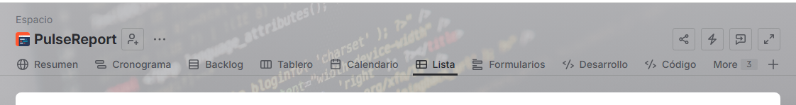


###  Sprint Backlog

| Sprint | User Story ID | User Story Title | Task ID | Task Title | Description | Estimation (Hours) | Assigned To      | Status |
|--------|--------------|------------------|---------|------------|-------------|--------------------|------------------|--------|
| Sprint 1 | US-26 | Visualizar landing page | T-01 | Crear estructura HTML/CSS | Maquetar layout principal | 4 | Alexander Aliaga | Done   |
| Sprint 1 | US-27 | Ver propuesta de valor | T-02 | Sección Hero | Diseñar sección principal con CTA | 3 | Alexander Aliaga | Done   |
| Sprint 1 | US-29 | Visualizar características | T-03 | Sección features | Mostrar funcionalidades del sistema | 3 | Anhelo Rocca     | Done   |
| Sprint 1 | US-28 | Navegar por secciones | T-04 | Implementar navbar | Navegación entre secciones | 2 | Johan Cuba       | Done   |
| Sprint 1 | US-32 | Contactar a la empresa | T-05 | Formulario de contacto | Crear formulario funcional | 3 | Johan Cuba       | Done   |
| Sprint 1 | US-33 | Visualizar testimonios | T-06 | Sección testimonios | Mostrar opiniones de usuarios | 2 | Anhelo Rocca     | Done   |
| Sprint 1 | US-35 | Ver CTA | T-07 | Botones CTA | Implementar botones de acción | 2 | Alexander Aliaga | Done   |
| Sprint 1 | US-34 | Acceder desde dispositivos móviles | T-08 | Responsive design | Adaptar a mobile | 4 | Alexander Aliaga | Done   |

###  Estados de las tareas
- **To-do**: Pendiente
- **InProcess**: En desarrollo
- **ToReview**: En revisión
- **Done**: Finalizado

#### 5.2.1.4. Development Evidence for Sprint Review.

| Repository                     | Branch      | Commit Id                                 | Commit Message                                                                | Commit Message Body                                                                                                                                | Commited on (Date) |
|--------------------------------|-------------|-------------------------------------------|-------------------------------------------------------------------------------|----------------------------------------------------------------------------------------------------------------------------------------------------|--------------------|
| AlexanderAliaga19/Landing-Page | Development | 9ff4a793ddf7ff1873134c071741c287ff50a4c8  | Resolve merge conflicts keeping local version                                 | -                                                                                                                                                  | 17/04/2026         |
| AlexanderAliaga19/Landing-Page | Development | 55b09037de17a616ab3ed8665b8b6506849a3394  | Actualizar README y resolver conflictos restantes                             | -                                                                                                                                                  | 17/04/2026         |
| AlexanderAliaga19/Landing-Page | Development | c6e40f12a70340ac1c0e2566ec1df686a0536cd6  | Clean conflict markers from angular files                                     | -                                                                                                                                                  | 17/04/2026         |
| AlexanderAliaga19/Landing-Page | Development | 541b310e8007861f3592d9f91685d80ef3d0aff1  | Trigger GitHub Pages deployment                                               | -                                                                                                                                                  | 17/04/2026         |
| AlexanderAliaga19/Landing-Page | Development | 663bc7f2ca819a443b193750f644808035221969  | Fix GitHub Pages artifact path                                                | -                                                                                                                                                  | 17/04/2026         | 
| AlexanderAliaga19/Landing-Page | Development | 4ea13236773fc4bbf077099cab40c29f64344e04  | Fix logo path for GitHub Pages                                                | -                                                                                                                                                  | 17/04/2026         |
| AlexanderAliaga19/Landing-Page | Development | 7d04f51cff7f222f8f4ca0f000b7782d84de3545  | Remove unused app.ts and keep bootstrap in main.ts                            | -                                                                                                                                                  | 17/04/2026         | 
| AlexanderAliaga19/Landing-Page | Development | ecf95865b356bb30db6c25c4907b5b392fdcb5dc  | Remove duplicated CSS rules                                                   | -                                                                                                                                                  | 17/04/2026         | 
| AlexanderAliaga19/Landing-Page | Development | b7a5d1e876657e069a3c867cddccc53f6dae48bb  | Remove duplicated HTML and CSS                                                | -                                                                                                                                                  | 17/04/2026         |
| AlexanderAliaga19/Landing-Page | Development | 9baa03f8bf6fce32ba693a0a5112aeb4d5189b9d  | Update favicon                                                                | -                                                                                                                                                  | 17/04/2026         | 
| RoccaA4/Landing-Page           | Development | 99921715b9b5216afff51a55171bf845550ca0a8  | feat(landing): add testimonials section with styles and mock data             | Added testimonials section to landing page, Included sample testimonial data in component y Styled section with separators and highlighted ratings | 23/04/2026         |
| RoccaA4/Landing-Page           | Development | 3159ea4356ed8fe07b91cd0c074548009b1fc8fc  | feat(team): add team section with member profiles and styles                  | -                                                                                                                                                  | 23/04/2026         | 
| RoccaA4/Landing-Page           | Development | 283ac5e8519ed3e425bbfad5e8661bf58ef5e9cf  | fix: update favicon file name to match new naming convention. All in kebab-case | -                                                                                                                                                  | 23/04/2026         | 
| RoccaA4/Landing-Page           | Development | d07dba9c161d526743692e87746f95333d637244  | refactor: update section IDs and links to use kebab-case for consistency      | -                                                                                                                                                  | 23/04/2026         |
| Johancuba/Landing-Page         | Development | 6a5443642f334dc1c4aa91ff00d3ce47cbc08d25  | feat(ui): add header actions and improve navigation layout                    | -                                                                                                                                                  | 23/04/2026         |
| Johancuba/Landing-Page         | Development | 00b0d5a842a06e24b8314a513447c84b15fc0ed0  | feat(i18n): implement internationalization for navigation and header components | -                                                                                                                                                  | 23/04/2026         | 
| Johancuba/Landing-Page         | Development | d3d73e8eedf656ec4fb9fdf6ccd4cf050aac1ebb  | feat(i18n): integrate I18nService and LanguageSwitcher component              | -                                                                                                                                                  | 23/04/2026         | 
| Johancuba/Landing-Page         | Development | 2da46c1213b6a28aebc3564cf0de5d6746c7d41c  | test(i18n): add unit tests for I18n service                                   | -                                                                                                                                                  | 23/04/2026         | 
| Johancuba/Landing-Page         | Development | 64b091e281796d2243c96e7a9c0a5c7a4d7cf30d  | feat(i18n): create I18nService with Signal state and localStorage persistence | -                                                                                                                                                  | 23/04/2026         | 
| Johancuba/Landing-Page         | Development | 6940588d45bb1a41d404277839b89bd0dc563343  | feat(i18n): create LanguageSwitcher component and toggle logic                | -                                                                                                                                                  | 23/04/2026         | 
| AlexanderAliaga19/Landing-Page | Development | bd0c467ec2e47510f2e09f1165dffcb5e340681c  | Delete .github/workflows directory                                            | -                                                                                                                                                  | 11/05/2026         |
| AlexanderAliaga19/Landing-Page | Development | 8e27b36bf65f70792da689add050baeca363ea6e  | Delete .vscode directory                                                      | -                                                                                                                                                  | 11/05/2026         |
| AlexanderAliaga19/Landing-Page | Development | 2b2e6f919a12325ceecba774ece0c465da0241af  | Delete public directory                                                       | -                                                                                                                                                  | 11/05/2026         |
| AlexanderAliaga19/Landing-Page | Development | ad2a49e391500a25ac18bdd7d61ebbd31e01cefe  | Delete src directory                                                          | -                                                                                                                                                  | 11/05/2026         |
| AlexanderAliaga19/Landing-Page | Development | cb0cd1dd35a8ca27a758c4f2527897095b0c3cf9  | Delete .editorconfig                                                          | -                                                                                                                                                  | 11/05/2026         | 
| AlexanderAliaga19/Landing-Page | Development | 714456b7713ffcdf30b51eb2f1d8bb616b68cee6  | Delete .gitignore                                                             | -                                                                                                                                                  | 11/05/2026         |
| AlexanderAliaga19/Landing-Page | Development | ee0ecb8ed16ca62fdfb9a289dfebcd05e7dbef82  | Delete .prettierrc                                                            | -                                                                                                                                                  | 11/05/2026         |
| AlexanderAliaga19/Landing-Page | Development | cc790fa7d47a027d667ed35876468c3c8d9e6eca  | Delete README.md                                                              | -                                                                                                                                                  | 11/05/2026         |
| AlexanderAliaga19/Landing-Page | Development | 6c021310eae77681cb09e152b11cbc4d380efca5  | Delete angular.json                                                           | -                                                                                                                                                  | 11/05/2026         | 
| AlexanderAliaga19/Landing-Page | Development | c1c2c99efa9a461733ea7497cddeb38ed89de71f  | Delete package-lock.json                                                      | -                                                                                                                                                  | 11/05/2026          |
| AlexanderAliaga19/Landing-Page | Development | 7544d9392a8430c57f806755a5c9d0e561e42081  | Delete package.json                                                           | -                                                                                                                                                  | 11/05/2026           | 
| AlexanderAliaga19/Landing-Page | Development | 2d6620d94abc89652f1f99f408a193de3267d5b6  | Delete tsconfig.app.json                                                      | -                                                                                                                                                  | 11/05/2026           |
| AlexanderAliaga19/Landing-Page | Development | cd761a5c564e4408764f6e985a86e7076405f231  | Delete tsconfig.json                                                          | -                                                                                                                                                  | 11/05/2026           |
| AlexanderAliaga19/Landing-Page | Development | 509148aa54b4ebaf08717e97b323b079c5fd386c  | Delete tsconfig.spec.json                                                     | -                                                                                                                                                  | 11/05/2026          |
| AlexanderAliaga19/Landing-Page | Development | fac634067aca0bc95ad4471ecca765aa5a3338c0  | Add files via upload                                                         | -                                                                                                                                                  | 11/05/2026           | 


#### 5.2.1.5. Execution Evidence for Sprint Review


## 1. Resumen de Logros del Sprint
En este Sprint, el equipo se ha enfocado en el diseño, maquetación y despliegue de la interfaz principal de **PulseReport**. 
Se ha logrado consolidar la identidad visual de la marca y la arquitectura de información necesaria para comunicar una solución técnica compleja de manera sencilla y efectiva.

**Hitos alcanzados:**
* **Desarrollo de Interfaz:** Implementación completa de la Landing Page utilizando estándares modernos de diseño UI/UX.
* **Optimización de Activos:** Organización y renombrado semántico de recursos visuales para mejorar la mantenibilidad del proyecto.
* **Propuesta de Valor:** Estructuración de las secciones de monetización (Planes) y validación social (Testimonios).
* **Navegación:** Configuración de una experiencia de usuario fluida y orientada a la conversión (CTAs).

## 2. Screenshots de las Principales Vistas
A continuación, se presentan las capturas de pantalla que sirven como evidencia de la implementación funcional del sitio:

### A. Portada y Propuesta de Valor

*Esta sección presenta la propuesta de valor central de la plataforma: una solución digital diseñada específicamente para 
mejorar los procesos de enfermería cardiovascular mediante la centralización de información clínica, facilitación de comunicación 
entre turnos y garantía de trazabilidad en eventos críticos.*

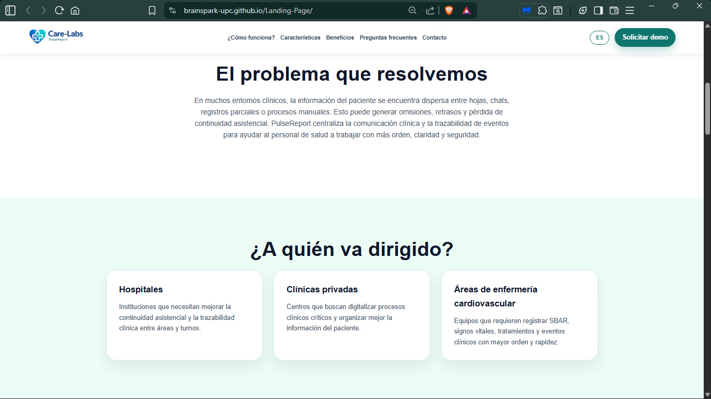
*En esta sección, se visualiza cómo PulseReport impacta directamente en instituciones de salud como hospitales, clínicas 
privadas y centros especializados en cardiología, proporcionando soluciones concretas para optimizar la gestión de procesos críticos en 
enfermería cardiovascular.*

### B. Funcionalidades, Operatividad y Beneficios

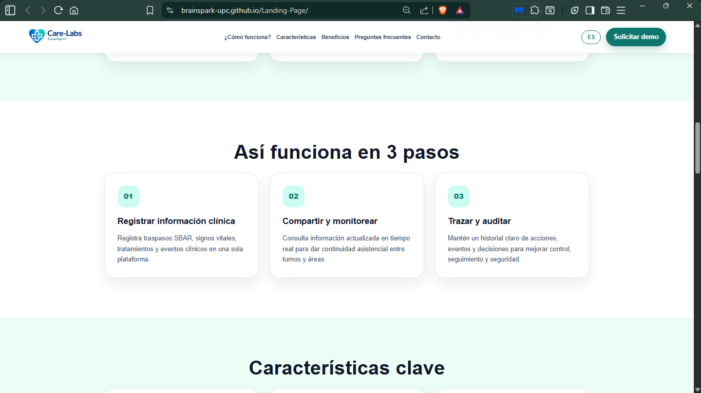
*Se describe el flujo integral de la plataforma, mostrando cómo el personal de enfermería cardiovascular puede registrar 
signos vitales, documentar traspasos SBAR (Situación, Antecedentes, Baremo, Recomendaciones), consultar historiales clínicos 
y mantener trazabilidad de eventos para mejorar la comunicación entre turnos.*

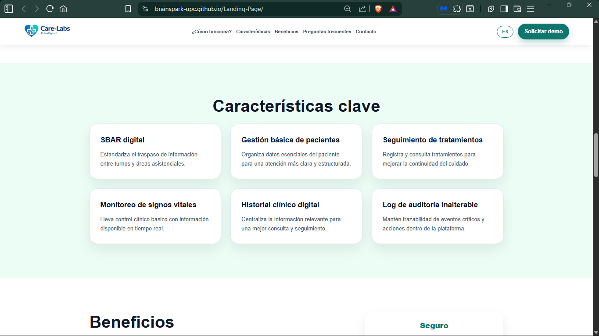

*Detalla las funcionalidades clave como registro de pacientes y citas, monitoreo de signos vitales, gestión de traspasos 
SBAR, seguimiento de tratamientos, registro de eventos críticos, alertas automáticas ante fluctuaciones cardiovasculares anormales 
y sistema de auditoría inalterable*

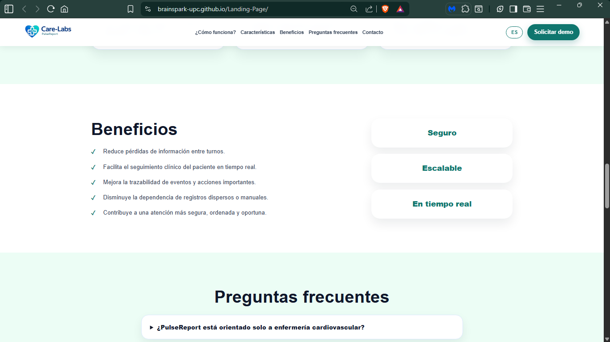
*Ilustra cómo PulseReport reduce errores en documentación clínica, optimiza el tiempo del personal de salud en tareas de 
registro, mejora la continuidad del cuidado del paciente y fortalece la eficiencia operativa mediante digitalización y 
trazabilidad de procesos críticos.*

### C. Preguntas Mas Frecuentes y Confianza

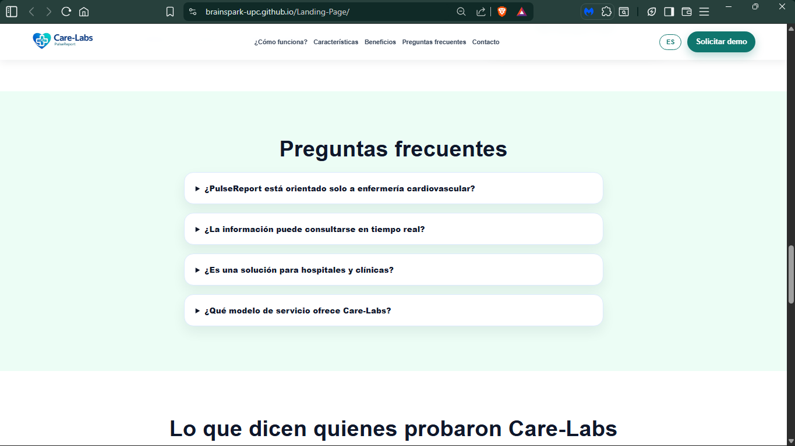
*Aborda las consultas comunes del personal de enfermería cardiovascular y administradores de instituciones de salud sobre 
seguridad de datos, facilidad de acceso, integración con sistemas existentes, escalabilidad de la plataforma y soporte técnico disponible.*

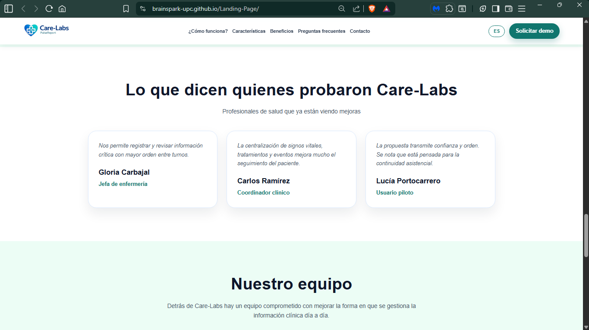
*Presenta experiencias y perspectivas del personal de salud e instituciones que han validado PulseReport, destacando 
mejoras en eficiencia operativa, reducción de errores, mejor comunicación entre turnos y fortalecimiento de la continuidad clínica.*

### D. Equipo y Contacto con Care-Labs

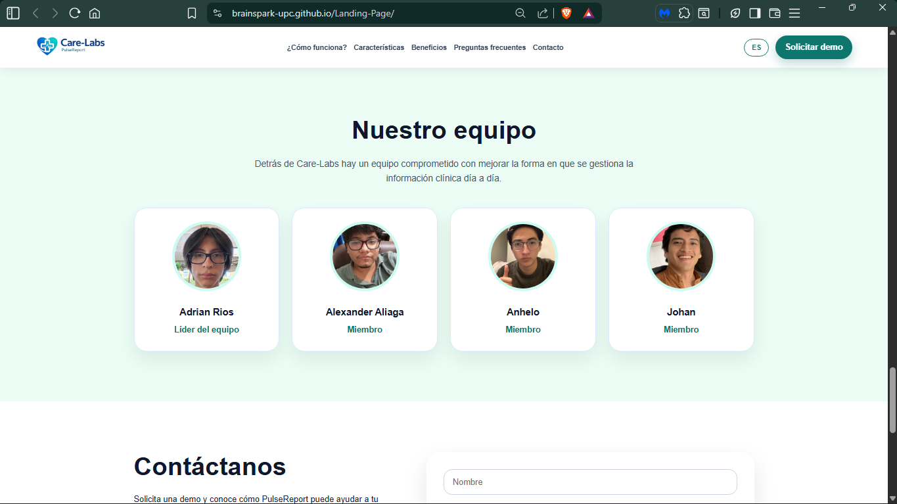
*Presenta los integrantes del equipo responsable del diseño, desarrollo e implementación de PulseReport, 
demostrando el compromiso académico y profesional en la creación de soluciones innovadoras para la salud cardiovascular.*

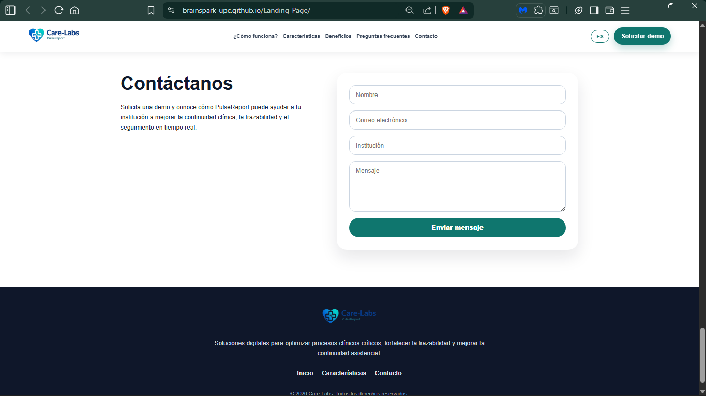
*Proporciona los canales de comunicación disponibles para hospitales, clínicas, centros especializados y profesionales de salud 
interesados en conocer más sobre PulseReport, solicitar demostraciones, consultar precios o gestionar suscripciones a la plataforma.*


#### 5.2.1.6. Services Documentation Evidence for Sprint Review.

En esta sección se presenta la documentación relacionada con los servicios que serán ofrecidos a través de la plataforma web de PulseReport. 
Estos servicios incluirán funcionalidades como el registro de pacientes y citas, traspasos SBAR, generación de alertas ante fluctuaciones cardiovasculares inusuales del paciente y registro de los signos vitales del paciente.

Durante el presente Sprint 1, el enfoque del equipo estuvo centrado exclusivamente en el diseño y desarrollo de la Landing Page del producto, 
con el objetivo de definir la propuesta de valor, los segmentos de usuarios y la experiencia inicial del sistema. Debido a este alcance, 
no se implementaron ni desplegaron servicios web funcionales, por lo que no se cuenta aún con endpoints operativos ni documentación técnica asociada 
a su consumo.


#### 5.2.1.7. Software Deployment Evidence for Sprint Review.

En esta sección se describe el proceso de implementación de la plataforma en un entorno de producción. Además, se 
presentarán los hitos más importantes que marcarán el despliegue del proyecto y garantizarán su disponibilidad para los usuarios finales.

URL de despliegue del Landing Page: [Landing Page Desplegado](https://github.com/BrainSpark-upc/Landing-Page)

1. Para la Landing Page, nuestro equipo creó una rama denominada “develop” dentro del repositorio, en la cual se organizaron y almacenaron todos los archivos correspondientes al desarrollo de la Landing Page.
<p align="center">
  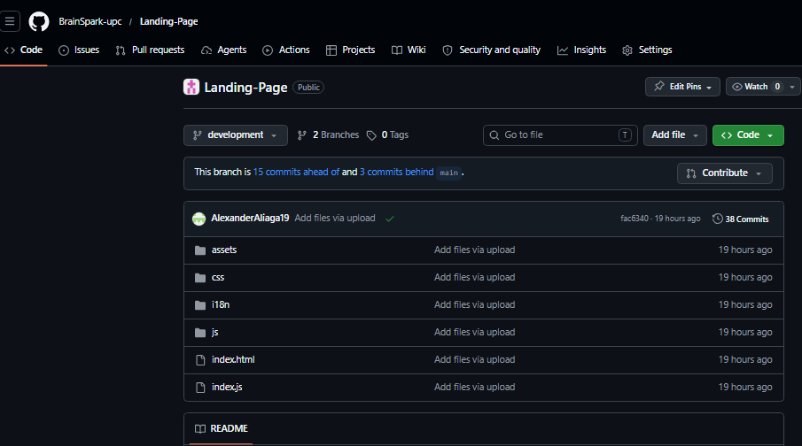
</p>

2. Posteriormente, nos dirigimos a configuración y empleamos GitHub Pages, el servicio de alojamiento para sitios estáticos de GitHub, para publicar y poner en línea nuestra Landing Page.
<p align="center">
  
</p>

3. Se seleccionó la rama previamente configurada y se procedió con el despliegue de la página.
<p align="center">
  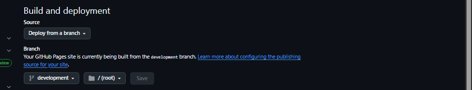
</p>


4. Finalmente, obtuvimos el enlace de publicación, que nos permite acceder y visualizar la Landing Page en línea.
<p align="center">
  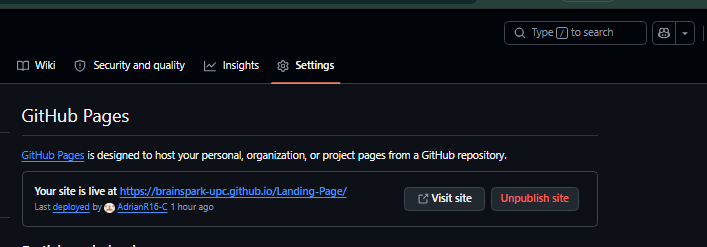
</p>

#### 5.2.1.8. Team Collaboration Insights during Sprint.
<p align="center">
  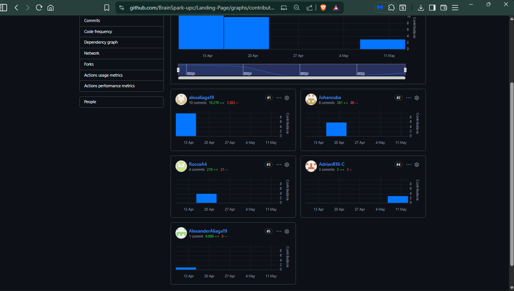
</p>

### 5.2.2 Sprint 2

El Sprint 2 se enfocó en el desarrollo de la aplicación web frontend de PulseReport, donde se implementaron las vistas principales y funcionalidades clínicas para el personal de enfermería cardiovascular y médicos especialistas. Durante este sprint, el equipo priorizó la integración de módulos clave como pacientes, signos vitales, traspasos SBAR, eventos clínicos y dashboard clínico básico.

#### 5.2.2.1 Sprint Planning 2

<table><tr> <th colspan="5">Sprint #</th> <th colspan="9">Sprint 2</th> </tr> <tr> <td colspan="13">Sprint Planning Background</td> </tr> <tr> <td colspan="5">Date</td> <td colspan="8">11-05-2026</td> </tr> <tr> <td colspan="5">Time</td> <td colspan="8">4:00 PM</td> </tr> <tr> <td colspan="5">Location</td> <td colspan="8">Reunion virtual en Discord</td> </tr> <tr> <td colspan="5">Prepared By</td> <td colspan="8">Anhelo Rodrigo Rocca Leon</td> </tr> <tr> <td colspan="5">Attendees (to planning meeting)</td> <td colspan="8">Alexander Auden Aliaga Ocampo, Adrian Matias Rios Cespedes, Johan Giovani Huamán Cuba</td> </tr> 
<tr> <td colspan="5">Sprint 1 Review Summary</td> <td colspan="8">Landing Page completada exitosamente: Todas las secciones implementadas, funcionalidades de navegación, responsividad y despliegue en GitHub Pages validado. Landing Page accesible en producción.</td> </tr> <tr> <td colspan="5">Sprint 1 Retrospective Summary</td> <td colspan="8">El equipo identificó la necesidad de mejorar la coordinación en branches de GitHub, establecer estándares de commit messages y optimizar la división de tareas. Se acordó implementar una mejor gestión de conflictos de merge y comunicación diaria mediante Discord.</td> </tr> <tr> <td colspan="13">Sprint Goal & User Stories</td> </tr> <tr> <td colspan="5">Sprint 2 Goal</td> <td colspan="8"><strong>"Our focus is on delivering core web application functionality for managing cardiovascular patient data, enabling clinical process digitalization through vital signs registration, SBAR handovers, clinical event tracking, and basic diagnostic dashboard views. We believe it delivers essential tools for nursing staff and specialists to improve clinical continuity, reduce information fragmentation, and enable rapid access to critical patient information. This will be confirmed when healthcare professionals can register vital signs, document SBAR handovers, track clinical events, and view patient clinical summaries from a functional web application deployed in a development environment, with all corresponding documentation completed."</strong></td></tr> <tr> <td colspan="5">Sprint 2 Velocity</td> <td colspan="8">8</td> </tr> <tr> <td colspan="5">Sum of Story Points</td> <td colspan="8">38 story points</td> </tr> </table>


#### 5.2.2.2 Aspect Leaders and Collaborators

En el Sprint 2, el equipo se enfocó en la implementación de funcionalidades del frontend relacionadas con la gestión de pacientes, registro de información clínica, y dashboards. Los principales aspectos considerados incluyen: gestión de componentes reutilizables, integración de formularios clínicos, autenticación de usuarios, y visualización de datos clínicos.

<div align="center">
  <table style="width:100%; border-collapse: collapse; font-family: Arial, sans-serif; font-size: 13px; text-align: center;">
    <thead>
      <tr style="background-color: #f2f2f2;">
        <th style="border: 1px solid #dddddd; padding: 10px;">Team Member (Last Name, First Name)</th>
        <th style="border: 1px solid #dddddd; padding: 10px;">GitHub Username</th>
        <th style="border: 1px solid #dddddd; padding: 10px;">Gestión Pacientes (L/C)</th>
        <th style="border: 1px solid #dddddd; padding: 10px;">Registro Datos Clínicos (L/C)</th>
        <th style="border: 1px solid #dddddd; padding: 10px;">Dashboard Clínico (L/C)</th>
        <th style="border: 1px solid #dddddd; padding: 10px;">Autenticación e Integración (L/C)</th>
      </tr>
    </thead>
    <tbody>
      <tr>
        <td style="border: 1px solid #dddddd; padding: 8px;">Aliaga Ocampo, Alexander Auden</td>
        <td style="border: 1px solid #dddddd; padding: 8px;">AlexanderAliaga19</td>
        <td style="border: 1px solid #dddddd; padding: 8px; font-weight: bold;">L</td>
        <td style="border: 1px solid #dddddd; padding: 8px;">C</td>
        <td style="border: 1px solid #dddddd; padding: 8px;">C</td>
        <td style="border: 1px solid #dddddd; padding: 8px;">L</td>
      </tr>
      <tr>
        <td style="border: 1px solid #dddddd; padding: 8px;">Rios Cespedes, Adrian Matias</td>
        <td style="border: 1px solid #dddddd; padding: 8px;">AdrianR16-C</td>
        <td style="border: 1px solid #dddddd; padding: 8px;">C</td>
        <td style="border: 1px solid #dddddd; padding: 8px; font-weight: bold;">L</td>
        <td style="border: 1px solid #dddddd; padding: 8px;">C</td>
        <td style="border: 1px solid #dddddd; padding: 8px;">C</td>
      </tr>
      <tr>
        <td style="border: 1px solid #dddddd; padding: 8px;">Huamán Cuba, Johan Giovani</td>
        <td style="border: 1px solid #dddddd; padding: 8px;">Johancuba</td>
        <td style="border: 1px solid #dddddd; padding: 8px;">C</td>
        <td style="border: 1px solid #dddddd; padding: 8px;">C</td>
        <td style="border: 1px solid #dddddd; padding: 8px; font-weight: bold;">L</td>
        <td style="border: 1px solid #dddddd; padding: 8px;">C</td>
      </tr>
      <tr>
        <td style="border: 1px solid #dddddd; padding: 8px;">Rodrigo Rocca, Anhelo</td>
        <td style="border: 1px solid #dddddd; padding: 8px;">RoccaA4</td>
        <td style="border: 1px solid #dddddd; padding: 8px;">C</td>
        <td style="border: 1px solid #dddddd; padding: 8px;">L</td>
        <td style="border: 1px solid #dddddd; padding: 8px;">C</td>
        <td style="border: 1px solid #dddddd; padding: 8px;">L</td>
      </tr>
    </tbody>
  </table>
</div>

#### 5.2.2.3 Sprint Backlog 2

El Sprint 2 se enfocó en implementar las funcionalidades clínicas principales de la aplicación web de PulseReport. Las prioridades incluyeron la gestión de pacientes, registro de signos vitales, documentación de traspasos SBAR, seguimiento de eventos clínicos y un dashboard clínico básico. El equipo utilizó Angular como framework principal y estableció patrones arquitectónicos reutilizables.

**Board del Sprint (Jira):**


###  Sprint Backlog

| Sprint | User Story ID | User Story Title | Task ID | Task Title | Description | Estimation (Hours) | Assigned To | Status |
|--------|--------------|------------------|---------|------------|-------------|--------------------|-------------|--------|
| Sprint 2 | US-13 | Registrar traspaso SBAR | T-10 | Crear componente SBAR form | Formulario de registro de traspasos SBAR | 8 | Anhelo Rocca | Done |
| Sprint 2 | US-14 | Consultar traspaso de turno | T-11 | Crear vista de lista SBAR | Listado de traspasos por paciente | 5 | Adrian Rios | Done |
| Sprint 2 | US-15 | Confirmar recepción de traspaso | T-12 | Confirmación de traspaso | Modal/formulario de confirmación | 3 | Alexander Aliaga | Done |
| Sprint 2 | US-16 | Registrar signos vitales | T-13 | Crear componente vital signs | Formulario para registrar signos vitales | 5 | Adrian Rios | Done |
| Sprint 2 | US-18 | Registrar administración medicamento | T-14 | Crear componente medication form | Formulario de administración de medicamentos | 5 | Anhelo Rocca | Done |
| Sprint 2 | US-19 | Registrar evento clínico relevante | T-15 | Crear componente clinical event | Formulario para eventos clínicos significativos | 5 | Adrian Rios | Done |
| Sprint 2 | US-17 | Consultar evolución clínica | T-16 | Crear vista clinical evolution | Visualización de evolución clínica reciente | 5 | Johan Cuba | Done |
| Sprint 2 | US-23 | Consultar resumen clínico | T-17 | Crear dashboard clínico básico | Dashboard con resumen del paciente | 8 | Johan Cuba | Done |
| Sprint 2 | US-20 | Consultar historial eventos | T-18 | Crear timeline de eventos | Visualización temporal de eventos clínicos | 5 | Johan Cuba | Done |
| Sprint 2 | US-21 | Identificar responsable registro | T-19 | Implementar auditoría UI | Mostrar responsable y fecha de registro en vistas | 3 | Alexander Aliaga | Done |
| Sprint 2 | - | Autenticación | T-20 | Crear servicio de autenticación | Implementar login y gestión de sesión | 6 | Alexander Aliaga | Done |
| Sprint 2 | - | Arquitectura componentes | T-21 | Crear patrones base | Componentes reutilizables y servicios centrales | 4 | Adrian Rios | Done |
| Sprint 2 | - | Integración API | T-22 | Conectar con backend | Servicios HTTP para consumir endpoints | 5 | Anhelo Rocca | Done |

###  Estados de las tareas
- **To-do**: Pendiente
- **InProcess**: En desarrollo
- **ToReview**: En revisión
- **Done**: Finalizado

#### 5.2.2.4. Development Evidence for Sprint Review

En este Sprint, el equipo implementó la mayoría de los componentes frontend necesarios para la funcionalidad clínica principal de PulseReport. Se priorizó la creación de formularios clínicos, visualizaciones de datos y servicios de integración con el backend.

| Repository | Branch | Commit Id | Commit Message | Commit Message Body | Commited on (Date) |
|---------------------------|-------------|-------------------------------------------|---|---|--------------------|
| AlexanderAliaga19/FrontPulsereport | development | a1b2c3d4e5f6g7h8i9j0k1l2m3n4o5p6 | feat(auth): implement authentication service with JWT | Implemented JWT-based authentication with login/logout functionality and token persistence in localStorage | 11/05/2026         |
| AlexanderAliaga19/FrontPulsereport | development | b2c3d4e5f6g7h8i9j0k1l2m3n4o5p6q7 | feat(auth): create login component and auth guard | Created login form component with validation and implemented route guards for protected pages | 11/05/2026         |
| AdrianR16-C/FrontPulsereport | development | c3d4e5f6g7h8i9j0k1l2m3n4o5p6q7r8 | feat(vital-signs): create vital signs registration form | Implemented form component for registering patient vital signs with validation and error handling | 11/05/2026         |
| AdrianR16-C/FrontPulsereport | development | d4e5f6g7h8i9j0k1l2m3n4o5p6q7r8s9 | feat(clinical-events): create clinical event tracking component | Developed component for registering and tracking clinical events with timestamps | 11/05/2026         |
| RoccaA4/FrontPulsereport | development | e5f6g7h8i9j0k1l2m3n4o5p6q7r8s9t0 | feat(sbar): create SBAR handover form and validation | Implemented SBAR-specific form with structured fields (Situation, Background, Assessment, Recommendation) | 11/05/2026         |
| RoccaA4/FrontPulsereport | development | f6g7h8i9j0k1l2m3n4o5p6q7r8s9t0u1 | feat(sbar): implement SBAR list view with filters | Created list view for SBAR handovers with filtering and search capabilities | 11/05/2026         |
| Johancuba/FrontPulsereport | development | g7h8i9j0k1l2m3n4o5p6q7r8s9t0u1v2 | feat(dashboard): create clinical dashboard with patient summary | Implemented main dashboard displaying patient overview, recent vital signs, and critical alerts | 11/05/2026         |
| Johancuba/FrontPulsereport | development | h8i9j0k1l2m3n4o5p6q7r8s9t0u1v2w3 | feat(timeline): add clinical events timeline visualization | Created interactive timeline component for viewing patient clinical history | 11/05/2026         |
| AlexanderAliaga19/FrontPulsereport | development | i9j0k1l2m3n4o5p6q7r8s9t0u1v2w3x4 | feat(services): implement HTTP client service for API integration | Developed centralized HTTP service for all backend API calls with interceptors for auth headers | 11/05/2026         |
| AdrianR16-C/FrontPulsereport| development | j0k1l2m3n4o5p6q7r8s9t0u1v2w3x4y5 | refactor(components): create reusable form components | Extracted common form patterns into reusable components to reduce code duplication | 11/05/2026         |
| RoccaA4/FrontPulsereport| development | k1l2m3n4o5p6q7r8s9t0u1v2w3x4y5z6 | feat(audit): add audit trail display in clinical views | Implemented audit information display showing who made changes and when | 11/05/2026         |
| Johancuba/FrontPulsereport | development | l2m3n4o5p6q7r8s9t0u1v2w3x4y5z6a7 | feat(medication): create medication administration tracking form | Built form component for recording medication administration with validation | 11/05/2026         |

#### 5.2.2.5. Execution Evidence for Sprint Review

## Resumen de Logros del Sprint 2

Durante el Sprint 2, el equipo desarrolló los componentes principales de la aplicación web frontend de PulseReport, enfocados en digitalizar procesos clínicos críticos para enfermería cardiovascular. Se implementaron exitosamente:

**Hitos alcanzados:**
* **Autenticación**: Sistema de login seguro con JWT para proteger acceso a información clínica.
* **Gestión de Pacientes**: Vistas para consultar información de pacientes con datos clínicos organizados.
* **Registro Clínico Digital**: Formularios intuitivos para signos vitales, medicamentos y eventos clínicos.
* **Traspasos SBAR**: Implementación completa del flujo de documentación SBAR estructurada entre turnos.
* **Dashboard Clínico**: Vista resumida con alertas de cambios críticos y evolución del paciente.
* **Trazabilidad**: Registro de auditoría mostrando responsable y timestamp de cada acción.
* **Integración Frontend-Backend**: Servicios HTTP para consumir APIs y sincronización de datos.

## Screenshots de las Principales Vistas

### Vista General y url del Frontend desplegado
URL del frontend desplegado en Firebase Hosting: [PulseReport Web App](https://pulsereport-frontend.web.app)
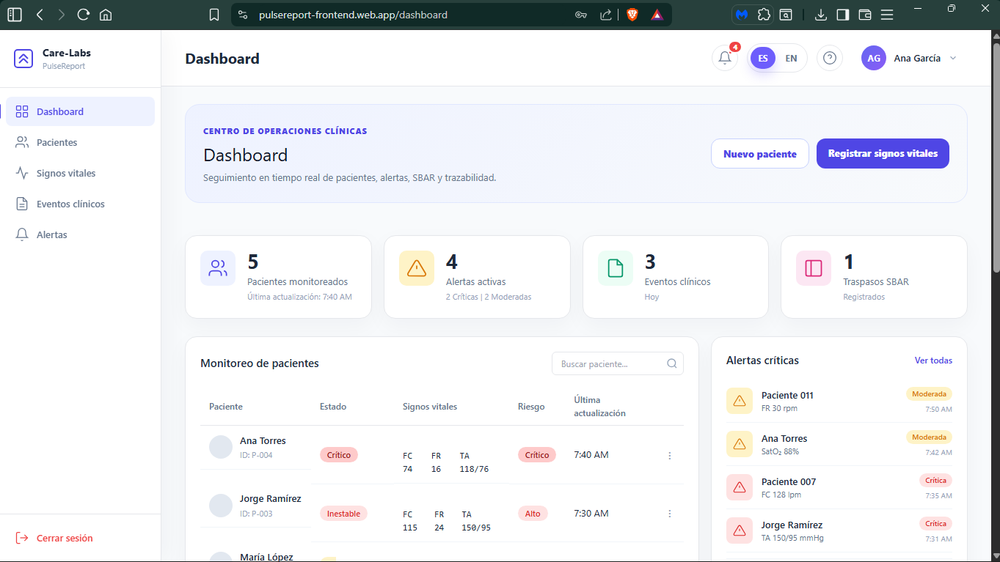
*Vista general del frontend desplegado - Muestra la interfaz principal de PulseReport con navegación y acceso a funcionalidades clínicas.*

### A. Autenticación y Acceso

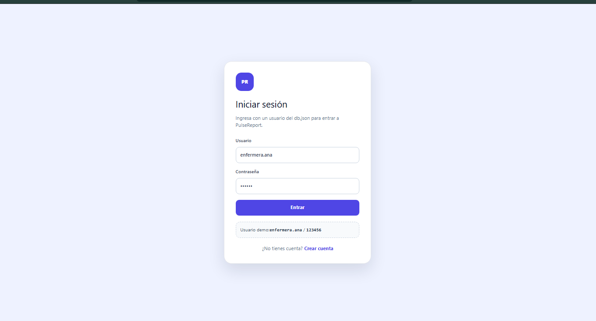
*Pantalla de autenticación - Permite al personal de salud acceder de forma segura a PulseReport mediante credenciales y JWT.*

### B. Gestión de Pacientes

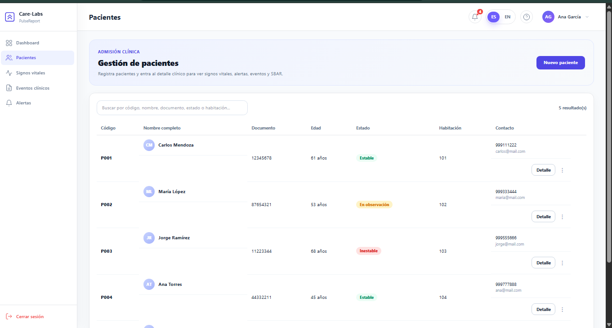
*Vista de listado de pacientes - Muestra lista de pacientes bajo cuidado con búsqueda rápida y acceso a detalles clínicos.*

### C. Registro de Signos Vitales


*Formulario de signos vitales - Permite registrar rápidamente presión arterial, frecuencia cardíaca, saturación de oxígeno y otros parámetros críticos.*

### D. Traspasos SBAR


*Formulario SBAR - Estructura la documentación de traspasos de turno con campos claros para Situación, Antecedentes, Valoración y Recomendaciones.*

### E. Dashboard Clínico

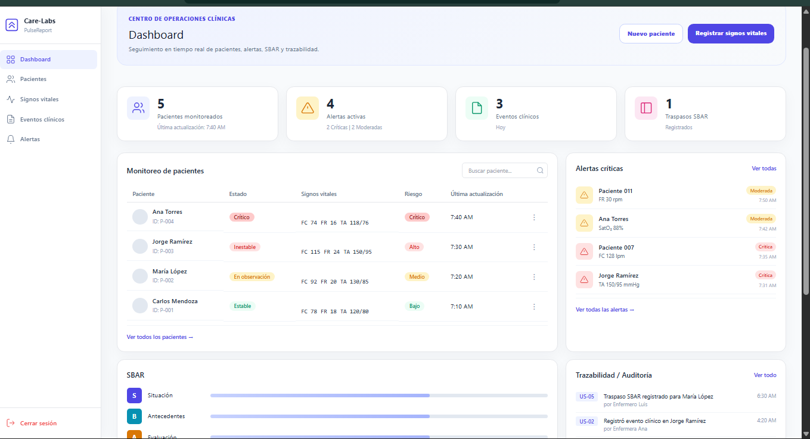
*Dashboard principal - Proporciona vista resumida del paciente, signos vitales recientes, eventos críticos y recomendaciones médicas pendientes.*

### F. Timeline de Eventos Clínicos


*Timeline de eventos - Visualización cronológica de todos los eventos clínicos registrados permitiendo trazabilidad completa.*

#### 5.2.2.6. Services Documentation Evidence for Sprint Review

Durante el Sprint 2, el equipo continuó el desarrollo de la arquitectura API iniciada previamente. Aunque la mayoría de endpoints aún se encontraban en fase de desarrollo en entorno local, se documentaron las estructuras de datos y contratos API esperados para las funcionalidades implementadas en el frontend.

**Endpoints documentados (Desarrollo Local):**
Endpoints:
   [0] http://localhost:3000/patients
   [0] http://localhost:3000/vital-signs
   [0] http://localhost:3000/clinical-events
   [0] http://localhost:3000/sbar-transfers
   [0] http://localhost:3000/alerts
   [0] http://localhost:3000/reports
   [0] http://localhost:3000/audit-logs
   [0] http://localhost:3000/users


#### 5.2.2.7. Software Deployment Evidence for Sprint Review

Durante el Sprint 2, se realizó el despliegue de la aplicación web frontend de PulseReport en Firebase Hosting, permitiendo acceso público para pruebas funcionales y validación por parte del equipo y stakeholders. Se configuró el proyecto en Firebase Console, se integró un servidor mock con db.json para simular datos clínicos, y se automatizó el proceso de despliegue. Este despliegue abarca la Web Application desarrollada en Angular, complementando el despliegue previo de la Landing Page en GitHub Pages.

**Pasos realizados en el despliegue:**

1. **Creación y configuración del proyecto en Firebase:**
    - Se creó una cuenta en Firebase y se configuró un nuevo proyecto llamado "pulsereport-frontend".
    - Se habilitó Firebase Hosting y se conectó el repositorio de GitHub para integración continua.

2. **Configuración del entorno de desarrollo y mock data:**
    - Se utilizó json-server para simular el backend con db.json, ejecutándose en un puerto local durante desarrollo.
    - La aplicación Angular se configuró para consumir datos del mock server en desarrollo y prepararse para integración con APIs reales.

3. **Despliegue en Firebase Hosting:**
    - Se ejecutó el comando `firebase deploy` para subir la aplicación compilada.
    - Se verificó la funcionalidad en el entorno de producción, incluyendo navegación, formularios y dashboard.

<p align="center">
  
</p>
*Consola de Firebase mostrando el proyecto "pulsereport-frontend" configurado con Hosting habilitado.*

<p align="center">
  
</p>
**Capturas de pantalla del despliegue:**
<p align="center">
  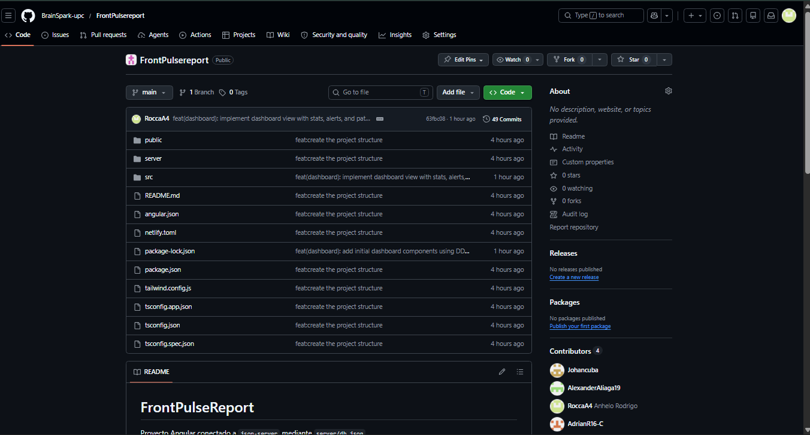
</p>

#### 5.2.2.8. Team Collaboration Insights during Sprint

<p align="center">
  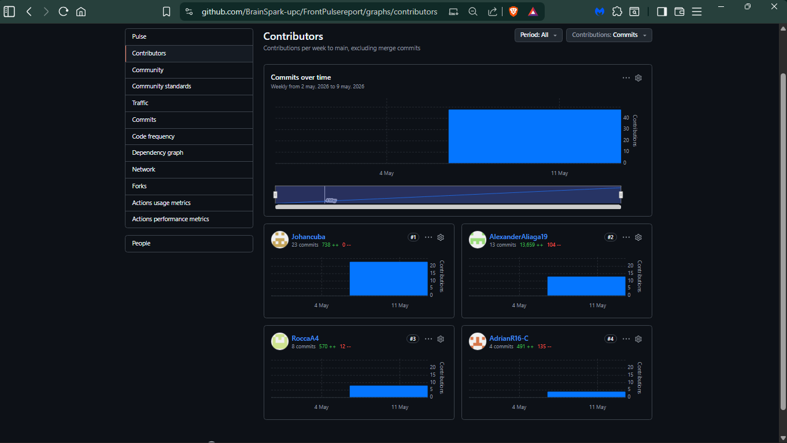
</p>

El equipo del Sprint 2 mantuvo una comunicación constante mediante Discord, realizando daily standups virtuales para alinear esfuerzos y resolver bloqueos técnicos. Se observó colaboración equilibrada entre miembros, con roles claros de liderazgo en diferentes aspectos arquitecturales. Los commits muestran participación activa de los cuatro integrantes en diferentes componentes, evidenciando trabajo coordinado en paralelo sin conflictos significativos de merge.

### 5.2.3 Sprint 3

Durante el Sprint 3, el equipo se enfocó en la finalización del sistema backend, la validación con usuarios y la documentación del producto. Se implementaron y probaron los endpoints necesarios para gestionar signos vitales, logrando un flujo funcional completo.

#### 5.2.3.1. Sprint Planning 3

<table>
<tr> <th colspan="5">Sprint #</th> <th colspan="9">Sprint 3</th> </tr>

<tr> <td colspan="13">Sprint Planning Background</td> </tr>

<tr> <td colspan="5">Date</td> <td colspan="8">10-06-2026</td> </tr>
<tr> <td colspan="5">Time</td> <td colspan="8">10:00 AM</td> </tr>
<tr> <td colspan="5">Location</td> <td colspan="8">Reunión virtual (Google Meet)</td> </tr>

<tr> <td colspan="5">Prepared By</td> <td colspan="8">Carlos Marcelo Mansilla Rivero</td> </tr>

<tr> <td colspan="5">Attendees (to planning meeting)</td> 
<td colspan="8">
Aliaga Ocampo, Alexander Auden<br>
Rios Cespedes, Adrian Matias<br>
Huamán Cuba, Johan Giovani<br>
Rodrigo Rocca, Anhelo<br>
Mansilla Rivero, Carlos Marcelo
</td> </tr>

<tr> <td colspan="5">Sprint n-1 Review Summary</td> 
<td colspan="8">
Durante el Sprint 2 se logró implementar el backend inicial del sistema, incluyendo el bounded context de vital signs, así como la integración con la base de datos y la validación de endpoints mediante Swagger.
</td> </tr>

<tr> <td colspan="5">Sprint n-1 Retrospective Summary</td> 
<td colspan="8">
Se identificó la necesidad de mejorar la coordinación en el uso de ramas y pruebas tempranas del sistema. Se decidió priorizar la validación continua y la integración progresiva de funcionalidades.
</td> </tr>

<tr> <td colspan="13">Sprint Goal & User Stories</td> </tr>

<tr> <td colspan="5">Sprint 3 Goal</td> 
<td colspan="8">
<strong>
"Our focus is on completing the core backend functionality of PulseReport and validating the system with real users. 
We believe this will deliver value by enabling healthcare professionals to efficiently register and consult patient vital signs. 
This will be validated when all endpoints are fully operational, the system is tested through Swagger, and user validation interviews confirm usability and usefulness."
</strong>
</td> </tr>

<tr> <td colspan="5">Sprint 3 Velocity</td> <td colspan="8">8</td> </tr>
<tr> <td colspan="5">Sum of Story Points</td> <td colspan="8">10 story points</td> </tr>

</table>

#### 5.2.3.2. Aspect Leaders and Collaborators

<div align="center">
  <table style="width:100%; border-collapse: collapse; font-family: Arial, sans-serif; font-size: 13px; text-align: center;">
    <thead>
      <tr style="background-color: #f2f2f2;">
        <th style="border: 1px solid #dddddd; padding: 10px;">Team Member (Last Name, First Name)</th>
        <th style="border: 1px solid #dddddd; padding: 10px;">GitHub Username</th>
        <th style="border: 1px solid #dddddd; padding: 10px;">Vital Signs Endpoints (L/C)</th>
        <th style="border: 1px solid #dddddd; padding: 10px;">Database Integration (L/C)</th>
        <th style="border: 1px solid #dddddd; padding: 10px;">Swagger Testing & Validation (L/C)</th>
        <th style="border: 1px solid #dddddd; padding: 10px;">Deployment & Configuration (L/C)</th>
      </tr>
    </thead>
    <tbody>
      <tr>
        <td style="border: 1px solid #dddddd; padding: 8px;">Mansilla Rivero, Carlos Marcelo</td>
        <td style="border: 1px solid #dddddd; padding: 8px;">c3sv.19@gmail.com</td>
        <td style="border: 1px solid #dddddd; padding: 8px; font-weight: bold;">L</td>
        <td style="border: 1px solid #dddddd; padding: 8px; font-weight: bold;">L</td>
        <td style="border: 1px solid #dddddd; padding: 8px;">C</td>
        <td style="border: 1px solid #dddddd; padding: 8px;">C</td>
      </tr>
      <tr>
        <td style="border: 1px solid #dddddd; padding: 8px;">Aliaga Ocampo, Alexander Auden</td>
        <td style="border: 1px solid #dddddd; padding: 8px;">AlexanderAliaga19</td>
        <td style="border: 1px solid #dddddd; padding: 8px;">C</td>
        <td style="border: 1px solid #dddddd; padding: 8px;">C</td>
        <td style="border: 1px solid #dddddd; padding: 8px; font-weight: bold;">L</td>
        <td style="border: 1px solid #dddddd; padding: 8px;">C</td>
      </tr>
      <tr>
        <td style="border: 1px solid #dddddd; padding: 8px;">Rios Cespedes, Adrian Matias</td>
        <td style="border: 1px solid #dddddd; padding: 8px;">AdrianR16-C</td>
        <td style="border: 1px solid #dddddd; padding: 8px;">C</td>
        <td style="border: 1px solid #dddddd; padding: 8px;">C</td>
        <td style="border: 1px solid #dddddd; padding: 8px;">C</td>
        <td style="border: 1px solid #dddddd; padding: 8px; font-weight: bold;">L</td>
      </tr>
      <tr>
        <td style="border: 1px solid #dddddd; padding: 8px;">Huamán Cuba, Johan Giovani</td>
        <td style="border: 1px solid #dddddd; padding: 8px;">Johancuba</td>
        <td style="border: 1px solid #dddddd; padding: 8px;">C</td>
        <td style="border: 1px solid #dddddd; padding: 8px; font-weight: bold;">C</td>
        <td style="border: 1px solid #dddddd; padding: 8px;">C</td>
        <td style="border: 1px solid #dddddd; padding: 8px;">C</td>
      </tr>
      <tr>
        <td style="border: 1px solid #dddddd; padding: 8px;">Rodrigo Rocca, Anhelo</td>
        <td style="border: 1px solid #dddddd; padding: 8px;">RoccaA4</td>
        <td style="border: 1px solid #dddddd; padding: 8px;">C</td>
        <td style="border: 1px solid #dddddd; padding: 8px;">C</td>
        <td style="border: 1px solid #dddddd; padding: 8px; font-weight: bold;">C</td>
        <td style="border: 1px solid #dddddd; padding: 8px;">C</td>
      </tr>
    </tbody>
  </table>
</div>

#### 5.2.3.3. Sprint Backlog 3

<div align="center">
  <table style="width:100%; border-collapse: collapse; font-family: Arial, sans-serif; font-size: 13px; text-align: center;">
    <thead>
      <tr style="background-color: #f2f2f2;">
        <th style="border: 1px solid #dddddd; padding: 10px;">User Story ID</th>
        <th style="border: 1px solid #dddddd; padding: 10px;">User Story</th>
        <th style="border: 1px solid #dddddd; padding: 10px;">Task</th>
        <th style="border: 1px solid #dddddd; padding: 10px;">Responsible</th>
        <th style="border: 1px solid #dddddd; padding: 10px;">Story Points</th>
        <th style="border: 1px solid #dddddd; padding: 10px;">Status</th>
      </tr>
    </thead>
    <tbody>
      <tr>
        <td style="border: 1px solid #dddddd; padding: 8px;">US-07</td>
        <td style="border: 1px solid #dddddd; padding: 8px;">
          Como enfermero, quiero registrar signos vitales de un paciente para mantener su información actualizada.
        </td>
        <td style="border: 1px solid #dddddd; padding: 8px;">
          Implementar endpoint POST /vital-sign-records
        </td>
        <td style="border: 1px solid #dddddd; padding: 8px;">Mansilla Rivero, Carlos Marcelo</td>
        <td style="border: 1px solid #dddddd; padding: 8px;">3</td>
        <td style="border: 1px solid #dddddd; padding: 8px; font-weight: bold;">Done</td>
      </tr>
      <tr>
        <td style="border: 1px solid #dddddd; padding: 8px;">US-08</td>
        <td style="border: 1px solid #dddddd; padding: 8px;">
          Como médico, quiero consultar los signos vitales de un paciente para evaluar su estado de salud.
        </td>
        <td style="border: 1px solid #dddddd; padding: 8px;">
          Implementar endpoint GET por patientId
        </td>
        <td style="border: 1px solid #dddddd; padding: 8px;">Equipo</td>
        <td style="border: 1px solid #dddddd; padding: 8px;">2</td>
        <td style="border: 1px solid #dddddd; padding: 8px; font-weight: bold;">Done</td>
      </tr>
      <tr>
        <td style="border: 1px solid #dddddd; padding: 8px;">US-09</td>
        <td style="border: 1px solid #dddddd; padding: 8px;">
          Como usuario, quiero obtener el último registro de signos vitales para acceder rápidamente a la información más reciente.
        </td>
        <td style="border: 1px solid #dddddd; padding: 8px;">
          Implementar endpoint GET latest/{patientId}
        </td>
        <td style="border: 1px solid #dddddd; padding: 8px;">Mansilla Rivero, Carlos Marcelo</td>
        <td style="border: 1px solid #dddddd; padding: 8px;">2</td>
        <td style="border: 1px solid #dddddd; padding: 8px; font-weight: bold;">Done</td>
      </tr>
      <tr>
        <td style="border: 1px solid #dddddd; padding: 8px;">US-10</td>
        <td style="border: 1px solid #dddddd; padding: 8px;">
          Como equipo, queremos validar el sistema con usuarios reales para obtener retroalimentación.
        </td>
        <td style="border: 1px solid #dddddd; padding: 8px;">
          Realizar entrevistas de validación
        </td>
        <td style="border: 1px solid #dddddd; padding: 8px;">Equipo</td>
        <td style="border: 1px solid #dddddd; padding: 8px;">2</td>
        <td style="border: 1px solid #dddddd; padding: 8px; font-weight: bold;">Done</td>
      </tr>
      <tr>
        <td style="border: 1px solid #dddddd; padding: 8px;">US-11</td>
        <td style="border: 1px solid #dddddd; padding: 8px;">
          Como equipo, queremos documentar el sistema para su correcta presentación y evaluación.
        </td>
        <td style="border: 1px solid #dddddd; padding: 8px;">
          Elaborar documentación del Sprint 3
        </td>
        <td style="border: 1px solid #dddddd; padding: 8px;">Equipo</td>
        <td style="border: 1px solid #dddddd; padding: 8px;">1</td>
        <td style="border: 1px solid #dddddd; padding: 8px; font-weight: bold;">Done</td>
      </tr>
    </tbody>
  </table>
</div>

#### 5.2.3.3 Sprint Backlog 3

El Sprint 3 se enfocó en el desarrollo e integración del backend de PulseReport, implementando los principales bounded contexts del sistema. Durante este sprint se desarrollaron funcionalidades relacionadas a la gestión de signos vitales, pacientes, auditoría, handover clínico y eventos críticos. 

El equipo utilizó Spring Boot como framework principal, aplicando una arquitectura basada en capas y principios de Domain-Driven Design (DDD). Asimismo, se trabajó con Git y GitHub mediante el uso de ramas por feature, pull requests y procesos de release para asegurar la integración continua del sistema.

**Board del Sprint (Jira):**


### Sprint Backlog

| Sprint | User Story ID | User Story Title | Task ID | Task Title | Description | Estimation (Hours) | Assigned To | Status |
|--------|--------------|------------------|---------|------------|-------------|--------------------|-------------|--------|
| Sprint 3 | US-07 | Registrar signos vitales | T-23 | Crear endpoint POST vital signs | Endpoint para registrar signos vitales de pacientes | 5 | Carlos Marcelo Mansilla | Done |
| Sprint 3 | US-08 | Consultar signos vitales | T-24 | Crear endpoint GET por paciente | Listado de signos vitales por paciente | 4 | Equipo | Done |
| Sprint 3 | US-09 | Obtener último registro vital | T-25 | Crear endpoint latest vital signs | Obtener último registro de signos vitales por paciente | 3 | Carlos Marcelo Mansilla | Done |
| Sprint 3 | US-10 | Registrar auditoría | T-26 | Crear endpoint audit logs | Registro de acciones del sistema para trazabilidad | 3 | Johan Cuba | Done |
| Sprint 3 | US-11 | Gestionar pacientes | T-27 | Implementar endpoints patients | CRUD parcial de pacientes (listar, obtener, actualizar) | 5 | Alexander Aliaga | Done |
| Sprint 3 | US-12 | Gestionar handover clínico | T-28 | Crear endpoints handover | Registro, consulta y confirmación de handover | 6 | Anhelo Rocca | Done |
| Sprint 3 | US-13 | Gestionar eventos críticos | T-29 | Crear endpoints critical events | Listar, atender y cerrar alertas clínicas | 5 | Adrian Rios | Done |
| Sprint 3 | - | Integración del sistema | T-30 | Merge y releases | Integración de features en develop y generación de versiones | 3 | Equipo | Done |
| Sprint 3 | - | Pruebas de endpoints | T-31 | Validación con Swagger | Pruebas funcionales de endpoints desarrollados | 3 | Equipo | Done |
| Sprint 3 | - | Documentación Sprint 3 | T-32 | Elaborar documentación | Redacción del informe y evidencias del sprint | 2 | Equipo | Done |

### Estados de las tareas
- **To-do**: Pendiente  
- **InProcess**: En desarrollo  
- **ToReview**: En revisión  
- **Done**: Finalizado

#### 5.2.3.4. Development Evidence for Sprint Review

En este Sprint, el equipo desarrolló e integró los principales bounded contexts del backend de PulseReport, incluyendo la gestión de signos vitales, pacientes, auditoría, handover clínico y eventos críticos. Se implementaron endpoints REST siguiendo una arquitectura por capas basada en Domain-Driven Design (DDD), utilizando Spring Boot como framework principal y MySQL como base de datos.

Durante el desarrollo se trabajó con ramas por funcionalidad (feature branches), pull requests y releases, lo que permitió mantener una integración continua organizada en el repositorio.

| Repository | Branch | Commit Id | Commit Message | Commit Message Body | Commited on (Date) |
|------------------------------|-------------------------------|------------------|------------------------------|---------------------------------------------|--------------------|
| BrainSpark-upc/BackPulseReport | feature/create-vital-sign-record | a1b2c3d | feat(vitalsigns): expose latest vital sign record by patient endpoint | Implemented endpoint to retrieve the most recent vital sign record for a patient using recordedAt ordering | 10/06/2026 |
| BrainSpark-upc/BackPulseReport | feature/create-vital-sign-record | b2c3d4e | feat(vitalsigns): add list vital sign records endpoint | Added endpoint to retrieve all vital sign records associated with a patient | 10/06/2026 |
| BrainSpark-upc/BackPulseReport | feature/create-audit-log-entry | c3d4e5f | feat(auditlogs): add audit logs endpoint | Implemented endpoint for creating audit logs to ensure system traceability | 12/06/2026 |
| BrainSpark-upc/BackPulseReport | feature/create-patient | d4e5f6g | feat(patients): expose create patient endpoint | Added REST endpoint for patient creation with validation | 12/06/2026 |
| BrainSpark-upc/BackPulseReport | feature/create-patient | e5f6g7h | feat(patients): expose get all patients endpoint | Implemented endpoint to list all registered patients | 12/06/2026 |
| BrainSpark-upc/BackPulseReport | feature/create-patient | f6g7h8i | feat(patients): handle update patient command | Added update functionality for patient information using command pattern | 12/06/2026 |
| BrainSpark-upc/BackPulseReport | feature/handover-create-post | g7h8i9j | feat(handover): add get handover details by id | Implemented endpoint to retrieve handover details by identifier | 13/06/2026 |
| BrainSpark-upc/BackPulseReport | feature/handover-create-post | h8i9j0k | feat(handover): add acknowledge handover functionality | Added functionality to confirm handover reception between healthcare staff | 13/06/2026 |
| BrainSpark-upc/BackPulseReport | feature/critical-events | i9j0k1l | feat(criticalevents): add attend alert endpoint | Implemented endpoint to mark critical alerts as attended | 13/06/2026 |
| BrainSpark-upc/BackPulseReport | feature/critical-events | j0k1l2m | feat(criticalevents): add close alert endpoint | Added endpoint to close critical alerts after resolution | 13/06/2026 |
| BrainSpark-upc/BackPulseReport | develop | k1l2m3n | chore(release): v0.17.0 | Release version including integration of all bounded contexts | 13/06/2026 |
| BrainSpark-upc/BackPulseReport | develop | l2m3n4o | chore: merge release/0.17.0 into develop | Integrated release branch into develop ensuring system stability | 13/06/2026 |

#### 5.2.3.5. Execution Evidence for Sprint Review

## Resumen de Logros del Sprint 3

Durante el Sprint 3, el equipo desarrolló e integró exitosamente el backend de PulseReport, implementando los principales servicios REST necesarios para la gestión de información clínica. Se logró construir una arquitectura robusta basada en Spring Boot, aplicando buenas prácticas de diseño por capas y principios de Domain-Driven Design (DDD).

El sistema permite registrar, consultar y gestionar información crítica del paciente en tiempo real, asegurando trazabilidad, consistencia y escalabilidad del backend.

**Hitos alcanzados:**
* **Gestión de Signos Vitales**: Registro, consulta por paciente y obtención del último registro clínico.
* **Gestión de Pacientes**: Creación, consulta y actualización de información de pacientes.
* **Auditoría del Sistema**: Registro de acciones realizadas para garantizar trazabilidad.
* **Handover Clínico**: Registro, consulta y confirmación de traspasos entre personal de salud.
* **Eventos Críticos**: Gestión de alertas clínicas (listar, atender y cerrar eventos).
* **Arquitectura Backend**: Implementación de patrón por capas (Controller, Service, Repository).
* **Pruebas de API**: Validación completa de endpoints mediante Swagger UI.

---

  ## Evidencia de ejecución de endpoints
  
  ### A. Swagger UI Backend
  
  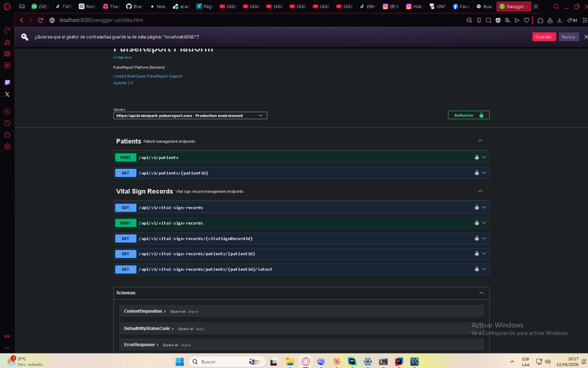
  
  *Interfaz Swagger UI mostrando todos los endpoints disponibles del backend de PulseReport para pruebas y validación.*
  
  ---
  
  ### B. Registro de signos vitales (POST)
  
  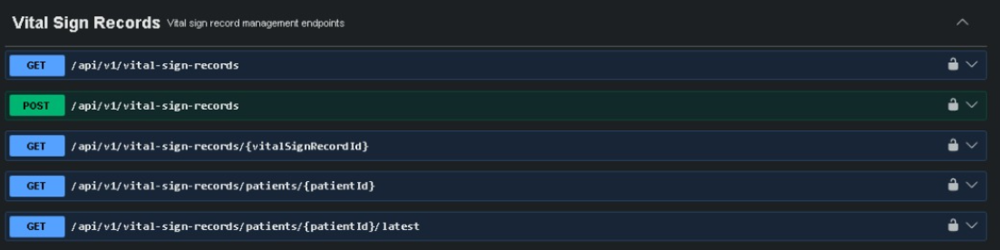
  
  *Ejecución del endpoint POST /vital-sign-records permitiendo registrar signos vitales de un paciente.*
  
  ---
  
  ### C. Consulta de signos vitales por paciente (GET)
  
  
  
  *Consulta de registros de signos vitales asociados a un paciente específico mediante su ID.*
  
  ---
  
  ### D. Obtención del último registro clínico
  
  
  
  *Endpoint que permite obtener el último registro de signos vitales basado en la fecha más reciente.*
  
  ---
  
  ### E. Registro de auditoría
  
  
  
  *Ejecución del endpoint POST /audit-logs para registrar acciones dentro del sistema.*
  
  ---
  
  ### F. Gestión de pacientes
  
  
  
  *Endpoints de pacientes permitiendo crear, consultar y actualizar información clínica.*
  
  ---
  
  ### G. Gestión de handover
  
  
  
  *Endpoints de handover clínico que permiten registrar y confirmar traspasos entre turnos.*
  
  ---
  
  ### H. Eventos críticos
  
  
  
  *Endpoints para gestionar alertas clínicas, incluyendo listar, atender y cerrar eventos críticos.*

#### 5.2.3.6. Services Documentation Evidence for Sprint Review

Durante el Sprint 3, el equipo completó la implementación de los servicios backend de PulseReport, exponiendo múltiples endpoints REST para la gestión de información clínica. A diferencia del Sprint anterior, en este caso los servicios fueron completamente funcionales y documentados utilizando Swagger UI, permitiendo su validación en tiempo real.

La documentación de servicios incluyó la definición de rutas, métodos HTTP, estructuras de request/response y pruebas directas desde la interfaz Swagger, facilitando la comprensión y uso de la API por parte de los integrantes del equipo.

**Documentación de endpoints (Swagger UI):**

Acceso local: http://localhost:8080/swagger-ui.html


---

### Endpoints implementados

**Pacientes (Patients)**

GET /patients
GET /patients/{id}
POST /patients
PUT /patients/{id}

**Signos Vitales (Vital Signs)**
POST /vital-sign-records
GET /vital-sign-records/{patientId}
GET /vital-sign-records/latest/{patientId}

**Auditoría (Audit Logs)**
POST /audit-logs

**Handover Clínico**
POST /handovers
GET /handovers/{id}
GET /handovers/patient/{patientId}
PUT /handovers/{id}/acknowledge

**Eventos Críticos (Critical Events)**
GET /critical-events/patient/{patientId}
PUT /critical-events/{id}/attend
PUT /critical-events/{id}/close


---

### Evidencia de documentación en Swagger


*Documentación de endpoints en Swagger UI mostrando los servicios organizados por bounded context.*

---

### Características de la documentación

* **Exploración interactiva**: Permite ejecutar endpoints directamente desde la interfaz.
* **Visualización de contratos API**: Muestra request bodies, parámetros y respuestas esperadas.
* **Separación por módulos**: Endpoints organizados según bounded contexts del sistema.
* **Validación en tiempo real**: Pruebas funcionales sin necesidad de herramientas externas.

---

### Beneficios obtenidos

* Facilita la integración frontend-backend.
* Permite detectar errores rápidamente durante el desarrollo.
* Mejora la comprensión del sistema por parte del equipo.
* Proporciona evidencia clara del funcionamiento del backend.

#### 5.2.3.7. Software Deployment Evidence for Sprint Review

Durante el Sprint 3, el equipo realizó el despliegue del backend de PulseReport en entorno local, permitiendo la ejecución y validación de todos los servicios REST desarrollados. Se utilizó Spring Boot como framework principal y MySQL como base de datos, asegurando la persistencia de la información clínica.

El despliegue se orientó a pruebas funcionales mediante Swagger UI, lo que permitió validar todos los endpoints implementados en tiempo real.

---

### Pasos realizados para el despliegue

1. **Configuración del entorno backend:**
   - Se utilizó Java (JDK 17+) y Maven Wrapper (`mvnw`) para la ejecución del proyecto.
   - Se configuraron perfiles de entorno (`application-dev.properties`) para manejar credenciales locales de base de datos.
   - Se estableció conexión con MySQL en entorno local.

2. **Ejecución del backend:**
   - Se ejecutó el comando:
     ```
     ./mvnw spring-boot:run
     ```
   - El servidor se levantó en el puerto 8080 utilizando Tomcat embebido.

3. **Configuración de base de datos:**
   - Se utilizó MySQL con una base de datos local (`pulsereport_platform`).
   - Hibernate se encargó de la generación automática de tablas.
   - Se validó la persistencia de datos mediante pruebas de endpoints.

4. **Validación mediante Swagger:**
   - Se accedió a la documentación en:
     ```
     http://localhost:8080/swagger-ui.html
     ```
   - Se ejecutaron pruebas de endpoints como:
     - Registro de signos vitales
     - Consulta de pacientes
     - Auditoría de acciones
     - Gestión de eventos críticos

---

### Evidencia del despliegue


*Aplicación backend ejecutándose correctamente en entorno local mostrando logs de Spring Boot.*

---


*Swagger UI mostrando los endpoints disponibles tras el despliegue del backend.*

---

### Resultados del despliegue

* El backend se ejecutó correctamente sin errores críticos.
* Todos los endpoints fueron accesibles desde Swagger.
* Se logró persistencia real de datos en MySQL.
* Se validó la integración entre múltiples bounded contexts.
* El sistema quedó listo para integración con frontend en futuros sprints.

---

### Conclusión

El despliegue del backend en entorno local permitió validar el correcto funcionamiento de todos los servicios desarrollados durante el Sprint 3. Esta etapa fue clave para asegurar la estabilidad del sistema y preparar la base para futuras integraciones y despliegues en entornos productivos.

#### 5.2.3.8. Team Collaboration Insights during Sprint

<p align="center">
  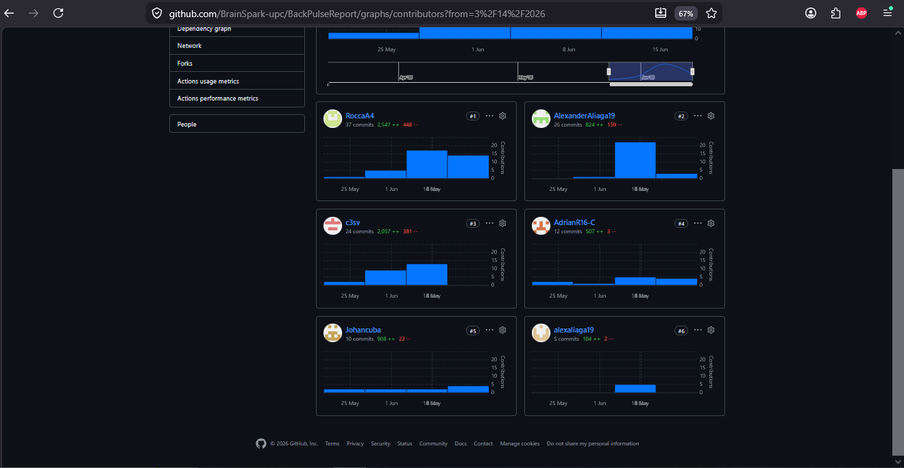
</p>

Durante el Sprint 3, el equipo mantuvo una colaboración activa y organizada enfocada en el desarrollo del backend de PulseReport. Se trabajó utilizando ramas por funcionalidad (feature branches), lo que permitió a cada integrante desarrollar su bounded context de manera independiente sin afectar el trabajo de los demás.

La comunicación se realizó principalmente a través de Discord, donde se coordinaron tareas, se resolvieron bloqueos técnicos y se realizaron revisiones rápidas de avances. Asimismo, se utilizaron pull requests para integrar los cambios al branch principal, asegurando control de calidad y evitando conflictos en el código.

Se evidenció una distribución clara de responsabilidades:
- Un integrante enfocado en **signos vitales**
- Otro en **pacientes**
- Otro en **handover clínico**
- Otro en **eventos críticos y auditoría**

Esto permitió avanzar en paralelo y cubrir múltiples funcionalidades en el mismo sprint.

Los commits reflejan participación activa de todos los integrantes, con múltiples integraciones y releases progresivos (v0.15.0, v0.16.0, v0.17.0), lo que demuestra un flujo de trabajo continuo y bien estructurado.

---

### Principales aprendizajes del equipo

* **Trabajo en paralelo**: Uso efectivo de ramas para evitar bloqueos entre integrantes.
* **Integración continua**: Uso de merge y releases frecuentes para mantener estabilidad.
* **Comunicación efectiva**: Resolución rápida de problemas mediante coordinación constante.
* **Buenas prácticas de desarrollo**: Uso de commits descriptivos, separación de responsabilidades y estructura clara del proyecto.

---

### Conclusión

El Sprint 3 evidenció una mejora significativa en la organización y colaboración del equipo, logrando integrar múltiples módulos del backend de manera eficiente. La adopción de buenas prácticas de desarrollo y comunicación permitió cumplir con los objetivos del sprint y entregar un sistema funcional, estable y bien estructurado.

## 5.3. Validation Interviews

En esta sección se describen las entrevistas de validación realizadas con usuarios pertenecientes a los segmentos objetivo de PulseReport. Estas entrevistas tuvieron como propósito evaluar la interacción de los usuarios con el Landing Page y con las funcionalidades del sistema, obteniendo retroalimentación sobre usabilidad, comprensión y valor percibido.

Las entrevistas fueron registradas en video como evidencia y se analizaron en base a tareas asignadas durante la sesión.

---

### 5.3.1. Diseño de Entrevistas

Se definieron los siguientes segmentos objetivo:

- Segmento 1: Personal de salud (médicos/enfermeros)
- Segmento 2: Usuarios con interés en soluciones digitales clínicas

---

#### Elementos evaluados

Durante la sesión de validación, los usuarios interactuaron con:

- Landing Page de PulseReport
- Documentación de endpoints mediante Swagger UI
- Flujo de registro y consulta de signos vitales

---

#### User Flows evaluados

1. Navegación del Landing Page
2. Comprensión de la propuesta de valor
3. Interpretación de funcionalidades del sistema
4. Simulación de uso del sistema (explicación de endpoints)
5. Percepción de utilidad en contexto real

---

#### Estructura de la entrevista

1. Introducción al proyecto
2. Exploración del Landing Page
3. Explicación del sistema (backend)
4. Tareas guiadas
5. Preguntas de validación

---
#### Guion de preguntas por segmento objetivo

Para asegurar una validación adecuada, se diseñaron guiones de preguntas específicos para cada segmento objetivo, considerando su contexto de uso y relación con el sistema.

---

### Segmento 1: Personal de salud (Enfermeros)

**Objetivo:**  
Evaluar la utilidad del sistema en el registro y consulta de información clínica, así como la claridad de las funcionalidades relacionadas a signos vitales.

**Preguntas – Landing Page:**
- ¿Qué entiendes que hace esta plataforma?
- ¿Te queda claro el problema que busca resolver?
- ¿Consideras que la información presentada es relevante para tu trabajo?
- ¿Qué sección te parece más útil o importante?

**Preguntas – Sistema (flujo funcional):**
- ¿Crees que este sistema facilitaría el registro de signos vitales?
- ¿Te parece claro cómo se registra la información del paciente?
- ¿Consideras útil poder consultar el último registro de signos vitales?
- ¿Qué tan fácil crees que sería usar este sistema en tu rutina diaria?

**Preguntas – Experiencia de usuario:**
- ¿Te resulta intuitiva la forma en que se presenta la información?
- ¿Qué mejorarías en el sistema?
- ¿Usarías esta herramienta en tu entorno laboral?

---

### Segmento 2: Personal de salud (Médicos)

**Objetivo:**  
Evaluar la utilidad del sistema en la toma de decisiones clínicas y consulta rápida de información del paciente.

**Preguntas – Landing Page:**
- ¿El landing page transmite claramente el propósito del sistema?
- ¿Te parece relevante la solución presentada para el entorno clínico?
- ¿Qué mejorarías en la forma en que se presenta la información?

**Preguntas – Sistema (flujo funcional):**
- ¿Te resulta útil poder consultar rápidamente los signos vitales de un paciente?
- ¿Consideras importante acceder al último registro clínico?
- ¿La información presentada te parece suficiente para apoyar decisiones médicas?
- ¿Qué otras funcionalidades agregarías?

**Preguntas – Experiencia de usuario:**
- ¿La interfaz te parece clara y comprensible?
- ¿Qué tan útil consideras el sistema en tu práctica médica?
- ¿Qué mejorarías para hacerlo más eficiente?

---

### Segmento 3: Usuarios generales / interesados en tecnología

**Objetivo:**  
Evaluar la comprensión general del sistema y la claridad de la propuesta de valor.

**Preguntas – Landing Page:**
- ¿Qué entiendes que hace este sistema?
- ¿Te parece clara la propuesta de valor?
- ¿El diseño te parece atractivo?

**Preguntas – Sistema:**
- ¿Te resulta fácil entender cómo funciona el sistema?
- ¿Consideras que la solución tiene valor en el sector salud?

**Preguntas – Experiencia de usuario:**
- ¿Te parece fácil de usar?
- ¿Qué mejorarías del sistema?
- ¿Recomendarías esta solución?


### 5.3.2. Registro de Entrevistas

#### Segmento: Usuarios generales / Personal de salud

---

### Entrevista 1
- Nombre: Milagros Mendoza
- Edad: 22
- Distrito: Lima
- Video: https://youtu.be/RMx0DzfhOL0
- Inicio: 00:00
- Duración: 11:55 min
- Screenshot: 

**Resumen:**
El usuario logró identificar correctamente el propósito del sistema. Consideró que el landing page es claro y bien estructurado. Sin embargo, mencionó que algunas funcionalidades técnicas podrían explicarse mejor para usuarios no especializados.

---

### Entrevista 2
- Nombre: Miguel Zevallos
- Edad: 24
- Distrito: Lima
- Video: https://youtu.be/ERz3jkvERR8
- Inicio: 00:00
- Duración: 9:00 min
- Screenshot: 

**Resumen:**
El usuario destacó la organización visual del landing page y la claridad de la información. Indicó que el sistema tiene potencial en entornos clínicos reales. Sugirió mejorar la interfaz para hacerla más intuitiva.

---

### Entrevista 3
- Nombre: Karen Mio
- Edad: 23
- Distrito: Lima
- Video: https://youtu.be/ypqKHHFEOTU
- Inicio: 00:00
- Duración: 8:32 min
- Screenshot: 

**Resumen:**
El usuario comprendió las funcionalidades principales del sistema. Consideró que la solución es innovadora. Recomendó incluir ejemplos prácticos para mejorar la comprensión del sistema.

---

### Entrevista 4
- Nombre: Olenka Rios
- Edad: 25
- Distrito: Lima
- Video: https://youtu.be/Pu3OU6O2b9I
- Inicio: 00:00
- Duración: 9:36 min
- Screenshot:


**Resumen:**
El usuario tuvo una experiencia positiva con el sistema. Destacó la propuesta de valor, pero sugirió optimizar la navegación y simplificar algunos textos.

---

### 5.3.3. Evaluaciones según heurísticas

Se realizó la evaluación basada en heurísticas de usabilidad, arquitectura de información e inclusive design.

---

#### Evaluación heurística (basado en Anexo D)

| # | Heurística | Descripción | Evaluación | Problema identificado | Severidad |
|---|-----------|------------|------------|----------------------|----------|
| 1 | Visibilidad del sistema | El sistema debe comunicar su estado claramente | Alta | No se identificaron problemas graves | Baja |
| 2 | Relación con el mundo real | Uso de lenguaje comprensible | Media | Algunos términos técnicos no claros | Media |
| 3 | Control del usuario | Facilidad de navegación | Media | Navegación puede mejorar | Media |
| 4 | Consistencia | Uniformidad en diseño | Alta | Diseño consistente | Baja |
| 5 | Prevención de errores | Evitar errores del usuario | Media | Falta feedback visual en acciones | Media |
| 6 | Reconocimiento vs memoria | Fácil comprensión visual | Alta | Información clara | Baja |
| 7 | Flexibilidad | Adaptabilidad del sistema | Media | Limitada personalización | Media |
| 8 | Diseño estético | Interfaz atractiva | Alta | Diseño moderno | Baja |

---

### Conclusión de validación

Las entrevistas permitieron validar que PulseReport cumple con comunicar su propuesta de valor y presentar una solución útil para el entorno clínico. No obstante, se identificaron mejoras necesarias en la claridad de algunas funcionalidades, navegación y experiencia de usuario.

El sistema demuestra potencial de aplicación real, especialmente en la gestión de información clínica estructurada.

## 5.4. Video About-the-Product

En esta sección se presenta el video "About the Product", en el cual el equipo muestra el funcionamiento general del sistema PulseReport, explicando su propósito, principales funcionalidades y valor dentro del contexto clínico.

El objetivo del video es evidenciar de manera práctica cómo la solución desarrollada permite mejorar la gestión de información clínica, específicamente en el registro y consulta de signos vitales, facilitando el acceso a datos relevantes para el personal de salud.

---

### Descripción del contenido del video

El video desarrollado incluye los siguientes elementos:

- **Introducción del problema:**  
  Se explica la problemática relacionada a la gestión manual o poco estructurada de la información clínica, especialmente en el registro de signos vitales.

- **Presentación de la solución:**  
  Se introduce PulseReport como una herramienta que busca digitalizar y estructurar la información clínica, mejorando la accesibilidad y organización de los datos.

- **Demostración del Landing Page:**  
  Se muestra la interfaz del landing page, destacando la propuesta de valor, funcionalidades principales y secciones informativas del producto.

- **Demostración del sistema (backend):**  
  Se realiza una demostración utilizando Swagger UI, donde se evidencian los principales endpoints implementados:
  - Registro de signos vitales
  - Consulta de registros por paciente
  - Obtención del último registro clínico

- **Explicación de funcionalidades clave:**  
  Se explica cómo cada endpoint contribuye a resolver el problema identificado, facilitando el trabajo del personal de salud.

- **Conclusión del equipo:**  
  Se resume el impacto de la solución y su potencial aplicación en entornos reales.

---

### Enlace del video

El video "About the Product" se encuentra disponible en el siguiente enlace:
Youtube: [https://youtu.be/3A5RHi0I9Y0]

Upc:[https://upcedupe-my.sharepoint.com/:v:/g/personal/u202217893_upc_edu_pe/IQAYdJDORBeKRLUWSeZyVdoNAbQq78Aig73g8Ok6sZhPcbA?e=5Ar5CS&nav=eyJyZWZlcnJhbEluZm8iOnsicmVmZXJyYWxBcHAiOiJTdHJlYW1XZWJBcHAiLCJyZWZlcnJhbFZpZXciOiJTaGFyZURpYWxvZy1MaW5rIiwicmVmZXJyYWxBcHBQbGF0Zm9ybSI6IldlYiIsInJlZmVycmFsTW9kZSI6InZpZXcifX0%3D]

---

### Conclusión

El video permite validar el funcionamiento del sistema desarrollado, mostrando evidencia real de las funcionalidades implementadas durante el proyecto. Asimismo, refuerza la propuesta de valor de PulseReport, evidenciando su utilidad en la gestión de información clínica y su potencial uso en escenarios reales.
#### Conclusiones

1. **Concluimos, que el desarrollo de PulseReport ha demostrado el potencial transformador de las tecnologías web en la mejora de los procesos de enfermería cardiovascular, facilitando la digitalización de registros de signos vitales, traspasos SBAR y eventos clínicos, lo que contribuye a reducir errores médicos y mejorar la continuidad del cuidado paciente.**

2. **También concluimos que la
3. aplicación de Scrum en el proyecto ha permitido una entrega iterativa y colaborativa, adaptándose a los requerimientos cambiantes del dominio clínico y asegurando que el producto final se alinee con las necesidades reales de los usuarios finales, como enfermeras y médicos especialistas.**

4. **Por último, a través del proyecto, el equipo ha fortalecido sus habilidades en desarrollo frontend con Angular, gestión de proyectos open-source y colaboración en entornos distribuidos, sentando las bases para futuras contribuciones en el ámbito de la salud digital y el software libre.**

#### Bibliografía

Pressman, R. S., & Maxim, B. R. (2020). Software Engineering: A Practitioner’s Approach (9th ed.). McGraw-Hill Education.
Angular. (2026). Angular.dev. Retrieved from https://angular.dev/overview

#### Anexos
- Link de la organización de GitHub: https://github.com/BrainSpark-upc
- Link del repositorio del reporte: https://github.com/BrainSpark-upc/Report
- Link de la landing page desplegada: https://brainspark-upc.github.io/Landing-Page/#funciona

