<p align="center">
  
</p>

<div align="center">
<p><strong>Universidad Peruana de Ciencias Aplicadas</strong></p>

<p><strong>Carrera de Ingeniería de Software</strong></p>

<p><strong><big>1ASI0729</big></strong></p>

<p><strong><big>Desarrollo de Aplicaciones Open Source</big></strong></p>

<p><strong>NRC</strong></p>

<p><strong><big>2610</big></strong></p>

<p><strong><big>Informe del Trabajo Final</big></strong></p>

<p><strong>Docente</strong></p>

<p><strong><big>Velásquez Núñez, Ángel Augusto</big></strong></p>

<p><strong>Equipo</strong></p>

<p><strong><big>BrainSpark</big></strong></p>

<p><strong>Proyecto</strong></p>

<p><strong><big>PulseReport</big></strong></p>

<p><strong>Integrantes</strong></p>
</div>

<div align="center">

|   Código   |       Apellidos y Nombres       |
|:----------:|:-------------------------------:|
| u202417693 | Aliaga Ocampo, Alexander Auden  |
| u202217893 |  Rios Cespedes, Adrian Matias   |
| u20221c803 |   Rocca Leon, Anhelo Rodrigo    |
| u202417448 |   Huamán Cuba, Johan Giovani    |
| u202414510 | Mansilla Rivero, Carlos Marcelo |

</div>
<div align="center">

  <p><strong>Período 202610</strong></p>
  <p><strong>Junio 2026</strong></p>

</div>

<div style="page-break-after: always;"></div>

## Registro de Versiones del Informe

El objetivo de esta sección es resumir las modificaciones relevantes realizadas al informe durante el ciclo de vida del proyecto. Se consideran modificaciones relevantes la adición de secciones, eliminación de secciones, correcciones o mejoras producto de la retroalimentación recibida del docente o de la autocrítica del equipo.

| Versión | Fecha      | Autor             | Descripción de modificación                                                                                                                                                                                                                                                                                                                                  |
|---------|------------|-------------------|--------------------------------------------------------------------------------------------------------------------------------------------------------------------------------------------------------------------------------------------------------------------------------------------------------------------------------------------------------------|
| **1.0** | 07/04/2026 | AlexanderAliaga19 | Se creó la primera versión del informe en README.md, incluyendo estructura inicial, información del curso, NRC, datos del equipo y contenido base del proyecto.                                                                                                                                                                                              |
| **1.1** | 07/04/2026 | AlexanderAliaga19 | Se agregó la tabla de contenidos, detalles de integrantes del equipo, misión de la startup, introducción del proyecto y se corrigió el formato general del README.md.                                                                                                                                                                                        |
| **1.2** | 07/04/2026 | AlexanderAliaga19 | Se incorporó la sección de Solution Profile y se mejoró la presentación de perfiles de integrantes, imágenes, detalles personales y formato visual del documento.                                                                                                                                                                                            |
| **1.3** | 16/04/2026 | AlexanderAliaga19 | Se agregaron secciones de Lean UX, incluyendo Problem Statements, Assumptions, Hypothesis Statements, Lean UX Canvas y definición de segmentos objetivo.                                                                                                                                                                                                     |
| **1.4** | 17/04/2026 | AdrianR16-C       | Se incorporó la sección de Requirements Elicitation & Analysis, incluyendo el análisis inicial de competidores y la sección de entrevistas para validación del proyecto.                                                                                                                                                                                     |
| **1.5** | 18/04/2026 | AdrianR16-C       | Se agregó el registro de entrevistas al informe, incorporando evidencias y contenido relacionado con la validación de usuarios.                                                                                                                                                                                                                              |
| **1.6** | 19/04/2026 | AdrianR16-C       | Se documentaron hallazgos obtenidos de entrevistas sobre procesos clínicos, y se ampliaron las secciones relacionadas con entrevistas, User Personas y User Task Matrix.                                                                                                                                                                                     |
| **1.7** | 19/04/2026 | AlexanderAliaga19 | Se agregaron lineamientos visuales, correcciones de rutas de imágenes y ajustes de presentación en los assets del capítulo 2.                                                                                                                                                                                                                                |
| **1.8** | 19/04/2026 | AdrianR16-C       | Se actualizaron perfiles de usuarios, User Personas, User Task Matrix y análisis asociado al proceso de investigación de usuarios.                                                                                                                                                                                                                           |
| **1.9** | 20/04/2026 | RoccaA4           | Se agregaron detalles de Event Storming, navegación del documento y secciones adicionales solicitadas por el enunciado del proyecto.                                                                                                                                                                                                                         |
| **2.0** | 21/04/2026 | Johancuba         | Se incorporaron secciones del capítulo 4, incluyendo arquitectura de información, diagramas de base de datos, diagramas de clase y configuración técnica del proyecto.                                                                                                                                                                                       |
| **2.1** | 22/04/2026 | AlexanderAliaga19 | Se actualizó la documentación del Sprint 1, incluyendo objetivos, alcance, planificación y evidencias de desarrollo de la Landing Page.                                                                                                                                                                                                                      |
| **2.2** | 22/04/2026 | RoccaA4           | Se agregaron wireframes, mock-ups, user flows y evidencias visuales correspondientes al diseño UX/UI del producto.                                                                                                                                                                                                                                           |
| **2.3** | 23/04/2026 | Johancuba         | Se agregaron y corrigieron diagramas de contexto, arquitectura de software, diseño de base de datos, gestión de configuración de software y estrategia de control de versiones.                                                                                                                                                                              |
| **2.4** | 10/05/2026 | AdrianR16-C       | Se actualizó el análisis competitivo, estrategias frente a competidores y claridad estructural del informe a partir de revisión del contenido existente.                                                                                                                                                                                                     |
| **2.5** | 11/05/2026 | AdrianR16-C       | Se revisaron y ampliaron las secciones de entrevistas, User Journey Mapping, Empathy Mapping, Big Picture Event Storming y Ubiquitous Language.                                                                                                                                                                                                              |
| **2.6** | 11/05/2026 | RoccaA4           | Se mejoró el Product Backlog con nuevas User Stories, prioridades y relación con Sprint 2. También se actualizaron secciones de UX/UI y prototipos.                                                                                                                                                                                                          |
| **2.7** | 11/05/2026 | Johancuba         | Se añadieron diagramas y evidencias técnicas, se corrigieron nombres de archivos, rutas de imágenes y secciones relacionadas con arquitectura y despliegue.                                                                                                                                                                                                  |
| **2.8** | 18/06/2026 | AlexanderAliaga19 | Se incorporó documentación del Sprint 3, incluyendo planificación, alcance, evidencias de desarrollo y actualización de secciones generales del informe.                                                                                                                                                                                                     |
| **2.9** | 18/06/2026 | AdrianR16-C       | Se agregaron evidencias de validación de la aplicación y Landing Page mediante entrevistas, tareas asignadas a usuarios y evaluación heurística de hallazgos.                                                                                                                                                                                                |
| **3.0** | 18/06/2026 | RoccaA4           | Se actualizaron evidencias visuales del producto, mock-ups, flujos de interacción y capturas relacionadas con la Web Application.                                                                                                                                                                                                                            |
| **3.1** | 18/06/2026 | Johancuba         | Se documentaron servicios RESTful API, despliegue de Web Services, configuración técnica y evidencias de implementación.                                                                                                                                                                                                                                     |
| **3.2** | 18/06/2026 | CarlosMansilla    | Se integró al equipo durante AV2 y desarrolló el bounded context de Vital Signs en el backend de PulseReport, incluyendo estructura por capas, lógica de dominio, persistencia, servicios de aplicación, endpoints REST para crear y consultar registros de signos vitales, validación mediante Swagger y documentación técnica correspondiente al Sprint 3. |
| **3.3** | 01/07/2026 | AlexanderAliaga19 | Se actualizó la estructura del informe para la entrega final TB2, incorporando la sección Sprint 4 y ajustes generales del documento.                                                                                                                                                                                                                        |
| **3.4** | 01/07/2026 | AdrianR16-C       | Se corrigieron secciones relacionadas con entrevistas, Needfinding, User Stories, Impact Mapping y Product Backlog para mejorar la trazabilidad entre investigación y requerimientos.                                                                                                                                                                        |
| **3.5** | 01/07/2026 | RoccaA4           | Se revisaron y actualizaron secciones relacionadas con UX/UI, wireframes, mock-ups, prototipos, user flows y coherencia visual de la Web Application.                                                                                                                                                                                                        |
| **3.6** | 01/07/2026 | Johancuba         | Se revisaron y actualizaron secciones relacionadas con arquitectura de software, diseño orientado a objetos, base de datos, configuración técnica y despliegue.                                                                                                                                                                                              |
| **3.7** | 01/07/2026 | CarlosMansilla    | Participó en la revisión final del informe TB2, corrigiendo coherencia entre artefactos, actualización de Sprint 4, Student Outcome, evidencias de colaboración, documentación técnica, trazabilidad de endpoints y alineación general con el enunciado oficial del trabajo final.                                                                           |

<div style="page-break-after: always;"></div>

## Project Report Collaboration Insights
En esta sección se presenta la evidencia de colaboración del equipo en la elaboración del informe del proyecto. El informe se desarrolla en formato Markdown dentro de un repositorio público de GitHub de la organización del equipo, permitiendo evidenciar los aportes realizados mediante commits, historial de cambios y analíticos de colaboración.

**URL del repositorio del informe del proyecto:**  
https://github.com/BrainSpark-upc/Report/blob/main/README.md

Durante el ciclo de vida del proyecto, el equipo fue actualizando el informe de acuerdo con los avances de cada entrega. Las actividades realizadas incluyen redacción de secciones, incorporación de capturas, corrección de rutas de imágenes, actualización de evidencias, mejora de redacción, documentación de sprints y ajustes derivados de la retroalimentación recibida.

| Entrega | Actividades de colaboración realizadas                                                                                                                                                                                                                                                                                                            | Evidencia considerada                                                                                                                                                                         |
|---------|---------------------------------------------------------------------------------------------------------------------------------------------------------------------------------------------------------------------------------------------------------------------------------------------------------------------------------------------------|-----------------------------------------------------------------------------------------------------------------------------------------------------------------------------------------------|
| **AV1** | Se creó la estructura inicial del informe, se documentó el perfil de la startup, la problemática, Lean UX Process, entrevistas, primeros artefactos de análisis, requisitos iniciales, diseño de producto y Sprint 1.                                                                                                                             | Commits iniciales del README, historial de cambios del repositorio y capturas de colaboración en GitHub.                                                                                      |
| **TB1** | Se actualizaron artefactos previamente entregados, se mejoró la documentación de requisitos, diseño UX/UI, arquitectura, Sprint 2 y evidencias de despliegue de la Landing Page y primera versión de la Web Application.                                                                                                                          | Commits asociados a correcciones, capturas de GitHub Insights y evidencias de actualización del informe.                                                                                      |
| **AV2** | Se incorporó la documentación del Sprint 3, evidencias de implementación, validación, documentación de servicios RESTful API, despliegue de Web Services, Video About-the-Product y avance del Video About-the-Team. Además, Carlos Marcelo Mansilla Rivero se integró al equipo y colaboró en la revisión y mejora del informe.                  | Commits de actualización del informe, capturas de colaboración, historial de ramas y evidencias de corrección posterior a retroalimentación.                                                  |
| **TB2** | Se realizó la revisión final del informe, incorporando Sprint 4, actualización de Student Outcome, corrección de secciones pendientes, mejora de trazabilidad entre artefactos, revisión de nombres del producto, actualización de evidencias finales, validación de despliegues y alineación general con el enunciado oficial del trabajo final. | Commits finales del README, capturas actualizadas de GitHub Insights, contributors, historial de commits por integrante, evidencias de Sprint 4 y revisión final del repositorio del informe. |


### Evidencias de colaboración en el informe

A continuación, se incluyen capturas de los analíticos de colaboración del repositorio del informe, incluyendo commits por integrante, contribuciones y actividad del repositorio.

Avance 1
<p align="center">
  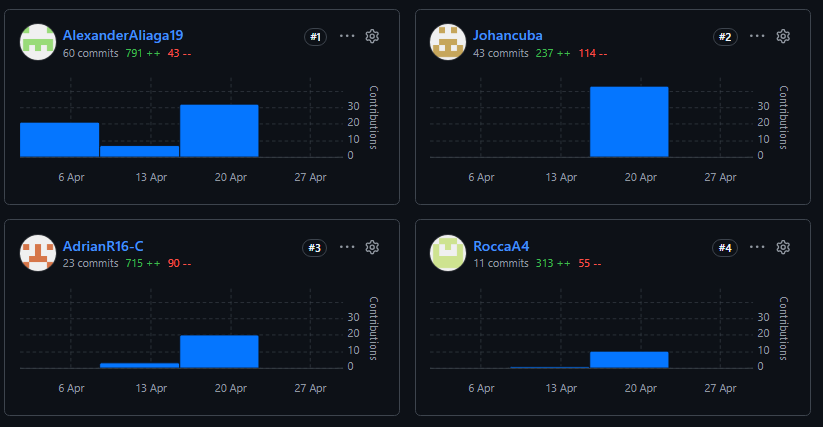
</p>

Trabajo Parcial
<p align="center">
  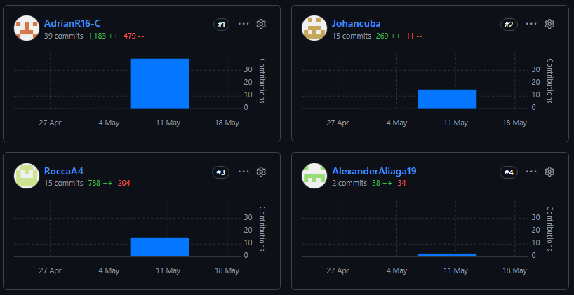
</p>
Avance 2
<p align="center">
  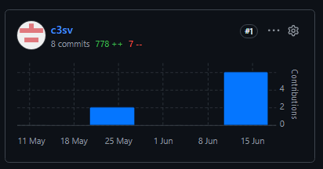
</p>
Trabajo Final
<p align="center">
  
</p>

<div style="page-break-after: always;"></div>

## Contenido

- [Registro de Versiones del Informe](#registro-de-versiones-del-informe)
- [Project Report Collaboration Insights](#project-report-collaboration-insights)
- [Student Outcome](#student-outcome)

- [Capítulo I: Introducción](#capítulo-i-introducción)
    - [1.1. Startup Profile](#11-startup-profile)
        - [1.1.1. Descripción de la Startup](#111-descripción-de-la-startup)
        - [1.1.2. Perfiles de integrantes del equipo](#112-perfiles-de-integrantes-del-equipo)
    - [1.2. Solution Profile](#12-solution-profile)
        - [1.2.1. Antecedentes y problemática](#121-antecedentes-y-problemática)
        - [1.2.2. Lean UX Process](#122-lean-ux-process)
            - [1.2.2.1. Lean UX Problem Statements](#1221-lean-ux-problem-statements)
            - [1.2.2.2. Lean UX Assumptions](#1222-lean-ux-assumptions)
            - [1.2.2.3. Lean UX Hypothesis Statements](#1223-lean-ux-hypothesis-statements)
            - [1.2.2.4. Lean UX Canvas](#1224-lean-ux-canvas)
    - [1.3. Segmentos objetivo](#13-segmentos-objetivo)

- [Capítulo II: Requirements Elicitation & Analysis](#capítulo-ii-requirements-elicitation--analysis)
    - [2.1. Competidores](#21-competidores)
        - [2.1.1. Análisis competitivo](#211-análisis-competitivo)
        - [2.1.2. Estrategias y tácticas frente a competidores](#212-estrategias-y-tácticas-frente-a-competidores)
    - [2.2. Entrevistas](#22-entrevistas)
        - [2.2.1. Diseño de entrevistas](#221-diseño-de-entrevistas)
        - [2.2.2. Registro de entrevistas](#222-registro-de-entrevistas)
        - [2.2.3. Análisis de entrevistas](#223-análisis-de-entrevistas)
    - [2.3. Needfinding](#23-needfinding)
        - [2.3.1. User Personas](#231-user-personas)
        - [2.3.2. User Task Matrix](#232-user-task-matrix)
        - [2.3.3. User Journey Mapping](#233-user-journey-mapping)
        - [2.3.4. Empathy Mapping](#234-empathy-mapping)
    - [2.4. Big Picture Event Storming](#24-big-picture-event-storming)
    - [2.5. Ubiquitous Language](#25-ubiquitous-language)

- [Capítulo III: Requirements Specification](#capítulo-iii-requirements-specification)
    - [3.1. User Stories](#31-user-stories)
    - [3.2. Impact Mapping](#32-impact-mapping)
    - [3.3. Product Backlog](#33-product-backlog)

- [Capítulo IV: Product Design](#capítulo-iv-product-design)
    - [4.1. Style Guidelines](#41-style-guidelines)
        - [4.1.1. General Style Guidelines](#411-general-style-guidelines)
        - [4.1.2. Web Style Guidelines](#412-web-style-guidelines)
    - [4.2. Information Architecture](#42-information-architecture)
        - [4.2.1. Organization Systems](#421-organization-systems)
        - [4.2.2. Labeling Systems](#422-labeling-systems)
        - [4.2.3. SEO Tags and Meta Tags](#423-seo-tags-and-meta-tags)
        - [4.2.4. Searching Systems](#424-searching-systems)
        - [4.2.5. Navigation Systems](#425-navigation-systems)
    - [4.3. Landing Page UI Design](#43-landing-page-ui-design)
        - [4.3.1. Landing Page Wireframe](#431-landing-page-wireframe)
        - [4.3.2. Landing Page Mock-up](#432-landing-page-mock-up)
    - [4.4. Web Applications UX/UI Design](#44-web-applications-uxui-design)
        - [4.4.1. Web Applications Wireframes](#441-web-applications-wireframes)
        - [4.4.2. Web Applications Wireflow Diagrams](#442-web-applications-wireflow-diagrams)
        - [4.4.3. Web Applications Mock-ups](#443-web-applications-mock-ups)
        - [4.4.4. Web Applications User Flow Diagrams](#444-web-applications-user-flow-diagrams)
    - [4.5. Web Applications Prototyping](#45-web-applications-prototyping)
    - [4.6. Domain-Driven Software Architecture](#46-domain-driven-software-architecture)
        - [4.6.1. Design-Level Event Storming](#461-design-level-event-storming)
        - [4.6.2. Software Architecture Context Diagram](#462-software-architecture-context-diagram)
        - [4.6.3. Software Architecture Container Diagrams](#463-software-architecture-container-diagrams)
        - [4.6.4. Software Architecture Components Diagrams](#464-software-architecture-components-diagrams)
    - [4.7. Software Object-Oriented Design](#47-software-object-oriented-design)
        - [4.7.1. Class Diagrams](#471-class-diagrams)
    - [4.8. Database Design](#48-database-design)
        - [4.8.1. Database Diagrams](#481-database-diagrams)

- [Capítulo V: Product Implementation, Validation & Deployment](#capítulo-v-product-implementation-validation--deployment)
    - [5.1. Software Configuration Management](#51-software-configuration-management)
        - [5.1.1. Software Development Environment Configuration](#511-software-development-environment-configuration)
        - [5.1.2. Source Code Management](#512-source-code-management)
        - [5.1.3. Source Code Style Guide & Conventions](#513-source-code-style-guide--conventions)
        - [5.1.4. Software Deployment Configuration](#514-software-deployment-configuration)
    - [5.2. Landing Page, Services & Applications Implementation](#52-landing-page-services--applications-implementation)
        - [5.2.1. Sprint 1](#521-sprint-1)
            - [5.2.1.1. Sprint Planning 1](#5211-sprint-planning-1)
            - [5.2.1.2. Aspect Leaders and Collaborators](#5212-aspect-leaders-and-collaborators)
            - [5.2.1.3. Sprint Backlog 1](#5213-sprint-backlog-1)
            - [5.2.1.4. Development Evidence for Sprint Review](#5214-development-evidence-for-sprint-review)
            - [5.2.1.5. Execution Evidence for Sprint Review](#5215-execution-evidence-for-sprint-review)
            - [5.2.1.6. Services Documentation Evidence for Sprint Review](#5216-services-documentation-evidence-for-sprint-review)
            - [5.2.1.7. Software Deployment Evidence for Sprint Review](#5217-software-deployment-evidence-for-sprint-review)
            - [5.2.1.8. Team Collaboration Insights during Sprint](#5218-team-collaboration-insights-during-sprint)
        - [5.2.2. Sprint 2](#522-sprint-2)
            - [5.2.2.1. Sprint Planning 2](#5221-sprint-planning-2)
            - [5.2.2.2. Aspect Leaders and Collaborators](#5222-aspect-leaders-and-collaborators)
            - [5.2.2.3. Sprint Backlog 2](#5223-sprint-backlog-2)
            - [5.2.2.4. Development Evidence for Sprint Review](#5224-development-evidence-for-sprint-review)
            - [5.2.2.5. Execution Evidence for Sprint Review](#5225-execution-evidence-for-sprint-review)
            - [5.2.2.6. Services Documentation Evidence for Sprint Review](#5226-services-documentation-evidence-for-sprint-review)
            - [5.2.2.7. Software Deployment Evidence for Sprint Review](#5227-software-deployment-evidence-for-sprint-review)
            - [5.2.2.8. Team Collaboration Insights during Sprint](#5228-team-collaboration-insights-during-sprint)
        - [5.2.3. Sprint 3](#523-sprint-3)
            - [5.2.3.1. Sprint Planning 3](#5231-sprint-planning-3)
            - [5.2.3.2. Aspect Leaders and Collaborators](#5232-aspect-leaders-and-collaborators)
            - [5.2.3.3. Sprint Backlog 3](#5233-sprint-backlog-3)
            - [5.2.3.4. Development Evidence for Sprint Review](#5234-development-evidence-for-sprint-review)
            - [5.2.3.5. Execution Evidence for Sprint Review](#5235-execution-evidence-for-sprint-review)
            - [5.2.3.6. Services Documentation Evidence for Sprint Review](#5236-services-documentation-evidence-for-sprint-review)
            - [5.2.3.7. Software Deployment Evidence for Sprint Review](#5237-software-deployment-evidence-for-sprint-review)
            - [5.2.3.8. Team Collaboration Insights during Sprint](#5238-team-collaboration-insights-during-sprint)
          - [5.2.4. Sprint 4](#524-sprint-4)
            - [5.2.4.1. Sprint Planning 4](#5241-sprint-planning-4)
            - [5.2.4.2. Aspect Leaders and Collaborators](#5242-aspect-leaders-and-collaborators)
            - [5.2.4.3. Sprint Backlog 4](#5243-sprint-backlog-4)
            - [5.2.4.4. Development Evidence for Sprint Review](#5244-development-evidence-for-sprint-review)
            - [5.2.4.5. Execution Evidence for Sprint Review](#5245-execution-evidence-for-sprint-review)
            - [5.2.4.6. Services Documentation Evidence for Sprint Review](#5246-services-documentation-evidence-for-sprint-review)
            - [5.2.4.7. Software Deployment Evidence for Sprint Review](#5247-software-deployment-evidence-for-sprint-review)
            - [5.2.4.8. Team Collaboration Insights during Sprint](#5248-team-collaboration-insights-during-sprint)
    - [5.3. Validation Interviews](#53-validation-interviews)
        - [5.3.1. Diseño de Entrevistas](#531-diseño-de-entrevistas)
        - [5.3.2. Registro de Entrevistas](#532-registro-de-entrevistas)
        - [5.3.3. Evaluaciones según heurísticas](#533-evaluaciones-según-heuristicas)
    - [5.4. Video About-the-Product](#54-video-about-the-product)

- [Conclusiones](#conclusiones)
    - [Conclusiones y recomendaciones](#conclusiones-y-recomendaciones)
    - [Video About-the-Team](#video-about-the-team)

- [Bibliografía](#bibliografía)
- [Anexos](#anexos)

<div style="page-break-after: always;"></div>

## Student Outcome

El curso contribuye al cumplimiento del Student Outcome ABET y el grupo de BrainSpark reflejo su cumplimiento en la siguiente tabla 
que traza la vida del desarrollo de PulseReport:

**ABET – EAC - Student Outcome 3**

**Criterio:** Capacidad de comunicarse efectivamente con un rango de audiencias.

En el siguiente cuadro se describen las acciones realizadas y los enunciados de conclusiones por parte del grupo, que permiten sustentar el cumplimiento del ABET – EAC - Student Outcome 3.

<table>
  <tr>
    <th style="width: 20%;">Criterio específico</th>
    <th style="width: 45%;">Acciones realizadas</th>
    <th style="width: 35%;">Conclusiones</th>
  </tr>

  <tr>
    <td>Comunica oralmente con efectividad a diferentes rangos de audiencia.</td>
    <td>
      <b>Aliaga Ocampo, Alexander Auden</b><br>
      <b>AV1:</b> Participó en la explicación oral de la propuesta inicial de PulseReport, presentando la problemática identificada, el perfil de la startup, los segmentos objetivo y el enfoque general de la solución para una audiencia académica.<br>
      <b>TB1:</b> Explicó avances relacionados con la Landing Page, la propuesta de valor, los primeros artefactos del producto y la forma en que la solución comunica sus beneficios a visitantes interesados y potenciales clientes institucionales.<br>
      <b>AV2:</b> Apoyó en la comunicación oral de los avances del producto, especialmente en la presentación de evidencias de implementación, mejoras de la Landing Page, validación de la aplicación y organización general del informe.<br>
      <b>TB2:</b> Participó en la preparación de la exposición final del proyecto, reforzando la explicación de la propuesta de valor, evidencias finales, Sprint 4, mejoras realizadas y coherencia general del producto PulseReport.<br><br>
      <b>Rios Cespedes, Adrian Matias</b><br>
      <b>AV1:</b> Explicó oralmente los hallazgos obtenidos durante la etapa de entrevistas, relacionando las necesidades identificadas con los segmentos objetivo y con la problemática clínica que PulseReport busca resolver.<br>
      <b>TB1:</b> Comunicó avances relacionados con Requirements Elicitation & Analysis, Needfinding, User Stories, Product Backlog y la trazabilidad entre entrevistas, necesidades de usuarios y requisitos del producto.<br>
      <b>AV2:</b> Participó en la exposición de avances relacionados con validación, entrevistas, documentación de requisitos y evidencias del producto, utilizando un lenguaje orientado tanto a la audiencia académica como a usuarios del dominio clínico.<br>
      <b>TB2:</b> Apoyó en la comunicación final de los artefactos de investigación y requerimientos, explicando la relación entre entrevistas, User Personas, Needfinding, Impact Mapping, Product Backlog y funcionalidades priorizadas.<br><br>
      <b>Rocca Leon, Anhelo Rodrigo</b><br>
      <b>AV1:</b> Comunicó oralmente decisiones relacionadas con experiencia de usuario, flujos iniciales e interfaz propuesta para PulseReport, explicando cómo estas decisiones respondían a las necesidades del personal de salud.<br>
      <b>TB1:</b> Presentó avances relacionados con wireframes, mock-ups, prototipos y decisiones visuales de la Landing Page y Web Application, explicando la estructura de navegación y la experiencia propuesta para los usuarios. Asimismo, comunico los avances en la sección Sprint 2 del reporte<br>
      <b>AV2:</b> Tomo participación en el liderazgo del equipo, coordino tareas y comunico avances en el backend del producto<br>
      <b>TB2:</b> Participó en la explicación final de la experiencia UX/UI, evidencias visuales, prototipos, flujos de usuario, mejoras de interfaz y consistencia visual. Asimismo, asumió liderazgo y comunico a todo el equipo sus tareas a cumplir en los productos y reporte.<br><br>
      <b>Huamán Cuba, Johan Giovani</b><br>
      <b>AV1:</b> Explicó oralmente elementos técnicos del diseño de la solución, incluyendo arquitectura inicial, organización de componentes y relación entre los artefactos de diseño de software.<br>
      <b>TB1:</b> Presentó avances relacionados con arquitectura de información, diagramas técnicos, diseño de base de datos, configuración del entorno de desarrollo y gestión del código fuente.<br>
      <b>AV2:</b> Participó en la explicación de evidencias técnicas del producto, relacionando la arquitectura propuesta con la implementación, servicios RESTful API, documentación técnica y despliegue de los componentes desarrollados.<br>
      <b>TB2:</b> Apoyó en la comunicación final de arquitectura, diseño orientado a objetos, base de datos, configuración técnica, despliegue, evidencias de implementación y consistencia entre los componentes del sistema.<br><br>
      <b>Mansilla Rivero, Carlos Marcelo</b><br>
      <b>AV1:</b> No formaba parte del equipo durante esta entrega.<br>
      <b>TB1:</b> No formaba parte del equipo durante esta entrega.<br>
      <b>AV2:</b> Se integró al equipo y colaboró en la comunicación de avances técnicos del backend de PulseReport, explicando el bounded context de Vital Signs, su estructura por capas, los endpoints REST implementados para registros de signos vitales y su validación mediante Swagger.<br>
      <b>TB2:</b> Participó en la preparación de la comunicación final del proyecto, reforzando la explicación de Sprint 4, documentación técnica, trazabilidad de endpoints, evidencias de implementación, actualización del informe y alineación del producto con el enunciado oficial.
    </td>
    <td>
      Durante AV1, el equipo comunicó oralmente la problemática, la propuesta de solución, los segmentos objetivo y los primeros artefactos del ciclo de vida del producto. En TB1, la comunicación oral se orientó a explicar el avance del diseño del producto, requisitos, Sprint 2, arquitectura inicial y evidencias de la Landing Page y Web Application. En AV2, el equipo fortaleció la explicación de avances técnicos, validación, despliegue, documentación de servicios y mejoras aplicadas al producto. Finalmente, en TB2, la comunicación oral se enfocó en presentar el cierre del proyecto, Sprint 4, evidencias finales y coherencia entre investigación, diseño, implementación y validación. Como resultado, el equipo fortaleció su capacidad para adaptar el mensaje a distintas audiencias: docente, evaluadores, visitantes de la Landing Page, usuarios clínicos, clientes institucionales y miembros técnicos del proyecto.
    </td>
  </tr>
  <tr>
    <td>Comunica por escrito con efectividad a diferentes rangos de audiencia.</td>
    <td>
      <b>Aliaga Ocampo, Alexander Auden</b><br>
      <b>AV1:</b> Participó en la redacción inicial del informe, incluyendo estructura base, información del equipo, Startup Profile, Solution Profile, Lean UX Process y secciones relacionadas con la presentación inicial del producto.<br>
      <b>TB1:</b> Colaboró en la actualización escrita de la Landing Page, documentación de Sprint 2, evidencias de avance, presentación del producto y mejora de secciones orientadas a comunicar la propuesta de valor de PulseReport.<br>
      <b>AV2:</b> Colaboró en la actualización escrita de evidencias de implementación, validación de la Landing Page, documentación del producto y mejora de secciones relacionadas con la comunicación del valor de PulseReport.<br>
      <b>TB2:</b> Participó en la revisión final del informe, corrigiendo estructura, presentación general, evidencias finales, redacción de secciones introductorias y coherencia de la propuesta de valor con el producto desarrollado.<br><br>
      <b>Rios Cespedes, Adrian Matias</b><br>
      <b>AV1:</b> Redactó y organizó secciones relacionadas con entrevistas, análisis de usuarios, necesidad del producto, segmentos objetivo y hallazgos obtenidos durante el proceso inicial de investigación.<br>
      <b>TB1:</b> Apoyó en la documentación escrita de Requirements Specification, User Stories, Impact Mapping, Product Backlog y la relación entre necesidades de usuarios y funcionalidades priorizadas.<br>
      <b>AV2:</b> Apoyó en la mejora escrita de secciones de requisitos, entrevistas, validación, documentación técnica y evidencias vinculadas al avance del producto.<br>
      <b>TB2:</b> Corrigió y actualizó secciones relacionadas con entrevistas, análisis de usuarios, Needfinding, User Stories, Impact Mapping y Product Backlog para mejorar la trazabilidad entre investigación, requerimientos y funcionalidades del producto.<br><br>
      <b>Rocca Leon, Anhelo Rodrigo</b><br>
      <b>AV1:</b> Programo reuniones presenciales y comunicación mediante mensajería de texto. Participó en la documentación de artefactos visuales, flujos de usuario, decisiones de interfaz y criterios iniciales de experiencia de usuario para PulseReport.<br>
      <b>TB1:</b> Mantuvo una comunicación grupal de confianza y respeto. Colaboró en la documentación de wireframes, mock-ups, prototipos, lineamientos visuales y evidencias UX/UI correspondientes a la Landing Page y Web Application.<br>
      <b>AV2:</b> Asumió co-liderazgo del grupo, programo reuniones presenciales y distribuyo tareas para el desarrollo del backend. Colaboró en la revisión y actualización escrita de secciones relacionadas con wireframes, mock-ups, wireflows, user flows y evidencias visuales de la Web Application.<br>
      <b>TB2:</b> Asumio total liderazgo del grupo, comunico tareas y estuvo pendiente de los últimos avances de los productos, en especial, el reporte. Revisó y actualizó secciones relacionadas con el reporte entero, el UX/UI, prototipos, flujos de interacción, capturas de la Web Application, coherencia visual y consistencia entre diseño e implementación del proyecto PulseReport.<br><br>
      <b>Huamán Cuba, Johan Giovani</b><br>
      <b>AV1:</b> Contribuyó en la documentación escrita de arquitectura, diseño de software, base de datos, organización técnica de la solución y configuración inicial del entorno de desarrollo.<br>
      <b>TB1:</b> Documentó avances relacionados con arquitectura de software, diagramas técnicos, gestión de configuración, source code management, convenciones de desarrollo y despliegue inicial.<br>
      <b>AV2:</b> Apoyó en la revisión de consistencia técnica del informe, especialmente en secciones relacionadas con implementación, arquitectura, servicios RESTful API, despliegue y documentación de evidencias.<br>
      <b>TB2:</b> Revisó y actualizó secciones relacionadas con arquitectura de software, diseño orientado a objetos, base de datos, configuración técnica, despliegue, documentación de servicios y evidencias finales de implementación.<br><br>
      <b>Mansilla Rivero, Carlos Marcelo</b><br>
      <b>AV1:</b> No formaba parte del equipo durante esta entrega.<br>
      <b>TB1:</b> No formaba parte del equipo durante esta entrega.<br>
      <b>AV2:</b> Se integró al equipo y documentó el bounded context de Vital Signs del backend de PulseReport, incluyendo endpoints REST para crear registros de signos vitales, consultar un registro por ID, listar registros por paciente y obtener el último registro de un paciente. También incorporó evidencias de Swagger y documentación técnica correspondiente al Sprint 3.<br>
      <b>TB2:</b> Participó en la revisión y actualización final del informe, corrigiendo secciones relacionadas con Sprint 4, documentación técnica, trazabilidad de endpoints, evidencias de colaboración, Student Outcome, coherencia entre artefactos y alineación con el enunciado oficial del trabajo final.
    </td>
    <td>
      El informe permitió al equipo comunicar por escrito el proceso de ingeniería aplicado durante el ciclo de vida del producto. En AV1 se documentaron la investigación inicial, el problema, la solución propuesta, los segmentos objetivo y los primeros artefactos de diseño. En TB1 se fortaleció la documentación de requisitos, diseño UX/UI, arquitectura, Sprint 2 y evidencias de despliegue de la Landing Page y Web Application. En AV2 se incorporaron evidencias de implementación, validación, despliegue, documentación de servicios RESTful API y mejoras derivadas de la retroalimentación. En TB2 se realizó la actualización final del informe, incorporando Sprint 4, mejoras de consistencia, corrección de artefactos, trazabilidad entre secciones, evidencias finales y alineación con el enunciado oficial. Como resultado, la comunicación escrita del equipo mantiene claridad, organización, coherencia técnica y adaptación a diferentes audiencias, incluyendo evaluadores académicos, usuarios clínicos, visitantes del producto y miembros técnicos del proyecto.
    </td>
  </tr>
</table>

## Capítulo I: Introducción

### 1.1. Startup Profile

#### 1.1.1. Descripción de la Startup

**BrainSpark** es una startup tecnológica conformada por estudiantes de la carrera de Ingeniería de Software de la Universidad Peruana de Ciencias Aplicadas. El equipo se enfoca en el desarrollo de soluciones digitales orientadas a mejorar procesos críticos dentro del sector salud, aplicando análisis de usuarios, diseño de experiencias web, desarrollo de aplicaciones y servicios RESTful API.

La propuesta principal de BrainSpark es **PulseReport**, una solución web orientada a mejorar la gestión de información clínica en entornos cardiovasculares. El producto busca apoyar a profesionales de salud en actividades como el registro de signos vitales, documentación de eventos clínicos, comunicación durante cambios de turno y consulta de información relevante del paciente.

PulseReport surge a partir de la problemática relacionada con la dispersión de información clínica, la duplicidad de registros, la comunicación no estructurada entre turnos y la dificultad para mantener trazabilidad sobre eventos, responsables y horarios. Frente a ello, la solución propone una experiencia web que permita centralizar información, facilitar el seguimiento clínico y mejorar la continuidad de atención.

Como startup, BrainSpark busca construir un producto digital escalable, accesible y enfocado en el usuario. Su trabajo combina investigación del problema, diseño centrado en el usuario, desarrollo frontend, implementación de servicios web, documentación técnica, validación con usuarios y despliegue en plataformas cloud.

**Misión:** Desarrollar soluciones digitales que ayuden a mejorar la comunicación, trazabilidad y organización de procesos clínicos, aportando valor al personal de salud y a instituciones que buscan optimizar la continuidad de atención del paciente.

**Visión:** Ser una startup reconocida por crear productos web innovadores, inclusivos y escalables para el sector salud, aplicando buenas prácticas de ingeniería de software y tecnologías open-source.

#### 1.1.2. Perfiles de integrantes del equipo

<table>
  <tr>
    <th colspan="2">Aliaga Ocampo, Alexander Auden</th>
  </tr>
  <tr>
    <td>
      
    </td>
    <td>
      <b>Código:</b> u202417693<br>
      <b>Carrera:</b> Ingeniería de Software<br><br>
      Soy estudiante de Ingeniería de Software en la Universidad Peruana de Ciencias Aplicadas. Cuento con conocimientos en programación, desarrollo web y bases de datos, utilizando tecnologías como C++, Python, HTML, CSS, JavaScript y MongoDB. Dentro del equipo, aporto en la organización del informe, documentación del producto, consolidación de evidencias y comunicación de la propuesta de valor de PulseReport. También cuento con habilidades de comunicación, responsabilidad y trabajo colaborativo.
    </td>
  </tr>

  <tr>
    <th colspan="2">Rios Cespedes, Adrian Matias</th>
  </tr>
  <tr>
    <td>
      
    </td>
    <td>
      <b>Código:</b> u202217893<br>
      <b>Carrera:</b> Ingeniería de Software<br><br>
      Soy estudiante de Ingeniería de Software en la Universidad Peruana de Ciencias Aplicadas. Cuento con conocimientos en lenguajes de programación como C++, Python y JavaScript, además de fundamentos de bases de datos y gestión de información. Dentro del proyecto, aporto en la estructuración de requisitos, análisis de entrevistas, documentación técnica y organización de artefactos relacionados con el desarrollo de PulseReport. También contribuyo con habilidades de liderazgo, comunicación efectiva y organización del trabajo.
    </td>
  </tr>

  <tr>
    <th colspan="2">Rocca Leon, Anhelo Rodrigo</th>
  </tr>
  <tr>
    <td>
      
    </td>
    <td>
      <b>Código:</b> u20221c803<br>
      <b>Carrera:</b> Ingeniería de Software<br><br>
      Soy estudiante de Ingeniería de Software. Cuento con conocimientos en programación, bases de datos y desarrollo de soluciones digitales, utilizando tecnologías como C++, Python y SQL. En el equipo, aporto en actividades relacionadas con experiencia de usuario, flujos de interacción, mock-ups y documentación visual del producto. Mi contribución se enfoca en que PulseReport tenga una experiencia clara, ordenada y útil para sus usuarios.
    </td>
  </tr>

  <tr>
    <th colspan="2">Huamán Cuba, Johan Giovani</th>
  </tr>
  <tr>
    <td>
      
    </td>
    <td>
      <b>Código:</b> u202417448<br>
      <b>Carrera:</b> Ingeniería de Software<br><br>
      Soy estudiante de Ingeniería de Software con conocimientos en programación, arquitectura de software, bases de datos y diseño de sistemas. Manejo tecnologías como C++, HTML, CSS, JavaScript y Python. Dentro del equipo, aporto en la definición de elementos técnicos del proyecto, incluyendo arquitectura, diseño de base de datos, organización de componentes y revisión de consistencia entre los artefactos técnicos desarrollados para PulseReport.
    </td>
  </tr>

  <tr>
    <th colspan="2">Mansilla Rivero, Carlos Marcelo</th>
  </tr>
  <tr>
    <td>
      
    </td>
    <td>
      <b>Código:</b> u202414510<br>
      <b>Carrera:</b> Ingeniería de Software<br><br>
      Soy estudiante de Ingeniería de Software en la Universidad Peruana de Ciencias Aplicadas. Cuento con conocimientos en programación y desarrollo web utilizando tecnologías como C++, HTML, CSS, JavaScript y Python. Me interesa el desarrollo de software tanto desde la parte técnica como desde el análisis y diseño de soluciones. Me integré al equipo durante AV2, aportando en la revisión de consistencia del informe, mejora de redacción, organización de evidencias y alineación del documento con el enunciado del trabajo final y la rúbrica.
    </td>
  </tr>
</table>

### 1.2. Solution Profile

#### 1.2.1. Antecedentes y problemática

PulseReport es una solución web orientada a mejorar la gestión de información clínica en entornos cardiovasculares. El producto surge a partir de una problemática frecuente en instituciones de salud: la información relevante del paciente puede encontrarse dispersa entre registros físicos, hojas de cálculo, sistemas hospitalarios generales y comunicación verbal entre profesionales.

En áreas cardiovasculares, el personal de enfermería y los médicos especialistas requieren consultar, registrar y comunicar información con rapidez. Datos como signos vitales, eventos clínicos, indicaciones, tratamientos, evolución reciente del paciente y traspasos de turno deben estar disponibles de manera clara y trazable. Cuando esta información no se encuentra organizada, pueden generarse retrasos, omisiones, duplicidad de registros y dificultades para reconstruir lo ocurrido durante la atención.

De acuerdo con la Organización Mundial de la Salud, las enfermedades cardiovasculares son la principal causa de muerte a nivel mundial. Asimismo, en el Perú, el Ministerio de Salud señala que estas enfermedades constituyen la primera causa de muerte en el país. Este contexto refuerza la importancia de contar con procesos clínicos más ordenados, especialmente en áreas donde la continuidad de atención y la trazabilidad de eventos son factores críticos.

##### A. Quiénes están involucrados (Who)

Los actores involucrados en la problemática son principalmente los profesionales de salud que trabajan con pacientes cardiovasculares.

El **personal de enfermería cardiovascular** participa en el monitoreo del paciente, registro de signos vitales, administración de medicamentos, documentación de eventos clínicos y comunicación durante los cambios de turno. Su trabajo requiere rapidez, precisión y continuidad.

Los **médicos especialistas cardiovasculares** consultan información clínica para evaluar la evolución del paciente, validar eventos relevantes, revisar tratamientos y tomar decisiones clínicas. Para ellos, la información debe estar disponible de forma resumida, confiable y actualizada.

También participan las **instituciones de salud**, como hospitales, clínicas privadas y centros especializados en cardiología, ya que necesitan mejorar la organización de sus procesos, reducir errores operativos y fortalecer la trazabilidad de la atención. Finalmente, los **pacientes cardiovasculares** son beneficiarios indirectos, debido a que una mejor gestión de información puede contribuir a una atención más continua y segura.

##### B. Qué problema resuelve la solución (What)

El problema principal es la gestión dispersa, poco estructurada y con trazabilidad limitada de información clínica en entornos cardiovasculares.

Actualmente, información importante puede estar distribuida en diferentes medios o depender de comunicación verbal. Esto genera dificultades como:

- Pérdida parcial de información durante cambios de turno.
- Duplicidad entre registros físicos y digitales.
- Retrasos al consultar información clínica relevante.
- Riesgo de omisiones durante eventos críticos.
- Dificultad para identificar quién registró una acción y cuándo ocurrió.
- Mayor carga operativa para el personal de salud.
- Menor claridad para reconstruir la evolución reciente del paciente.

PulseReport busca resolver este problema mediante una plataforma web que centraliza información clínica relevante, permite documentar traspasos mediante SBAR, facilita el registro de signos vitales y eventos clínicos, y mantiene trazabilidad sobre responsables, fechas y acciones realizadas.

##### C. Cuándo ocurre el problema (When)

El problema ocurre durante la jornada clínica diaria, pero se vuelve más crítico en momentos donde la información debe registrarse, consultarse o comunicarse con rapidez.

Esto sucede especialmente durante:

- Cambios de turno entre equipos de enfermería.
- Registro de signos vitales durante el monitoreo del paciente.
- Atención de eventos clínicos relevantes.
- Revisión de evolución clínica por parte del médico.
- Confirmación de indicaciones o tratamientos.
- Situaciones de urgencia donde se necesita información actualizada.
- Revisión posterior de eventos para seguimiento o auditoría.

En estos momentos, una demora o una omisión puede afectar la continuidad del cuidado del paciente.

##### D. Dónde ocurre el problema (Where)

La problemática se presenta principalmente en instituciones de salud que atienden pacientes cardiovasculares, como hospitales, clínicas privadas, centros especializados en cardiología, unidades de cuidados intensivos cardiovasculares, áreas de hospitalización y servicios de emergencia.

En estos espacios, varios profesionales participan en la atención de un mismo paciente, por lo que es necesario que la información clínica se encuentre ordenada, disponible y correctamente registrada.

##### E. Por qué es relevante este problema (Why)

El problema es relevante porque la información clínica influye directamente en la continuidad de atención y en la toma de decisiones médicas. Cuando los datos se encuentran incompletos, duplicados o dispersos, el personal de salud debe invertir más tiempo en buscar, validar o reconstruir información.

Esto puede generar:

- Menor eficiencia operativa durante el turno.
- Mayor riesgo de errores por información incompleta.
- Dificultad para hacer seguimiento de eventos críticos.
- Comunicación poco clara entre profesionales de salud.
- Sobrecarga para el personal de enfermería.
- Mayor incertidumbre para el médico al tomar decisiones.
- Menor capacidad de auditoría y trazabilidad clínica.

Por ello, una solución digital especializada puede aportar valor al reducir la fricción operativa y mejorar la organización de la información clínica.

##### F. Cómo se gestiona actualmente el problema (How)

Actualmente, la gestión de información clínica puede realizarse mediante una combinación de sistemas hospitalarios, registros físicos, hojas de cálculo, reportes escritos y comunicación verbal. Aunque algunas instituciones cuentan con herramientas digitales, estas no siempre están adaptadas al flujo operativo específico del área cardiovascular.

En muchos casos, el personal utiliza registros físicos como apoyo cuando los sistemas son lentos o requieren demasiados pasos. Luego, esa información debe trasladarse a otro medio, lo que genera duplicidad de trabajo y riesgo de errores. Además, los cambios de turno pueden depender de explicaciones verbales o reportes no estandarizados, dificultando la continuidad de atención.

##### G. Cuánto impacta el problema (How much)

El impacto del problema se refleja en tiempo operativo, carga de trabajo, riesgo clínico y trazabilidad. A nivel global, las enfermedades cardiovasculares representan una de las principales cargas de salud. En las Américas, la Organización Panamericana de la Salud reporta millones de muertes anuales asociadas a estas enfermedades. En Perú, la Encuesta Demográfica y de Salud Familiar 2024 reporta presencia de presión arterial alta en parte importante de la población de 15 años a más, lo que evidencia la relevancia del monitoreo cardiovascular.

En el contexto del producto, el impacto se observa en que el personal de enfermería puede invertir tiempo adicional en registrar, duplicar o completar información pendiente. Por su parte, los médicos pueden requerir más tiempo para revisar la evolución del paciente cuando los datos se encuentran en diferentes fuentes. Además, la institución pierde capacidad para revisar eventos clínicos de forma ordenada si no existe trazabilidad clara sobre responsables, fechas y acciones realizadas.

##### Puntos principales que debe resolver la solución

PulseReport debe resolver los siguientes puntos principales:

- Centralizar información clínica relevante del paciente cardiovascular.
- Facilitar el registro de signos vitales y eventos clínicos.
- Estandarizar la comunicación durante cambios de turno mediante SBAR.
- Permitir la consulta rápida de evolución clínica y eventos recientes.
- Mantener trazabilidad sobre responsables, fechas, horarios y acciones.
- Reducir la dependencia de registros físicos complementarios.
- Presentar una experiencia web clara, adaptable y consistente entre Landing Page y Web Application.

##### Objetivos de la solución

**Objetivo general:**  
Desarrollar una solución web que apoye la gestión de información clínica cardiovascular, mejorando la comunicación entre profesionales de salud, la trazabilidad de eventos y la continuidad de atención del paciente.

**Objetivos específicos:**

- Diseñar una Landing Page que comunique claramente la propuesta de valor de PulseReport.
- Implementar una Web Application adaptable que permita registrar y consultar información clínica.
- Desarrollar un RESTful API interno que brinde soporte a los principales recursos del sistema.
- Integrar la Web Application con el RESTful API desarrollado.
- Incorporar flujos orientados a registro de signos vitales, eventos clínicos, traspasos SBAR y consulta de información.
- Validar la experiencia del producto con usuarios representativos de los segmentos objetivo.
- Mantener coherencia visual y funcional entre Landing Page, Web Application y servicios documentados.

##### Restricciones y alcance del proyecto

El alcance de PulseReport se encuentra delimitado por las condiciones del trabajo final y por el nivel de avance del producto académico.

- La Landing Page debe desarrollarse como sitio web estático usando tecnologías web open-source.
- La Web Application debe ser adaptable a distintas dimensiones de dispositivo.
- La solución debe contar con un RESTful API de elaboración interna.
- La Web Application debe integrarse con el RESTful API.
- La solución debe incluir documentación de servicios mediante OpenAPI/Swagger.
- El producto debe aplicar buenas prácticas de control de versiones, GitFlow, Conventional Commits y Semantic Versioning.
- El producto debe considerar accesibilidad e internacionalización en la experiencia web.
- PulseReport no reemplaza un sistema hospitalario completo; se plantea como una solución complementaria enfocada en comunicación clínica, trazabilidad y continuidad de atención cardiovascular.
- La validación del producto se realiza en un contexto académico, mediante entrevistas, pruebas de navegación y evaluación heurística con usuarios representativos.

#### 1.2.2. Lean UX Process

El Lean UX Process de PulseReport se define como un ciclo de aprendizaje continuo orientado a resultados, no a entregables. 
Nos permite transformar la problemática identificada en supuestos e hipótesis que puedan ser validadas durante el desarrollo del producto. 
Siguiendo el enfoque de la tercera edición del libro 'Lean Ux' escrito por Jeff Gothelf y Josh Seiden, 
la lógica central del proceso es: problema → outcomes → supuestos → hipótesis → experimentos → aprendizaje → iteración.

Para este proyecto se consideran dos grupos principales de usuarios directos: personal de enfermería cardiovascular y médicos especialistas cardiovasculares. 
Además, se reconoce a hospitales, clínicas privadas y centros especializados en cardiología como clientes institucionales, 
debido a que pueden adoptar o implementar la solución dentro de sus procesos.

###### Business Outcomes y User Outcomes

**Business Outcomes**

- Reducir el tiempo necesario para registrar y consultar información clínica relevante.
- Disminuir la duplicidad de registros entre medios físicos y digitales.
- Incrementar la adopción de una solución digital complementaria en entornos cardiovasculares.
- Mejorar la trazabilidad de eventos, responsables, fechas y horas.
- Favorecer la solicitud de información o demostración a través de la Landing Page.

**User Outcomes**

- El personal de enfermería cardiovascular registra información clínica con menos pasos y menor fricción.
- Los usuarios clínicos comunican traspasos de turno de forma estructurada mediante SBAR.
- Los médicos especialistas encuentran más rápido la evolución reciente del paciente.
- Los usuarios identifican con facilidad eventos críticos, alertas y acciones registradas.
- Los visitantes comprenden rápidamente qué resuelve PulseReport y cómo acceder a la solución.

##### 1.2.2.1. Lean UX Problem Statements

###### Problem Statement 1 — Personal de enfermería cardiovascular

**Domain:** Gestión de información clínica cardiovascular durante turnos de atención.

**Customer segment:** Personal de enfermería cardiovascular que registra signos vitales, eventos clínicos, tratamientos y traspasos de turno.

**Pain points:** El personal puede enfrentar duplicidad de registros, uso de apuntes físicos, comunicación no estructurada y pérdida parcial de información durante cambios de turno.

**Gap:** Los sistemas actuales no siempre ofrecen un flujo simple y especializado para registrar información clínica cardiovascular y comunicarla bajo una estructura clara.

**Vision / Strategy:** PulseReport busca ofrecer una experiencia web que facilite el registro clínico, el traspaso SBAR y la trazabilidad de acciones realizadas durante el turno.

**Initial segment:** Enfermeros y enfermeras que trabajan en áreas cardiovasculares, unidades de cuidados intensivos, hospitalización o emergencia.

**Problem Statement:**  
El personal de enfermería cardiovascular necesita una forma rápida, estructurada y trazable de registrar información clínica y comunicar datos relevantes al siguiente turno, porque los registros dispersos y la comunicación no estandarizada pueden generar omisiones, duplicidad y mayor carga operativa.

**Pregunta clave:**  
¿Cómo podríamos ayudar al personal de enfermería cardiovascular a registrar y comunicar información clínica de manera rápida, clara y trazable durante su turno?

###### Problem Statement 2 — Médicos especialistas cardiovasculares

**Domain:** Consulta, seguimiento y toma de decisiones clínicas en pacientes cardiovasculares.

**Customer segment:** Médicos cardiólogos, intensivistas, cirujanos cardiovasculares u otros especialistas que consultan información clínica para evaluar pacientes.

**Pain points:** Los médicos pueden necesitar revisar información en múltiples fuentes, validar datos con otros profesionales y reconstruir la evolución del paciente antes de tomar decisiones.

**Gap:** La información clínica relevante no siempre se presenta de forma consolidada, resumida y trazable para apoyar la toma de decisiones.

**Vision / Strategy:** PulseReport busca ofrecer una vista clínica que permita consultar evolución reciente, eventos relevantes, signos vitales y responsables de registro.

**Initial segment:** Médicos especialistas cardiovasculares que atienden pacientes en áreas críticas o de seguimiento cardiovascular.

**Problem Statement:**  
Los médicos especialistas cardiovasculares necesitan acceder a información clínica consolidada, confiable y trazable, porque la fragmentación de datos puede incrementar el tiempo de búsqueda y generar incertidumbre durante la toma de decisiones.

**Pregunta clave:**  
¿Cómo podríamos ayudar a los médicos especialistas cardiovasculares a consultar información crítica del paciente de forma rápida, resumida y confiable?

###### Problem Statement 3 — Cliente institucional

**Domain:** Gestión y supervisión de procesos clínicos cardiovasculares.

**Customer segment:** Hospitales, clínicas privadas y centros especializados en cardiología.

**Pain points:** Las instituciones pueden tener dificultades para supervisar procesos clínicos cuando la información se encuentra dispersa o cuando los traspasos y eventos no tienen trazabilidad suficiente.

**Gap:** Existen sistemas hospitalarios generales, pero no siempre se enfocan en procesos específicos de comunicación clínica, SBAR y trazabilidad cardiovascular.

**Vision / Strategy:** PulseReport busca posicionarse como una solución complementaria para mejorar comunicación, seguimiento y trazabilidad en áreas cardiovasculares.

**Initial segment:** Instituciones de salud con áreas cardiovasculares que requieren mejorar continuidad de atención y seguimiento de eventos clínicos.

**Problem Statement:**  
Las instituciones de salud necesitan una solución complementaria que ayude a ordenar procesos específicos del área cardiovascular, porque la falta de trazabilidad y comunicación estructurada puede dificultar la supervisión, auditoría y continuidad de atención.

**Pregunta clave:**  
¿Cómo podríamos ofrecer una plataforma especializada que mejore la comunicación, trazabilidad y seguimiento clínico en áreas cardiovasculares?

##### 1.2.2.2. Lean UX Assumptions

###### Supuestos sobre los usuarios

- El personal de enfermería cardiovascular necesita registrar información clínica con rapidez durante su turno.
- Los médicos especialistas cardiovasculares necesitan consultar información consolidada antes de tomar decisiones clínicas.
- Los usuarios clínicos valoran interfaces simples, claras y con pocos pasos.
- El personal de salud estaría dispuesto a usar una nueva herramienta si esta reduce trabajo manual y no aumenta su carga operativa.
- La trazabilidad de responsables, fechas y eventos es importante para generar confianza en la información registrada.

###### Supuestos sobre las necesidades

- La comunicación durante cambios de turno es un punto vulnerable dentro del flujo clínico.
- La duplicidad entre registros físicos y digitales aumenta la carga de trabajo.
- La información fragmentada dificulta consultar rápidamente la evolución del paciente.
- Los eventos clínicos relevantes necesitan quedar registrados de forma clara y trazable.
- La visualización resumida de información puede apoyar la toma de decisiones médicas.

###### Supuestos sobre la solución

- Un formulario digital basado en SBAR puede ayudar a estructurar mejor los traspasos de turno.
- El registro digital de signos vitales puede reducir la dependencia de apuntes físicos.
- Un dashboard clínico puede facilitar la consulta rápida del estado del paciente.
- Un log de auditoría puede mejorar la trazabilidad de acciones clínicas.
- Una Landing Page clara puede comunicar la propuesta de valor y generar interés en solicitar información o una demostración.

###### Supuestos sobre el negocio

- Hospitales, clínicas y centros especializados pueden valorar una solución complementaria enfocada en trazabilidad y comunicación clínica.
- Un modelo SaaS puede ser atractivo si reduce barreras de implementación y costos operativos.
- La adopción del producto dependerá de que la solución sea percibida como útil, simple y alineada al flujo real del personal clínico.
- La validación con usuarios representativos permitirá identificar mejoras antes de escalar el producto.

###### Lean UX Assumption Prioritization

Las suposiciones se priorizan según dos criterios: riesgo e incertidumbre. Se trabaja primero sobre aquello que, si resulta falso, tendría mayor impacto sobre el valor del producto.

| Supuesto	                                                                      |  Riesgo  |  Incertidumbre  |  Prioridad  |
|--------------------------------------------------------------------------------|:--------:|:---------------:|:-----------:|
| El traspaso SBAR reduce omisiones en cambios de turno.                         |   Alto   |      Alto       |    Alta     |
| El registro digital de signos vitales reduce la dependencia de papel.          |   Alto   |      Alto       |    Alta     |
| La vista resumida permite al médico revisar el estado del paciente más rápido. |   Alto   |      Medio      |    Alta     |
| La trazabilidad por fecha, hora y responsable genera confianza.                |  Medio   |      Medio      |    Media    |
| La Landing Page comunica con claridad la propuesta de valor.                   |  Medio   |      Medio      |    Media    |
| Las instituciones aceptarían una herramienta complementaria.                   |  	Alto	  |      Alto	      |    Alta     |
| Una interfaz simple mejora la disposición de uso.                              |  Medio   |      Medio      |    Media    |

##### 1.2.2.3. Lean UX Hypothesis Statements

Las hipótesis se redactan como afirmaciones comprobables. Cada hipótesis conecta una solución propuesta, un segmento de usuarios, un resultado esperado y una señal de validación.

**Formato utilizado:**

> Creemos que crear **[funcionalidad o experiencia]** para **[segmento de usuario]** permitirá lograr **[resultado esperado]**.  
> Sabremos que esto es verdadero cuando observemos **[evidencia cualitativa o cuantitativa]**.

###### Hipótesis 1 — Traspaso SBAR

Creemos que crear un **formulario digital basado en SBAR** para el **personal de enfermería cardiovascular** permitirá comunicar información clínica de manera más clara durante los cambios de turno.

Sabremos que esto es verdadero cuando, durante una sesión de validación, el usuario pueda registrar un traspaso con información de situación, antecedentes, evaluación y recomendación sin requerir instrucciones adicionales, y además indique que la estructura le ayuda a organizar mejor la información entregada.

###### Hipótesis 2 — Registro de signos vitales

Creemos que crear un **módulo digital de registro de signos vitales** para el **personal de enfermería cardiovascular** permitirá reducir la dependencia de registros físicos complementarios.

Sabremos que esto es verdadero cuando el usuario registre los signos vitales de un paciente en una tarea simulada, identifique correctamente los campos obligatorios y complete el flujo sin omitir información crítica.

###### Hipótesis 3 — Consulta de evolución clínica

Creemos que crear una **vista resumida de evolución clínica** para los **médicos especialistas cardiovasculares** permitirá revisar con mayor rapidez el estado reciente del paciente.

Sabremos que esto es verdadero cuando el usuario pueda ubicar información crítica del paciente sin buscar en múltiples secciones y logre explicar el estado general del caso a partir de la información mostrada.

###### Hipótesis 4 — Trazabilidad clínica

Creemos que mostrar **fecha, hora y responsable** de las acciones clínicas relevantes para los **usuarios clínicos** permitirá aumentar la confianza en la información registrada.

Sabremos que esto es verdadero cuando el usuario identifique fácilmente quién registró un evento, cuand ocurrió y por qué esa información resulta útil para el seguimiento del paciente.

###### Hipótesis 5 — Alertas y eventos críticos

Creemos que presentar **eventos críticos o alertas clínicas** de manera visible para los **usuarios clínicos** permitirá identificar con mayor facilidad situaciones que requieren atención.

Sabremos que esto es verdadero cuando el usuario reconozca rápidamente un evento relevante dentro del flujo de consulta y describa la acción que tomaría a partir de la alerta mostrada.

###### Hipótesis 6 — Landing Page

Creemos que crear una **Landing Page con propuesta de valor clara, beneficios, características, testimonios, contacto y llamados a la acción** para **visitantes interesados en soluciones digitales de salud** permitirá que comprendan el valor de PulseReport.

Sabremos que esto es verdadero cuando los visitantes puedan explicar con sus propias palabras qué problema resuelve PulseReport y puedan identificar fácilmente la acción principal para solicitar información o acceder a la aplicación.

###### Hipótesis 7 — Adopción institucional

Creemos que presentar PulseReport como una **herramienta complementaria para comunicación, trazabilidad y continuidad de atención** para **hospitales, clínicas y centros especializados en cardiología** permitirá reducir la resistencia de adopción.

Sabremos que esto es verdadero cuando un responsable clínico o usuario con experiencia hospitalaria considere viable usar PulseReport como apoyo para registrar traspasos, consultar eventos y mejorar seguimiento clínico.

###### Lean UX Experiments and Learning

Cada hipótesis debe validarse con un experimento breve, concreto y orientado al aprendizaje.

|Hipótesis	|Experimento	|Evidencia esperada	| Aprendizaje esperado|
|-----------|-------------|---------------------|---------------------|
|SBAR	|Prueba de tarea con enfermería cardiovascular.	|El usuario completa el traspaso sin ayuda y entiende la estructura.	|Confirmar si SBAR reduce ambigüedad y mejora la organización del reporte.|
|Signos vitales	|Prueba de registro de signos vitales.	|El usuario identifica campos obligatorios y completa el formulario correctamente.	|Validar si el flujo reduce fricción frente al registro físico.|
|Evolución clínica	|Prueba de consulta guiada.	|El médico interpreta rápidamente el estado del paciente.	|Verificar si la vista resumida realmente acelera la consulta.|
|Trazabilidad	|Revisión de auditoría en escenarios simulados.	|El usuario identifica autor, fecha y hora sin dificultad.	|Comprobar si la trazabilidad genera confianza en el registro.|
|Alertas	|Test de reconocimiento visual.	|El usuario detecta eventos críticos con rapidez.	|Determinar si el sistema de alertas es visible y accionable.|
|Landing Page	|Test de comprensión de propuesta de valor.	|El visitante explica el problema y la solución.	|Validar si el sitio comunica el valor del producto en pocos segundos.|
|Adopción institucional	|Entrevista breve con usuario experto.	|El usuario considera viable usar la solución como complemento.	|Medir interés real y objeciones para adopción institucional.|

Los experimentos se ejecutan en ciclos cortos, y cada resultado alimenta una decisión de diseño. 
Si una hipótesis se confirma, se refuerza el enfoque del producto. 
Si se invalida, la solución se ajusta o se redefine antes de continuar.

##### 1.2.2.4. Lean UX Canvas

| Sección                    | Descripción                                                                                                                                                                                                                                                                                                                                                                                                                                      |
|----------------------------|--------------------------------------------------------------------------------------------------------------------------------------------------------------------------------------------------------------------------------------------------------------------------------------------------------------------------------------------------------------------------------------------------------------------------------------------------|
| **1. Business Problem**    | En áreas cardiovasculares, la información clínica puede encontrarse dispersa entre registros físicos, sistemas hospitalarios, hojas de cálculo y comunicación verbal. Esto genera riesgo de omisiones, duplicidad de registros, pérdida de trazabilidad y retrasos en la atención. PulseReport busca mejorar la continuidad del cuidado mediante una plataforma web que centralice información clínica relevante y estructure procesos críticos. |
| **2. Business Outcomes**   | Reducir tiempo operativo, disminuir duplicidad de registros, mejorar trazabilidad y aumentar adopción de una solución digital complementaria.                                                                                                                                                                                                                                                                                                    |
| **3. Users and Customers** | **Usuarios directos:** personal de enfermería cardiovascular y médicos especialistas cardiovasculares. **Cliente institucional:** hospitales, clínicas privadas y centros especializados en cardiología.                                                                                                                                                                                                                                         |
| **4. User Outcomes**       | Registrar signos vitales, documentar traspasos SBAR, consultar evolución clínica, identificar eventos relevantes, revisar información trazable y reducir dependencia de registros físicos o comunicación no estructurada.                                                                                                                                                                                                                        |
| **5. User Benefits**       | Menor carga operativa, mejor continuidad de atención, menos omisiones, mayor claridad en traspasos de turno y mayor confianza en la información.                                                                                                                                                                                                                                                                                                 |
| **6. Solutions**           | Landing Page informativa, Web Application clínica, traspasos SBAR, registro de signos vitales, dashboard clínico, alertas y log de auditoría.                                                                                                                                                                                                                                                                                                    |
| **7. Hypotheses**          | Las funciones propuestas mejorarán la comunicación entre turnos, la consulta clínica y la trazabilidad del paciente.                                                                                                                                                                                                                                                                                                                             |
| **8. Assumptions**         | Los usuarios valoran simplicidad, rapidez y una herramienta complementaria que no aumente su carga operativa.                                                                                                                                                                                                                                                                                                                                    |
| **9. Experiments**         | Entrevistas, pruebas de usabilidad, validación de Landing Page, evaluación heurística y revisión de flujos principales.                                                                                                                                                                                                                                                                                                                          |
| **10. Learning**           | Cada validación debe producir ajustes concretos en la experiencia del usuario y en la priorización del backlog.                                                                                                                                                                                                                                                                                                                                  |

### 1.3. Segmentos objetivo

PulseReport diferencia entre usuarios directos y cliente institucional. Los usuarios directos son quienes interactúan con la plataforma durante sus actividades clínicas. El cliente institucional es quien podría adoptar o implementar la solución dentro de un hospital, clínica o centro especializado.

#### Segmento objetivo #1: Personal de enfermería cardiovascular

Este segmento está conformado por enfermeros y enfermeras que trabajan en áreas cardiovasculares, unidades de cuidados intensivos, hospitalización, emergencia o centros especializados en cardiología. Su trabajo está relacionado con el monitoreo de pacientes, registro de signos vitales, administración de medicamentos, documentación de eventos clínicos y comunicación durante cambios de turno.

**Características demográficas y profesionales:**

- Profesionales de salud con formación técnica o universitaria en enfermería.
- Edad aproximada entre 24 y 55 años.
- Experiencia laboral variable, desde personal joven en proceso de especialización hasta profesionales con varios años en áreas clínicas.
- Trabajo frecuente en turnos rotativos, guardias y escenarios de alta presión operativa.
- Uso de computadoras institucionales, tablets o dispositivos móviles según disponibilidad del centro de salud.

**Características clave del segmento:**

- Realizan tareas de registro clínico con alta frecuencia.
- Trabajan en contextos donde la rapidez y precisión son importantes.
- Necesitan comunicar información relevante al siguiente turno.
- Pueden recurrir a registros físicos cuando los sistemas digitales son lentos o complejos.
- Valoran interfaces simples, claras y con pocos pasos.
- Requieren trazabilidad sobre signos vitales, eventos, responsables y horarios.

**Necesidades principales:**

- Registrar información clínica de manera rápida.
- Reducir duplicidad entre papel y sistema digital.
- Estructurar mejor el traspaso de turno.
- Evitar omisiones durante eventos críticos.
- Acceder a información relevante sin depender de múltiples fuentes.
- Mantener evidencia de las acciones realizadas durante el turno.

#### Segmento objetivo #2: Médicos especialistas cardiovasculares

Este segmento está conformado por médicos cardiólogos, intensivistas, cirujanos cardiovasculares u otros especialistas que participan en la evaluación, seguimiento y toma de decisiones sobre pacientes cardiovasculares. Su principal necesidad es acceder a información confiable y actualizada para comprender la evolución del paciente y tomar decisiones oportunas.

**Características demográficas y profesionales:**

- Profesionales médicos con especialización o experiencia en cardiología, medicina intensiva, cirugía cardiovascular o áreas relacionadas.
- Edad aproximada entre 28 y 60 años.
- Experiencia laboral generalmente mayor a la del personal en formación, debido al proceso de especialización médica.
- Trabajo en hospitales, clínicas, centros especializados, UCI, emergencia o áreas de hospitalización cardiovascular.
- Uso de sistemas hospitalarios, reportes clínicos, dispositivos móviles y comunicación directa con equipos de enfermería.

**Características clave del segmento:**

- Consultan información clínica para tomar decisiones médicas.
- Necesitan revisar evolución reciente, eventos relevantes y signos vitales.
- Requieren información consolidada y fácil de interpretar.
- Coordinan acciones con enfermería y otros profesionales de salud.
- Valoran la trazabilidad para validar responsables, fechas y acciones.
- Rechazan herramientas que aumenten la complejidad operativa.

**Necesidades principales:**

- Consultar información crítica de forma rápida.
- Visualizar la evolución reciente del paciente.
- Identificar eventos clínicos relevantes.
- Validar información registrada por otros miembros del equipo.
- Reducir incertidumbre al tomar decisiones.
- Contar con una vista resumida y confiable del estado del paciente.

#### Cliente objetivo: Hospitales, clínicas privadas y centros especializados en cardiología

Además de los usuarios directos, PulseReport considera como cliente objetivo a instituciones de salud que atienden pacientes cardiovasculares. Estas instituciones pueden beneficiarse de una solución que mejore la organización de información clínica, la trazabilidad de procesos y la comunicación entre profesionales.

**Características del cliente institucional:**

- Instituciones de salud públicas o privadas.
- Centros con atención cardiovascular, áreas de hospitalización, emergencia o UCI.
- Organizaciones que buscan mejorar eficiencia operativa y continuidad de atención.
- Instituciones que ya pueden contar con sistemas hospitalarios, pero requieren soluciones complementarias para procesos específicos.

**Necesidades principales:**

- Mejorar la comunicación entre turnos.
- Reducir pérdida de información clínica.
- Supervisar eventos y acciones relevantes.
- Fortalecer la trazabilidad de procesos clínicos.
- Implementar soluciones digitales sin elevar demasiado la complejidad operativa.
- Contar con herramientas que apoyen la calidad de atención en áreas cardiovasculares.

#### Sustento estadístico de los segmentos

Las enfermedades cardiovasculares representan un problema relevante de salud pública. La Organización Mundial de la Salud señala que son la principal causa de muerte a nivel global. En las Américas, la Organización Panamericana de la Salud reporta una alta carga de mortalidad asociada a enfermedades cardiovasculares. En el caso peruano, el Ministerio de Salud identifica estas enfermedades como la primera causa de muerte en el país.

Además, la Encuesta Demográfica y de Salud Familiar 2024 reporta que el 14.2% de personas de 15 años a más presentó presión arterial alta en Perú. Este indicador se relaciona con factores de riesgo cardiovascular y refuerza la necesidad de mejorar procesos de monitoreo, seguimiento y atención clínica en instituciones de salud.

Este contexto justifica la selección de segmentos vinculados al cuidado cardiovascular, ya que el personal de enfermería y los médicos especialistas participan directamente en el registro, consulta y comunicación de información clínica relevante para pacientes con riesgo o condición cardiovascular.

#### Justificación de selección de segmentos

Los segmentos seleccionados se relacionan directamente con el problema central de PulseReport: la gestión de información clínica cardiovascular. El personal de enfermería representa el flujo de registro, monitoreo y comunicación durante el turno. Los médicos especialistas representan el flujo de consulta, validación y toma de decisiones clínicas. Finalmente, las instituciones de salud representan el cliente que requiere mejorar procesos internos, trazabilidad y continuidad de atención.

Esta separación permite mantener coherencia entre el análisis del problema, las entrevistas, los User Personas, el diseño de la solución y las futuras validaciones del producto.  

## Capítulo II: Requirements Elicitation & Analysis

### 2.1. Competidores

En esta sección se identifican y analizan los principales competidores directos e indirectos de PulseReport. 
Debido a que PulseReport se enfoca en la gestión de información clínica cardiovascular, la comunicación entre turnos, 
el registro de eventos y la trazabilidad, la comparación se realiza frente a soluciones digitales que cubren parcial o totalmente 
necesidades similares dentro del sector salud.

PulseReport no busca reemplazar por completo un sistema hospitalario integral. Su propuesta se plantea como una solución complementaria, especializada y más ligera para apoyar procesos clínicos cardiovasculares relacionados con registro, consulta, traspasos SBAR y seguimiento de eventos relevantes.

Los competidores seleccionados son:

| Competidor                        | Tipo de competencia  | Justificación                                                                                                                                                                                                                                                                                                                                                      |
|-----------------------------------|----------------------|--------------------------------------------------------------------------------------------------------------------------------------------------------------------------------------------------------------------------------------------------------------------------------------------------------------------------------------------------------------------|
| **Epic Electronic Health Record** | Competidor indirecto | Es una solución EHR/HIS ampliamente orientada a la gestión integral de información clínica del paciente. Compite de forma indirecta, porque cubre registro y consulta de información médica, aunque con un enfoque más amplio que PulseReport y sin enfocarse específicamente en flujos cardiovasculares ligeros ni en traspasos SBAR como eje principal.          |
| **Oracle Health EHR**             | Competidor indirecto | Es una solución de historia clínica electrónica orientada a organizaciones de salud. Compite de forma indirecta, porque permite gestionar datos clínicos, pero no se enfoca específicamente en flujos cardiovasculares ligeros ni traspasos SBAR como eje principal.                                                                                               |
| **MEDITECH Expanse**              | Competidor indirecto | Es una plataforma digital de historia clínica electrónica orientada a hospitales y centros de salud. Compite de forma indirecta, porque soporta gestión clínica, documentación y consulta de información del paciente, pero su enfoque es más general que el de PulseReport y no está centrado en los procesos específicos de comunicación clínica cardiovascular. |
| **Métodos tradicionales**         | Sustituto actual     | Incluyen registros físicos, hojas de cálculo, reportes verbales y documentos internos. No son productos digitales competidores, pero representan la forma actual en la que muchos usuarios gestionan parte del problema que PulseReport busca resolver.                                                                                                            |

#### 2.1.1. Análisis competitivo

El objetivo de este análisis competitivo es comparar a PulseReport frente a competidores directos e indirectos relacionados con la gestión clínica, monitoreo hospitalario y registro de información médica. Para ello, se evalúan aspectos de perfil, marketing, producto, costos, canales de distribución y análisis SWOT.

**Pregunta guía del análisis:**  
¿Cómo puede PulseReport diferenciarse de las soluciones actuales de gestión clínica y monitoreo para satisfacer de manera más eficiente las necesidades operativas y de comunicación del personal médico cardiovascular?

| Perfil | Criterio | PulseReport | Epic Electronic Health Record | Oracle Health EHR | MEDITECH Expanse | Excel / Registros Clínicos |
|---|---|---|---|---|---|---|
| **Perfil** | **Overview** | Plataforma web enfocada en continuidad clínica cardiovascular. Centraliza pacientes, signos vitales, eventos clínicos, traspasos SBAR, alertas, reportes y auditoría. | EHR empresarial integral usado por grandes organizaciones de salud. Busca mantener un registro médico completo del paciente y conectar procesos clínicos. | Solución EHR empresarial orientada a modernizar la experiencia clínica, gestionar datos de salud y apoyar flujos de atención con tecnología e IA. | EHR web e interoperable orientado a hospitales y redes de salud. Integra procesos clínicos, administrativos y de atención al paciente. | Alternativa manual o semidigital basada en hojas de cálculo, documentos físicos o archivos compartidos. Depende mucho del orden interno del personal. |
| **Perfil** | **Ventaja competitiva / ¿Qué valor ofrece a los clientes?** | Se especializa en el problema de pérdida de información durante cambios de turno y seguimiento cardiovascular. Es más simple, directo y enfocado en SBAR, trazabilidad y registros críticos. | Muy robusto, con amplio ecosistema, interoperabilidad, portal de pacientes y funcionalidades avanzadas para organizaciones grandes. | Fuerte integración empresarial, soporte para datos clínicos, automatización e IA para reducir carga operativa y mejorar decisiones clínicas. | Plataforma EHR moderna, web, interoperable y adaptable a distintos tamaños de organización clínica. | Bajo costo inicial, fácil de crear y conocido por el personal, pero con alto riesgo de errores, duplicidad y pérdida de trazabilidad. |
| **Perfil de Marketing** | **Mercado objetivo** | Clínicas, hospitales, áreas cardiovasculares, UCI cardiovascular y equipos clínicos que necesitan mejorar continuidad de atención y comunicación entre turnos. | Grandes hospitales, sistemas de salud, redes clínicas y organizaciones con alto presupuesto para transformación digital. | Hospitales, redes de salud, organizaciones públicas o privadas que requieren una solución EHR empresarial escalable. | Hospitales comunitarios, redes de salud, clínicas y organizaciones que buscan un EHR integrado y moderno. | Consultorios, clínicas pequeñas o áreas que todavía no cuentan con un sistema especializado o que usan registros internos temporales. |
| **Perfil de Marketing** | **Estrategias de marketing** | Landing Page con propuesta de valor, problema clínico, beneficios, planes, CTA para demo/contacto y enfoque en eficiencia del traspaso clínico. | Reputación internacional, casos de éxito, ecosistema de partners, eventos, documentación y presencia fuerte en grandes sistemas de salud. | Marketing B2B empresarial, demostraciones, contenido sobre innovación, IA, interoperabilidad y transformación digital en salud. | Promueve Expanse como EHR inteligente, interoperable, cloud y adaptable; usa casos de éxito, webinars y contenido institucional. | No tiene una estrategia formal. Se adopta por facilidad, costumbre, urgencia o falta de presupuesto para sistemas especializados. |
| **Perfil de Producto** | **Productos & Servicios** | Web App clínica, RESTful API, autenticación por roles, gestión de pacientes, signos vitales, eventos clínicos, SBAR, alertas, reportes y auditorías. | EHR completo, módulos clínicos, gestión de pacientes, interoperabilidad, portal MyChart, herramientas para médicos y ecosistema de integración. | EHR, soluciones clínicas, gestión de datos, flujos asistenciales, interoperabilidad, analítica y herramientas apoyadas por IA. | EHR Expanse, movilidad clínica, módulos administrativos, clínicos, interoperabilidad, documentación y soluciones de atención conectada. | Hojas de cálculo, formatos físicos, archivos Word/PDF, carpetas compartidas o registros manuales por turno. |
| **Perfil de Producto** | **Precios & Costos** | Modelo SaaS por planes: Basic, Standard y Premium. Costos más accesibles y ajustados al tamaño de la institución. | Alto costo de implementación, licenciamiento, personalización, capacitación y mantenimiento. Orientado a instituciones grandes. | Alto costo empresarial por implementación, integración, soporte, infraestructura y servicios asociados. | Costo medio-alto según módulos, tamaño de organización, implementación y soporte requerido. | Costo inicial bajo, pero costo operativo alto por tiempo perdido, errores, duplicidad y retrabajo. |
| **Perfil de Producto** | **Canales de distribución (Web y/o Móvil)** | Landing Page pública, Web App desplegada, API RESTful documentada con Swagger y acceso mediante navegador. | Plataforma empresarial con acceso web, módulos clínicos, apps conectadas y ecosistema interoperable. | Plataforma empresarial accesible por entornos clínicos y dispositivos según configuración institucional. | Plataforma web con enfoque móvil mediante soluciones como Expanse Now para acceso clínico remoto. | Archivos locales, carpetas compartidas, Google Drive, Excel, impresiones físicas o registros internos. |
| **Perfil de Producto** | **Fortalezas** | Enfoque específico, bajo nivel de complejidad, trazabilidad clínica, SBAR, rapidez de adopción y alineación con necesidades cardiovasculares. | Solución muy completa, madura, reconocida y con gran ecosistema de integración. | Escalabilidad, respaldo empresarial, integración con datos e innovación en IA clínica. | Plataforma web moderna, interoperabilidad y cobertura amplia de procesos clínicos. | Fácil de usar al inicio, flexible y no requiere implementación compleja. |
| **Perfil de Producto** | **Debilidades** | Producto emergente; requiere validación con más instituciones, madurez funcional y crecimiento de integraciones clínicas. | Puede ser costoso, complejo y sobredimensionado para áreas o clínicas pequeñas. | Puede requerir alta inversión, tiempo de implementación y adaptación organizacional. | Puede requerir implementación formal, capacitación e inversión institucional. | Baja trazabilidad, riesgo de pérdida de información, errores manuales, poca seguridad y baja escalabilidad. |
| **Perfil de Producto** | **Oportunidades para PulseReport** | Diferenciarse como solución ligera, especializada y orientada a continuidad clínica cardiovascular, sin competir directamente como EHR hospitalario completo. | Epic cubre un alcance amplio; PulseReport puede enfocarse en una necesidad puntual que un EHR grande no siempre resuelve de forma simple. | Oracle se orienta a transformación empresarial; PulseReport puede vender rapidez, simplicidad y foco en traspasos clínicos. | MEDITECH cubre procesos amplios; PulseReport puede posicionarse como complemento especializado para equipos cardiovasculares. | Reemplazar procesos manuales con registros trazables, alertas, historial y reportes sin obligar a una transformación digital enorme. |

A partir del análisis competitivo, PulseReport no busca reemplazar a un EHR hospitalario completo como Epic, Oracle Health EHR o MEDITECH Expanse. Su propuesta se diferencia por enfocarse en una necesidad específica: mejorar la continuidad clínica cardiovascular mediante traspasos SBAR, registros de signos vitales, eventos clínicos, alertas, reportes y trazabilidad de acciones. Frente al uso de Excel o registros clínicos manuales, PulseReport ofrece mayor orden, seguridad, disponibilidad de información y reducción de pérdida de datos durante los cambios de turno.

#### 2.1.2. Estrategias y tácticas frente a competidores

A partir del análisis competitivo, BrainSpark plantea estrategias orientadas a diferenciar PulseReport sin competir directamente contra sistemas hospitalarios integrales. La solución se posiciona como una herramienta complementaria, especializada y enfocada en procesos clínicos cardiovasculares específicos.

| Estrategia                                            | Tácticas propuestas                                                                                                                                   | Relación con el análisis competitivo                                                                                                         |
|-------------------------------------------------------|-------------------------------------------------------------------------------------------------------------------------------------------------------|----------------------------------------------------------------------------------------------------------------------------------------------|
| **Diferenciación por especialización cardiovascular** | Enfocar la comunicación del producto en procesos cardiovasculares, signos vitales, eventos clínicos y continuidad de atención.                        | Epic y Oracle Health ofrecen soluciones amplias, mientras que PulseReport puede destacar por atender un flujo más específico y concreto.     |
| **Uso de SBAR como elemento diferenciador**           | Incorporar formularios y flujos de traspaso de turno basados en Situation, Background, Assessment y Recommendation.                                   | Los sistemas generales pueden registrar información clínica, pero no siempre priorizan una estructura simple para comunicación entre turnos. |
| **Complementariedad frente a sistemas hospitalarios** | Presentar PulseReport como una herramienta que puede apoyar procesos internos sin reemplazar por completo el EHR/HIS institucional.                   | Esto reduce la resistencia frente a competidores grandes y posiciona la solución como apoyo operativo.                                       |
| **Simplicidad de uso**                                | Diseñar flujos con pocos pasos, lenguaje claro, vistas resumidas y navegación adaptable a distintos dispositivos.                                     | Los sistemas empresariales pueden ser robustos, pero también complejos para tareas rápidas del turno clínico.                                |
| **Trazabilidad clínica visible**                      | Mostrar responsable, fecha, hora y tipo de acción en registros clínicos relevantes.                                                                   | Frente a métodos tradicionales, PulseReport ofrece mayor control y evidencia sobre lo ocurrido durante la atención.                          |
| **Validación con usuarios representativos**           | Realizar entrevistas, pruebas de navegación y evaluación heurística con personal relacionado al dominio clínico.                                      | La validación permite ajustar el producto según necesidades reales y no solo según supuestos del equipo.                                     |
| **Comunicación clara desde la Landing Page**          | Presentar problema, solución, beneficios, características, testimonios, contacto y llamados a la acción dirigidos a los segmentos objetivo.           | Permite que visitantes y clientes institucionales comprendan rápidamente el valor de PulseReport.                                            |
| **Escalabilidad gradual del producto**                | Iniciar con un MVP funcional y luego ampliar módulos según retroalimentación: reportes, alertas, auditoría avanzada e integración con otros sistemas. | Permite competir desde un alcance realista frente a soluciones consolidadas y reducir el riesgo de sobredimensionar el producto.             |

En conclusión, PulseReport compite principalmente por especialización, simplicidad, trazabilidad y enfoque en continuidad clínica cardiovascular. Su principal oportunidad no está en sustituir sistemas hospitalarios completos, sino en cubrir de forma clara un conjunto de necesidades operativas que pueden quedar dispersas entre EHR, monitoreo de dispositivos y métodos tradicionales.

### 2.2. Entrevistas

La presente sección desarrolla el diseño, registro y análisis de entrevistas realizadas a representantes de los segmentos objetivo definidos para PulseReport. El propósito de estas entrevistas es comprender necesidades, frustraciones, comportamientos y dificultades relacionadas con el registro de información clínica, monitoreo de pacientes, comunicación entre turnos y trazabilidad dentro del entorno clínico cardiovascular.

La información recolectada permite sustentar la construcción de User Personas, User Task Matrix, User Journey Mapping, Empathy Mapping y la posterior definición de requisitos funcionales y no funcionales. Asimismo, las entrevistas permiten validar si la problemática identificada en el Solution Profile corresponde con experiencias reales de usuarios relacionados con el dominio clínico.

Para esta versión del informe se consideran las entrevistas registradas disponibles hasta el momento. El equipo continuará ampliando la evidencia del segmento de enfermería cardiovascular con entrevistas adicionales, con el objetivo de completar la cantidad esperada por segmento según el enunciado del trabajo final.

#### 2.2.1. Diseño de entrevistas

El diseño de entrevistas se elaboró considerando los segmentos objetivo principales de PulseReport: personal de enfermería cardiovascular y médicos especialistas o profesionales médicos relacionados con procesos clínicos cardiovasculares. Las preguntas fueron formuladas con enfoque exploratorio, utilizando lenguaje claro y preguntas abiertas para obtener información sobre experiencias reales, pain points, herramientas actuales, necesidades operativas y percepción frente a soluciones digitales.

##### Segmento objetivo 1: Personal de enfermería cardiovascular

###### Descripción del segmento

Este segmento está conformado por enfermeros y enfermeras que trabajan en áreas cardiovasculares dentro de hospitales, clínicas, unidades de cuidados intensivos, hospitalización o emergencia. Sus responsabilidades incluyen monitoreo de pacientes, registro de signos vitales, administración de medicamentos, documentación de eventos clínicos y comunicación durante cambios de turno.

Debido a la naturaleza crítica de sus actividades, este segmento requiere herramientas rápidas, intuitivas y accesibles que ayuden a reducir carga operativa, evitar omisiones y mejorar la continuidad de atención del paciente.

###### Información principal a recolectar

- Métodos actuales de registro clínico.
- Herramientas utilizadas para registrar y consultar información.
- Problemas frecuentes durante el turno.
- Dificultades en la comunicación entre turnos.
- Tiempo invertido en documentación clínica.
- Uso de registros físicos o digitales.
- Necesidades operativas no cubiertas.
- Percepción sobre trazabilidad clínica.
- Apertura hacia una solución digital especializada.

###### Información complementaria para arquetipos

| Característica               | Información a recolectar                                                               |
|------------------------------|----------------------------------------------------------------------------------------|
| Edad                         | Rango de edad del entrevistado.                                                        |
| Género                       | Masculino / Femenino / Prefiere no indicar.                                            |
| Distrito                     | Lugar de residencia o referencia geográfica.                                           |
| Ocupación                    | Rol profesional dentro del entorno clínico.                                            |
| Experiencia laboral          | Años de experiencia en el sector salud.                                                |
| Área de trabajo              | UCI, hospitalización, emergencia u otra área clínica.                                  |
| Nivel tecnológico            | Básico, intermedio o avanzado.                                                         |
| Dispositivos utilizados      | Computadora, tablet, smartphone u otros.                                               |
| Objetivos                    | Optimizar tiempos, reducir errores y mejorar comunicación.                             |
| Frustraciones                | Sistemas complejos, registros duplicados o procesos lentos.                            |
| Canales digitales utilizados | Sistemas hospitalarios, hojas de cálculo, aplicaciones móviles o comunicación digital. |

###### Preguntas principales

1. ¿Cómo realiza actualmente el registro de información clínica durante su turno?
2. ¿Qué herramientas utiliza para registrar o consultar información médica?
3. ¿Qué problemas enfrenta con los sistemas utilizados actualmente?
4. ¿Cómo se realiza la comunicación entre turnos?
5. ¿Ha ocurrido pérdida de información o errores durante cambios de turno?
6. ¿Cuánto tiempo considera que dedica al registro clínico?
7. ¿Qué tan intuitivos considera los sistemas hospitalarios actuales?
8. ¿Qué funcionalidades considera importantes en una herramienta digital para enfermería?
9. ¿Considera útil una solución que centralice información clínica y facilite comunicación entre turnos?
10. ¿Qué mejoraría de los sistemas actuales utilizados en su centro de salud?

###### Preguntas complementarias

1. ¿Qué situaciones generan mayor estrés durante el turno?
2. ¿Con qué frecuencia utiliza dispositivos móviles durante su trabajo?
3. ¿Qué tan cómodo se siente utilizando nuevas tecnologías?
4. ¿Prefiere registrar información desde computadora o desde un dispositivo móvil?
5. ¿Qué tipo de información considera más importante durante el cambio de turno?
6. ¿Considera que la digitalización mejora la calidad de atención al paciente?

##### Segmento objetivo 2: Médicos especialistas cardiovasculares y profesionales médicos relacionados

###### Descripción del segmento

Este segmento está conformado por médicos especialistas cardiovasculares, médicos intensivistas, cirujanos cardiovasculares y profesionales médicos relacionados con el registro, consulta y toma de decisiones clínicas. Estos usuarios requieren acceso rápido, confiable y trazable a información del paciente para evaluar su evolución, validar eventos, coordinar acciones con enfermería y tomar decisiones oportunas.

###### Información principal a recolectar

- Forma actual de acceso a información clínica.
- Dificultades para consultar información del paciente.
- Problemas relacionados con trazabilidad.
- Limitaciones de los sistemas hospitalarios actuales.
- Comunicación con enfermería y otros profesionales de salud.
- Necesidades relacionadas con monitoreo, seguimiento y decisiones clínicas.
- Percepción sobre soluciones digitales especializadas.
- Riesgos asociados a información incompleta o dispersa.

###### Información complementaria para arquetipos

| Característica               | Información a recolectar                                                              |
|------------------------------|---------------------------------------------------------------------------------------|
| Edad                         | Rango de edad del entrevistado.                                                       |
| Distrito                     | Lugar de residencia o referencia geográfica.                                          |
| Ocupación                    | Rol médico o especialidad.                                                            |
| Experiencia laboral          | Años de experiencia profesional.                                                      |
| Área de trabajo              | UCI, cirugía, hospitalización, emergencia, centro de salud u otra área clínica.       |
| Nivel tecnológico            | Básico, intermedio o avanzado.                                                        |
| Dispositivos utilizados      | Laptop, computadora institucional, tablet o smartphone.                               |
| Objetivos                    | Acceso rápido a información clínica y toma de decisiones con datos confiables.        |
| Frustraciones                | Información fragmentada, sistemas lentos, registros físicos y falta de trazabilidad.  |
| Canales digitales utilizados | Sistemas hospitalarios, hojas de cálculo, documentos internos o comunicación digital. |

###### Preguntas principales

1. ¿Cómo accede actualmente a la información clínica de los pacientes?
2. ¿Qué problemas identifica en la comunicación entre médicos y enfermería?
3. ¿Ha experimentado retrasos o errores debido a información incompleta?
4. ¿Qué tan eficientes considera los sistemas hospitalarios actuales?
5. ¿Qué información considera crítica durante la atención de un paciente cardiovascular?
6. ¿Qué funcionalidades considera importantes en una plataforma clínica digital?
7. ¿Considera importante mejorar la trazabilidad clínica dentro del hospital?
8. ¿Qué limitaciones identifica en los sistemas hospitalarios actuales?

###### Preguntas complementarias

1. ¿Qué tan frecuentemente utiliza plataformas digitales en su trabajo?
2. ¿Qué tipo de reportes clínicos consulta con mayor frecuencia?
3. ¿Considera importante el acceso móvil a información clínica?
4. ¿Qué tan importante es la rapidez de acceso a datos clínicos?
5. ¿Qué situaciones generan mayores riesgos por falta de información?
6. ¿Qué condiciones debería cumplir una herramienta digital para ser aceptada por el personal médico?

##### Buenas prácticas aplicadas en el diseño de entrevistas

- Se utilizaron preguntas abiertas para obtener respuestas descriptivas y no respuestas cerradas.
- Se evitó inducir al entrevistado hacia una respuesta positiva sobre PulseReport.
- Se priorizaron experiencias reales dentro del entorno clínico.
- Se separaron preguntas principales y complementarias.
- Se recolectó información objetiva y subjetiva para construir arquetipos.
- Se abordaron necesidades funcionales, frustraciones, hábitos tecnológicos y percepción sobre digitalización.
- Se consideró la relación entre los hallazgos de entrevistas y las decisiones posteriores de requisitos y diseño.

#### 2.2.2. Registro de entrevistas

Las entrevistas fueron registradas en video y se organizaron según el segmento objetivo correspondiente. Cada registro incluye información básica del entrevistado, captura del video, enlace, timing, duración y resumen descriptivo de respuestas.

##### Segmento objetivo 1: Personal de enfermería cardiovascular

###### Entrevista 1 — Andrea Salazar

<table border="1">
  <tr>
    <td>
      <b>Nombres y apellidos:</b> Andrea Salazar<br>
      <b>Edad:</b> 30 años<br>
      <b>Distrito:</b> San Miguel<br>
      <b>Ocupación:</b> Enfermera cardiovascular<br>
      <b>Timing:</b> 00:00 - 17:35<br>
      <b>Duración:</b> 17:35
    </td>
    <td align="center">
      
    </td>
  </tr>
  <tr>
    <td colspan="2">
      <b>Enlace:</b>
      <a href="https://upcedupe-my.sharepoint.com/:v:/g/personal/u202217893_upc_edu_pe/IQDR_SdJ70vjR7DzCrIjJTj3AcYw3zJJ9isFESxUbn2yjmk?e=kAZghE&nav=eyJyZWZlcnJhbEluZm8iOnsicmVmZXJyYWxBcHAiOiJTdHJlYW1XZWJBcHAiLCJyZWZlcnJhbFZpZXciOiJTaGFyZURpYWxvZy1MaW5rIiwicmVmZXJyYWxBcHBQbGF0Zm9ybSI6IldlYiIsInJlZmVycmFsTW9kZSI6InZpZXcifX0%3D">Link</a>
      <br><br>
      <b>Resumen:</b> Andrea Salazar, enfermera cardiovascular con experiencia en UCI cardiovascular, comentó que uno de los principales problemas dentro de su entorno laboral es el exceso de tiempo invertido en documentación clínica y la complejidad de los sistemas hospitalarios actuales. Indicó que, durante situaciones críticas, el personal frecuentemente recurre a anotaciones físicas rápidas debido a que el sistema digital requiere demasiados pasos para registrar información.
      <br><br>
      Asimismo, señaló que los cambios de turno representan uno de los momentos más vulnerables del proceso clínico, ya que la información puede transmitirse de forma desordenada o incompleta. También destacó la necesidad de herramientas más rápidas, intuitivas y adaptadas al flujo real de enfermería cardiovascular.
      <br><br>
      Finalmente, mencionó que una solución móvil con registro rápido, visualización resumida del paciente y comunicación estructurada mediante SBAR podría ayudar a reducir errores, optimizar tiempos y mejorar la continuidad de atención.
    </td>
  </tr>
</table>

###### Entrevista 2 — Silvia León

<table border="1">
  <tr>
    <td>
      <b>Nombres y apellidos:</b> Silvia León<br>
      <b>Edad:</b> 52 años<br>
      <b>Distrito:</b> Jesus María<br>
      <b>Ocupación:</b> Enfermera intensivista cardiovascular pediátrica<br>
      <b>Timing:</b> 00:30 - 20:25<br>
      <b>Duración:</b> 20:37
    </td>
    <td align="center">
      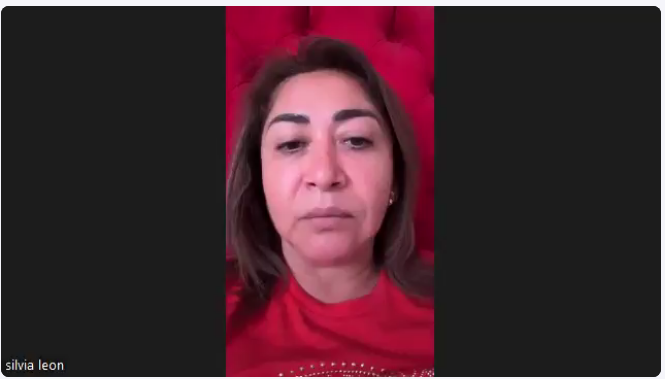
    </td>
  </tr>
  <tr>
    <td colspan="2">
      <b>Enlace:</b>
      <a href="https://upcedupe-my.sharepoint.com/:v:/g/personal/u20221c803_upc_edu_pe/IQBdvt-iNKPxSZQx1f7ZS8CyAYZ8WD_d_TT-VZfquEspVO8?nav=eyJyZWZlcnJhbEluZm8iOnsicmVmZXJyYWxBcHAiOiJTdHJlYW1XZWJBcHAiLCJyZWZlcnJhbFZpZXciOiJTaGFyZURpYWxvZy1MaW5rIiwicmVmZXJyYWxBcHBQbGF0Zm9ybSI6IldlYiIsInJlZmVycmFsTW9kZSI6InZpZXcifX0%3D&e=qMurqv">Link</a>
      <br><br>
      <b>Resumen:</b> Silvia leon, enfermera intensivista cardiovascular pediátrica con 25 años de experiencia en procesos clínicos cardiovasculares, comentó que uno de los principales problemas dentro del entorno hospitalario es la dificultad para acceder rápidamente a información clínica relevante debido a que esta se encuentra distribuida entre múltiples sistemas y registros. Resalto que desería no perder mucho tiempo y que ya es hora de una modernización tecnologica en su campo laboral por el bien de los pacientes.
      <br><br>
      Asimismo, señaló que los sistemas actuales están muy orientados a un registro manual con papel y lapicero, y no están optimizados para la rapidez operativa requerida durante los cambios de turno. También destacó la importancia de mejorar la comunicación entre equipos médicos y garantizar trazabilidad clara de la información clínica.
      <br><br>
      Finalmente, indicó que una solución tecnologica en dispositivos como computadoras o tablets mejorarían significativamente la eficiencia operativa dentro del área cardiovascular, incluso para trabajos de investigación.
    </td>
  </tr>
</table>

##### Segmento objetivo 2: Médicos especialistas cardiovasculares y profesionales médicos relacionados

###### Entrevista 1 — Luis Mendoza

<table border="1">
  <tr>
    <td>
      <b>Nombres y apellidos:</b> Luis Mendoza<br>
      <b>Edad:</b> 31 años<br>
      <b>Distrito:</b> San Anita<br>
      <b>Ocupación:</b> Cardiólogo intensivista<br>
      <b>Timing:</b> 17:35 - 25:35<br>
      <b>Duración:</b> 08:00
    </td>
    <td align="center">
      
    </td>
  </tr>
  <tr>
    <td colspan="2">
      <b>Enlace:</b>
      <a href="https://upcedupe-my.sharepoint.com/:v:/g/personal/u202217893_upc_edu_pe/IQDR_SdJ70vjR7DzCrIjJTj3AcYw3zJJ9isFESxUbn2yjmk?e=kAZghE&nav=eyJyZWZlcnJhbEluZm8iOnsicmVmZXJyYWxBcHAiOiJTdHJlYW1XZWJBcHAiLCJyZWZlcnJhbFZpZXciOiJTaGFyZURpYWxvZy1MaW5rIiwicmVmZXJyYWxBcHBQbGF0Zm9ybSI6IldlYiIsInJlZmVycmFsTW9kZSI6InZpZXcifX0%3D">Link</a>
      <br><br>
      <b>Resumen:</b> Luis Mendoza, cardiólogo intensivista con experiencia en UCI cardiovascular, indicó que uno de los principales problemas dentro del entorno hospitalario es la fragmentación de la información clínica entre distintos sistemas, registros físicos y comunicación verbal. Señaló que esta situación dificulta el acceso rápido a información crítica y puede generar retrasos durante la toma de decisiones médicas.
      <br><br>
      Asimismo, comentó que los sistemas hospitalarios actuales poseen demasiados módulos y pasos operativos, lo que afecta la rapidez del trabajo clínico. También resaltó que los cambios de turno representan un punto vulnerable debido a la falta de estandarización en la comunicación entre profesionales de salud. En ese sentido, considera que herramientas basadas en modelos estructurados como SBAR podrían mejorar significativamente la continuidad de atención.
      <br><br>
      Finalmente, destacó la importancia de contar con soluciones rápidas, intuitivas y con trazabilidad clínica clara. Desde su perspectiva, una herramienta especializada como PulseReport tendría valor si logra integrarse al flujo hospitalario real, reducir tiempos operativos y facilitar el acceso rápido a información relevante del paciente.
    </td>
  </tr>
</table>

###### Entrevista 2 — Renato Paredes

<table border="1">
  <tr>
    <td>
      <b>Nombres y apellidos:</b> Renato Paredes<br>
      <b>Edad:</b> 33 años<br>
      <b>Distrito:</b> San Miguel<br>
      <b>Ocupación:</b> Médico intensivista<br>
      <b>Timing:</b> 34:05 - 44:05<br>
      <b>Duración:</b> 11:00
    </td>
    <td align="center">
      
    </td>
  </tr>
  <tr>
    <td colspan="2">
      <b>Enlace:</b>
      <a href="https://upcedupe-my.sharepoint.com/:v:/g/personal/u202217893_upc_edu_pe/IQDR_SdJ70vjR7DzCrIjJTj3AcYw3zJJ9isFESxUbn2yjmk?e=kAZghE&nav=eyJyZWZlcnJhbEluZm8iOnsicmVmZXJyYWxBcHAiOiJTdHJlYW1XZWJBcHAiLCJyZWZlcnJhbFZpZXciOiJTaGFyZURpYWxvZy1MaW5rIiwicmVmZXJyYWxBcHBQbGF0Zm9ybSI6IldlYiIsInJlZmVycmFsTW9kZSI6InZpZXcifX0%3D">Link</a>
      <br><br>
      <b>Resumen:</b> Renato Paredes, médico intensivista con experiencia en UCI cardiovascular, comentó que uno de los principales problemas dentro del entorno hospitalario es la falta de integración entre sistemas clínicos y equipos biomédicos, lo que obliga al personal a realizar múltiples registros manuales y genera mayor carga operativa.
      <br><br>
      Asimismo, señaló que los sistemas actuales presentan lentitud, interfaces poco intuitivas y dificultades para visualizar rápidamente información crítica. También destacó la importancia de la trazabilidad clínica, la comunicación estructurada durante cambios de turno y el acceso móvil dentro de UCI cardiovascular.
      <br><br>
      Finalmente, indicó que una solución rápida, intuitiva y enfocada en integración automática de información podría mejorar significativamente la eficiencia operativa y reducir errores dentro del entorno clínico.
    </td>
  </tr>
</table>

###### Entrevista 3 — Mark Alex Esquivel Cabrera

<table border="1">
  <tr>
    <td>
      <b>Nombres y apellidos:</b> Mark Alex Esquivel Cabrera<br>
      <b>Edad:</b> 27 años<br>
      <b>Distrito:</b> Ate<br>
      <b>Ocupación:</b> Médico cirujano<br>
      <b>Timing:</b> Inicio en 01:06<br>
      <b>Duración:</b> 14:07
    </td>
    <td align="center">
      
    </td>
  </tr>
  <tr>
    <td colspan="2">
      <b>Enlace:</b>
      <a href="https://upcedupe-my.sharepoint.com/:v:/g/personal/u202417448_upc_edu_pe/IQDEg1dERgrVRq-XGS40DedPAaxPeYnZt8jHwLrCX1XHmEw?e=8ncHUd">Link</a>
      <br><br>
      <b>Resumen:</b> Mark Alex Esquivel Cabrera labora en un centro de salud rural con un sistema de registro doble. El personal primero anota datos generales, síntomas y códigos de enfermedades en hojas de papel. Luego, esa información se traslada a una hoja de cálculo básica para mantener un archivo de pacientes.
      <br><br>
      Este método genera pérdida de trazabilidad, dificultad para interpretar registros físicos y riesgo de información incompleta. El entrevistado mencionó que la letra de los doctores puede resultar ilegible, que algunos detalles pueden omitirse y que ciertos espacios quedan incompletos en las hojas, lo que complica el seguimiento médico del paciente.
      <br><br>
      Mark muestra disposición para probar una solución tecnológica nueva, siempre que sea segura y fácil de usar. También resaltó que una herramienta compleja podría generar rechazo en profesionales con menor familiaridad tecnológica, especialmente médicos de mayor edad, quienes podrían preferir mantener el uso de registros en papel u hojas de cálculo por costumbre.
    </td>
  </tr>
</table>

#### 2.2.3. Análisis de entrevistas

El análisis de entrevistas permite identificar patrones recurrentes, características objetivas, características subjetivas, necesidades operativas y oportunidades de mejora relacionadas con el dominio clínico de PulseReport.

Para evitar inconsistencias, esta versión del análisis considera únicamente las entrevistas registradas en la sección anterior. Por ello, el segmento de enfermería cardiovascular cuenta actualmente con una entrevista registrada, mientras que el segmento de médicos especialistas y profesionales médicos relacionados cuenta con cuatro entrevistas registradas.

##### Resumen de entrevistas analizadas

| Segmento                                                                    | Entrevistas analizadas                                   | Cantidad |
|-----------------------------------------------------------------------------|----------------------------------------------------------|----------|
| Personal de enfermería cardiovascular                                       | Andrea Salazar, Silvia León                              | 2        |
| Médicos especialistas cardiovasculares y profesionales médicos relacionados | Luis Mendoza, Renato Paredes, Mark Alex Esquivel Cabrera | 3        |
| **Total**                                                                   | —                                                        | **5**    |

##### Segmento objetivo 1: Personal de enfermería cardiovascular

###### Entrevista analizada

- Andrea Salazar

Total de entrevistas analizadas para el segmento: 1

###### Análisis de características objetivas

| Característica objetiva                                     | Evidencia identificada               | Porcentaje |
|-------------------------------------------------------------|--------------------------------------|------------|
| Experiencia en entorno cardiovascular o UCI cardiovascular  | Presente en la entrevista registrada | 100%       |
| Uso de sistemas digitales hospitalarios                     | Presente en la entrevista registrada | 100%       |
| Uso complementario de anotaciones o registros físicos       | Presente en la entrevista registrada | 100%       |
| Participación en procesos de cambio de turno                | Presente en la entrevista registrada | 100%       |
| Necesidad de registrar información clínica durante el turno | Presente en la entrevista registrada | 100%       |
| Familiaridad con herramientas digitales                     | Presente en la entrevista registrada | 100%       |

###### Análisis de características subjetivas

| Característica subjetiva                                           | Evidencia identificada               | Porcentaje |
|--------------------------------------------------------------------|--------------------------------------|------------|
| Frustración por complejidad de sistemas actuales                   | Presente en la entrevista registrada | 100%       |
| Necesidad de rapidez operativa                                     | Presente en la entrevista registrada | 100%       |
| Preocupación por pérdida u omisión de información                  | Presente en la entrevista registrada | 100%       |
| Interés por comunicación estructurada mediante SBAR                | Presente en la entrevista registrada | 100%       |
| Preferencia por una herramienta intuitiva y adaptada al flujo real | Presente en la entrevista registrada | 100%       |
| Valoración de acceso móvil o registro rápido                       | Presente en la entrevista registrada | 100%       |

###### Interpretación del segmento

La entrevista realizada al segmento de enfermería cardiovascular evidencia que el registro clínico y la comunicación entre turnos son actividades críticas dentro del flujo operativo. La entrevistada señaló que los sistemas actuales pueden requerir demasiados pasos, lo que genera fricción durante situaciones clínicas de alta presión.

También se identificó que el uso de anotaciones físicas funciona como apoyo temporal cuando el sistema digital no responde al ritmo del trabajo clínico. Sin embargo, esta práctica puede generar duplicidad, omisiones y pérdida parcial de información. Esto confirma la importancia de una solución que reduzca la carga operativa y permita registrar información de manera rápida y estructurada.

El cambio de turno aparece como un momento especialmente vulnerable, ya que la información puede transmitirse de forma desordenada o incompleta. Por ello, PulseReport debe priorizar flujos de traspaso estructurado mediante SBAR, registro rápido de información clínica y trazabilidad de eventos relevantes.

##### Segmento objetivo 2: Médicos especialistas cardiovasculares y profesionales médicos relacionados

###### Entrevistas analizadas

- Luis Mendoza
- Jorge Ramírez
- Renato Paredes
- Mark Alex Esquivel Cabrera

Total de entrevistas analizadas para el segmento: 4

###### Análisis de características objetivas

| Característica objetiva                                                          | Evidencia identificada         | Porcentaje |
|----------------------------------------------------------------------------------|--------------------------------|------------|
| Profesionales médicos entrevistados                                              | Presente en las 4 entrevistas  | 100%       |
| Experiencia en atención clínica o procesos médicos                               | Presente en las 4 entrevistas  | 100%       |
| Relación directa con áreas cardiovasculares, intensivas o cirugía cardiovascular | Presente en 3 de 4 entrevistas | 75%        |
| Uso de sistemas digitales, registros físicos u hojas de cálculo                  | Presente en las 4 entrevistas  | 100%       |
| Participación en consulta, validación o seguimiento de información clínica       | Presente en las 4 entrevistas  | 100%       |
| Identificación de problemas de trazabilidad                                      | Presente en las 4 entrevistas  | 100%       |
| Necesidad de información clínica organizada                                      | Presente en las 4 entrevistas  | 100%       |

###### Análisis de características subjetivas

| Característica subjetiva                                   | Evidencia identificada         | Porcentaje |
|------------------------------------------------------------|--------------------------------|------------|
| Frustración por información clínica fragmentada            | Presente en las 4 entrevistas  | 100%       |
| Necesidad de acceso rápido a información relevante         | Presente en 3 de 4 entrevistas | 75%        |
| Importancia de trazabilidad clínica                        | Presente en las 4 entrevistas  | 100%       |
| Rechazo a herramientas complejas o lentas                  | Presente en las 4 entrevistas  | 100%       |
| Interés por soluciones digitales simples y seguras         | Presente en las 4 entrevistas  | 100%       |
| Necesidad de comunicación estructurada entre profesionales | Presente en 3 de 4 entrevistas | 75%        |
| Interés por dashboards, alertas o visualización resumida   | Presente en 3 de 4 entrevistas | 75%        |

###### Interpretación del segmento

El análisis de entrevistas del segmento médico evidencia que uno de los principales problemas es la fragmentación de la información clínica. Los entrevistados señalaron que los datos del paciente pueden encontrarse en sistemas hospitalarios, registros físicos, hojas de cálculo, equipos biomédicos o comunicación verbal, lo que dificulta la consulta rápida y confiable.

También se identificó una preocupación recurrente por la trazabilidad. Los entrevistados resaltan la importancia de conocer quién registró determinada información, cuándo ocurrió un evento y qué datos fueron modificados o completados. Este hallazgo se relaciona directamente con la necesidad de auditoría clínica, continuidad de atención y seguridad del paciente.

Otro patrón importante es el rechazo a herramientas excesivamente complejas. Los entrevistados valoran soluciones digitales siempre que sean simples, seguras, rápidas y alineadas al flujo real del trabajo clínico. Esto confirma que PulseReport no debe aumentar la carga administrativa, sino reducir pasos operativos y facilitar el acceso a información relevante.

En el caso de los profesionales vinculados a UCI o áreas cardiovasculares, se evidencia interés por dashboards resumidos, alertas visuales y acceso rápido a información crítica. En el caso del médico cirujano entrevistado, se refuerza la problemática de trazabilidad en contextos donde todavía se utilizan registros físicos y hojas de cálculo básicas.

##### Comparación entre segmentos

| Hallazgo                         | Personal de enfermería cardiovascular                        | Médicos especialistas y profesionales médicos relacionados         | Implicancia para PulseReport                                 |
|----------------------------------|--------------------------------------------------------------|--------------------------------------------------------------------|--------------------------------------------------------------|
| Registro de información clínica  | Alta necesidad de registrar durante el turno.                | Necesidad de consultar y validar información registrada.           | El sistema debe soportar registro rápido y consulta clara.   |
| Comunicación entre turnos        | Punto crítico para evitar omisiones.                         | Relevante para validar información antes de decidir.               | Se debe incorporar estructura SBAR.                          |
| Información fragmentada          | Aparece como causa de duplicidad y uso de apuntes físicos.   | Aparece como causa de retrasos y dificultad para tomar decisiones. | PulseReport debe centralizar información relevante.          |
| Trazabilidad                     | Necesaria para identificar responsables y eventos del turno. | Necesaria para validar decisiones, eventos y registros.            | Se debe registrar responsable, fecha, hora y tipo de acción. |
| Complejidad de sistemas actuales | Genera carga operativa durante situaciones críticas.         | Genera demora al consultar información.                            | La experiencia debe ser simple, rápida y con pocos pasos.    |
| Apertura a solución digital      | Existe interés si reduce carga y facilita el trabajo.        | Existe interés si es segura, intuitiva y útil.                     | El MVP debe priorizar valor operativo real.                  |

##### Conclusiones generales del análisis

Las entrevistas realizadas permiten identificar patrones comunes entre los segmentos analizados. Ambos grupos evidencian dificultades relacionadas con sistemas complejos, información dispersa, registros físicos complementarios, comunicación no estructurada y necesidad de trazabilidad clínica.

En el caso del personal de enfermería cardiovascular, la prioridad se concentra en registrar información de forma rápida, reducir duplicidad y comunicar adecuadamente la información durante cambios de turno. En el caso de médicos especialistas y profesionales médicos relacionados, la prioridad se enfoca en consultar información consolidada, validar trazabilidad y tomar decisiones con datos confiables.

Los hallazgos obtenidos validan la necesidad de una solución como PulseReport, enfocada en:

- Registro clínico rápido.
- Comunicación estructurada mediante SBAR.
- Centralización de información relevante del paciente.
- Trazabilidad de eventos, responsables y horarios.
- Visualización resumida de información clínica.
- Reducción de carga operativa.
- Diseño simple, seguro y adaptable al flujo real de trabajo clínico.

Estos resultados servirán como base para la construcción de User Personas, User Task Matrix, User Journey Mapping, Empathy Mapping y requisitos del producto.

### 2.3. Needfinding

La presente sección desarrolla los artefactos de Needfinding del proyecto PulseReport. Estos artefactos permiten transformar los hallazgos obtenidos en entrevistas, análisis competitivo y definición de segmentos objetivo en representaciones más claras de los usuarios, sus tareas, recorridos, emociones, frustraciones y oportunidades de mejora.

El propósito de esta sección es comprender con mayor profundidad cómo trabajan actualmente los usuarios dentro del entorno clínico cardiovascular, qué problemas enfrentan y qué necesidades deben ser consideradas en el diseño de la solución.

Los artefactos desarrollados en esta sección son:

| Artefacto                | Propósito                                                                                          |
|--------------------------|----------------------------------------------------------------------------------------------------|
| **User Personas**        | Representar arquetipos de usuarios basados en los segmentos objetivo y hallazgos de entrevistas.   |
| **User Task Matrix**     | Identificar tareas reales, frecuencia e importancia para cada User Persona.                        |
| **User Journey Mapping** | Representar el recorrido actual As-Is de los usuarios antes de utilizar PulseReport.               |
| **Empathy Mapping**      | Comprender lo que los usuarios piensan, sienten, ven, escuchan, dicen, hacen, necesitan y esperan. |

#### 2.3.1. User Personas

La presente sección desarrolla los User Personas del proyecto PulseReport. Estos arquetipos fueron elaborados a partir de los segmentos objetivo definidos, el análisis de entrevistas disponible y la comprensión del dominio clínico cardiovascular.

Es importante precisar que los User Personas no representan entrevistados reales de manera literal, sino perfiles sintéticos construidos para representar patrones, necesidades y comportamientos recurrentes de los usuarios objetivo. Por ello, los nombres utilizados corresponden a arquetipos de diseño.

Los User Personas permiten orientar las decisiones posteriores de requisitos, diseño de experiencia de usuario, arquitectura de información y priorización del producto. Para su construcción se consideran características objetivas, como rol, edad aproximada, experiencia, área de trabajo y herramientas utilizadas; y características subjetivas, como motivaciones, frustraciones, objetivos, necesidades y actitud frente a la tecnología.

En este proyecto se consideran dos User Personas principales:

| User Persona             | Segmento objetivo                     | Descripción                                                                                                                                              |
|--------------------------|---------------------------------------|----------------------------------------------------------------------------------------------------------------------------------------------------------|
| **Daniela Ríos**         | Personal de enfermería cardiovascular | Representa al personal encargado del registro clínico, monitoreo del paciente, administración de medicamentos y comunicación durante cambios de turno.   |
| **Dr. Alejandro Torres** | Médico especialista cardiovascular    | Representa al profesional médico que consulta, valida e interpreta información clínica para tomar decisiones oportunas sobre pacientes cardiovasculares. |

##### User Persona 1 — Daniela Ríos

Daniela Ríos representa al personal de enfermería cardiovascular que trabaja en entornos clínicos de alta presión, como UCI cardiovascular, hospitalización o emergencia. Sus tareas principales se relacionan con el monitoreo de pacientes, registro de signos vitales, administración de medicamentos, documentación de eventos clínicos y entrega de información durante cambios de turno.

Este perfil evidencia la necesidad de contar con herramientas rápidas, claras y de baja carga operativa, debido a que el personal de enfermería debe registrar información mientras atiende directamente al paciente. Sus principales frustraciones se relacionan con la duplicidad de registros, sistemas lentos, comunicación desordenada y riesgo de omisiones durante el cambio de turno.

<p align="center">
  
</p>

##### User Persona 2 — Dr. Alejandro Torres

El Dr. Alejandro Torres representa a médicos especialistas cardiovasculares o profesionales médicos relacionados con la evaluación, seguimiento y toma de decisiones clínicas. Su trabajo requiere consultar información actualizada del paciente, validar eventos relevantes, revisar indicaciones, interpretar evolución clínica y coordinar acciones con el personal de enfermería.

Este perfil evidencia la necesidad de acceder rápidamente a información consolidada, confiable y trazable. Sus principales frustraciones están relacionadas con la información fragmentada, sistemas hospitalarios complejos, registros físicos complementarios y dificultad para reconstruir la evolución reciente del paciente.

<p align="center">
  
</p>

##### Conclusión de User Personas

Los User Personas definidos permiten representar los dos flujos principales del dominio de PulseReport. Daniela Ríos concentra necesidades relacionadas con registro rápido, comunicación estructurada y reducción de carga operativa. El Dr. Alejandro Torres concentra necesidades relacionadas con consulta de información, validación clínica, trazabilidad y soporte a la toma de decisiones.

Ambos perfiles confirman que PulseReport debe priorizar una experiencia simple, trazable y orientada a la continuidad de atención cardiovascular.

#### 2.3.2. User Task Matrix

La presente sección desarrolla el User Task Matrix del proyecto PulseReport. Este artefacto permite organizar y comparar las principales tareas que realizan los User Personas dentro del entorno cardiovascular hospitalario para cumplir sus objetivos profesionales.

El análisis se basa en los hallazgos obtenidos en entrevistas, User Personas y comprensión del dominio clínico. Su finalidad es identificar cuáles son las tareas más frecuentes e importantes para cada segmento objetivo, con el propósito de orientar posteriormente la priorización de requerimientos del sistema.

Es importante precisar que las tareas incluidas en esta matriz no representan botones, pantallas, módulos ni funcionalidades de PulseReport. Las tareas corresponden a actividades reales que los usuarios ya realizan actualmente dentro de su flujo laboral, independientemente de la existencia de la solución.

Los User Personas considerados son:

| User Persona         | Segmento objetivo                     |
|----------------------|---------------------------------------|
| Daniela Ríos         | Personal de enfermería cardiovascular |
| Dr. Alejandro Torres | Médico especialista cardiovascular    |

Para cada tarea se evalúan dos criterios:

| Criterio        | Descripción                                                                                                                   |
|-----------------|-------------------------------------------------------------------------------------------------------------------------------|
| **Frecuencia**  | Qué tan seguido realiza el User Persona dicha tarea dentro de su jornada laboral.                                             |
| **Importancia** | Nivel de impacto que tiene la tarea en la continuidad clínica, seguridad del paciente y cumplimiento del trabajo profesional. |

##### User Task Matrix — PulseReport

| Tarea identificada                                           | Daniela Ríos — Frecuencia | Daniela Ríos — Importancia | Dr. Alejandro Torres — Frecuencia | Dr. Alejandro Torres — Importancia |
|--------------------------------------------------------------|--------------------------:|---------------------------:|----------------------------------:|-----------------------------------:|
| Registrar signos vitales del paciente                        |                  Muy alta |                    Crítica |                             Media |                               Alta |
| Registrar administración de medicamentos                     |                  Muy alta |                    Crítica |                              Baja |                               Alta |
| Consultar evolución clínica reciente del paciente            |                      Alta |                    Crítica |                          Muy alta |                            Crítica |
| Comunicar información relevante durante cambio de turno      |                  Muy alta |                    Crítica |                              Alta |                            Crítica |
| Revisar indicaciones médicas actualizadas                    |                      Alta |                    Crítica |                          Muy alta |                            Crítica |
| Reportar eventos clínicos relevantes del paciente            |                      Alta |                    Crítica |                              Alta |                            Crítica |
| Confirmar evolución y registros previos del paciente         |                     Media |                       Alta |                              Alta |                            Crítica |
| Coordinar acciones clínicas con otros profesionales de salud |                      Alta |                       Alta |                              Alta |                            Crítica |
| Priorizar pacientes según su estado clínico                  |                      Alta |                    Crítica |                              Alta |                            Crítica |
| Reunir información clínica desde diferentes fuentes          |                      Alta |                       Alta |                          Muy alta |                            Crítica |
| Validar información registrada por otros miembros del equipo |                     Media |                       Alta |                              Alta |                               Alta |
| Identificar cambios críticos en el estado del paciente       |                      Alta |                    Crítica |                          Muy alta |                            Crítica |
| Preparar información para rondas o evaluación médica         |                     Media |                       Alta |                              Alta |                               Alta |
| Actualizar información clínica luego de una intervención     |                      Alta |                    Crítica |                             Media |                               Alta |
| Consultar reportes físicos o registros complementarios       |                      Alta |                      Media |                             Media |                              Media |
| Completar información pendiente después de una emergencia    |                      Alta |                       Alta |                              Baja |                              Media |
| Revisar balance general del paciente                         |                     Media |                       Alta |                              Alta |                            Crítica |
| Confirmar cumplimiento de indicaciones clínicas              |                      Alta |                    Crítica |                              Alta |                            Crítica |

##### Tareas con mayor frecuencia e importancia

A partir del User Task Matrix se identifican tareas que presentan alta frecuencia e importancia crítica para ambos segmentos objetivo. Estas tareas representan actividades esenciales dentro del flujo clínico cardiovascular, debido a que tienen impacto directo en la seguridad del paciente, la continuidad de atención y la coordinación entre profesionales de salud.

| Tarea crítica                                           | Justificación                                                                              |
|---------------------------------------------------------|--------------------------------------------------------------------------------------------|
| Consultar evolución clínica reciente del paciente       | Permite comprender rápidamente el estado actual del paciente y tomar decisiones adecuadas. |
| Comunicar información relevante durante cambio de turno | Reduce el riesgo de pérdida de información entre equipos clínicos.                         |
| Revisar indicaciones médicas actualizadas               | Permite ejecutar tratamientos correctamente y evitar acciones desactualizadas.             |
| Reportar eventos clínicos relevantes del paciente       | Facilita el seguimiento de situaciones críticas y mejora la trazabilidad del caso.         |
| Identificar cambios críticos en el estado del paciente  | Permite responder oportunamente ante deterioros clínicos.                                  |
| Confirmar cumplimiento de indicaciones clínicas         | Reduce riesgos asociados a omisiones, duplicidad de acciones o errores de coordinación.    |

##### Tareas más relevantes para Daniela Ríos

Daniela Ríos representa al personal de enfermería cardiovascular. Sus tareas se concentran principalmente en el registro, monitoreo, ejecución de indicaciones y comunicación operativa durante el turno.

| Tarea                                                     | Frecuencia | Importancia |
|-----------------------------------------------------------|-----------:|------------:|
| Registrar signos vitales del paciente                     |   Muy alta |     Crítica |
| Registrar administración de medicamentos                  |   Muy alta |     Crítica |
| Comunicar información relevante durante cambio de turno   |   Muy alta |     Crítica |
| Actualizar información clínica luego de una intervención  |       Alta |     Crítica |
| Confirmar cumplimiento de indicaciones clínicas           |       Alta |     Crítica |
| Completar información pendiente después de una emergencia |       Alta |        Alta |
| Consultar reportes físicos o registros complementarios    |       Alta |       Media |

El perfil de Daniela evidencia que el personal de enfermería cardiovascular realiza tareas operativas de alta frecuencia y alta precisión. El registro de signos vitales, administración de medicamentos y actualización de información clínica son actividades recurrentes que deben ejecutarse con rapidez para mantener continuidad en la atención del paciente.

También se identifica que la comunicación durante cambios de turno es una tarea crítica, ya que representa un punto vulnerable donde puede perderse información relevante. Esta situación confirma la necesidad de estructurar mejor la transferencia de información clínica entre equipos.

Desde la perspectiva de requerimientos, PulseReport debe priorizar flujos que permitan registrar información de forma rápida, estructurada y con mínima carga cognitiva para el personal de enfermería.

##### Tareas más relevantes para Dr. Alejandro Torres

El Dr. Alejandro Torres representa a médicos especialistas cardiovasculares. Sus tareas se enfocan principalmente en consultar, interpretar, validar y utilizar información clínica para la toma de decisiones médicas.

| Tarea                                                        | Frecuencia | Importancia |
|--------------------------------------------------------------|-----------:|------------:|
| Consultar evolución clínica reciente del paciente            |   Muy alta |     Crítica |
| Revisar indicaciones médicas actualizadas                    |   Muy alta |     Crítica |
| Reunir información clínica desde diferentes fuentes          |   Muy alta |     Crítica |
| Identificar cambios críticos en el estado del paciente       |   Muy alta |     Crítica |
| Confirmar evolución y registros previos del paciente         |       Alta |     Crítica |
| Revisar balance general del paciente                         |       Alta |     Crítica |
| Coordinar acciones clínicas con otros profesionales de salud |       Alta |     Crítica |

El perfil del Dr. Alejandro evidencia que los médicos especialistas cardiovasculares requieren información centralizada, precisa y disponible de forma inmediata. A diferencia del personal de enfermería, sus tareas no se concentran principalmente en registrar información, sino en revisarla, interpretarla y tomar decisiones clínicas a partir de ella.

La tarea de reunir información clínica desde diferentes fuentes aparece como una de las más frecuentes e importantes. Esto evidencia un problema relevante identificado en las entrevistas: la información del paciente suele encontrarse dispersa entre sistemas hospitalarios, reportes físicos, comunicación verbal y registros complementarios.

Desde la perspectiva de requerimientos, PulseReport debe priorizar vistas clínicas resumidas, acceso rápido a información relevante y mecanismos de trazabilidad que permitan validar la evolución del paciente de manera eficiente.

##### Coincidencias entre ambos User Personas

| Coincidencia identificada                                 | Explicación                                                                                    | Implicancia para PulseReport                                               |
|-----------------------------------------------------------|------------------------------------------------------------------------------------------------|----------------------------------------------------------------------------|
| Ambos necesitan acceder rápidamente a información clínica | Tanto enfermería como médicos dependen de información actualizada para cumplir sus tareas.     | El sistema debe priorizar navegación simple y visualización resumida.      |
| Ambos participan en continuidad de atención               | Ambos perfiles intervienen en procesos de cambio de turno, seguimiento y coordinación clínica. | Debe incorporarse comunicación estructurada mediante SBAR.                 |
| Ambos requieren trazabilidad de información               | Necesitan conocer qué ocurrió, cuándo ocurrió y quién registró determinada información.        | El sistema debe registrar responsables, horarios y cambios relevantes.     |
| Ambos enfrentan información dispersa                      | Las entrevistas evidencian uso de sistemas, registros físicos y comunicación verbal.           | PulseReport debe centralizar datos relevantes del paciente.                |
| Ambos rechazan procesos complejos                         | Los usuarios priorizan rapidez y simplicidad en contextos clínicos.                            | La interfaz debe reducir pasos operativos y carga cognitiva.               |
| Ambos trabajan bajo presión clínica                       | Las tareas se realizan en contextos donde el tiempo tiene impacto directo en la atención.      | El sistema debe estar optimizado para rapidez, claridad y mínima fricción. |

##### Diferencias entre ambos User Personas

| Diferencia                      | Daniela Ríos                                   | Dr. Alejandro Torres                      | Implicancia para PulseReport                                                       |
|---------------------------------|------------------------------------------------|-------------------------------------------|------------------------------------------------------------------------------------|
| Tipo de tarea principal         | Registro, ejecución y comunicación operativa   | Consulta, análisis y decisión clínica     | Se requieren flujos diferenciados según rol.                                       |
| Frecuencia de registro          | Muy alta                                       | Media o baja                              | El flujo de enfermería debe minimizar pasos para ingresar datos.                   |
| Uso principal de la información | Registrar y comunicar información clínica      | Interpretar y validar información clínica | El sistema debe incluir tanto registro rápido como visualización clínica resumida. |
| Riesgo principal                | Omisión o retraso en registro clínico          | Decisión con información incompleta       | Se requieren alertas, trazabilidad y centralización de información.                |
| Momento crítico                 | Cambio de turno y atención directa al paciente | Evaluación clínica y toma de decisiones   | El sistema debe soportar continuidad y análisis clínico.                           |
| Necesidad dominante             | Agilidad operativa                             | Acceso rápido a información consolidada   | Deben existir vistas y prioridades adaptadas a cada perfil.                        |

##### Conclusión del User Task Matrix

El User Task Matrix evidencia que las tareas más importantes dentro del entorno cardiovascular hospitalario están relacionadas con registro clínico, consulta rápida de información, comunicación entre turnos, trazabilidad médica y seguimiento de eventos críticos.

Para el personal de enfermería cardiovascular, las tareas prioritarias se concentran en registrar, actualizar y comunicar información clínica de forma rápida y precisa. Para los médicos especialistas cardiovasculares, las tareas prioritarias se enfocan en acceder, interpretar y validar información crítica para la toma de decisiones.

A partir de este análisis, PulseReport debe priorizar funcionalidades orientadas a:

- Registro clínico rápido.
- Comunicación estructurada mediante SBAR.
- Visualización resumida de evolución clínica.
- Centralización de información del paciente.
- Trazabilidad de eventos clínicos.
- Reducción de pasos operativos.
- Soporte a la toma de decisiones clínicas.

#### 2.3.3. User Journey Mapping

La presente sección desarrolla los User Journey Maps As-Is del proyecto PulseReport. Estos artefactos representan el recorrido actual que realizan los User Personas dentro del entorno cardiovascular hospitalario antes de la implementación de la solución propuesta.

Los Journey Maps se elaboran a partir de los hallazgos obtenidos en entrevistas, análisis de entrevistas, User Personas y User Task Matrix. Su propósito es comprender cómo los usuarios realizan actualmente sus actividades, qué puntos de contacto utilizan, qué emociones experimentan, qué dificultades enfrentan y qué oportunidades de mejora pueden ser consideradas posteriormente en el diseño del sistema.

Cada mapa representa un recorrido end-to-end, desde el inicio hasta el cierre de una actividad clínica relevante. En este caso, se desarrollan dos User Journey Maps As-Is:

| User Persona         | Segmento objetivo                     | Journey Map As-Is                                                                                   |
|----------------------|---------------------------------------|-----------------------------------------------------------------------------------------------------|
| Daniela Ríos         | Personal de enfermería cardiovascular | Desde la recepción del turno hasta la entrega de información al siguiente equipo.                   |
| Dr. Alejandro Torres | Médico especialista cardiovascular    | Desde la identificación de un paciente crítico hasta la toma y seguimiento de una decisión clínica. |

##### User Journey Map 1 — Daniela Ríos

| Campo                 | Información                                                                       |
|-----------------------|-----------------------------------------------------------------------------------|
| **User Persona**      | Daniela Ríos                                                                      |
| **Segmento objetivo** | Personal de enfermería cardiovascular                                             |
| **Rol**               | Enfermera cardiovascular                                                          |
| **Área**              | UCI cardiovascular                                                                |
| **Journey As-Is**     | Desde la recepción del turno hasta la entrega de información al siguiente equipo. |

**Escenario As-Is:**  
Daniela inicia su turno en UCI cardiovascular. Debe recibir información del equipo anterior, revisar el estado de sus pacientes, monitorear signos vitales, administrar medicamentos, registrar eventos clínicos y finalmente entregar información clara y completa al siguiente turno.

Actualmente, estas actividades se realizan mediante sistemas hospitalarios complejos, computadoras fijas, registros físicos complementarios y comunicación verbal. El proceso presenta dificultades relacionadas con dispersión de información, duplicidad de registros, exceso de pasos operativos y falta de comunicación estructurada.

**Objetivo del Journey:**  
Identificar las dificultades actuales que enfrenta el personal de enfermería cardiovascular durante el monitoreo, registro clínico y transferencia de información entre turnos, con la finalidad de detectar oportunidades de mejora relacionadas con rapidez operativa, comunicación estructurada y trazabilidad.

<p align="center">
  
</p>

**Resumen del Journey — Daniela Ríos:**  
El recorrido de Daniela evidencia que el personal de enfermería cardiovascular enfrenta una alta carga operativa al combinar atención directa al paciente con monitoreo y documentación clínica. Los principales puntos de fricción aparecen durante el registro de información, la atención de eventos críticos, la regularización posterior de datos y la entrega de turno.

Asimismo, se observa que los registros físicos complementarios surgen como una solución informal frente a la lentitud del sistema, pero generan duplicidad, riesgo de error y mayor carga cognitiva. El cambio de turno también representa un momento vulnerable por la falta de una estructura uniforme en la comunicación.

##### User Journey Map 2 — Dr. Alejandro Torres

| Campo                 | Información                                                                                         |
|-----------------------|-----------------------------------------------------------------------------------------------------|
| **User Persona**      | Dr. Alejandro Torres                                                                                |
| **Segmento objetivo** | Médico especialista cardiovascular                                                                  |
| **Rol**               | Cardiólogo intensivista                                                                             |
| **Área**              | UCI cardiovascular                                                                                  |
| **Journey As-Is**     | Desde la identificación de un paciente crítico hasta la toma y seguimiento de una decisión clínica. |

**Escenario As-Is:**  
El Dr. Alejandro Torres debe identificar pacientes críticos, consultar su evolución reciente, revisar signos vitales, validar medicamentos administrados, confirmar indicaciones, coordinar con enfermería y tomar decisiones clínicas oportunas.

Actualmente, la información del paciente se encuentra distribuida entre sistemas hospitalarios, reportes físicos, monitores biomédicos y comunicación verbal, lo que dificulta el acceso rápido a información crítica y retrasa la toma de decisiones.

**Objetivo del Journey:**  
Identificar las dificultades actuales que enfrenta el médico especialista cardiovascular al consultar, validar e interpretar información clínica para tomar decisiones médicas oportunas y seguras.

<p align="center">
  
</p>

**Resumen del Journey — Dr. Alejandro Torres:**  
El recorrido del Dr. Alejandro evidencia que los médicos especialistas cardiovasculares enfrentan principalmente dificultades relacionadas con la fragmentación de información, la lentitud para consultar datos clínicos y la falta de visualización rápida de la evolución del paciente.

A diferencia del personal de enfermería, su recorrido se concentra menos en registrar información y más en consultarla, interpretarla y validarla para tomar decisiones clínicas. Sin embargo, la dispersión de datos entre sistemas, reportes físicos, monitores y comunicación verbal incrementa el tiempo de análisis y el riesgo de decidir con información incompleta.

##### Comparación entre User Journey Maps

| Aspecto                         | Daniela Ríos                                 | Dr. Alejandro Torres                                 | Implicancia para PulseReport                                       |
|---------------------------------|----------------------------------------------|------------------------------------------------------|--------------------------------------------------------------------|
| Enfoque principal del recorrido | Registro, monitoreo y comunicación operativa | Consulta, validación y toma de decisiones            | Se requieren flujos diferenciados según rol.                       |
| Momento más crítico             | Evento clínico y cambio de turno             | Identificación de cambios críticos y decisión médica | El sistema debe priorizar rapidez y claridad en momentos críticos. |
| Principal fuente de frustración | Exceso de pasos y duplicidad de registros    | Información dispersa y difícil de consolidar         | PulseReport debe reducir fricción operativa y centralizar datos.   |
| Riesgo principal                | Omisión o registro tardío                    | Decisión con información incompleta                  | Se requiere trazabilidad y visualización resumida.                 |
| Necesidad dominante             | Registro rápido y comunicación estructurada  | Acceso rápido a información consolidada              | Deben existir vistas adaptadas a cada perfil.                      |

##### Conclusión del User Journey Mapping

Los User Journey Maps As-Is evidencian que los principales problemas del flujo actual dentro del entorno cardiovascular hospitalario se relacionan con dispersión de información, documentación compleja, comunicación no estructurada y dificultad para reconstruir trazabilidad clínica.

En el caso de Daniela Ríos, las mayores fricciones aparecen durante el registro clínico, la atención de eventos críticos y la entrega de turno. En el caso del Dr. Alejandro Torres, los principales problemas se concentran en la búsqueda, validación e interpretación de información clínica para la toma de decisiones.

Estos hallazgos refuerzan la necesidad de que PulseReport priorice:

- Registro clínico rápido.
- Comunicación estructurada mediante SBAR.
- Centralización de información clínica.
- Visualización resumida de evolución del paciente.
- Trazabilidad de eventos, responsables y horarios.

#### 2.3.4. Empathy Mapping

La presente sección desarrolla los Empathy Maps correspondientes a los User Personas definidos para el proyecto PulseReport. Este artefacto permite comprender de manera más profunda el contexto, necesidades, emociones, frustraciones, comportamientos y expectativas de los usuarios dentro del entorno cardiovascular hospitalario.

El proceso de elaboración consistió en colocar a cada User Persona en el centro del análisis y organizar la información obtenida en entrevistas, User Personas, User Task Matrix y User Journey Maps As-Is. A partir de estos insumos, se identificó qué piensa y siente cada usuario, qué observa en su entorno, qué escucha de otros actores, qué dice y hace durante su trabajo, cuáles son sus principales pains y qué gains podrían ayudarlo a resolver sus problemas.

Los Empathy Maps desarrollados corresponden a los dos User Personas del proyecto:

| User Persona         | Segmento objetivo                     | Propósito del Empathy Map                                                                                                      |
|----------------------|---------------------------------------|--------------------------------------------------------------------------------------------------------------------------------|
| Daniela Ríos         | Personal de enfermería cardiovascular | Comprender sus necesidades durante el registro clínico, monitoreo de pacientes y cambio de turno.                              |
| Dr. Alejandro Torres | Médico especialista cardiovascular    | Comprender sus necesidades durante la consulta, validación e interpretación de información clínica para la toma de decisiones. |

##### Empathy Map 1 — Daniela Ríos

###### ¿Con quién estamos empatizando?

| Campo                  | Información                                                                                |
|------------------------|--------------------------------------------------------------------------------------------|
| **User Persona**       | Daniela Ríos                                                                               |
| **Segmento objetivo**  | Personal de enfermería cardiovascular                                                      |
| **Rol**                | Enfermera cardiovascular                                                                   |
| **Área**               | UCI cardiovascular                                                                         |
| **Nivel tecnológico**  | Intermedio – Alto                                                                          |
| **Contexto principal** | Registro clínico, monitoreo de pacientes críticos y comunicación durante cambios de turno. |

Daniela representa al personal de enfermería cardiovascular que trabaja bajo presión operativa constante. Debe monitorear pacientes críticos, administrar medicamentos, registrar información clínica y transferir datos relevantes al siguiente turno sin omitir información importante.

###### ¿Qué necesita hacer?

- Registrar información clínica de manera rápida y precisa.
- Monitorear constantemente a pacientes cardiovasculares críticos.
- Administrar medicamentos y dejar constancia clara de horarios e indicaciones.
- Comunicar información importante al siguiente turno sin omitir detalles.
- Reducir la duplicidad entre registros físicos y digitales.
- Mantener trazabilidad sobre signos vitales, medicamentos y eventos clínicos.
- Cumplir responsabilidades clínicas sin aumentar carga administrativa.

<p align="center">
  
</p>

###### ¿Qué puede convencerla de que PulseReport es la alternativa correcta?

- Que permita registrar información clínica más rápido.
- Que reduzca la duplicidad entre papel y sistema digital.
- Que facilite el cambio de turno mediante una estructura clara como SBAR.
- Que no agregue más carga operativa.
- Que sea simple de usar durante situaciones críticas.
- Que ayude a evitar omisiones de información importante.
- Que permita acceder a información relevante sin depender siempre de una computadora fija.

##### Empathy Map 2 — Dr. Alejandro Torres

###### ¿Con quién estamos empatizando?

| Campo                  | Información                                                                           |
|------------------------|---------------------------------------------------------------------------------------|
| **User Persona**       | Dr. Alejandro Torres                                                                  |
| **Segmento objetivo**  | Médico especialista cardiovascular                                                    |
| **Rol**                | Cardiólogo intensivista                                                               |
| **Área**               | UCI cardiovascular                                                                    |
| **Nivel tecnológico**  | Alto                                                                                  |
| **Contexto principal** | Consulta, validación e interpretación de información clínica para toma de decisiones. |

El Dr. Alejandro Torres representa a médicos especialistas que necesitan consultar información crítica del paciente de manera rápida, confiable y trazable. Su principal responsabilidad es interpretar datos clínicos para tomar decisiones oportunas y coordinar acciones con otros profesionales de salud.

###### ¿Qué necesita hacer?

- Acceder rápidamente a información clínica crítica.
- Revisar la evolución reciente del paciente.
- Validar signos vitales, medicamentos e indicaciones.
- Confirmar información relevante con enfermería.
- Identificar cambios críticos en el estado del paciente.
- Tomar decisiones clínicas con información completa y confiable.
- Revisar trazabilidad de eventos, responsables y horarios.
- Coordinar indicaciones con el equipo clínico.

<p align="center">
  
</p>

###### ¿Qué puede convencerlo de que PulseReport es la alternativa correcta?

- Que centralice la información clínica relevante.
- Que reduzca el tiempo de búsqueda entre sistemas y reportes.
- Que muestre rápidamente la evolución reciente del paciente.
- Que permita validar trazabilidad de eventos, responsables y horarios.
- Que facilite comunicación estructurada con enfermería.
- Que no incremente la carga administrativa.
- Que reduzca el riesgo de tomar decisiones con información incompleta.
- Que sea rápido, seguro e intuitivo.

##### Conclusión del Empathy Mapping

Los Empathy Maps evidencian que ambos User Personas enfrentan problemas relacionados con información dispersa, sistemas complejos, comunicación poco estructurada y necesidad de trazabilidad clínica.

Daniela Ríos necesita reducir carga operativa, registrar información con rapidez y comunicar datos de forma clara durante cambios de turno. En cambio, el Dr. Alejandro Torres necesita acceder a información consolidada, validar datos críticos y tomar decisiones clínicas con menor incertidumbre.

Estos hallazgos refuerzan que PulseReport debe enfocarse en simplicidad operativa, centralización de información, comunicación estructurada mediante SBAR, trazabilidad y visualización rápida de datos clínicos relevantes.

### 2.4. Big Picture Event Storming

La presente sección desarrolla el Big Picture Event Storming del proyecto PulseReport. Este artefacto permite analizar el dominio clínico cardiovascular desde una perspectiva amplia, identificando eventos relevantes, actores, sistemas externos, problemas y oportunidades dentro del flujo actual de trabajo.

El objetivo principal del Big Picture Event Storming es comprender cómo ocurre actualmente el proceso clínico relacionado con monitoreo, registro, comunicación entre turnos y seguimiento de pacientes cardiovasculares. A partir de este análisis se identifican puntos críticos que posteriormente orientan la definición de requerimientos, bounded contexts y decisiones de diseño del producto.

Es importante precisar que este artefacto representa el flujo del dominio y no únicamente pantallas o funcionalidades del sistema. Por ello, los eventos se redactan como hechos ocurridos en el proceso, siguiendo la lógica de Domain-Driven Design y Event Storming.

#### Step 1: Collect Domain Events

En esta primera etapa se recolectaron los principales eventos de dominio relacionados con el flujo clínico cardiovascular. Los eventos fueron redactados en pasado, ya que representan hechos significativos que ocurren dentro del proceso actual de atención, registro y seguimiento del paciente.

Los eventos identificados incluyen acciones relacionadas con recepción de turno, revisión del estado del paciente, registro de signos vitales, administración de medicamentos, comunicación de eventos críticos, generación de indicaciones médicas y entrega de información al siguiente equipo.

Estos eventos permiten entender qué situaciones son relevantes para el negocio y qué información debe mantenerse trazable dentro del proceso clínico.

<p align="center">
  
</p>

#### Step 2: Sort Domain Events

En esta segunda etapa, los eventos de dominio recolectados fueron ordenados cronológicamente para representar el flujo actual del proceso clínico cardiovascular.

La secuencia inicia con la recepción de información del turno anterior, continúa con la revisión de pacientes asignados, monitoreo clínico, registro de signos vitales, administración de medicamentos, identificación de eventos relevantes y coordinación con médicos. Finalmente, el flujo concluye con la entrega de información clínica al siguiente turno.

Este orden permite visualizar el recorrido general del dominio y detectar en qué momentos pueden aparecer interrupciones, duplicidad de registros, pérdida de información o falta de trazabilidad.

<p align="center">
  
</p>

#### Step 3: Add Actors and External Systems

En esta tercera etapa se agregaron los actores y sistemas externos que participan en el flujo clínico cardiovascular. Esto permite identificar quién ejecuta determinadas acciones, quién necesita consultar información y qué herramientas intervienen actualmente en el proceso.

Los principales actores identificados son el personal de enfermería cardiovascular, médicos especialistas cardiovasculares, médicos intensivistas, supervisores clínicos y personal administrativo o institucional. Asimismo, se consideran sistemas externos como sistemas hospitalarios EHR/HIS, registros físicos, hojas de cálculo, monitores biomédicos y canales de comunicación verbal o digital.

| Elemento                                  | Descripción                                                                                                                   |
|-------------------------------------------|-------------------------------------------------------------------------------------------------------------------------------|
| **Personal de enfermería cardiovascular** | Registra signos vitales, administra medicamentos, reporta eventos clínicos y comunica información durante cambios de turno.   |
| **Médico especialista cardiovascular**    | Consulta información clínica, valida evolución del paciente, emite indicaciones y toma decisiones clínicas.                   |
| **Supervisor o responsable clínico**      | Revisa procesos, continuidad de atención y trazabilidad de eventos relevantes.                                                |
| **Sistema hospitalario EHR/HIS**          | Almacena información clínica general del paciente, aunque puede no estar optimizado para flujos cardiovasculares específicos. |
| **Registros físicos u hojas de cálculo**  | Funcionan como apoyo temporal o sustituto cuando los sistemas digitales son lentos o poco prácticos.                          |
| **Monitores biomédicos**                  | Proveen información fisiológica del paciente, como signos vitales y parámetros cardiovasculares.                              |

<p align="center">
  
</p>

<p align="center">
  
</p>

#### Step 4: Add Problems and Opportunities

En esta cuarta etapa se identificaron los principales problemas y oportunidades asociados al flujo clínico cardiovascular actual. Los problemas representan fricciones, riesgos o limitaciones detectadas durante el proceso As-Is. Las oportunidades permiten reconocer posibles mejoras que PulseReport puede considerar en su propuesta de solución.

| Elemento                    | Color recomendado | Ejemplo                        |
|-----------------------------|-------------------|--------------------------------|
| **Eventos de dominio**      | Naranja           | “Signos vitales registrados”   |
| **Actores**                 | Amarillo          | “Enfermera cardiovascular”     |
| **Sistemas externos**       | Azul              | “Sistema hospitalario EHR/HIS” |
| **Problemas / Pain Points** | Rojo o rosado     | “Duplicidad de registros”      |
| **Oportunidades**           | Verde             | “Reducir registro manual”      |

Los principales problemas identificados son:

- Información clínica dispersa entre sistemas, papel y comunicación verbal.
- Duplicidad de registros entre medios físicos y digitales.
- Pérdida parcial de información durante cambios de turno.
- Dificultad para consultar rápidamente la evolución reciente del paciente.
- Falta de trazabilidad clara sobre responsables, horarios y acciones realizadas.
- Exceso de pasos operativos en sistemas hospitalarios generales.
- Dependencia de comunicación no estructurada en momentos críticos.

Las principales oportunidades identificadas son:

- Estandarizar la comunicación clínica mediante SBAR.
- Centralizar información relevante del paciente cardiovascular.
- Reducir la duplicidad de registros manuales.
- Mejorar la trazabilidad de eventos clínicos.
- Facilitar el acceso rápido a información crítica.
- Incorporar vistas resumidas para médicos y personal de enfermería.
- Diseñar flujos simples adaptados al contexto clínico real.

<p align="center">
  
</p>

#### Conclusión del Big Picture Event Storming

El Big Picture Event Storming permitió visualizar el dominio clínico cardiovascular de forma integral, identificando eventos, actores, sistemas externos, problemas y oportunidades de mejora.

A partir del análisis, se confirma que los principales puntos críticos del proceso actual se relacionan con la dispersión de información, duplicidad de registros, comunicación no estructurada durante cambios de turno y falta de trazabilidad clínica. Estos hallazgos refuerzan la necesidad de que PulseReport priorice funcionalidades orientadas a registro rápido, comunicación SBAR, centralización de información, trazabilidad de eventos y consulta resumida del estado del paciente.

Este artefacto sirve como base para la definición del Ubiquitous Language, los bounded contexts, las User Stories y la arquitectura de software del producto.

### 2.5. Ubiquitous Language

La presente sección desarrolla el Ubiquitous Language del proyecto PulseReport. Este artefacto permite establecer un vocabulario común entre los miembros del equipo, usuarios del dominio clínico y futuros stakeholders del producto.

El objetivo del Ubiquitous Language es reducir ambigüedades durante el análisis, diseño y desarrollo de la solución. Para ello, se definen términos propios del dominio clínico cardiovascular, especialmente aquellos relacionados con monitoreo, registro clínico, comunicación entre turnos, trazabilidad y continuidad de atención.

Los términos incluidos en esta sección corresponden al dominio del negocio y no a conceptos técnicos de programación. Por esta razón, se priorizan palabras utilizadas por personal de enfermería cardiovascular, médicos especialistas y actores clínicos involucrados en el flujo actual de atención.

#### Criterios para la selección de términos

Los términos fueron seleccionados considerando los siguientes criterios:

- Relación directa con el dominio clínico cardiovascular.
- Uso frecuente en entrevistas, User Personas, User Task Matrix y Event Storming.
- Importancia para comprender los procesos de registro, consulta y comunicación clínica.
- Relevancia para la definición de User Stories y bounded contexts.
- Necesidad de mantener consistencia conceptual durante el desarrollo de PulseReport.

#### Ubiquitous Language — PulseReport

| Term                            | Equivalent in Spanish               | Definition                                                                                                                                                |
|---------------------------------|-------------------------------------|-----------------------------------------------------------------------------------------------------------------------------------------------------------|
| **Cardiovascular Patient**      | Paciente cardiovascular             | Paciente que presenta una condición relacionada con el sistema cardiovascular y que requiere monitoreo, seguimiento clínico o intervención especializada. |
| **Cardiovascular Care Unit**    | Unidad de cuidado cardiovascular    | Área hospitalaria especializada en la atención, monitoreo y seguimiento de pacientes con condiciones cardiovasculares.                                    |
| **Clinical Shift**              | Turno clínico                       | Periodo de trabajo asignado al personal de salud durante el cual se realiza atención, monitoreo, registro y seguimiento de pacientes.                     |
| **Incoming Shift**              | Turno entrante                      | Equipo de profesionales que inicia su periodo de atención y recibe información clínica del turno anterior.                                                |
| **Outgoing Shift**              | Turno saliente                      | Equipo de profesionales que finaliza su periodo de atención y entrega información clínica al siguiente equipo.                                            |
| **Shift Handover**              | Traspaso de turno                   | Proceso mediante el cual el equipo saliente comunica al equipo entrante la información clínica relevante del paciente.                                    |
| **SBAR Report**                 | Reporte SBAR                        | Formato estructurado de comunicación clínica basado en Situación, Antecedentes, Evaluación y Recomendación.                                               |
| **Situation**                   | Situación                           | Primer componente del SBAR que describe el problema actual o motivo principal de comunicación.                                                            |
| **Background**                  | Antecedentes                        | Segundo componente del SBAR que resume información previa relevante del paciente.                                                                         |
| **Assessment**                  | Evaluación                          | Tercer componente del SBAR que describe la valoración actual del paciente.                                                                                |
| **Recommendation**              | Recomendación                       | Cuarto componente del SBAR que indica la acción sugerida o siguiente paso clínico.                                                                        |
| **Clinical Information**        | Información clínica                 | Conjunto de datos relevantes sobre el estado del paciente, evolución, signos vitales, medicamentos, indicaciones, eventos y observaciones.                |
| **Clinical Record**             | Registro clínico                    | Documentación formal de información relevante del paciente durante la atención médica o de enfermería.                                                    |
| **Nursing Record**              | Registro de enfermería              | Registro elaborado por el personal de enfermería sobre cuidados, signos vitales, medicamentos, eventos y observaciones del paciente.                      |
| **Physical Record**             | Registro físico                     | Documento en papel utilizado para anotar información clínica, usualmente como respaldo o apoyo temporal.                                                  |
| **Digital Record**              | Registro digital                    | Información clínica registrada en un sistema informático hospitalario.                                                                                    |
| **Duplicate Record**            | Registro duplicado                  | Información registrada en más de un medio, como papel y sistema digital, generando doble trabajo o riesgo de inconsistencia.                              |
| **Pending Documentation**       | Documentación pendiente             | Información clínica que aún no ha sido registrada formalmente en el sistema correspondiente.                                                              |
| **Information Regularization**  | Regularización de información       | Proceso de completar o actualizar registros clínicos que quedaron pendientes durante el turno.                                                            |
| **Patient Status**              | Estado del paciente                 | Condición clínica actual del paciente, considerando signos vitales, evolución, síntomas, riesgos y respuesta al tratamiento.                              |
| **Vital Signs**                 | Signos vitales                      | Indicadores fisiológicos básicos del paciente, como frecuencia cardíaca, presión arterial, frecuencia respiratoria, temperatura y saturación de oxígeno.  |
| **Cardiac Monitoring**          | Monitoreo cardíaco                  | Observación continua o periódica de parámetros cardiovasculares para detectar cambios relevantes en el estado del paciente.                               |
| **Patient Monitoring**          | Monitoreo del paciente              | Observación sistemática del estado del paciente para detectar cambios o riesgos clínicos.                                                                 |
| **Clinical Evolution**          | Evolución clínica                   | Secuencia de cambios observados en el estado del paciente durante un periodo determinado.                                                                 |
| **Recent Evolution**            | Evolución reciente                  | Cambios clínicos ocurridos en un periodo cercano al momento de consulta o evaluación médica.                                                              |
| **Clinical Event**              | Evento clínico                      | Situación relevante ocurrida durante la atención del paciente que debe ser registrada, comunicada o evaluada.                                             |
| **Relevant Clinical Event**     | Evento clínico relevante            | Evento que puede afectar la evolución del paciente o requerir una acción clínica, comunicación inmediata o seguimiento posterior.                         |
| **Critical Change**             | Cambio crítico                      | Variación significativa en el estado del paciente que puede requerir atención inmediata o decisión médica urgente.                                        |
| **Clinical Deterioration**      | Deterioro clínico                   | Empeoramiento del estado del paciente evidenciado por signos vitales, síntomas, evolución o respuesta al tratamiento.                                     |
| **Clinical Alert**              | Alerta clínica                      | Aviso relacionado con un cambio, riesgo o evento relevante en el estado del paciente.                                                                     |
| **Medical Indication**          | Indicación médica                   | Orden emitida por el médico para realizar una acción clínica, administrar un medicamento, solicitar seguimiento o modificar un tratamiento.               |
| **Updated Indication**          | Indicación actualizada              | Indicación médica modificada o añadida luego de una nueva evaluación clínica.                                                                             |
| **Pending Indication**          | Indicación pendiente                | Indicación médica que aún no ha sido ejecutada o cuyo cumplimiento no ha sido confirmado.                                                                 |
| **Indication Compliance**       | Cumplimiento de indicación          | Confirmación de que una indicación médica fue ejecutada correctamente.                                                                                    |
| **Medication Administration**   | Administración de medicamento       | Acción de suministrar un medicamento al paciente según la indicación médica correspondiente.                                                              |
| **Medication Record**           | Registro de medicación              | Constancia del medicamento administrado, incluyendo horario, dosis, responsable y observaciones relevantes.                                               |
| **Clinical Traceability**       | Trazabilidad clínica                | Capacidad de identificar qué ocurrió, cuándo ocurrió, quién registró la información y qué cambios se realizaron.                                          |
| **Event Traceability**          | Trazabilidad de eventos             | Seguimiento de los eventos clínicos relevantes ocurridos durante la atención del paciente.                                                                |
| **Responsible Staff**           | Responsable clínico                 | Profesional de salud que ejecuta, registra o valida una acción clínica.                                                                                   |
| **Clinical Validation**         | Validación clínica                  | Confirmación de que la información registrada o comunicada es correcta y útil para la toma de decisiones.                                                 |
| **Clinical Decision**           | Decisión clínica                    | Determinación tomada por un profesional de salud respecto al diagnóstico, tratamiento, seguimiento o intervención del paciente.                           |
| **Clinical Follow-up**          | Seguimiento clínico                 | Observación y evaluación continua del paciente después de una indicación, evento o intervención médica.                                                   |
| **Clinical Communication**      | Comunicación clínica                | Intercambio de información relevante entre profesionales de salud para coordinar la atención del paciente.                                                |
| **Verbal Communication**        | Comunicación verbal                 | Transmisión oral de información clínica entre profesionales de salud.                                                                                     |
| **Structured Communication**    | Comunicación estructurada           | Comunicación organizada bajo un formato definido para reducir ambigüedad y omisiones.                                                                     |
| **Clinical Summary**            | Resumen clínico                     | Síntesis de información relevante del paciente para facilitar comprensión rápida del caso.                                                                |
| **Patient Handover Summary**    | Resumen de traspaso del paciente    | Información organizada que se entrega al siguiente turno para asegurar continuidad de atención.                                                           |
| **Continuity of Care**          | Continuidad de atención             | Mantenimiento coherente y seguro del cuidado del paciente entre turnos, profesionales y etapas clínicas.                                                  |
| **Care Coordination**           | Coordinación de atención            | Organización de acciones clínicas entre médicos, enfermería y otros profesionales de salud.                                                               |
| **Clinical Workload**           | Carga clínica                       | Cantidad de tareas asistenciales, administrativas y de registro que debe realizar el personal de salud.                                                   |
| **Operational Burden**          | Carga operativa                     | Esfuerzo adicional generado por procesos manuales, duplicidad de registros o sistemas complejos.                                                          |
| **Clinical Risk**               | Riesgo clínico                      | Posibilidad de que una omisión, retraso, error o falta de información afecte la seguridad del paciente.                                                   |
| **Omission**                    | Omisión                             | Información o acción clínica que no fue registrada, comunicada o ejecutada oportunamente.                                                                 |
| **Delayed Record**              | Registro tardío                     | Registro realizado después del momento en que ocurrió la acción o evento clínico.                                                                         |
| **Information Fragmentation**   | Fragmentación de información        | Situación en la que la información clínica se encuentra distribuida en múltiples fuentes, dificultando su consulta completa.                              |
| **Biomedical Monitor**          | Monitor biomédico                   | Equipo médico que mide y muestra variables fisiológicas del paciente, como signos vitales o parámetros cardiovasculares.                                  |
| **Hospital Information System** | Sistema de información hospitalaria | Plataforma utilizada por la institución para registrar, consultar y administrar información clínica y hospitalaria.                                       |
| **Clinical Dashboard**          | Panel clínico                       | Vista organizada de información clínica relevante para facilitar interpretación rápida del estado del paciente.                                           |

#### Términos priorizados del dominio

Aunque el glosario incluye diversos conceptos del entorno clínico cardiovascular, algunos términos son especialmente importantes para PulseReport porque se relacionan directamente con la propuesta de valor del producto.

| Term                          | Reason for prioritization                                                                                    |
|-------------------------------|--------------------------------------------------------------------------------------------------------------|
| **Shift Handover**            | Representa uno de los momentos críticos donde puede perderse información clínica durante el cambio de turno. |
| **SBAR Report**               | Es la estructura principal propuesta para mejorar la comunicación clínica entre turnos.                      |
| **Clinical Traceability**     | Permite conocer qué ocurrió, cuándo ocurrió y quién registró una acción clínica.                             |
| **Relevant Clinical Event**   | Permite identificar situaciones que deben registrarse y comunicarse oportunamente.                           |
| **Vital Signs**               | Constituyen información esencial para monitorear el estado cardiovascular del paciente.                      |
| **Medical Indication**        | Conecta la decisión médica con la ejecución operativa del personal de enfermería.                            |
| **Indication Compliance**     | Permite verificar si una orden clínica fue ejecutada correctamente.                                          |
| **Clinical Evolution**        | Es necesaria para comprender el estado actual y reciente del paciente.                                       |
| **Information Fragmentation** | Representa uno de los principales problemas identificados en entrevistas.                                    |
| **Continuity of Care**        | Representa el resultado esperado de una mejor comunicación, trazabilidad y organización clínica.             |

#### Relación del Ubiquitous Language con el diseño del producto

El Ubiquitous Language se conecta con otros artefactos del proyecto de la siguiente manera:

| Artefacto                      | Relación con el Ubiquitous Language                                                            |
|--------------------------------|------------------------------------------------------------------------------------------------|
| **Entrevistas**                | Permiten identificar términos utilizados por usuarios o relacionados con sus problemas reales. |
| **User Personas**              | Ayudan a asociar términos del dominio con necesidades específicas de cada segmento objetivo.   |
| **User Task Matrix**           | Permite relacionar términos con tareas reales realizadas por los usuarios.                     |
| **User Journey Mapping**       | Ubica los términos dentro del flujo As-Is del usuario.                                         |
| **Big Picture Event Storming** | Usa los términos para describir eventos, actores, problemas y oportunidades del dominio.       |
| **User Stories**               | Convierte términos del dominio en necesidades funcionales comprensibles para el equipo.        |
| **Software Architecture**      | Permite definir bounded contexts y responsabilidades con lenguaje consistente.                 |

#### Conclusión del Ubiquitous Language

El Ubiquitous Language permite establecer un vocabulario común para el equipo del proyecto PulseReport, reduciendo ambigüedades entre conceptos clínicos y facilitando la comunicación entre miembros del equipo, usuarios y stakeholders.

Los términos definidos están relacionados directamente con el dominio cardiovascular hospitalario y con los problemas identificados durante entrevistas, Needfinding y Big Picture Event Storming. Este glosario servirá como base para mantener consistencia conceptual durante la definición de requerimientos, diseño de funcionalidades y construcción de la solución.

## Capítulo III: Requirements Specification
### 3.1. User Stories

La presente sección desarrolla el conjunto de Epics, User Stories y Technical Stories definidos para el proyecto PulseReport. Estos requisitos fueron elaborados a partir de los hallazgos obtenidos en entrevistas, User Personas, User Task Matrix, User Journey Maps, Empathy Maps, Big Picture Event Storming, Ubiquitous Language y el avance desarrollado de la Landing Page.

Las User Stories representan necesidades funcionales desde la perspectiva de los usuarios finales y visitantes del sitio web. Las Technical Stories representan necesidades técnicas necesarias para implementar los recursos del RESTful API, utilizando el rol Developer. Asimismo, se incluyen historias correspondientes al sitio web estático o Landing Page, tomando como rol base al visitante, debido a que la página comunica la propuesta de valor, funcionamiento, características, beneficios, testimonios, equipo, preguntas frecuentes y canales de contacto de PulseReport.

Los criterios de aceptación se redactan en formato Gherkin, siguiendo la estructura Given – When – Then. Además, se mantienen en tiempo presente, tercera persona, sin referencia innecesaria a detalles específicos de interfaz gráfica y con condiciones comprobables.

Cuadro de Epics, User Stories y Technical Stories

| Epic / Story ID | Título                                          | Descripción                                                                                                                                                                                                                                | Criterios de Aceptación                                                                                                                                                                                                                                                                                                                                                                                                                                                                    | Relacionado con (Epic ID) |
| --------------- | ----------------------------------------------- | ------------------------------------------------------------------------------------------------------------------------------------------------------------------------------------------------------------------------------------------ | ------------------------------------------------------------------------------------------------------------------------------------------------------------------------------------------------------------------------------------------------------------------------------------------------------------------------------------------------------------------------------------------------------------------------------------------------------------------------------------------ | ------------------------- |
| **EP-01**       | **Landing Page informativa**                    | Como visitante, quiero conocer la propuesta de valor, funcionamiento, beneficios, planes y canales de contacto de PulseReport para evaluar si la solución responde a necesidades clínicas de comunicación, trazabilidad y continuidad asistencial.| **Given** que el visitante accede al sitio web, **When** revisa la información disponible, **Then** comprende el propósito general de PulseReport. <br><br> **Given** que el visitante desea conocer la solución, **When** navega por las secciones del sitio, **Then** encuentra información sobre propuesta de valor, funcionamiento, características, beneficios, planes, preguntas frecuentes, testimonios, equipo, llamados a la acción y contacto.                                                                | —                         |
| **US-01**       | Visualizar landing page                         | Como visitante, quiero visualizar la landing page de PulseReport para conocer rápidamente la solución propuesta.                                                                                                                           | **Given** que el visitante accede al sitio web, **When** la página carga correctamente, **Then** visualiza información general de PulseReport. <br><br> **Given** que el visitante usa un navegador compatible, **When** ingresa al sitio, **Then** visualiza el contenido principal sin errores de carga.                                                                                                                                                                                 | EP-01                     |
| **US-02**       | Ver propuesta de valor                          | Como visitante, quiero conocer la propuesta de valor de PulseReport para entender qué problema clínico busca resolver.                                                                                                                     | **Given** que el visitante revisa la información principal, **When** lee la propuesta presentada, **Then** identifica que PulseReport se enfoca en comunicación clínica y trazabilidad en tiempo real. <br><br> **Given** que el visitante pertenece al sector salud, **When** revisa la propuesta de valor, **Then** reconoce beneficios relacionados con continuidad asistencial, trazabilidad de eventos críticos y comunicación entre turnos.                                          | EP-01                     |
| **US-03**       | Consultar el problema que resuelve PulseReport  | Como visitante, quiero entender por qué existe la necesidad de PulseReport para reconocer el problema actual de información clínica dispersa.                                                                                              | **Given** que el visitante consulta la sección informativa del problema, **When** lee la explicación presentada, **Then** identifica que la información clínica dispersa dificulta la continuidad asistencial y la trazabilidad. <br><br> **Given** que el visitante analiza la necesidad del producto, **When** revisa el problema descrito, **Then** comprende que PulseReport busca centralizar procesos esenciales de enfermería cardiovascular.                                       | EP-01                     |
| **US-04**       | Revisar cómo funciona PulseReport               | Como visitante, quiero conocer cómo funciona PulseReport en pasos simples para comprender el flujo general de uso de la solución.                                                                                                          | **Given** que el visitante revisa la explicación de funcionamiento, **When** consulta los pasos presentados, **Then** identifica las etapas generales de registro, monitoreo y trazabilidad. <br><br> **Given** que el visitante desea entender el funcionamiento general, **When** revisa los pasos descritos, **Then** comprende que la solución permite digitalizar traspasos SBAR, consultar información clínica y mantener historial de eventos.                                      | EP-01                     |
| **US-05**       | Visualizar características clave                | Como visitante, quiero conocer las características principales de PulseReport para evaluar si la solución responde a necesidades del entorno clínico cardiovascular.                                                                       | **Given** que el visitante consulta la información de características, **When** revisa el contenido disponible, **Then** identifica capacidades relacionadas con SBAR digital, gestión de pacientes, seguimiento de tratamientos, monitoreo de signos vitales, historial clínico digital y trazabilidad. <br><br> **Given** que el visitante compara beneficios funcionales, **When** revisa cada característica presentada, **Then** comprende el valor de cada capacidad descrita.       | EP-01                     |
| **US-06**       | Visualizar beneficios                           | Como visitante, quiero revisar los beneficios de PulseReport para comprender el valor que aporta al entorno clínico.                                                                                                                       | **Given** que el visitante consulta la información de beneficios, **When** revisa los beneficios disponibles, **Then** identifica mejoras relacionadas con comunicación entre turnos, reducción de omisiones, trazabilidad, organización de información y atención oportuna. <br><br> **Given** que el visitante evalúa la utilidad del producto, **When** revisa los beneficios, **Then** comprende cómo PulseReport puede aportar valor a hospitales, clínicas o centros especializados. | EP-01                     |
| **US-07**       | Consultar preguntas frecuentes                  | Como visitante, quiero revisar preguntas frecuentes para resolver dudas básicas sobre alcance, uso y modelo de servicio de PulseReport.                                                                                                    | **Given** que el visitante consulta las preguntas frecuentes, **When** revisa las respuestas disponibles, **Then** obtiene información sobre orientación del producto, consulta de información, público objetivo y modelo de servicio. <br><br> **Given** que el visitante tiene dudas sobre la solución, **When** revisa las preguntas frecuentes, **Then** encuentra respuestas claras sobre el alcance de PulseReport.                                                                  | EP-01                     |
| **US-08**       | Visualizar testimonios                          | Como visitante, quiero revisar testimonios sobre PulseReport para aumentar mi confianza en la solución.                                                                                                                                    | **Given** que el visitante consulta los testimonios disponibles, **When** revisa las opiniones presentadas, **Then** identifica percepciones positivas relacionadas con organización, seguimiento y mejora del trabajo clínico. <br><br> **Given** que el visitante evalúa la credibilidad del producto, **When** lee los testimonios, **Then** obtiene información que respalda la propuesta de valor.                                                                                    | EP-01                     |
| **US-09**       | Conocer al equipo                               | Como visitante, quiero conocer al equipo detrás de PulseReport para identificar quiénes desarrollan la solución.                                                                                                                           | **Given** que el visitante consulta la información del equipo, **When** revisa los datos presentados, **Then** visualiza integrantes y roles asociados al proyecto. <br><br> **Given** que el visitante evalúa confianza institucional, **When** revisa el equipo del proyecto, **Then** reconoce que existe un equipo responsable detrás de la solución.                                                                                                                                  | EP-01                     |
| **US-10**       | Contactar al equipo de PulseReport              | Como visitante, quiero contactar al equipo de PulseReport para solicitar información adicional o una demostración.                                                                                                                         | **Given** que el visitante desea contactar al equipo, **When** proporciona los datos requeridos, **Then** la solicitud queda lista para ser enviada. <br><br> **Given** que existen datos obligatorios, **When** el visitante intenta enviar información incompleta, **Then** el sistema solicita completar los datos requeridos.                                                                                                                                                          | EP-01                     |
| **US-11**       | Cambiar idioma del sitio                        | Como visitante, quiero cambiar el idioma del sitio entre español e inglés para revisar la información en el idioma de mi preferencia.                                                                                                      | **Given** que el visitante se encuentra en la landing page, **When** selecciona un idioma disponible, **Then** el contenido del sitio se muestra en el idioma seleccionado. <br><br> **Given** que el visitante vuelve a ingresar al sitio, **When** existe una preferencia de idioma guardada, **Then** el sitio mantiene el idioma previamente seleccionado.                                                                                                                             | EP-01                     |
| **US-12**       | Acceder desde dispositivos móviles              | Como visitante, quiero acceder al sitio web desde dispositivos móviles para revisar información de PulseReport desde cualquier lugar.                                                                                                      | **Given** que el visitante accede desde un dispositivo móvil, **When** carga el sitio web, **Then** el contenido se adapta al tamaño del dispositivo. <br><br> **Given** que el visitante navega desde un dispositivo móvil, **When** revisa las secciones del sitio, **Then** consulta la información sin pérdida de contenido relevante.                                                                                                                                                 | EP-01                     |
| **EP-02**       | **Gestión de traspaso clínico SBAR**            | Como personal clínico, quiero estructurar la información del cambio de turno para reducir omisiones y mejorar la continuidad de atención.                                                                                                  | **Given** que el personal clínico realiza un cambio de turno, **When** registra información bajo estructura SBAR, **Then** la información queda organizada en situación, antecedentes, evaluación y recomendación. <br><br> **Given** que el nuevo turno recibe información, **When** consulta el traspaso clínico, **Then** comprende el estado del paciente y los pendientes relevantes.                                                                                                 | —                         |
| **US-13**       | Registrar traspaso SBAR                         | Como enfermera cardiovascular, quiero registrar un traspaso clínico usando SBAR para comunicar información relevante al siguiente turno.                                                                                                   | **Given** que la enfermera necesita entregar información clínica, **When** registra situación, antecedentes, evaluación y recomendación, **Then** el traspaso queda registrado con estructura SBAR. <br><br> **Given** que falta información obligatoria, **When** la enfermera intenta guardar el traspaso, **Then** el sistema solicita completar la información requerida.                                                                                                              | EP-02                     |
| **US-14**       | Consultar traspaso de turno                     | Como enfermera entrante, quiero consultar el traspaso clínico del turno anterior para continuar la atención del paciente sin perder información relevante.                                                                                 | **Given** que existe un traspaso registrado, **When** la enfermera entrante consulta la información del paciente, **Then** visualiza la información clínica entregada por el turno anterior. <br><br> **Given** que el traspaso contiene pendientes, **When** la enfermera lo revisa, **Then** identifica acciones pendientes para el nuevo turno.                                                                                                                                         | EP-02                     |
| **US-15**       | Confirmar recepción de traspaso                 | Como enfermera entrante, quiero confirmar que recibí el traspaso clínico para dejar constancia de continuidad de atención.                                                                                                                 | **Given** que la enfermera entrante revisa el traspaso, **When** confirma la recepción, **Then** el sistema registra que el traspaso fue recibido. <br><br> **Given** que el traspaso aún no fue confirmado, **When** se consulta su estado, **Then** aparece como pendiente de recepción.                                                                                                                                                                                                 | EP-02                     |
| **EP-03**       | **Registro y seguimiento clínico del paciente** | Como personal clínico, quiero registrar y consultar información clínica relevante para mantener actualizado el estado del paciente cardiovascular.                                                                                         | **Given** que el personal clínico registra información del paciente, **When** la información es guardada correctamente, **Then** queda disponible para seguimiento clínico. <br><br> **Given** que un profesional consulta al paciente, **When** accede a su información clínica, **Then** revisa datos relevantes para su atención.                                                                                                                                                       | —                         |
| **US-16**       | Registrar signos vitales                        | Como enfermera cardiovascular, quiero registrar signos vitales del paciente para mantener actualizado el monitoreo clínico.                                                                                                                | **Given** que la enfermera registra signos vitales, **When** ingresa los valores requeridos, **Then** el sistema guarda el registro asociado al paciente. <br><br> **Given** que falta un valor obligatorio, **When** la enfermera intenta guardar el registro, **Then** el sistema informa que falta información requerida.                                                                                                                                                               | EP-03                     |
| **US-17**       | Consultar evolución clínica                     | Como médico especialista cardiovascular, quiero consultar la evolución clínica reciente del paciente para tomar decisiones con información actualizada.                                                                                    | **Given** que existen registros clínicos del paciente, **When** el médico consulta su evolución, **Then** el sistema muestra eventos y registros recientes asociados al paciente. <br><br> **Given** que no existen registros recientes, **When** el médico consulta la evolución, **Then** el sistema informa que no hay información registrada en el periodo consultado.                                                                                                                 | EP-03                     |
| **US-18**       | Registrar administración de medicamento         | Como enfermera cardiovascular, quiero registrar la administración de medicamentos para dejar constancia del cumplimiento de indicaciones médicas.                                                                                          | **Given** que existe una indicación médica activa, **When** la enfermera registra la administración del medicamento, **Then** el sistema guarda horario, responsable y estado de cumplimiento. <br><br> **Given** que la indicación ya fue registrada como cumplida, **When** se consulta su estado, **Then** aparece como ejecutada.                                                                                                                                                      | EP-03                     |
| **US-19**       | Registrar evento clínico relevante              | Como enfermera cardiovascular, quiero registrar eventos clínicos relevantes para que el equipo pueda dar seguimiento oportuno al paciente.                                                                                                 | **Given** que ocurre un evento clínico relevante, **When** la enfermera registra el evento, **Then** el sistema guarda descripción, fecha, hora y responsable. <br><br> **Given** que un médico consulta la evolución del paciente, **When** existen eventos relevantes registrados, **Then** aparecen asociados al historial clínico del paciente.                                                                                                                                        | EP-03                     |
| **EP-04**       | **Trazabilidad clínica**                        | Como equipo clínico, quiero conocer la secuencia de eventos, responsables y horarios para mejorar seguimiento, auditoría y continuidad de atención.                                                                                        | **Given** que se registra una acción clínica, **When** la información queda guardada, **Then** se almacena responsable, fecha y hora. <br><br> **Given** que se consulta la trazabilidad de un paciente, **When** existen registros asociados, **Then** se muestra la secuencia de eventos clínicos registrados.                                                                                                                                                                           | —                         |
| **US-20**       | Consultar historial de eventos                  | Como médico especialista cardiovascular, quiero consultar el historial de eventos clínicos para reconstruir la evolución del paciente.                                                                                                     | **Given** que el paciente tiene eventos registrados, **When** el médico consulta el historial, **Then** el sistema muestra los eventos ordenados cronológicamente. <br><br> **Given** que el médico necesita validar un evento específico, **When** revisa el historial, **Then** identifica fecha, hora y responsable del registro.                                                                                                                                                       | EP-04                     |
| **US-21**       | Identificar responsable de registro             | Como usuario clínico, quiero identificar quién registró una información clínica para asegurar trazabilidad y responsabilidad profesional.                                                                                                  | **Given** que existe un registro clínico guardado, **When** el usuario consulta el detalle del registro, **Then** el sistema muestra el responsable asociado. <br><br> **Given** que el registro fue actualizado, **When** se consulta su información, **Then** el sistema conserva evidencia del responsable de la actualización.                                                                                                                                                         | EP-04                     |
| **US-22**       | Consultar cumplimiento de indicaciones          | Como médico especialista cardiovascular, quiero revisar el cumplimiento de indicaciones para verificar si el tratamiento fue ejecutado correctamente.                                                                                      | **Given** que existen indicaciones médicas activas, **When** el médico consulta su estado, **Then** el sistema muestra si están pendientes o cumplidas. <br><br> **Given** que una indicación fue ejecutada por enfermería, **When** el médico revisa el detalle, **Then** identifica hora y responsable de ejecución.                                                                                                                                                                     | EP-04                     |
| **EP-05**       | **Soporte a la toma de decisiones clínicas**    | Como médico especialista cardiovascular, quiero acceder rápidamente a información consolidada para tomar decisiones clínicas oportunas y seguras.                                                                                          | **Given** que el médico evalúa a un paciente cardiovascular, **When** consulta su información clínica, **Then** accede a datos relevantes para la toma de decisiones. <br><br> **Given** que existen cambios relevantes del paciente, **When** el médico revisa la evolución, **Then** identifica información clínica reciente.                                                                                                                                                            | —                         |
| **US-23**       | Consultar resumen clínico del paciente          | Como médico especialista cardiovascular, quiero consultar un resumen clínico del paciente para comprender rápidamente su estado actual.                                                                                                    | **Given** que el paciente tiene información clínica registrada, **When** el médico consulta el resumen, **Then** el sistema muestra datos relevantes del estado actual del paciente. <br><br> **Given** que existe información reciente, **When** el médico revisa el resumen, **Then** identifica evolución, eventos e indicaciones relevantes.                                                                                                                                           | EP-05                     |
| **US-24**       | Identificar cambios críticos                    | Como médico especialista cardiovascular, quiero identificar cambios críticos del paciente para responder oportunamente ante deterioros clínicos.                                                                                           | **Given** que existen registros clínicos recientes, **When** se identifica un cambio crítico definido por reglas clínicas, **Then** el sistema marca el evento como relevante. <br><br> **Given** que el médico consulta la evolución, **When** existen cambios críticos registrados, **Then** puede identificarlos dentro del historial del paciente.                                                                                                                                     | EP-05                     |
| **US-25**       | Validar información con enfermería              | Como médico especialista cardiovascular, quiero validar información relevante con enfermería para reducir incertidumbre antes de tomar una decisión clínica.                                                                               | **Given** que el médico necesita confirmar información clínica, **When** registra una validación con enfermería, **Then** el sistema guarda la comunicación asociada al paciente. <br><br> **Given** que la validación fue registrada, **When** se consulta la trazabilidad del paciente, **Then** aparece como comunicación clínica asociada.                                                                                                                                             | EP-05                     |
| **EP-06**       | **RESTful API de PulseReport**                  | Como Developer, quiero contar con una API RESTful para exponer de forma segura los recursos clínicos necesarios para la aplicación PulseReport.                                                                                            | **Given** que un cliente autorizado realiza una solicitud válida, **When** el API procesa la solicitud, **Then** responde con el recurso solicitado y código HTTP correspondiente. <br><br> **Given** que ocurre un error de validación o autorización, **When** el API procesa la solicitud, **Then** responde con código HTTP y mensaje consistente.                                                                                                                                     | —                         |
| **TS-01**       | Autenticación de usuarios                       | Como Developer, quiero implementar autenticación para proteger el acceso a recursos clínicos del sistema.                                                                                                                                  | **Given** que un usuario envía credenciales válidas, **When** el API procesa la autenticación, **Then** responde con un token válido. <br><br> **Given** que un usuario envía credenciales inválidas, **When** el API procesa la autenticación, **Then** responde con estado 401.                                                                                                                                                                                                          | EP-06                     |
| **TS-02**       | Gestión de pacientes mediante API               | Como Developer, quiero exponer endpoints de pacientes para crear, consultar y actualizar información básica del paciente cardiovascular.                                                                                                   | **Given** que un cliente autorizado solicita un paciente existente, **When** el API recibe la solicitud, **Then** responde con la información del paciente y estado 200. <br><br> **Given** que el paciente no existe, **When** el API recibe la solicitud, **Then** responde con estado 404.                                                                                                                                                                                              | EP-06                     |
| **TS-03**       | Gestión de registros clínicos mediante API      | Como Developer, quiero exponer endpoints de registros clínicos para permitir el registro y consulta de signos vitales, eventos e indicaciones.                                                                                             | **Given** que un cliente autorizado envía un registro clínico válido, **When** el API procesa la solicitud, **Then** guarda el registro y responde con estado 201. <br><br> **Given** que el registro clínico contiene datos inválidos, **When** el API procesa la solicitud, **Then** responde con estado 400 y detalle de validación.                                                                                                                                                    | EP-06                     |
| **TS-04**       | Gestión de traspasos SBAR mediante API          | Como Developer, quiero implementar endpoints de traspasos SBAR para registrar y consultar entregas de turno.                                                                                                                               | **Given** que un cliente autorizado envía un traspaso SBAR válido, **When** el API procesa la solicitud, **Then** guarda el traspaso asociado al paciente y responde con estado 201. <br><br> **Given** que falta un campo requerido del SBAR, **When** el API procesa la solicitud, **Then** responde con estado 400.                                                                                                                                                                     | EP-06                     |
| **TS-05**       | Trazabilidad de acciones clínicas               | Como Developer, quiero registrar auditoría de acciones clínicas para conservar responsable, fecha y tipo de operación realizada.                                                                                                           | **Given** que un usuario autorizado crea o actualiza un registro clínico, **When** el API completa la operación, **Then** almacena usuario, fecha, hora y tipo de acción. <br><br> **Given** que se consulta la auditoría de un registro, **When** existe información de trazabilidad, **Then** el API responde con la secuencia de acciones registradas.                                                                                                                                  | EP-06                     |
| **TS-06**       | Manejo consistente de errores del API           | Como Developer, quiero estandarizar las respuestas de error para facilitar el consumo del API por parte del frontend.                                                                                                                      | **Given** que ocurre un error de validación, **When** el API responde, **Then** incluye código HTTP 400 y detalle del error. <br><br> **Given** que un usuario no autorizado solicita un recurso protegido, **When** el API procesa la solicitud, **Then** responde con estado 401 o 403 según corresponda.                                                                                                                                                                                | EP-06                     |

#### Resumen de Epics, User Stories y Technical Stories

| Epic ID   | Bloque                                      | Historias relacionadas | Propósito                                                                                                                                                      |
|-----------|---------------------------------------------|------------------------|----------------------------------------------------------------------------------------------------------------------------------------------------------------|
| **EP-01** | Landing Page informativa                    | US-01 a US-12          | Comunicar la propuesta de valor de PulseReport, explicar el problema, presentar beneficios, generar confianza y facilitar contacto con visitantes interesados. |
| **EP-02** | Gestión de traspaso clínico SBAR            | US-13 a US-15          | Estructurar la comunicación clínica durante cambios de turno mediante el modelo SBAR.                                                                          |
| **EP-03** | Registro y seguimiento clínico del paciente | US-16 a US-19          | Registrar información clínica relevante como signos vitales, administración de medicamentos y eventos clínicos.                                                |
| **EP-04** | Trazabilidad clínica                        | US-20 a US-22          | Consultar historial, responsables y cumplimiento de indicaciones para fortalecer seguimiento, auditoría y continuidad clínica.                                 |
| **EP-05** | Soporte a la toma de decisiones clínicas    | US-23 a US-25          | Facilitar consulta de información consolidada, identificación de cambios críticos y validación de información con enfermería.                                  |
| **EP-06** | RESTful API de PulseReport                  | TS-01 a TS-06          | Implementar recursos técnicos del backend necesarios para exponer pacientes, registros clínicos, traspasos, trazabilidad, autenticación y manejo de errores.   |

La distribución de Epics, User Stories y Technical Stories permite mantener trazabilidad entre la investigación de usuarios, los Business Goals, el Impact Mapping, el Product Backlog y las funcionalidades implementadas en los sprints del proyecto.

### 3.2. Impact Mapping

La presente sección desarrolla el Impact Mapping del proyecto PulseReport, elaborado para el modelo de negocio digital a partir de los User Personas, User Stories, User Journey Maps, Empathy Maps, Big Picture Event Storming y Ubiquitous Language.

El Impact Mapping permite conectar los objetivos de negocio con los actores que pueden contribuir a lograrlos, los cambios de comportamiento esperados, los entregables digitales necesarios y las User Stories que permiten construir dichos entregables. De esta manera, se evita que las funcionalidades sean definidas de forma aislada y se mantiene trazabilidad entre investigación, requerimientos, diseño e implementación.

La estructura utilizada responde a las siguientes preguntas:

| Elemento | Pregunta que responde |
| -------- | --------------------- |
| **Business Goal** | ¿Qué objetivo de negocio se quiere alcanzar? |
| **Actor / Persona** | ¿Quién puede ayudar a lograr la meta? |
| **Impact** | ¿Qué tendría que hacer el actor para contribuir al objetivo? |
| **Deliverable** | ¿Qué puede construir el negocio digital para provocar ese impacto? |
| **User Stories** | ¿Qué historias permiten desarrollar los features necesarios para producir los entregables? |

Para este proyecto se consideran Business Goals definidos bajo criterios SMART, los User Personas previamente identificados y las User Stories del backlog del proyecto PulseReport.

#### Business Goals SMART

| Business Goal ID | Business Goal SMART |
| ---------------- | ------------------- |
| **BG-01** | Lograr que al menos **60 visitantes interesados** soliciten información o una demostración de PulseReport mediante la Landing Page durante los primeros **4 meses** posteriores a su publicación. |
| **BG-02** | Conseguir que al menos **3 instituciones de salud o áreas clínicas cardiovasculares** validen el flujo de traspaso SBAR digital durante los primeros **6 meses** del proyecto. |
| **BG-03** | Reducir en un **30% el tiempo estimado de búsqueda y revisión de información clínica relevante** durante escenarios simulados de UCI cardiovascular en un periodo de **6 meses**. |
| **BG-04** | Lograr que al menos el **80% de usuarios clínicos participantes en pruebas piloto** registre eventos clínicos, signos vitales o traspasos usando PulseReport sin recurrir a registros físicos complementarios en un periodo de **8 meses**. |
| **BG-05** | Alcanzar un nivel mínimo de **85% de trazabilidad completa** en eventos clínicos registrados durante pruebas piloto, considerando responsable, fecha, hora y tipo de acción, en un periodo de **8 meses**. |

#### Actors / Personas considerados

| Actor / Persona | Relación con PulseReport |
| --------------- | ------------------------ |
| **Visitante de la Landing Page** | Persona interesada en conocer la solución, revisar beneficios, evaluar confianza y solicitar información o una demostración. |
| **Daniela Ríos — Personal de enfermería cardiovascular** | User Persona encargado de registrar signos vitales, eventos clínicos, administración de medicamentos y traspasos SBAR durante el turno. |
| **Dr. Alejandro Torres — Médico especialista cardiovascular** | User Persona encargado de consultar información clínica, validar evolución del paciente y tomar decisiones médicas oportunas. |
| **Cliente institucional** | Hospital, clínica privada o centro especializado en cardiología que puede adoptar PulseReport para mejorar procesos internos. |
| **Developer** | Actor técnico encargado de implementar y consumir recursos del RESTful API que soportan la Web Application. |

#### Capturas del Impact Mapping

El Impact Mapping visual fue elaborado en una herramienta colaborativa y organizado en tres capturas para facilitar su lectura. Cada captura relaciona Business Goals, actores, impactos, entregables y User Stories asociadas.

<p align="center">
  
</p>

<p align="center">
  
</p>

<p align="center">
  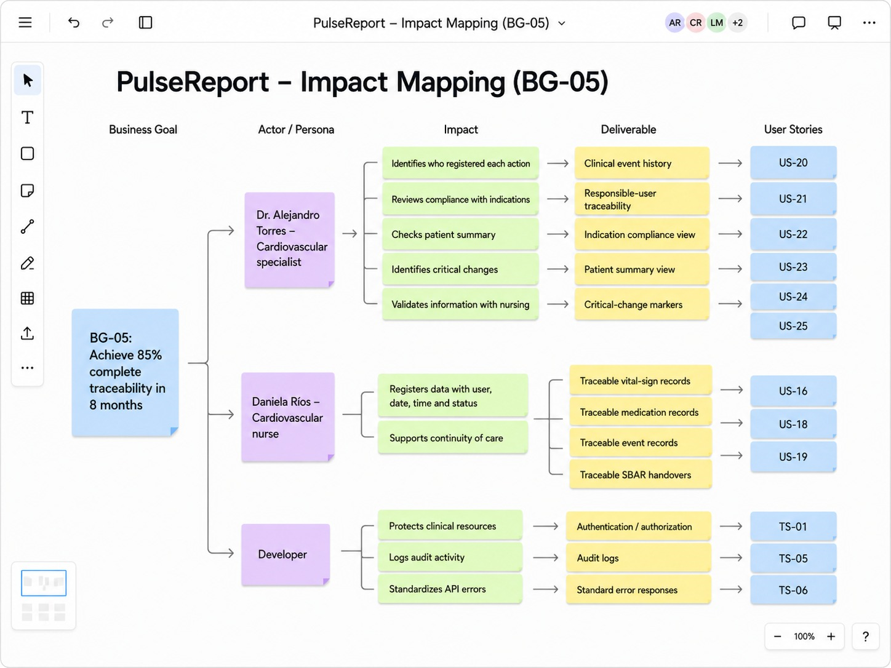
</p>

#### Impact Mapping detallado

Debido a que las capturas visuales presentan los identificadores principales para mantener legibilidad, la siguiente tabla detalla la relación completa entre Business Goals, actores, impactos esperados, entregables digitales y User Stories asociadas.

| Business Goal | Actor / Persona | Impact esperado | Deliverable | User Stories relacionadas |
| ------------- | --------------- | --------------- | ----------- | ------------------------- |
| **BG-01** | Visitante de la Landing Page | Comprender rápidamente qué es PulseReport, qué problema resuelve y por qué puede aportar valor al entorno clínico cardiovascular. | Landing Page informativa con propuesta de valor, explicación del problema, funcionamiento y beneficios. | **US-01:** Como visitante, deseo visualizar la landing page de PulseReport para conocer rápidamente la solución propuesta. <br><br> **US-02:** Como visitante, deseo conocer la propuesta de valor de PulseReport para entender qué problema clínico busca resolver. <br><br> **US-03:** Como visitante, deseo entender por qué existe la necesidad de PulseReport para reconocer el problema actual de información clínica dispersa. |
| **BG-01** | Visitante de la Landing Page | Evaluar confianza, resolver dudas y decidir si desea solicitar información adicional. | Secciones de características, beneficios, planes, preguntas frecuentes, testimonios, equipo, llamados a la acción y contacto. | **US-04:** Como visitante, deseo conocer cómo funciona PulseReport en pasos simples para comprender el flujo general de uso de la solución. <br><br> **US-05:** Como visitante, deseo conocer las características principales de PulseReport para evaluar si la solución responde a necesidades del entorno clínico cardiovascular. <br><br> **US-06:** Como visitante, deseo revisar los beneficios de PulseReport para comprender el valor que aporta al entorno clínico. <br><br> **US-07:** Como visitante, deseo revisar preguntas frecuentes para resolver dudas básicas sobre alcance, uso y modelo de servicio de PulseReport. <br><br> **US-08:** Como visitante, deseo revisar testimonios sobre PulseReport para aumentar mi confianza en la solución. <br><br> **US-09:** Como visitante, deseo conocer al equipo detrás de PulseReport para identificar quiénes desarrollan la solución. <br><br> **US-10:** Como visitante, deseo contactar al equipo de PulseReport para solicitar información adicional o una demostración. |
| **BG-01** | Visitante de la Landing Page | Acceder a la información desde distintos dispositivos y revisar el contenido en su idioma de preferencia. | Landing Page responsive e internacionalizada. | **US-11:** Como visitante, deseo cambiar el idioma del sitio entre español e inglés para revisar la información en el idioma de mi preferencia. <br><br> **US-12:** Como visitante, deseo acceder al sitio web desde dispositivos móviles para revisar información de PulseReport desde cualquier lugar. |
| **BG-02** | Daniela Ríos — Personal de enfermería cardiovascular | Registrar información del cambio de turno de manera estructurada para reducir omisiones y mejorar continuidad clínica. | Módulo de traspaso clínico SBAR. | **US-13:** Como enfermera cardiovascular, deseo registrar un traspaso clínico usando SBAR para comunicar información relevante al siguiente turno. <br><br> **US-14:** Como enfermera entrante, deseo consultar el traspaso clínico del turno anterior para continuar la atención del paciente sin perder información relevante. <br><br> **US-15:** Como enfermera entrante, deseo confirmar que recibí el traspaso clínico para dejar constancia de continuidad de atención. |
| **BG-02** | Cliente institucional | Validar si el flujo SBAR digital puede aplicarse como apoyo operativo dentro de áreas cardiovasculares. | Flujo demostrable de traspaso SBAR, evidencias de uso, documentación del proceso y validación con usuarios. | **US-13:** Como enfermera cardiovascular, deseo registrar un traspaso clínico usando SBAR para comunicar información relevante al siguiente turno. <br><br> **US-14:** Como enfermera entrante, deseo consultar el traspaso clínico del turno anterior para continuar la atención del paciente sin perder información relevante. <br><br> **TS-04:** Como Developer, deseo implementar endpoints de traspasos SBAR para registrar y consultar entregas de turno. |
| **BG-03** | Dr. Alejandro Torres — Médico especialista cardiovascular | Consultar información clínica consolidada y reducir el tiempo de búsqueda entre múltiples fuentes. | Vista de evolución clínica, resumen clínico del paciente e historial de eventos. | **US-17:** Como médico especialista cardiovascular, deseo consultar la evolución clínica reciente del paciente para tomar decisiones con información actualizada. <br><br> **US-20:** Como médico especialista cardiovascular, deseo consultar el historial de eventos clínicos para reconstruir la evolución del paciente. <br><br> **US-23:** Como médico especialista cardiovascular, deseo consultar un resumen clínico del paciente para comprender rápidamente su estado actual. |
| **BG-03** | Daniela Ríos — Personal de enfermería cardiovascular | Registrar información clínica de manera ordenada para que luego pueda ser consultada con menor fricción por otros profesionales. | Formularios de registro clínico para signos vitales, administración de medicamentos y eventos relevantes. | **US-16:** Como enfermera cardiovascular, deseo registrar signos vitales del paciente para mantener actualizado el monitoreo clínico. <br><br> **US-18:** Como enfermera cardiovascular, deseo registrar la administración de medicamentos para dejar constancia del cumplimiento de indicaciones médicas. <br><br> **US-19:** Como enfermera cardiovascular, deseo registrar eventos clínicos relevantes para que el equipo pueda dar seguimiento oportuno al paciente. |
| **BG-04** | Daniela Ríos — Personal de enfermería cardiovascular | Registrar signos vitales, eventos y traspasos en un flujo digital para reducir dependencia de apuntes físicos complementarios. | Módulos digitales de registro clínico, eventos relevantes y traspaso SBAR. | **US-13:** Como enfermera cardiovascular, deseo registrar un traspaso clínico usando SBAR para comunicar información relevante al siguiente turno. <br><br> **US-16:** Como enfermera cardiovascular, deseo registrar signos vitales del paciente para mantener actualizado el monitoreo clínico. <br><br> **US-19:** Como enfermera cardiovascular, deseo registrar eventos clínicos relevantes para que el equipo pueda dar seguimiento oportuno al paciente. |
| **BG-04** | Developer | Exponer recursos técnicos que permitan al frontend registrar y consultar información clínica desde el RESTful API. | Endpoints de pacientes, registros clínicos, traspasos y manejo consistente de errores. | **TS-02:** Como Developer, deseo exponer endpoints de pacientes para crear, consultar y actualizar información básica del paciente cardiovascular. <br><br> **TS-03:** Como Developer, deseo exponer endpoints de registros clínicos para permitir el registro y consulta de signos vitales, eventos e indicaciones. <br><br> **TS-04:** Como Developer, deseo implementar endpoints de traspasos SBAR para registrar y consultar entregas de turno. <br><br> **TS-06:** Como Developer, deseo estandarizar las respuestas de error para facilitar el consumo del API por parte del frontend. |
| **BG-05** | Dr. Alejandro Torres — Médico especialista cardiovascular | Identificar responsables, horarios, secuencia de eventos y cumplimiento de indicaciones para tomar decisiones con información trazable. | Historial de eventos, detalle de responsable de registro, cumplimiento de indicaciones y resumen clínico. | **US-20:** Como médico especialista cardiovascular, deseo consultar el historial de eventos clínicos para reconstruir la evolución del paciente. <br><br> **US-21:** Como usuario clínico, deseo identificar quién registró una información clínica para asegurar trazabilidad y responsabilidad profesional. <br><br> **US-22:** Como médico especialista cardiovascular, deseo revisar el cumplimiento de indicaciones para verificar si el tratamiento fue ejecutado correctamente. <br><br> **US-23:** Como médico especialista cardiovascular, deseo consultar un resumen clínico del paciente para comprender rápidamente su estado actual. |
| **BG-05** | Daniela Ríos — Personal de enfermería cardiovascular | Registrar información con responsable, fecha, hora y estado para fortalecer continuidad de atención. | Registro trazable de signos vitales, eventos, medicamentos y traspasos. | **US-16:** Como enfermera cardiovascular, deseo registrar signos vitales del paciente para mantener actualizado el monitoreo clínico. <br><br> **US-18:** Como enfermera cardiovascular, deseo registrar la administración de medicamentos para dejar constancia del cumplimiento de indicaciones médicas. <br><br> **US-19:** Como enfermera cardiovascular, deseo registrar eventos clínicos relevantes para que el equipo pueda dar seguimiento oportuno al paciente. |
| **BG-05** | Developer | Garantizar que las acciones clínicas registradas mantengan evidencia técnica de auditoría, seguridad y trazabilidad. | Auditoría de acciones clínicas, autenticación, autorización y protección de recursos del API. | **TS-01:** Como Developer, deseo implementar autenticación para proteger el acceso a recursos clínicos del sistema. <br><br> **TS-05:** Como Developer, deseo registrar auditoría de acciones clínicas para conservar responsable, fecha y tipo de operación realizada. <br><br> **TS-06:** Como Developer, deseo estandarizar las respuestas de error para facilitar el consumo del API por parte del frontend. |
| **BG-05** | Dr. Alejandro Torres — Médico especialista cardiovascular | Identificar cambios críticos y validar información con enfermería para responder oportunamente ante deterioros clínicos. | Alertas o marcadores de cambios críticos y registro de validación clínica entre médico y enfermería. | **US-24:** Como médico especialista cardiovascular, deseo identificar cambios críticos del paciente para responder oportunamente ante deterioros clínicos. <br><br> **US-25:** Como médico especialista cardiovascular, deseo validar información relevante con enfermería para reducir incertidumbre antes de tomar una decisión clínica. |

#### Conclusión del Impact Mapping

El Impact Mapping permite evidenciar que las funcionalidades priorizadas de PulseReport responden a objetivos de negocio concretos. La Landing Page se relaciona con la adquisición de visitantes interesados y la comunicación de la propuesta de valor. Los módulos clínicos de traspaso SBAR, signos vitales, eventos, resumen clínico e historial se relacionan con la mejora de comunicación, reducción del tiempo de búsqueda de información, disminución de dependencia de registros físicos y fortalecimiento de trazabilidad. Finalmente, las Technical Stories del RESTful API permiten sostener técnicamente los entregables necesarios para registro, consulta, seguridad, auditoría y continuidad clínica.

### 3.3. Product Backlog

La presente sección desarrolla el Product Backlog del proyecto PulseReport, incluyendo la priorización y estimación de las User Stories y Technical Stories definidas previamente. El orden del backlog se establece considerando el valor para el negocio, la validación temprana del producto, la relación con los Business Goals y la necesidad de contar con una primera versión funcional del sistema.

De acuerdo con el criterio solicitado, las historias relacionadas con el sitio web estático o Landing Page se consideran desde el primer sprint, ya que permiten comunicar la propuesta de valor, captar visitantes interesados y validar el interés inicial del mercado. Posteriormente se priorizan las funcionalidades clínicas centrales relacionadas con traspaso SBAR, registro clínico, trazabilidad, consulta de información y soporte a la toma de decisiones.

La estimación se realiza utilizando Story Points con valores **1, 2, 3, 5 y 8**, considerando complejidad funcional, esfuerzo técnico, validaciones requeridas, dependencias y riesgo de implementación.

#### Criterios de priorización

| Criterio | Descripción |
| -------- | ----------- |
| **Valor para el negocio** | Se priorizan primero las historias que permiten comunicar la propuesta de valor, validar interés inicial y demostrar funcionalidad clínica central. |
| **Relación con Business Goals** | Las historias se ordenan considerando su aporte a los objetivos definidos en el Impact Mapping. |
| **Validación temprana** | Se colocan primero historias que permiten obtener retroalimentación de visitantes, usuarios clínicos y potenciales clientes institucionales. |
| **Dependencias funcionales** | Algunas historias requieren que primero existan pacientes, registros, traspasos o recursos base del sistema. |
| **Riesgo técnico** | Las Technical Stories se priorizan según su necesidad para soportar funcionalidades clínicas y no únicamente por seguridad o autenticación. |
| **Alcance por sprints** | El backlog considera la evolución del producto desde Landing Page hasta Web Application, RESTful API, validación y cierre final. |

#### Product Backlog — PulseReport

| # Orden | User Story Id | Título | Descripción | Story Points |
| ------: | ------------- | ------ | ----------- | -----------: |
| 1 | US-01 | Visualizar landing page | Como visitante, deseo visualizar la landing page de PulseReport para conocer rápidamente la solución propuesta. | 3 |
| 2 | US-02 | Ver propuesta de valor | Como visitante, deseo conocer la propuesta de valor de PulseReport para entender qué problema clínico busca resolver. | 3 |
| 3 | US-03 | Consultar el problema que resuelve PulseReport | Como visitante, deseo entender por qué existe la necesidad de PulseReport para reconocer el problema actual de información clínica dispersa. | 3 |
| 4 | US-04 | Revisar cómo funciona PulseReport | Como visitante, deseo conocer cómo funciona PulseReport en pasos simples para comprender el flujo general de uso de la solución. | 3 |
| 5 | US-05 | Visualizar características clave | Como visitante, deseo conocer las características principales de PulseReport para evaluar si la solución responde a necesidades del entorno clínico cardiovascular. | 3 |
| 6 | US-06 | Visualizar beneficios | Como visitante, deseo revisar los beneficios de PulseReport para comprender el valor que aporta al entorno clínico. | 3 |
| 7 | US-10 | Contactar al equipo de PulseReport | Como visitante, deseo contactar al equipo de PulseReport para solicitar información adicional o una demostración. | 5 |
| 8 | US-12 | Acceder desde dispositivos móviles | Como visitante, deseo acceder al sitio web desde dispositivos móviles para revisar información de PulseReport desde cualquier lugar. | 5 |
| 9 | US-11 | Cambiar idioma del sitio | Como visitante, deseo cambiar el idioma del sitio entre español e inglés para revisar la información en el idioma de mi preferencia. | 5 |
| 10 | US-07 | Consultar preguntas frecuentes | Como visitante, deseo revisar preguntas frecuentes para resolver dudas básicas sobre alcance, uso y modelo de servicio de PulseReport. | 2 |
| 11 | US-08 | Visualizar testimonios | Como visitante, deseo revisar testimonios sobre PulseReport para aumentar mi confianza en la solución. | 2 |
| 12 | US-09 | Conocer al equipo | Como visitante, deseo conocer al equipo detrás de PulseReport para identificar quiénes desarrollan la solución. | 2 |
| 13 | US-13 | Registrar traspaso SBAR | Como enfermera cardiovascular, deseo registrar un traspaso clínico usando SBAR para comunicar información relevante al siguiente turno. | 8 |
| 14 | US-14 | Consultar traspaso de turno | Como enfermera entrante, deseo consultar el traspaso clínico del turno anterior para continuar la atención del paciente sin perder información relevante. | 5 |
| 15 | US-15 | Confirmar recepción de traspaso | Como enfermera entrante, deseo confirmar que recibí el traspaso clínico para dejar constancia de continuidad de atención. | 3 |
| 16 | US-16 | Registrar signos vitales | Como enfermera cardiovascular, deseo registrar signos vitales del paciente para mantener actualizado el monitoreo clínico. | 5 |
| 17 | US-18 | Registrar administración de medicamento | Como enfermera cardiovascular, deseo registrar la administración de medicamentos para dejar constancia del cumplimiento de indicaciones médicas. | 5 |
| 18 | US-19 | Registrar evento clínico relevante | Como enfermera cardiovascular, deseo registrar eventos clínicos relevantes para que el equipo pueda dar seguimiento oportuno al paciente. | 5 |
| 19 | US-17 | Consultar evolución clínica | Como médico especialista cardiovascular, deseo consultar la evolución clínica reciente del paciente para tomar decisiones con información actualizada. | 5 |
| 20 | US-23 | Consultar resumen clínico del paciente | Como médico especialista cardiovascular, deseo consultar un resumen clínico del paciente para comprender rápidamente su estado actual. | 8 |
| 21 | US-20 | Consultar historial de eventos | Como médico especialista cardiovascular, deseo consultar el historial de eventos clínicos para reconstruir la evolución del paciente. | 5 |
| 22 | US-21 | Identificar responsable de registro | Como usuario clínico, deseo identificar quién registró una información clínica para asegurar trazabilidad y responsabilidad profesional. | 5 |
| 23 | US-22 | Consultar cumplimiento de indicaciones | Como médico especialista cardiovascular, deseo revisar el cumplimiento de indicaciones para verificar si el tratamiento fue ejecutado correctamente. | 5 |
| 24 | US-24 | Identificar cambios críticos | Como médico especialista cardiovascular, deseo identificar cambios críticos del paciente para responder oportunamente ante deterioros clínicos. | 8 |
| 25 | US-25 | Validar información con enfermería | Como médico especialista cardiovascular, deseo validar información relevante con enfermería para reducir incertidumbre antes de tomar una decisión clínica. | 5 |
| 26 | TS-02 | Gestión de pacientes mediante API | Como Developer, deseo exponer endpoints de pacientes para crear, consultar y actualizar información básica del paciente cardiovascular. | 5 |
| 27 | TS-03 | Gestión de registros clínicos mediante API | Como Developer, deseo exponer endpoints de registros clínicos para permitir el registro y consulta de signos vitales, eventos e indicaciones. | 8 |
| 28 | TS-04 | Gestión de traspasos SBAR mediante API | Como Developer, deseo implementar endpoints de traspasos SBAR para registrar y consultar entregas de turno. | 5 |
| 29 | TS-05 | Trazabilidad de acciones clínicas | Como Developer, deseo registrar auditoría de acciones clínicas para conservar responsable, fecha y tipo de operación realizada. | 5 |
| 30 | TS-01 | Autenticación de usuarios | Como Developer, deseo implementar autenticación para proteger el acceso a recursos clínicos del sistema. | 5 |
| 31 | TS-06 | Manejo consistente de errores del API | Como Developer, deseo estandarizar las respuestas de error para facilitar el consumo del API por parte del frontend. | 3 |

#### Distribución por bloques funcionales

| Bloque | Historias incluidas | Propósito |
| ------ | ------------------- | --------- |
| **Landing Page** | US-01 a US-12 | Comunicar la propuesta de valor, captar interesados y validar interés inicial. |
| **Traspaso SBAR** | US-13 a US-15 | Mejorar comunicación clínica durante cambios de turno. |
| **Registro clínico** | US-16, US-18, US-19 | Reducir duplicidad, registrar información relevante y disminuir dependencia de papel. |
| **Consulta clínica** | US-17, US-20, US-23 | Facilitar acceso rápido a evolución, historial y estado actual del paciente. |
| **Trazabilidad clínica** | US-21, US-22 | Reconstruir responsables, horarios y cumplimiento de indicaciones. |
| **Soporte a decisiones clínicas** | US-24, US-25 | Identificar cambios críticos y validar información relevante con enfermería. |
| **RESTful API** | TS-01 a TS-06 | Habilitar recursos técnicos para pacientes, registros, traspasos, trazabilidad, autenticación y errores. |

#### Relación del Product Backlog con los Business Goals

| Business Goal | Historias principales relacionadas | Justificación |
| ------------- | ---------------------------------- | ------------- |
| **BG-01** | US-01 a US-12 | Estas historias permiten comunicar el valor de PulseReport, generar confianza y facilitar contacto desde la Landing Page. |
| **BG-02** | US-13, US-14, US-15, TS-04 | Estas historias permiten validar el flujo de traspaso SBAR digital con usuarios clínicos e instituciones. |
| **BG-03** | US-16, US-17, US-20, US-23 | Estas historias reducen fricción al registrar y consultar información clínica relevante. |
| **BG-04** | US-13, US-16, US-18, US-19, TS-02, TS-03, TS-04 | Estas historias permiten reemplazar registros físicos complementarios por flujos digitales funcionales. |
| **BG-05** | US-20, US-21, US-22, US-24, US-25, TS-01, TS-05, TS-06 | Estas historias fortalecen trazabilidad clínica, seguridad, auditoría y soporte a decisiones clínicas. |

#### Relación del Product Backlog con los sprints

| Sprint | Historias principales consideradas | Enfoque |
| ------ | --------------------------------- | ------- |
| **Sprint 1** | US-01, US-02, US-03, US-04, US-05, US-06, US-10, US-12 | Desarrollo inicial de Landing Page, comunicación de propuesta de valor, secciones principales, contacto y responsive design. |
| **Sprint 2** | US-07, US-08, US-09, US-11, US-13, US-14, US-16, US-17 | Mejora de Landing Page, primeras vistas de Web Application, traspaso SBAR, signos vitales y consulta clínica inicial. |
| **Sprint 3** | US-18, US-19, US-20, US-21, TS-02, TS-03, TS-04, TS-05 | Implementación de Web Services, registros clínicos, eventos, trazabilidad, endpoints REST y documentación de API. |
| **Sprint 4** | US-15, US-22, US-23, US-24, US-25, TS-01, TS-06 | Cierre de funcionalidades, validación final, autenticación, manejo de errores, evidencias finales y mejoras del producto. |

#### Captura y URL del Product Backlog

La siguiente captura corresponde al Product Backlog elaborado en la herramienta de gestión utilizada por el equipo. En ella se evidencia la priorización de historias, estimación mediante Story Points y organización del backlog según valor para el negocio.

<p align="center">
  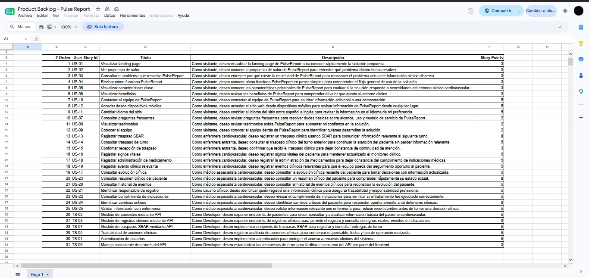
</p>

**URL del Product Backlog:**  
https://docs.google.com/spreadsheets/d/1JWzVr2lEd1AoSZBmGx0D0B3Pd09Je_w_lRHvN-_5y40/edit?usp=sharing

#### Conclusión del Product Backlog

El Product Backlog de PulseReport prioriza primero las historias relacionadas con la Landing Page porque permiten comunicar la propuesta de valor, presentar beneficios, mostrar planes, validar interés inicial y obtener contacto con visitantes interesados mediante llamados a la acción. Luego se priorizan funcionalidades clínicas centrales relacionadas con traspaso SBAR, registro de signos vitales, eventos clínicos, consulta de evolución, trazabilidad y soporte a decisiones clínicas.

Las Technical Stories se ubican después de las historias funcionales principales porque su propósito es habilitar técnicamente los recursos necesarios para la Web Application y el RESTful API. Esta organización evita priorizar autenticación o seguridad al inicio sin una relación directa con valor de negocio visible, y mantiene coherencia con el enfoque solicitado para el Product Backlog.

## Capítulo IV: Product Design
### 4.1. Style Guidelines
#### 4.1.1. General Style Guidelines
El diseño de estilo general de **Care-Labs / PulseReport** responde a la necesidad de transmitir profesionalismo, seguridad, claridad y confianza, valores fundamentales en una solución digital orientada al sector salud. La propuesta visual de la landing page busca reflejar una identidad moderna y ordenada, alineada con el propósito del producto: mejorar la comunicación clínica, la trazabilidad de la información y el seguimiento en tiempo real dentro de entornos asistenciales.

- **Colores**: la paleta seleccionada combina azul (#0F3D91), azul intenso (#0F4DB8), turquesa (#14B8A6), blanco (#FFFFFF) y tonos grises suaves (#E5E7EB y #1F2937). El azul transmite confianza, estabilidad y profesionalismo, cualidades importantes en plataformas relacionadas con procesos clínicos. El turquesa refuerza la idea de innovación, accesibilidad y tecnología en salud. Los tonos neutros equilibran la interfaz, mejoran el contraste y favorecen la lectura del contenido.

<p align="center">
  
</p>

- **Tipografía**: se utiliza una tipografía sans serif como base visual por su claridad, legibilidad y apariencia profesional en entornos web. La elección de fuentes como Arial y Helvetica responde a la necesidad de mantener una lectura fluida en títulos, botones, menús y descripciones, además de proyectar una imagen moderna, limpia y confiable para el usuario.

<p align="center">
  
</p>

- **Distribución y espaciado**: se adopta una estructura visual ordenada, con bloques bien definidos, espaciado consistente y una jerarquía clara entre secciones. La landing page organiza su contenido de manera progresiva, permitiendo que el usuario identifique fácilmente el propósito del producto, sus características, beneficios y medios de contacto. Esta distribución mejora la navegación y facilita una experiencia visual limpia y comprensible.

<p align="center">

</p>

- **Lenguaje y tono**: la comunicación es directa, clara y profesional, evitando tecnicismos innecesarios. Los textos de la interfaz emplean un tono formal y accesible para transmitir confianza y facilitar la comprensión de la propuesta de valor tanto a instituciones de salud como a usuarios interesados en la solución. Expresiones como “Solicitar demo”, “Ver cómo funciona” y “Contáctanos” refuerzan un lenguaje orientado a la acción y a la claridad informativa.

<p align="center">

</p>

- **Iconografía**: se emplean símbolos visuales vinculados al entorno médico y a la comunicación asistencial, como íconos relacionados con salud, registro clínico, monitoreo y comunicación entre usuarios. Esto permite reforzar visualmente el enfoque del producto, reducir la complejidad de interpretación y mejorar la usabilidad general de la landing page.

<p align="center">

</p>

#### 4.1.2. Web Style Guidelines

El diseño web de **Care-Labs / PulseReport** se implementará como una solución digital orientada al sector salud, buscando que tanto la Landing Page como la Web Application mantengan una experiencia uniforme, clara, responsiva y accesible. El objetivo es asegurar una interfaz confiable y profesional que facilite la interacción del usuario con el sistema y refuerce la identidad visual del producto.

- **Diseño adaptable**: la interfaz se ajusta a distintos dispositivos (desktop, tablet y móvil), manteniendo consistencia visual entre la Landing Page y la Web Application. Esto permite que los usuarios puedan acceder al sistema desde diferentes contextos, facilitando la consulta de información y el uso de la plataforma en distintos entornos de trabajo.

<p align="center">

</p>

- **Componentes de interfaz**: los botones principales se presentan con colores más intensos para resaltar acciones relevantes como solicitar una demo, registrar información o confirmar procesos, mientras que los elementos secundarios mantienen un estilo más neutral. Esto establece jerarquía visual y permite que el usuario identifique con rapidez las acciones prioritarias dentro de la interfaz.

<p align="center">

</p>

- **Notificaciones y estados**: los mensajes del sistema utilizan convenciones visuales claras para comunicar el estado de una acción o proceso. Los estados positivos se muestran en verde para indicar confirmación o guardado exitoso, las advertencias en amarillo para señalar elementos pendientes o en revisión, y los errores en rojo para representar fallos o problemas de sincronización. Esta diferenciación mejora la comprensión y reduce la posibilidad de confusión por parte del usuario.

<p align="center">

</p>

- **Tablas y dashboards**: se prioriza una presentación clara y ordenada de la información dentro de tablas y paneles de control, facilitando la consulta y el análisis de datos relevantes. La organización visual de registros, métricas y estados permite que el usuario interprete rápidamente la información y pueda dar seguimiento a los procesos del sistema de manera más eficiente.

<p align="center">

</p>

- **Accesibilidad**: se consideran contrastes adecuados, una disposición clara del contenido y elementos visuales comprensibles para favorecer la interacción de distintos tipos de usuarios. Además, se busca mantener una navegación sencilla y una lectura legible en toda la interfaz, fortaleciendo la usabilidad general de la plataforma.

<p align="center">

</p>

### 4.2. Information Architecture
#### 4.2.1. Organization Systems

1. Organization Scheme (Esquema de organización)
- Temático/Funcional: la información se organiza según las funciones principales del sistema:
  - Gestión de usuarios (registro, login, perfil, documentos).
  - Gestión clínica (pacientes, tratamientos, signos vitales, historial clínico).
  - Traspasos y comunicación asistencial (SBAR, seguimiento entre turnos y áreas).
  - Landing Page (información y promoción del producto).
  - Reportes y analítica.

2. Organization Structure (Estructura de organización)

- Jerárquica (Árbol): desde la Landing Page como entrada, se navega a los módulos principales del sistema.
- Lineal: en procesos como registro de cuenta, ingreso de pacientes o traspaso SBAR, los pasos siguen una secuencia.
- Matriz: en búsquedas y filtrados, por ejemplo en pacientes o reportes, donde la información puede organizarse por fecha, estado clínico, área asistencial o tipo de registro.

3. Organization System (Sistema de organización aplicado)
- Global navigation (menú principal en el header): acceso a
  - Home (Landing Page)
  - Pacientes
  - Traspasos SBAR
  - Tratamientos
  - Reportes
  - Contacto

- Local navigation (submenús dentro de cada sección):
  - Pacientes → Registrar, Historial, Signos vitales.
  - Traspasos SBAR → Pendientes, En revisión, Aprobados.
  - Tratamientos → Activos, Seguimiento, Finalizados.
  - Reportes → Pacientes, Tratamientos, Eventos críticos.

- Contextual navigation (botones de acción dentro de un flujo):
  - “Registrar paciente”
  - “Guardar SBAR”
  - “Actualizar signos vitales”
  - “Generar reporte”

<p align="center">

</p>

#### 4.2.2. Labeling Systems

**Objetivos**

- Facilitar la identificación rápida de módulos, secciones y funciones dentro de la Landing Page y la Web Application.
- Mantener consistencia en los nombres utilizados en navegación, formularios, tablas y reportes.
- Mejorar la comprensión del sistema por parte de los usuarios, empleando etiquetas claras, breves y fáciles de reconocer.
- Favorecer una navegación intuitiva y una mejor organización del contenido, tanto en la parte informativa como en la operativa.

**Estructura recomendada**

- Estructura: **Módulo principal → Submódulo → Acción o estado**.
  - Ejemplo: **Inventario > Registrar ítem > Guardar**
  - Ejemplo: **Inspecciones > Pendientes > Revisar**
  - Ejemplo: **Perfil > Documentos > Cargar archivo**

- Tipos de etiquetas:
  - **Módulos**: nombres principales de navegación, como `Inicio`, `Inventario`, `Inspecciones`, `Perfil`, `Reportes`, `Contacto`.
  - **Submódulos**: categorías internas dentro de cada sección, como `Stock actual`, `Historial`, `Pendientes`, `Aprobados`, `Documentos`.
  - **Acciones**: etiquetas orientadas a tareas, como `Registrar`, `Editar`, `Guardar`, `Enviar`, `Generar reporte`.
  - **Estados**: etiquetas para representar la situación de un elemento, como `Pendiente`, `En revisión`, `Aprobado`, `Rechazado`, `Activo`.

**Convenciones (formato)**

- Uso de palabras claras y comprensibles para el usuario final.
- Etiquetas breves, directas y consistentes en toda la interfaz.
- En navegación y botones se priorizan etiquetas de **1 a 3 palabras**.
- Para URLs y slugs se utiliza formato en minúsculas y con guiones.
  - Ejemplo: `inventario/stock-actual`
  - Ejemplo: `inspecciones/en-revision`
- En la interfaz visible se emplean nombres legibles y amigables.
  - Ejemplo: `Stock actual`
  - Ejemplo: `Generar reporte`

**Modelo de datos (ejemplo JSON)**

```json
{
  "id": "lbl_001",
  "type": "module",
  "slug": "inventario",
  "name": "Inventario",
  "parent_id": null,
  "created_at": "2026-04-21T10:00:00Z"
}

```

#### Interfaz de gestión
- Gestión centralizada de etiquetas para mantener uniformidad entre la Landing Page y la Web Application.
- Posibilidad de reutilizar etiquetas en menús, tablas, formularios y botones.
- Edición sencilla de nombres visibles sin afectar la lógica interna del sistema.
- Vista previa del uso de cada etiqueta dentro de menús, breadcrumbs o secciones.

#### Reglas y validaciones
- No se permiten etiquetas duplicadas dentro de un mismo contexto.
- Cada etiqueta debe tener un nombre visible y un identificador interno único.
- Se valida que las etiquetas sean consistentes con la jerarquía del sistema.
- Se recomienda reutilizar etiquetas existentes antes de crear nuevas.
- Los nombres deben evitar tecnicismos innecesarios o abreviaturas confusas.

#### Ejemplos de uso en URLs
- `/inventario/stock-actual`
- `/inventario/historial`
- `/inspecciones/aprobados`

#### 4.2.3. SEO Tags and Meta Tags

**Objetivos**

- Mejorar la visibilidad de la **Landing Page** de **Care-Labs / PulseReport** en motores de búsqueda.
- Aumentar el CTR en resultados de búsqueda mediante títulos y descripciones claras y atractivas.
- Optimizar la vista previa al compartir enlaces en redes sociales usando **Open Graph** y **Twitter Cards**.
- Controlar qué páginas deben indexarse y cuáles no, diferenciando entre la **Landing Page pública** y la **Web Application privada**.
- Incorporar datos estructurados para describir el producto digital y la organización.

**Meta tags clave (plantilla)**

```html
<title>{{page_title}} | Care-Labs</title>
<meta name="description" content="{{page_description}}" />
<link rel="canonical" href="{{canonical_url}}" />
<meta name="robots" content="{{robots_value}}" />

<!-- Open Graph -->
<meta property="og:title" content="{{page_title}} | Care-Labs" />
<meta property="og:description" content="{{page_description}}" />
<meta property="og:image" content="{{og_image}}" />
<meta property="og:url" content="{{canonical_url}}" />
<meta property="og:type" content="website" />
<meta property="og:site_name" content="Care-Labs" />

<!-- Twitter Card -->
<meta name="twitter:card" content="summary_large_image" />
<meta name="twitter:title" content="{{page_title}} | Care-Labs" />
<meta name="twitter:description" content="{{page_description}}" />
<meta name="twitter:image" content="{{twitter_image}}" />
```
**Reglas prácticas**

- **Título**: entre 50 y 60 caracteres, incluyendo el nombre del producto o de la empresa.
- **Meta description**: entre 120 y 160 caracteres, explicando de forma clara la propuesta de valor.
- **Canonical**: obligatorio en páginas públicas para evitar contenido duplicado.
- **Meta robots**:
  - `index, follow` para la **Landing Page** y secciones públicas.
  - `noindex, nofollow` para páginas privadas del sistema como dashboard, perfil o reportes internos.
- Las palabras clave deben enfocarse en términos como:
  - comunicación clínica,
  - trazabilidad en tiempo real,
  - continuidad asistencial,
  - software de gestión clínica,
  - plataforma de salud digital.

**JSON-LD (ejemplo para el producto digital)**

```html
<script type="application/ld+json">
{
  "@context": "https://schema.org",
  "@type": "SoftwareApplication",
  "name": "PulseReport",
  "applicationCategory": "HealthApplication",
  "operatingSystem": "Web",
  "description": "Plataforma web de Care-Labs orientada a mejorar la comunicación clínica, la trazabilidad y el seguimiento en tiempo real.",
  "publisher": {
    "@type": "Organization",
    "name": "Care-Labs"
  },
  "url": "https://care-labs.com/pulsereport"
}
</script>
```
**Renderizado (server vs client)**

- Para la **Landing Page**, es recomendable utilizar **prerendering** o **SSR**, de modo que los meta tags estén disponibles desde la carga inicial y sean interpretados correctamente por los motores de búsqueda.
- En el caso de Angular, esto puede implementarse mediante opciones de **Angular SSR** o **prerender** para mejorar el posicionamiento SEO.
- Para la **Web Application interna**, el SEO no es prioritario, ya que su contenido es funcional y de acceso restringido.

**Sitemaps y robots.txt**

- `sitemap.xml`: incluir únicamente las rutas públicas relevantes, como:
  - Inicio
  - Características
  - Beneficios
  - Preguntas frecuentes
  - Contacto
- `robots.txt`: permitir el rastreo de la Landing Page y bloquear secciones privadas o internas del sistema.
- Ejemplo:
  - permitir indexación de `/`
  - bloquear rutas como `/dashboard`, `/perfil`, `/reportes-internos` o cualquier módulo autenticado.

#### 4.2.4. Searching Systems.

**Requerimientos funcionales**

- Búsqueda por texto en módulos clave como pacientes, tratamientos, traspasos SBAR y reportes.
- Autocomplete / sugerencias para acelerar la localización de pacientes, registros o áreas asistenciales.
- Filtros por estado, fecha, área, tipo de registro o nivel de prioridad.
- Búsqueda por historial clínico o eventos asociados al paciente.
- Ordenamiento de resultados por fecha, estado, prioridad o coincidencia.
- Visualización clara de resultados para facilitar la identificación rápida de la información.
- Posibilidad de combinar búsqueda + filtros en tablas y paneles del sistema.

**Opciones de tecnología (comparativa rápida)**

- **PostgreSQL Full-Text Search**
  - Pros: integrado, práctico y suficiente para búsquedas básicas dentro del sistema.
  - Contras: menor flexibilidad para búsquedas avanzadas o ranking complejo.

- **Elasticsearch / OpenSearch**
  - Pros: alto rendimiento, búsquedas avanzadas, filtros potentes y mejor relevancia.
  - Contras: requiere infraestructura adicional y mayor mantenimiento.

- **Algolia (SaaS)**
  - Pros: búsqueda muy rápida, autocomplete eficiente y buena experiencia de usuario.
  - Contras: dependencia de un servicio externo y costo adicional.

**Esquema de índice (ejemplo para Elastic)**

```json
{
  "mappings": {
    "properties": {
      "id": { "type": "keyword" },
      "patient_name": { "type": "text", "analyzer": "standard" },
      "clinical_area": { "type": "keyword" },
      "sbar_status": { "type": "keyword" },
      "treatment_status": { "type": "keyword" },
      "record_type": { "type": "keyword" },
      "created_at": { "type": "date" },
      "priority": { "type": "keyword" }
    }
  }
}
```

#### 4.2.5. Navigation Systems.

A continuación, presentamos el sistema de navegación con el que contará **Care-Labs / PulseReport**, el cual permitirá al usuario desplazarse tanto en la **Landing Page** como en la **Web Application** de manera clara y ordenada.

Se implementará un sistema de navegación que facilite el acceso rápido a las principales secciones del producto, manteniendo consistencia visual y funcional en toda la experiencia web. Esto permitirá que los usuarios identifiquen fácilmente dónde se encuentran y hacia dónde pueden dirigirse dentro de la plataforma.

**Estructura del Sistema de Navegación**

- **Navegación global**: ubicada en el header principal, permite acceder a las secciones principales de la Landing Page y a los módulos centrales del sistema, como inicio, pacientes, traspasos SBAR, tratamientos, reportes y contacto.

- **Navegación local**: presente dentro de cada módulo de la Web Application, facilita el acceso a subsecciones específicas. Por ejemplo:
  - Pacientes → Registrar, Historial clínico, Signos vitales.
  - Traspasos SBAR → Pendientes, En revisión, Aprobados.
  - Tratamientos → Activos, Seguimiento, Finalizados.

- **Navegación contextual**: integrada mediante botones y acciones dentro de cada flujo, permitiendo ejecutar tareas específicas como:
  - “Registrar paciente”
  - “Guardar SBAR”
  - “Actualizar signos vitales”
  - “Generar reporte”

- **Consistencia de navegación**: los menús, accesos y botones mantienen una ubicación y estilo uniforme, ayudando a que el usuario navegue de manera intuitiva y sin confusión entre las distintas secciones.

<p align="center">
  
</p>

#### 4.3 Landing Page UI Design.
  
#### 4.3.1 Landing Page Wireframes.

El wireframe de la landing page de **Care-Labs / PulseReport** presenta una estructura clara y ordenada, diseñada para comunicar la propuesta de valor del producto de forma directa. La página incluye secciones estratégicas como hero section, funcionamiento, características, beneficios, preguntas frecuentes, contacto y llamados a la acción que orientan al usuario durante la navegación.

- **Inicio**: en la parte superior se ubica el logo principal de **Care-Labs / PulseReport** junto con la barra de navegación, que permite acceder a las principales secciones de la landing page. Además, se incluye un botón de **“Solicitar demo”** como llamado a la acción destacado, con el objetivo de captar rápidamente el interés del usuario.

<p align="center">
  
</p>

- **¿Cómo funciona?**: en esta sección se explica de forma breve y visual cómo funciona la solución, mostrando el flujo general del producto en pasos simples. Esto permite que el usuario comprenda rápidamente la lógica de uso de **PulseReport** dentro del entorno clínico.

<p align="center">
  
</p>

- **Características**: se presentan las funcionalidades principales de la plataforma, como traspasos SBAR, gestión de pacientes, seguimiento de tratamientos, monitoreo de signos vitales, historial clínico digital y log de auditoría. Estas características se muestran en bloques simples con descripciones breves para facilitar la comprensión del producto.

<p align="center">
  
</p>

- **Beneficios y FAQs**: esta sección destaca el valor agregado de la solución, resaltando beneficios como una mejor comunicación entre turnos, mayor trazabilidad clínica, organización de la información y atención más confiable. Además, se incluye una sección de preguntas frecuentes para resolver dudas comunes y reforzar la claridad de la propuesta.

<p align="center">
  
</p>

<p align="center">
  
</p>


- **Contacto y Footer**: en la parte final se encuentra el formulario de contacto, que permite a los usuarios interesados enviar consultas o solicitar información adicional sobre la plataforma. Finalmente, el footer incluye información general de la marca y accesos complementarios a secciones relevantes de la landing page.

<p align="center">
  
</p>

<p align="center">
  
</p>


#### 4.3.2 Landing Page Mock-up.
<p align="center">  </p>

<p align="center">  </p>

<p align="center">  </p>

<p align="center">  </p>

<p align="center">  </p>

<p align="center">  </p>

<p align="center">  </p>

#### 4.4 Web Applications UX/UI Design.
#### 4.4.1 Web Application Wireframes.


#### 4.4.2 Web Application Wireflow Diagrams.

#### User Goal 1
Segmento: Personal de enfermería cardiovascular
User Goal: Registrar signos vitales y evaluar la evolución clínica del paciente.
Explicación: El usuario ingresa al perfil del paciente y selecciona registrar signos vitales. En la ruta esperada (happy path), ingresa los valores, el sistema los valida, guarda el registro y actualiza la gráfica en tiempo real. Como flujos alternativos (unhappy paths), si el usuario ingresa valores incompletos o fuera de los rangos biológicos lógicos, el sistema detiene el flujo y muestra advertencias de validación para evitar errores médicos.

<p align="center">
  
</p>

#### User Goal 2
Segmento: Personal de enfermería cardiovascular
User Goal: Realizar el traspaso de información clínica entre turnos utilizando el modelo SBAR.
Explicación: El enfermero inicia un nuevo reporte SBAR. El flujo principal lo guía obligatoriamente por las 4 secciones (Situación, Antecedentes, Evaluación, Recomendación) hasta su publicación exitosa. En rutas alternativas, si el usuario intenta cancelar el proceso o cerrar la ventana, el sistema interrumpe la acción con un modal de confirmación para evitar la pérdida de documentación crítica.

<p align="center">
  
</p>

<p align="center">
  
</p>

#### User Goal 3
Segmento: Hospitales, clínicas privadas y centros especializados en cardiología
User Goal: Monitorear procesos críticos y revisar la trazabilidad del área cardiovascular.
Explicación: El supervisor ingresa al Dashboard para revisar el estado general. El flujo ideal permite hacer clic en una métrica o alerta activa para ser redirigido al log de auditoría detallado del paciente involucrado. En un flujo alternativo, si el supervisor aplica filtros de búsqueda para fechas sin actividad registrada, el sistema le indica claramente que no existen eventos, permitiéndole reajustar su búsqueda rápidamente.

<p align="center">
  
</p>

<p align="center">
  
</p>

#### 4.4.2 Web Application Mock-ups.
#### Perfil
Esta interfaz está dedicada a la gestión de la información personal y profesional del usuario, ya sea personal de enfermería o administrador. Permite la configuración de la cuenta, visualización de roles y administración de credenciales de acceso.

<p align="center">
  
</p>

#### Detalle Clínico
Vista especializada que expone la información médica detallada de un paciente específico. Centraliza diagnósticos cardiovasculares, tratamientos activos, medicación y notas clínicas relevantes para asegurar la continuidad del cuidado.

<p align="center">
  
</p>

#### Alertas
Panel de notificaciones y advertencias críticas del sistema. Está diseñado para informar al personal de salud de manera inmediata sobre anomalías en los parámetros de los pacientes, garantizando un tiempo de respuesta rápido ante emergencias.

<p align="center">
  
</p>

#### Eventos Clínicos
Interfaz orientada al registro y visualización de sucesos médicos importantes ocurridos durante el turno. Facilita la trazabilidad de las intervenciones y apoya directamente la comunicación estructurada mediante el modelo SBAR.

<p align="center">
  
</p>

#### Signos Vitales
Módulo enfocado en el monitoreo y registro de los parámetros fisiológicos del paciente. Permite un seguimiento preciso de métricas clave en cardiología, como la presión arterial y la frecuencia cardíaca, mostrando su evolución temporal.

<p align="center">
  
</p>

#### Paciente
Sección general para la administración de los datos demográficos, información de contacto y estado de admisión de los pacientes dentro del centro de salud, sirviendo como punto de partida para acceder a su historial completo.

<p align="center">
  
</p>

#### Dashboard
Panel de control principal que ofrece una visión panorámica y resumida del entorno clínico. Muestra indicadores clave de rendimiento, el estado general del área cardiovascular y un resumen de las tareas y pacientes de mayor prioridad.

<p align="center">
  
</p>

#### 4.4.3 Web Applications User Flow Diagrams.
En esta sección se presentan los diagramas de flujo de usuario que detallan la lógica de navegación y los puntos de decisión dentro de Care-Labs. Estos flujos han sido diseñados para garantizar que el personal de enfermería y los administradores cumplan sus objetivos de manera eficiente, integrando rutas principales y alternativas para el manejo de datos críticos.  Los diagramas reflejan la interacción completa del sistema, asegurando la consistencia con los wireflows previos y validando cada paso del proceso clínico, desde el registro de signos vitales hasta la supervisión de alertas en el dashboard.  

<p align="center">
  
</p>

#### 4.5 Web Application Prototyping.

En esta sección se presentan los prototipos de interfaz web de Care-Labs, desarrollados para simular los principales flujos de interacción de la plataforma en navegador web. Los prototipos fueron diseñados considerando una arquitectura de información organizada por perfiles de usuario: personal de enfermería cardiovascular y administración o supervisión clínica.

Las decisiones de interacción se enfocan en facilitar una navegación rápida, segura y orientada a procesos críticos, dada la alta exigencia del entorno médico. Para el personal de enfermería, se prioriza la búsqueda ágil de pacientes, el acceso directo al historial clínico, el registro eficiente de signos vitales y la documentación estructurada de eventos y traspasos mediante el modelo SBAR. Para la administración y supervisores, se presenta un dashboard centralizado que permite monitorear el estado general del área cardiovascular, visualizar alertas críticas y acceder al log de auditoría para asegurar la trazabilidad.

Los prototipos incluyen interacciones como botones de acción rápida, formularios clínicos especializados, tarjetas de pacientes seleccionables, filtros de búsqueda, indicadores de estado visuales, notificaciones de alertas en tiempo real y transiciones fluidas entre pantallas. Estas decisiones están estrictamente alineadas con los User Flow Diagrams y con las User Stories definidas para Care-Labs.

#### 4.6 Domain-Driven Software Architecture.
#### 4.6.1 Design-Level Event Storming.


El Design-Level Event Storming constituye una técnica colaborativa proveniente del marco Lean UX y Domain-Driven Design (DDD) que permite modelar el comportamiento interno de un sistema a nivel de diseño de software. A diferencia del Big Picture Event Storming —orientado a explorar el dominio de negocio de forma amplia—, el nivel de diseño desciende a la granularidad de los comandos, políticas, modelos de lectura y bounded contexts que estructuran la solución técnica.

En el contexto del sistema MonIToRio para la UCI Cardiovascular, este ejercicio permitió identificar los flujos de eventos más críticos del proceso de atención, mapear los actores involucrados en cada contexto delimitado y detectar los puntos de fricción que generan riesgos clínicos o ineficiencias operativas.


#### Objetivo del Design-Level Event Storming

El propósito de esta sesión fue descomponer el flujo clínico de la UCI Cardiovascular en eventos de dominio concretos, identificar los bounded contexts que agrupan responsabilidades cohesivas, y derivar los comandos e invariantes que debe respetar el diseño del sistema MonIToRio.


#### Paso 1: Recolección de Domain Events

El primer paso consistió en identificar todos los eventos de dominio relevantes del proceso clínico, es decir, hechos concretos que ocurren en el sistema y que son significativos para el negocio. Siguiendo la convención de Event Storming, cada evento se expresa en pasado y se representa con una tarjeta de color naranja.

Los domain events identificados para el sistema MonIToRio en la UCI Cardiovascular fueron:

- Información clínica entregada al nuevo turno
- Turno anterior finalizado
- Pacientes asignados revisados
- Estado inicial del paciente verificado
- Signos vitales registrados
- Signos vitales monitoreados
- Medicamento administrado
- Indicación médica revisada
- Evolución reciente del paciente revisada
- Evolución posterior monitoreada
- Evento clínico relevante detectado
- Cambio crítico identificado
- Médico informado sobre cambio clínico
- Cumplimiento de indicación registrado
- Medicación e indicaciones validadas
- Información clínica consultada por el médico
- Nueva indicación médica registrada
- Indicación ejecutada por enfermería

Estos eventos representan el ciclo completo de atención en la UCI, desde el cambio de turno hasta la ejecución de nuevas indicaciones médicas, pasando por el monitoreo continuo del paciente y la detección de eventos críticos.


#### Paso 2: Identificación de Bounded Contexts

Una vez identificados los eventos, el segundo paso consistió en agruparlos en bounded contexts: subdominios con una lógica cohesiva y una responsabilidad bien delimitada. La definición de estos contextos se basa en el análisis de los requerimientos del proyecto Care-Labs, las recomendaciones del enunciado para plataformas SaaS y los principios de Domain-Driven Design.

##### BC-01: Identity and Access Management (IAM) Context — Subdominio Genérico

Subdominio genérico responsable de garantizar que solo el personal autorizado pueda acceder a la información sensible de los pacientes en la UCI Cardiovascular.

- **Domain Events clave:** Usuario autenticado, Rol asignado (RBAC), Sesión iniciada, Permiso denegado
- **Responsabilidades:** Autenticación de usuarios, gestión de roles basada en atributos (RBAC) y control de sesiones activas
- **Alineación arquitectónica:** Actúa como proveedor de identidad para todos los demás bounded contexts del sistema


##### BC-02: Patient Administration Context — Profiles and Preferences Management

Centraliza la información base de los pacientes, alineado con el subdominio de Profiles and Preferences Management. Actúa como el directorio maestro de identidad clínica dentro del sistema.

- **Domain Events clave:** Paciente admitido, Datos demográficos registrados, Estado de admisión actualizado, Paciente dado de alta
- **Responsabilidades:** Registro de datos demográficos, gestión del estado de admisión y mantenimiento del directorio general de pacientes
- **Alineación arquitectónica:** Proporciona el contexto de identidad del paciente al Clinical Monitoring y Clinical Documentation contexts


##### BC-03: Clinical Monitoring Context — CORE DOMAIN

Este es el corazón de MonIToRio y donde reside la mayor ventaja competitiva del sistema. Se alinea con el subdominio Service Execution and Monitoring. Concentra la lógica clínica crítica de monitoreo en tiempo real.

- **Domain Events clave:** Signos vitales registrados, Alerta crítica generada, Tratamiento actualizado, Medicamento administrado, Cumplimiento de indicación registrado
- **Responsabilidades:** Registro y monitoreo de signos vitales (presión arterial, frecuencia cardíaca), seguimiento de tratamientos y gestión de alertas críticas en tiempo real
- **Pain Point identificado:** Registro tardío de eventos críticos y duplicidad entre papel y sistema EHR
- **Solución MonIToRio:** Dashboard de monitoreo en tiempo real con alertas automáticas y flujo de registro simplificado


##### BC-04: Clinical Documentation Context — Trazabilidad Clínica

Específico para la trazabilidad y comunicación clínica entre turnos. Garantiza que todo evento clínico relevante quede registrado de forma inmutable y auditable.

- **Domain Events clave:** Entrega SBAR registrada, Turno finalizado, Log de auditoría creado, Cambio crítico documentado
- **Responsabilidades:** Implementación del modelo SBAR para el traspaso de turnos y mantenimiento del log de auditoría inalterable
- **Pain Point identificado:** Comunicación verbal no trazable durante cambios de turno y pérdida de información clínica
- **Solución MonIToRio:** Protocolo SBAR estandarizado con resumen estructurado y registro inmutable de cada entrega de turno


##### BC-05: Appointments & Scheduling Context — Service Design and Planning

Alineado con el subdominio de Service Design and Planning. Gestiona la programación y coordinación de citas médicas para los pacientes del área cardiovascular.

- **Domain Events clave:** Cita programada, Cita cancelada, Agenda actualizada, Recordatorio enviado
- **Responsabilidades:** Gestión y programación de citas médicas para los pacientes del área cardiovascular
- **Alineación con el flujo clínico:** Conecta con Patient Administration para verificar disponibilidad y con Clinical Monitoring para priorizar citas según estado clínico


#### BC-06: Health Analytics & Dashboard Context — Dashboard and Analytics

Alineado con el subdominio de Dashboard and Analytics. Proporciona inteligencia clínica operacional a supervisores y jefaturas, consolidando datos de todos los contextos para la toma de decisiones estratégicas.

- **Domain Events clave:** Métrica generada, Tendencia de salud calculada, Panel de control actualizado, Reporte exportado
- **Responsabilidades:** Generación de métricas de rendimiento, visualización de tendencias de salud y paneles de control para supervisores y jefaturas clínicas
- **Fuentes de datos:** Consume eventos del Clinical Monitoring, Clinical Documentation, Patient Administration y Appointments contexts


### Tabla Resumen de Bounded Contexts

| Bounded Context | Tipo | Actor Principal | Domain Events Clave | Dominio |
|---|---|---|---|---|
| IAM Context | Genérico | Enfermeros / Administradores | Usuario autenticado, Rol asignado, Sesión iniciada | Seguridad y acceso |
| Patient Administration | Soporte | Personal administrativo / Enfermeros | Paciente admitido, Datos demográficos registrados, Estado actualizado | Gestión de pacientes |
| Clinical Monitoring | **Core Domain** | Enfermero cardiovascular / Médico | Signos vitales registrados, Alerta crítica generada, Tratamiento actualizado | Monitoreo en tiempo real |
| Clinical Documentation | Soporte | Enfermera saliente / entrante | Entrega SBAR registrada, Log de auditoría creado, Turno finalizado | Trazabilidad clínica |
| Appointments & Scheduling | Soporte | Médico / Coordinador | Cita programada, Cita cancelada, Agenda actualizada | Gestión de citas |
| Health Analytics & Dashboard | Soporte | Supervisor / Jefatura clínica | Métrica generada, Tendencia calculada, Panel actualizado | Analítica y reportes |


#### Paso 3: Identificación de Comandos y Políticas

El tercer paso consistió en derivar los comandos que desencadenan los eventos y las políticas que conectan eventos con acciones subsecuentes. Los comandos representan la intención del usuario o del sistema de ejecutar una acción, mientras que las políticas definen las reglas automáticas del negocio que se activan ante determinados eventos.

**Comandos identificados:**

- Registrar signos vitales del paciente
- Iniciar entrega de turno
- Reportar evento clínico crítico
- Emitir nueva indicación médica
- Marcar indicación como ejecutada
- Consultar evolución del paciente

**Políticas de dominio identificadas:**

- Cuando se registra un cambio crítico → notificar al médico de guardia de forma inmediata
- Cuando se emite una nueva indicación médica → habilitar el flujo de ejecución para enfermería
- Cuando se inicia el cambio de turno → generar un resumen estructurado SBAR de los pacientes asignados
- Cuando un signo vital supera el umbral configurado → generar alerta en el dashboard


#### Paso 4: Modelos de Lectura y Vistas del Sistema

En este paso se identificaron los read models: las vistas que necesitan los actores para tomar decisiones y ejecutar comandos. Cada modelo de lectura representa información consolidada que el sistema debe presentar de forma eficiente al usuario correcto en el momento correcto.

- **Vista de entrega de turno:** Resumen SBAR de cada paciente con eventos pendientes del turno anterior
- **Dashboard de monitoreo:** Signos vitales en tiempo real, alertas activas y tendencias de evolución
- **Panel de indicaciones:** Lista priorizada de indicaciones médicas activas con estado de cumplimiento
- **Historial de eventos críticos:** Registro trazable de eventos clínicos con timestamp, actor y acción tomada
- **Vista de decisión médica:** Información consolidada del paciente para el médico: signos, indicaciones, evolución


#### Síntesis y Derivaciones de Diseño

El Design-Level Event Storming del sistema MonIToRio reveló que el flujo clínico de la UCI Cardiovascular puede modelarse en seis bounded contexts con responsabilidades claramente delimitadas: IAM, Patient Administration, Clinical Monitoring (Core Domain), Clinical Documentation, Appointments & Scheduling y Health Analytics. Esta descomposición permite:

- Diseñar módulos de software independientes y desacoplados para cada contexto
- Priorizar el desarrollo iterativo según el impacto clínico de cada contexto
- Establecer contratos claros entre contextos para garantizar la integridad del flujo de información
- Validar el diseño directamente con los usuarios clave (enfermeras y médicos) usando el lenguaje del dominio

Esta metodología, alineada con los principios de Lean UX de reducir el desperdicio y validar rápidamente con usuarios reales, garantiza que el diseño de MonIToRio responde a necesidades clínicas concretas y no a supuestos técnicos desconectados de la realidad del servicio.

#### 4.6.2 Software Architecture Context Diagram.

Este diagrama presenta una vista general de la plataforma Care-Labs. En la imagen se identifican sus actores principales y los sistemas externos con los que se comunica directamente:

<p align="center">
  
</p>

#### 4.6.3 Software Architecture Container Diagram.

Este diagrama de nivel C2 aplica un zoom al sistema para identificar sus contenedores internos. En esta estructura, la aplicación API funciona bajo una arquitectura de monolito.

<p align="center">
  
</p>

#### 4.6.4 Software Architecture Components Diagram.

El nivel C3 permite explorar a detalle cada uno de los contenedores del sistema. En esta sección, el análisis incluye la estructura de los bounded contexts para representar la arquitectura de forma clara y precisa.

Frontend:
La siguiente vista detalla los componentes internos de la aplicación web, donde se organiza la lógica de los servicios, los modelos de dominio y las interfaces de usuario.

<p align="center">

</p>

### 4.7 Software Object-Oriented Design.


#### 4.7.1. Class Diagrams

En esta sección, el equipo presenta el Diagrama de Clases UML enfocado en el diseño orientado a objetos de la plataforma Care-Labs. Este diseño se estructura en base a los *Bounded Contexts* (Contextos Delimitados) identificados en la arquitectura, asegurando una alta cohesión y un bajo acoplamiento entre los módulos del sistema.

El diagrama expone un alto nivel de detalle técnico para cada contexto, incluyendo:
* **Clases, Interfaces y Enumeraciones:** Clasificadas mediante estereotipos (`<<Service>>`, `<<Assembler>>`, `<<Entity>>`, `<<Resource>>`) para identificar claramente su rol en la arquitectura.
* **Miembros de Clase:** Se detallan los atributos y métodos con sus respectivos tipos de datos y parámetros.
* **Alcance (Scope):** Se definen los niveles de visibilidad utilizando la notación estándar UML (`+` público, `-` privado, `#` protegido).
* **Relaciones:** Se especifican las dependencias, asociaciones y composiciones, indicando la dirección de la lectura, el nombre de la relación y su multiplicidad exacta (ej. `1` a `0..*`).

**Contextos Delimitados Principales:**
1.  **Clinical Bounded Context:** Constituye el núcleo del sistema. Gestiona las entidades críticas de enfermería cardiovascular, como el registro de signos vitales (`VitalSign`) y los traspasos de pacientes (`SbarTransfer`).
2.  **Patient Bounded Context:** Administra la información demográfica de los pacientes, sus historiales médicos y la programación de citas.
3.  **Security & Audit Bounded Context:** Controla el acceso del personal médico y mantiene un registro inalterable (`AuditLog`) de las acciones críticas para asegurar la trazabilidad.
4.  **Notification Bounded Context:** Procesa y emite alertas en tiempo real frente a anomalías en los signos vitales de los pacientes.

A continuación, se presenta el diagrama general modelado con la herramienta PlantUML:

<p align="center">
  
</p>

#### 4.8 Database Design.
#### 4.8.1 Database Diagrams.

<p align="center">
  
</p>

### Capítulo V: Product Implementation, Validation & Deployment

#### 5.1. Software Configuration Management.

En esta sección se describe la gestión de la configuración del software utilizado en el proyecto de PulseReport, la cual tiene como objetivo garantizar la trazabilidad y digitalización de procesos vitales durante la estadía de un paciente en un hospital cardiovascular.
Desde registro de pacientes hasta generación de alertas y traspasos SBAR. Esta gestión permite mantener la integridad, trazabilidad y consistencia del código fuente, así como coordinar de manera eficiente el trabajo colaborativo del equipo.

El Software Configuration Management en PulseReport se basa en el uso de herramientas de control de versiones y buenas prácticas profesionales de desarrollo que permiten administrar
las distintas versiones del sistema a lo largo del tiempo. Esto incluye la organización de los repositorios del proyecto, la definición de estrategias de ramificación, la gestión
de cambios mediante commits bien documentados y la integración del trabajo realizado por los diferentes miembros del equipo.

#### 5.1.1. Software Development Environment Configuration.

En esta sección se describen las herramientas utilizadas por el equipo encargado de desarrollar PulseReport para colaborar de manera efectiva durante todo el ciclo de vida del producto digital. Estas herramientas han sido seleccionadas estratégicamente con el objetivo de optimizar la comunicación, organización, diseño, desarrollo, despliegue y documentación del sistema, permitiendo un trabajo colaborativo eficiente y escalable.

Las herramientas se organizan según las principales actividades del ciclo de vida del software: gestión del proyecto y requisitos, diseño UX/UI, desarrollo de software, despliegue y documentación técnica.

### Project Management y Requirements Management

- [**Jira Software**](https://www.atlassian.com/es/software/jira): Es la herramienta principal utilizada para la gestión del proyecto bajo un enfoque ágil. Permite organizar tareas en tableros, listas y tarjetas, facilitando el seguimiento del avance del Sprint, la asignación de actividades y el control del backlog del producto PulseReport. Gracias a su interfaz visual, el equipo puede mantener una visión clara del progreso del proyecto.

- [**Google Docs & Google Workspace**](https://docs.google.com/): Google Drive y Google Docs se utilizan como plataforma de almacenamiento y colaboración en la nube. Estas herramientas permiten al equipo crear, editar y compartir documentos en tiempo real, facilitando la elaboración de historias de usuario, informes, entregables y documentación general del proyecto.

### Product UX/UI Design

- [**Figma**](https://www.figma.com/files/team/1542201510350230976/recents-and-sharing?fuid=1227966816494785121): Es la herramienta principal utilizada para el diseño de la interfaz de usuario de PulseReport. Se emplea para crear wireframes, prototipos y diseños finales de la Landing Page. Su funcionalidad colaborativa permite que todo el equipo partícipe en el proceso de diseño de forma simultánea, asegurando coherencia visual y funcional.

- [**UXPressia**](https://uxpressia.com/): Se utiliza para la etapa de Needfinding y análisis centrado en el usuario. Permitió desarrollar los User Personas, así como elaborar el User Journey Mapping, Empathy Mapping e Impact Mapping, facilitando la identificación de necesidades, comportamientos, puntos de dolor y objetivos de los usuarios para estructurar de manera más precisa el diseño y enfoque del sistema.

- [**dbdiagram**](https://dbdiagram.io/): Se utiliza como herramienta de apoyo para la creación de diagramas de base de datos. Permite visualizar y diseñar la estructura de la base de datos de forma colaborativa.


### Software Development

- [**Webstorm**](https://code.visualstudio.com/) Es el editor de código utilizado para el desarrollo de la Landing Page de PulseReport. Permite trabajar de manera eficiente con tecnologías como HTML, CSS y JavaScript, ofreciendo soporte para extensiones, terminal integrada y herramientas de depuración.

- [**IntelliJ IDEA**](https://www.jetbrains.com/idea/): Entorno de desarrollo integrado utilizado para la construcción del Server Side Software (RESTful API) implementado con Spring Boot y Java.

- [**Git**](https://git-scm.com/): Es el sistema de control de versiones utilizado para gestionar el código fuente del proyecto. Permite llevar un registro de los cambios realizados, trabajar de forma colaborativa y mantener un historial organizado del desarrollo del sistema.

- [**GitHub**](https://github.com/): Es la plataforma utilizada para alojar el repositorio del proyecto PulseReport. Facilita la colaboración entre los miembros del equipo, la revisión de código y la integración continua del desarrollo.


### Software Deployment

- [**GitHub Pages**](https://pages.github.com/):  Es el servicio utilizado para desplegar la Landing Page de PulseReport. Permite publicar el sitio web directamente desde el repositorio de GitHub, haciendo que esté disponible de forma pública y accesible desde internet.

- [**Firebase Hosting**](https://firebase.google.com/):  Es una plataforma en la nube utilizada para el despliegue de aplicaciones web. En futuras etapas del proyecto, se utilizará para publicar tanto el frontend como el backend del sistema, permitiendo su acceso desde cualquier dispositivo conectado a internet.

- [**Swagger / OpenAPI**](https://swagger.io/): Herramienta utilizada para la documentación interactiva y estandarizada del RESTful API.

El uso de estos entornos nos permitió mantener una estructura de trabajo clara, con seguimiento de cambios y separación
entre documentación e implementación. Asimismo, se facilita la revisión de avances por parte de los integrantes y se asegura
coherencia entre la propuesta del informe y el producto a desarrollar.

### 5.1.2. Source Code Management

En esta sección se describe la gestión del código fuente del proyecto PulseReport, el cual se ha implementado utilizando GitHub como plataforma principal de control de versiones. 
Este sistema permite al equipo trabajar de forma colaborativa, mantener un historial completo de cambios y asegurar la correcta integración de las funcionalidades desarrolladas durante el proyecto.

El repositorio principal del proyecto es el siguiente:

- **Landing Page Repository**: [https://github.com/BrainSpark-upc/Landing-Page](https://github.com/BrainSpark-upc/Landing-Page)
- **Frontend Web App Repository**: [https://github.com/BrainSpark-upc/FrontPulseReport](https://github.com/BrainSpark-upc/FrontPulseReport)
- **Backend (Web Services) Repository**: [https://github.com/BrainSpark-upc/BackPulseReport](https://github.com/BrainSpark-upc/BackPulseReport)

### GitFlow Workflow implementado

El equipo ha adoptado la metodología GitFlow como modelo de control de versiones, lo cual permite separar el desarrollo de nuevas funcionalidades, la integración de cambios y la preparación de versiones estables.

Las ramas principales utilizadas son:

- **main**: rama principal que contiene la versión estable del proyecto.
- **develop**: rama de integración donde se consolidan todas las funcionalidades completadas antes de ser llevadas a producción.
- **feature/**: ramas utilizadas para el desarrollo de funcionalidades específicas del sistema.
- **release/** : Ramas utilizadas para preparar versiones finales para despliegue y corregir errores críticos en producción, respectivamente.

### Feature Branches utilizados en el proyecto  PENDIENTEE

El desarrollo de la Landing Page de PulseReport se ha organizado mediante ramas feature específicas por componente funcional:

- feature/hero → sección principal de presentación
- feature/benefits → sección de beneficios del sistema
- feature/call-to-action → botones y acciones de conversión
- feature/characteristic → características del producto
- feature/footer → pie de página del sistema
- feature/how-it-works → explicación del funcionamiento de PulseReport
- feature/pricing → sección de planes o precios
- feature/team → sección de equipo desarrollador

Esta organización permite un desarrollo modular, donde cada funcionalidad se implementa de forma independiente antes de integrarse a la rama develop.


### Convención de ramas

El proyecto sigue la siguiente convención de nomenclatura:

- feature/nombre-descriptivo → nuevas funcionalidades
- develop → integración de funcionalidades
- main → versión estable del sistema

### Semantic Versioning

Aunque en esta primera etapa se ha trabajado principalmente en la Landing Page, el proyecto adopta el estándar de versionado semántico:

MAJOR.MINOR.PATCH

- MAJOR: cambios estructurales grandes
- MINOR: nuevas funcionalidades
- PATCH: corrección de errores

Versión actual del proyecto: v1.0.0 (Landing Page inicial)

### Conventional Commits

Para mantener un historial claro de cambios, el equipo utiliza Conventional Commits en todos los commits del repositorio.

##### Tipos de commits utilizados:

- `feat`: Nueva funcionalidad
- `fix`: Corrección de errores
- `docs`: Cambios en documentación
- `style`: Cambios en formato/estilo sin afectar la lógica
- `refactor`: Reestructuración del código sin cambio funcional
- `test`: Cambios en tests
- `build`: Cambios que afectan al sistema de compilación o dependencias
- `ci`: Configuraciones de integración continua
- `chore`: Tareas menores de mantenimiento
- `perf`: Mejoras de rendimiento
- `revert`: Reversión de un commit anterior

### 5.1.3. Source Code Style Guide & Conventions

Con el objetivo de mantener un código legible, limpio, coherente y fácilmente mantenible, el proyecto **PulseReport** adopta un conjunto de guías de estilo y convenciones estándar para todos los lenguajes utilizados en la solución. 
Estas buenas prácticas permiten asegurar consistencia entre los miembros del equipo, mejorar la calidad del código y facilitar su escalabilidad en futuras iteraciones.

Como regla principal, **todas las variables, funciones, clases, componentes y archivos se nombran estrictamente en idioma inglés**, evitando el uso del "spanglish", traducciones incorrectas (como *deployar*, *aplicativo*) o nomenclatura en español en la lógica interna del software.

Por lo que todas las variables, funciones, clases, componentes y archivos se nombran en inglés, siguiendo estándares internacionales de la industria del software.


### HTML / CSS (Landing Page y vistas estáticas)

**Guía adoptada:** Google HTML/CSS Style Guide y W3C Standards

### HTML
- Se utiliza una estructura semántica clara usando etiquetas como `header`, `main`, `section`, `article` y `footer`.
- El código HTML se escribe con indentación de 2 espacios.
- Todas las etiquetas deben cerrarse correctamente.
- Se utilizan comillas dobles para atributos HTML.
- Se evita el uso de estilos inline para mantener separación entre estructura y diseño.

### CSS
- Se utiliza la metodología BEM (Block Element Modifier) para la nomenclatura de clases:
    - Ejemplo: `btn--primary`
- Se prioriza el uso de clases reutilizables.
- Se evita la duplicación de estilos.
- Se aplican variables CSS para colores, espaciados y medidas globales.
- Se organiza el CSS de forma modular por componentes o secciones.


### AngularJS (Frontend Web Application)

**Guías adoptadas:** *Angular Coding Style Guide* y *Google TypeScript Style Guide*.

### Nomenclatura
- `camelCase` para variables, funciones, métodos y propiedades.
- `PascalCase` para clases, interfaces, componentes y enumeraciones (`enums`).
- `UPPER_SNAKE_CASE` para constantes globales.
- `kebab-case` para nombres de archivos y carpetas (ej. `patient-list.component.ts`).
- Prefijo `_` para propiedades privadas y *signals* privados.

### Buenas prácticas
- Clean Architecture junto con Domain-Driven Design (DDD): Separación lógica en capas (`application`, `domain`, `infrastructure` y `presentation`).
- Inyección de dependencias: Uso de `@Injectable()` y la función `inject()` de Angular para la gestión ágil de dependencias.
- Patrón Assembler/Mapper: Conversión de DTOs a entidades de dominio para no acoplar la respuesta del API directamente a la vista.
- Manejo de estado reactivo: Uso de *Signals* nativos para el control del estado en los componentes.
- Lógica derivada: Uso de `computed` *signals* para variables que dependen reactivamente de otros estados.
- Seguridad en la navegación: Implementación de *Route Guards* para la protección de acceso a rutas privadas o clínicas.

### Estilo de código
- Declaración de variables: Uso estricto de `const` (por defecto) y `let` (solo si mutará). Prohibido el uso de `var`.
- Reusabilidad: Código altamente modular, priorizando componentes "tontos" (Dumb/Presentational Components) y servicios "inteligentes" (Smart Services).
- Manejo de errores estructurado: Uso de bloques `try/catch` o el operador `catchError` de RxJS con mensajes descriptivos y amigables para el usuario.
- Sintaxis moderna: Uso de operadores ternarios y *optional chaining* (`?.`) para simplificar validaciones y evitar errores en consola.
- Seguridad de tipos: Habilitación estricta de *TypeScript Strict Mode* para garantizar la máxima seguridad y detección de errores durante la compilación.


### Java / Spring Boot (RESTful API Backend)

**Guía adoptada:** *Google Java Style Guide* y convenciones de *Spring Boot Features*.

### Nomenclatura
- `camelCase` para variables, métodos, atributos y parámetros.
- `PascalCase` para clases, interfaces, registros (*records*) y enumeraciones.
- `UPPER_SNAKE_CASE` para constantes (`static final`).
- `kebab-case` para las rutas (URLs) de los endpoints REST (ej. `/api/v1/vital-signs`).
- Minúsculas (sin guiones ni mayúsculas) para la estructura de paquetes (ej. `com.carelabs.pulsereport.patient`).

### Buenas prácticas
- Domain-Driven Design (DDD): Organización del código fuente en paquetes alineados con *Bounded Contexts*.
- Arquitectura en capas: Separación lógica estricta en `Controller` (Presentación), `Service` (Aplicación/Lógica de Negocio), `Repository` (Infraestructura) y `Domain Model`.
- Inyección de dependencias: Uso de inyección por constructor mediante anotaciones estándar de Spring (`@RestController`, `@Service`, `@Repository`).
- Patrón DTO y Assembler/Mapper: Conversión entre DTOs y Entidades para evitar exponer el modelo de dominio y la persistencia directamente en la API.
- Persistencia Relacional: Uso de JPA/Hibernate para el mapeo objeto-relacional (ORM).
- Respuestas estandarizadas: Uso consistente de `ResponseEntity` para manejar y estructurar los códigos de estado HTTP y el cuerpo de las respuestas.

### Estilo de código
- Inmutabilidad: Preferencia por variables `final` y uso de Java *Records* para la creación concisa de DTOs inmutables.
- Código modular y aplicación de principios SOLID.
- Manejo de errores estructurado: Excepciones centralizadas globales mediante `@ControllerAdvice` y `@ExceptionHandler` para retornar mensajes de error consistentes (400, 404, 500).
- Seguridad contra nulos: Uso de `Optional<T>` en las consultas de base de datos y flujos lógicos para evitar `NullPointerException`.
- Validación de datos: Implementación de *Jakarta Bean Validation* (`@Valid`, `@NotNull`, `@NotBlank`, etc.) para sanitizar el *request body* directamente en los controladores.

### Convenciones generales del proyecto PulseReport

- Todo el código está escrito en inglés.
- Se aplica el principio SOLID.
- Se sigue el principio DRY.
- Se prioriza la legibilidad sobre la complejidad.

### Gherkin (Especificaciones)

Para la definición de criterios de aceptación en historias de usuario se utiliza Gherkin:

- Given / When / Then
- Lenguaje claro y entendible por el negocio

### Ejemplos:

```gherkin
Given a patient is registered in the system
When vital signs are recorded outside the normal range
Then the system generates an automatic alert

Given I am on the patient view
When I record vital signs data
Then it is saved correctly in the medical record

Given I complete the SBAR form
When I save the shift handover
Then it is stored with the date, time, and responsible user

Given a critical clinical event occurs
When the system records it
Then it is logged in the audit log with full details
````


### 5.1.4. Software Deployment Configuration


En esta sección el equipo especifica la configuración del despliegue de la solución **PulseReport**, incluyendo los procedimientos necesarios para que,
a partir de los repositorios de código fuente, se pueda realizar la publicación exitosa de los productos digitales que componen el sistema: Landing Page, Frontend Web Application y Web Services (Backend).

La solución se encuentra estructurada bajo una arquitectura desacoplada, donde cada componente es desplegado de manera 
independiente utilizando plataformas especializadas en la nube, lo que permite mejorar la escalabilidad, disponibilidad y mantenimiento del sistema.


### Componentes de Despliegue

- **Landing Page**: desplegada en GitHub Pages.
- **Frontend Web Application (Angular)**: desplegada en Firebase Hosting.
- **Web Services RESTful API (Backend)**: desplegado en un Cloud Provider (Render / Heroku).

### 1. Control de Versiones

El proyecto utiliza **Git** como sistema de control de versiones y **GitHub** como plataforma para la gestión de repositorios.

### Estrategia de ramas

- `main`: contiene la versión estable lista para producción.
- `develop`: integra las funcionalidades en desarrollo.
- `feature/*`: ramas destinadas al desarrollo de nuevas funcionalidades.


### 2. Despliegue de Landing Page (GitHub Pages)

La Landing Page es un sitio web responsivo construido con HTML5, CSS3 y JS.

### Pasos de despliegue

#### 1. Inicializar y preparar el repositorio
- `git init`
- `git add .`
- `git commit -m "deploy landing page"`

#### 2. Conectar el repositorio con GitHub
- `git branch -M main`
- `git remote add origin <repo-url>`
- `git push -u origin main`

#### 3. Configurar GitHub Pages
- Ir a **Settings** del repositorio.
- Acceder a la sección **Pages**.
- Seleccionar:
    - **Source**: Deploy from branch
    - **Branch**: main
    - **Folder**: / (root)

#### Resultado: 
Publicación automática bajo un subdominio HTTPS gestionado por GitHub (ejemplo: `https://brainspark-upc.github.io/Landing-Page/`).


### 3. Despliegue del Frontend Web Application (Angular en Firebase Hosting)

La aplicación es una *Single Page Application* (SPA) desarrollada en Angular 17+ y se despliega utilizando Firebase Hosting.

### Pasos de despliegue

#### 1. Subir el proyecto al repositorio
- `git add .`
- `git commit -m "deploy frontend"`
- `git push origin main`

#### 2. Configurar en Firebase
- Acceder a: https://firebase.google.com/
- Iniciar Sesión y dirigirse a 'Ir a Consola'.
- Seleccionar **Crear un proyecto de Firebase nuevo → Escribir el nombre del proyecto (`pulsereport-frontend`) → Crear Proyecto**.
- Instalar Firebase CLI: `npm install -g firebase-tools`
- Iniciar sesión en Firebase CLI: `firebase login`
- Inicializar el proyecto: `firebase init`
    - Seleccionar **Hosting**.
    - Seleccionar el proyecto creado en Firebase.
    - Configurar el directorio público: `dist/browser` (o `dist/`).
    - Configurar como SPA: Sí.
    - Por el momento decimos que no se configure GitHub Action para despliegue automático.

#### 3. Configurar variables de entorno
- Configurar el archivo `environment.prod.ts` para apuntar a la URL pública del RESTful API:
  - `apiBaseUrl: 'https://<backend-url>'`

#### 4. Configurar el build
- **Build command**:
  - `ng build`
- **Publish directory**:
  - `dist/browser`

#### 5. Ejecutar Despliegue
- Ejecutamos el comando de compilación: `ng build`
- Ejecutamos el comando de publicación: `firebase deploy --only hosting`
- Firebase genera una URL pública accesible.


### 4. Despliegue de los Web Services RESTful API (Cloud Provider)

El backend desarrollado en Spring Boot y documentado con OpenAPI (Swagger) ha sido configurado para su despliegue continuo en un servicio Platform as a Service (PaaS) como Render o Heroku.

### Pasos de despliegue

#### 1. Configurar credenciales y entorno
- Ajustar la configuración del archivo `application-prod.properties`.
- Inyectar dinámicamente las credenciales de entorno para la conexión segura a la base de datos (MySQL gestionado en la nube).

#### 2. Construcción del artefacto
- Empaquetar y construir el archivo `.jar` usando Maven ejecutando el comando:
  - `mvn clean package -DskipTests`

#### 3. Publicación en el servicio Cloud
- Vincular el repositorio (rama `main`) al servicio PaaS (ej. Render/Heroku) para disparar el despliegue de la imagen/artefacto.
- El Cloud Provider asigna los recursos, levanta el servidor y genera una URL HTTPS pública.

#### 4. Documentación desplegada
- Una vez levantado el servidor, la documentación estandarizada Swagger UI queda expuesta públicamente.
- **Ruta de acceso:** `https://<backend-url>/swagger-ui.html`


### 5. Integración de Componentes

El sistema funciona de la siguiente manera:

- La **Landing Page** actúa como punto de entrada y promoción, redirigiendo al usuario mediante llamados a la acción (CTA) hacia el frontend.
- El **Frontend** (SPA en Angular) gestiona la experiencia de usuario y consume los servicios expuestos por el backend.
- El **Backend** (Spring Boot RESTful API) procesa la lógica de negocio, se conecta a la base de datos MySQL en la nube para persistir la información y devuelve las respuestas estructuradas al frontend.

### 6. Consideraciones de Despliegue

- Uso obligatorio de variables de entorno para configuraciones sensibles (credenciales de BD, tokens, URIs).
- Separación de entornos (desarrollo y producción).
- Evitar exponer credenciales dentro del código fuente bajo ninguna circunstancia.
- Verificación de URLs públicas y endpoints de Swagger después de cada despliegue.
- Mantener compatibilidad entre versiones de frontend y backend, respetando el control de versiones semántico.


#### 5.2. Landing Page, Services & Applications Implementation.

### 5.2.1 Sprint 1

El Sprint 1 se enfocó en el desarrollo e implementación de la Landing Page de PulseReport, la cual representa el primer punto de contacto entre la solución y los usuarios potenciales.
Este sprint tuvo como objetivo establecer una presencia digital sólida que comunique de manera clara la propuesta de valor del producto.

Durante este sprint, se desarrollaron e integraron las secciones principales de la Landing Page, incluyendo presentación del producto, funcionalidades clave, llamadas a la acción, equipo desarrollador, sectores beneficiados, 
preguntas frecuentes, sección de contacto y testimonios, siguiendo los lineamientos de diseño y los wireframes definidos previamente en el Capítulo IV. Asimismo, se priorizó la usabilidad, accesibilidad y coherencia visual, con el fin de ofrecer una experiencia atractiva y profesional.

#### 5.2.1.1. Sprint Planning 1

<table><tr> <th colspan="5">Sprint #</th> <th colspan="9">Sprint 1</th> </tr> <tr> <td colspan="13">Sprint Planning Background</td> </tr> <tr> <td colspan="5">Date</td> <td colspan="8">15-04-2026</td> </tr> <tr> <td colspan="5">Time</td> <td colspan="8">9:30 AM</td> </tr> <tr> <td colspan="5">Location</td> <td colspan="8">Reunion presencial en el campus de la universidad</td> </tr> <tr> <td colspan="5">Prepared By</td> <td colspan="8">Rios Cespedes, Adrian Matias</td> </tr> <tr> <td colspan="5">Attendees (to planning meeting)</td> <td colspan="8">Aliaga Ocampo, Alexander Auden / Huamán Cuba, Johan Giovani / Rios Cespedes, Adrian Matias / Rocca Leon, Anhelo Rodrigo </td> </tr> <tr> <td colspan="5">Sprint n-1 Review Summary</td> <td colspan="8">No aplica - Este es el primer Sprint del proyecto</td> </tr> <tr> <td colspan="5">Sprint n-1 Retrospective Summary</td> <td colspan="8">No aplica - Este es el primer Sprint del proyecto</td> </tr> <tr> <td colspan="13">Sprint Goal & User Stories</td> </tr> <tr> <td colspan="5">Sprint 1 Goal</td> <td colspan="8"> <strong>"Our focus is on delivering a fully functional and user-friendly Landing Page for PulseReport, 
accompanied by complete and well-structured documentation. We believe this will provide an engaging first impression and clearly 
communicate the value proposition of our solution for enhancing clinical processes in cardiovascular nursing. This will 
be validated when the Landing Page is successfully deployed and accessible online, with all core sections (hero, how it works, 
features, benefits, FAQs, and contact) working correctly, and all corresponding documentation completed."</strong> </td> </tr> <tr> <td colspan="5">Sprint 1 Velocity</td> <td colspan="8">22 Story Points</td> </tr> <tr> <td colspan="5">Sum of Story Points</td> <td colspan="8">22 Story Points</td> </tr> </table>


#### 5.2.1.2. Aspect Leaders and Collaborators
<div align="center">
  <table style="width:100%; border-collapse: collapse; font-family: Arial, sans-serif; font-size: 13px; text-align: center;">
    <thead>
      <tr style="background-color: #f2f2f2;">
        <th style="border: 1px solid #dddddd; padding: 10px;">Team Member (Last Name, First Name)</th>
        <th style="border: 1px solid #dddddd; padding: 10px;">GitHub Username</th>
        <th style="border: 1px solid #dddddd; padding: 10px;">Diseño del Layout Principal (L/C)</th>
        <th style="border: 1px solid #dddddd; padding: 10px;">Navegacion (L/C)</th>
        <th style="border: 1px solid #dddddd; padding: 10px;">Llamada a la Accion ( CTA ) (L/C)</th>
        <th style="border: 1px solid #dddddd; padding: 10px;">Despliegue de la Landing (L/C)</th>
      </tr>
    </thead>
    <tbody>
      <tr>
        <td style="border: 1px solid #dddddd; padding: 8px;">Aliaga Ocampo, Alexander Auden</td>
        <td style="border: 1px solid #dddddd; padding: 8px;">AlexanderAliaga19</td>
        <td style="border: 1px solid #dddddd; padding: 8px; font-weight: bold;">L</td>
        <td style="border: 1px solid #dddddd; padding: 8px;">L</td>
        <td style="border: 1px solid #dddddd; padding: 8px; font-weight: bold;">L</td>
        <td style="border: 1px solid #dddddd; padding: 8px;">L</td>
      </tr>
      <tr>
        <td style="border: 1px solid #dddddd; padding: 8px;">Rios Cespedes, Adrian Matias</td>
        <td style="border: 1px solid #dddddd; padding: 8px;">AdrianR16-C</td>
        <td style="border: 1px solid #dddddd; padding: 8px;">C</td>
        <td style="border: 1px solid #dddddd; padding: 8px;">C</td>
        <td style="border: 1px solid #dddddd; padding: 8px;">C</td>
        <td style="border: 1px solid #dddddd; padding: 8px; font-weight: bold;">C</td>
      </tr>
      <tr>
        <td style="border: 1px solid #dddddd; padding: 8px;">Huamán Cuba, Johan Giovani</td>
        <td style="border: 1px solid #dddddd; padding: 8px;">Johancuba</td>
        <td style="border: 1px solid #dddddd; padding: 8px;">C</td>
        <td style="border: 1px solid #dddddd; padding: 8px; font-weight: bold;">C</td>
        <td style="border: 1px solid #dddddd; padding: 8px;">C</td>
        <td style="border: 1px solid #dddddd; padding: 8px;">C</td>
      </tr>
        <tr>
        <td style="border: 1px solid #dddddd; padding: 8px;">Rodrigo Rocca, Anhelo</td>
        <td style="border: 1px solid #dddddd; padding: 8px;">RoccaA4</td>
        <td style="border: 1px solid #dddddd; padding: 8px;">C</td>
        <td style="border: 1px solid #dddddd; padding: 8px;">C</td>
        <td style="border: 1px solid #dddddd; padding: 8px; font-weight: bold;">C</td>
        <td style="border: 1px solid #dddddd; padding: 8px;">C</td>
      </tr>
    </tbody>
  </table>
</div>


#### 5.2.1.3. Sprint Backlog 1


El objetivo principal del Sprint 1 es implementar las funcionalidades base del sistema PulseReport, enfocadas en la gestión 
de inventario y el monitoreo inicial de temperatura. Este sprint permite establecer la estructura principal del sistema, 
incluyendo el registro de productos, visualización del inventario y la simulación de datos de temperatura.

*Nota: Todas las tareas de ingeniería (Tasks) han sido estimadas rigurosamente en un rango de 4 a 8 horas como máximo, asegurando una descomposición granulada y manejable según los requerimientos del marco Scrum.*

**Board del Sprint (Jira):**


###  Sprint Backlog

<table>
  <thead>
    <tr>
      <th align="left">Sprint #</th>
      <th align="left" colspan="7">Sprint 1</th>
    </tr>
    <tr>
      <th align="left" colspan="2">User Story</th>
      <th align="left" colspan="6">Work-Item / Task</th>
    </tr>
    <tr>
      <th align="left">Id</th>
      <th align="left">Title</th>
      <th align="left">Id</th>
      <th align="left">Title</th>
      <th align="left">Description</th>
      <th align="left">Estimation<br>(Hours)</th>
      <th align="left">Assigned To</th>
      <th align="left">Status<br>(To-do / In-Process / To-Review / Done)</th>
    </tr>
  </thead>
  <tbody>
    <tr>
      <td>US-01</td>
      <td>Visualizar landing page</td>
      <td>T-01.1</td>
      <td>Layout General Responsive</td>
      <td>Maquetar estructura base HTML5/CSS3 adaptativa para desktop, tablet y móvil.</td>
      <td>6</td>
      <td>Aliaga Ocampo, Alexander</td>
      <td>Done</td>
    </tr>
    <tr>
      <td>US-02</td>
      <td>Ver propuesta de valor</td>
      <td>T-02.1</td>
      <td>Sección Hero y Pitch</td>
      <td>Diseñar e implementar sección principal con pitch interactivo y llamados a la acción.</td>
      <td>4</td>
      <td>Aliaga Ocampo, Alexander</td>
      <td>Done</td>
    </tr>
    <tr>
      <td>US-05</td>
      <td>Visualizar características clave</td>
      <td>T-03.1</td>
      <td>Módulo de Features</td>
      <td>Programar cuadrícula responsive con assets gráficos detallando el funcionamiento del producto.</td>
      <td>5</td>
      <td>Rocca Leon, Anhelo</td>
      <td>Done</td>
    </tr>
    <tr>
      <td>US-11</td>
      <td>Cambiar idioma del sitio</td>
      <td>T-04.1</td>
      <td>Internacionalización</td>
      <td>Configurar lógica de internacionalización (i18n) para soportar idiomas ES y EN en toda la navegación.</td>
      <td>6</td>
      <td>Huamán Cuba, Johan</td>
      <td>Done</td>
    </tr>
    <tr>
      <td>US-10</td>
      <td>Contactar al equipo de PulseReport</td>
      <td>T-05.1</td>
      <td>Formulario de Contacto</td>
      <td>Desarrollar formulario de contacto con validaciones de campos y alertas visuales integradas.</td>
      <td>5</td>
      <td>Huamán Cuba, Johan</td>
      <td>Done</td>
    </tr>
    <tr>
      <td>US-08</td>
      <td>Visualizar testimonios</td>
      <td>T-06.1</td>
      <td>Sección Testimonios y Redes</td>
      <td>Crear carrusel interactivo de testimonios y pie de página con accesos a social media accounts.</td>
      <td>5</td>
      <td>Rocca Leon, Anhelo</td>
      <td>Done</td>
    </tr>
    <tr>
      <td>US-12</td>
      <td>Acceder desde dispositivos móviles</td>
      <td>T-07.1</td>
      <td>Ajustes Media Queries</td>
      <td>Refactorización final de media queries para asegurar que no exista desbordamiento en vistas móviles.</td>
      <td>4</td>
      <td>Rios Cespedes, Adrian</td>
      <td>Done</td>
    </tr>
    <tr>
      <td>US-04</td>
      <td>Revisar cómo funciona PulseReport</td>
      <td>T-08.1</td>
      <td>GitFlow y GitHub Pages</td>
      <td>Configurar repositorios, workflows de CI/CD básicos y desplegar la Landing Page de forma exitosa.</td>
      <td>4</td>
      <td>Rios Cespedes, Adrian</td>
      <td>Done</td>
    </tr>
  </tbody>
</table>

###  Estados de las tareas
- **To-do**: Pendiente
- **InProcess**: En desarrollo
- **ToReview**: En revisión
- **Done**: Finalizado

#### 5.2.1.4. Development Evidence for Sprint Review.

| Repository | Branch | Commit Id | Commit Message | Commit Message Body | Commited on (Date) |
| :--- | :--- | :--- | :--- | :--- | :--- |
| BrainSpark-upc/Landing-Page | Development | 9ff4a793ddf7ff1873134c071741c287ff50a4c8 | Resolve merge conflicts keeping local version | - | 17/04/2026 |
| BrainSpark-upc/Landing-Page | Development | 55b09037de17a616ab3ed8665b8b6506849a3394 | Actualizar README y resolver conflictos restantes | - | 17/04/2026 |
| BrainSpark-upc/Landing-Page | Development | c6e40f12a70340ac1c0e2566ec1df686a0536cd6 | Clean conflict markers from angular files | - | 17/04/2026 |
| BrainSpark-upc/Landing-Page | Development | 541b310e8007861f3592d9f91685d80ef3d0aff1 | Trigger GitHub Pages deployment | - | 17/04/2026 |
| BrainSpark-upc/Landing-Page | Development | 663bc7f2ca819a443b193750f644808035221969 | Fix GitHub Pages artifact path | - | 17/04/2026 |
| BrainSpark-upc/Landing-Page | Development | 4ea13236773fc4bbf077099cab40c29f64344e04 | Fix logo path for GitHub Pages | - | 17/04/2026 |
| BrainSpark-upc/Landing-Page | Development | 7d04f51cff7f222f8f4ca0f000b7782d84de3545 | Remove unused app.ts and keep bootstrap in main.ts | - | 17/04/2026 |
| BrainSpark-upc/Landing-Page | Development | ecf95865b356bb30db6c25c4907b5b392fdcb5dc | Remove duplicated CSS rules | - | 17/04/2026 |
| BrainSpark-upc/Landing-Page | Development | b7a5d1e876657e069a3c867cddccc53f6dae48bb | Remove duplicated HTML and CSS | - | 17/04/2026 |
| BrainSpark-upc/Landing-Page | Development | 9baa03f8bf6fce32ba693a0a5112aeb4d5189b9d | Update favicon | - | 17/04/2026 |
| BrainSpark-upc/Landing-Page | Development | 99921715b9b5216afff51a55171bf845550ca0a8 | feat(landing): add testimonials section with styles and mock data | Added testimonials section to landing page, Included sample testimonial data in component y Styled section with separators and highlighted ratings | 23/04/2026 |
| BrainSpark-upc/Landing-Page | Development | 3159ea4356ed8fe07b91cd0c074548009b1fc8fc | feat(team): add team section with member profiles and styles | - | 23/04/2026 |
| BrainSpark-upc/Landing-Page | Development | 283ac5e8519ed3e425bbfad5e8661bf58ef5e9cf | fix: update favicon file name to match new naming convention. All in kebab-case | - | 23/04/2026 |
| BrainSpark-upc/Landing-Page | Development | d07dba9c161d526743692e87746f95333d637244 | refactor: update section IDs and links to use kebab-case for consistency | - | 23/04/2026 |
| BrainSpark-upc/Landing-Page | Development | 6a5443642f334dc1c4aa91ff00d3ce47cbc08d25 | feat(ui): add header actions and improve navigation layout | - | 23/04/2026 |
| BrainSpark-upc/Landing-Page | Development | 00b0d5a842a06e24b8314a513447c84b15fc0ed0 | feat(i18n): implement internationalization for navigation and header components | - | 23/04/2026 |
| BrainSpark-upc/Landing-Page | Development | d3d73e8eedf656ec4fb9fdf6ccd4cf050aac1ebb | feat(i18n): integrate I18nService and LanguageSwitcher component | - | 23/04/2026 |
| BrainSpark-upc/Landing-Page | Development | 2da46c1213b6a28aebc3564cf0de5d6746c7d41c | test(i18n): add unit tests for I18n service | - | 23/04/2026 |
| BrainSpark-upc/Landing-Page | Development | 64b091e281796d2243c96e7a9c0a5c7a4d7cf30d | feat(i18n): create I18nService with Signal state and localStorage persistence | - | 23/04/2026 |
| BrainSpark-upc/Landing-Page | Development | 6940588d45bb1a41d404277839b89bd0dc563343 | feat(i18n): create LanguageSwitcher component and toggle logic | - | 23/04/2026 |
| BrainSpark-upc/Landing-Page | Development | bd0c467ec2e47510f2e09f1165dffcb5e340681c | Delete .github/workflows directory | - | 11/05/2026 |
| BrainSpark-upc/Landing-Page | Development | 8e27b36bf65f70792da689add050baeca363ea6e | Delete .vscode directory | - | 11/05/2026 |
| BrainSpark-upc/Landing-Page | Development | 2b2e6f919a12325ceecba774ece0c465da0241af | Delete public directory | - | 11/05/2026 |
| BrainSpark-upc/Landing-Page | Development | ad2a49e391500a25ac18bdd7d61ebbd31e01cefe | Delete src directory | - | 11/05/2026 |
| BrainSpark-upc/Landing-Page | Development | cb0cd1dd35a8ca27a758c4f2527897095b0c3cf9 | Delete .editorconfig | - | 11/05/2026 |
| BrainSpark-upc/Landing-Page | Development | 714456b7713ffcdf30b51eb2f1d8bb616b68cee6 | Delete .gitignore | - | 11/05/2026 |
| BrainSpark-upc/Landing-Page | Development | ee0ecb8ed16ca62fdfb9a289dfebcd05e7dbef82 | Delete .prettierrc | - | 11/05/2026 |
| BrainSpark-upc/Landing-Page | Development | cc790fa7d47a027d667ed35876468c3c8d9e6eca | Delete README.md | - | 11/05/2026 |
| BrainSpark-upc/Landing-Page | Development | 6c021310eae77681cb09e152b11cbc4d380efca5 | Delete angular.json | - | 11/05/2026 |
| BrainSpark-upc/Landing-Page | Development | c1c2c99efa9a461733ea7497cddeb38ed89de71f | Delete package-lock.json | - | 11/05/2026 |
| BrainSpark-upc/Landing-Page | Development | 7544d9392a8430c57f806755a5c9d0e561e42081 | Delete package.json | - | 11/05/2026 |
| BrainSpark-upc/Landing-Page | Development | 2d6620d94abc89652f1f99f408a193de3267d5b6 | Delete tsconfig.app.json | - | 11/05/2026 |
| BrainSpark-upc/Landing-Page | Development | cd761a5c564e4408764f6e985a86e7076405f231 | Delete tsconfig.json | - | 11/05/2026 |
| BrainSpark-upc/Landing-Page | Development | 509148aa54b4ebaf08717e97b323b079c5fd386c | Delete tsconfig.spec.json | - | 11/05/2026 |
| BrainSpark-upc/Landing-Page | Development | fac634067aca0bc95ad4471ecca765aa5a3338c0 | Add files via upload | - | 11/05/2026 |

#### 5.2.1.5. Execution Evidence for Sprint Review


## 1. Resumen de Logros del Sprint
En este Sprint, el equipo se ha enfocado en el diseño, maquetación y despliegue de la interfaz principal de **PulseReport**. 
Se ha logrado consolidar la identidad visual de la marca y la arquitectura de información necesaria para comunicar una solución técnica compleja de manera sencilla y efectiva.

**Hitos alcanzados:**
* **Desarrollo de Interfaz:** Implementación completa de la Landing Page utilizando estándares modernos de diseño UI/UX.
* **Optimización de Activos:** Organización y renombrado semántico de recursos visuales para mejorar la mantenibilidad del proyecto.
* **Propuesta de Valor:** Estructuración de las secciones de monetización (Planes) y validación social (Testimonios).
* **Navegación:** Configuración de una experiencia de usuario fluida y orientada a la conversión (CTAs).

## 2. Screenshots de las Principales Vistas
A continuación, se presentan las capturas de pantalla que sirven como evidencia de la implementación funcional del sitio:

### A. Portada y Propuesta de Valor
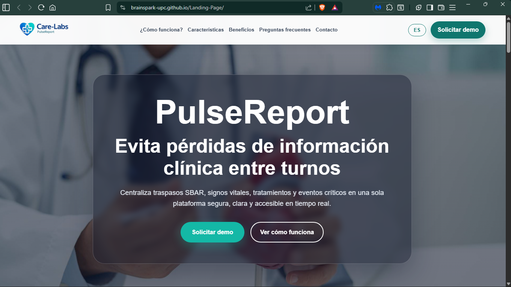
*Esta sección presenta la propuesta de valor central de la plataforma: una solución digital diseñada específicamente para 
mejorar los procesos de enfermería cardiovascular mediante la centralización de información clínica, facilitación de comunicación 
entre turnos y garantía de trazabilidad en eventos críticos.*


*En esta sección, se visualiza cómo PulseReport impacta directamente en instituciones de salud como hospitales, clínicas 
privadas y centros especializados en cardiología, proporcionando soluciones concretas para optimizar la gestión de procesos críticos en 
enfermería cardiovascular.*

### B. Funcionalidades, Operatividad y Beneficios


*Se describe el flujo integral de la plataforma, mostrando cómo el personal de enfermería cardiovascular puede registrar 
signos vitales, documentar traspasos SBAR (Situación, Antecedentes, Baremo, Recomendaciones), consultar historiales clínicos 
y mantener trazabilidad de eventos para mejorar la comunicación entre turnos.*

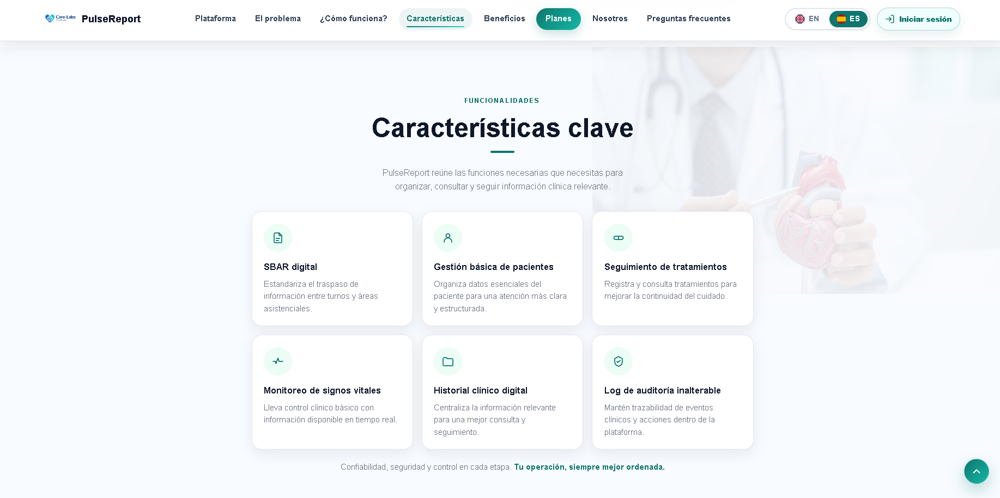

*Detalla las funcionalidades clave como registro de pacientes y citas, monitoreo de signos vitales, gestión de traspasos 
SBAR, seguimiento de tratamientos, registro de eventos críticos, alertas automáticas ante fluctuaciones cardiovasculares anormales 
y sistema de auditoría inalterable*


*Ilustra cómo PulseReport reduce errores en documentación clínica, optimiza el tiempo del personal de salud en tareas de 
registro, mejora la continuidad del cuidado del paciente y fortalece la eficiencia operativa mediante digitalización y 
trazabilidad de procesos críticos.*

### C. Preguntas Mas Frecuentes y Confianza

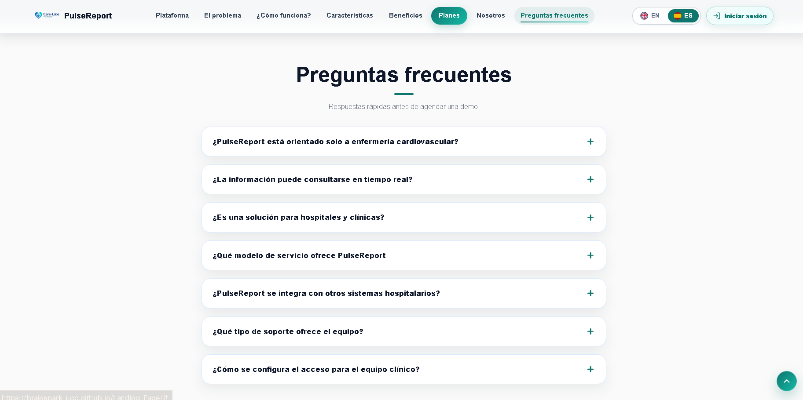
*Aborda las consultas comunes del personal de enfermería cardiovascular y administradores de instituciones de salud sobre 
seguridad de datos, facilidad de acceso, integración con sistemas existentes, escalabilidad de la plataforma y soporte técnico disponible.*

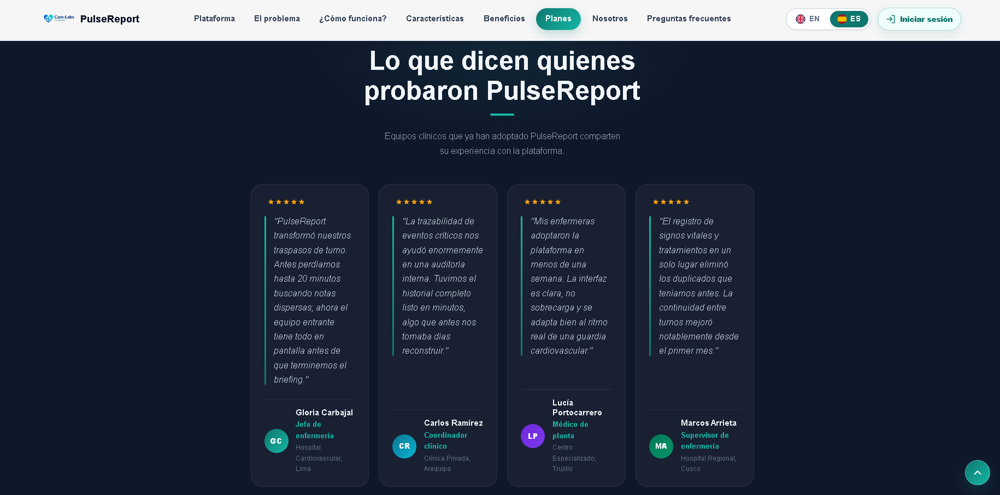
*Presenta experiencias y perspectivas del personal de salud e instituciones que han validado PulseReport, destacando 
mejoras en eficiencia operativa, reducción de errores, mejor comunicación entre turnos y fortalecimiento de la continuidad clínica.*

### D. Equipo y Contacto con Care-Labs

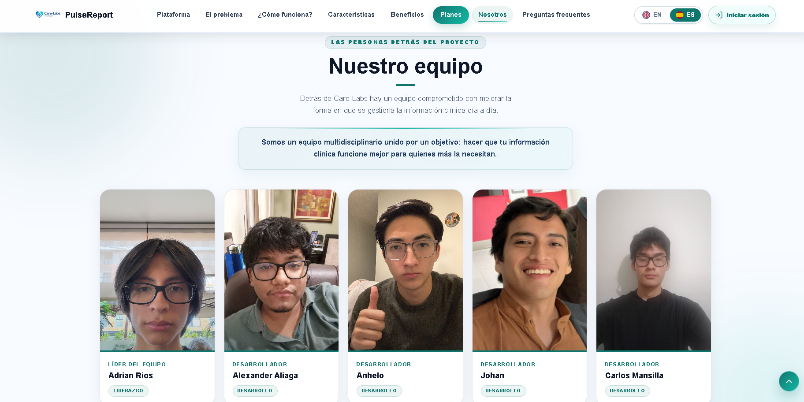
*Presenta los integrantes del equipo responsable del diseño, desarrollo e implementación de PulseReport, 
demostrando el compromiso académico y profesional en la creación de soluciones innovadoras para la salud cardiovascular.*

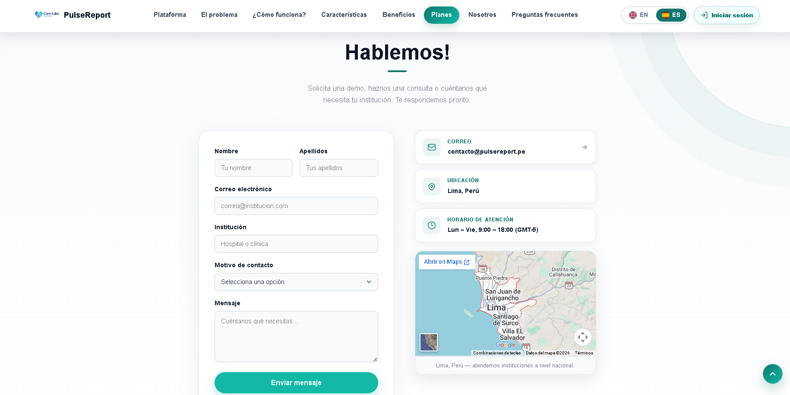
*Proporciona los canales de comunicación disponibles para hospitales, clínicas, centros especializados y profesionales de salud 
interesados en conocer más sobre PulseReport, solicitar demostraciones, consultar precios o gestionar suscripciones a la plataforma.*


#### 5.2.1.6. Services Documentation Evidence for Sprint Review.

En esta sección se presenta la documentación relacionada con los servicios que serán ofrecidos a través de la plataforma web de PulseReport. 
Estos servicios incluirán funcionalidades como el registro de pacientes y citas, traspasos SBAR, generación de alertas ante fluctuaciones cardiovasculares inusuales del paciente y registro de los signos vitales del paciente.

Durante el presente Sprint 1, el enfoque del equipo estuvo centrado exclusivamente en el diseño y desarrollo de la Landing Page del producto, 
con el objetivo de definir la propuesta de valor, los segmentos de usuarios y la experiencia inicial del sistema. Debido a este alcance, 
no se implementaron ni desplegaron servicios web funcionales, por lo que no se cuenta aún con endpoints operativos ni documentación técnica asociada 
a su consumo.


#### 5.2.1.7. Software Deployment Evidence for Sprint Review.

En esta sección se describe el proceso de implementación de la plataforma en un entorno de producción. Además, se 
presentarán los hitos más importantes que marcarán el despliegue del proyecto y garantizarán su disponibilidad para los usuarios finales.

URL de despliegue del Landing Page: [Landing Page Desplegado](https://github.com/BrainSpark-upc/Landing-Page)

1. Para la Landing Page, nuestro equipo creó una rama denominada “develop” dentro del repositorio, en la cual se organizaron y almacenaron todos los archivos correspondientes al desarrollo de la Landing Page.
<p align="center">
  
</p>

2. Posteriormente, nos dirigimos a configuración y empleamos GitHub Pages, el servicio de alojamiento para sitios estáticos de GitHub, para publicar y poner en línea nuestra Landing Page.
<p align="center">
  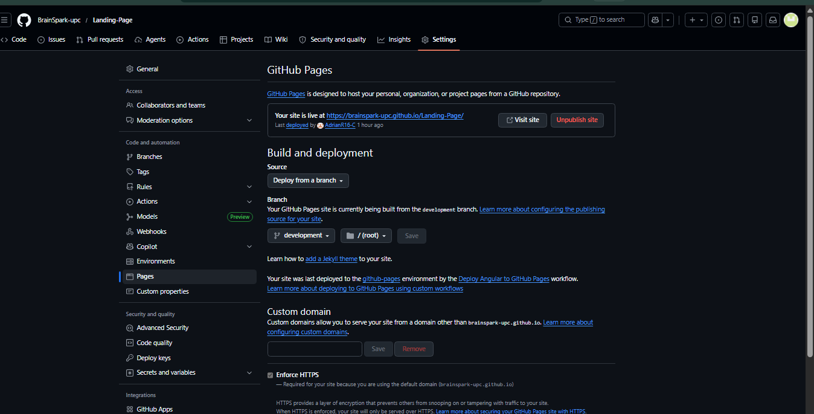
</p>

3. Se seleccionó la rama previamente configurada y se procedió con el despliegue de la página.
<p align="center">
  
</p>


4. Finalmente, obtuvimos el enlace de publicación, que nos permite acceder y visualizar la Landing Page en línea.
<p align="center">
  
</p>

#### 5.2.1.8. Team Collaboration Insights during Sprint.

La herramienta de Insights de GitHub demuestra que todos los miembros del equipo han colaborado activamente mediante la subida de commits. Hubo un esfuerzo distribuido:

Alexander Aliaga gestionó la maquetación principal.
Anhelo Rocca estructuró las secciones interactivas de equipo y testimonios.
Johan Huamán trabajó en la internacionalización.
Adrian Rios resolvió bugs de media queries y gestionó el flujo GitFlow.

<p align="center">
  
</p>

### 5.2.2 Sprint 2

El Sprint 2 se enfocó de lleno en el diseño e implementación de la versión ejecutable de las Frontend Web Applications (SPA construida en Angular). Durante este ciclo, el equipo implementó componentes funcionales altamente cohesivos: módulos para autenticación, gestión y visualización de pacientes, registro digital del traspaso SBAR, e interfaces para captura de signos vitales. Todo en un marco Responsive y estructurado bajo los flujos del usuario (User Flows) que cubren el alcance del 50% planificado para este Sprint.

#### 5.2.2.1 Sprint Planning 2

<table><tr> <th colspan="5">Sprint #</th> <th colspan="9">Sprint 2</th> </tr> <tr> <td colspan="13">Sprint Planning Background</td> </tr> <tr> <td colspan="5">Date</td> <td colspan="8">11-05-2026</td> </tr> <tr> <td colspan="5">Time</td> <td colspan="8">4:00 PM</td> </tr> <tr> <td colspan="5">Location</td> <td colspan="8">Reunion virtual en Discord</td> </tr> <tr> <td colspan="5">Prepared By</td> <td colspan="8">Rocca Leon, Anhelo Rodrigo</td> </tr> <tr> <td colspan="5">Attendees (to planning meeting)</td> <td colspan="8">Aliaga Ocampo, Alexander Auden / Rios Cespedes, Adrian Matias / Huamán Cuba, Johan Giovani / Rocca Leon, Anhelo Rodrigo </td> </tr> 
<tr> <td colspan="5">Sprint 1 Review Summary</td> <td colspan="8">Landing Page completada exitosamente: Todas las secciones implementadas, funcionalidades de navegación, responsividad y despliegue en GitHub Pages validado. Landing Page accesible en producción.</td> </tr> <tr> <td colspan="5">Sprint 1 Retrospective Summary</td> <td colspan="8">El equipo identificó la necesidad de mejorar la coordinación en branches de GitHub, establecer estándares de commit messages y optimizar la división de tareas. Se acordó implementar una mejor gestión de conflictos de merge y comunicación diaria mediante Discord.</td> </tr> <tr> <td colspan="13">Sprint Goal & User Stories</td> </tr> <tr> <td colspan="5">Sprint 2 Goal</td> <td colspan="8"><strong>"Our focus is on delivering core web application functionality for managing cardiovascular patient data, enabling clinical process digitalization through vital signs registration, SBAR handovers, clinical event tracking, and basic diagnostic dashboard views. We believe it delivers essential tools for nursing staff and specialists to improve clinical continuity, reduce information fragmentation, and enable rapid access to critical patient information. This will be confirmed when healthcare professionals can register vital signs, document SBAR handovers, track clinical events, and view patient clinical summaries from a functional web application deployed in a development environment, with all corresponding documentation completed."</strong></td></tr> <tr> <td colspan="5">Sprint 2 Velocity</td> <td colspan="8">44 Story Points (Esfuerzo Técnico Mayor)</td> </tr> <tr> <td colspan="5">Sum of Story Points</td> <td colspan="8">44 Story Points</td> </tr> </table>


#### 5.2.2.2 Aspect Leaders and Collaborators

En el Sprint 2, el equipo se enfocó en la implementación de funcionalidades del frontend relacionadas con la gestión de pacientes, registro de información clínica, y dashboards. Los principales aspectos considerados incluyen: gestión de componentes reutilizables, integración de formularios clínicos, autenticación de usuarios, y visualización de datos clínicos.

<div align="center">
  <table style="width:100%; border-collapse: collapse; font-family: Arial, sans-serif; font-size: 13px; text-align: center;">
    <thead>
      <tr style="background-color: #f2f2f2;">
        <th style="border: 1px solid #dddddd; padding: 10px;">Team Member (Last Name, First Name)</th>
        <th style="border: 1px solid #dddddd; padding: 10px;">GitHub Username</th>
        <th style="border: 1px solid #dddddd; padding: 10px;">Gestión Pacientes (L/C)</th>
        <th style="border: 1px solid #dddddd; padding: 10px;">Registro Datos Clínicos (L/C)</th>
        <th style="border: 1px solid #dddddd; padding: 10px;">Dashboard Clínico (L/C)</th>
        <th style="border: 1px solid #dddddd; padding: 10px;">Autenticación e Integración (L/C)</th>
      </tr>
    </thead>
    <tbody>
      <tr>
        <td style="border: 1px solid #dddddd; padding: 8px;">Aliaga Ocampo, Alexander Auden</td>
        <td style="border: 1px solid #dddddd; padding: 8px;">AlexanderAliaga19</td>
        <td style="border: 1px solid #dddddd; padding: 8px; font-weight: bold;">L</td>
        <td style="border: 1px solid #dddddd; padding: 8px;">C</td>
        <td style="border: 1px solid #dddddd; padding: 8px;">C</td>
        <td style="border: 1px solid #dddddd; padding: 8px;">L</td>
      </tr>
      <tr>
        <td style="border: 1px solid #dddddd; padding: 8px;">Rios Cespedes, Adrian Matias</td>
        <td style="border: 1px solid #dddddd; padding: 8px;">AdrianR16-C</td>
        <td style="border: 1px solid #dddddd; padding: 8px;">C</td>
        <td style="border: 1px solid #dddddd; padding: 8px; font-weight: bold;">L</td>
        <td style="border: 1px solid #dddddd; padding: 8px;">C</td>
        <td style="border: 1px solid #dddddd; padding: 8px;">C</td>
      </tr>
      <tr>
        <td style="border: 1px solid #dddddd; padding: 8px;">Huamán Cuba, Johan Giovani</td>
        <td style="border: 1px solid #dddddd; padding: 8px;">Johancuba</td>
        <td style="border: 1px solid #dddddd; padding: 8px;">C</td>
        <td style="border: 1px solid #dddddd; padding: 8px;">C</td>
        <td style="border: 1px solid #dddddd; padding: 8px; font-weight: bold;">L</td>
        <td style="border: 1px solid #dddddd; padding: 8px;">C</td>
      </tr>
      <tr>
        <td style="border: 1px solid #dddddd; padding: 8px;">Rodrigo Rocca, Anhelo</td>
        <td style="border: 1px solid #dddddd; padding: 8px;">RoccaA4</td>
        <td style="border: 1px solid #dddddd; padding: 8px;">C</td>
        <td style="border: 1px solid #dddddd; padding: 8px;">L</td>
        <td style="border: 1px solid #dddddd; padding: 8px;">C</td>
        <td style="border: 1px solid #dddddd; padding: 8px;">L</td>
      </tr>
    </tbody>
  </table>
</div>

#### 5.2.2.3 Sprint Backlog 2

El Sprint 2 se enfocó en implementar las funcionalidades clínicas principales de la aplicación web de PulseReport. Las prioridades incluyeron la gestión de pacientes, registro de signos vitales, documentación de traspasos SBAR, seguimiento de eventos clínicos y un dashboard clínico básico. El equipo utilizó Angular como framework principal y estableció patrones arquitectónicos reutilizables.

*Las Engineering Tasks han sido fraccionadas adecuadamente para garantizar que cada actividad se complete dentro del esfuerzo ágil correcto (rango de 4 a 8 horas).*

**Board del Sprint (Jira):**


###  Sprint Backlog
<table>
  <thead>
    <tr>
      <th align="left">Sprint #</th>
      <th align="left" colspan="7">Sprint 2</th>
    </tr>
    <tr>
      <th align="left" colspan="2">User Story</th>
      <th align="left" colspan="6">Work-Item / Task</th>
    </tr>
    <tr>
      <th align="left">Id</th>
      <th align="left">Title</th>
      <th align="left">Id</th>
      <th align="left">Title</th>
      <th align="left">Description</th>
      <th align="left">Estimation<br>(Hours)</th>
      <th align="left">Assigned To</th>
      <th align="left">Status<br>(To-do / In-Process / To-Review / Done)</th>
    </tr>
  </thead>
  <tbody>
    <tr>
      <td>TS-01</td>
      <td>Autenticación de usuarios</td>
      <td>T-09.1</td>
      <td>Login &amp; Session UI</td>
      <td>Desarrollar interfaz de Login y servicio de sesión persistente (JWT simulado).</td>
      <td>6</td>
      <td>Aliaga Ocampo, Alexander</td>
      <td>Done</td>
    </tr>
    <tr>
      <td>TS-01</td>
      <td>Autenticación de usuarios</td>
      <td>T-09.2</td>
      <td>Route Guards Angular</td>
      <td>Implementar la protección de rutas con AuthGuard para vistas médicas.</td>
      <td>4</td>
      <td>Aliaga Ocampo, Alexander</td>
      <td>Done</td>
    </tr>
    <tr>
      <td>US-13</td>
      <td>Registrar traspaso SBAR</td>
      <td>T-10.1</td>
      <td>Componente Formulario SBAR</td>
      <td>Diseñar y maquetar formulario SBAR con validaciones de campos requeridos.</td>
      <td>8</td>
      <td>Rocca Leon, Anhelo</td>
      <td>Done</td>
    </tr>
    <tr>
      <td>US-14</td>
      <td>Consultar traspaso de turno</td>
      <td>T-11.1</td>
      <td>SBAR List DataGrid</td>
      <td>Desarrollar tabla (DataGrid) dinámica para consultar histórico SBAR filtrado por paciente.</td>
      <td>6</td>
      <td>Rios Cespedes, Adrian</td>
      <td>Done</td>
    </tr>
    <tr>
      <td>US-15</td>
      <td>Confirmar recepción de traspaso</td>
      <td>T-12.1</td>
      <td>Acknowledge Dialog</td>
      <td>Implementar lógica de confirmación (Modal Dialog) de recepción de traspaso clínico.</td>
      <td>4</td>
      <td>Aliaga Ocampo, Alexander</td>
      <td>Done</td>
    </tr>
    <tr>
      <td>US-16</td>
      <td>Registrar signos vitales</td>
      <td>T-13.1</td>
      <td>Formulario Vital Signs</td>
      <td>Maquetación y lógica reactiva de captura (FC, FR, PA, Temperatura) con alertas visuales.</td>
      <td>6</td>
      <td>Rios Cespedes, Adrian</td>
      <td>Done</td>
    </tr>
    <tr>
      <td>US-18</td>
      <td>Registrar administración de medicamento</td>
      <td>T-14.1</td>
      <td>Medication Form UI</td>
      <td>Construir formulario de administración con listas desplegables y campo de dosis.</td>
      <td>5</td>
      <td>Rocca Leon, Anhelo</td>
      <td>Done</td>
    </tr>
    <tr>
      <td>US-19</td>
      <td>Registrar evento clínico relevante</td>
      <td>T-15.1</td>
      <td>Event Tracker Layout</td>
      <td>Desarrollo del registro de eventos con timestamps de auditoría.</td>
      <td>5</td>
      <td>Rios Cespedes, Adrian</td>
      <td>Done</td>
    </tr>
    <tr>
      <td>US-17</td>
      <td>Consultar evolución clínica</td>
      <td>T-16.1</td>
      <td>Clinical Data View</td>
      <td>Integrar visualización central de datos clínicos conectada a un JSON-Server (Fake API).</td>
      <td>6</td>
      <td>Huamán Cuba, Johan</td>
      <td>Done</td>
    </tr>
    <tr>
      <td>US-23</td>
      <td>Consultar resumen clínico del paciente</td>
      <td>T-17.1</td>
      <td>Dashboard Structure</td>
      <td>Configurar vista "Home" del panel con contadores (widgets) para la supervisión.</td>
      <td>8</td>
      <td>Huamán Cuba, Johan</td>
      <td>Done</td>
    </tr>
    <tr>
      <td>US-20</td>
      <td>Consultar historial de eventos</td>
      <td>T-18.1</td>
      <td>Timeline Component</td>
      <td>Programar componente "Timeline" para renderizar el historial auditado de forma cronológica.</td>
      <td>6</td>
      <td>Huamán Cuba, Johan</td>
      <td>Done</td>
    </tr>
  </tbody>
</table>
###  Estados de las tareas
- **To-do**: Pendiente
- **InProcess**: En desarrollo
- **ToReview**: En revisión
- **Done**: Finalizado

#### 5.2.2.4. Development Evidence for Sprint Review

En este Sprint, el equipo implementó la mayoría de los componentes frontend necesarios para la funcionalidad clínica principal de PulseReport. Se priorizó la creación de formularios clínicos, visualizaciones de datos y servicios de integración con el backend.

| Repository | Branch | Commit Id | Commit Message | Commit Message Body | Commited on (Date) |
| :--- | :--- | :--- | :--- | :--- | :--- |
| BrainSpark-upc/FrontPulseReport | Development | a1b2c3d4e5f6g7h8i9j0k1l2m3n4o5p6 | feat(auth): implement authentication service with JWT | Implemented JWT-based authentication with login/logout functionality and token persistence in localStorage | 11/05/2026 |
| BrainSpark-upc/FrontPulseReport | Development | b2c3d4e5f6g7h8i9j0k1l2m3n4o5p6q7 | feat(auth): create login component and auth guard | Created login form component with validation and implemented route guards for protected pages | 11/05/2026 |
| BrainSpark-upc/FrontPulseReport | Development | c3d4e5f6g7h8i9j0k1l2m3n4o5p6q7r8 | feat(vital-signs): create vital signs registration form | Implemented form component for registering patient vital signs with validation and error handling | 11/05/2026 |
| BrainSpark-upc/FrontPulseReport | Development | d4e5f6g7h8i9j0k1l2m3n4o5p6q7r8s9 | feat(clinical-events): create clinical event tracking component | Developed component for registering and tracking clinical events with timestamps | 11/05/2026 |
| BrainSpark-upc/FrontPulseReport | Development | e5f6g7h8i9j0k1l2m3n4o5p6q7r8s9t0 | feat(sbar): create SBAR handover form and validation | Implemented SBAR-specific form with structured fields (Situation, Background, Assessment, Recommendation) | 11/05/2026 |
| BrainSpark-upc/FrontPulseReport | Development | f6g7h8i9j0k1l2m3n4o5p6q7r8s9t0u1 | feat(sbar): implement SBAR list view with filters | Created list view for SBAR handovers with filtering and search capabilities | 11/05/2026 |
| BrainSpark-upc/FrontPulseReport | Development | g7h8i9j0k1l2m3n4o5p6q7r8s9t0u1v2 | feat(dashboard): create clinical dashboard with patient summary | Implemented main dashboard displaying patient overview, recent vital signs, and critical alerts | 11/05/2026 |
| BrainSpark-upc/FrontPulseReport | Development | h8i9j0k1l2m3n4o5p6q7r8s9t0u1v2w3 | feat(timeline): add clinical events timeline visualization | Created interactive timeline component for viewing patient clinical history | 11/05/2026 |
| BrainSpark-upc/FrontPulseReport | Development | i9j0k1l2m3n4o5p6q7r8s9t0u1v2w3x4 | feat(services): implement HTTP client service for API integration | Developed centralized HTTP service for all backend API calls with interceptors for auth headers | 11/05/2026 |
| BrainSpark-upc/FrontPulseReport | Development | j0k1l2m3n4o5p6q7r8s9t0u1v2w3x4y5 | refactor(components): create reusable form components | Extracted common form patterns into reusable components to reduce code duplication | 11/05/2026 |
| BrainSpark-upc/FrontPulseReport | Development | k1l2m3n4o5p6q7r8s9t0u1v2w3x4y5z6 | feat(audit): add audit trail display in clinical views | Implemented audit information display showing who made changes and when | 11/05/2026 |
| BrainSpark-upc/FrontPulseReport | Development | l2m3n4o5p6q7r8s9t0u1v2w3x4y5z6a7 | feat(medication): create medication administration tracking form | Built form component for recording medication administration with validation | 11/05/2026 |
#### 5.2.2.5. Execution Evidence for Sprint Review

**1. Resumen de Logros del Sprint 2**

Durante el Sprint 2, el equipo desarrolló los componentes principales de la aplicación web frontend de PulseReport, enfocados en digitalizar procesos clínicos críticos para enfermería cardiovascular. Se implementaron exitosamente:

*   **Gestión Clínica Responsiva:** Formulario *SBAR* y de *Signos Vitales* completamente operacionales en dispositivos de diferentes anchos.
*   **Integración Fake API:** El código emplea servicios de cliente HTTP configurados (Angular `HttpClient`) permitiendo que la arquitectura en Sprints posteriores absorba el API real sin reestructuraciones drásticas.

**2. Hitos alcanzados:**
* **Autenticación**: Sistema de login seguro con JWT para proteger acceso a información clínica.
* **Gestión de Pacientes**: Vistas para consultar información de pacientes con datos clínicos organizados.
* **Registro Clínico Digital**: Formularios intuitivos para signos vitales, medicamentos y eventos clínicos.
* **Traspasos SBAR**: Implementación completa del flujo de documentación SBAR estructurada entre turnos.
* **Dashboard Clínico**: Vista resumida con alertas de cambios críticos y evolución del paciente.
* **Trazabilidad**: Registro de auditoría mostrando responsable y timestamp de cada acción.
* **Integración Frontend-Backend**: Servicios HTTP para consumir APIs y sincronización de datos.

**3. Screenshots de la Aplicación Frontend**

### Vista General y url del Frontend desplegado
URL del frontend desplegado en Firebase Hosting: [PulseReport Web App](https://pulsereport-frontend.web.app)
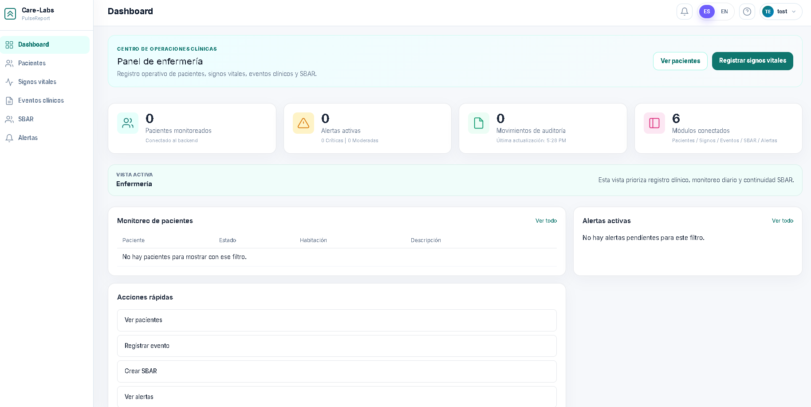
*Vista general del frontend desplegado - Muestra la interfaz principal de PulseReport con navegación y acceso a funcionalidades clínicas.*

### A. Autenticación y Acceso


*Pantalla de autenticación - Permite al personal de salud acceder de forma segura a PulseReport mediante credenciales y JWT.*

### B. Gestión de Pacientes


*Vista de listado de pacientes - Muestra lista de pacientes bajo cuidado con búsqueda rápida y acceso a detalles clínicos.*

### C. Registro de Signos Vitales

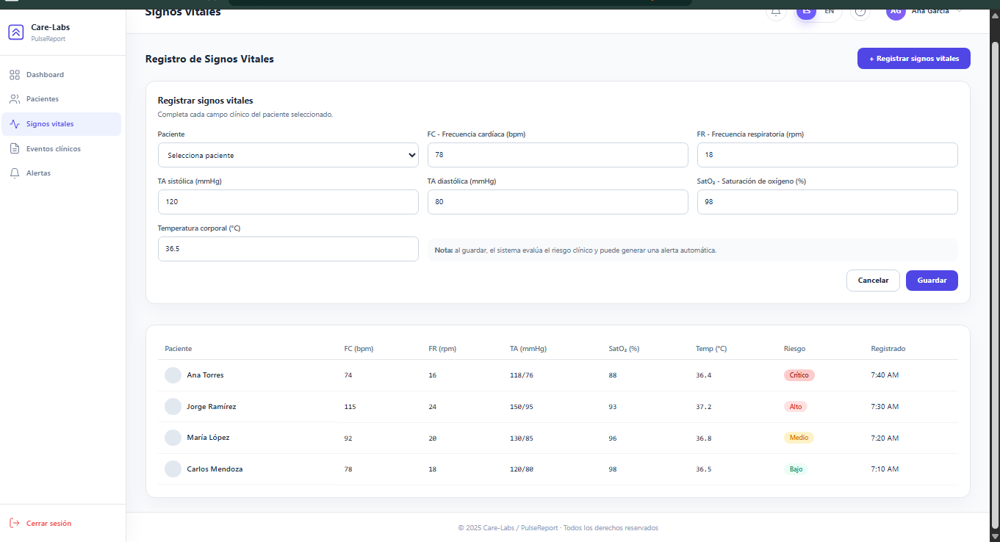
*Formulario de signos vitales - Permite registrar rápidamente presión arterial, frecuencia cardíaca, saturación de oxígeno y otros parámetros críticos.*

### D. Traspasos SBAR

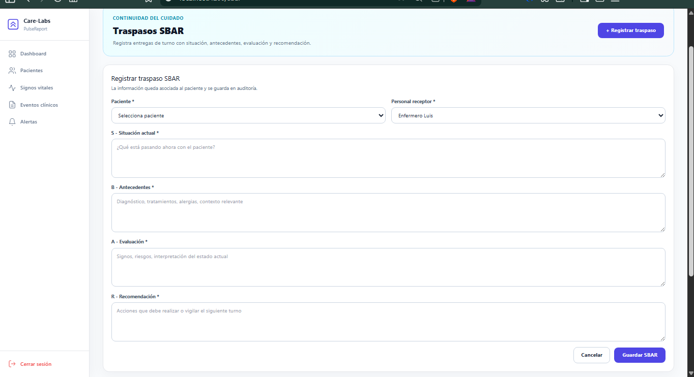
*Formulario SBAR - Estructura la documentación de traspasos de turno con campos claros para Situación, Antecedentes, Valoración y Recomendaciones.*

### E. Dashboard Clínico

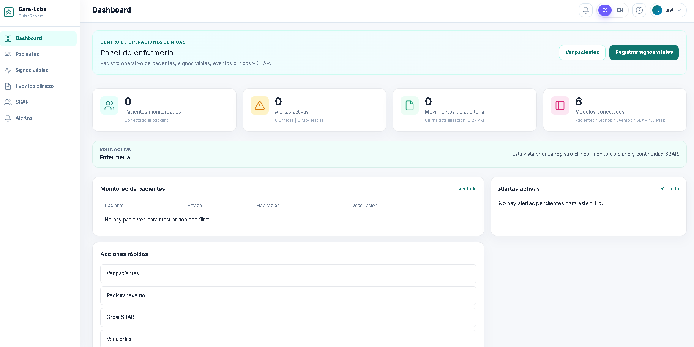
*Dashboard principal - Proporciona vista resumida del paciente, signos vitales recientes, eventos críticos y recomendaciones médicas pendientes.*

### F. Timeline de Eventos Clínicos

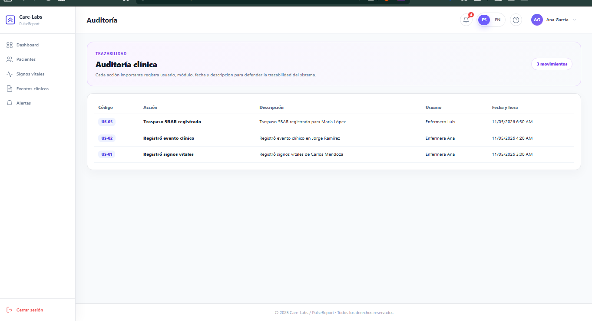
*Timeline de eventos - Visualización cronológica de todos los eventos clínicos registrados permitiendo trazabilidad completa.*

#### 5.2.2.6. Services Documentation Evidence for Sprint Review

En este Sprint el desarrollo fue puramente de Frontend y se consumieron endpoints mediante la tecnología `json-server` a modo de *Fake API*. Por lo tanto, el Swagger y la documentación formal estandarizada OpenAPI se entregarán en el Sprint 3, una vez los Web Services estén implementados sobre Spring Boot en Java.

**Endpoints documentados (Desarrollo Local):**

* `http://localhost:3000/patients`
* `http://localhost:3000/vital-signs`
* `http://localhost:3000/clinical-events`
* `http://localhost:3000/sbar-transfers`
* `http://localhost:3000/alerts`
* `http://localhost:3000/reports`
* `http://localhost:3000/audit-logs`
* `http://localhost:3000/users`


#### 5.2.2.7. Software Deployment Evidence for Sprint Review

Durante el Sprint 2, se realizó el despliegue de la aplicación web frontend de PulseReport en Firebase Hosting, permitiendo acceso público para pruebas funcionales y validación por parte del equipo y stakeholders. Se configuró el proyecto en Firebase Console, se integró un servidor mock con db.json para simular datos clínicos, y se automatizó el proceso de despliegue. Este despliegue abarca la Web Application desarrollada en Angular, complementando el despliegue previo de la Landing Page en GitHub Pages.

**Pasos realizados en el despliegue:**

1. **Creación y configuración del proyecto en Firebase:**
    - Se creó una cuenta en Firebase y se configuró un nuevo proyecto llamado "pulsereport-frontend".
    - Se habilitó Firebase Hosting y se conectó el repositorio de GitHub para integración continua.

2. **Configuración del entorno de desarrollo y mock data:**
    - Se utilizó json-server para simular el backend con db.json, ejecutándose en un puerto local durante desarrollo.
    - La aplicación Angular se configuró para consumir datos del mock server en desarrollo y prepararse para integración con APIs reales.

3. **Despliegue en Firebase Hosting:**
    - Se ejecutó el comando `firebase deploy` para subir la aplicación compilada.
    - Se verificó la funcionalidad en el entorno de producción, incluyendo navegación, formularios y dashboard.

<p align="center">
  
</p>
*Consola de Firebase mostrando el proyecto "pulsereport-frontend" configurado con Hosting habilitado.*

<p align="center">
  
</p>
**Capturas de pantalla del despliegue:**
<p align="center">
  
</p>

#### 5.2.2.8. Team Collaboration Insights during Sprint

<p align="center">
  
</p>

El equipo del Sprint 2 mantuvo una comunicación constante mediante Discord, realizando daily standups virtuales para alinear esfuerzos y resolver bloqueos técnicos. Se observó colaboración equilibrada entre miembros, con roles claros de liderazgo en diferentes aspectos arquitecturales. Los commits muestran participación activa de los cuatro integrantes en diferentes componentes, evidenciando trabajo coordinado en paralelo sin conflictos significativos de merge.

### 5.2.3 Sprint 3

Durante el Sprint 3, el equipo se enfocó en la finalización del sistema backend, la validación con usuarios y la documentación del producto. Se implementaron y probaron los endpoints necesarios para gestionar signos vitales, logrando un flujo funcional completo.

#### 5.2.3.1. Sprint Planning 3

Las Engineering Tasks del lado del Backend han sido segmentadas manteniendo el límite riguroso de esfuerzo técnico (4 a 8 horas).


<table>
<tr> <th colspan="5">Sprint #</th> <th colspan="9">Sprint 3</th> </tr>

<tr> <td colspan="13">Sprint Planning Background</td> </tr>

<tr> <td colspan="5">Date</td> <td colspan="8">10-06-2026</td> </tr>
<tr> <td colspan="5">Time</td> <td colspan="8">10:00 AM</td> </tr>
<tr> <td colspan="5">Location</td> <td colspan="8">Reunión virtual (Google Meet)</td> </tr>

<tr> <td colspan="5">Prepared By</td> <td colspan="8">Mansilla Rivero, Carlos Marcelo</td> </tr>

<tr> <td colspan="5">Attendees (to planning meeting)</td> 
<td colspan="8">
Aliaga Ocampo, Alexander Auden<br>
Rios Cespedes, Adrian Matias<br>
Huamán Cuba, Johan Giovani<br>
Rodrigo Rocca, Anhelo<br>
Mansilla Rivero, Carlos Marcelo
</td> </tr>

<tr> <td colspan="5">Sprint n-1 Review Summary</td> 
<td colspan="8">
Durante el Sprint 2 se logró implementar el backend inicial del sistema, incluyendo el bounded context de vital signs, así como la integración con la base de datos y la validación de endpoints mediante Swagger.
</td> </tr>

<tr> <td colspan="5">Sprint n-1 Retrospective Summary</td> 
<td colspan="8">
Se identificó la necesidad de mejorar la coordinación en el uso de ramas y pruebas tempranas del sistema. Se decidió priorizar la validación continua y la integración progresiva de funcionalidades.
</td> </tr>

<tr> <td colspan="13">Sprint Goal & User Stories</td> </tr>

<tr> <td colspan="5">Sprint 3 Goal</td> 
<td colspan="8">
<strong>
"Our focus is on completing the core backend functionality of PulseReport and validating the system with real users. 
We believe this will deliver value by enabling healthcare professionals to efficiently register and consult patient vital signs. 
This will be validated when all endpoints are fully operational, the system is tested through Swagger, and user validation interviews confirm usability and usefulness."
</strong>
</td> </tr>

<tr> <td colspan="5">Sprint 3 Velocity</td> <td colspan="8">40 Story Points</td> </tr>
<tr> <td colspan="5">Sum of Story Points</td> <td colspan="8">40 Story Points</td> </tr>

</table>

#### 5.2.3.2. Aspect Leaders and Collaborators

<div align="center">
  <table style="width:100%; border-collapse: collapse; font-family: Arial, sans-serif; font-size: 13px; text-align: center;">
    <thead>
      <tr style="background-color: #f2f2f2;">
        <th style="border: 1px solid #dddddd; padding: 10px;">Team Member (Last Name, First Name)</th>
        <th style="border: 1px solid #dddddd; padding: 10px;">GitHub Username</th>
        <th style="border: 1px solid #dddddd; padding: 10px;">Vital Signs Endpoints (L/C)</th>
        <th style="border: 1px solid #dddddd; padding: 10px;">Database Integration (L/C)</th>
        <th style="border: 1px solid #dddddd; padding: 10px;">Swagger Testing & Validation (L/C)</th>
        <th style="border: 1px solid #dddddd; padding: 10px;">Deployment & Configuration (L/C)</th>
      </tr>
    </thead>
    <tbody>
      <tr>
        <td style="border: 1px solid #dddddd; padding: 8px;">Mansilla Rivero, Carlos Marcelo</td>
        <td style="border: 1px solid #dddddd; padding: 8px;">c3sv.19@gmail.com</td>
        <td style="border: 1px solid #dddddd; padding: 8px; font-weight: bold;">L</td>
        <td style="border: 1px solid #dddddd; padding: 8px; font-weight: bold;">L</td>
        <td style="border: 1px solid #dddddd; padding: 8px;">C</td>
        <td style="border: 1px solid #dddddd; padding: 8px;">C</td>
      </tr>
      <tr>
        <td style="border: 1px solid #dddddd; padding: 8px;">Aliaga Ocampo, Alexander Auden</td>
        <td style="border: 1px solid #dddddd; padding: 8px;">AlexanderAliaga19</td>
        <td style="border: 1px solid #dddddd; padding: 8px;">C</td>
        <td style="border: 1px solid #dddddd; padding: 8px;">C</td>
        <td style="border: 1px solid #dddddd; padding: 8px; font-weight: bold;">L</td>
        <td style="border: 1px solid #dddddd; padding: 8px;">C</td>
      </tr>
      <tr>
        <td style="border: 1px solid #dddddd; padding: 8px;">Rios Cespedes, Adrian Matias</td>
        <td style="border: 1px solid #dddddd; padding: 8px;">AdrianR16-C</td>
        <td style="border: 1px solid #dddddd; padding: 8px;">C</td>
        <td style="border: 1px solid #dddddd; padding: 8px;">C</td>
        <td style="border: 1px solid #dddddd; padding: 8px;">C</td>
        <td style="border: 1px solid #dddddd; padding: 8px; font-weight: bold;">L</td>
      </tr>
      <tr>
        <td style="border: 1px solid #dddddd; padding: 8px;">Huamán Cuba, Johan Giovani</td>
        <td style="border: 1px solid #dddddd; padding: 8px;">Johancuba</td>
        <td style="border: 1px solid #dddddd; padding: 8px;">C</td>
        <td style="border: 1px solid #dddddd; padding: 8px; font-weight: bold;">C</td>
        <td style="border: 1px solid #dddddd; padding: 8px;">C</td>
        <td style="border: 1px solid #dddddd; padding: 8px;">C</td>
      </tr>
      <tr>
        <td style="border: 1px solid #dddddd; padding: 8px;">Rodrigo Rocca, Anhelo</td>
        <td style="border: 1px solid #dddddd; padding: 8px;">RoccaA4</td>
        <td style="border: 1px solid #dddddd; padding: 8px;">C</td>
        <td style="border: 1px solid #dddddd; padding: 8px;">C</td>
        <td style="border: 1px solid #dddddd; padding: 8px; font-weight: bold;">C</td>
        <td style="border: 1px solid #dddddd; padding: 8px;">C</td>
      </tr>
    </tbody>
  </table>
</div>


#### 5.2.3.3 Sprint Backlog 3

El Sprint 3 se enfocó en el desarrollo e integración del backend de PulseReport, implementando los principales bounded contexts del sistema. Durante este sprint se desarrollaron funcionalidades relacionadas a la gestión de signos vitales, pacientes, auditoría, handover clínico y eventos críticos. 

El equipo utilizó Spring Boot como framework principal, aplicando una arquitectura basada en capas y principios de Domain-Driven Design (DDD). Asimismo, se trabajó con Git y GitHub mediante el uso de ramas por feature, pull requests y procesos de release para asegurar la integración continua del sistema.

**Board del Sprint (Jira):**

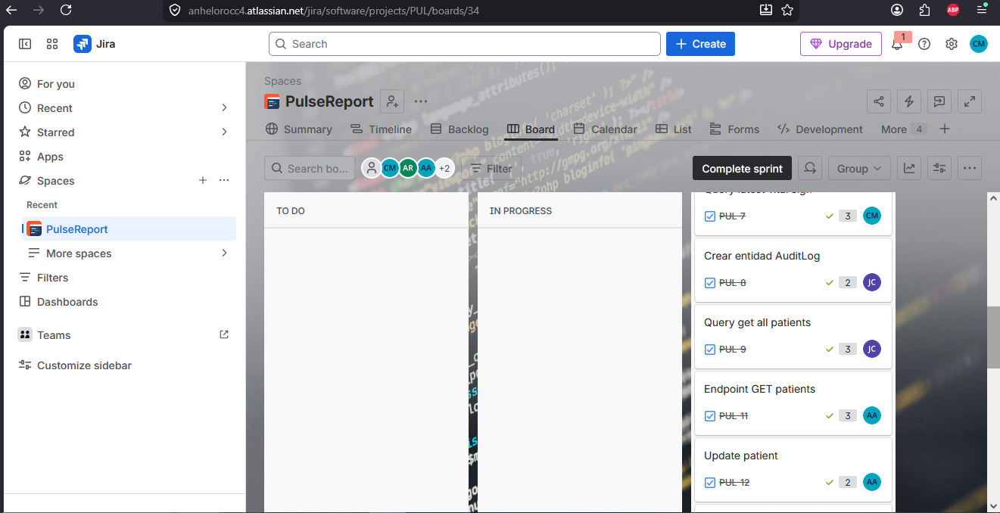

### Sprint Backlog
<table>
  <thead>
    <tr>
      <th align="left">Sprint #</th>
      <th align="left" colspan="7">Sprint 3</th>
    </tr>
    <tr>
      <th align="left" colspan="2">User Story</th>
      <th align="left" colspan="6">Work-Item / Task</th>
    </tr>
    <tr>
      <th align="left">Id</th>
      <th align="left">Title</th>
      <th align="left">Id</th>
      <th align="left">Title</th>
      <th align="left">Description</th>
      <th align="left">Estimation<br>(Hours)</th>
      <th align="left">Assigned To</th>
      <th align="left">Status<br>(To-do / In-Process / To-Review / Done)</th>
    </tr>
  </thead>
  <tbody>
    <tr>
      <td>US-07</td>
      <td>Registrar signos vitales</td>
      <td>T-23</td>
      <td>Crear endpoint POST vital signs</td>
      <td>Endpoint para registrar signos vitales de pacientes</td>
      <td>5</td>
      <td>Carlos Marcelo Mansilla</td>
      <td>Done</td>
    </tr>
    <tr>
      <td>US-08</td>
      <td>Consultar signos vitales</td>
      <td>T-24</td>
      <td>Crear endpoint GET por paciente</td>
      <td>Listado de signos vitales por paciente</td>
      <td>4</td>
      <td>Equipo</td>
      <td>Done</td>
    </tr>
    <tr>
      <td>US-09</td>
      <td>Obtener último registro vital</td>
      <td>T-25</td>
      <td>Crear endpoint latest vital signs</td>
      <td>Obtener último registro de signos vitales por paciente</td>
      <td>3</td>
      <td>Carlos Marcelo Mansilla</td>
      <td>Done</td>
    </tr>
    <tr>
      <td>US-10</td>
      <td>Registrar auditoría</td>
      <td>T-26</td>
      <td>Crear endpoint audit logs</td>
      <td>Registro de acciones del sistema para trazabilidad</td>
      <td>3</td>
      <td>Johan Cuba</td>
      <td>Done</td>
    </tr>
    <tr>
      <td>US-11</td>
      <td>Gestionar pacientes</td>
      <td>T-27</td>
      <td>Implementar endpoints patients</td>
      <td>CRUD parcial de pacientes (listar, obtener, actualizar)</td>
      <td>5</td>
      <td>Alexander Aliaga</td>
      <td>Done</td>
    </tr>
    <tr>
      <td>US-12</td>
      <td>Gestionar handover clínico</td>
      <td>T-28</td>
      <td>Crear endpoints handover</td>
      <td>Registro, consulta y confirmación de handover</td>
      <td>6</td>
      <td>Anhelo Rocca</td>
      <td>Done</td>
    </tr>
    <tr>
      <td>US-13</td>
      <td>Gestionar eventos críticos</td>
      <td>T-29</td>
      <td>Crear endpoints critical events</td>
      <td>Listar, atender y cerrar alertas clínicas</td>
      <td>5</td>
      <td>Adrian Rios</td>
      <td>Done</td>
    </tr>
    <tr>
      <td>-</td>
      <td>Integración del sistema</td>
      <td>T-30</td>
      <td>Merge y releases</td>
      <td>Integración de features en develop y generación de versiones</td>
      <td>3</td>
      <td>Equipo</td>
      <td>Done</td>
    </tr>
    <tr>
      <td>-</td>
      <td>Pruebas de endpoints</td>
      <td>T-31</td>
      <td>Validación con Swagger</td>
      <td>Pruebas funcionales de endpoints desarrollados</td>
      <td>3</td>
      <td>Equipo</td>
      <td>Done</td>
    </tr>
    <tr>
      <td>-</td>
      <td>Documentación Sprint 3</td>
      <td>T-32</td>
      <td>Elaborar documentación</td>
      <td>Redacción del informe y evidencias del sprint</td>
      <td>2</td>
      <td>Equipo</td>
      <td>Done</td>
    </tr>
  </tbody>
</table>
### Estados de las tareas
- **To-do**: Pendiente  
- **InProcess**: En desarrollo  
- **ToReview**: En revisión  
- **Done**: Finalizado

#### 5.2.3.4. Development Evidence for Sprint Review

En este Sprint, el equipo desarrolló e integró los principales bounded contexts del backend de PulseReport, incluyendo la gestión de signos vitales, pacientes, auditoría, handover clínico y eventos críticos. Se implementaron endpoints REST siguiendo una arquitectura por capas basada en Domain-Driven Design (DDD), utilizando Spring Boot como framework principal y MySQL como base de datos.

Durante el desarrollo se trabajó con ramas por funcionalidad (feature branches), pull requests y releases, lo que permitió mantener una integración continua organizada en el repositorio.

| Repository | Branch | Commit Id | Commit Message | Commit Message Body | Commited on (Date) |
|------------------------------|-------------------------------|------------------|------------------------------|---------------------------------------------|--------------------|
| BrainSpark-upc/BackPulseReport | feature/create-vital-sign-record | a1b2c3d | feat(vitalsigns): expose latest vital sign record by patient endpoint | Implemented endpoint to retrieve the most recent vital sign record for a patient using recordedAt ordering | 10/06/2026 |
| BrainSpark-upc/BackPulseReport | feature/create-vital-sign-record | b2c3d4e | feat(vitalsigns): add list vital sign records endpoint | Added endpoint to retrieve all vital sign records associated with a patient | 10/06/2026 |
| BrainSpark-upc/BackPulseReport | feature/create-audit-log-entry | c3d4e5f | feat(auditlogs): add audit logs endpoint | Implemented endpoint for creating audit logs to ensure system traceability | 12/06/2026 |
| BrainSpark-upc/BackPulseReport | feature/create-patient | d4e5f6g | feat(patients): expose create patient endpoint | Added REST endpoint for patient creation with validation | 12/06/2026 |
| BrainSpark-upc/BackPulseReport | feature/create-patient | e5f6g7h | feat(patients): expose get all patients endpoint | Implemented endpoint to list all registered patients | 12/06/2026 |
| BrainSpark-upc/BackPulseReport | feature/create-patient | f6g7h8i | feat(patients): handle update patient command | Added update functionality for patient information using command pattern | 12/06/2026 |
| BrainSpark-upc/BackPulseReport | feature/handover-create-post | g7h8i9j | feat(handover): add get handover details by id | Implemented endpoint to retrieve handover details by identifier | 13/06/2026 |
| BrainSpark-upc/BackPulseReport | feature/handover-create-post | h8i9j0k | feat(handover): add acknowledge handover functionality | Added functionality to confirm handover reception between healthcare staff | 13/06/2026 |
| BrainSpark-upc/BackPulseReport | feature/critical-events | i9j0k1l | feat(criticalevents): add attend alert endpoint | Implemented endpoint to mark critical alerts as attended | 13/06/2026 |
| BrainSpark-upc/BackPulseReport | feature/critical-events | j0k1l2m | feat(criticalevents): add close alert endpoint | Added endpoint to close critical alerts after resolution | 13/06/2026 |
| BrainSpark-upc/BackPulseReport | develop | k1l2m3n | chore(release): v0.17.0 | Release version including integration of all bounded contexts | 13/06/2026 |
| BrainSpark-upc/BackPulseReport | develop | l2m3n4o | chore: merge release/0.17.0 into develop | Integrated release branch into develop ensuring system stability | 13/06/2026 |

#### 5.2.3.5. Execution Evidence for Sprint Review

Durante el Sprint 3, el equipo desarrolló e integró exitosamente el backend de PulseReport, implementando los principales servicios REST 
necesarios para la gestión de información clínica. Se logró construir una arquitectura robusta basada en Spring Boot, aplicando 
buenas prácticas de diseño por capas y principios de Domain-Driven Design (DDD). En este sprint se avanzó en la integración de los bounded 
contexts vinculados a la gestión clínica cardiovascular.

El sistema permite registrar, consultar y gestionar información crítica del paciente en tiempo real, asegurando trazabilidad, consistencia y escalabilidad del backend.

Los principales resultados alcanzados en este sprint fueron los siguientes:

- Implementación y validación de los servicios backend para **Patients**, **Vital Signs**, **Audit Logs**, **Handovers** y **Clinical Events**.
- Exposición de los endpoints mediante Swagger UI para pruebas funcionales y documentación interactiva.
- Verificación del flujo completo de consulta y registro de datos usando información de muestra.
- Preparación del backend para su despliegue correspondiente en entorno cloud mediante la plataforma **Railway**.


A continuación, se presentan las principales vistas implementadas y validadas durante el sprint:
  
  ### A. Swagger UI general del Backend
  
  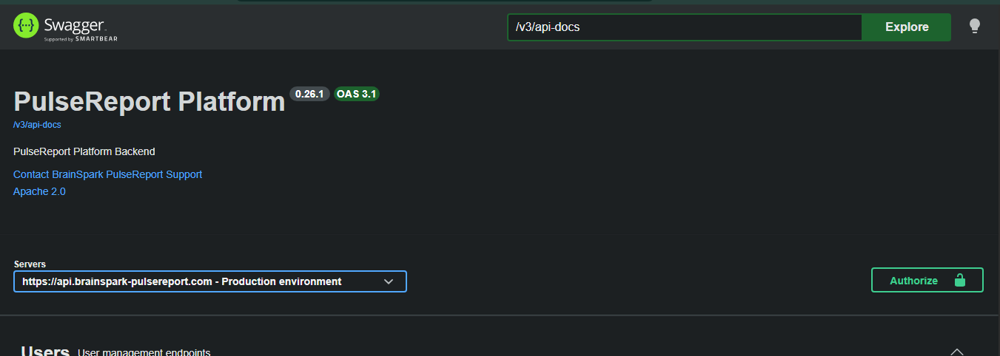
  
  *Interfaz Swagger UI donde se encuentran todos los endpoints disponibles del backend de PulseReport para pruebas y validación.*
  
  ---
  
  ### B. Bounded Context Patients
  
  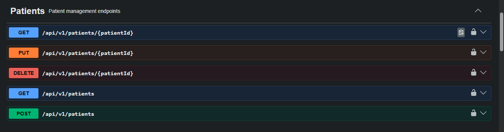
  
  *Primer bounded context con 5 endpoints permitiendo gestionar pacientes en PulseReport.*
  
  ---
  
  ### C. Bounded Context Audit Logs
  
  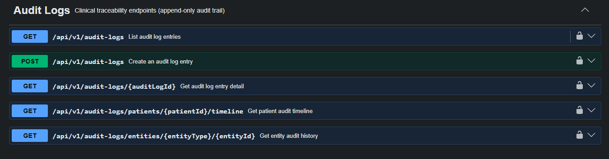
  
  *Segundo bounded context con 5 endpoints para registrar y gestionar acciones médicas dentro del sistema de PulseReport.*
  
  ---
  
  ### D. Bounded Context Handovers
  
  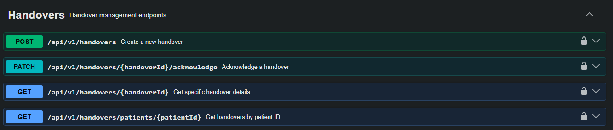
  
  *Tercer bounded context con 4 endpoints que gestionan la transferencia de responsabilidades entre turnos.*
  
  ---
  
  ### E. Bounded Context Vital Signs
  
  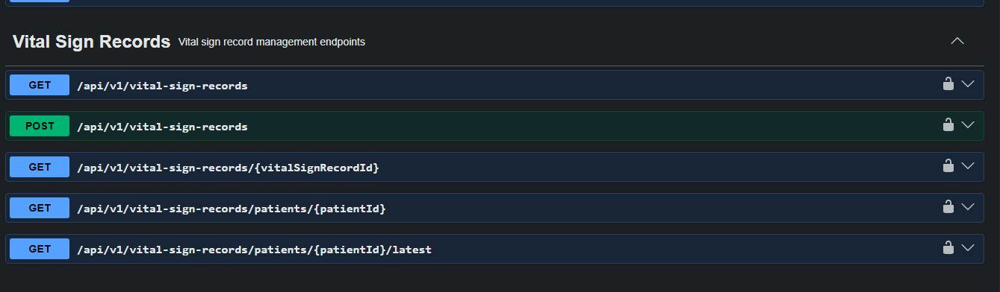
  
  *Cuarto bounded context con 5 endpoints que gestionan el registro de signos vitales de pacientes, permitiendo crear, 
  consultar y actualizar mediciones para el monitoreo continuo de la salud.*
  
  ---
  
  ### F. Bounded Context Alerts
  
  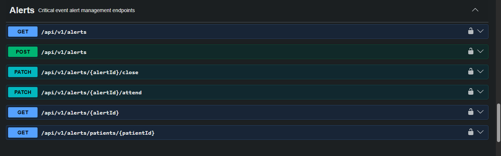
  
  *Quinto bounded context con 6 endpoints gestionar alertas clínicas, incluyendo crear, listar, actualizar y cerrar eventos clinico críticos.*

  ### Video de navegación y visualización del Sprint 3


#### 5.2.3.6. Services Documentation Evidence for Sprint Review

Durante el Sprint 3, el equipo completó la implementación de los servicios backend de PulseReport, exponiendo múltiples endpoints REST para la gestión de información clínica. A diferencia del Sprint anterior, en este caso los servicios fueron completamente funcionales y documentados utilizando Swagger UI, permitiendo su validación en tiempo real.

La documentación de servicios incluyó la definición de rutas, métodos HTTP, estructuras de request/response y pruebas directas desde la interfaz Swagger, facilitando la comprensión y uso de la API por parte de los integrantes del equipo.

**Documentación de endpoints (Swagger UI):**

Acceso local: http://localhost:8080/swagger-ui.html


### Endpoints implementados

**Pacientes (Patients)**

GET /patients
GET /patients/{id}
POST /patients
PUT /patients/{id}

**Signos Vitales (Vital Signs)**
POST /vital-sign-records
GET /vital-sign-records/{patientId}
GET /vital-sign-records/latest/{patientId}

**Auditoría (Audit Logs)**
POST /audit-logs

**Handover Clínico**
POST /handovers
GET /handovers/{id}
GET /handovers/patient/{patientId}
PUT /handovers/{id}/acknowledge

**Eventos Críticos (Critical Events)**
GET /critical-events/patient/{patientId}
PUT /critical-events/{id}/attend
PUT /critical-events/{id}/close


### Evidencia de documentación en Swagger


*Documentación de endpoints en Swagger UI mostrando los servicios organizados por bounded context.*


### Características de la documentación

* **Exploración interactiva**: Permite ejecutar endpoints directamente desde la interfaz.
* **Visualización de contratos API**: Muestra request bodies, parámetros y respuestas esperadas.
* **Separación por módulos**: Endpoints organizados según bounded contexts del sistema.
* **Validación en tiempo real**: Pruebas funcionales sin necesidad de herramientas externas.


### Beneficios obtenidos

* Facilita la integración frontend-backend.
* Permite detectar errores rápidamente durante el desarrollo.
* Mejora la comprensión del sistema por parte del equipo.
* Proporciona evidencia clara del funcionamiento del backend.

#### 5.2.3.7. Software Deployment Evidence for Sprint Review

Durante el Sprint 3, el equipo realizó el despliegue del backend de PulseReport en entorno local, permitiendo la ejecución y validación de todos los servicios REST desarrollados. Se utilizó Spring Boot como framework principal y MySQL como base de datos, asegurando la persistencia de la información clínica.

El despliegue se orientó a pruebas funcionales mediante Swagger UI, lo que permitió validar todos los endpoints implementados en tiempo real.


### Pasos realizados para el despliegue

1. **Configuración del entorno backend:**
   - Se utilizó Java (JDK 17+) y Maven Wrapper (`mvnw`) para la ejecución del proyecto.
   - Se configuraron perfiles de entorno (`application-dev.properties`) para manejar credenciales locales de base de datos.
   - Se estableció conexión con MySQL en entorno local.

2. **Ejecución del backend:**
   - Se ejecutó el comando:
     ```
     ./mvnw spring-boot:run
     ```
   - El servidor se levantó en el puerto 8080 utilizando Tomcat embebido.

3. **Configuración de base de datos:**
   - Se utilizó MySQL con una base de datos local (`pulsereport_platform`).
   - Hibernate se encargó de la generación automática de tablas.
   - Se validó la persistencia de datos mediante pruebas de endpoints.

4. **Validación mediante Swagger:**
   - Se accedió a la documentación en:
     ```
     http://localhost:8080/swagger-ui.html
     ```
   - Se ejecutaron pruebas de endpoints como:
     - Registro de signos vitales
     - Consulta de pacientes
     - Auditoría de acciones
     - Gestión de eventos críticos


### Evidencia del despliegue


*Aplicación backend ejecutándose correctamente en entorno local mostrando logs de Spring Boot.*


*Swagger UI mostrando los endpoints disponibles tras el despliegue del backend.*


### Resultados del despliegue

* El backend se ejecutó correctamente sin errores críticos.
* Todos los endpoints fueron accesibles desde Swagger.
* Se logró persistencia real de datos en MySQL.
* Se validó la integración entre múltiples bounded contexts.
* El sistema quedó listo para integración con frontend en futuros sprints.


El despliegue del backend en entorno local permitió validar el correcto funcionamiento de todos los servicios desarrollados durante el Sprint 3. Esta etapa fue clave para asegurar la estabilidad del sistema y preparar la base para futuras integraciones y despliegues en entornos productivos.

#### 5.2.3.8. Team Collaboration Insights during Sprint

<p align="center">
  
</p>

Durante el Sprint 3, el equipo mantuvo una colaboración activa y organizada enfocada en el desarrollo del backend de PulseReport. Se trabajó utilizando ramas por funcionalidad (feature branches), lo que permitió a cada integrante desarrollar su bounded context de manera independiente sin afectar el trabajo de los demás.

La comunicación se realizó principalmente a través de Discord, donde se coordinaron tareas, se resolvieron bloqueos técnicos y se realizaron revisiones rápidas de avances. Asimismo, se utilizaron pull requests para integrar los cambios al branch principal, asegurando control de calidad y evitando conflictos en el código.

Se evidenció una distribución clara de responsabilidades:
- Un integrante enfocado en **signos vitales**
- Otro en **pacientes**
- Otro en **handover clínico**
- Otro en **eventos críticos y auditoría**

Esto permitió avanzar en paralelo y cubrir múltiples funcionalidades en el mismo sprint.

Los commits reflejan participación activa de todos los integrantes, con múltiples integraciones y releases progresivos (v0.15.0, v0.16.0, v0.17.0), lo que demuestra un flujo de trabajo continuo y bien estructurado.


### Principales aprendizajes del equipo

* **Trabajo en paralelo**: Uso efectivo de ramas para evitar bloqueos entre integrantes.
* **Integración continua**: Uso de merge y releases frecuentes para mantener estabilidad.
* **Comunicación efectiva**: Resolución rápida de problemas mediante coordinación constante.
* **Buenas prácticas de desarrollo**: Uso de commits descriptivos, separación de responsabilidades y estructura clara del proyecto.


### Conclusión

El Sprint 3 evidenció una mejora significativa en la organización y colaboración del equipo, logrando integrar múltiples módulos del backend de manera eficiente. La adopción de buenas prácticas de desarrollo y comunicación permitió cumplir con los objetivos del sprint y entregar un sistema funcional, estable y bien estructurado.

## 5.3. Validation Interviews

En esta sección se describen las entrevistas de validación realizadas con usuarios pertenecientes a los segmentos objetivo de PulseReport. Estas entrevistas tuvieron como propósito evaluar la interacción de los usuarios con el Landing Page y con las funcionalidades del sistema, obteniendo retroalimentación sobre usabilidad, comprensión y valor percibido.

Las entrevistas fueron registradas en video como evidencia y se analizaron en base a tareas asignadas durante la sesión.

---

### 5.3.1. Diseño de Entrevistas

Se definieron los siguientes segmentos objetivo:

- Segmento 1: Personal de salud (médicos/enfermeros)
- Segmento 2: Usuarios con interés en soluciones digitales clínicas

---

#### Elementos evaluados

Durante la sesión de validación, los usuarios interactuaron con:

- Landing Page de PulseReport
- Documentación de endpoints mediante Swagger UI
- Flujo de registro y consulta de signos vitales

---

#### User Flows evaluados

1. Navegación del Landing Page
2. Comprensión de la propuesta de valor
3. Interpretación de funcionalidades del sistema
4. Simulación de uso del sistema (explicación de endpoints)
5. Percepción de utilidad en contexto real

---

#### Estructura de la entrevista

1. Introducción al proyecto
2. Exploración del Landing Page
3. Explicación del sistema (backend)
4. Tareas guiadas
5. Preguntas de validación

---
#### Guion de preguntas por segmento objetivo

Para asegurar una validación adecuada, se diseñaron guiones de preguntas específicos para cada segmento objetivo, considerando su contexto de uso y relación con el sistema.

---

### Segmento 1: Personal de salud (Enfermeros)

**Objetivo:**  
Evaluar la utilidad del sistema en el registro y consulta de información clínica, así como la claridad de las funcionalidades relacionadas a signos vitales.

**Preguntas – Landing Page:**
- ¿Qué entiendes que hace esta plataforma?
- ¿Te queda claro el problema que busca resolver?
- ¿Consideras que la información presentada es relevante para tu trabajo?
- ¿Qué sección te parece más útil o importante?

**Preguntas – Sistema (flujo funcional):**
- ¿Crees que este sistema facilitaría el registro de signos vitales?
- ¿Te parece claro cómo se registra la información del paciente?
- ¿Consideras útil poder consultar el último registro de signos vitales?
- ¿Qué tan fácil crees que sería usar este sistema en tu rutina diaria?

**Preguntas – Experiencia de usuario:**
- ¿Te resulta intuitiva la forma en que se presenta la información?
- ¿Qué mejorarías en el sistema?
- ¿Usarías esta herramienta en tu entorno laboral?

---

### Segmento 2: Personal de salud (Médicos)

**Objetivo:**  
Evaluar la utilidad del sistema en la toma de decisiones clínicas y consulta rápida de información del paciente.

**Preguntas – Landing Page:**
- ¿El landing page transmite claramente el propósito del sistema?
- ¿Te parece relevante la solución presentada para el entorno clínico?
- ¿Qué mejorarías en la forma en que se presenta la información?

**Preguntas – Sistema (flujo funcional):**
- ¿Te resulta útil poder consultar rápidamente los signos vitales de un paciente?
- ¿Consideras importante acceder al último registro clínico?
- ¿La información presentada te parece suficiente para apoyar decisiones médicas?
- ¿Qué otras funcionalidades agregarías?

**Preguntas – Experiencia de usuario:**
- ¿La interfaz te parece clara y comprensible?
- ¿Qué tan útil consideras el sistema en tu práctica médica?
- ¿Qué mejorarías para hacerlo más eficiente?

---

### Segmento 3: Usuarios generales / interesados en tecnología

**Objetivo:**  
Evaluar la comprensión general del sistema y la claridad de la propuesta de valor.

**Preguntas – Landing Page:**
- ¿Qué entiendes que hace este sistema?
- ¿Te parece clara la propuesta de valor?
- ¿El diseño te parece atractivo?

**Preguntas – Sistema:**
- ¿Te resulta fácil entender cómo funciona el sistema?
- ¿Consideras que la solución tiene valor en el sector salud?

**Preguntas – Experiencia de usuario:**
- ¿Te parece fácil de usar?
- ¿Qué mejorarías del sistema?
- ¿Recomendarías esta solución?


### 5.3.2. Registro de Entrevistas

#### Segmento: Usuarios generales / Personal de salud

---

### Entrevista 1
- Nombre: Milagros Mendoza
- Edad: 22
- Distrito: Lima
- Video: https://youtu.be/RMx0DzfhOL0
- Inicio: 00:00
- Duración: 11:55 min
- Screenshot: 

**Resumen:**
El usuario logró identificar correctamente el propósito del sistema. Consideró que el landing page es claro y bien estructurado. Sin embargo, mencionó que algunas funcionalidades técnicas podrían explicarse mejor para usuarios no especializados.

---

### Entrevista 2
- Nombre: Miguel Zevallos
- Edad: 24
- Distrito: Lima
- Video: https://youtu.be/ERz3jkvERR8
- Inicio: 00:00
- Duración: 9:00 min
- Screenshot: 

**Resumen:**
El usuario destacó la organización visual del landing page y la claridad de la información. Indicó que el sistema tiene potencial en entornos clínicos reales. Sugirió mejorar la interfaz para hacerla más intuitiva.

---

### Entrevista 3
- Nombre: Karen Mio
- Edad: 23
- Distrito: Lima
- Video: https://youtu.be/ypqKHHFEOTU
- Inicio: 00:00
- Duración: 8:32 min
- Screenshot: 

**Resumen:**
El usuario comprendió las funcionalidades principales del sistema. Consideró que la solución es innovadora. Recomendó incluir ejemplos prácticos para mejorar la comprensión del sistema.

---

### Entrevista 4
- Nombre: Olenka Rios
- Edad: 25
- Distrito: Lima
- Video: https://youtu.be/Pu3OU6O2b9I
- Inicio: 00:00
- Duración: 9:36 min
- Screenshot:


**Resumen:**
El usuario tuvo una experiencia positiva con el sistema. Destacó la propuesta de valor, pero sugirió optimizar la navegación y simplificar algunos textos.

---

### 5.3.3. Evaluaciones según heurísticas

Se realizó la evaluación basada en heurísticas de usabilidad, arquitectura de información e inclusive design.

---

#### Evaluación heurística (basado en Anexo D)

| # | Heurística | Descripción | Evaluación | Problema identificado | Severidad |
|---|-----------|------------|------------|----------------------|----------|
| 1 | Visibilidad del sistema | El sistema debe comunicar su estado claramente | Alta | No se identificaron problemas graves | Baja |
| 2 | Relación con el mundo real | Uso de lenguaje comprensible | Media | Algunos términos técnicos no claros | Media |
| 3 | Control del usuario | Facilidad de navegación | Media | Navegación puede mejorar | Media |
| 4 | Consistencia | Uniformidad en diseño | Alta | Diseño consistente | Baja |
| 5 | Prevención de errores | Evitar errores del usuario | Media | Falta feedback visual en acciones | Media |
| 6 | Reconocimiento vs memoria | Fácil comprensión visual | Alta | Información clara | Baja |
| 7 | Flexibilidad | Adaptabilidad del sistema | Media | Limitada personalización | Media |
| 8 | Diseño estético | Interfaz atractiva | Alta | Diseño moderno | Baja |

---

### Conclusión de validación

Las entrevistas permitieron validar que PulseReport cumple con comunicar su propuesta de valor y presentar una solución útil para el entorno clínico. No obstante, se identificaron mejoras necesarias en la claridad de algunas funcionalidades, navegación y experiencia de usuario.

El sistema demuestra potencial de aplicación real, especialmente en la gestión de información clínica estructurada.

## 5.4. Video About-the-Product

En esta sección se presenta el video "About the Product", en el cual el equipo muestra el funcionamiento general del sistema PulseReport, explicando su propósito, principales funcionalidades y valor dentro del contexto clínico.

El objetivo del video es evidenciar de manera práctica cómo la solución desarrollada permite mejorar la gestión de información clínica, específicamente en el registro y consulta de signos vitales, facilitando el acceso a datos relevantes para el personal de salud.

---

### Descripción del contenido del video

El video desarrollado incluye los siguientes elementos:

- **Introducción del problema:**  
  Se explica la problemática relacionada a la gestión manual o poco estructurada de la información clínica, especialmente en el registro de signos vitales.

- **Presentación de la solución:**  
  Se introduce PulseReport como una herramienta que busca digitalizar y estructurar la información clínica, mejorando la accesibilidad y organización de los datos.

- **Demostración del Landing Page:**  
  Se muestra la interfaz del landing page, destacando la propuesta de valor, funcionalidades principales y secciones informativas del producto.

- **Demostración del sistema (backend):**  
  Se realiza una demostración utilizando Swagger UI, donde se evidencian los principales endpoints implementados:
  - Registro de signos vitales
  - Consulta de registros por paciente
  - Obtención del último registro clínico

- **Explicación de funcionalidades clave:**  
  Se explica cómo cada endpoint contribuye a resolver el problema identificado, facilitando el trabajo del personal de salud.

- **Conclusión del equipo:**  
  Se resume el impacto de la solución y su potencial aplicación en entornos reales.

---

### Enlace del video

El video "About the Product" se encuentra disponible en el siguiente enlace:
Youtube: [https://youtu.be/3A5RHi0I9Y0]

Upc:[https://upcedupe-my.sharepoint.com/:v:/g/personal/u202217893_upc_edu_pe/IQAYdJDORBeKRLUWSeZyVdoNAbQq78Aig73g8Ok6sZhPcbA?e=5Ar5CS&nav=eyJyZWZlcnJhbEluZm8iOnsicmVmZXJyYWxBcHAiOiJTdHJlYW1XZWJBcHAiLCJyZWZlcnJhbFZpZXciOiJTaGFyZURpYWxvZy1MaW5rIiwicmVmZXJyYWxBcHBQbGF0Zm9ybSI6IldlYiIsInJlZmVycmFsTW9kZSI6InZpZXcifX0%3D]

---

### Conclusión

El video permite validar el funcionamiento del sistema desarrollado, mostrando evidencia real de las funcionalidades implementadas durante el proyecto. Asimismo, refuerza la propuesta de valor de PulseReport, evidenciando su utilidad en la gestión de información clínica y su potencial uso en escenarios reales.
#### Conclusiones

1. **Concluimos, que el desarrollo de PulseReport ha demostrado el potencial transformador de las tecnologías web en la mejora de los procesos de enfermería cardiovascular, facilitando la digitalización de registros de signos vitales, traspasos SBAR y eventos clínicos, lo que contribuye a reducir errores médicos y mejorar la continuidad del cuidado paciente.**

2. **También concluimos que la
3. aplicación de Scrum en el proyecto ha permitido una entrega iterativa y colaborativa, adaptándose a los requerimientos cambiantes del dominio clínico y asegurando que el producto final se alinee con las necesidades reales de los usuarios finales, como enfermeras y médicos especialistas.**

4. **Por último, a través del proyecto, el equipo ha fortalecido sus habilidades en desarrollo frontend con Angular, gestión de proyectos open-source y colaboración en entornos distribuidos, sentando las bases para futuras contribuciones en el ámbito de la salud digital y el software libre.**

#### Bibliografía

Pressman, R. S., & Maxim, B. R. (2020). Software Engineering: A Practitioner’s Approach (9th ed.). McGraw-Hill Education.
Angular. (2026). Angular.dev. Retrieved from https://angular.dev/overview

#### Anexos
- Link de la organización de GitHub: https://github.com/BrainSpark-upc
- Link del repositorio del reporte: https://github.com/BrainSpark-upc/Report
- Link de la landing page desplegada: https://brainspark-upc.github.io/Landing-Page/#funciona

